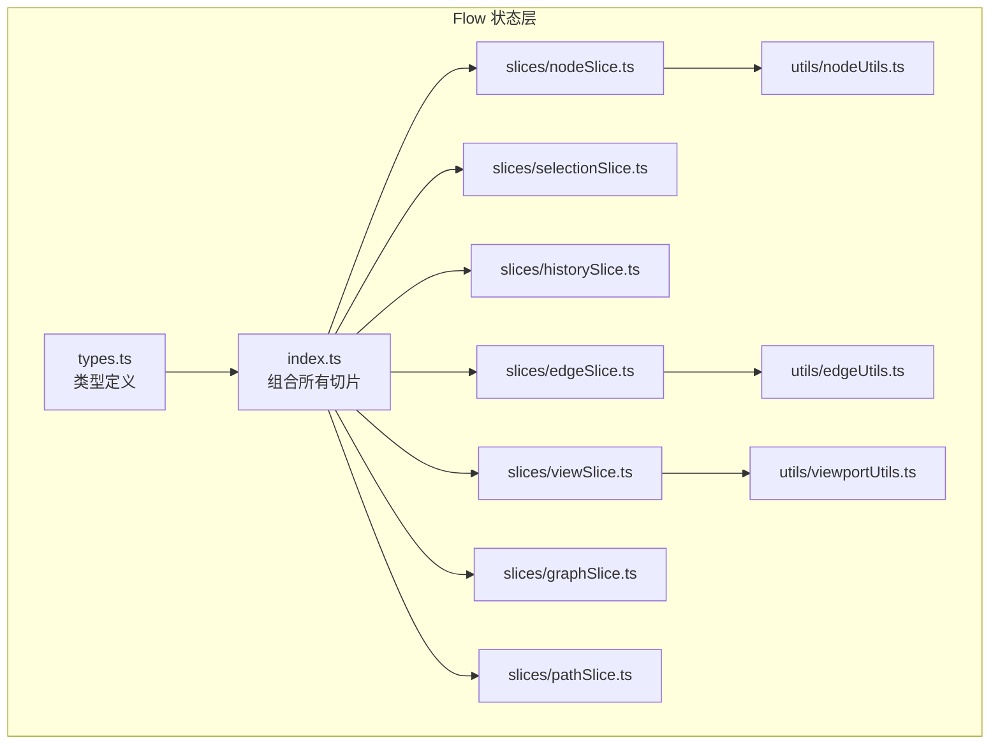
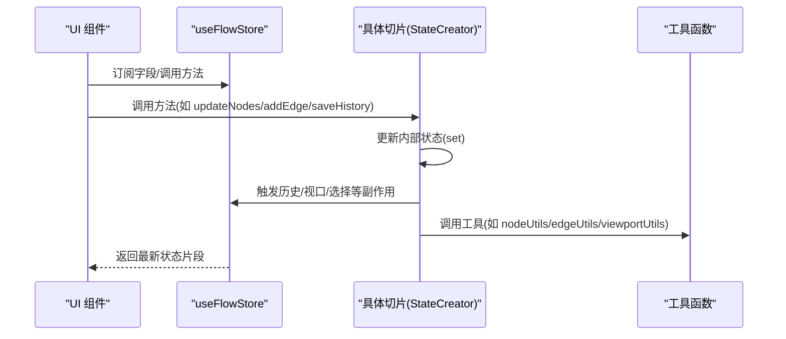
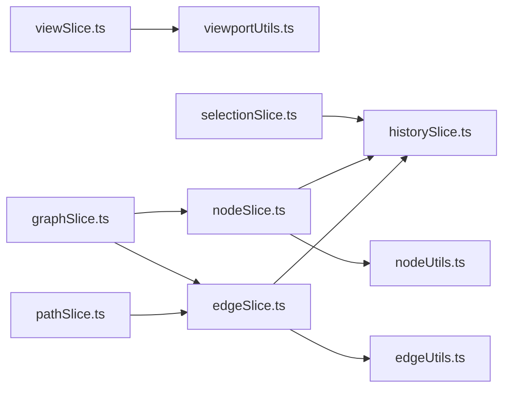
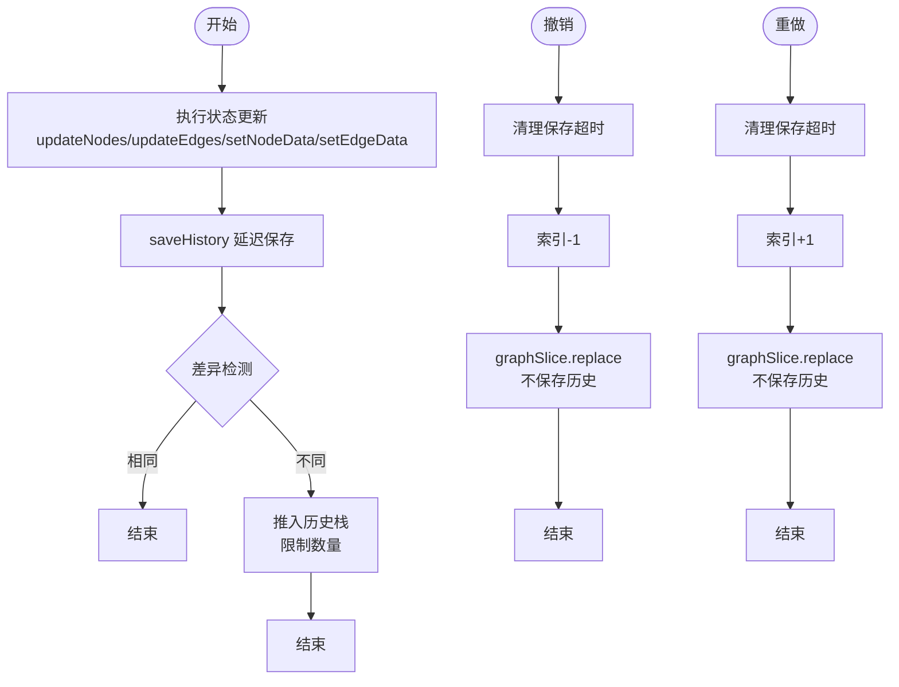

# 状态管理类型

<cite>
**本文引用的文件**
- [src/stores/flow/types.ts](file://src/stores/flow/types.ts)
- [src/stores/flow/index.ts](file://src/stores/flow/index.ts)
- [src/stores/flow/slices/viewSlice.ts](file://src/stores/flow/slices/viewSlice.ts)
- [src/stores/flow/slices/selectionSlice.ts](file://src/stores/flow/slices/selectionSlice.ts)
- [src/stores/flow/slices/historySlice.ts](file://src/stores/flow/slices/historySlice.ts)
- [src/stores/flow/slices/nodeSlice.ts](file://src/stores/flow/slices/nodeSlice.ts)
- [src/stores/flow/slices/edgeSlice.ts](file://src/stores/flow/slices/edgeSlice.ts)
- [src/stores/flow/slices/graphSlice.ts](file://src/stores/flow/slices/graphSlice.ts)
- [src/stores/flow/slices/pathSlice.ts](file://src/stores/flow/slices/pathSlice.ts)
- [src/stores/flow/utils/nodeUtils.ts](file://src/stores/flow/utils/nodeUtils.ts)
- [src/stores/flow/utils/edgeUtils.ts](file://src/stores/flow/utils/edgeUtils.ts)
- [src/stores/flow/utils/viewportUtils.ts](file://src/stores/flow/utils/viewportUtils.ts)
- [src/components/Flow.tsx](file://src/components/Flow.tsx)
- [src/components/flow/nodes/utils/nodeOperations.tsx](file://src/components/flow/nodes/utils/nodeOperations.tsx)
</cite>

## 目录
1. [简介](#简介)
2. [项目结构](#项目结构)
3. [核心组件](#核心组件)
4. [架构总览](#架构总览)
5. [详细组件分析](#详细组件分析)
6. [依赖分析](#依赖分析)
7. [性能考虑](#性能考虑)
8. [故障排查指南](#故障排查指南)
9. [结论](#结论)
10. [附录](#附录)

## 简介
本文件围绕状态管理类型进行深入技术文档编写，重点覆盖以下状态切片的设计与职责：FlowViewState、FlowSelectionState、FlowHistoryState、FlowNodeState、FlowEdgeState、FlowGraphState、FlowPathState。文档将阐明每个状态切片的属性、方法与生命周期；梳理状态之间的依赖关系与数据流转机制；给出状态更新、同步与恢复的实际操作流程；并解释基于 Zustand 的类型安全实现与状态订阅机制。

## 项目结构
Flow 状态管理位于前端 src/stores/flow 目录下，采用“单一 store + 多个 slice”的组织方式：
- types.ts 定义了节点、边、视口、参数等核心类型以及各 slice 的接口
- index.ts 组合并导出 FlowStore 类型与工具函数
- slices/* 定义各个状态切片（view、selection、history、node、edge、graph、path）
- utils/* 提供节点、边、视口等工具函数

图表来源
- [src/stores/flow/types.ts:245-362](file://src/stores/flow/types.ts#L245-L362)
- [src/stores/flow/index.ts:15-24](file://src/stores/flow/index.ts#L15-L24)

章节来源
- [src/stores/flow/types.ts:245-362](file://src/stores/flow/types.ts#L245-L362)
- [src/stores/flow/index.ts:15-24](file://src/stores/flow/index.ts#L15-L24)

## 核心组件
- FlowStore：由多个切片合并而成的统一状态接口，包含视口、选择、历史、节点、边、图、路径等能力
- 各切片：各自维护独立的状态与方法，通过 Zustand 的 create 与 StateCreator 组合
- 工具模块：提供节点创建、边排序、视口适配等辅助能力

章节来源
- [src/stores/flow/types.ts:354-362](file://src/stores/flow/types.ts#L354-L362)
- [src/stores/flow/index.ts:15-24](file://src/stores/flow/index.ts#L15-L24)

## 架构总览
FlowStore 通过 Zustand 的 create 组合多个 StateCreator，形成一个可订阅、可更新的全局状态容器。UI 层通过 useFlowStore 订阅所需字段，事件回调直接调用对应切片的方法，从而驱动状态变化与副作用（如历史记录、视口适配、节点/边更新）。

图表来源
- [src/stores/flow/index.ts:16-24](file://src/stores/flow/index.ts#L16-L24)
- [src/stores/flow/slices/nodeSlice.ts:44-130](file://src/stores/flow/slices/nodeSlice.ts#L44-L130)
- [src/stores/flow/slices/edgeSlice.ts:24-61](file://src/stores/flow/slices/edgeSlice.ts#L24-L61)
- [src/stores/flow/slices/historySlice.ts:49-108](file://src/stores/flow/slices/historySlice.ts#L49-L108)

## 详细组件分析

### FlowViewState（视口状态）
- 职责：维护 ReactFlow 实例、视口状态与画布尺寸
- 关键属性
  - instance: ReactFlowInstance | null
  - viewport: Viewport
  - size: { width, height }
- 关键方法
  - updateInstance(instance: ReactFlowInstance): void
  - updateViewport(viewport: Viewport): void
  - updateSize(width: number, height: number): void
- 生命周期
  - 初始化：instance 默认 null，viewport 初始为 { x: 0, y: 0, zoom: 1 }，size 为 { 0, 0 }
  - 更新：实例与视口变化由 UI 监听器触发，工具函数负责规范化与适配
- 依赖关系
  - 依赖 @xyflow/react 的类型与工具
  - 与 viewportUtils 配合进行视口适配
- 使用示例
  - UI 监听器在挂载时设置 instance
  - 视口变化监听器在 onEnd 时调用 updateViewport，并持久化到文件配置

章节来源
- [src/stores/flow/slices/viewSlice.ts:5-27](file://src/stores/flow/slices/viewSlice.ts#L5-L27)
- [src/stores/flow/types.ts:247-255](file://src/stores/flow/types.ts#L247-L255)
- [src/stores/flow/utils/viewportUtils.ts:21-52](file://src/stores/flow/utils/viewportUtils.ts#L21-L52)
- [src/components/Flow.tsx:95-115](file://src/components/Flow.tsx#L95-L115)

### FlowSelectionState（选择状态）
- 职责：维护当前选中的节点/边、目标节点与防抖后的选择状态
- 关键属性
  - selectedNodes: NodeType[]
  - selectedEdges: EdgeType[]
  - targetNode: NodeType | null
  - debouncedSelectedNodes/Edges/TargetNode: 防抖版本
  - debounceTimeouts: 记录防抖定时器
- 关键方法
  - updateSelection(nodes: NodeType[], edges: EdgeType[]): void
  - setTargetNode(node: NodeType | null): void
  - clearSelection(): void
- 生命周期
  - 初始化：空选择，目标节点为空
  - 更新：updateSelection 内部使用 400ms 防抖，setTargetNode 同步更新防抖目标
  - 清空：clearSelection 清理防抖定时器与所有选择状态
- 依赖关系
  - 与节点/边工具函数配合筛选选中项
  - 与历史切片协作，撤销/重做时清理选中状态
- 使用示例
  - UI 选择变更回调调用 updateSelection
  - 防抖后的 debounced* 字段用于触发本地保存等副作用

章节来源
- [src/stores/flow/slices/selectionSlice.ts:12-99](file://src/stores/flow/slices/selectionSlice.ts#L12-L99)
- [src/stores/flow/types.ts:257-269](file://src/stores/flow/types.ts#L257-L269)
- [src/stores/flow/utils/edgeUtils.ts:12-15](file://src/stores/flow/utils/edgeUtils.ts#L12-L15)

### FlowHistoryState（历史状态）
- 职责：维护历史栈、索引与快照，提供撤销/重做、初始化与清理
- 关键属性
  - historyStack: { nodes, edges }[]
  - historyIndex: number
  - saveTimeout: number | null
  - lastSnapshot: string | null
- 关键方法
  - saveHistory(delay?: number): void
  - undo(): boolean
  - redo(): boolean
  - initHistory(nodes: NodeType[], edges: EdgeType[]): void
  - clearHistory(): void
  - getHistoryState(): { canUndo: boolean; canRedo: boolean }
- 生命周期
  - 初始化：空栈，索引 -1
  - 保存：差异检测（序列化对比），限制栈大小（默认 100），延迟保存（默认 500ms）
  - 撤销/重做：清理保存超时，更新索引，调用 replace 更新图数据（不保存历史）
- 依赖关系
  - 依赖 fastClone 与 serializeState 进行深拷贝与快照
  - 与 graph 切片的 replace 方法协作
- 使用示例
  - 节点/边变更后根据场景调用 saveHistory
  - 用户触发撤销/重做时调用 undo()/redo()

章节来源
- [src/stores/flow/slices/historySlice.ts:37-229](file://src/stores/flow/slices/historySlice.ts#L37-L229)
- [src/stores/flow/types.ts:271-283](file://src/stores/flow/types.ts#L271-L283)

### FlowNodeState（节点状态）
- 职责：管理节点列表、ID 计数器与节点数据更新、分组/解组、粘贴等
- 关键属性
  - nodes: NodeType[]
  - nodeIdCounter: number
- 关键方法
  - updateNodes(changes: NodeChange[]): void
  - addNode(options): void
  - setNodeData(id, type, key, value): void
  - batchSetNodeData(id, updates): void
  - setNodes(nodes: NodeType[]): void
  - resetNodeCounter(): void
  - groupSelectedNodes(): void
  - ungroupNodes(groupId: string): void
  - attachNodeToGroup(nodeId, groupId): void
  - detachNodeFromGroup(nodeId): void
- 生命周期
  - 初始化：空节点列表，计数器从 1 开始
  - 更新：applyNodeChanges 合并变更，处理分组移除时子节点脱离，清理被删节点的选中状态
  - 新增：自动生成不重复 label 与 id，按配置设置 handleDirection，必要时自动连接
  - 数据更新：深拷贝目标节点，按 type 分类更新 recognition/action/others 或类型字段
  - 分组：计算包围盒，创建 Group 节点，确保 Group 在子节点之前
- 依赖关系
  - 依赖 nodeUtils 创建节点、计算位置、检查重复标签、保证分组顺序
  - 依赖 viewportUtils 适配视图
  - 依赖 fileStore 分配/移除节点顺序
- 使用示例
  - UI 节点变更回调调用 updateNodes
  - 右键菜单调用 setNodeData/batchSetNodeData
  - 分组/解组调用 groupSelectedNodes/ungroupNodes/attach/detach

章节来源
- [src/stores/flow/slices/nodeSlice.ts:36-691](file://src/stores/flow/slices/nodeSlice.ts#L36-L691)
- [src/stores/flow/types.ts:285-310](file://src/stores/flow/types.ts#L285-L310)
- [src/stores/flow/utils/nodeUtils.ts:14-185](file://src/stores/flow/utils/nodeUtils.ts#L14-L185)

### FlowEdgeState（边状态）
- 职责：管理边列表、边顺序与边属性更新、新增边与控制点重置
- 关键属性
  - edges: EdgeType[]
  - edgeControlResetKey: number
- 关键方法
  - updateEdges(changes: EdgeChange[]): void
  - setEdgeData(id, key, value): void
  - setEdgeLabel(id, newLabel: number): void
  - addEdge(co: Connection, options?): void
  - setEdges(edges: EdgeType[]): void
  - resetEdgeControls(): void
- 生命周期
  - 初始化：空边列表，控制点重置键为 0
  - 更新：applyEdgeChanges 合并变更，删除边时更新后续边 label
  - 数据更新：attributes 支持增删，value 为 false/undefined/null 时删除属性
  - 新增：冲突检测（next 与 on_error 不能同时指向同一节点），计算链接次序
  - 控制点重置：递增重置键以刷新边控制点
- 依赖关系
  - 依赖 edgeUtils 查找边、筛选选中边、计算链接次序
- 使用示例
  - UI 连接回调调用 addEdge
  - 右键菜单调用 setEdgeData/setEdgeLabel
  - 视图刷新时调用 resetEdgeControls

章节来源
- [src/stores/flow/slices/edgeSlice.ts:16-222](file://src/stores/flow/slices/edgeSlice.ts#L16-L222)
- [src/stores/flow/types.ts:311-322](file://src/stores/flow/types.ts#L311-L322)
- [src/stores/flow/utils/edgeUtils.ts:4-31](file://src/stores/flow/utils/edgeUtils.ts#L4-L31)

### FlowGraphState（图数据状态）
- 职责：替换图数据、批量粘贴、重置粘贴计数器、节点平移
- 关键属性
  - pasteIdCounter: number
- 关键方法
  - replace(nodes, edges, options?): void
  - paste(nodes, edges): void
  - resetPasteCounter(): void
  - shiftNodes(direction, delta, targetNodeIds?): void
- 生命周期
  - 替换：确保 Group 排序，清空选择，可选聚焦视图，可选跳过历史
  - 粘贴：克隆节点/边，生成不重复 id 与 label，处理父子关系与坐标转换，自动加入现有组，分配顺序号，聚焦视图
  - 平移：按基准点与距离比例计算位移增量
- 依赖关系
  - 依赖 nodeUtils 保证分组顺序
  - 依赖 viewportUtils 适配视图
  - 依赖 fileStore 分配顺序号
- 使用示例
  - 导入/替换流程调用 replace
  - 复制粘贴调用 paste
  - 批量对齐调用 shiftNodes

章节来源
- [src/stores/flow/slices/graphSlice.ts:9-305](file://src/stores/flow/slices/graphSlice.ts#L9-L305)
- [src/stores/flow/types.ts:323-339](file://src/stores/flow/types.ts#L323-L339)

### FlowPathState（路径状态）
- 职责：路径模式、起止节点、路径计算与清除
- 关键属性
  - pathMode: boolean
  - pathStartNodeId: string | null
  - pathEndNodeId: string | null
  - pathNodeIds: Set<string>
  - pathEdgeIds: Set<string>
- 关键方法
  - setPathMode(enabled: boolean): void
  - setPathStartNode(nodeId: string | null): void
  - setPathEndNode(nodeId: string | null): void
  - calculatePath(): void
  - clearPath(): void
- 生命周期
  - 初始化：路径模式关闭，起止节点为空，集合为空
  - 计算：构建邻接表，DFS 遍历所有可达路径，收集节点与边集合
  - 清除：重置起止节点与集合
- 依赖关系
  - 依赖 EdgeType 边集合进行遍历
- 使用示例
  - 用户选择起止节点后触发 calculatePath
  - 无路径时自动清空集合

章节来源
- [src/stores/flow/slices/pathSlice.ts:89-159](file://src/stores/flow/slices/pathSlice.ts#L89-L159)
- [src/stores/flow/types.ts:340-353](file://src/stores/flow/types.ts#L340-L353)

## 依赖分析
- 切片间耦合
  - historySlice 与 graphSlice：撤销/重做通过 replace 更新图数据
  - nodeSlice 与 edgeSlice：新增/删除节点/边后均会触发 saveHistory
  - selectionSlice 与 historySlice：撤销/重做时清理选中状态
  - viewSlice 与 viewportUtils：视口适配与规范化
- 外部依赖
  - @xyflow/react：节点/边变更应用、连接、视口适配
  - lodash：深拷贝（粘贴时）
  - 错误存储与配置存储：节点名称重复检查、文件配置读写

图表来源
- [src/stores/flow/slices/viewSlice.ts:1-27](file://src/stores/flow/slices/viewSlice.ts#L1-L27)
- [src/stores/flow/slices/selectionSlice.ts:12-99](file://src/stores/flow/slices/selectionSlice.ts#L12-L99)
- [src/stores/flow/slices/historySlice.ts:37-229](file://src/stores/flow/slices/historySlice.ts#L37-L229)
- [src/stores/flow/slices/nodeSlice.ts:36-691](file://src/stores/flow/slices/nodeSlice.ts#L36-L691)
- [src/stores/flow/slices/edgeSlice.ts:16-222](file://src/stores/flow/slices/edgeSlice.ts#L16-L222)
- [src/stores/flow/slices/graphSlice.ts:9-305](file://src/stores/flow/slices/graphSlice.ts#L9-L305)
- [src/stores/flow/slices/pathSlice.ts:89-159](file://src/stores/flow/slices/pathSlice.ts#L89-L159)
- [src/stores/flow/utils/nodeUtils.ts:14-185](file://src/stores/flow/utils/nodeUtils.ts#L14-L185)
- [src/stores/flow/utils/edgeUtils.ts:4-31](file://src/stores/flow/utils/edgeUtils.ts#L4-L31)
- [src/stores/flow/utils/viewportUtils.ts:21-52](file://src/stores/flow/utils/viewportUtils.ts#L21-L52)

## 性能考虑
- 历史记录节流
  - saveHistory 默认 500ms 延迟，避免频繁快照
  - 撤销/重做前清理保存超时，减少重复计算
- 快照与克隆
  - serializeState 仅序列化必要字段，避免 UI 状态污染
  - fastClone 优先使用 structuredClone，降级到 JSON 方案
- 变更批处理
  - applyNodeChanges/applyEdgeChanges 一次性合并变更，降低多次渲染
- 防抖策略
  - 选择状态 400ms 防抖，减少本地保存频率
- 视口适配
  - fitFlowView 使用 100ms 延迟，避免与 React 渲染竞争

## 故障排查指南
- 节点名称重复
  - 现象：出现重复 label 报错
  - 处理：调用检查函数，错误存储会收集重复 label 并展示
  - 触发：节点数据更新、批量更新、新增节点
- 边冲突
  - 现象：next 与 on_error 同时指向同一节点导致无法连接
  - 处理：addEdge 内部冲突检测，阻止无效连接
- 撤销/重做后选中状态异常
  - 现象：历史切换后仍保留选中状态
  - 处理：historySlice 在撤销/重做时显式清理选中状态
- 视口未适配
  - 现象：新增节点后视图未聚焦
  - 处理：graphSlice.replace/paste/shiftNodes 后调用 fitFlowView

章节来源
- [src/stores/flow/slices/historySlice.ts:110-148](file://src/stores/flow/slices/historySlice.ts#L110-L148)
- [src/stores/flow/slices/edgeSlice.ts:150-210](file://src/stores/flow/slices/edgeSlice.ts#L150-L210)
- [src/stores/flow/slices/nodeSlice.ts:290-394](file://src/stores/flow/slices/nodeSlice.ts#L290-L394)
- [src/stores/flow/slices/graphSlice.ts:18-50](file://src/stores/flow/slices/graphSlice.ts#L18-L50)

## 结论
本状态管理方案以 Zustand 为核心，通过多切片组合实现清晰的职责分离与强类型约束。各切片围绕节点、边、视口、历史、图数据与路径等维度提供完备的能力，并通过工具函数与 UI 监听器形成稳定的数据流闭环。历史记录、防抖与节流策略有效平衡了交互体验与性能开销。

## 附录

### 类型安全与订阅机制
- 类型安全
  - FlowStore 由多个切片接口合并而成，确保方法签名与状态结构一致
  - TypeScript 严格约束节点/边类型、参数类型与工具函数返回值
- 订阅机制
  - UI 通过 useFlowStore 订阅所需字段，支持 useShallow 优化渲染
  - 切片内部通过 set 更新状态，自动触发订阅者更新
  - 工具函数通过 useFlowStore.getState() 直接读取状态，便于在事件回调中使用

章节来源
- [src/stores/flow/types.ts:354-362](file://src/stores/flow/types.ts#L354-L362)
- [src/stores/flow/index.ts:16-24](file://src/stores/flow/index.ts#L16-L24)
- [src/components/Flow.tsx:193-222](file://src/components/Flow.tsx#L193-L222)

### 实际使用示例（操作流程）

- 状态更新
  - 节点拖拽/删除：UI onNodesChange -> nodeSlice.updateNodes -> saveHistory
  - 边连接：UI onConnect -> edgeSlice.addEdge -> saveHistory
  - 节点数据修改：右键菜单 -> nodeSlice.setNodeData/batchSetNodeData -> saveHistory
  - 边属性修改：右键菜单 -> edgeSlice.setEdgeData -> saveHistory

- 状态同步
  - 选择状态：UI onSelectionChange -> selectionSlice.updateSelection -> 触发防抖
  - 视口状态：UI 监听 onViewportChange -> viewSlice.updateViewport -> 保存到文件配置

- 状态恢复
  - 撤销：historySlice.undo -> 清理保存超时 -> 更新索引 -> graphSlice.replace -> 清理选中
  - 重做：historySlice.redo -> 清理保存超时 -> 更新索引 -> graphSlice.replace -> 清理选中

- 路径计算
  - 设置起止节点 -> pathSlice.calculatePath -> DFS 遍历 -> 更新路径集合
  - 无路径 -> pathSlice.clearPath -> 清空集合

图表来源
- [src/stores/flow/slices/historySlice.ts:49-108](file://src/stores/flow/slices/historySlice.ts#L49-L108)
- [src/stores/flow/slices/historySlice.ts:110-188](file://src/stores/flow/slices/historySlice.ts#L110-L188)
- [src/stores/flow/slices/graphSlice.ts:18-50](file://src/stores/flow/slices/graphSlice.ts#L18-L50)