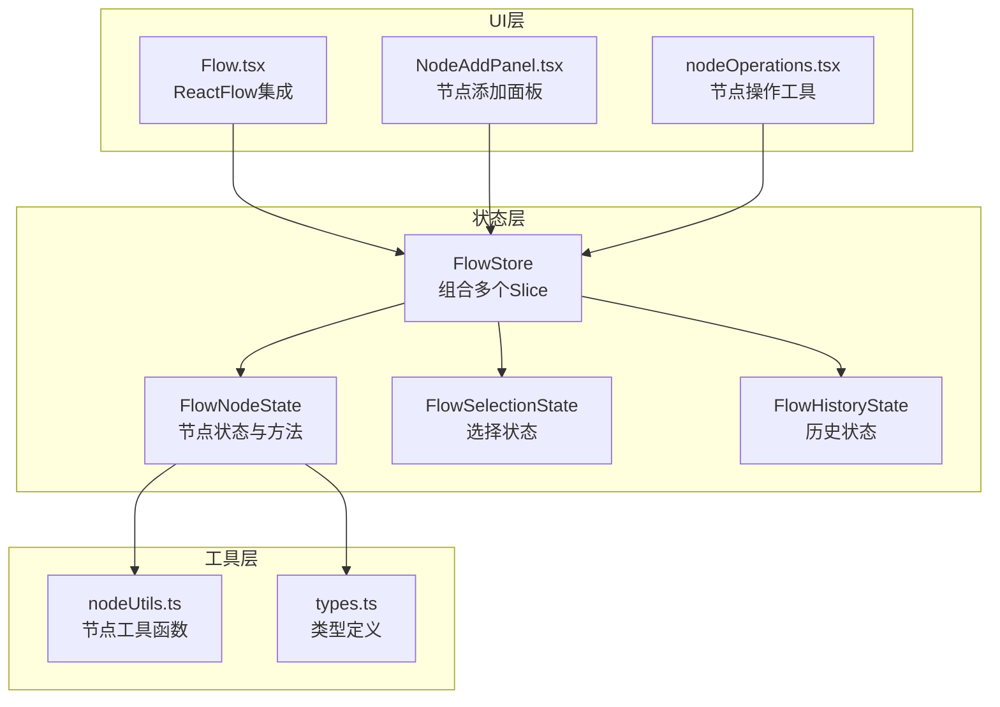
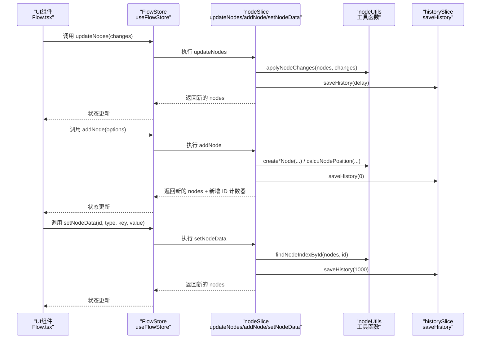
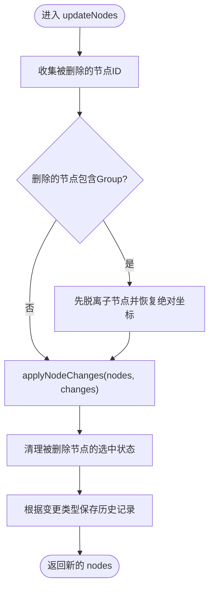
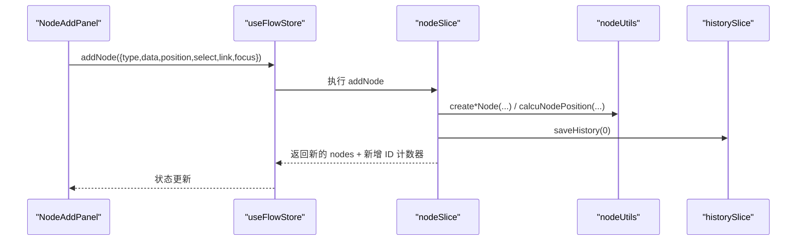
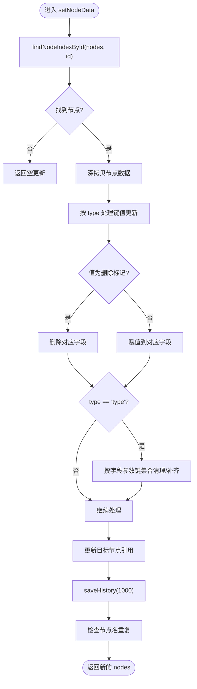
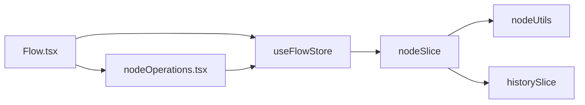

# 节点状态切片

<cite>
**本文档引用的文件**
- [nodeSlice.ts](file://src/stores/flow/slices/nodeSlice.ts)
- [types.ts](file://src/stores/flow/types.ts)
- [nodeUtils.ts](file://src/stores/flow/utils/nodeUtils.ts)
- [Flow.tsx](file://src/components/Flow.tsx)
- [nodeOperations.tsx](file://src/components/flow/nodes/utils/nodeOperations.tsx)
- [index.ts](file://src/stores/flow/index.ts)
</cite>

## 目录
1. [简介](#简介)
2. [项目结构](#项目结构)
3. [核心组件](#核心组件)
4. [架构总览](#架构总览)
5. [详细组件分析](#详细组件分析)
6. [依赖关系分析](#依赖关系分析)
7. [性能考量](#性能考量)
8. [故障排查指南](#故障排查指南)
9. [结论](#结论)
10. [附录](#附录)

## 简介
本文件围绕工作流编辑器中的“节点状态切片”展开，系统性梳理 FlowNodeState 接口的设计与实现，重点覆盖以下方面：
- 节点列表管理与节点 ID 计数器
- 节点操作方法：updateNodes、addNode、setNodeData、batchSetNodeData、setNodes
- 节点数据的批量更新机制与性能优化策略
- 节点状态在工作流编辑中的核心作用：创建、删除、移动、属性修改
- 实际使用示例与最佳实践（含复杂节点操作与状态同步）

## 项目结构
节点状态切片位于前端 Zustand 状态管理模块中，采用多 Slice 组合的方式，其中 FlowNodeState 定义了节点相关的状态与方法，并由 Flow.tsx 等组件通过 useFlowStore 进行消费。

图表来源
- [index.ts:15-24](file://src/stores/flow/index.ts#L15-L24)
- [types.ts:285-361](file://src/stores/flow/types.ts#L285-L361)
- [nodeSlice.ts:36-39](file://src/stores/flow/slices/nodeSlice.ts#L36-L39)
- [Flow.tsx:193-222](file://src/components/Flow.tsx#L193-L222)
- [nodeOperations.tsx:146-149](file://src/components/flow/nodes/utils/nodeOperations.tsx#L146-L149)

章节来源
- [index.ts:15-24](file://src/stores/flow/index.ts#L15-L24)
- [types.ts:285-361](file://src/stores/flow/types.ts#L285-L361)

## 核心组件
- FlowNodeState 接口：定义节点列表 nodes、节点 ID 计数器 nodeIdCounter，以及节点增删改查与分组管理等方法。
- nodeSlice：FlowNodeState 的具体实现，负责节点状态变更、批量更新、分组逻辑、历史记录保存等。
- nodeUtils：提供节点创建、查找、位置计算、分组顺序保证等工具函数。
- Flow.tsx：将 ReactFlow 的节点变更回调与 nodeSlice 的 updateNodes 方法对接，形成完整的编辑闭环。
- nodeOperations：提供复制节点名、保存模板、删除节点、复制识别 JSON 等实用工具。

章节来源
- [types.ts:285-309](file://src/stores/flow/types.ts#L285-L309)
- [nodeSlice.ts:36-691](file://src/stores/flow/slices/nodeSlice.ts#L36-L691)
- [nodeUtils.ts:1-335](file://src/stores/flow/utils/nodeUtils.ts#L1-L335)
- [Flow.tsx:248-262](file://src/components/Flow.tsx#L248-L262)
- [nodeOperations.tsx:146-149](file://src/components/flow/nodes/utils/nodeOperations.tsx#L146-L149)

## 架构总览
节点状态切片通过 Zustand 的 createNodeSlice 将节点状态与方法注入 FlowStore，UI 层通过 useFlowStore 订阅状态并在交互时调用相应方法，实现节点的创建、删除、移动、属性修改与分组管理。

图表来源
- [nodeSlice.ts:44-130](file://src/stores/flow/slices/nodeSlice.ts#L44-L130)
- [nodeSlice.ts:132-288](file://src/stores/flow/slices/nodeSlice.ts#L132-L288)
- [nodeSlice.ts:290-394](file://src/stores/flow/slices/nodeSlice.ts#L290-L394)
- [nodeUtils.ts:16-55](file://src/stores/flow/utils/nodeUtils.ts#L16-L55)
- [Flow.tsx:248-262](file://src/components/Flow.tsx#L248-L262)

## 详细组件分析

### FlowNodeState 接口设计
- 状态字段
  - nodes：节点数组，包含 Pipeline、External、Anchor、Sticker、Group 等类型节点。
  - nodeIdCounter：节点 ID 计数器，用于生成唯一节点 ID。
- 方法职责
  - updateNodes：接收 ReactFlow 的 NodeChange 数组，内部处理删除、位置变更等，返回新的节点列表。
  - addNode：创建新节点，支持类型、初始数据、位置、选择、连接、聚焦等选项。
  - setNodeData：单次更新节点数据，支持 recognition/action/others/type 等字段的更新与校验。
  - batchSetNodeData：批量更新节点数据，一次性应用多个更新，减少多次渲染与历史记录保存。
  - setNodes：直接替换节点列表。
  - resetNodeCounter：重置节点 ID 计数器。
  - groupSelectedNodes/ungroupNodes/attachNodeToGroup/detachNodeFromGroup：分组管理相关方法。

章节来源
- [types.ts:285-309](file://src/stores/flow/types.ts#L285-L309)

### updateNodes：节点变更处理
- 输入：NodeChange[]（来自 ReactFlow 的 onNodesChange 回调）。
- 关键逻辑
  - 收集被删除的节点 ID，若删除的是 Group 节点，则先将其子节点脱离并恢复为绝对坐标。
  - 使用 applyNodeChanges 合并变更，得到新的 nodes。
  - 清理被删除节点的选中状态与目标节点引用。
  - 根据变更类型决定历史记录保存策略：删除立即保存；位置变更按拖拽状态延迟保存。
- 性能与一致性
  - 通过 applyNodeChanges 保证变更原子性。
  - 删除 Group 节点时的子节点脱离避免坐标错乱。

图表来源
- [nodeSlice.ts:44-130](file://src/stores/flow/slices/nodeSlice.ts#L44-L130)

章节来源
- [nodeSlice.ts:44-130](file://src/stores/flow/slices/nodeSlice.ts#L44-L130)

### addNode：节点创建与连接
- 输入：options（type、data、position、select、link、focus）。
- 关键逻辑
  - 生成唯一 ID 与 label，避免重复。
  - 根据类型创建不同节点：Pipeline、External、Anchor、Sticker、Group。
  - 若 link 且满足条件，自动为选中节点与新节点建立连接。
  - 分配节点顺序号，更新选择状态，必要时聚焦视图。
- 与 UI 的衔接
  - Flow.tsx 通过 onDoubleClick/onPaneContextMenu 打开节点添加面板，面板调用 addNode 完成创建。

图表来源
- [nodeSlice.ts:132-288](file://src/stores/flow/slices/nodeSlice.ts#L132-L288)
- [nodeUtils.ts:16-55](file://src/stores/flow/utils/nodeUtils.ts#L16-L55)
- [Flow.tsx:275-294](file://src/components/Flow.tsx#L275-L294)

章节来源
- [nodeSlice.ts:132-288](file://src/stores/flow/slices/nodeSlice.ts#L132-L288)
- [nodeUtils.ts:16-55](file://src/stores/flow/utils/nodeUtils.ts#L16-L55)
- [Flow.tsx:275-294](file://src/components/Flow.tsx#L275-L294)

### setNodeData：单次节点数据更新
- 输入：节点 ID、类型（recognition/action/others/type）、键、值。
- 关键逻辑
  - 深拷贝目标节点，确保不可变更新。
  - 支持删除标记 "__mpe_delete" 删除字段。
  - type 字段会根据字段参数键集合进行字段清理与必填字段补齐。
  - 更新 targetNode（若当前目标节点即为该节点）。
  - 保存历史记录（延迟 1000ms）。
- 与错误与重复检查
  - 更新后检查节点名重复并设置错误状态。

图表来源
- [nodeSlice.ts:290-394](file://src/stores/flow/slices/nodeSlice.ts#L290-L394)

章节来源
- [nodeSlice.ts:290-394](file://src/stores/flow/slices/nodeSlice.ts#L290-L394)

### batchSetNodeData：批量节点数据更新
- 输入：节点 ID、updates 数组（每项包含 type、key、value）。
- 关键逻辑
  - 一次性深拷贝目标节点，应用所有更新，减少中间态渲染。
  - 支持删除标记、type 字段的参数键集合清理与必填字段补齐。
  - 更新 targetNode（若当前目标节点即为该节点）。
  - 保存历史记录（延迟 1000ms）。
- 性能优势
  - 通过单次 set 调用与一次历史记录保存，降低渲染与历史栈压力。

图表来源
- [nodeSlice.ts:401-516](file://src/stores/flow/slices/nodeSlice.ts#L401-L516)

章节来源
- [nodeSlice.ts:401-516](file://src/stores/flow/slices/nodeSlice.ts#L401-L516)

### setNodes：直接替换节点列表
- 输入：NodeType[]。
- 行为：直接替换 nodes，不涉及历史记录保存（由调用方控制）。
- 使用场景：初始化、导入、替换等一次性替换大量节点。

章节来源
- [nodeSlice.ts:396-399](file://src/stores/flow/slices/nodeSlice.ts#L396-L399)

### 分组管理：groupSelectedNodes/ungroupNodes/attachNodeToGroup/detachNodeFromGroup
- groupSelectedNodes：将选中节点创建为 Group，计算包围盒，生成唯一 Group ID，将子节点转为相对坐标。
- ungroupNodes：解散指定 Group，将子节点位置转为绝对坐标并清除 parentId。
- attachNodeToGroup：将节点加入指定 Group，转换为相对坐标。
- detachNodeFromGroup：将节点从 Group 中移出，恢复绝对坐标。
- 顺序保证：ensureGroupNodeOrder 确保 Group 节点在子节点之前，满足 React Flow 的父子顺序要求。

章节来源
- [nodeSlice.ts:518-690](file://src/stores/flow/slices/nodeSlice.ts#L518-L690)
- [nodeUtils.ts:317-335](file://src/stores/flow/utils/nodeUtils.ts#L317-L335)

### 与 UI 的集成与最佳实践
- ReactFlow 集成：Flow.tsx 将 onNodesChange/onEdgesChange/onConnect/onSelectionChange 等回调映射到 useFlowStore 的对应方法，形成编辑闭环。
- 删除节点：nodeOperations.tsx 提供 deleteNode 工具，内部调用 updateNodes([{ type: "remove", id }])。
- 磁吸对齐与拖拽：Flow.tsx 在 onNodeDrag/onNodeDragStop 中结合 nodeUtils 的位置计算与分组检测，实现拖拽时的磁吸与自动分组/脱离。
- 历史记录：各方法在合适时机调用 saveHistory，控制保存频率与延迟，平衡性能与可回退性。

章节来源
- [Flow.tsx:248-262](file://src/components/Flow.tsx#L248-L262)
- [Flow.tsx:296-413](file://src/components/Flow.tsx#L296-L413)
- [nodeOperations.tsx:146-149](file://src/components/flow/nodes/utils/nodeOperations.tsx#L146-L149)

## 依赖关系分析
- FlowStore 由多个 Slice 组合而成，FlowNodeState 依赖 nodeUtils 提供的节点创建、查找、位置计算等工具。
- UI 层通过 useFlowStore 订阅状态并在交互时调用方法，形成单向数据流。
- 历史记录保存由 historySlice 提供，各节点操作方法在合适时机触发保存。

图表来源
- [index.ts:15-24](file://src/stores/flow/index.ts#L15-L24)
- [nodeSlice.ts:36-39](file://src/stores/flow/slices/nodeSlice.ts#L36-L39)
- [nodeUtils.ts:1-335](file://src/stores/flow/utils/nodeUtils.ts#L1-L335)
- [Flow.tsx:193-222](file://src/components/Flow.tsx#L193-L222)
- [nodeOperations.tsx:146-149](file://src/components/flow/nodes/utils/nodeOperations.tsx#L146-L149)

章节来源
- [index.ts:15-24](file://src/stores/flow/index.ts#L15-L24)
- [nodeSlice.ts:36-39](file://src/stores/flow/slices/nodeSlice.ts#L36-L39)

## 性能考量
- 批量更新优先：对于需要连续修改多个字段的场景，优先使用 batchSetNodeData，避免多次渲染与历史记录保存。
- 历史记录延迟：位置拖拽类操作采用延迟保存（如 1000ms），减少频繁快照带来的内存与性能压力。
- 不可变更新：所有更新均深拷贝目标节点，确保状态不可变，便于调试与回放。
- 分组顺序保证：ensureGroupNodeOrder 在分组操作后统一排序，避免 React Flow 的父子顺序问题导致的额外重排。
- 选择状态清理：删除节点时自动清理选中状态与目标节点引用，避免无效引用造成额外渲染。

## 故障排查指南
- 节点名重复：setNodeData/batchSetNodeData 后会检查节点名重复，错误状态由 errorStore 管理。可通过检查重复列表定位冲突节点。
- 分组异常：若出现分组内节点坐标错乱，确认 ensureGroupNodeOrder 是否生效，以及是否存在 parentId 与绝对坐标的混用。
- 删除节点后选中状态残留：检查 updateNodes 是否正确清理 selectedNodes 与 targetNode。
- 磁吸对齐失效：确认 enableNodeSnap 与 snapOnlyInViewport 配置，以及 onNodeDrag/onNodeDragStop 中的过滤逻辑。

章节来源
- [nodeSlice.ts:377-394](file://src/stores/flow/slices/nodeSlice.ts#L377-L394)
- [nodeSlice.ts:518-690](file://src/stores/flow/slices/nodeSlice.ts#L518-L690)
- [Flow.tsx:296-413](file://src/components/Flow.tsx#L296-L413)

## 结论
节点状态切片通过 FlowNodeState 接口与 nodeSlice 的实现，提供了完整的工作流节点生命周期管理能力。其设计强调：
- 不可变更新与原子性变更
- 批量更新与历史记录的合理权衡
- 与 UI 的紧密集成与磁吸对齐等高级交互
- 分组管理的坐标转换与顺序保证

在实际使用中，建议优先采用批量更新、合理控制历史记录保存频率，并在复杂节点操作时配合分组管理与状态同步，以获得更佳的性能与用户体验。

## 附录
- 实际使用示例路径
  - 节点创建：[Flow.tsx:275-294](file://src/components/Flow.tsx#L275-L294)、[NodeAddPanel.tsx:316-330](file://src/components/panels/main/NodeAddPanel.tsx#L316-L330)
  - 节点删除：[nodeOperations.tsx:146-149](file://src/components/flow/nodes/utils/nodeOperations.tsx#L146-L149)
  - 单次属性更新：[nodeSlice.ts:290-394](file://src/stores/flow/slices/nodeSlice.ts#L290-L394)
  - 批量属性更新：[nodeSlice.ts:401-516](file://src/stores/flow/slices/nodeSlice.ts#L401-L516)
  - 分组管理：[nodeSlice.ts:518-690](file://src/stores/flow/slices/nodeSlice.ts#L518-L690)