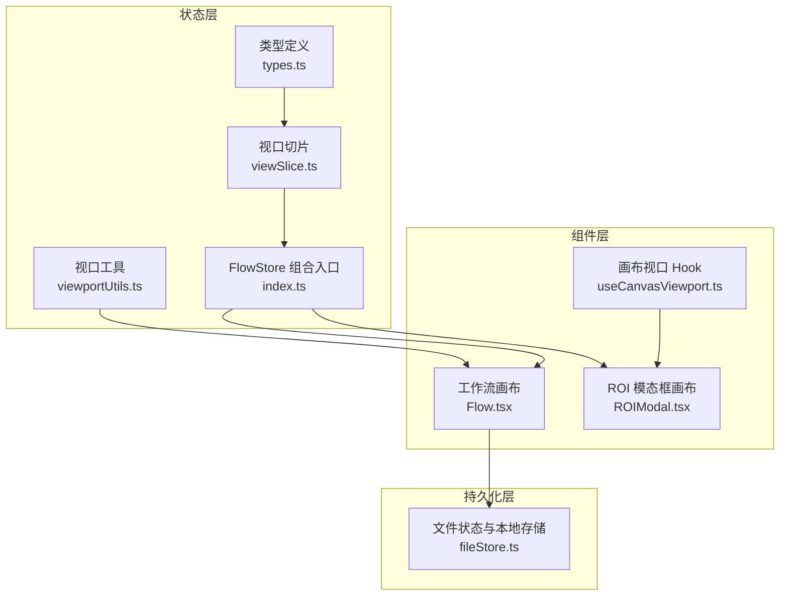
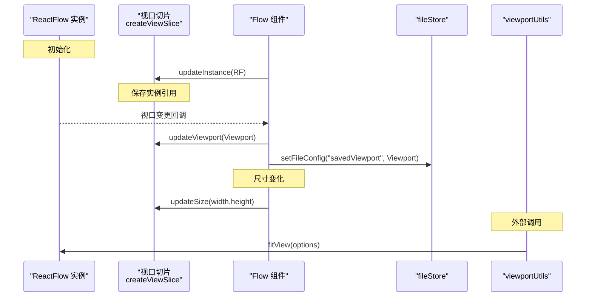
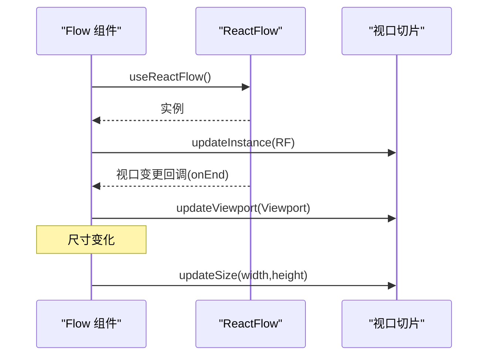
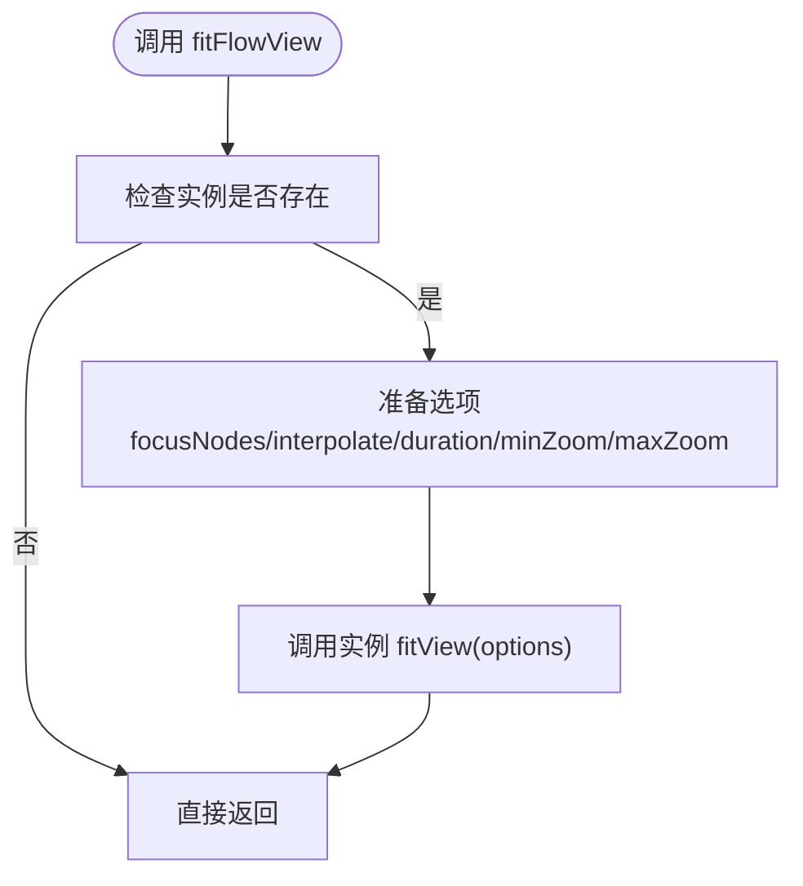
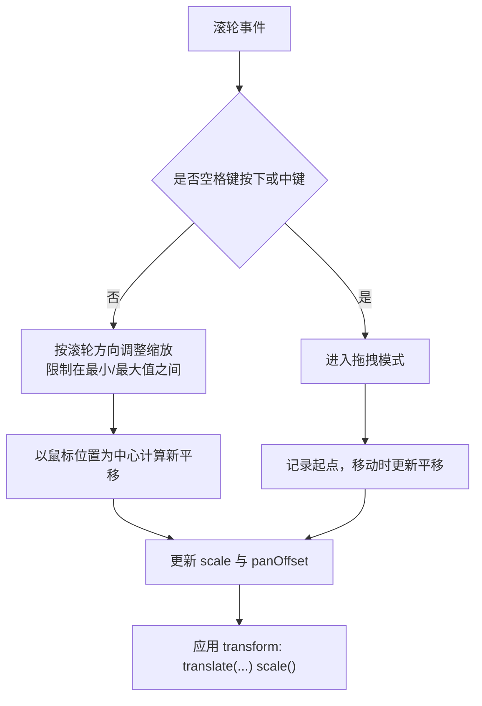
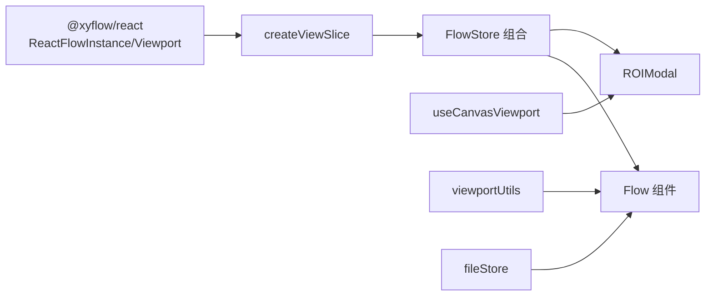

# 视口状态切片

<cite>
**本文引用的文件**
- [viewSlice.ts](file://src/stores/flow/slices/viewSlice.ts)
- [types.ts](file://src/stores/flow/types.ts)
- [viewportUtils.ts](file://src/stores/flow/utils/viewportUtils.ts)
- [index.ts](file://src/stores/flow/index.ts)
- [Flow.tsx](file://src/components/Flow.tsx)
- [useCanvasViewport.ts](file://src/hooks/useCanvasViewport.ts)
- [ROIModal.tsx](file://src/components/modals/ROIModal.tsx)
- [fileStore.ts](file://src/stores/fileStore.ts)
</cite>

## 目录
1. [简介](#简介)
2. [项目结构](#项目结构)
3. [核心组件](#核心组件)
4. [架构总览](#架构总览)
5. [详细组件分析](#详细组件分析)
6. [依赖关系分析](#依赖关系分析)
7. [性能考量](#性能考量)
8. [故障排查指南](#故障排查指南)
9. [结论](#结论)
10. [附录](#附录)

## 简介
本文件围绕“视口状态切片”展开，系统性阐述 FlowViewState 接口的设计与实现，涵盖 ReactFlowInstance 实例管理、Viewport 视口状态、尺寸信息以及更新方法 updateInstance、updateViewport、updateSize 的使用方式与参数要求。同时，结合工作流编辑器中的画布缩放、平移与响应式布局机制，给出视口状态管理的实际使用示例与最佳实践，帮助开发者在复杂交互场景中稳定地维护视口状态。

## 项目结构
视口状态切片位于前端状态管理子系统中，采用 Zustand 的 slice 模式组织，配合工具函数与组件层的集成，形成从状态定义、更新到持久化的完整闭环。



图表来源
- [viewSlice.ts:1-27](file://src/stores/flow/slices/viewSlice.ts#L1-L27)
- [types.ts:247-255](file://src/stores/flow/types.ts#L247-L255)
- [viewportUtils.ts:1-53](file://src/stores/flow/utils/viewportUtils.ts#L1-L53)
- [index.ts:15-24](file://src/stores/flow/index.ts#L15-L24)
- [Flow.tsx:95-115](file://src/components/Flow.tsx#L95-L115)
- [ROIModal.tsx:267-301](file://src/components/modals/ROIModal.tsx#L267-L301)
- [useCanvasViewport.ts:69-306](file://src/hooks/useCanvasViewport.ts#L69-L306)
- [fileStore.ts:227-253](file://src/stores/fileStore.ts#L227-L253)

章节来源
- [viewSlice.ts:1-27](file://src/stores/flow/slices/viewSlice.ts#L1-L27)
- [types.ts:247-255](file://src/stores/flow/types.ts#L247-L255)
- [index.ts:15-24](file://src/stores/flow/index.ts#L15-L24)

## 核心组件
- FlowViewState 接口：定义视口切片的状态与方法签名，包含 ReactFlowInstance 实例、Viewport 视口状态与画布尺寸，并提供三类更新方法。
- createViewSlice：实现状态初始化与更新方法，作为 Zustand 的 StateCreator 注入 FlowStore。
- viewportUtils：提供视口规范化与聚焦视图能力，供组件层调用。
- Flow 组件：负责实例注册、视口变更监听与尺寸更新，贯穿视口状态的生命周期。
- useCanvasViewport Hook：面向 ROI 等独立画布场景的缩放、平移与键盘交互封装。
- fileStore：负责将视口状态持久化到文件配置中，确保用户操作可恢复。

章节来源
- [types.ts:247-255](file://src/stores/flow/types.ts#L247-L255)
- [viewSlice.ts:5-27](file://src/stores/flow/slices/viewSlice.ts#L5-L27)
- [viewportUtils.ts:9-52](file://src/stores/flow/utils/viewportUtils.ts#L9-L52)
- [Flow.tsx:95-115](file://src/components/Flow.tsx#L95-L115)
- [useCanvasViewport.ts:69-306](file://src/hooks/useCanvasViewport.ts#L69-L306)
- [fileStore.ts:227-253](file://src/stores/fileStore.ts#L227-L253)

## 架构总览
视口状态在系统中的流转路径如下：



图表来源
- [Flow.tsx:95-115](file://src/components/Flow.tsx#L95-L115)
- [viewSlice.ts:13-26](file://src/stores/flow/slices/viewSlice.ts#L13-L26)
- [viewportUtils.ts:21-52](file://src/stores/flow/utils/viewportUtils.ts#L21-L52)
- [fileStore.ts:227-253](file://src/stores/fileStore.ts#L227-L253)

## 详细组件分析

### FlowViewState 接口与 createViewSlice
- 状态字段
  - instance: ReactFlowInstance | null，用于保存 ReactFlow 实例引用，便于后续调用 fitView 等方法。
  - viewport: { x: number; y: number; zoom: number }，记录当前视口偏移与缩放。
  - size: { width: number; height: number }，记录画布容器尺寸。
- 方法
  - updateInstance(instance: ReactFlowInstance): 设置实例引用。
  - updateViewport(viewport: Viewport): 更新视口状态。
  - updateSize(width: number, height: number): 更新画布尺寸。

```mermaid
classDiagram
class FlowViewState {
+instance : ReactFlowInstance | null
+viewport : Viewport
+size : { width : number; height : number }
+updateInstance(instance : ReactFlowInstance) void
+updateViewport(viewport : Viewport) void
+updateSize(width : number, height : number) void
}
```

图表来源
- [types.ts:247-255](file://src/stores/flow/types.ts#L247-L255)
- [viewSlice.ts:5-27](file://src/stores/flow/slices/viewSlice.ts#L5-L27)

章节来源
- [types.ts:247-255](file://src/stores/flow/types.ts#L247-L255)
- [viewSlice.ts:5-27](file://src/stores/flow/slices/viewSlice.ts#L5-L27)

### ReactFlow 实例管理与视口变更监听
- 实例注册：Flow 组件通过 useReactFlow 获取实例，并在挂载后调用 updateInstance 注册到状态切片。
- 视口变更：使用 useOnViewportChange 监听视口变化，在 onEnd 阶段调用 updateViewport，并同步保存到文件配置中。
- 尺寸更新：通过 ResizeObserver 监听容器尺寸变化，使用防抖策略调用 updateSize。



图表来源
- [Flow.tsx:95-115](file://src/components/Flow.tsx#L95-L115)
- [Flow.tsx:438-459](file://src/components/Flow.tsx#L438-L459)

章节来源
- [Flow.tsx:95-115](file://src/components/Flow.tsx#L95-L115)
- [Flow.tsx:438-459](file://src/components/Flow.tsx#L438-L459)

### 视口规范化与聚焦视图
- 规范化：normalizeViewport 将视口坐标取整、缩放值保留两位小数，避免浮点误差导致的渲染抖动。
- 聚焦视图：fitFlowView 在延迟后调用实例的 fitView，支持聚焦节点、插值动画与缩放范围控制。



图表来源
- [viewportUtils.ts:21-52](file://src/stores/flow/utils/viewportUtils.ts#L21-L52)

章节来源
- [viewportUtils.ts:9-18](file://src/stores/flow/utils/viewportUtils.ts#L9-L18)
- [viewportUtils.ts:21-52](file://src/stores/flow/utils/viewportUtils.ts#L21-L52)

### 画布缩放、平移与响应式布局
- 缩放与平移（ROI 独立画布）：useCanvasViewport 提供缩放步进、滚轮缩放、空格键拖拽、中键拖拽、初始适配等能力；通过 transform: translate(...) scale() 实现视觉位移与缩放。
- 响应式布局：Flow 组件使用 ResizeObserver 监听容器尺寸变化，防抖后更新 size，保证大屏/小屏切换时画布自适应。



图表来源
- [useCanvasViewport.ts:91-158](file://src/hooks/useCanvasViewport.ts#L91-L158)
- [useCanvasViewport.ts:217-249](file://src/hooks/useCanvasViewport.ts#L217-L249)
- [ROIModal.tsx:267-301](file://src/components/modals/ROIModal.tsx#L267-L301)

章节来源
- [useCanvasViewport.ts:69-306](file://src/hooks/useCanvasViewport.ts#L69-L306)
- [ROIModal.tsx:267-301](file://src/components/modals/ROIModal.tsx#L267-L301)

### 视口状态在工作流编辑器中的作用
- 画布缩放与平移：通过 FlowViewState 的 viewport 字段与 ReactFlow 的视口联动，实现全局缩放与平移；同时在 ROI 等独立场景使用 useCanvasViewport 实现局部画布的缩放与平移。
- 响应式布局：Flow 组件监听容器尺寸变化，及时更新 size，保障不同窗口尺寸下的显示一致性。
- 用户体验：结合键盘与鼠标交互（空格键、中键、滚轮），提供直观的视口操控；通过 fitFlowView 实现节点聚焦与平滑过渡。

章节来源
- [Flow.tsx:438-459](file://src/components/Flow.tsx#L438-L459)
- [viewportUtils.ts:21-52](file://src/stores/flow/utils/viewportUtils.ts#L21-L52)
- [useCanvasViewport.ts:69-306](file://src/hooks/useCanvasViewport.ts#L69-L306)

### 视口状态管理的实际使用示例与最佳实践
- 视口初始化
  - 在 Flow 组件挂载时获取实例并调用 updateInstance，确保后续 fitView 等方法可用。
  - 使用 defaultViewport 设置初始视口，避免首次渲染时的闪烁。
- 状态更新
  - 视口变更：在 onEnd 钩子中调用 updateViewport，并同步 setFileConfig("savedViewport", ...)，实现用户视口偏好持久化。
  - 尺寸更新：使用 ResizeObserver + 防抖策略调用 updateSize，减少频繁重排。
- 事件处理
  - ROI 画布：通过 useCanvasViewport 提供的 startPan/updatePan/endPan 与 transform 控制，实现平滑拖拽与缩放。
  - 键盘与滚轮：统一在 useCanvasViewport 中处理空格键与滚轮事件，避免重复逻辑。
- 最佳实践
  - 规范化视口：在保存前使用 normalizeViewport 对 savedViewport 进行取整与精度处理，避免存储冗余。
  - 聚焦视图：对外暴露 fitFlowView，集中处理聚焦节点与动画参数，提升复用性与一致性。

章节来源
- [Flow.tsx:95-115](file://src/components/Flow.tsx#L95-L115)
- [Flow.tsx:438-459](file://src/components/Flow.tsx#L438-L459)
- [viewportUtils.ts:9-18](file://src/stores/flow/utils/viewportUtils.ts#L9-L18)
- [useCanvasViewport.ts:91-158](file://src/hooks/useCanvasViewport.ts#L91-L158)
- [fileStore.ts:227-253](file://src/stores/fileStore.ts#L227-L253)

## 依赖关系分析
- FlowViewState 依赖 @xyflow/react 的 ReactFlowInstance 与 Viewport 类型。
- createViewSlice 作为 Zustand slice 注入 FlowStore，与其他 slice（如 selection、history、node、edge、graph、path）共同构成完整的 FlowStore。
- viewportUtils 依赖 ReactFlowInstance 与 NodeType，提供聚焦视图能力。
- Flow 组件依赖 useReactFlow、useOnViewportChange、ResizeObserver 与 Zustand 的 useFlowStore。
- useCanvasViewport 与 ROIModal 协同，实现独立画布的缩放与平移。
- fileStore 负责将视口状态持久化到本地存储。



图表来源
- [viewSlice.ts:1-3](file://src/stores/flow/slices/viewSlice.ts#L1-L3)
- [index.ts:15-24](file://src/stores/flow/index.ts#L15-L24)
- [Flow.tsx:13-25](file://src/components/Flow.tsx#L13-L25)
- [ROIModal.tsx:1-12](file://src/components/modals/ROIModal.tsx#L1-L12)
- [useCanvasViewport.ts:1-2](file://src/hooks/useCanvasViewport.ts#L1-L2)
- [viewportUtils.ts:1-2](file://src/stores/flow/utils/viewportUtils.ts#L1-L2)
- [fileStore.ts:227-253](file://src/stores/fileStore.ts#L227-L253)

章节来源
- [viewSlice.ts:1-3](file://src/stores/flow/slices/viewSlice.ts#L1-L3)
- [index.ts:15-24](file://src/stores/flow/index.ts#L15-L24)
- [Flow.tsx:13-25](file://src/components/Flow.tsx#L13-L25)
- [viewportUtils.ts:1-2](file://src/stores/flow/utils/viewportUtils.ts#L1-L2)
- [useCanvasViewport.ts:1-2](file://src/hooks/useCanvasViewport.ts#L1-L2)
- [fileStore.ts:227-253](file://src/stores/fileStore.ts#L227-L253)

## 性能考量
- 防抖更新：Flow 组件对尺寸变化使用防抖策略，降低频繁 setLayout 导致的重排成本。
- 视口规范化：对缩放值保留两位小数，减少不必要的渲染差异。
- 延迟聚焦：fitFlowView 使用延迟调用，避免在大量节点渲染期间阻塞主线程。
- 事件节流：ROI 画布的滚轮缩放与拖拽事件已内置边界与状态控制，避免高频状态更新。

## 故障排查指南
- 实例为空导致 fitView 失败
  - 现象：调用 fitFlowView 或 updateInstance 后无效果。
  - 排查：确认 Flow 组件已正确注册实例（useReactFlow 返回有效实例），并在挂载后调用 updateInstance。
  - 参考
    - [Flow.tsx:95-101](file://src/components/Flow.tsx#L95-L101)
    - [viewportUtils.ts:32-34](file://src/stores/flow/utils/viewportUtils.ts#L32-L34)
- 视口不保存或恢复异常
  - 现象：刷新后视口回到默认值。
  - 排查：确认 onEnd 中调用了 updateViewport，并且 setFileConfig("savedViewport", ...) 成功写入；保存前使用 normalizeViewport 规范化视口。
  - 参考
    - [Flow.tsx:107-112](file://src/components/Flow.tsx#L107-L112)
    - [fileStore.ts:240-243](file://src/stores/fileStore.ts#L240-L243)
- 缩放与平移冲突
  - 现象：空格键拖拽与滚轮缩放行为异常。
  - 排查：确保在 useCanvasViewport 中正确区分空格键与中键状态，避免同时进入多种模式；检查 transform 应用顺序。
  - 参考
    - [useCanvasViewport.ts:91-158](file://src/hooks/useCanvasViewport.ts#L91-L158)
    - [ROIModal.tsx:267-301](file://src/components/modals/ROIModal.tsx#L267-L301)

章节来源
- [Flow.tsx:95-112](file://src/components/Flow.tsx#L95-L112)
- [viewportUtils.ts:32-34](file://src/stores/flow/utils/viewportUtils.ts#L32-L34)
- [fileStore.ts:240-243](file://src/stores/fileStore.ts#L240-L243)
- [useCanvasViewport.ts:91-158](file://src/hooks/useCanvasViewport.ts#L91-L158)
- [ROIModal.tsx:267-301](file://src/components/modals/ROIModal.tsx#L267-L301)

## 结论
视口状态切片通过清晰的接口设计与稳定的更新机制，实现了 ReactFlow 实例管理、视口状态与尺寸信息的统一维护。结合 Flow 组件的实例注册、视口变更监听与尺寸更新，以及 useCanvasViewport 在独立画布场景下的缩放与平移能力，形成了覆盖全局与局部视口控制的完整方案。配合 viewportUtils 的聚焦视图与规范化处理，以及 fileStore 的持久化策略，为工作流编辑器提供了可靠、易用且高性能的视口管理能力。

## 附录
- 方法参数与返回
  - updateInstance(instance: ReactFlowInstance): 无返回，设置实例引用。
  - updateViewport(viewport: Viewport): 无返回，更新视口状态。
  - updateSize(width: number, height: number): 无返回，更新画布尺寸。
- 相关类型
  - ReactFlowInstance、Viewport 来自 @xyflow/react。
  - FlowViewState 定义于 types.ts。