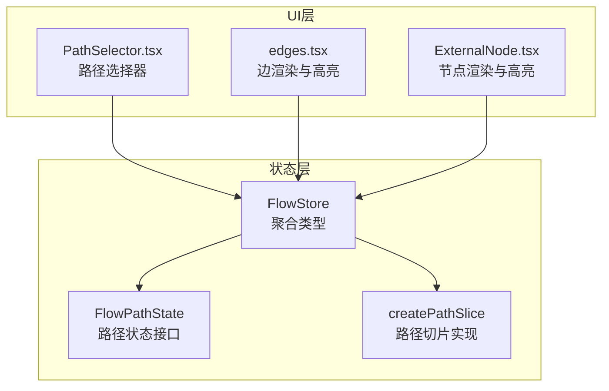
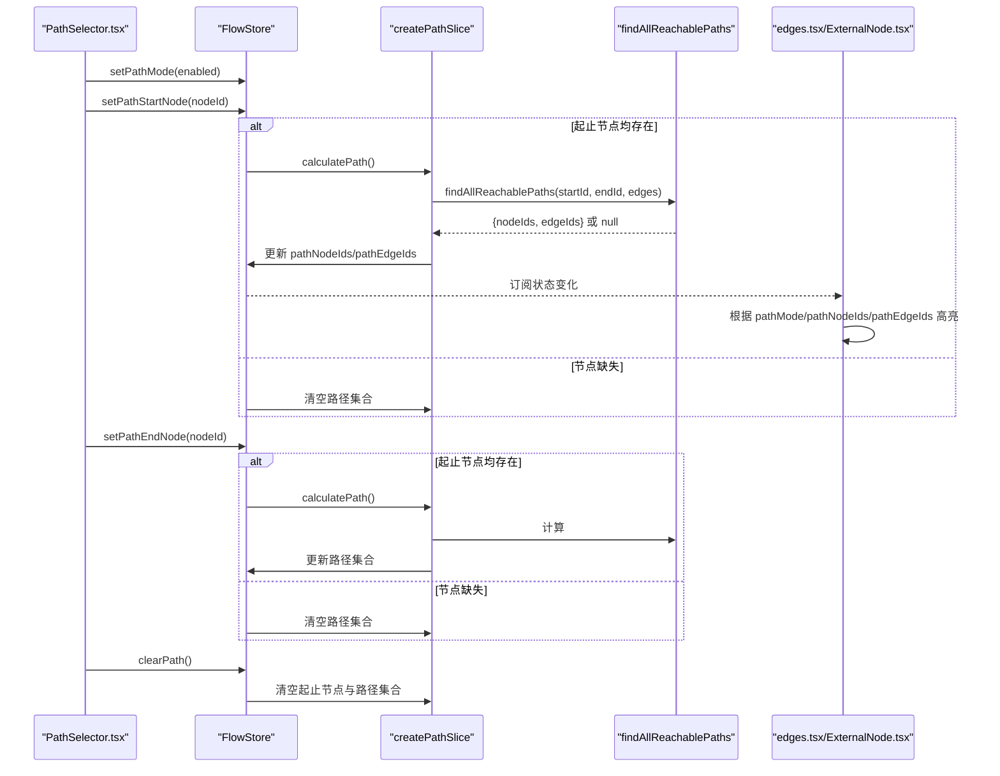
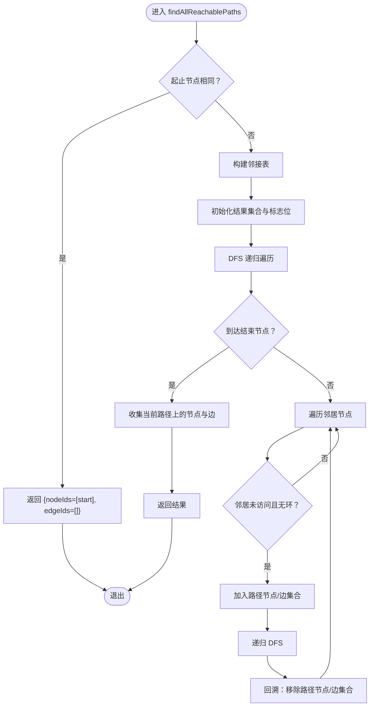
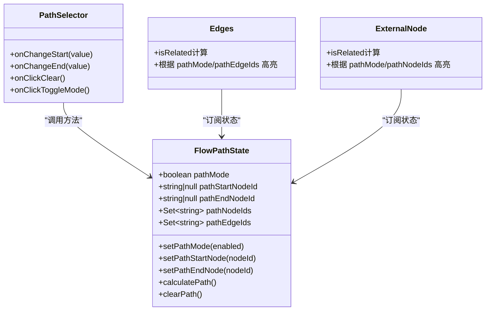
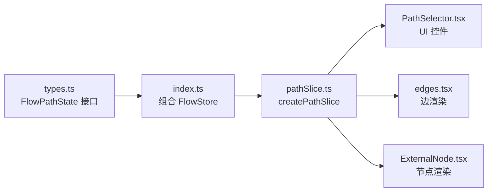

# 路径状态切片

<cite>
**本文引用的文件**
- [pathSlice.ts](file://src/stores/flow/slices/pathSlice.ts)
- [types.ts](file://src/stores/flow/types.ts)
- [PathSelector.tsx](file://src/components/panels/tools/PathSelector.tsx)
- [index.ts](file://src/stores/flow/index.ts)
- [edges.tsx](file://src/components/flow/edges.tsx)
- [ExternalNode.tsx](file://src/components/flow/nodes/ExternalNode.tsx)
</cite>

## 目录
1. [简介](#简介)
2. [项目结构](#项目结构)
3. [核心组件](#核心组件)
4. [架构总览](#架构总览)
5. [详细组件分析](#详细组件分析)
6. [依赖分析](#依赖分析)
7. [性能考虑](#性能考虑)
8. [故障排查指南](#故障排查指南)
9. [结论](#结论)
10. [附录](#附录)

## 简介
本文件围绕“路径状态切片”进行系统化技术文档编写，重点阐释 FlowPathState 接口的设计与实现，涵盖路径模式开关、起始/结束节点设置、路径计算与清除等方法的行为与使用方式；同时深入解析路径计算算法（基于邻接表与深度优先搜索）以及路径节点/边集合的管理机制，并说明路径状态在工作流分析中的作用，包括路径查找、路径高亮与路径验证的实现机制。最后提供实际使用示例与最佳实践建议。

## 项目结构
路径状态切片位于前端状态管理模块中，采用 Zustand 的 slice 模式组织，配合 FlowStore 类型聚合，形成清晰的职责边界：
- FlowPathState 定义于类型文件，描述路径模式、起止节点与路径集合及操作方法
- pathSlice.ts 实现路径状态的初始化与方法逻辑
- PathSelector.tsx 提供用户交互入口，绑定路径状态
- edges.tsx 与 ExternalNode.tsx 展示路径高亮效果
- index.ts 将各 slice 组合为 FlowStore

图表来源
- [types.ts:340-352](file://src/stores/flow/types.ts#L340-L352)
- [pathSlice.ts:89-158](file://src/stores/flow/slices/pathSlice.ts#L89-L158)
- [PathSelector.tsx:1-120](file://src/components/panels/tools/PathSelector.tsx#L1-L120)
- [edges.tsx:348-411](file://src/components/flow/edges.tsx#L348-L411)
- [ExternalNode.tsx:29-109](file://src/components/flow/nodes/ExternalNode.tsx#L29-L109)

章节来源
- [types.ts:340-352](file://src/stores/flow/types.ts#L340-L352)
- [pathSlice.ts:89-158](file://src/stores/flow/slices/pathSlice.ts#L89-L158)
- [index.ts:16-24](file://src/stores/flow/index.ts#L16-L24)

## 核心组件
- FlowPathState 接口：定义路径模式开关、起止节点 ID、路径节点与边集合，以及 setPathMode、setPathStartNode、setPathEndNode、calculatePath、clearPath 方法签名
- createPathSlice：实现上述方法的具体逻辑，包含路径计算算法与状态更新
- PathSelector：提供起始/结束节点选择与路径模式切换的 UI
- 边与节点渲染：在路径模式下根据 pathNodeIds 与 pathEdgeIds 进行高亮

章节来源
- [types.ts:340-352](file://src/stores/flow/types.ts#L340-L352)
- [pathSlice.ts:89-158](file://src/stores/flow/slices/pathSlice.ts#L89-L158)
- [PathSelector.tsx:1-120](file://src/components/panels/tools/PathSelector.tsx#L1-L120)
- [edges.tsx:370-411](file://src/components/flow/edges.tsx#L370-L411)
- [ExternalNode.tsx:52-109](file://src/components/flow/nodes/ExternalNode.tsx#L52-L109)

## 架构总览
路径状态切片通过 Zustand 的 StateCreator 模式注入 FlowStore，对外暴露只读状态与可变方法。UI 组件通过 useFlowStore 订阅路径状态，触发计算或清除操作；渲染组件根据路径集合决定高亮策略。

图表来源
- [pathSlice.ts:100-157](file://src/stores/flow/slices/pathSlice.ts#L100-L157)
- [PathSelector.tsx:18-29](file://src/components/panels/tools/PathSelector.tsx#L18-L29)
- [edges.tsx:374-377](file://src/components/flow/edges.tsx#L374-L377)
- [ExternalNode.tsx:56-59](file://src/components/flow/nodes/ExternalNode.tsx#L56-L59)

## 详细组件分析

### FlowPathState 接口设计
- 字段
  - pathMode: boolean，是否开启路径模式
  - pathStartNodeId: string | null，起始节点 ID
  - pathEndNodeId: string | null，结束节点 ID
  - pathNodeIds: Set<string>，路径上节点 ID 集合
  - pathEdgeIds: Set<string>，路径上边 ID 集合
- 方法
  - setPathMode(enabled: boolean): 切换路径模式
  - setPathStartNode(nodeId: string | null): 设置起始节点，若与结束节点同时存在则自动计算路径
  - setPathEndNode(nodeId: string | null): 设置结束节点，若与起始节点同时存在则自动计算路径
  - calculatePath(): 基于当前起止节点与边集合计算路径
  - clearPath(): 清空起止节点与路径集合

章节来源
- [types.ts:340-352](file://src/stores/flow/types.ts#L340-L352)

### 路径计算算法与数据结构
- 输入：起始节点 ID、结束节点 ID、边集合 EdgeType[]
- 输出：节点 ID 集合与边 ID 集合，若无路径则返回 null
- 数据结构
  - 邻接表：Map<string, {nodeId: string, edgeId: string}[]>，以 source 节点映射其邻居与对应边 ID
  - 路径追踪：使用 Set<string> 记录当前 DFS 路径中的节点与边，避免环路
  - 结果收集：最终将所有途经节点与边加入结果集合
- 算法流程
  - 若起止节点相同，直接返回包含该节点的集合（边集合为空）
  - 构建邻接表
  - DFS 遍历：从起始节点出发，递归访问邻居，维护路径节点与边集合；遇到结束节点时，将当前路径上的节点与边加入全局结果集合
  - 返回所有可达路径上的节点与边集合，若无可达路径则返回 null

图表来源
- [pathSlice.ts:9-87](file://src/stores/flow/slices/pathSlice.ts#L9-L87)

章节来源
- [pathSlice.ts:9-87](file://src/stores/flow/slices/pathSlice.ts#L9-L87)

### 方法行为与使用方式
- setPathMode(enabled)
  - 作用：切换路径模式开关
  - 行为：更新 pathMode 状态
- setPathStartNode(nodeId)
  - 作用：设置起始节点
  - 行为：若同时存在结束节点，则调用 calculatePath；否则清空路径集合
- setPathEndNode(nodeId)
  - 作用：设置结束节点
  - 行为：若同时存在起始节点，则调用 calculatePath；否则清空路径集合
- calculatePath()
  - 作用：计算从起始到结束节点的所有可达路径上的节点与边
  - 行为：校验起止节点，调用 findAllReachablePaths，成功则更新 pathNodeIds 与 pathEdgeIds，失败则清空
- clearPath()
  - 作用：清除路径模式与起止节点，清空路径集合

章节来源
- [pathSlice.ts:100-157](file://src/stores/flow/slices/pathSlice.ts#L100-L157)

### 路径节点集合与边集合的管理机制
- 集合类型：Set<string>，保证唯一性与高效查找
- 更新策略：每次计算后整体替换，避免部分更新导致的状态不一致
- 清空策略：当起止节点缺失或计算失败时，清空两个集合

章节来源
- [pathSlice.ts:137-146](file://src/stores/flow/slices/pathSlice.ts#L137-L146)

### 路径高亮与工作流分析
- 边高亮：在路径模式下，若边 ID 存在于 pathEdgeIds 中，则边处于高亮状态
- 节点高亮：在路径模式下，若节点 ID 存在于 pathNodeIds 中，则节点处于高亮状态
- 与选中状态协同：若无选中节点/边或聚焦模式开启，将显示全部元素；否则按聚焦规则降权非相关元素

图表来源
- [types.ts:340-352](file://src/stores/flow/types.ts#L340-L352)
- [PathSelector.tsx:18-29](file://src/components/panels/tools/PathSelector.tsx#L18-L29)
- [edges.tsx:370-411](file://src/components/flow/edges.tsx#L370-L411)
- [ExternalNode.tsx:52-109](file://src/components/flow/nodes/ExternalNode.tsx#L52-L109)

章节来源
- [edges.tsx:374-377](file://src/components/flow/edges.tsx#L374-L377)
- [ExternalNode.tsx:56-59](file://src/components/flow/nodes/ExternalNode.tsx#L56-L59)

### 路径验证与工作流分析
- 路径查找：通过 DFS 遍历所有可达路径，收集途经节点与边，支持无路径返回空集合
- 路径高亮：渲染层根据 pathMode 与 pathNodeIds/pathEdgeIds 决定高亮
- 路径验证：结合 UI 层提示（找到路径/未找到路径），辅助用户确认工作流连通性

章节来源
- [pathSlice.ts:137-146](file://src/stores/flow/slices/pathSlice.ts#L137-L146)
- [PathSelector.tsx:78-87](file://src/components/panels/tools/PathSelector.tsx#L78-L87)

### 实际使用示例与最佳实践
- 示例一：设置起始节点并自动计算
  - 步骤：调用 setPathStartNode(startId)，若同时存在结束节点则自动触发 calculatePath
  - 注意：若结束节点尚未设置，不会触发计算，路径集合保持清空
- 示例二：设置结束节点并自动计算
  - 步骤：调用 setPathEndNode(endId)，若同时存在起始节点则自动触发 calculatePath
  - 注意：若起始节点尚未设置，不会触发计算，路径集合保持清空
- 示例三：手动触发计算
  - 步骤：确保 pathStartNodeId 与 pathEndNodeId 均存在，调用 calculatePath
  - 注意：若起止节点缺失，将清空路径集合
- 示例四：清除路径
  - 步骤：调用 clearPath，清空起止节点与路径集合
- 最佳实践
  - 优先使用 PathSelector 提供的 UI 控件，减少直接调用底层方法
  - 在复杂工作流中，先设置起止节点再进行路径计算，避免频繁无效计算
  - 结合边/节点高亮观察路径覆盖情况，及时发现断点或冗余路径
  - 当工作流规模较大时，注意 DFS 的时间复杂度，必要时拆分路径或限制搜索范围

章节来源
- [PathSelector.tsx:18-29](file://src/components/panels/tools/PathSelector.tsx#L18-L29)
- [pathSlice.ts:106-127](file://src/stores/flow/slices/pathSlice.ts#L106-L127)
- [pathSlice.ts:129-147](file://src/stores/flow/slices/pathSlice.ts#L129-L147)
- [pathSlice.ts:149-157](file://src/stores/flow/slices/pathSlice.ts#L149-L157)

## 依赖分析
- FlowStore 聚合了多个 slice，其中 FlowPathState 由 createPathSlice 注入
- PathSelector 依赖 FlowStore 的路径状态与方法
- 边与节点渲染依赖 FlowStore 的路径集合与模式状态
- 路径计算依赖 edges 数据与节点 ID 集合

图表来源
- [types.ts:340-352](file://src/stores/flow/types.ts#L340-L352)
- [index.ts:16-24](file://src/stores/flow/index.ts#L16-L24)
- [pathSlice.ts:89-158](file://src/stores/flow/slices/pathSlice.ts#L89-L158)
- [PathSelector.tsx:18-29](file://src/components/panels/tools/PathSelector.tsx#L18-L29)
- [edges.tsx:353-411](file://src/components/flow/edges.tsx#L353-L411)
- [ExternalNode.tsx:42-109](file://src/components/flow/nodes/ExternalNode.tsx#L42-L109)

章节来源
- [index.ts:16-24](file://src/stores/flow/index.ts#L16-L24)

## 性能考虑
- 时间复杂度：DFS 遍历所有可达路径，最坏情况下为 O(V+E)，其中 V 为节点数，E 为边数
- 空间复杂度：邻接表 O(E)，递归栈与路径集合 O(V)
- 优化建议
  - 在大规模图中，考虑限制搜索深度或引入启发式策略
  - 避免频繁触发 calculatePath，尽量在起止节点稳定后再计算
  - 使用 Set 进行集合操作，保证查找与插入效率

## 故障排查指南
- 问题：设置起止节点后未出现路径
  - 检查：是否存在有效边连接；起止节点是否正确
  - 处理：确认 edges 数据完整，确保起止节点 ID 与实际节点匹配
- 问题：路径高亮不生效
  - 检查：pathMode 是否开启；pathNodeIds/pathEdgeIds 是否非空
  - 处理：确认 calculatePath 已执行且返回非空结果
- 问题：路径计算耗时较长
  - 检查：图规模与连通性；是否频繁触发计算
  - 处理：减少不必要的计算，或拆分工作流

章节来源
- [pathSlice.ts:137-146](file://src/stores/flow/slices/pathSlice.ts#L137-L146)
- [edges.tsx:374-377](file://src/components/flow/edges.tsx#L374-L377)
- [ExternalNode.tsx:56-59](file://src/components/flow/nodes/ExternalNode.tsx#L56-L59)

## 结论
路径状态切片通过简洁的接口与高效的 DFS 算法，实现了工作流路径的查找、高亮与验证能力。结合 UI 控件与渲染层的联动，用户可以直观地分析与优化工作流连通性。遵循最佳实践可进一步提升性能与可用性。

## 附录
- 相关文件
  - [pathSlice.ts](file://src/stores/flow/slices/pathSlice.ts)
  - [types.ts](file://src/stores/flow/types.ts)
  - [PathSelector.tsx](file://src/components/panels/tools/PathSelector.tsx)
  - [edges.tsx](file://src/components/flow/edges.tsx)
  - [ExternalNode.tsx](file://src/components/flow/nodes/ExternalNode.tsx)
  - [index.ts](file://src/stores/flow/index.ts)