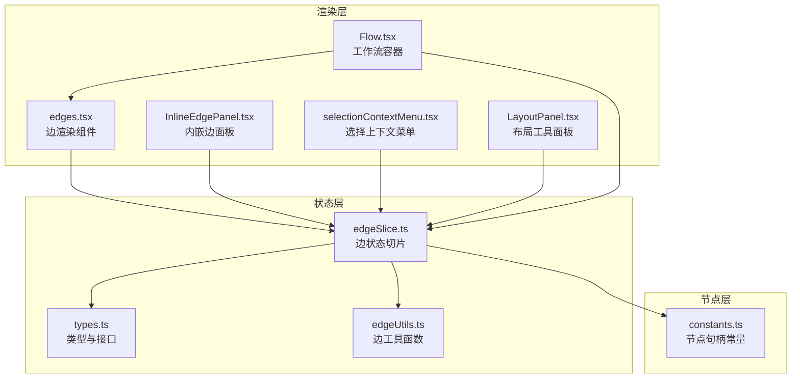
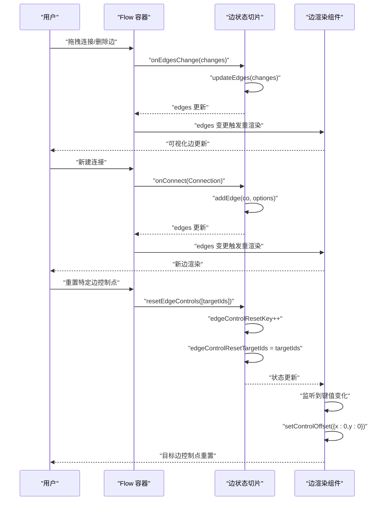
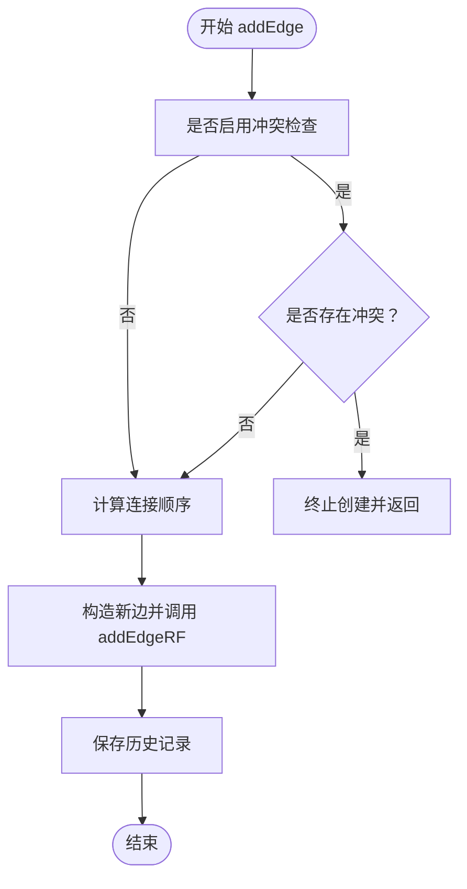
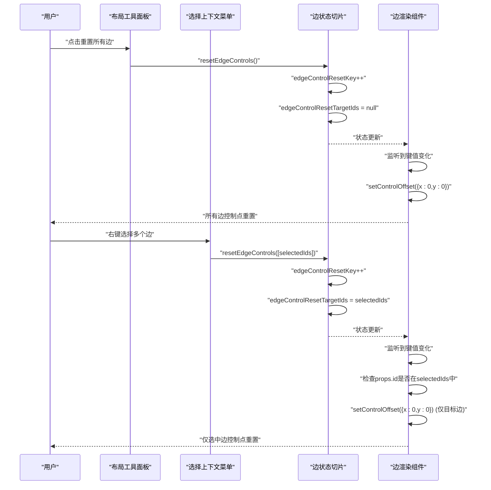
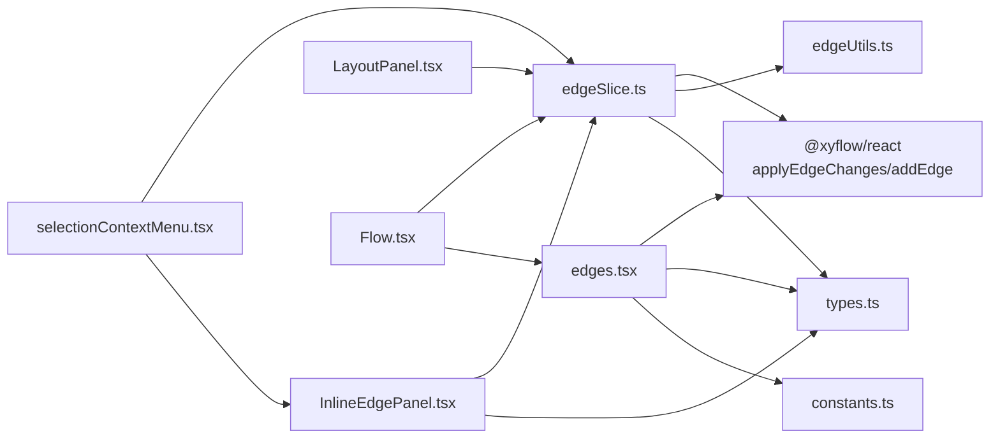

# 边状态切片

<cite>
**本文档引用的文件**
- [edgeSlice.ts](file://src/stores/flow/slices/edgeSlice.ts)
- [types.ts](file://src/stores/flow/types.ts)
- [edgeUtils.ts](file://src/stores/flow/utils/edgeUtils.ts)
- [edges.tsx](file://src/components/flow/edges.tsx)
- [Flow.tsx](file://src/components/Flow.tsx)
- [InlineEdgePanel.tsx](file://src/components/panels/main/InlineEdgePanel.tsx)
- [constants.ts](file://src/components/flow/nodes/constants.ts)
- [index.ts](file://src/stores/flow/index.ts)
- [LayoutPanel.tsx](file://src/components/panels/tools/LayoutPanel.tsx)
- [selectionContextMenu.tsx](file://src/components/flow/selectionContextMenu.tsx)
</cite>

## 更新摘要
**变更内容**
- 更新了 resetEdgeControls 方法的实现，现在支持可选的目标边缘 ID 参数
- 新增了 edgeControlResetTargetIds 状态字段，用于跟踪需要重置的目标边缘
- 更新了边控件重置机制，支持按需重置特定边缘的控制点
- 增强了边控件重置的灵活性，允许精确控制重置范围

## 目录
1. [简介](#简介)
2. [项目结构](#项目结构)
3. [核心组件](#核心组件)
4. [架构总览](#架构总览)
5. [详细组件分析](#详细组件分析)
6. [依赖分析](#依赖分析)
7. [性能考虑](#性能考虑)
8. [故障排除指南](#故障排除指南)
9. [结论](#结论)
10. [附录](#附录)

## 简介
本文件围绕"边状态切片"展开，系统性阐述 FlowEdgeState 接口的设计与实现，涵盖边列表管理、边控件重置、边操作方法（updateEdges、setEdgeData、setEdgeLabel、addEdge、setEdges）以及边标签管理与边控件重置机制。文档还解释了边状态在工作流连接中的关键作用，包括边创建、删除、属性修改与视觉控制的实现机制，并提供实际使用示例与最佳实践。

**更新** 本次更新重点介绍了新的目标边缘控制重置功能，resetEdgeControls 方法现在支持可选的目标边缘 ID 参数，允许用户精确控制哪些边的控制点需要重置。

## 项目结构
边状态切片位于前端状态管理模块中，采用 Zustand 的 slice 模式组织，配合 @xyflow/react 实现可视化连接。核心文件分布如下：
- 状态切片：src/stores/flow/slices/edgeSlice.ts
- 类型定义：src/stores/flow/types.ts
- 工具函数：src/stores/flow/utils/edgeUtils.ts
- 边渲染组件：src/components/flow/edges.tsx
- 工作流容器：src/components/Flow.tsx
- 内嵌边面板：src/components/panels/main/InlineEdgePanel.tsx
- 节点句柄常量：src/components/flow/nodes/constants.ts
- 流状态聚合入口：src/stores/flow/index.ts
- 布局工具面板：src/components/panels/tools/LayoutPanel.tsx
- 选择上下文菜单：src/components/flow/selectionContextMenu.tsx

**图表来源**
- [edgeSlice.ts:1-227](file://src/stores/flow/slices/edgeSlice.ts#L1-L227)
- [types.ts:27-362](file://src/stores/flow/types.ts#L27-L362)
- [edgeUtils.ts:1-32](file://src/stores/flow/utils/edgeUtils.ts#L1-L32)
- [edges.tsx:188-530](file://src/components/flow/edges.tsx#L188-L530)
- [Flow.tsx:193-542](file://src/components/Flow.tsx#L193-L542)
- [InlineEdgePanel.tsx:55-290](file://src/components/panels/main/InlineEdgePanel.tsx#L55-L290)
- [constants.ts:1-47](file://src/components/flow/nodes/constants.ts#L1-L47)
- [LayoutPanel.tsx:1-171](file://src/components/panels/tools/LayoutPanel.tsx#L1-L171)
- [selectionContextMenu.tsx:300-487](file://src/components/flow/selectionContextMenu.tsx#L300-L487)

**章节来源**
- [edgeSlice.ts:1-227](file://src/stores/flow/slices/edgeSlice.ts#L1-L227)
- [types.ts:27-362](file://src/stores/flow/types.ts#L27-L362)
- [edgeUtils.ts:1-32](file://src/stores/flow/utils/edgeUtils.ts#L1-L32)
- [edges.tsx:188-530](file://src/components/flow/edges.tsx#L188-L530)
- [Flow.tsx:193-542](file://src/components/Flow.tsx#L193-L542)
- [InlineEdgePanel.tsx:55-290](file://src/components/panels/main/InlineEdgePanel.tsx#L55-L290)
- [constants.ts:1-47](file://src/components/flow/nodes/constants.ts#L1-L47)
- [index.ts:15-24](file://src/stores/flow/index.ts#L15-L24)
- [LayoutPanel.tsx:1-171](file://src/components/panels/tools/LayoutPanel.tsx#L1-L171)
- [selectionContextMenu.tsx:300-487](file://src/components/flow/selectionContextMenu.tsx#L300-L487)

## 核心组件
- FlowEdgeState 接口：定义边状态的字段与方法，包括 edges、edgeControlResetKey、edgeControlResetTargetIds 以及 updateEdges、setEdgeData、setEdgeLabel、addEdge、setEdges、resetEdgeControls。
- 边状态切片（createEdgeSlice）：实现上述接口，负责边列表的增删改查、冲突检查、顺序维护、属性更新与控件重置。
- 边工具函数：提供查找边、筛选选中边、计算连接顺序等辅助能力。
- 边渲染组件（MarkedEdge）：基于 @xyflow/react 渲染 marked 类型边，支持拖拽控制点、双击重置、标签显示与样式分类。
- 工作流容器（Flow）：将边变化回调与 addEdge 回调绑定到 Zustand 状态，驱动边状态更新。
- 内嵌边面板（InlineEdgePanel）：展示与编辑选中边的信息，包括顺序、JumpBack 属性与删除操作。
- 布局工具面板（LayoutPanel）：提供一键重置所有边控制点的功能。
- 选择上下文菜单（selectionContextMenu）：支持按选中范围重置边控制点。

**更新** 新增了 edgeControlResetTargetIds 字段和相关的重置机制，支持精确控制目标边缘的控制点重置。

**章节来源**
- [types.ts:302-312](file://src/stores/flow/types.ts#L302-L312)
- [edgeSlice.ts:16-227](file://src/stores/flow/slices/edgeSlice.ts#L16-L227)
- [edgeUtils.ts:4-31](file://src/stores/flow/utils/edgeUtils.ts#L4-L31)
- [edges.tsx:188-530](file://src/components/flow/edges.tsx#L188-L530)
- [Flow.tsx:248-262](file://src/components/Flow.tsx#L248-L262)
- [InlineEdgePanel.tsx:55-290](file://src/components/panels/main/InlineEdgePanel.tsx#L55-L290)
- [LayoutPanel.tsx:97-105](file://src/components/panels/tools/LayoutPanel.tsx#L97-L105)
- [selectionContextMenu.tsx:437-444](file://src/components/flow/selectionContextMenu.tsx#L437-L444)

## 架构总览
边状态切片通过 Zustand 管理全局边状态，结合 @xyflow/react 的 EdgeChange 与 Connection 事件，实现边的创建、删除、属性修改与顺序调整。边渲染组件根据状态动态绘制贝塞尔曲线路径与控制点，支持用户交互与视觉反馈。

**更新** 新的重置机制通过 edgeControlResetTargetIds 字段实现了更精细的控制，允许用户指定需要重置的边缘 ID 列表。

**图表来源**
- [Flow.tsx:248-262](file://src/components/Flow.tsx#L248-L262)
- [edgeSlice.ts:25-61](file://src/stores/flow/slices/edgeSlice.ts#L25-L61)
- [edgeSlice.ts:151-210](file://src/stores/flow/slices/edgeSlice.ts#L151-L210)
- [edgeSlice.ts:218-225](file://src/stores/flow/slices/edgeSlice.ts#L218-L225)
- [edges.tsx:188-530](file://src/components/flow/edges.tsx#L188-L530)

## 详细组件分析

### FlowEdgeState 接口与设计
- 字段
  - edges：边数组，包含 id、source、sourceHandle、target、targetHandle、label、type、selected、attributes 等。
  - edgeControlResetKey：用于触发边控件重置的键值，每次重置递增。
  - edgeControlResetTargetIds：可选的目标边缘 ID 数组，用于指定需要重置的边缘。
- 方法
  - updateEdges(changes)：批量应用边变更，维护同源同类型边的 label 顺序，更新选中边列表。
  - setEdgeData(id, key, value)：设置边 attributes 中的键值，支持删除无效值以保持对象简洁。
  - setEdgeLabel(id, newLabel)：调整边在同源同类型边集合中的顺序，自动补偿其他边的 label。
  - addEdge(co, options)：创建新边，进行冲突检查（如 next 与 on_error 互斥），计算连接顺序并调用 @xyflow/react 的 addEdge。
  - setEdges(edges)：直接替换边列表。
  - resetEdgeControls(targetEdgeIds?)：递增 edgeControlResetKey，触发边控件重置。支持传入目标边缘 ID 数组进行精确控制。

**更新** 新增了 edgeControlResetTargetIds 字段和 resetEdgeControls 的可选参数支持。

**章节来源**
- [types.ts:27-38](file://src/stores/flow/types.ts#L27-L38)
- [types.ts:302-312](file://src/stores/flow/types.ts#L302-L312)
- [edgeSlice.ts:21-227](file://src/stores/flow/slices/edgeSlice.ts#L21-L227)

### 边列表管理与冲突检查
- 冲突检查：当 sourceHandle 为 Next 或 Error 时，确保同一源节点与同一目标节点不会同时存在另一个句柄类型的边；对 Error 句柄的自连也进行限制。
- 连接顺序：根据同源同类型边的数量计算 label，保证每组边的顺序唯一且连续。
- 变更应用：使用 applyEdgeChanges 处理删除、添加等变更，随后更新选中边列表并保存历史记录。

**图表来源**
- [edgeSlice.ts:151-210](file://src/stores/flow/slices/edgeSlice.ts#L151-L210)
- [edgeUtils.ts:18-31](file://src/stores/flow/utils/edgeUtils.ts#L18-L31)
- [constants.ts:2-11](file://src/components/flow/nodes/constants.ts#L2-L11)

**章节来源**
- [edgeSlice.ts:151-210](file://src/stores/flow/slices/edgeSlice.ts#L151-L210)
- [edgeUtils.ts:18-31](file://src/stores/flow/utils/edgeUtils.ts#L18-L31)
- [constants.ts:2-11](file://src/components/flow/nodes/constants.ts#L2-L11)

### 边控件重置机制
- edgeControlResetKey：作为轻量级触发器，驱动边渲染组件重置控制点偏移。
- edgeControlResetTargetIds：可选的目标边缘 ID 数组，用于指定需要重置的边缘。如果为 null，则重置所有边缘。
- resetEdgeControls(targetEdgeIds?)：递增 edgeControlResetKey，设置 edgeControlResetTargetIds。如果传入空数组或未传参，则重置所有边缘。
- 用户交互：边渲染组件支持拖拽控制点与双击重置，配合配置开关控制显示。重置逻辑检查 edgeControlResetKey 是否大于 0，以及目标边缘 ID 是否在 edgeControlResetTargetIds 列表中。

**更新** 新增了目标边缘 ID 的精确控制功能，允许用户只重置特定的边控制点。

**图表来源**
- [LayoutPanel.tsx:97-105](file://src/components/panels/tools/LayoutPanel.tsx#L97-L105)
- [selectionContextMenu.tsx:300-312](file://src/components/flow/selectionContextMenu.tsx#L300-L312)
- [edgeSlice.ts:218-225](file://src/stores/flow/slices/edgeSlice.ts#L218-L225)
- [edges.tsx:351-367](file://src/components/flow/edges.tsx#L351-L367)

**章节来源**
- [edgeSlice.ts:218-225](file://src/stores/flow/slices/edgeSlice.ts#L218-L225)
- [edges.tsx:351-367](file://src/components/flow/edges.tsx#L351-L367)
- [LayoutPanel.tsx:97-105](file://src/components/panels/tools/LayoutPanel.tsx#L97-L105)
- [selectionContextMenu.tsx:300-312](file://src/components/flow/selectionContextMenu.tsx#L300-L312)

### 边操作方法详解
- updateEdges(changes)
  - 预处理：当变更类型为 remove 时，遍历受影响的同源同类型边，将其 label 减一以维持顺序连续。
  - 应用变更：调用 applyEdgeChanges，更新 edges 并计算新的选中边列表。
  - 历史记录：若包含删除操作，保存历史快照。
- setEdgeData(id, key, value)
  - 若 value 为 undefined/null/false，则删除 attributes 中对应键；若 attributes 为空则删除 attributes。
  - 否则设置键值，更新选中边列表并保存历史记录。
- setEdgeLabel(id, newLabel)
  - 计算目标边旧 label 与新 label 的差值，向前移动时增大其他边 label，向后移动时减小其他边 label。
  - 更新目标边 label，更新选中边列表并保存历史记录。
- addEdge(co, options)
  - 冲突检查：根据 sourceHandle 与目标节点判断是否冲突。
  - 计算顺序：调用 calcuLinkOrder 获取当前组内最大序号+1。
  - 创建边：构造 type 为 "marked" 的边并调用 addEdgeRF。
  - 历史记录：保存历史快照。
- setEdges(edges)
  - 直接替换边列表，适用于批量导入或外部同步场景。
- resetEdgeControls(targetEdgeIds?)
  - 递增 edgeControlResetKey，触发边控件重置。
  - 如果传入 targetEdgeIds 参数，设置 edgeControlResetTargetIds 为该数组；否则设为 null。
  - 边渲染组件根据 edgeControlResetTargetIds 决定是否重置当前边的控制点。

**更新** resetEdgeControls 方法现在支持可选的 targetEdgeIds 参数，允许精确控制重置范围。

**章节来源**
- [edgeSlice.ts:25-61](file://src/stores/flow/slices/edgeSlice.ts#L25-L61)
- [edgeSlice.ts:64-100](file://src/stores/flow/slices/edgeSlice.ts#L64-L100)
- [edgeSlice.ts:103-148](file://src/stores/flow/slices/edgeSlice.ts#L103-L148)
- [edgeSlice.ts:151-210](file://src/stores/flow/slices/edgeSlice.ts#L151-L210)
- [edgeSlice.ts:212-215](file://src/stores/flow/slices/edgeSlice.ts#L212-L215)
- [edgeSlice.ts:218-225](file://src/stores/flow/slices/edgeSlice.ts#L218-L225)

### 边标签管理与视觉控制
- 标签显示：边渲染组件根据配置开关与边的 label 值决定是否显示标签。
- 样式分类：根据 sourceHandle 与 targetHandle 的组合（如 next、on_error、jump_back）应用不同样式类。
- 控制点：支持拖拽调整路径曲率，双击重置控制点；控制点偏移量通过 edgeControlResetKey 触发重置。
- 选中与聚焦：边的选中状态影响样式与透明度；结合路径模式与焦点透明度策略，实现视觉聚焦效果。

**更新** 新的重置机制支持精确控制目标边缘的控制点重置，提高了用户体验的精确度。

**章节来源**
- [edges.tsx:188-530](file://src/components/flow/edges.tsx#L188-L530)
- [InlineEdgePanel.tsx:251-282](file://src/components/panels/main/InlineEdgePanel.tsx#L251-L282)

### 工作流连接中的作用
- 连接创建：Flow 容器将 onConnect 回调绑定到 addEdge，实现拖拽连接的即时创建。
- 连接删除：InlineEdgePanel 通过 updateEdges 发送 remove 变更，删除选中边。
- 属性修改：InlineEdgePanel 修改 JumpBack 属性，setEdgeData 将属性写入边的 attributes。
- 顺序调整：InlineEdgePanel 的顺序输入框调用 setEdgeLabel，维护同源同类型边的顺序一致性。
- 控制点重置：LayoutPanel 提供一键重置所有边控制点的功能；selectionContextMenu 支持按选中范围重置边控制点。

**更新** 新增了精确控制重置功能，用户可以选择重置所有边或仅重置选中的边。

**章节来源**
- [Flow.tsx:256](file://src/components/Flow.tsx#L256)
- [InlineEdgePanel.tsx:147-171](file://src/components/panels/main/InlineEdgePanel.tsx#L147-L171)
- [InlineEdgePanel.tsx:157-164](file://src/components/panels/main/InlineEdgePanel.tsx#L157-L164)
- [LayoutPanel.tsx:97-105](file://src/components/panels/tools/LayoutPanel.tsx#L97-L105)
- [selectionContextMenu.tsx:437-444](file://src/components/flow/selectionContextMenu.tsx#L437-L444)

## 依赖分析
- 状态层依赖
  - edgeSlice.ts 依赖 @xyflow/react 的 applyEdgeChanges、addEdge，依赖 edgeUtils 提供的工具函数。
  - types.ts 定义 EdgeType、EdgeAttributesType 与 FlowEdgeState 接口，统一数据结构。
- 渲染层依赖
  - edges.tsx 依赖 @xyflow/react 的 BaseEdge、EdgeLabelRenderer、useReactFlow，依赖节点句柄常量与配置存储。
  - InlineEdgePanel.tsx 依赖 useFlowStore 的 setEdgeLabel、setEdgeData、updateEdges。
  - selectionContextMenu.tsx 依赖 useFlowStore 的 resetEdgeControls 和 getSelectionConnectedEdges。
- 容器层依赖
  - Flow.tsx 将 onEdgesChange 与 onConnect 绑定到 useFlowStore 的相应方法，驱动状态更新。
  - LayoutPanel.tsx 依赖 useFlowStore 的 resetEdgeControls。

**更新** 新增了 selectionContextMenu.tsx 对 resetEdgeControls 的依赖，支持按选中范围重置边控制点。

**图表来源**
- [edgeSlice.ts:1-14](file://src/stores/flow/slices/edgeSlice.ts#L1-L14)
- [edges.tsx:14-18](file://src/components/flow/edges.tsx#L14-L18)
- [InlineEdgePanel.tsx:9-21](file://src/components/panels/main/InlineEdgePanel.tsx#L9-L21)
- [Flow.tsx:193-262](file://src/components/Flow.tsx#L193-L262)
- [selectionContextMenu.tsx:300-312](file://src/components/flow/selectionContextMenu.tsx#L300-L312)
- [LayoutPanel.tsx:23-30](file://src/components/panels/tools/LayoutPanel.tsx#L23-L30)

**章节来源**
- [edgeSlice.ts:1-14](file://src/stores/flow/slices/edgeSlice.ts#L1-L14)
- [edges.tsx:14-18](file://src/components/flow/edges.tsx#L14-L18)
- [InlineEdgePanel.tsx:9-21](file://src/components/panels/main/InlineEdgePanel.tsx#L9-L21)
- [Flow.tsx:193-262](file://src/components/Flow.tsx#L193-L262)
- [selectionContextMenu.tsx:300-312](file://src/components/flow/selectionContextMenu.tsx#L300-L312)
- [LayoutPanel.tsx:23-30](file://src/components/panels/tools/LayoutPanel.tsx#L23-L30)

## 性能考虑
- 批量变更：updateEdges 对删除操作进行预处理，仅对受影响的同源同类型边调整 label，避免全量重排。
- 历史记录：删除与属性修改会触发 saveHistory，建议合理设置延迟以减少频繁快照。
- 渲染优化：边控件重置通过 edgeControlResetKey 递增触发，避免不必要的深度比较；边渲染组件使用 useMemo 缓存路径与样式。
- 数据结构：EdgeType 使用 label 作为顺序标识，setEdgeLabel 仅对必要边进行更新，时间复杂度 O(n)。
- 目标控制点重置：edgeControlResetTargetIds 支持精确控制重置范围，避免不必要的重置操作。

**更新** 新增了目标控制点重置的性能考虑，通过 edgeControlResetTargetIds 实现精确控制，提高重置效率。

## 故障排除指南
- 连接冲突
  - 现象：无法创建从同一源到同一目标的 next 与 on_error 边。
  - 处理：检查现有边，确保同一源-目标组合不同时存在两种句柄类型。
- 顺序异常
  - 现象：边顺序错乱或重复。
  - 处理：调用 setEdgeLabel 显式设置顺序，或通过 InlineEdgePanel 的顺序输入框调整。
- 控制点不重置
  - 现象：拖拽控制点后无法恢复初始位置。
  - 处理：调用 resetEdgeControls 或在内嵌边面板点击重置按钮。如果是精确控制重置，请确认传入的边缘 ID 是否正确。
- 标签不显示
  - 现象：边标签未显示。
  - 处理：检查配置开关 showEdgeLabel；确认边的 label 存在且非空。
- 精确重置无效
  - 现象：调用 resetEdgeControls([targetIds]) 后，目标边控制点未重置。
  - 处理：确认 targetIds 数组中的 ID 是否与边的实际 ID 匹配；检查 edgeControlResetTargetIds 是否正确设置。

**更新** 新增了精确重置相关的故障排除指南。

**章节来源**
- [edgeSlice.ts:151-210](file://src/stores/flow/slices/edgeSlice.ts#L151-L210)
- [edgeSlice.ts:103-148](file://src/stores/flow/slices/edgeSlice.ts#L103-L148)
- [edges.tsx:351-367](file://src/components/flow/edges.tsx#L351-L367)
- [InlineEdgePanel.tsx:166-171](file://src/components/panels/main/InlineEdgePanel.tsx#L166-L171)
- [selectionContextMenu.tsx:300-312](file://src/components/flow/selectionContextMenu.tsx#L300-L312)

## 结论
边状态切片通过清晰的接口设计与高效的实现，提供了完整的边生命周期管理能力。它不仅支撑了工作流连接的创建、删除与属性修改，还通过边控件重置与标签管理提升了用户体验。配合 @xyflow/react 的渲染与交互能力，实现了高可用、可扩展的工作流编辑体验。

**更新** 新的精确控制重置功能进一步增强了系统的灵活性和用户体验，用户现在可以精确控制哪些边的控制点需要重置，提高了操作的精确度和效率。

## 附录

### 实际使用示例与最佳实践
- 创建边
  - 通过 Flow 容器的 onConnect 回调调用 addEdge，自动进行冲突检查与顺序计算。
  - 最佳实践：在调用 addEdge 前确保源节点与目标节点有效，避免无效连接。
- 删除边
  - 通过 InlineEdgePanel 的删除按钮触发 updateEdges 发送 remove 变更。
  - 最佳实践：删除前确认是否会影响后续流程，必要时先调整目标节点或属性。
- 修改属性
  - 通过 InlineEdgePanel 的 JumpBack 开关调用 setEdgeData，设置 attributes.jump_back。
  - 最佳实践：属性修改后及时保存历史，便于回滚。
- 调整顺序
  - 通过 InlineEdgePanel 的顺序输入框调用 setEdgeLabel，维护同源同类型边的顺序。
  - 最佳实践：批量调整时先计算目标顺序，再一次性提交，减少中间态。
- 重置控制点
  - 一键重置所有边：通过 LayoutPanel 的重置按钮调用 resetEdgeControls()，重置所有边的控制点。
  - 精确重置特定边：通过 selectionContextMenu 选择多个边后调用 resetEdgeControls([selectedIds])，仅重置选中边的控制点。
  - 最佳实践：在需要重新布局或恢复默认路径时使用；对于大量边的场景，优先使用精确重置功能以提高效率。

**更新** 新增了精确控制重置的使用示例和最佳实践。

**章节来源**
- [Flow.tsx:256](file://src/components/Flow.tsx#L256)
- [InlineEdgePanel.tsx:147-171](file://src/components/panels/main/InlineEdgePanel.tsx#L147-L171)
- [InlineEdgePanel.tsx:157-164](file://src/components/panels/main/InlineEdgePanel.tsx#L157-L164)
- [edgeSlice.ts:218-225](file://src/stores/flow/slices/edgeSlice.ts#L218-L225)
- [LayoutPanel.tsx:97-105](file://src/components/panels/tools/LayoutPanel.tsx#L97-L105)
- [selectionContextMenu.tsx:300-312](file://src/components/flow/selectionContextMenu.tsx#L300-L312)