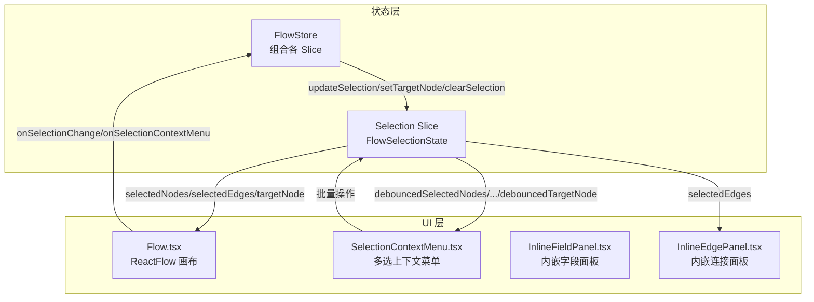
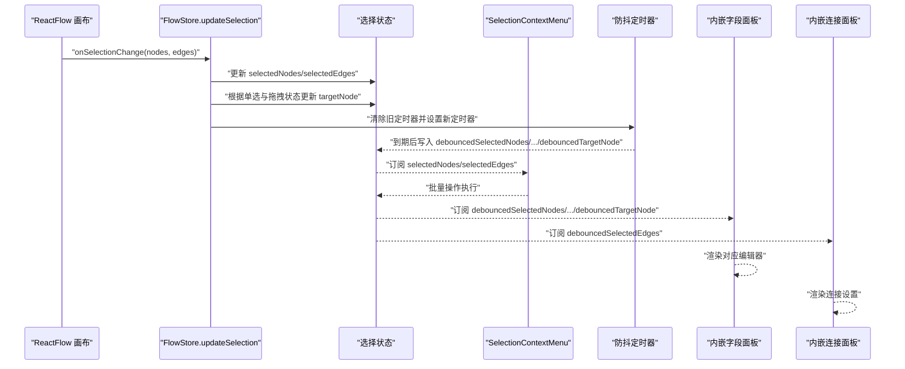
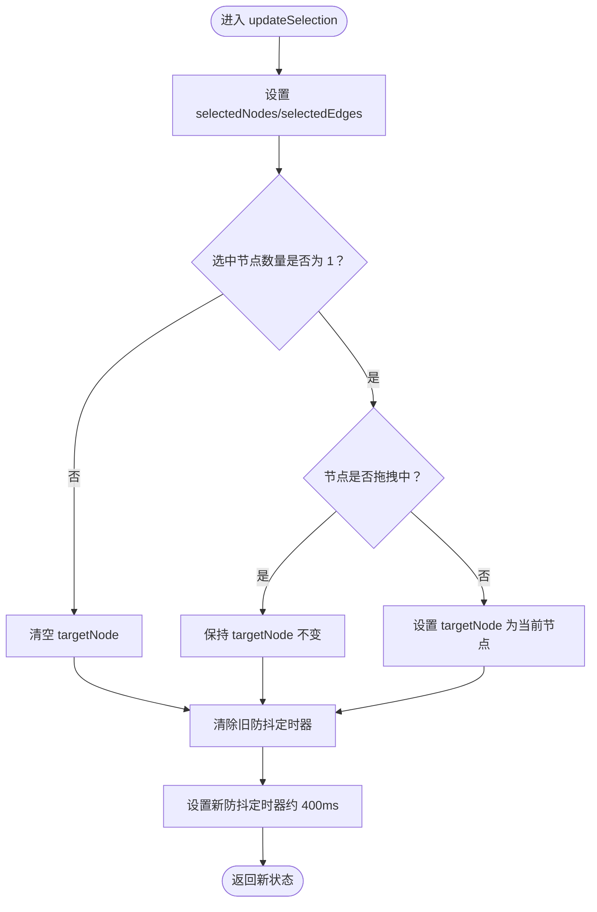
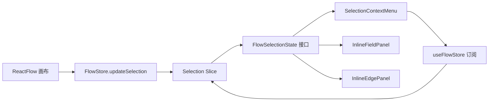

# 选择状态切片

<cite>
**本文档引用的文件**
- [selectionSlice.ts](file://src/stores/flow/slices/selectionSlice.ts)
- [types.ts](file://src/stores/flow/types.ts)
- [index.ts](file://src/stores/flow/index.ts)
- [Flow.tsx](file://src/components/Flow.tsx)
- [SelectionContextMenu.tsx](file://src/components/flow/components/SelectionContextMenu.tsx)
- [selectionContextMenu.tsx](file://src/components/flow/selectionContextMenu.tsx)
- [InlineFieldPanel.tsx](file://src/components/panels/main/InlineFieldPanel.tsx)
- [InlineEdgePanel.tsx](file://src/components/panels/main/InlineEdgePanel.tsx)
</cite>

## 更新摘要
**变更内容**
- 新增 SelectionContextMenu 组件，提供多选上下文菜单系统
- 增强选择状态的批量操作能力，支持复制、粘贴、删除等批量功能
- 扩展 SelectionContextMenuSelection 接口，提供更丰富的选择状态信息
- 新增多选上下文菜单配置系统，支持动态菜单项生成
- 增加批量布局和分组操作功能

## 目录
1. [简介](#简介)
2. [项目结构](#项目结构)
3. [核心组件](#核心组件)
4. [架构总览](#架构总览)
5. [详细组件分析](#详细组件分析)
6. [多选上下文菜单系统](#多选上下文菜单系统)
7. [依赖关系分析](#依赖关系分析)
8. [性能考量](#性能考量)
9. [故障排查指南](#故障排查指南)
10. [结论](#结论)
11. [附录](#附录)

## 简介
本文件围绕"选择状态切片"展开，系统性阐述 FlowSelectionState 接口的设计与实现，涵盖选中节点列表、选中边列表、目标节点以及防抖机制。文档将详细说明 updateSelection、setTargetNode、clearSelection 等方法的功能与使用方式，并解释防抖机制的工作原理与配置选项（debounceTimeouts 的管理）。随着新的多选上下文菜单系统的引入，选择状态现在支持丰富的批量操作功能，包括复制、粘贴、删除、对齐、间距调整、分组管理等。同时，结合用户交互场景（多选、单选、目标节点设置）给出实际使用示例与最佳实践，帮助开发者高效、稳定地管理画布选择状态。

## 项目结构
选择状态切片位于前端状态管理模块中，采用 Zustand 的 slice 模式进行拆分，便于组合与维护。主要涉及以下文件：
- selectionSlice.ts：选择状态切片的实现，包含状态字段与方法
- types.ts：FlowStore 及 FlowSelectionState 的类型定义
- index.ts：FlowStore 的组合入口
- Flow.tsx：画布组件，负责触发选择变更和集成多选上下文菜单
- SelectionContextMenu.tsx：多选上下文菜单组件，提供批量操作功能
- selectionContextMenu.tsx：多选上下文菜单配置和业务逻辑
- InlineFieldPanel.tsx / InlineEdgePanel.tsx：基于目标节点与选中边渲染的内嵌面板



**图表来源**
- [selectionSlice.ts:12-102](file://src/stores/flow/slices/selectionSlice.ts#L12-L102)
- [types.ts:257-269](file://src/stores/flow/types.ts#L257-L269)
- [index.ts:16-24](file://src/stores/flow/index.ts#L16-L24)
- [Flow.tsx:322-327](file://src/components/Flow.tsx#L322-L327)
- [SelectionContextMenu.tsx:50-162](file://src/components/flow/components/SelectionContextMenu.tsx#L50-L162)
- [InlineFieldPanel.tsx:33](file://src/components/panels/main/InlineFieldPanel.tsx#L33)
- [InlineEdgePanel.tsx:57-63](file://src/components/panels/main/InlineEdgePanel.tsx#L57-L63)

**章节来源**
- [selectionSlice.ts:12-102](file://src/stores/flow/slices/selectionSlice.ts#L12-L102)
- [types.ts:257-269](file://src/stores/flow/types.ts#L257-L269)
- [index.ts:16-24](file://src/stores/flow/index.ts#L16-L24)

## 核心组件
- FlowSelectionState 接口：定义选择状态的字段与方法，包括选中节点、选中边、目标节点及其对应的防抖版本，以及 debounceTimeouts 字典。
- Selection Slice：提供 updateSelection、setTargetNode、clearSelection 方法，负责更新状态并触发防抖同步。
- Flow Store 组合：在 index.ts 中将 selectionSlice 与其他 slice 组合，形成完整的 FlowStore。
- SelectionContextMenu：新的多选上下文菜单组件，提供批量操作功能，直接访问选择状态进行批量处理。

**章节来源**
- [types.ts:257-269](file://src/stores/flow/types.ts#L257-L269)
- [selectionSlice.ts:12-102](file://src/stores/flow/slices/selectionSlice.ts#L12-L102)
- [index.ts:16-24](file://src/stores/flow/index.ts#L16-L24)
- [SelectionContextMenu.tsx:50-162](file://src/components/flow/components/SelectionContextMenu.tsx#L50-L162)

## 架构总览
选择状态在 UI 与状态之间的流转如下：
- ReactFlow 画布通过 onSelectionChange 回调将当前选中节点与边传递给 FlowStore 的 updateSelection
- updateSelection 在同步更新 selectedNodes/selectedEdges 的同时，根据单选条件与拖拽状态更新 targetNode
- 同步更新完成后，清除旧的防抖定时器并设置新的定时器，将 selectedNodes/selectedEdges/targetNode 同步到 debounced* 字段
- SelectionContextMenu 组件通过 useFlowStore 订阅选择状态，提供批量操作功能
- 内嵌面板（字段面板、连接面板）订阅 debounced* 字段，实现稳定的 UI 响应与性能优化



**图表来源**
- [Flow.tsx:322-327](file://src/components/Flow.tsx#L322-L327)
- [selectionSlice.ts:28-66](file://src/stores/flow/slices/selectionSlice.ts#L28-L66)
- [SelectionContextMenu.tsx:52-59](file://src/components/flow/components/SelectionContextMenu.tsx#L52-L59)
- [InlineFieldPanel.tsx:33](file://src/components/panels/main/InlineFieldPanel.tsx#L33)
- [InlineEdgePanel.tsx:57-63](file://src/components/panels/main/InlineEdgePanel.tsx#L57-L63)

## 详细组件分析

### FlowSelectionState 接口设计
- 字段
  - selectedNodes：当前选中的节点数组
  - selectedEdges：当前选中的边数组
  - targetNode：目标节点（单选且非拖拽时有效）
  - debouncedSelectedNodes/.../debouncedTargetNode：防抖后的对应字段
  - debounceTimeouts：防抖超时字典（键为标识符，值为毫秒数）
- 方法
  - updateSelection(nodes, edges)：更新选中状态并触发防抖
  - setTargetNode(node)：直接设置目标节点并触发防抖
  - clearSelection()：清空所有选择并重置防抖状态

**章节来源**
- [types.ts:257-269](file://src/stores/flow/types.ts#L257-L269)

### updateSelection 方法
- 功能
  - 同步更新 selectedNodes 与 selectedEdges
  - 根据选中数量与拖拽状态更新 targetNode
  - 清除旧的防抖定时器并设置新的定时器，将当前状态写入 debounced* 字段
- 单选与拖拽规则
  - 当选中节点数量不等于 1 时，清空 targetNode
  - 当选中节点数量为 1 且该节点未处于拖拽状态，或当前 targetNode 为空时，更新 targetNode
- 防抖策略
  - 使用全局防抖定时器，延迟固定时间（实现中为 400ms）后写入 debounced* 字段
  - 每次调用都会先清理旧定时器，确保只保留最后一次调用的结果



**图表来源**
- [selectionSlice.ts:28-66](file://src/stores/flow/slices/selectionSlice.ts#L28-L66)

**章节来源**
- [selectionSlice.ts:28-66](file://src/stores/flow/slices/selectionSlice.ts#L28-L66)

### setTargetNode 方法
- 功能
  - 直接设置 targetNode
  - 清除旧的防抖定时器并设置新的定时器，将当前 targetNode 写入 debouncedTargetNode
- 使用场景
  - 用户通过快捷键或菜单操作直接设置目标节点
  - 需要立即生效但又希望 UI 响应稳定时

**章节来源**
- [selectionSlice.ts:69-81](file://src/stores/flow/slices/selectionSlice.ts#L69-L81)

### clearSelection 方法
- 功能
  - 清空 selectedNodes、selectedEdges、targetNode
  - 清空对应的 debounced* 字段
  - 清空 debounceTimeouts 字典
  - 清理全局防抖定时器
- 使用场景
  - 用户按下 ESC 或点击空白处取消选择
  - 导航切换或重置工作流时

**章节来源**
- [selectionSlice.ts:84-102](file://src/stores/flow/slices/selectionSlice.ts#L84-L102)

### 防抖机制与 debounceTimeouts 管理
- 工作原理
  - 选择状态在高频变更时（如拖拽、连续点击）会频繁触发 updateSelection
  - 通过防抖定时器将最终状态延迟写入 debounced* 字段，避免 UI 频繁重绘与不必要的副作用
  - 定时器在每次调用前被清理，确保只保留最后一次调用的结果
- debounceTimeouts 字典
  - 类型定义中包含 debounceTimeouts: Record<string, number>
  - 当前实现中未使用该字典存储多个独立的防抖超时；实现中使用全局变量 debounceTimeout
  - 若需扩展为多实例或多场景的防抖，可在该字典中按标识符存储不同超时值

**章节来源**
- [selectionSlice.ts:9-10](file://src/stores/flow/slices/selectionSlice.ts#L9-L10)
- [selectionSlice.ts:25](file://src/stores/flow/slices/selectionSlice.ts#L25)
- [types.ts:255](file://src/stores/flow/types.ts#L255)

## 多选上下文菜单系统

### SelectionContextMenu 组件
SelectionContextMenu 是新增的多选上下文菜单组件，直接访问选择状态来提供批量操作功能：

- **状态订阅**：通过 useFlowStore 和 useShallow 订阅 selectedNodes 和 selectedEdges
- **动态菜单生成**：基于 getSelectionContextMenuConfig 动态生成菜单项
- **批量操作支持**：支持复制、粘贴、删除、对齐、间距调整、分组管理等批量功能
- **可见性控制**：支持根据选择状态动态控制菜单项的可见性和禁用状态

### SelectionContextMenuSelection 接口
扩展的选择状态接口，为上下文菜单提供更丰富的选择信息：

```typescript
export interface SelectionContextMenuSelection {
  selectedNodes: NodeType[];
  selectedEdges: EdgeType[];
}
```

### 上下文菜单配置系统
getSelectionContextMenuConfig 提供完整的菜单配置，包括：

- **基础操作**：复制、创建副本、部分导出
- **布局操作**：对齐（左、中、右、上、中、下）、间距调整（水平、垂直）
- **连线操作**：还原连线路径
- **分组操作**：创建分组、移出分组、解散分组
- **删除操作**：删除选中元素

每个菜单项都支持：
- **disabled**：函数或布尔值，控制禁用状态
- **visible**：函数，控制可见性
- **danger**：标记危险操作
- **children**：子菜单项

**章节来源**
- [SelectionContextMenu.tsx:50-162](file://src/components/flow/components/SelectionContextMenu.tsx#L50-L162)
- [selectionContextMenu.tsx:10-487](file://src/components/flow/selectionContextMenu.tsx#L10-L487)
- [Flow.tsx:485-492](file://src/components/Flow.tsx#L485-L492)

## 依赖关系分析
- 组件耦合
  - Flow.tsx 与 selectionSlice 强耦合：通过 onSelectionChange 与 updateSelection 交互
  - SelectionContextMenu 与 selectionSlice 强耦合：直接订阅选择状态进行批量操作
  - InlineFieldPanel.tsx 与 selectionSlice 弱耦合：仅订阅 targetNode
  - InlineEdgePanel.tsx 与 selectionSlice 弱耦合：仅订阅 selectedEdges
- 外部依赖
  - ReactFlow：提供 onSelectionChange 回调与节点/边数据
  - Zustand：提供状态管理与订阅能力
  - ahooks：在 Flow.tsx 中使用 useDebounceEffect 订阅 debounced* 字段
  - Ant Design：提供 Dropdown 组件用于上下文菜单



**图表来源**
- [Flow.tsx:322-327](file://src/components/Flow.tsx#L322-L327)
- [selectionSlice.ts:28-66](file://src/stores/flow/slices/selectionSlice.ts#L28-L66)
- [SelectionContextMenu.tsx:52-59](file://src/components/flow/components/SelectionContextMenu.tsx#L52-L59)
- [InlineFieldPanel.tsx:33](file://src/components/panels/main/InlineFieldPanel.tsx#L33)
- [InlineEdgePanel.tsx:57-63](file://src/components/panels/main/InlineEdgePanel.tsx#L57-L63)

**章节来源**
- [Flow.tsx:322-327](file://src/components/Flow.tsx#L322-L327)
- [selectionSlice.ts:28-66](file://src/stores/flow/slices/selectionSlice.ts#L28-L66)
- [SelectionContextMenu.tsx:52-59](file://src/components/flow/components/SelectionContextMenu.tsx#L52-L59)

## 性能考量
- 防抖带来的收益
  - 减少 UI 重绘次数：高频选择变更通过防抖统一收敛
  - 降低副作用开销：本地保存、面板渲染等操作仅在稳定状态执行
  - 优化上下文菜单响应：SelectionContextMenu 使用 useShallow 优化订阅性能
- 延迟参数
  - 当前实现固定延迟约 400ms；若需调整，可在 setTargetNode 与 updateSelection 中统一修改
- 最佳实践
  - 对于需要即时反馈的操作（如快捷键切换目标节点），建议使用 setTargetNode，避免等待防抖
  - 对于复杂面板渲染（字段面板、连接面板），建议订阅 debounced* 字段，确保渲染稳定性
  - SelectionContextMenu 使用 useShallow 优化订阅，避免不必要的重渲染

## 故障排查指南
- 问题：面板不显示或显示异常
  - 检查 targetNode 是否为空（单选且非拖拽时才会更新）
  - 检查 InlineFieldPanel 是否处于拖拽状态
- 问题：选择变更后 UI 未及时更新
  - 确认是否订阅了 debounced* 字段（字段面板订阅 targetNode，连接面板订阅 selectedEdges）
  - 检查防抖定时器是否被频繁清理导致延迟过大
- 问题：清空选择后状态未恢复
  - 确认调用了 clearSelection
  - 检查 debounceTimeouts 是否被意外保留
- 问题：多选上下文菜单不显示
  - 检查 SelectionContextMenu 是否正确订阅了选择状态
  - 确认 onSelectionContextMenu 回调是否正确设置菜单位置
  - 检查菜单项的 visible 函数是否正确返回

**章节来源**
- [selectionSlice.ts:84-102](file://src/stores/flow/slices/selectionSlice.ts#L84-L102)
- [SelectionContextMenu.tsx:52-59](file://src/components/flow/components/SelectionContextMenu.tsx#L52-L59)
- [Flow.tsx:485-492](file://src/components/Flow.tsx#L485-L492)

## 结论
选择状态切片通过明确的状态字段与方法，配合防抖机制，实现了在高频交互场景下的稳定与高效。随着多选上下文菜单系统的引入，选择状态现在支持丰富的批量操作功能，包括复制、粘贴、删除、对齐、间距调整、分组管理等，大大提升了用户的工作效率。updateSelection、setTargetNode、clearSelection 三类方法覆盖了多选、单选与目标节点设置的核心需求；SelectionContextMenu 组件提供了直观的批量操作界面；debounceTimeouts 字典为未来扩展提供了空间。结合 Flow.tsx、SelectionContextMenu、InlineFieldPanel.tsx、InlineEdgePanel.tsx 的协同，选择状态在用户体验与性能之间取得了良好平衡。

## 附录

### 实际使用示例与最佳实践
- 多选场景
  - 通过 ReactFlow 的框选或按住 Ctrl 进行多选
  - updateSelection 会清空 targetNode，确保后续操作不会误触目标节点
  - 如需临时设置目标节点，可使用 setTargetNode
  - 使用 SelectionContextMenu 进行批量操作，如复制、粘贴、删除等
- 单选场景
  - 选中单个节点时，若节点未拖拽，targetNode 会被更新
  - 拖拽过程中保持 targetNode 不变，避免面板闪烁
- 目标节点设置
  - 使用 setTargetNode 直接设置目标节点，适合快捷键或菜单操作
  - 字段面板会自动订阅 targetNode 并渲染对应编辑器
- 多选上下文菜单使用
  - 右键选区打开上下文菜单
  - 支持动态菜单项生成，根据选择状态自动调整可用功能
  - 批量操作支持撤销/重做，确保操作安全性
- 防抖配置
  - 当前实现固定延迟约 400ms；如需调整，可在 setTargetNode 与 updateSelection 中统一修改
  - debounceTimeouts 字典可用于多实例或多场景的差异化配置（当前未使用）

**章节来源**
- [selectionSlice.ts:28-81](file://src/stores/flow/slices/selectionSlice.ts#L28-L81)
- [SelectionContextMenu.tsx:50-162](file://src/components/flow/components/SelectionContextMenu.tsx#L50-L162)
- [selectionContextMenu.tsx:314-487](file://src/components/flow/selectionContextMenu.tsx#L314-L487)
- [InlineFieldPanel.tsx:33](file://src/components/panels/main/InlineFieldPanel.tsx#L33)
- [InlineEdgePanel.tsx:57-63](file://src/components/panels/main/InlineEdgePanel.tsx#L57-L63)