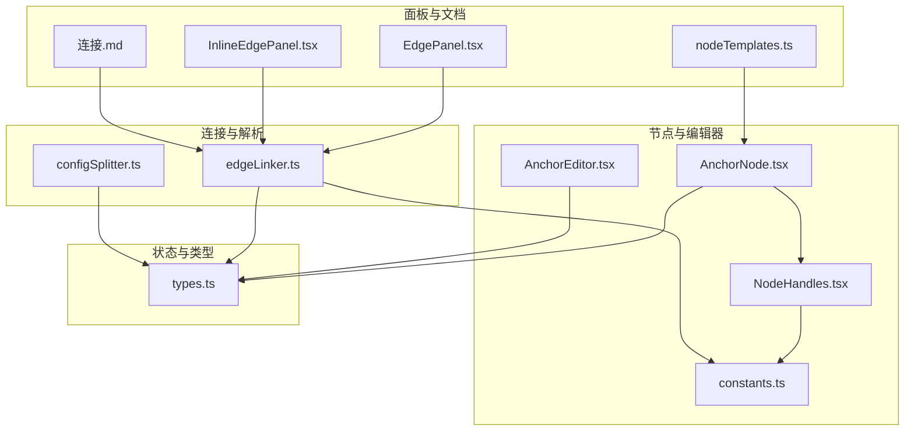
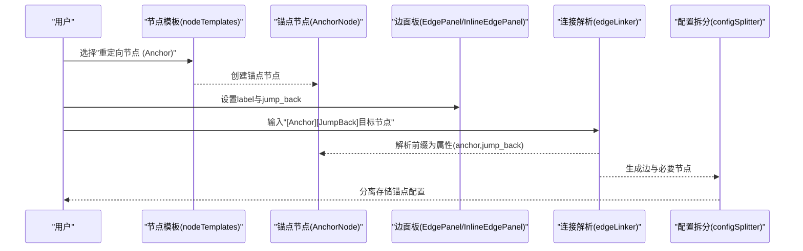
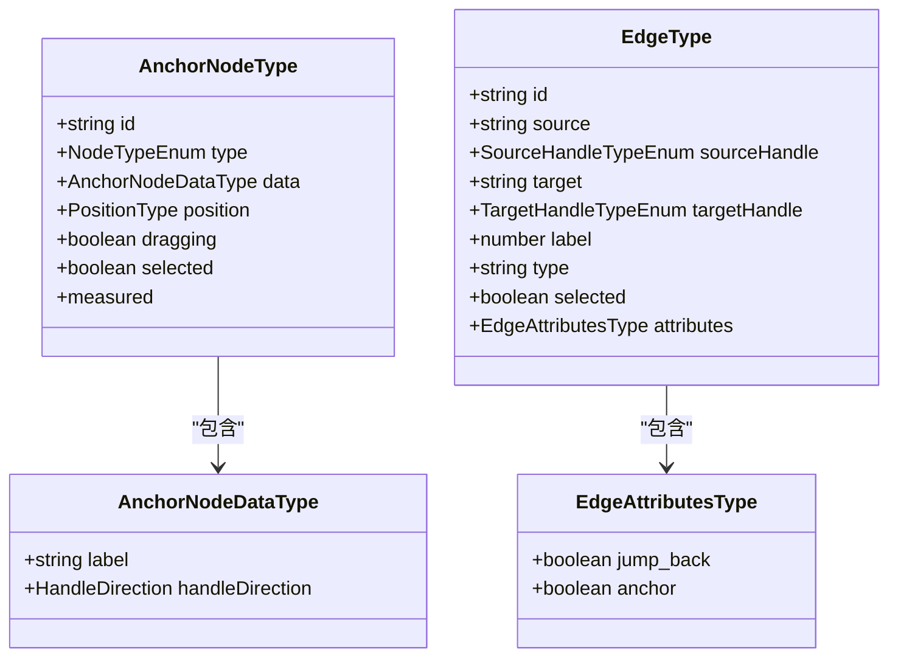
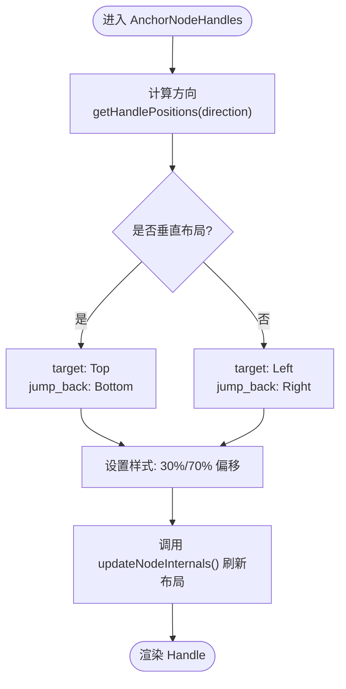
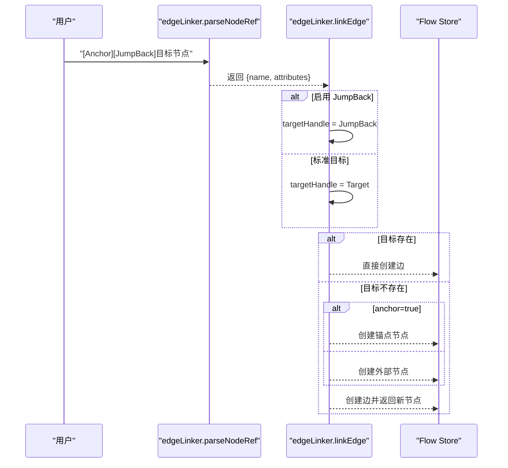
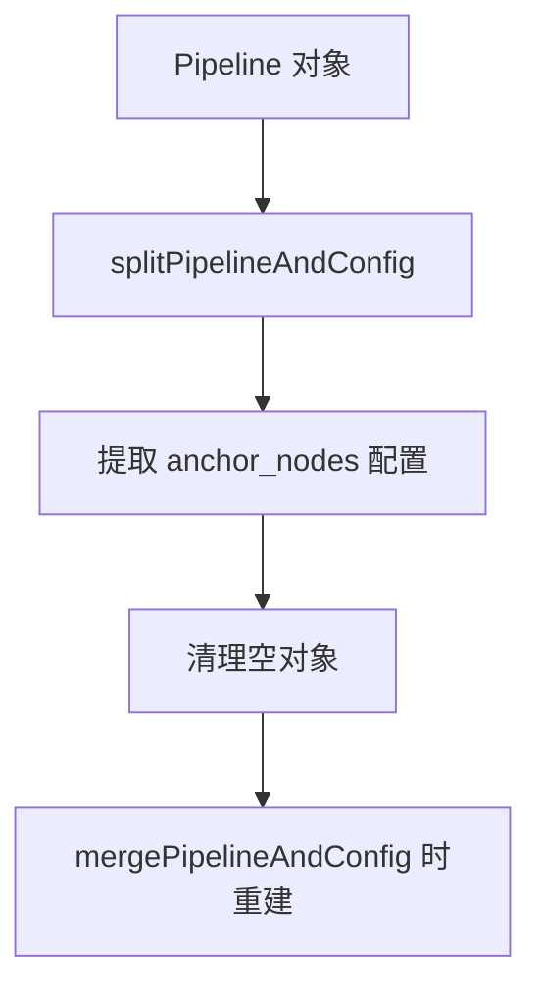
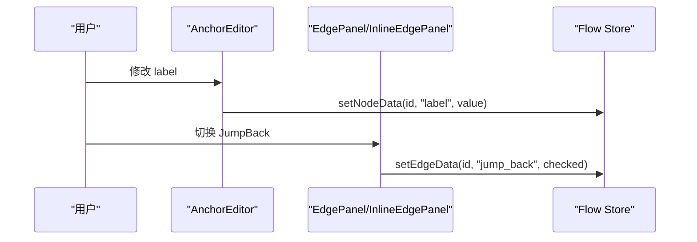
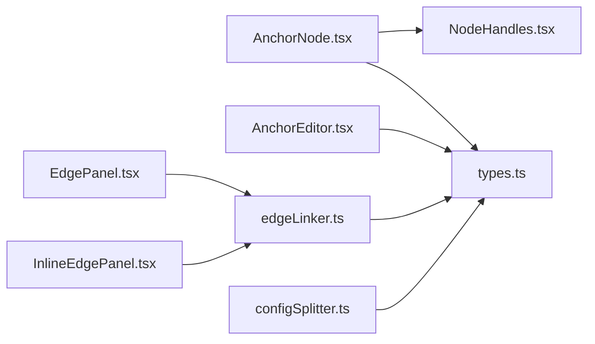
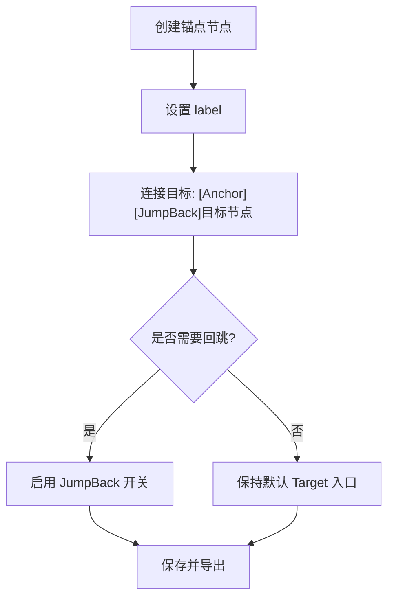

# 锚点节点

<cite>
**本文档引用的文件**
- [AnchorNode.tsx](file://src/components/flow/nodes/AnchorNode.tsx)
- [AnchorEditor.tsx](file://src/components/panels/node-editors/AnchorEditor.tsx)
- [NodeHandles.tsx](file://src/components/flow/nodes/components/NodeHandles.tsx)
- [constants.ts](file://src/components/flow/nodes/constants.ts)
- [types.ts](file://src/stores/flow/types.ts)
- [edgeLinker.ts](file://src/core/parser/edgeLinker.ts)
- [configSplitter.ts](file://src/core/parser/configSplitter.ts)
- [EdgePanel.tsx](file://src/components/panels/main/EdgePanel.tsx)
- [InlineEdgePanel.tsx](file://src/components/panels/main/InlineEdgePanel.tsx)
- [nodeTemplates.ts](file://src/data/nodeTemplates.ts)
- [连接.md](file://docsite/docs/01.指南/10.工作流面板/40.连接.md)
</cite>

## 目录
1. [简介](#简介)
2. [项目结构](#项目结构)
3. [核心组件](#核心组件)
4. [架构总览](#架构总览)
5. [详细组件分析](#详细组件分析)
6. [依赖关系分析](#依赖关系分析)
7. [性能考量](#性能考量)
8. [故障排查指南](#故障排查指南)
9. [结论](#结论)
10. [附录](#附录)

## 简介
本文件系统性阐述“锚点节点（Anchor）”在工作流中的设计与实现，重点包括：
- AnchorNodeType 的数据结构与属性
- AnchorNodeDataType 的配置属性
- 锚点节点在工作流中的重定向机制与控制逻辑
- 与 Edge 连接的关系及 jump_back 属性的作用
- 在复杂工作流中的应用场景与最佳实践
- 创建、配置与使用的完整示例与流程图

锚点节点用于在工作流中建立可复用的“重定向锚点”，通过目标入口（target）与回跳入口（jump_back）实现流程跳转与定位，提升复杂流程的可维护性与可读性。

## 项目结构
锚点节点涉及前端节点组件、编辑器、连接解析器、类型定义与文档说明等多个模块，整体结构如下：

**图表来源**
- [AnchorNode.tsx:1-169](file://src/components/flow/nodes/AnchorNode.tsx#L1-L169)
- [AnchorEditor.tsx:1-106](file://src/components/panels/node-editors/AnchorEditor.tsx#L1-L106)
- [NodeHandles.tsx:1-254](file://src/components/flow/nodes/components/NodeHandles.tsx#L1-L254)
- [constants.ts:1-47](file://src/components/flow/nodes/constants.ts#L1-L47)
- [types.ts:1-362](file://src/stores/flow/types.ts#L1-L362)
- [edgeLinker.ts:1-162](file://src/core/parser/edgeLinker.ts#L1-L162)
- [configSplitter.ts:1-200](file://src/core/parser/configSplitter.ts#L1-L200)
- [EdgePanel.tsx:85-209](file://src/components/panels/main/EdgePanel.tsx#L85-L209)
- [InlineEdgePanel.tsx:263-289](file://src/components/panels/main/InlineEdgePanel.tsx#L263-L289)
- [nodeTemplates.ts:1-108](file://src/data/nodeTemplates.ts#L1-L108)
- [连接.md:1-70](file://docsite/docs/01.指南/10.工作流面板/40.连接.md#L1-L70)

**章节来源**
- [AnchorNode.tsx:1-169](file://src/components/flow/nodes/AnchorNode.tsx#L1-L169)
- [NodeHandles.tsx:194-251](file://src/components/flow/nodes/components/NodeHandles.tsx#L194-L251)
- [constants.ts:1-47](file://src/components/flow/nodes/constants.ts#L1-L47)
- [types.ts:130-205](file://src/stores/flow/types.ts#L130-L205)
- [edgeLinker.ts:47-81](file://src/core/parser/edgeLinker.ts#L47-L81)
- [configSplitter.ts:91-131](file://src/core/parser/configSplitter.ts#L91-L131)
- [EdgePanel.tsx:110-123](file://src/components/panels/main/EdgePanel.tsx#L110-L123)
- [InlineEdgePanel.tsx:269-282](file://src/components/panels/main/InlineEdgePanel.tsx#L269-L282)
- [nodeTemplates.ts:89-94](file://src/data/nodeTemplates.ts#L89-L94)
- [连接.md:10-51](file://docsite/docs/01.指南/10.工作流面板/40.连接.md#L10-L51)

## 核心组件
- 节点组件：AnchorNode.tsx
  - 负责渲染锚点节点的标题与端点，并处理焦点与选中态、路径模式下的高亮逻辑。
- 端点组件：NodeHandles.tsx 中的 AnchorNodeHandles
  - 根据 handleDirection 决定 target/jump_back 入口的位置与布局（水平/垂直），并动态更新节点内部布局。
- 编辑器：AnchorEditor.tsx
  - 提供锚点节点名称（label）的输入与自动补全，说明“编译时会添加 [Anchor] 前缀”的行为。
- 类型定义：types.ts
  - AnchorNodeType/AnchorNodeDataType：定义锚点节点的数据结构与属性。
  - EdgeType/EdgeAttributesType：定义边的属性，包括 jump_back、anchor 等。
- 连接解析：edgeLinker.ts
  - 解析字符串或对象形式的目标引用，支持 [Anchor] 与 [JumpBack] 前缀，生成对应的边与节点。
- 配置拆分：configSplitter.ts
  - 识别 anchor_mark_prefix 前缀的节点，将其从主流程中抽取为独立的锚点配置，便于分离存储。
- 边面板：EdgePanel.tsx、InlineEdgePanel.tsx
  - 提供 jump_back 切换开关，允许用户在边属性中启用回跳功能。
- 文档与模板：连接.md、nodeTemplates.ts
  - 文档说明连接类型与编译输出；模板提供“重定向节点 (Anchor)”的节点类型标识。

**章节来源**
- [AnchorNode.tsx:18-147](file://src/components/flow/nodes/AnchorNode.tsx#L18-L147)
- [NodeHandles.tsx:198-249](file://src/components/flow/nodes/components/NodeHandles.tsx#L198-L249)
- [AnchorEditor.tsx:8-105](file://src/components/panels/node-editors/AnchorEditor.tsx#L8-L105)
- [types.ts:130-205](file://src/stores/flow/types.ts#L130-L205)
- [edgeLinker.ts:47-81](file://src/core/parser/edgeLinker.ts#L47-L81)
- [configSplitter.ts:91-131](file://src/core/parser/configSplitter.ts#L91-L131)
- [EdgePanel.tsx:110-123](file://src/components/panels/main/EdgePanel.tsx#L110-L123)
- [InlineEdgePanel.tsx:269-282](file://src/components/panels/main/InlineEdgePanel.tsx#L269-L282)
- [连接.md:10-51](file://docsite/docs/01.指南/10.工作流面板/40.连接.md#L10-L51)
- [nodeTemplates.ts:89-94](file://src/data/nodeTemplates.ts#L89-L94)

## 架构总览
锚点节点在工作流中的作用链路如下：
- 用户在节点列表中选择“重定向节点 (Anchor)”创建锚点节点
- 在连接时通过 [Anchor] 与 [JumpBack] 前缀声明目标与回跳意图
- 解析器将前缀解析为边属性（anchor、jump_back），并按需创建外部节点或锚点节点
- 编辑器与面板提供交互，支持设置 label 与切换 jump_back
- 配置拆分器将锚点节点从主流程中抽离，支持分离存储

**图表来源**
- [nodeTemplates.ts:89-94](file://src/data/nodeTemplates.ts#L89-L94)
- [AnchorNode.tsx:31-147](file://src/components/flow/nodes/AnchorNode.tsx#L31-L147)
- [EdgePanel.tsx:110-123](file://src/components/panels/main/EdgePanel.tsx#L110-L123)
- [InlineEdgePanel.tsx:269-282](file://src/components/panels/main/InlineEdgePanel.tsx#L269-L282)
- [edgeLinker.ts:47-81](file://src/core/parser/edgeLinker.ts#L47-L81)
- [configSplitter.ts:91-131](file://src/core/parser/configSplitter.ts#L91-L131)

## 详细组件分析

### 数据结构与属性
- AnchorNodeType
  - 描述锚点节点的完整类型，包含 id、type、data、position、dragging、selected、measured 等字段
- AnchorNodeDataType
  - label：节点显示名称
  - handleDirection：端点方向（left-right、right-left、top-bottom、bottom-top）

- EdgeType/EdgeAttributesType
  - attributes.jump_back：是否启用回跳入口
  - attributes.anchor：是否为锚点目标（用于创建锚点节点）

**图表来源**
- [types.ts:130-205](file://src/stores/flow/types.ts#L130-L205)
- [types.ts:21-38](file://src/stores/flow/types.ts#L21-L38)

**章节来源**
- [types.ts:130-205](file://src/stores/flow/types.ts#L130-L205)
- [types.ts:21-38](file://src/stores/flow/types.ts#L21-L38)

### 端点与布局
- AnchorNodeHandles
  - 根据 handleDirection 计算 target/jump_back 的位置与是否垂直布局
  - 使用 updateNodeInternals 强制刷新节点内部布局，确保端点位置正确
  - target 入口位于约 30% 位置，jump_back 入口位于约 70% 位置

**图表来源**
- [NodeHandles.tsx:198-249](file://src/components/flow/nodes/components/NodeHandles.tsx#L198-L249)

**章节来源**
- [NodeHandles.tsx:198-249](file://src/components/flow/nodes/components/NodeHandles.tsx#L198-L249)
- [constants.ts:28-46](file://src/components/flow/nodes/constants.ts#L28-L46)

### 连接与重定向
- 字符串前缀解析
  - [Anchor]：标记目标为锚点节点，解析后在边属性中设置 anchor=true
  - [JumpBack]：标记目标为回跳入口，解析后在边属性中设置 jump_back=true
- 目标入口选择
  - 当 jump_back=true 时，目标入口使用 JumpBack（targetJumpBack）
  - 否则使用标准入口 Target（target）
- 自动创建节点
  - 若目标节点不存在，解析器会根据 anchor 属性创建锚点节点或外部节点

**图表来源**
- [edgeLinker.ts:47-81](file://src/core/parser/edgeLinker.ts#L47-L81)
- [edgeLinker.ts:91-161](file://src/core/parser/edgeLinker.ts#L91-L161)

**章节来源**
- [edgeLinker.ts:47-81](file://src/core/parser/edgeLinker.ts#L47-L81)
- [edgeLinker.ts:91-161](file://src/core/parser/edgeLinker.ts#L91-L161)

### 配置拆分与锚点存储
- configSplitter 识别 anchor_mark_prefix 前缀的节点，将其从主流程中抽取为 anchor_nodes 配置
- 便于分离存储与跨文件引用，提升大型工作流的可维护性

**图表来源**
- [configSplitter.ts:91-131](file://src/core/parser/configSplitter.ts#L91-L131)
- [configSplitter.ts:151-200](file://src/core/parser/configSplitter.ts#L151-L200)

**章节来源**
- [configSplitter.ts:91-131](file://src/core/parser/configSplitter.ts#L91-L131)
- [configSplitter.ts:151-200](file://src/core/parser/configSplitter.ts#L151-L200)

### 编辑器与交互
- AnchorEditor
  - 提供 label 输入与自动补全，说明“编译时会添加 [Anchor] 前缀”
- 边面板
  - 在 Error 出口边属性中提供 JumpBack 开关，支持运行时切换

**图表来源**
- [AnchorEditor.tsx:46-60](file://src/components/panels/node-editors/AnchorEditor.tsx#L46-L60)
- [EdgePanel.tsx:191-200](file://src/components/panels/main/EdgePanel.tsx#L191-L200)
- [InlineEdgePanel.tsx:269-282](file://src/components/panels/main/InlineEdgePanel.tsx#L269-L282)

**章节来源**
- [AnchorEditor.tsx:8-105](file://src/components/panels/node-editors/AnchorEditor.tsx#L8-L105)
- [EdgePanel.tsx:110-123](file://src/components/panels/main/EdgePanel.tsx#L110-L123)
- [InlineEdgePanel.tsx:269-282](file://src/components/panels/main/InlineEdgePanel.tsx#L269-L282)

## 依赖关系分析
- 组件耦合
  - AnchorNode 依赖 NodeHandles 以渲染端点，依赖 Flow Store 与 Config Store 控制外观与交互
  - AnchorEditor 依赖 Flow Store 与 crossFileService 提供自动补全
  - EdgePanel/InlineEdgePanel 依赖 Flow Store 更新边属性
- 外部依赖
  - @xyflow/react：Handle、Handle 类型与节点内部布局更新
  - Ant Design：AutoComplete、Switch 等 UI 组件
- 解析器与类型
  - edgeLinker 与 types.ts 协同定义连接语义与属性
  - configSplitter 与 types.ts 协同定义分离存储结构

**图表来源**
- [AnchorNode.tsx:1-16](file://src/components/flow/nodes/AnchorNode.tsx#L1-L16)
- [NodeHandles.tsx:1-8](file://src/components/flow/nodes/components/NodeHandles.tsx#L1-L8)
- [AnchorEditor.tsx:1-6](file://src/components/panels/node-editors/AnchorEditor.tsx#L1-L6)
- [EdgePanel.tsx:1-3](file://src/components/panels/main/EdgePanel.tsx#L1-L3)
- [InlineEdgePanel.tsx:1-3](file://src/components/panels/main/InlineEdgePanel.tsx#L1-L3)
- [edgeLinker.ts:1-11](file://src/core/parser/edgeLinker.ts#L1-L11)
- [configSplitter.ts:1-14](file://src/core/parser/configSplitter.ts#L1-L14)
- [types.ts:1-13](file://src/stores/flow/types.ts#L1-L13)

**章节来源**
- [AnchorNode.tsx:1-16](file://src/components/flow/nodes/AnchorNode.tsx#L1-L16)
- [NodeHandles.tsx:1-8](file://src/components/flow/nodes/components/NodeHandles.tsx#L1-L8)
- [AnchorEditor.tsx:1-6](file://src/components/panels/node-editors/AnchorEditor.tsx#L1-L6)
- [EdgePanel.tsx:1-3](file://src/components/panels/main/EdgePanel.tsx#L1-L3)
- [InlineEdgePanel.tsx:1-3](file://src/components/panels/main/InlineEdgePanel.tsx#L1-L3)
- [edgeLinker.ts:1-11](file://src/core/parser/edgeLinker.ts#L1-L11)
- [configSplitter.ts:1-14](file://src/core/parser/configSplitter.ts#L1-L14)
- [types.ts:1-13](file://src/stores/flow/types.ts#L1-L13)

## 性能考量
- 端点布局更新
  - AnchorNodeHandles 在方向变化时多次调用 updateNodeInternals，确保端点位置即时生效，避免视觉错位
- 选择态与路径模式
  - AnchorNode 根据 focusOpacity、pathMode、选中节点与边的关系动态计算透明度，减少无关节点渲染压力
- 自动补全与搜索
  - AnchorEditor 对自动补全结果进行限制与过滤，避免大列表带来的渲染开销

**章节来源**
- [NodeHandles.tsx:209-220](file://src/components/flow/nodes/components/NodeHandles.tsx#L209-L220)
- [AnchorNode.tsx:54-111](file://src/components/flow/nodes/AnchorNode.tsx#L54-L111)
- [AnchorEditor.tsx:19-32](file://src/components/panels/node-editors/AnchorEditor.tsx#L19-L32)

## 故障排查指南
- 端点位置异常
  - 确认 handleDirection 设置正确，AnchorNodeHandles 会根据方向计算 target/jump_back 的位置
  - 如方向变更后端点未更新，检查是否触发了 updateNodeInternals 的多次调用
- 回跳无效
  - 检查边属性 jump_back 是否启用；仅在 Error 出口边才显示 JumpBack 开关
  - 确认目标入口是否被设置为 JumpBack（由解析器根据 [JumpBack] 前缀决定）
- 锚点未创建
  - 检查目标引用是否包含 [Anchor] 前缀；解析器会据此创建锚点节点
- 配置未生效
  - 确认 configSplitter 是否正确识别 anchor_mark_prefix 前缀并抽取到 anchor_nodes

**章节来源**
- [NodeHandles.tsx:198-249](file://src/components/flow/nodes/components/NodeHandles.tsx#L198-L249)
- [EdgePanel.tsx:110-123](file://src/components/panels/main/EdgePanel.tsx#L110-L123)
- [InlineEdgePanel.tsx:269-282](file://src/components/panels/main/InlineEdgePanel.tsx#L269-L282)
- [edgeLinker.ts:47-81](file://src/core/parser/edgeLinker.ts#L47-L81)
- [configSplitter.ts:91-131](file://src/core/parser/configSplitter.ts#L91-L131)

## 结论
锚点节点通过明确的端点布局、可配置的 label 与 handleDirection，结合边属性 jump_back 与 anchor，实现了工作流中的灵活重定向与回跳控制。配合解析器与面板交互，锚点节点在复杂流程中提供了清晰的定位与跳转能力，同时支持分离存储以提升可维护性。

## 附录

### 创建、配置与使用示例（步骤化）
- 步骤1：在节点列表中选择“重定向节点 (Anchor)”创建锚点节点
- 步骤2：在锚点编辑器中设置 label（编译时会添加 [Anchor] 前缀）
- 步骤3：在连接目标时使用 [Anchor][JumpBack] 前缀声明目标与回跳意图
- 步骤4：在边面板中切换 JumpBack（仅在 Error 出口边可用）
- 步骤5：保存并导出，configSplitter 会将锚点节点抽取为独立配置

**图表来源**
- [nodeTemplates.ts:89-94](file://src/data/nodeTemplates.ts#L89-L94)
- [AnchorEditor.tsx:46-60](file://src/components/panels/node-editors/AnchorEditor.tsx#L46-L60)
- [edgeLinker.ts:47-81](file://src/core/parser/edgeLinker.ts#L47-L81)
- [EdgePanel.tsx:110-123](file://src/components/panels/main/EdgePanel.tsx#L110-L123)

**章节来源**
- [nodeTemplates.ts:89-94](file://src/data/nodeTemplates.ts#L89-L94)
- [AnchorEditor.tsx:46-60](file://src/components/panels/node-editors/AnchorEditor.tsx#L46-L60)
- [edgeLinker.ts:47-81](file://src/core/parser/edgeLinker.ts#L47-L81)
- [EdgePanel.tsx:110-123](file://src/components/panels/main/EdgePanel.tsx#L110-L123)

### 最佳实践
- 使用 [Anchor] 前缀统一标识可复用锚点，便于跨文件引用与集中管理
- 在 Error 出口边启用 JumpBack 实现错误回跳，避免流程中断
- 合理设置 handleDirection 与端点偏移，保证连接线清晰易读
- 大型工作流建议启用分离存储，将锚点节点抽取到独立配置，降低主流程复杂度

**章节来源**
- [edgeLinker.ts:47-81](file://src/core/parser/edgeLinker.ts#L47-L81)
- [configSplitter.ts:91-131](file://src/core/parser/configSplitter.ts#L91-L131)
- [连接.md:10-51](file://docsite/docs/01.指南/10.工作流面板/40.连接.md#L10-L51)