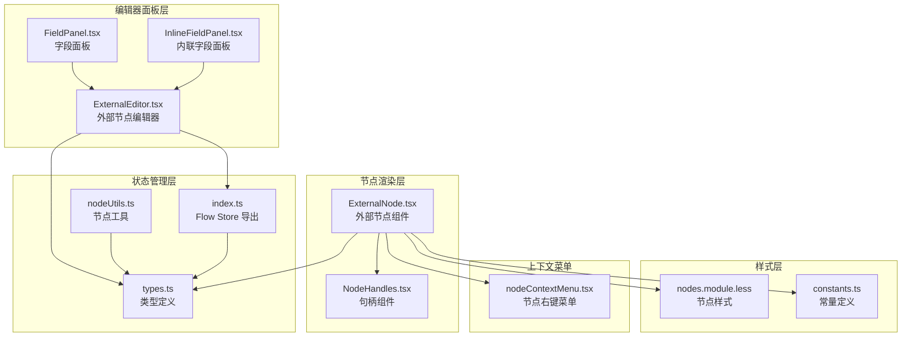
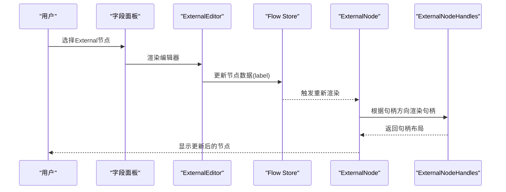
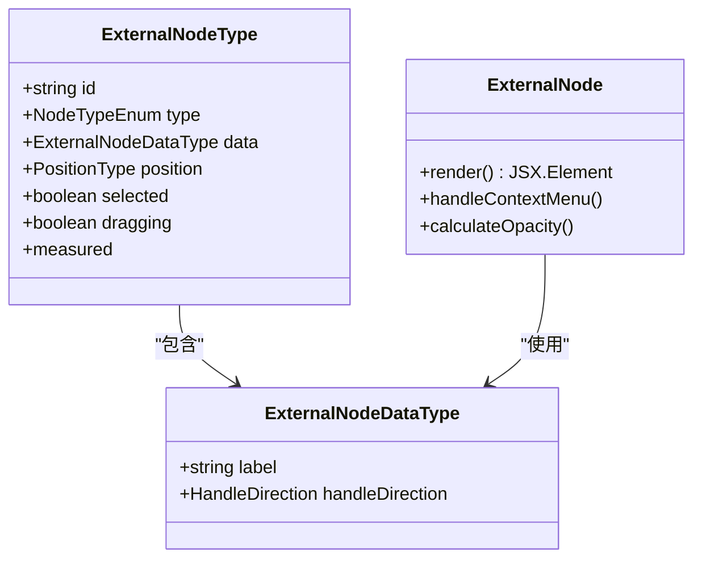
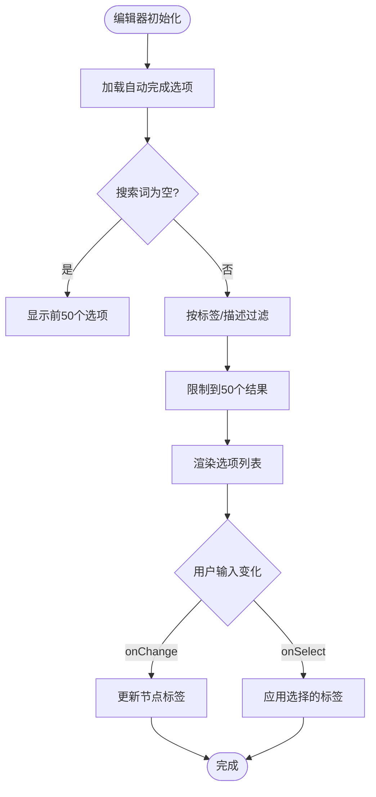
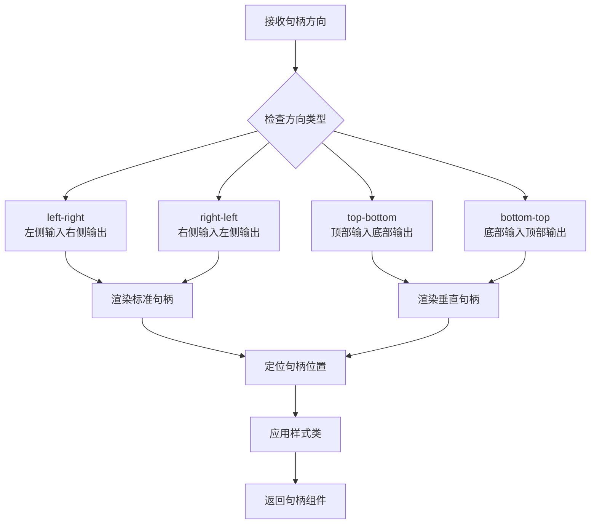
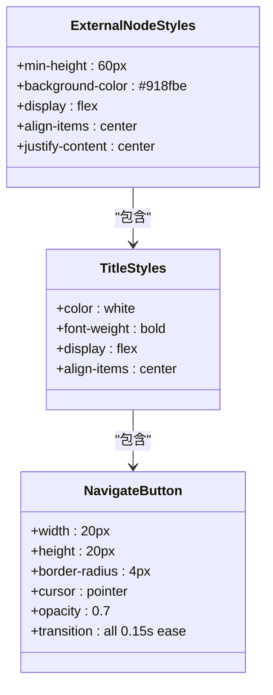
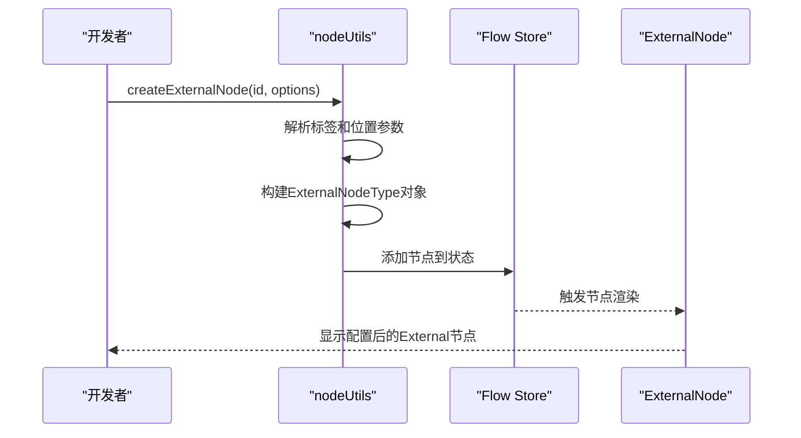
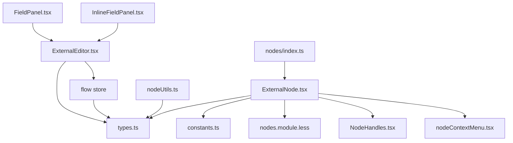

# External节点

<cite>
**本文档引用的文件**
- [ExternalNode.tsx](file://src/components/flow/nodes/ExternalNode.tsx)
- [ExternalEditor.tsx](file://src/components/panels/node-editors/ExternalEditor.tsx)
- [types.ts](file://src/stores/flow/types.ts)
- [nodeUtils.ts](file://src/stores/flow/utils/nodeUtils.ts)
- [constants.ts](file://src/components/flow/nodes/constants.ts)
- [nodes.module.less](file://src/styles/nodes.module.less)
- [NodeHandles.tsx](file://src/components/flow/nodes/components/NodeHandles.tsx)
- [nodeContextMenu.tsx](file://src/components/flow/nodes/nodeContextMenu.tsx)
- [index.ts](file://src/components/flow/nodes/index.ts)
- [FieldPanel.tsx](file://src/components/panels/main/FieldPanel.tsx)
- [InlineFieldPanel.tsx](file://src/components/panels/main/InlineFieldPanel.tsx)
- [index.ts](file://src/stores/flow/index.ts)
</cite>

## 目录
1. [简介](#简介)
2. [项目结构](#项目结构)
3. [核心组件](#核心组件)
4. [架构总览](#架构总览)
5. [详细组件分析](#详细组件分析)
6. [依赖关系分析](#依赖关系分析)
7. [性能考虑](#性能考虑)
8. [故障排除指南](#故障排除指南)
9. [结论](#结论)
10. [附录](#附录)

## 简介
External节点是工作流编辑器中的特殊标记节点，用于表示外部引用或工作流中的锚点/跳转目标。它不承载识别或动作逻辑，而是作为连接锚点和导航辅助存在。External节点具有简洁的视觉样式和有限的可配置属性，主要包含标签文本和句柄方向。

## 项目结构
External节点涉及前端渲染组件、编辑器面板、样式定义以及状态管理等多个层次：

**图表来源**
- [ExternalNode.tsx:1-167](file://src/components/flow/nodes/ExternalNode.tsx#L1-L167)
- [ExternalEditor.tsx:1-106](file://src/components/panels/node-editors/ExternalEditor.tsx#L1-L106)
- [types.ts:124-191](file://src/stores/flow/types.ts#L124-L191)
- [nodeUtils.ts:57-85](file://src/stores/flow/utils/nodeUtils.ts#L57-L85)
- [constants.ts:13-47](file://src/components/flow/nodes/constants.ts#L13-L47)
- [nodes.module.less:266-301](file://src/styles/nodes.module.less#L266-L301)
- [nodeContextMenu.tsx:369-585](file://src/components/flow/nodes/nodeContextMenu.tsx#L369-L585)

**章节来源**
- [ExternalNode.tsx:1-167](file://src/components/flow/nodes/ExternalNode.tsx#L1-L167)
- [ExternalEditor.tsx:1-106](file://src/components/panels/node-editors/ExternalEditor.tsx#L1-L106)
- [types.ts:124-191](file://src/stores/flow/types.ts#L124-L191)
- [nodeUtils.ts:57-85](file://src/stores/flow/utils/nodeUtils.ts#L57-L85)
- [constants.ts:13-47](file://src/components/flow/nodes/constants.ts#L13-L47)
- [nodes.module.less:266-301](file://src/styles/nodes.module.less#L266-L301)
- [nodeContextMenu.tsx:369-585](file://src/components/flow/nodes/nodeContextMenu.tsx#L369-L585)

## 核心组件
- ExternalNodeDataType：External节点的数据结构，包含标签和可选的句柄方向
- ExternalNodeType：External节点的完整类型定义，包含标识、类型、数据、位置等
- ExternalNode组件：负责渲染External节点及其上下文菜单
- ExternalEditor：提供External节点的字段编辑能力
- ExternalNodeHandles：根据句柄方向渲染外部节点的输入输出句柄

**章节来源**
- [types.ts:124-191](file://src/stores/flow/types.ts#L124-L191)
- [ExternalNode.tsx:28-145](file://src/components/flow/nodes/ExternalNode.tsx#L28-L145)
- [ExternalEditor.tsx:8-105](file://src/components/panels/node-editors/ExternalEditor.tsx#L8-L105)
- [NodeHandles.tsx:139-190](file://src/components/flow/nodes/components/NodeHandles.tsx#L139-L190)

## 架构总览
External节点在系统中的交互流程如下：

**图表来源**
- [FieldPanel.tsx:289](file://src/components/panels/main/FieldPanel.tsx#L289)
- [ExternalEditor.tsx:46-60](file://src/components/panels/node-editors/ExternalEditor.tsx#L46-L60)
- [ExternalNode.tsx:14-24](file://src/components/flow/nodes/ExternalNode.tsx#L14-L24)
- [NodeHandles.tsx:139-190](file://src/components/flow/nodes/components/NodeHandles.tsx#L139-L190)

## 详细组件分析

### ExternalNode 数据结构与用途
ExternalNodeDataType是最小化的数据结构，仅包含两个字段：
- label：节点显示标签
- handleDirection：句柄方向（可选，默认为"left-right"）

ExternalNodeType扩展了基础数据结构，增加了标准节点所需的标识、类型、位置等属性。

**图表来源**
- [types.ts:124-191](file://src/stores/flow/types.ts#L124-L191)
- [ExternalNode.tsx:28-145](file://src/components/flow/nodes/ExternalNode.tsx#L28-L145)

**章节来源**
- [types.ts:124-191](file://src/stores/flow/types.ts#L124-L191)
- [ExternalNode.tsx:28-145](file://src/components/flow/nodes/ExternalNode.tsx#L28-L145)

### ExternalEditor 编辑器实现
ExternalEditor提供了节点标签的自动完成功能，支持从跨文件服务获取建议项：

**图表来源**
- [ExternalEditor.tsx:19-60](file://src/components/panels/node-editors/ExternalEditor.tsx#L19-L60)

**章节来源**
- [ExternalEditor.tsx:1-106](file://src/components/panels/node-editors/ExternalEditor.tsx#L1-L106)

### 句柄系统与方向配置
ExternalNodeHandles根据HandleDirection枚举渲染相应的输入输出句柄：

**图表来源**
- [NodeHandles.tsx:10-28](file://src/components/flow/nodes/components/NodeHandles.tsx#L10-L28)
- [NodeHandles.tsx:139-190](file://src/components/flow/nodes/components/NodeHandles.tsx#L139-L190)
- [constants.ts:28-46](file://src/components/flow/nodes/constants.ts#L28-L46)

**章节来源**
- [NodeHandles.tsx:139-190](file://src/components/flow/nodes/components/NodeHandles.tsx#L139-L190)
- [constants.ts:28-46](file://src/components/flow/nodes/constants.ts#L28-L46)

### 渲染样式与交互行为
External节点采用深紫色背景，白色粗体标签，居中显示：

**图表来源**
- [nodes.module.less:266-301](file://src/styles/nodes.module.less#L266-L301)

**章节来源**
- [nodes.module.less:266-301](file://src/styles/nodes.module.less#L266-L301)

### 创建与配置示例
通过nodeUtils工具创建External节点：

**图表来源**
- [nodeUtils.ts:57-85](file://src/stores/flow/utils/nodeUtils.ts#L57-L85)
- [index.ts:48-61](file://src/stores/flow/index.ts#L48-L61)

**章节来源**
- [nodeUtils.ts:57-85](file://src/stores/flow/utils/nodeUtils.ts#L57-L85)
- [index.ts:48-61](file://src/stores/flow/index.ts#L48-L61)

## 依赖关系分析
External节点的依赖关系图：

**图表来源**
- [ExternalNode.tsx:6-12](file://src/components/flow/nodes/ExternalNode.tsx#L6-L12)
- [ExternalEditor.tsx:5](file://src/components/panels/node-editors/ExternalEditor.tsx#L5)
- [FieldPanel.tsx:289](file://src/components/panels/main/FieldPanel.tsx#L289)
- [InlineFieldPanel.tsx:95](file://src/components/panels/main/InlineFieldPanel.tsx#L95)
- [index.ts:2](file://src/components/flow/nodes/index.ts#L2)

**章节来源**
- [ExternalNode.tsx:6-12](file://src/components/flow/nodes/ExternalNode.tsx#L6-L12)
- [ExternalEditor.tsx:5](file://src/components/panels/node-editors/ExternalEditor.tsx#L5)
- [FieldPanel.tsx:289](file://src/components/panels/main/FieldPanel.tsx#L289)
- [InlineFieldPanel.tsx:95](file://src/components/panels/main/InlineFieldPanel.tsx#L95)
- [index.ts:2](file://src/components/flow/nodes/index.ts#L2)

## 性能考虑
- 节点渲染优化：ExternalNodeMemo使用浅比较避免不必要的重渲染
- 句柄更新：NodeHandles组件在方向变化时异步更新内部状态
- 透明度计算：根据焦点模式动态计算节点透明度，减少视觉干扰
- 自动完成：限制选项数量和搜索范围，提升响应速度

## 故障排除指南
常见问题及解决方案：
- 节点不显示：检查节点数据完整性，确保label字段存在
- 句柄位置异常：确认handleDirection枚举值正确，检查样式类应用
- 编辑器无响应：验证Flow Store状态更新机制，检查setNodeData调用
- 样式不生效：确认nodes.module.less文件正确引入，检查CSS优先级

**章节来源**
- [ExternalNode.tsx:147-166](file://src/components/flow/nodes/ExternalNode.tsx#L147-L166)
- [NodeHandles.tsx:141-161](file://src/components/flow/nodes/components/NodeHandles.tsx#L141-L161)

## 结论
External节点作为工作流中的轻量级标记组件，通过简洁的数据结构和明确的职责边界，在保持系统性能的同时提供了必要的连接锚点功能。其设计体现了"最小可用性"原则，既满足了基本需求，又避免了过度复杂化。

## 附录

### 使用场景对比
- External节点：外部引用、锚点标记、跳转目标
- Pipeline节点：核心业务逻辑，包含识别和动作参数
- Anchor节点：重定向节点，用于流程控制
- Sticker节点：便签备注，提供额外说明
- Group节点：分组容器，组织相关节点

### 配置参数说明
- label：节点显示文本，支持自动完成功能
- handleDirection：句柄方向，支持四种预设方向
- 位置属性：由React Flow框架自动管理
- 选择状态：支持多选和单选操作