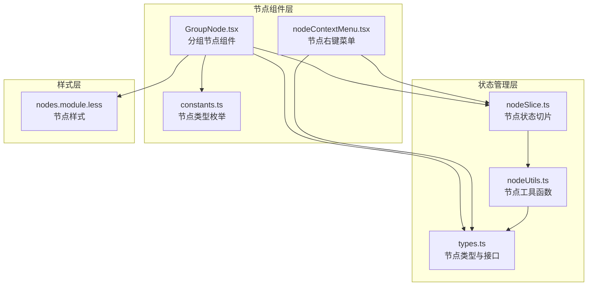
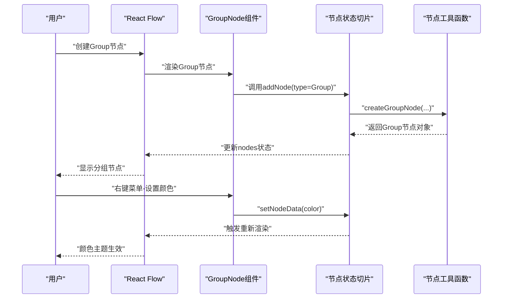
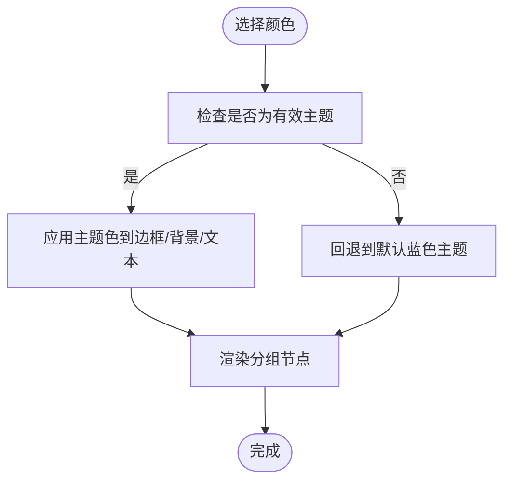
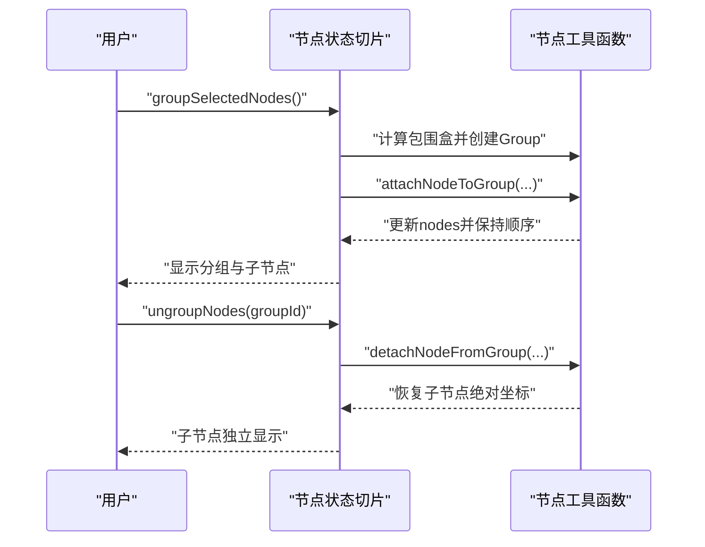
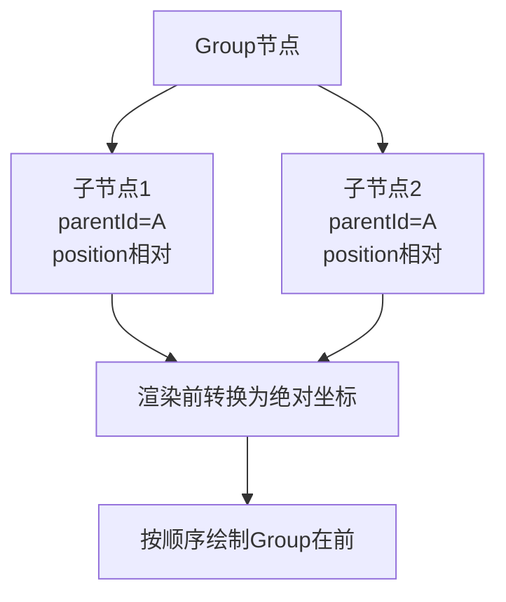
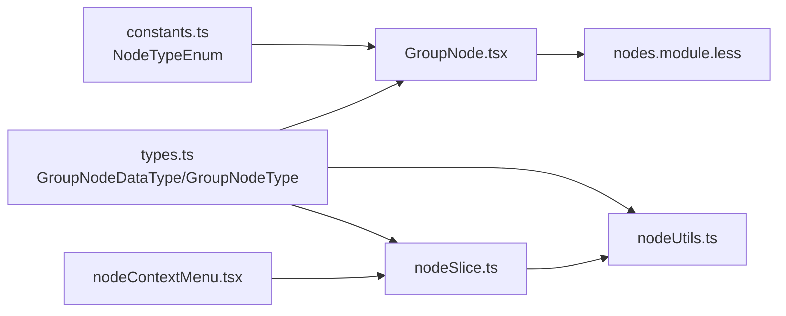

# Group分组节点

<cite>
**本文档引用的文件**
- [GroupNode.tsx](file://src/components/flow/nodes/GroupNode.tsx)
- [constants.ts](file://src/components/flow/nodes/constants.ts)
- [nodeContextMenu.tsx](file://src/components/flow/nodes/nodeContextMenu.tsx)
- [types.ts](file://src/stores/flow/types.ts)
- [nodeSlice.ts](file://src/stores/flow/slices/nodeSlice.ts)
- [nodeUtils.ts](file://src/stores/flow/utils/nodeUtils.ts)
- [nodes.module.less](file://src/styles/nodes.module.less)
</cite>

## 目录
1. [简介](#简介)
2. [项目结构](#项目结构)
3. [核心组件](#核心组件)
4. [架构总览](#架构总览)
5. [详细组件分析](#详细组件分析)
6. [依赖关系分析](#依赖关系分析)
7. [性能考虑](#性能考虑)
8. [故障排除指南](#故障排除指南)
9. [结论](#结论)

## 简介
本文件为Group分组节点提供全面技术文档，涵盖数据结构、颜色主题系统、工作流中的分组与组织能力、创建与管理操作、嵌套与层次结构、大型工作流中的导航与管理优势，以及与内部节点的交互关系和可见性控制。

## 项目结构
Group分组节点由前端React组件、节点类型定义、状态管理（Zustand slice）、工具函数与样式模块共同构成，位于Flow工作流的节点体系中。



**图表来源**
- [GroupNode.tsx:1-184](file://src/components/flow/nodes/GroupNode.tsx#L1-L184)
- [nodeContextMenu.tsx:1-586](file://src/components/flow/nodes/nodeContextMenu.tsx#L1-L586)
- [constants.ts:1-47](file://src/components/flow/nodes/constants.ts#L1-L47)
- [types.ts:151-163](file://src/stores/flow/types.ts#L151-L163)
- [nodeSlice.ts:36-691](file://src/stores/flow/slices/nodeSlice.ts#L36-L691)
- [nodeUtils.ts:277-315](file://src/stores/flow/utils/nodeUtils.ts#L277-L315)
- [nodes.module.less:632-694](file://src/styles/nodes.module.less#L632-L694)

**章节来源**
- [GroupNode.tsx:1-184](file://src/components/flow/nodes/GroupNode.tsx#L1-L184)
- [types.ts:151-163](file://src/stores/flow/types.ts#L151-L163)
- [nodeSlice.ts:36-691](file://src/stores/flow/slices/nodeSlice.ts#L36-L691)
- [nodeUtils.ts:277-315](file://src/stores/flow/utils/nodeUtils.ts#L277-L315)
- [nodes.module.less:632-694](file://src/styles/nodes.module.less#L632-L694)

## 核心组件
- GroupNodeDataType：分组节点的数据结构，包含label（标签）和color（颜色）两个关键属性。
- GroupColorTheme：颜色主题枚举，支持blue、green、purple、orange、gray五种颜色。
- GroupNodeType：分组节点的完整类型定义，包含id、type、data、position、dragging、selected、measured、style等字段。
- GroupNode组件：负责渲染分组节点UI，支持标题编辑、颜色主题应用、尺寸调整与右键菜单集成。
- 右键菜单：提供分组颜色切换、解散分组、删除分组等操作。

**章节来源**
- [types.ts:151-163](file://src/stores/flow/types.ts#L151-L163)
- [types.ts:222-235](file://src/stores/flow/types.ts#L222-L235)
- [GroupNode.tsx:12-47](file://src/components/flow/nodes/GroupNode.tsx#L12-L47)
- [GroupNode.tsx:112-161](file://src/components/flow/nodes/GroupNode.tsx#L112-L161)
- [nodeContextMenu.tsx:370-418](file://src/components/flow/nodes/nodeContextMenu.tsx#L370-L418)

## 架构总览
Group分组节点在工作流中的职责是作为容器节点，将多个内部节点组织在一个可视化的边界内，支持拖拽、缩放、颜色主题切换，并通过状态管理实现节点的创建、添加、移除与层级关系维护。



**图表来源**
- [GroupNode.tsx:112-161](file://src/components/flow/nodes/GroupNode.tsx#L112-L161)
- [nodeSlice.ts:132-288](file://src/stores/flow/slices/nodeSlice.ts#L132-L288)
- [nodeUtils.ts:277-315](file://src/stores/flow/utils/nodeUtils.ts#L277-L315)

## 详细组件分析

### GroupNode组件分析
- 数据绑定：通过useFlowStore读取与写入节点数据，实现label与color的双向绑定。
- 颜色主题：根据GroupColorTheme映射不同主题色，应用于边框、背景与文本。
- 交互行为：支持标题输入、失焦保存历史、尺寸调整（NodeResizer）与右键菜单。
- 性能优化：使用memo对组件进行浅比较，避免不必要的重渲染。

```mermaid
classDiagram
class GroupNode {
+props : NodeProps
+render() : JSX.Element
}
class GroupNodeDataType {
+label : string
+color : GroupColorTheme
}
class GroupColorTheme {
<<enum>>
"blue"
"green"
"purple"
"orange"
"gray"
}
class GroupNodeMemo {
+memo(Component, comparator)
}
GroupNode --> GroupNodeDataType : "使用"
GroupNodeDataType --> GroupColorTheme : "color属性"
GroupNodeMemo --> GroupNode : "包装"
```

**图表来源**
- [GroupNode.tsx:112-161](file://src/components/flow/nodes/GroupNode.tsx#L112-L161)
- [types.ts:151-163](file://src/stores/flow/types.ts#L151-L163)
- [types.ts:152-157](file://src/stores/flow/types.ts#L152-L157)

**章节来源**
- [GroupNode.tsx:12-47](file://src/components/flow/nodes/GroupNode.tsx#L12-L47)
- [GroupNode.tsx:52-109](file://src/components/flow/nodes/GroupNode.tsx#L52-L109)
- [GroupNode.tsx:112-161](file://src/components/flow/nodes/GroupNode.tsx#L112-L161)
- [GroupNode.tsx:163-183](file://src/components/flow/nodes/GroupNode.tsx#L163-L183)

### Group颜色主题系统
- 主题映射：GROUP_COLOR_THEMES将GroupColorTheme映射为bg、border、headerBg、text四类CSS值。
- 默认回退：当color不在枚举范围内时，默认使用blue主题。
- 视觉一致性：标题、头部背景与边框颜色统一遵循主题色。



**图表来源**
- [GroupNode.tsx:13-47](file://src/components/flow/nodes/GroupNode.tsx#L13-L47)
- [types.ts:152-157](file://src/stores/flow/types.ts#L152-L157)

**章节来源**
- [GroupNode.tsx:13-47](file://src/components/flow/nodes/GroupNode.tsx#L13-L47)
- [nodeContextMenu.tsx:370-418](file://src/components/flow/nodes/nodeContextMenu.tsx#L370-L418)

### 分组节点在工作流中的组织与管理
- 创建：通过addNode(type=Group)创建分组节点，自动分配label与默认color。
- 添加/移除：通过groupSelectedNodes、attachNodeToGroup、detachNodeFromGroup实现批量或单个节点的加入/移出。
- 解散：ungroupNodes将分组内的子节点还原为独立节点并恢复绝对坐标。
- 层次关系：ensureGroupNodeOrder确保Group节点在子节点之前，满足React Flow的父子顺序要求。



**图表来源**
- [nodeSlice.ts:523-598](file://src/stores/flow/slices/nodeSlice.ts#L523-L598)
- [nodeSlice.ts:600-635](file://src/stores/flow/slices/nodeSlice.ts#L600-L635)
- [nodeSlice.ts:637-689](file://src/stores/flow/slices/nodeSlice.ts#L637-L689)
- [nodeUtils.ts:321-334](file://src/stores/flow/utils/nodeUtils.ts#L321-L334)

**章节来源**
- [nodeSlice.ts:132-288](file://src/stores/flow/slices/nodeSlice.ts#L132-L288)
- [nodeSlice.ts:523-598](file://src/stores/flow/slices/nodeSlice.ts#L523-L598)
- [nodeSlice.ts:600-635](file://src/stores/flow/slices/nodeSlice.ts#L600-L635)
- [nodeSlice.ts:637-689](file://src/stores/flow/slices/nodeSlice.ts#L637-L689)
- [nodeUtils.ts:277-315](file://src/stores/flow/utils/nodeUtils.ts#L277-L315)
- [nodeUtils.ts:321-334](file://src/stores/flow/utils/nodeUtils.ts#L321-L334)

### 分组节点的嵌套与层次结构
- 嵌套规则：Group节点可包含其他节点，内部节点通过parentId建立父子关系，position为相对坐标。
- 坐标转换：getNodeAbsolutePosition在渲染时将相对坐标转换为绝对坐标，保证视觉一致性。
- 顺序保证：ensureGroupNodeOrder强制Group在子节点之前，确保渲染与交互正确性。



**图表来源**
- [nodeUtils.ts:199-213](file://src/stores/flow/utils/nodeUtils.ts#L199-L213)
- [nodeUtils.ts:321-334](file://src/stores/flow/utils/nodeUtils.ts#L321-L334)

**章节来源**
- [nodeUtils.ts:199-213](file://src/stores/flow/utils/nodeUtils.ts#L199-L213)
- [nodeUtils.ts:321-334](file://src/stores/flow/utils/nodeUtils.ts#L321-L334)

### 大型工作流中的管理与导航优势
- 视觉分层：通过颜色主题与虚线边框清晰区分不同功能域，降低复杂度。
- 批量操作：支持批量创建分组、批量添加/移除节点，提升效率。
- 导航便捷：分组可整体移动与缩放，便于在大型工作流中定位与调整。

**章节来源**
- [GroupNode.tsx:147-156](file://src/components/flow/nodes/GroupNode.tsx#L147-L156)
- [nodeContextMenu.tsx:370-418](file://src/components/flow/nodes/nodeContextMenu.tsx#L370-L418)

### 与内部节点的交互关系与可见性控制
- 交互关系：Group节点作为容器，内部节点受其布局约束；删除Group时会先解除子节点的父子关系。
- 可见性控制：Group节点本身不参与普通节点的焦点效果，但可通过右键菜单进行颜色与操作控制。
- 样式隔离：Group节点样式覆盖默认节点样式，确保容器外观一致。

**章节来源**
- [GroupNode.tsx:115-128](file://src/components/flow/nodes/GroupNode.tsx#L115-L128)
- [nodes.module.less:632-694](file://src/styles/nodes.module.less#L632-L694)

## 依赖关系分析
Group分组节点的依赖关系围绕类型定义、状态管理与工具函数展开，形成清晰的分层架构。



**图表来源**
- [constants.ts:14-20](file://src/components/flow/nodes/constants.ts#L14-L20)
- [types.ts:151-163](file://src/stores/flow/types.ts#L151-L163)
- [types.ts:222-235](file://src/stores/flow/types.ts#L222-L235)
- [nodeSlice.ts:36-691](file://src/stores/flow/slices/nodeSlice.ts#L36-L691)
- [nodeUtils.ts:277-315](file://src/stores/flow/utils/nodeUtils.ts#L277-L315)
- [GroupNode.tsx:1-11](file://src/components/flow/nodes/GroupNode.tsx#L1-L11)
- [nodes.module.less:632-694](file://src/styles/nodes.module.less#L632-L694)
- [nodeContextMenu.tsx:1-26](file://src/components/flow/nodes/nodeContextMenu.tsx#L1-L26)

**章节来源**
- [constants.ts:14-20](file://src/components/flow/nodes/constants.ts#L14-L20)
- [types.ts:151-163](file://src/stores/flow/types.ts#L151-L163)
- [types.ts:222-235](file://src/stores/flow/types.ts#L222-L235)
- [nodeSlice.ts:36-691](file://src/stores/flow/slices/nodeSlice.ts#L36-L691)
- [nodeUtils.ts:277-315](file://src/stores/flow/utils/nodeUtils.ts#L277-L315)
- [GroupNode.tsx:1-11](file://src/components/flow/nodes/GroupNode.tsx#L1-L11)
- [nodes.module.less:632-694](file://src/styles/nodes.module.less#L632-L694)
- [nodeContextMenu.tsx:1-26](file://src/components/flow/nodes/nodeContextMenu.tsx#L1-L26)

## 性能考虑
- 渲染优化：GroupNodeMemo通过浅比较避免非必要重渲染；NodeResizer仅在选中状态下显示，减少DOM开销。
- 状态更新：批量操作（如groupSelectedNodes）一次性更新nodes，减少多次渲染。
- 坐标计算：getNodeAbsolutePosition在渲染阶段进行，避免频繁计算带来的性能损耗。

[本节为通用性能建议，无需特定文件引用]

## 故障排除指南
- 颜色主题无效：确认color值属于GroupColorTheme枚举，否则将回退到默认蓝色。
- 分组无法拖动：检查Group节点是否在子节点之后，确保ensureGroupNodeOrder生效。
- 子节点丢失：删除Group节点时会先解除子节点父子关系，确认是否误删。
- 右键菜单不可用：确认节点类型为Group，右键菜单配置仅对Group节点开放。

**章节来源**
- [GroupNode.tsx:64-65](file://src/components/flow/nodes/GroupNode.tsx#L64-L65)
- [nodeUtils.ts:321-334](file://src/stores/flow/utils/nodeUtils.ts#L321-L334)
- [nodeSlice.ts:56-84](file://src/stores/flow/slices/nodeSlice.ts#L56-L84)
- [nodeContextMenu.tsx:375-418](file://src/components/flow/nodes/nodeContextMenu.tsx#L375-L418)

## 结论
Group分组节点通过明确的数据结构、完善的颜色主题系统与强大的状态管理，实现了对工作流节点的高效组织与可视化管理。其嵌套与层次结构设计使得在大型工作流中具备良好的可维护性与导航体验，同时通过右键菜单与样式模块提供了丰富的交互与定制能力。