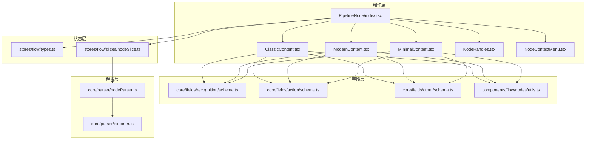
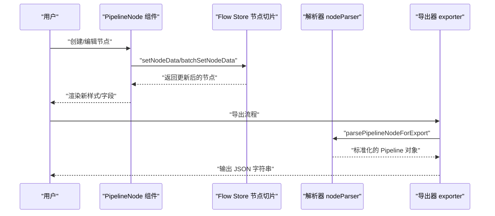
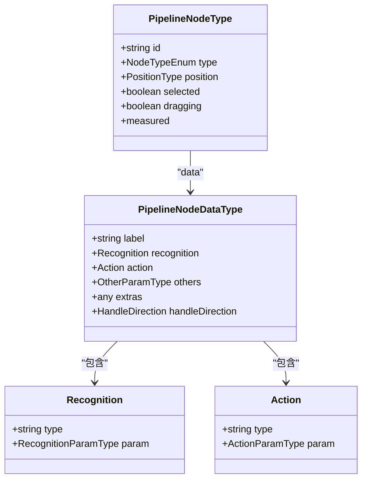
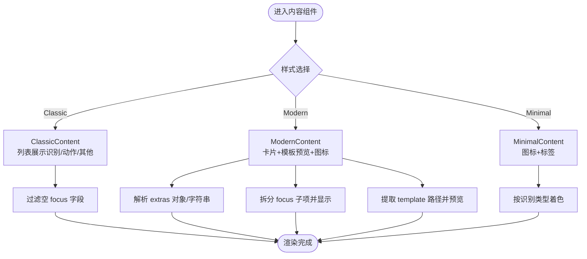
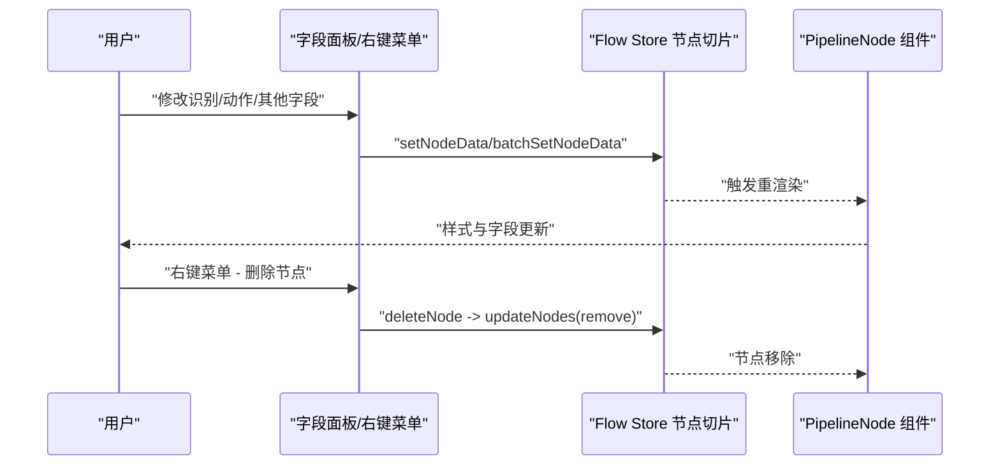
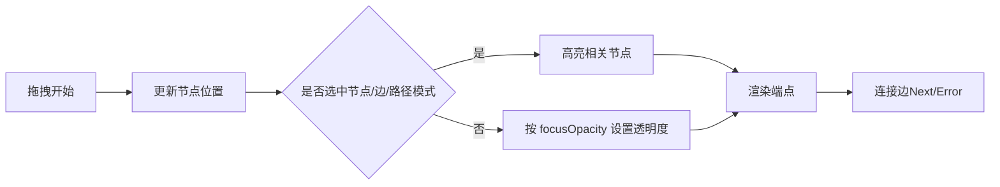
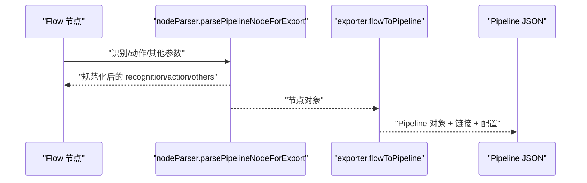
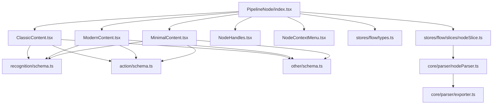

# Pipeline节点

<cite>
**本文档引用的文件**
- [PipelineNode/index.tsx](file://src/components/flow/nodes/PipelineNode/index.tsx)
- [PipelineNode/ClassicContent.tsx](file://src/components/flow/nodes/PipelineNode/ClassicContent.tsx)
- [PipelineNode/ModernContent.tsx](file://src/components/flow/nodes/PipelineNode/ModernContent.tsx)
- [PipelineNode/MinimalContent.tsx](file://src/components/flow/nodes/PipelineNode/MinimalContent.tsx)
- [stores/flow/types.ts](file://src/stores/flow/types.ts)
- [core/fields/recognition/schema.ts](file://src/core/fields/recognition/schema.ts)
- [core/fields/action/schema.ts](file://src/core/fields/action/schema.ts)
- [core/fields/other/schema.ts](file://src/core/fields/other/schema.ts)
- [stores/flow/slices/nodeSlice.ts](file://src/stores/flow/slices/nodeSlice.ts)
- [core/parser/nodeParser.ts](file://src/core/parser/nodeParser.ts)
- [core/parser/exporter.ts](file://src/core/parser/exporter.ts)
- [components/flow/nodes/utils.ts](file://src/components/flow/nodes/utils.ts)
- [components/flow/nodes/constants.ts](file://src/components/flow/nodes/constants.ts)
- [components/flow/nodes/components/NodeContextMenu.tsx](file://src/components/flow/nodes/components/NodeContextMenu.tsx)
- [components/flow/nodes/components/NodeHandles.tsx](file://src/components/flow/nodes/components/NodeHandles.tsx)
- [components/flow/nodes/utils/nodeOperations.tsx](file://src/components/flow/nodes/utils/nodeOperations.tsx)
</cite>

## 目录
1. [简介](#简介)
2. [项目结构](#项目结构)
3. [核心组件](#核心组件)
4. [架构总览](#架构总览)
5. [详细组件分析](#详细组件分析)
6. [依赖分析](#依赖分析)
7. [性能考量](#性能考量)
8. [故障排查指南](#故障排查指南)
9. [结论](#结论)
10. [附录](#附录)

## 简介
本文件系统性地阐述 Pipeline 节点的技术细节，包括：
- PipelineNodeType 的数据结构与三大部分：识别类型与参数、动作类型与参数、其他控制参数
- 识别参数、动作参数与其他参数的完整配置说明
- 三种显示样式（ClassicContent、ModernContent、MinimalContent）及其适用场景
- 节点的创建、配置、更新、删除与交互行为
- 节点数据的序列化与反序列化机制

## 项目结构
Pipeline 节点由前端 React 组件与状态管理、字段定义、解析导出模块共同组成，核心分布如下：
- 组件层：PipelineNode 及其三种内容样式组件
- 状态层：Flow Store 的节点切片，负责节点增删改与批量更新
- 字段层：识别、动作、其他参数的 Schema 定义
- 解析层：节点导出解析与整体 Flow 到 Pipeline 的转换

图表来源
- [PipelineNode/index.tsx:1-255](file://src/components/flow/nodes/PipelineNode/index.tsx#L1-L255)
- [stores/flow/types.ts:107-122](file://src/stores/flow/types.ts#L107-L122)
- [stores/flow/slices/nodeSlice.ts:290-394](file://src/stores/flow/slices/nodeSlice.ts#L290-L394)
- [core/fields/recognition/schema.ts:1-276](file://src/core/fields/recognition/schema.ts#L1-L276)
- [core/fields/action/schema.ts:1-299](file://src/core/fields/action/schema.ts#L1-L299)
- [core/fields/other/schema.ts:1-363](file://src/core/fields/other/schema.ts#L1-L363)
- [core/parser/nodeParser.ts:21-147](file://src/core/parser/nodeParser.ts#L21-L147)
- [core/parser/exporter.ts:42-210](file://src/core/parser/exporter.ts#L42-L210)

章节来源
- [PipelineNode/index.tsx:1-255](file://src/components/flow/nodes/PipelineNode/index.tsx#L1-L255)
- [stores/flow/types.ts:107-122](file://src/stores/flow/types.ts#L107-L122)

## 核心组件
- PipelineNode：统一入口，根据配置选择 Classic/Modern/Minimal 三种内容样式，渲染节点内容与端点，处理焦点与调试态样式，以及右键菜单。
- 内容样式组件：
  - ClassicContent：经典列表式展示，适合初学者与小规模配置
  - ModernContent：模块化卡片式展示，支持模板预览与图标
  - MinimalContent：极简图标+标签，适合大规模流程与高密度布局
- 节点数据结构：PipelineNodeDataType 与 PipelineNodeType
- 字段 Schema：识别、动作、其他参数的键、类型、默认值、描述
- 状态与操作：节点增删改、批量更新、分组、模板保存、复制等

章节来源
- [PipelineNode/ClassicContent.tsx:1-84](file://src/components/flow/nodes/PipelineNode/ClassicContent.tsx#L1-L84)
- [PipelineNode/ModernContent.tsx:1-248](file://src/components/flow/nodes/PipelineNode/ModernContent.tsx#L1-L248)
- [PipelineNode/MinimalContent.tsx:1-58](file://src/components/flow/nodes/PipelineNode/MinimalContent.tsx#L1-L58)
- [stores/flow/types.ts:107-122](file://src/stores/flow/types.ts#L107-L122)

## 架构总览
Pipeline 节点的运行链路：
- 用户在画布上创建/编辑节点 → 状态层更新节点数据 → 组件层渲染对应样式 → 解析层导出为 Pipeline JSON

图表来源
- [stores/flow/slices/nodeSlice.ts:290-394](file://src/stores/flow/slices/nodeSlice.ts#L290-L394)
- [core/parser/nodeParser.ts:21-147](file://src/core/parser/nodeParser.ts#L21-L147)
- [core/parser/exporter.ts:42-210](file://src/core/parser/exporter.ts#L42-L210)

## 详细组件分析

### 数据结构：PipelineNodeType 与 PipelineNodeDataType
- PipelineNodeType：节点元信息（id、type、position、selected、dragging 等）
- PipelineNodeDataType：节点数据主体，包含三大部分
  - 识别部分：{ type: string, param: RecognitionParamType }
  - 动作部分：{ type: string, param: ActionParamType }
  - 其他控制参数：OtherParamType（如超时、延迟、锚点、focus 等）

图表来源
- [stores/flow/types.ts:107-122](file://src/stores/flow/types.ts#L107-L122)
- [stores/flow/types.ts:165-177](file://src/stores/flow/types.ts#L165-L177)

章节来源
- [stores/flow/types.ts:107-122](file://src/stores/flow/types.ts#L107-L122)
- [stores/flow/types.ts:165-177](file://src/stores/flow/types.ts#L165-L177)

### 识别参数（RecognitionParamType）与 Schema
- 常用键：roi、roi_offset、template、threshold、method、green_mask、index、detector、ratio、lower、upper、connected、expected、replace、only_rec、model、labels、custom_recognition、custom_recognition_param 等
- Schema 定义了键、类型、默认值、步进、可选项与描述，用于字段面板渲染与校验

章节来源
- [stores/flow/types.ts:43-67](file://src/stores/flow/types.ts#L43-L67)
- [core/fields/recognition/schema.ts:1-276](file://src/core/fields/recognition/schema.ts#L1-L276)

### 动作参数（ActionParamType）与 Schema
- 常用键：target/target_offset、begin/end/swipes、duration、scroll、key/input_text、package/exec/args/detach、cmd/shell_timeout、filename/format/quality、custom_action、custom_action_param 等
- Schema 定义了键、类型、默认值、步进、可选项与描述，支持多类动作（点击、滑动、滚动、按键、输入、应用、命令、截图等）

章节来源
- [stores/flow/types.ts:69-88](file://src/stores/flow/types.ts#L69-L88)
- [core/fields/action/schema.ts:1-299](file://src/core/fields/action/schema.ts#L1-L299)

### 其他控制参数（OtherParamType）与 Schema
- 常用键：rate_limit、timeout、anchor、inverse、enabled、pre/post_delay、pre/post_wait_freezes/focus/repeat/repeat_delay/repeat_wait_freezes/attach
- focus 支持多种消息类型的模板字符串，支持占位符与国际化

章节来源
- [stores/flow/types.ts:90-102](file://src/stores/flow/types.ts#L90-L102)
- [core/fields/other/schema.ts:1-363](file://src/core/fields/other/schema.ts#L1-L363)

### 显示样式：ClassicContent、ModernContent、MinimalContent
- ClassicContent
  - 经典列表式，按模块展示识别/动作/其他字段
  - 支持 extras 的对象或字符串解析
  - 过滤空的 focus 字段
- ModernContent
  - 卡片式模块，左侧图标+右侧字段
  - 支持模板图片预览（基于 recognition.param.template）
  - 将 focus 对象拆分为子项并使用 displayName
  - 条件渲染“其他”模块
- MinimalContent
  - 极简图标+标签，按识别类型着色
  - 仅展示 label 与图标，适合高密度流程

图表来源
- [PipelineNode/ClassicContent.tsx:13-81](file://src/components/flow/nodes/PipelineNode/ClassicContent.tsx#L13-L81)
- [PipelineNode/ModernContent.tsx:31-245](file://src/components/flow/nodes/PipelineNode/ModernContent.tsx#L31-L245)
- [PipelineNode/MinimalContent.tsx:11-56](file://src/components/flow/nodes/PipelineNode/MinimalContent.tsx#L11-L56)

章节来源
- [PipelineNode/ClassicContent.tsx:13-81](file://src/components/flow/nodes/PipelineNode/ClassicContent.tsx#L13-L81)
- [PipelineNode/ModernContent.tsx:31-245](file://src/components/flow/nodes/PipelineNode/ModernContent.tsx#L31-L245)
- [PipelineNode/MinimalContent.tsx:11-56](file://src/components/flow/nodes/PipelineNode/MinimalContent.tsx#L11-L56)

### 节点创建、配置、更新与删除
- 创建
  - 通过 Flow Store 的 addNode，生成唯一 id 与 label，设置默认 handleDirection，支持自动连接与聚焦
- 配置
  - setNodeData：按 type（recognition/action/others/type/其他）更新节点数据，自动维护 param 的必填与默认值
  - batchSetNodeData：批量更新，保证一次性深拷贝与一致性
- 更新
  - 识别/动作类型切换时，自动清理/补充参数键与默认值
- 删除
  - 通过 nodeOperations 的 deleteNode 调用 Flow Store 的 updateNodes 执行删除

图表来源
- [stores/flow/slices/nodeSlice.ts:132-288](file://src/stores/flow/slices/nodeSlice.ts#L132-L288)
- [stores/flow/slices/nodeSlice.ts:290-394](file://src/stores/flow/slices/nodeSlice.ts#L290-L394)
- [components/flow/nodes/utils/nodeOperations.tsx:146-149](file://src/components/flow/nodes/utils/nodeOperations.tsx#L146-L149)

章节来源
- [stores/flow/slices/nodeSlice.ts:132-288](file://src/stores/flow/slices/nodeSlice.ts#L132-L288)
- [stores/flow/slices/nodeSlice.ts:290-394](file://src/stores/flow/slices/nodeSlice.ts#L290-L394)
- [components/flow/nodes/utils/nodeOperations.tsx:146-149](file://src/components/flow/nodes/utils/nodeOperations.tsx#L146-L149)

### 交互行为：拖拽、选择、连接
- 拖拽与选择
  - 节点组件根据 selected、dragging 与 focusOpacity 控制透明度与聚焦效果
  - 选中节点/边/路径模式下，相关节点高亮
- 连接
  - 端点类型：SourceHandleTypeEnum.Next/Error，TargetHandleTypeEnum.Target/JumpBack
  - 端点位置：支持 left-right、right-left、top-bottom、bottom-top 四种方向
  - NodeHandles 根据方向动态定位端点位置

图表来源
- [PipelineNode/index.tsx:55-115](file://src/components/flow/nodes/PipelineNode/index.tsx#L55-L115)
- [components/flow/nodes/components/NodeHandles.tsx:10-131](file://src/components/flow/nodes/components/NodeHandles.tsx#L10-L131)
- [components/flow/nodes/constants.ts:1-47](file://src/components/flow/nodes/constants.ts#L1-L47)

章节来源
- [PipelineNode/index.tsx:55-115](file://src/components/flow/nodes/PipelineNode/index.tsx#L55-L115)
- [components/flow/nodes/components/NodeHandles.tsx:10-131](file://src/components/flow/nodes/components/NodeHandles.tsx#L10-L131)
- [components/flow/nodes/constants.ts:1-47](file://src/components/flow/nodes/constants.ts#L1-L47)

### 序列化与反序列化
- 导出解析（nodeParser）
  - 识别/动作/其他参数按 Schema 进行类型匹配与规范化
  - v1/v2 协议差异：识别/动作可为字符串或对象；others 中 focus 单独提取
  - extras 支持对象或字符串，最终平铺到节点对象
- 整体导出（exporter）
  - flowToPipeline：遍历节点，按顺序与前缀生成 Pipeline 对象
  - 链接处理：按 sourceHandle 分组并按 label 排序，生成 next/on_error 链
  - 配置导出：根据配置决定是否导出配置块与视口信息
- 反序列化（导入）
  - parseNodeField：根据识别/动作版本将字段迁移到对应结构
  - normalizeRecoType/normalizeActionType：类型标准化

图表来源
- [core/parser/nodeParser.ts:21-147](file://src/core/parser/nodeParser.ts#L21-L147)
- [core/parser/exporter.ts:42-210](file://src/core/parser/exporter.ts#L42-L210)

章节来源
- [core/parser/nodeParser.ts:21-147](file://src/core/parser/nodeParser.ts#L21-L147)
- [core/parser/exporter.ts:42-210](file://src/core/parser/exporter.ts#L42-L210)

## 依赖分析
- 组件依赖
  - PipelineNode 依赖样式、配置、调试状态、右键菜单、三种内容样式与端点组件
  - 内容样式依赖字段 Schema、图标工具与模板图片组件
- 状态依赖
  - 节点切片负责节点增删改、批量更新、分组/解组、顺序管理
- 解析依赖
  - nodeParser 依赖字段 Schema 与类型匹配器
  - exporter 依赖 nodeParser 与边链接器

图表来源
- [PipelineNode/index.tsx:1-255](file://src/components/flow/nodes/PipelineNode/index.tsx#L1-L255)
- [stores/flow/slices/nodeSlice.ts:290-394](file://src/stores/flow/slices/nodeSlice.ts#L290-L394)
- [core/parser/nodeParser.ts:21-147](file://src/core/parser/nodeParser.ts#L21-L147)
- [core/parser/exporter.ts:42-210](file://src/core/parser/exporter.ts#L42-L210)

章节来源
- [PipelineNode/index.tsx:1-255](file://src/components/flow/nodes/PipelineNode/index.tsx#L1-L255)
- [stores/flow/slices/nodeSlice.ts:290-394](file://src/stores/flow/slices/nodeSlice.ts#L290-L394)

## 性能考量
- 渲染优化
  - PipelineNodeMemo 使用浅比较避免不必要的重渲染
  - 内容组件使用 memo 与 useMemo 缓存计算结果
- 状态更新
  - 批量更新 batchSetNodeData 减少多次状态变更带来的重渲染
- 导出性能
  - 按顺序与前缀生成，避免重复计算
  - 链接按组排序，减少边处理复杂度

[本节为通用指导，无需特定文件引用]

## 故障排查指南
- 节点名重复
  - setNodeData 与 batchSetNodeData 后会检查重复并报错
- 导出失败
  - flowToPipeline 在重复节点名时阻断并提示
- 复制 Reco JSON
  - 仅支持 Pipeline 节点，异常时提示并记录错误
- 右键菜单
  - NodeContextMenu 根据可见性/禁用条件动态生成菜单项

章节来源
- [stores/flow/slices/nodeSlice.ts:377-391](file://src/stores/flow/slices/nodeSlice.ts#L377-L391)
- [core/parser/exporter.ts:44-55](file://src/core/parser/exporter.ts#L44-L55)
- [components/flow/nodes/utils/nodeOperations.tsx:155-183](file://src/components/flow/nodes/utils/nodeOperations.tsx#L155-L183)
- [components/flow/nodes/components/NodeContextMenu.tsx:29-155](file://src/components/flow/nodes/components/NodeContextMenu.tsx#L29-L155)

## 结论
Pipeline 节点通过清晰的数据结构、完善的字段 Schema、灵活的显示样式与强大的解析导出能力，实现了从可视化编辑到可执行配置的完整闭环。合理使用三种样式与字段面板，可显著提升编辑效率与可维护性。

[本节为总结，无需特定文件引用]

## 附录

### 字段键与类型速览
- 识别参数键：roi、roi_offset、template、threshold、method、green_mask、index、detector、ratio、lower、upper、connected、expected、replace、only_rec、model、labels、custom_recognition、custom_recognition_param
- 动作参数键：target/target_offset、begin/end/swipes、duration、scroll、key/input_text、package/exec/args/detach、cmd/shell_timeout、filename/format/quality、custom_action、custom_action_param
- 其他参数键：rate_limit、timeout、anchor、inverse、enabled、max_hit、pre/post_delay、pre/post_wait_freezes、focus、repeat/repeat_delay/repeat_wait_freezes、attach

章节来源
- [core/fields/recognition/schema.ts:1-276](file://src/core/fields/recognition/schema.ts#L1-L276)
- [core/fields/action/schema.ts:1-299](file://src/core/fields/action/schema.ts#L1-L299)
- [core/fields/other/schema.ts:1-363](file://src/core/fields/other/schema.ts#L1-L363)