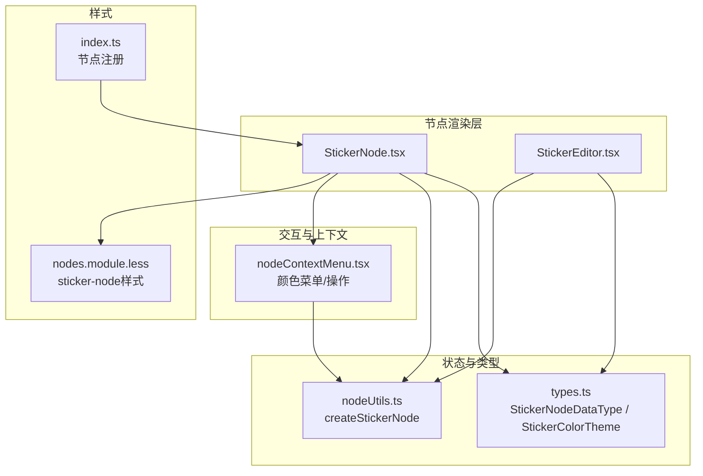
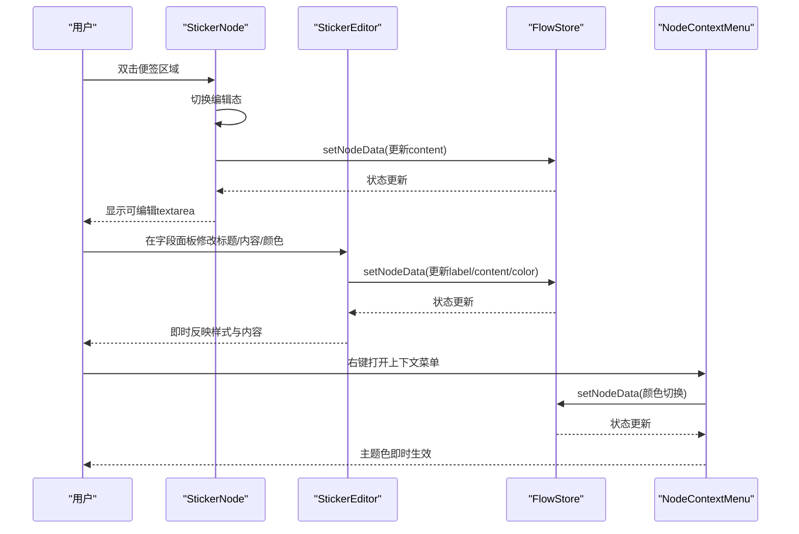
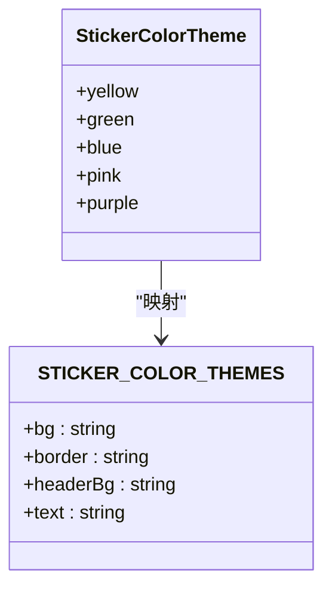
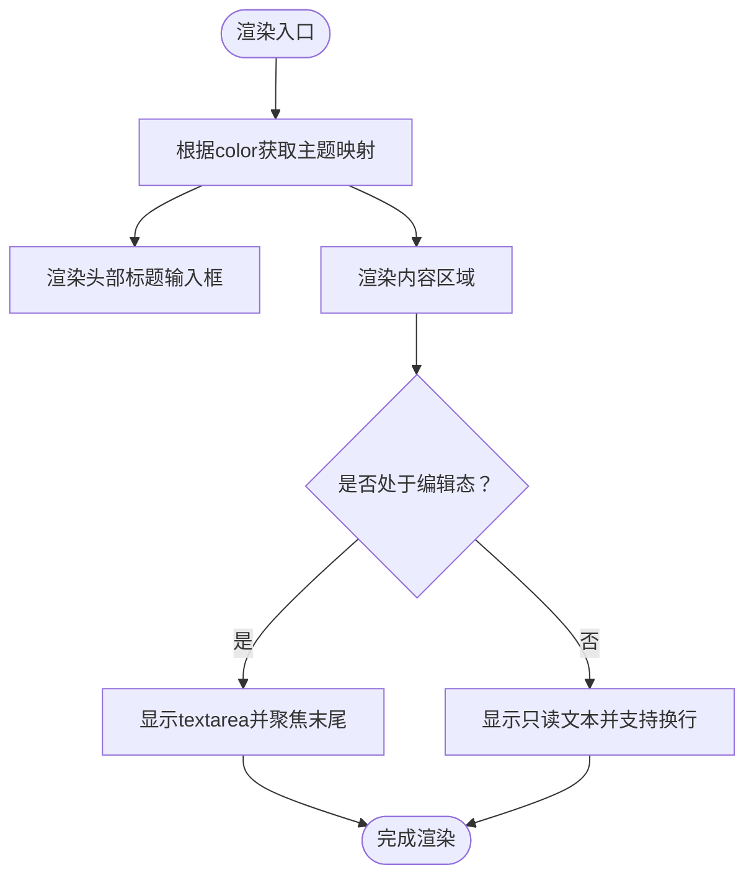
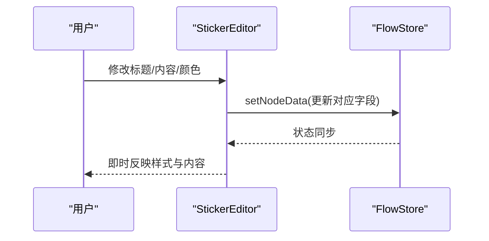
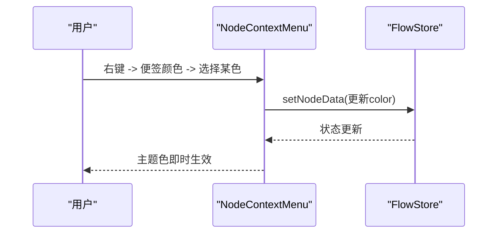
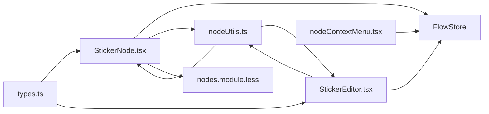

# Sticker便签节点

<cite>
**本文档引用的文件**
- [StickerNode.tsx](file://src/components/flow/nodes/StickerNode.tsx)
- [StickerEditor.tsx](file://src/components/panels/node-editors/StickerEditor.tsx)
- [types.ts](file://src/stores/flow/types.ts)
- [nodeUtils.ts](file://src/stores/flow/utils/nodeUtils.ts)
- [nodeContextMenu.tsx](file://src/components/flow/nodes/nodeContextMenu.tsx)
- [nodes.module.less](file://src/styles/nodes.module.less)
- [index.ts](file://src/components/flow/nodes/index.ts)
</cite>

## 目录
1. [简介](#简介)
2. [项目结构](#项目结构)
3. [核心组件](#核心组件)
4. [架构总览](#架构总览)
5. [详细组件分析](#详细组件分析)
6. [依赖关系分析](#依赖关系分析)
7. [性能考虑](#性能考虑)
8. [故障排除指南](#故障排除指南)
9. [结论](#结论)

## 简介
本文件为Sticker便签节点提供完整技术文档，涵盖其数据结构、颜色主题系统、在工作流中的注释与标记功能、创建与编辑流程、样式配置与渲染机制，并说明其在工作流文档化与团队协作中的价值。

## 项目结构
Sticker便签节点由前端节点组件、编辑器面板、状态管理与样式模块协同实现，主要涉及以下文件：
- 节点渲染与交互：StickerNode.tsx
- 节点编辑器：StickerEditor.tsx
- 数据类型定义：types.ts
- 节点创建与工具：nodeUtils.ts
- 上下文菜单与颜色切换：nodeContextMenu.tsx
- 样式与主题：nodes.module.less
- 节点注册入口：index.ts

**图表来源**
- [StickerNode.tsx:1-237](file://src/components/flow/nodes/StickerNode.tsx#L1-L237)
- [StickerEditor.tsx:1-132](file://src/components/panels/node-editors/StickerEditor.tsx#L1-L132)
- [types.ts:136-149](file://src/stores/flow/types.ts#L136-L149)
- [nodeUtils.ts:117-158](file://src/stores/flow/utils/nodeUtils.ts#L117-L158)
- [nodeContextMenu.tsx:456-495](file://src/components/flow/nodes/nodeContextMenu.tsx#L456-L495)
- [nodes.module.less:540-623](file://src/styles/nodes.module.less#L540-L623)
- [index.ts:1-15](file://src/components/flow/nodes/index.ts#L1-L15)

**章节来源**
- [StickerNode.tsx:1-237](file://src/components/flow/nodes/StickerNode.tsx#L1-L237)
- [StickerEditor.tsx:1-132](file://src/components/panels/node-editors/StickerEditor.tsx#L1-L132)
- [types.ts:136-149](file://src/stores/flow/types.ts#L136-L149)
- [nodeUtils.ts:117-158](file://src/stores/flow/utils/nodeUtils.ts#L117-L158)
- [nodeContextMenu.tsx:456-495](file://src/components/flow/nodes/nodeContextMenu.tsx#L456-L495)
- [nodes.module.less:540-623](file://src/styles/nodes.module.less#L540-L623)
- [index.ts:1-15](file://src/components/flow/nodes/index.ts#L1-L15)

## 核心组件
- StickerNodeDataType：便签节点的数据结构，包含标签、内容与颜色三项核心属性。
- StickerColorTheme：颜色主题枚举，支持yellow、green、blue、pink、purple五种颜色。
- StickerNode：负责便签节点的渲染、编辑、缩放与上下文菜单集成。
- StickerEditor：提供标题、内容与颜色的可视化编辑器。
- createStickerNode：创建便签节点的工厂方法，默认尺寸与颜色策略。

**章节来源**
- [types.ts:136-149](file://src/stores/flow/types.ts#L136-L149)
- [StickerNode.tsx:13-48](file://src/components/flow/nodes/StickerNode.tsx#L13-L48)
- [StickerNode.tsx:164-213](file://src/components/flow/nodes/StickerNode.tsx#L164-L213)
- [StickerEditor.tsx:21-64](file://src/components/panels/node-editors/StickerEditor.tsx#L21-L64)
- [nodeUtils.ts:117-158](file://src/stores/flow/utils/nodeUtils.ts#L117-L158)

## 架构总览
Sticker便签节点采用“组件-状态-样式-上下文菜单”的分层架构：
- 组件层：StickerNode负责UI渲染与用户交互；StickerEditor负责字段编辑。
- 状态层：通过FlowStore统一管理节点数据变更与历史记录。
- 样式层：nodes.module.less提供便签节点的视觉样式与主题变量。
- 交互层：nodeContextMenu.tsx提供颜色切换、复制内容等上下文操作。

**图表来源**
- [StickerNode.tsx:65-107](file://src/components/flow/nodes/StickerNode.tsx#L65-L107)
- [StickerEditor.tsx:44-64](file://src/components/panels/node-editors/StickerEditor.tsx#L44-L64)
- [nodeContextMenu.tsx:340-348](file://src/components/flow/nodes/nodeContextMenu.tsx#L340-L348)

## 详细组件分析

### 数据结构：StickerNodeDataType
- 字段定义
  - label: 标签字符串，作为便签标题显示。
  - content: 正文内容，支持多行文本。
  - color: 颜色主题，取值范围来自StickerColorTheme。
- 默认行为
  - 创建便签节点时，若未提供颜色，默认使用"yellow"。
  - 创建便签节点时，若未提供内容，默认为空字符串。

**章节来源**
- [types.ts:145-149](file://src/stores/flow/types.ts#L145-L149)
- [nodeUtils.ts:145-152](file://src/stores/flow/utils/nodeUtils.ts#L145-L152)

### 颜色主题系统：StickerColorTheme
- 支持五种颜色主题：yellow、green、blue、pink、purple。
- 主题映射包含背景色、边框色、头部背景色与文字色四要素。
- 主题应用逻辑
  - 渲染阶段：根据当前color从STICKER_COLOR_THEMES映射获取对应样式。
  - 编辑阶段：通过上下文菜单或编辑器选择器更新color并持久化。

**图表来源**
- [types.ts:137-142](file://src/stores/flow/types.ts#L137-L142)
- [StickerNode.tsx:14-48](file://src/components/flow/nodes/StickerNode.tsx#L14-L48)

**章节来源**
- [types.ts:137-142](file://src/stores/flow/types.ts#L137-L142)
- [StickerNode.tsx:14-48](file://src/components/flow/nodes/StickerNode.tsx#L14-L48)

### 渲染机制与视觉效果
- 节点容器
  - 使用NodeResizer提供可调整大小的能力，最小宽高分别为140与100。
  - 选中态下显示蓝色描边阴影，提升交互反馈。
- 内部布局
  - 头部区域：显示标题输入框，白色粗体字，支持占位提示。
  - 内容区域：双击进入编辑态显示textarea，非编辑态显示只读文本，支持自动换行与滚动。
  - 占位提示：当内容为空时显示斜体浅色提示语。
- 主题应用
  - 背景色、边框色、头部背景色与文字色均来自当前color的主题映射。

**图表来源**
- [StickerNode.tsx:53-162](file://src/components/flow/nodes/StickerNode.tsx#L53-L162)
- [nodes.module.less:547-622](file://src/styles/nodes.module.less#L547-L622)

**章节来源**
- [StickerNode.tsx:164-213](file://src/components/flow/nodes/StickerNode.tsx#L164-L213)
- [nodes.module.less:540-623](file://src/styles/nodes.module.less#L540-L623)

### 编辑器与样式配置
- 标题编辑：支持直接在标题输入框中修改label。
- 内容编辑：支持在textarea中修改content，失焦自动保存历史。
- 颜色选择：提供下拉选择器，支持五种颜色主题即时切换。
- 自适应尺寸：NodeResizer允许拖拽调整节点宽高，最小限制为140x100。

**图表来源**
- [StickerEditor.tsx:21-131](file://src/components/panels/node-editors/StickerEditor.tsx#L21-L131)

**章节来源**
- [StickerEditor.tsx:21-131](file://src/components/panels/node-editors/StickerEditor.tsx#L21-L131)

### 上下文菜单与颜色切换
- 右键菜单
  - 便签颜色子菜单：提供五种颜色选项，支持勾选当前颜色。
  - 复制便签内容：一键复制当前便签正文到剪贴板。
- 颜色切换流程
  - 用户点击颜色项后，调用handleSetStickerColor更新节点color。
  - 更新后保存历史记录，确保撤销/重做可用。

**图表来源**
- [nodeContextMenu.tsx:456-495](file://src/components/flow/nodes/nodeContextMenu.tsx#L456-L495)
- [nodeContextMenu.tsx:340-348](file://src/components/flow/nodes/nodeContextMenu.tsx#L340-L348)

**章节来源**
- [nodeContextMenu.tsx:456-495](file://src/components/flow/nodes/nodeContextMenu.tsx#L456-L495)
- [nodeContextMenu.tsx:340-348](file://src/components/flow/nodes/nodeContextMenu.tsx#L340-L348)

### 创建、编辑与样式配置示例
- 创建便签节点
  - 使用createStickerNode工厂方法，传入id、position、datas（包含content与color）与style（可选宽高）。
  - 默认color为"yellow"，默认content为空字符串。
- 编辑便签节点
  - 在StickerEditor中修改label、content、color。
  - 在StickerNode中双击内容区域进入编辑态，失焦保存历史。
- 样式配置
  - 通过NodeResizer调整节点尺寸（最小140x100）。
  - 通过颜色主题映射实现视觉风格统一。

**章节来源**
- [nodeUtils.ts:117-158](file://src/stores/flow/utils/nodeUtils.ts#L117-L158)
- [StickerNode.tsx:65-107](file://src/components/flow/nodes/StickerNode.tsx#L65-L107)
- [StickerEditor.tsx:44-64](file://src/components/panels/node-editors/StickerEditor.tsx#L44-L64)

### 工作流中的注释与标记功能
- 注释与标记
  - 便签节点用于在工作流图中添加说明性信息，便于理解流程意图。
  - 支持复制便签内容，便于在外部文档或讨论中复用。
- 文档化与协作
  - 通过颜色主题区分不同类别的注释（如提醒、注意、说明等）。
  - 与字段面板联动，提供一致的编辑体验与历史记录，便于回溯与协作。

**章节来源**
- [nodeContextMenu.tsx:429-437](file://src/components/flow/nodes/nodeContextMenu.tsx#L429-L437)
- [StickerEditor.tsx:66-130](file://src/components/panels/node-editors/StickerEditor.tsx#L66-L130)

## 依赖关系分析
- 组件耦合
  - StickerNode依赖FlowStore进行数据更新与历史保存，依赖NodeResizer与样式模块实现交互与外观。
  - StickerEditor同样依赖FlowStore，提供更直观的字段编辑体验。
  - 上下文菜单对Sticker节点提供颜色切换与内容复制等专用操作。
- 类型与工具
  - types.ts定义StickerNodeDataType与StickerColorTheme，确保类型安全。
  - nodeUtils.ts提供createStickerNode工厂方法，保证创建流程的一致性。

**图表来源**
- [StickerNode.tsx:1-12](file://src/components/flow/nodes/StickerNode.tsx#L1-L12)
- [StickerEditor.tsx:1-11](file://src/components/panels/node-editors/StickerEditor.tsx#L1-L11)
- [nodeContextMenu.tsx:1-10](file://src/components/flow/nodes/nodeContextMenu.tsx#L1-L10)
- [types.ts:136-149](file://src/stores/flow/types.ts#L136-L149)
- [nodeUtils.ts:117-158](file://src/stores/flow/utils/nodeUtils.ts#L117-L158)

**章节来源**
- [StickerNode.tsx:1-12](file://src/components/flow/nodes/StickerNode.tsx#L1-L12)
- [StickerEditor.tsx:1-11](file://src/components/panels/node-editors/StickerEditor.tsx#L1-L11)
- [nodeContextMenu.tsx:1-10](file://src/components/flow/nodes/nodeContextMenu.tsx#L1-L10)
- [types.ts:136-149](file://src/stores/flow/types.ts#L136-L149)
- [nodeUtils.ts:117-158](file://src/stores/flow/utils/nodeUtils.ts#L117-L158)

## 性能考虑
- 渲染优化
  - StickerNodeMemo通过浅比较关键字段（label、content、color）避免不必要重渲染。
  - NodeResizer仅在节点被选中时显示，减少非必要DOM开销。
- 状态更新
  - setNodeData按需更新字段，避免全量替换导致的性能损耗。
  - saveHistory在编辑结束时触发，降低频繁写入带来的抖动。

**章节来源**
- [StickerNode.tsx:215-236](file://src/components/flow/nodes/StickerNode.tsx#L215-L236)

## 故障排除指南
- 无法编辑内容
  - 检查StickerNode是否处于编辑态，确认handleDoubleClick与handleBlur事件绑定正常。
  - 确认textareaRef在编辑态正确聚焦并定位到末尾。
- 颜色切换无效
  - 检查handleSetStickerColor是否被调用，确认FlowStore的setNodeData与saveHistory执行顺序。
  - 确认上下文菜单中颜色项的visible条件仅对Sticker节点生效。
- 样式异常
  - 检查nodes.module.less中sticker-node相关类是否正确加载。
  - 确认STICKER_COLOR_THEMES映射与当前color一致。

**章节来源**
- [StickerNode.tsx:65-107](file://src/components/flow/nodes/StickerNode.tsx#L65-L107)
- [nodeContextMenu.tsx:340-348](file://src/components/flow/nodes/nodeContextMenu.tsx#L340-L348)
- [nodes.module.less:540-623](file://src/styles/nodes.module.less#L540-L623)

## 结论
Sticker便签节点以简洁的数据结构与丰富的交互能力，为工作流提供了高效的注释与标记手段。通过颜色主题系统、上下文菜单与字段编辑器的协同，实现了易用、可视化的节点样式配置与内容管理。其稳定的渲染与状态更新机制，确保了在复杂工作流场景下的流畅体验与协作效率。