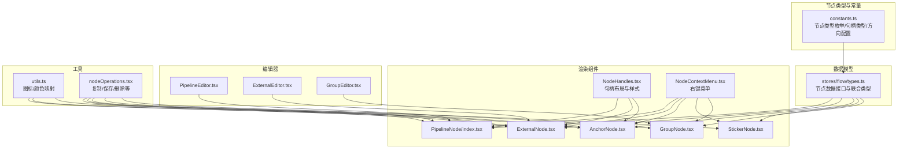
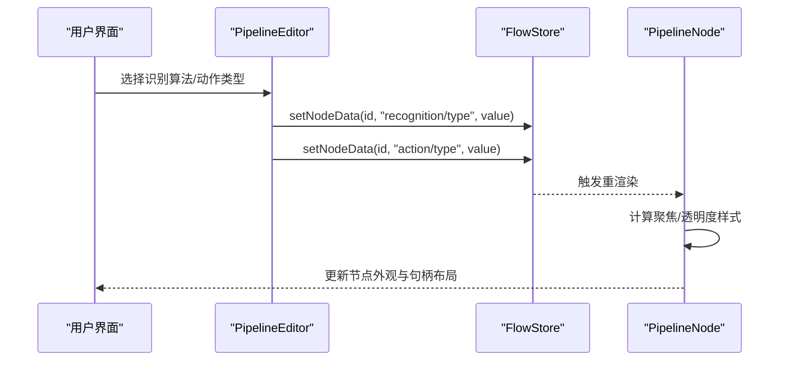
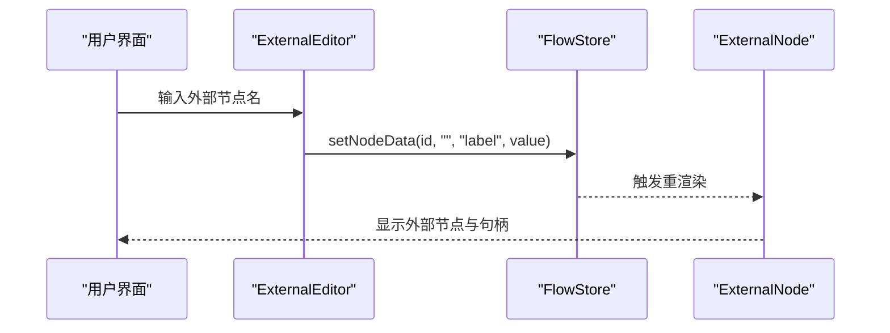
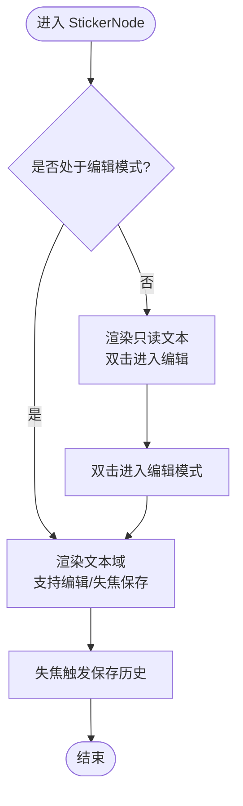
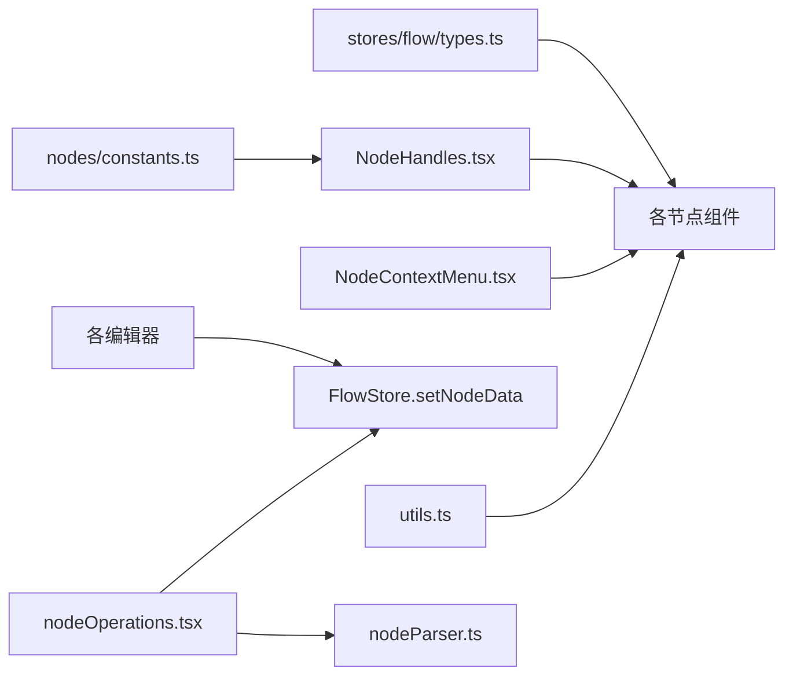

# 节点类型系统

<cite>
**本文档引用的文件**
- [src/components/flow/nodes/index.ts](file://src/components/flow/nodes/index.ts)
- [src/components/flow/nodes/constants.ts](file://src/components/flow/nodes/constants.ts)
- [src/stores/flow/types.ts](file://src/stores/flow/types.ts)
- [src/components/flow/nodes/PipelineNode/index.tsx](file://src/components/flow/nodes/PipelineNode/index.tsx)
- [src/components/flow/nodes/ExternalNode.tsx](file://src/components/flow/nodes/ExternalNode.tsx)
- [src/components/flow/nodes/AnchorNode.tsx](file://src/components/flow/nodes/AnchorNode.tsx)
- [src/components/flow/nodes/StickerNode.tsx](file://src/components/flow/nodes/StickerNode.tsx)
- [src/components/flow/nodes/GroupNode.tsx](file://src/components/flow/nodes/GroupNode.tsx)
- [src/components/flow/nodes/utils.ts](file://src/components/flow/nodes/utils.ts)
- [src/components/flow/nodes/utils/nodeOperations.tsx](file://src/components/flow/nodes/utils/nodeOperations.tsx)
- [src/components/flow/nodes/components/NodeContextMenu.tsx](file://src/components/flow/nodes/components/NodeContextMenu.tsx)
- [src/components/flow/nodes/components/NodeHandles.tsx](file://src/components/flow/nodes/components/NodeHandles.tsx)
- [src/components/panels/node-editors/PipelineEditor.tsx](file://src/components/panels/node-editors/PipelineEditor.tsx)
- [src/components/panels/node-editors/ExternalEditor.tsx](file://src/components/panels/node-editors/ExternalEditor.tsx)
- [src/components/panels/node-editors/GroupEditor.tsx](file://src/components/panels/node-editors/GroupEditor.tsx)
</cite>

## 目录
1. [简介](#简介)
2. [项目结构](#项目结构)
3. [核心组件](#核心组件)
4. [架构总览](#架构总览)
5. [详细组件分析](#详细组件分析)
6. [依赖分析](#依赖分析)
7. [性能考虑](#性能考虑)
8. [故障排除指南](#故障排除指南)
9. [结论](#结论)
10. [附录](#附录)

## 简介
本文件系统性地梳理了节点类型系统的设计与实现，涵盖 PipelineNodeType、ExternalNodeType、AnchorNodeType、StickerNodeType、GroupNodeType 等节点类型的结构、属性、行为与交互方式；阐明节点类型之间的关系与多态性；提供节点创建、配置、更新与删除的完整流程；并解释节点与 UI 组件的映射关系及渲染机制。

## 项目结构
节点类型系统主要由以下层次构成：
- 枚举与常量层：定义节点类型枚举、句柄类型与方向配置
- 数据模型层：定义各节点的数据结构与联合类型
- 渲染层：各节点组件负责 UI 渲染与交互
- 编辑器层：针对不同节点类型的字段面板与参数编辑
- 工具层：节点操作、上下文菜单、句柄布局等通用能力



图表来源
- [src/components/flow/nodes/constants.ts:1-47](file://src/components/flow/nodes/constants.ts#L1-L47)
- [src/stores/flow/types.ts:107-235](file://src/stores/flow/types.ts#L107-L235)
- [src/components/flow/nodes/PipelineNode/index.tsx:1-255](file://src/components/flow/nodes/PipelineNode/index.tsx#L1-L255)
- [src/components/flow/nodes/ExternalNode.tsx:1-167](file://src/components/flow/nodes/ExternalNode.tsx#L1-L167)
- [src/components/flow/nodes/AnchorNode.tsx:1-169](file://src/components/flow/nodes/AnchorNode.tsx#L1-L169)
- [src/components/flow/nodes/StickerNode.tsx:1-237](file://src/components/flow/nodes/StickerNode.tsx#L1-L237)
- [src/components/flow/nodes/GroupNode.tsx:1-184](file://src/components/flow/nodes/GroupNode.tsx#L1-L184)
- [src/components/flow/nodes/components/NodeHandles.tsx:1-254](file://src/components/flow/nodes/components/NodeHandles.tsx#L1-L254)
- [src/components/flow/nodes/components/NodeContextMenu.tsx:1-171](file://src/components/flow/nodes/components/NodeContextMenu.tsx#L1-L171)
- [src/components/panels/node-editors/PipelineEditor.tsx:1-800](file://src/components/panels/node-editors/PipelineEditor.tsx#L1-L800)
- [src/components/panels/node-editors/ExternalEditor.tsx:1-106](file://src/components/panels/node-editors/ExternalEditor.tsx#L1-L106)
- [src/components/panels/node-editors/GroupEditor.tsx:1-97](file://src/components/panels/node-editors/GroupEditor.tsx#L1-L97)
- [src/components/flow/nodes/utils.ts:1-139](file://src/components/flow/nodes/utils.ts#L1-L139)
- [src/components/flow/nodes/utils/nodeOperations.tsx:1-184](file://src/components/flow/nodes/utils/nodeOperations.tsx#L1-L184)

章节来源
- [src/components/flow/nodes/index.ts:1-26](file://src/components/flow/nodes/index.ts#L1-L26)
- [src/components/flow/nodes/constants.ts:1-47](file://src/components/flow/nodes/constants.ts#L1-L47)
- [src/stores/flow/types.ts:107-235](file://src/stores/flow/types.ts#L107-L235)

## 核心组件
本节聚焦五种节点类型的结构与职责：
- PipelineNodeType：包含识别与动作两部分参数，支持多种样式与调试态
- ExternalNodeType：外部跳转节点，用于跨文件引用
- AnchorNodeType：锚点重定向节点，支持回跳
- StickerNodeType：便签节点，支持可调整尺寸与多色彩主题
- GroupNodeType：分组容器节点，支持标题与颜色主题

此外，系统还提供统一的节点注册表与句柄布局、上下文菜单等通用能力。

章节来源
- [src/stores/flow/types.ts:107-235](file://src/stores/flow/types.ts#L107-L235)
- [src/components/flow/nodes/index.ts:1-26](file://src/components/flow/nodes/index.ts#L1-L26)
- [src/components/flow/nodes/constants.ts:1-47](file://src/components/flow/nodes/constants.ts#L1-L47)

## 架构总览
节点类型系统采用“数据模型 + 渲染组件 + 编辑器 + 工具”的分层设计，通过统一的节点注册表将节点类型与渲染组件绑定，并通过编辑器对节点数据进行可视化配置。

```mermaid
classDiagram
class NodeTypeEnum {
+Pipeline
+External
+Anchor
+Sticker
+Group
}
class PipelineNodeType {
+id : string
+type : NodeTypeEnum
+data : PipelineNodeDataType
+position : PositionType
+dragging? : boolean
+selected? : boolean
+measured? : Dimensions
}
class ExternalNodeType {
+id : string
+type : NodeTypeEnum
+data : ExternalNodeDataType
+position : PositionType
+dragging? : boolean
+selected? : boolean
+measured? : Dimensions
}
class AnchorNodeType {
+id : string
+type : NodeTypeEnum
+data : AnchorNodeDataType
+position : PositionType
+dragging? : boolean
+selected? : boolean
+measured? : Dimensions
}
class StickerNodeType {
+id : string
+type : NodeTypeEnum
+data : StickerNodeDataType
+position : PositionType
+dragging? : boolean
+selected? : boolean
+measured? : Dimensions
+style? : Record<string, any>
}
class GroupNodeType {
+id : string
+type : NodeTypeEnum
+data : GroupNodeDataType
+position : PositionType
+dragging? : boolean
+selected? : boolean
+measured? : Dimensions
+style? : Record<string, any>
}
class PipelineNodeDataType {
+label : string
+recognition : {type, param}
+action : {type, param}
+others : OtherParamType
+extras? : any
+type? : NodeTypeEnum
+handleDirection? : HandleDirection
}
class ExternalNodeDataType {
+label : string
+handleDirection? : HandleDirection
}
class AnchorNodeDataType {
+label : string
+handleDirection? : HandleDirection
}
class StickerNodeDataType {
+label : string
+content : string
+color : StickerColorTheme
}
class GroupNodeDataType {
+label : string
+color : GroupColorTheme
}
PipelineNodeType --> PipelineNodeDataType : "拥有"
ExternalNodeType --> ExternalNodeDataType : "拥有"
AnchorNodeType --> AnchorNodeDataType : "拥有"
StickerNodeType --> StickerNodeDataType : "拥有"
GroupNodeType --> GroupNodeDataType : "拥有"
class NodeContextMenu {
+menuItems
+onOpenChange
}
class NodeHandles {
+getHandlePositions(direction)
+PipelineNodeHandles
+ExternalNodeHandles
+AnchorNodeHandles
}
PipelineNodeDataType --> NodeHandles : "使用"
ExternalNodeDataType --> NodeHandles : "使用"
AnchorNodeDataType --> NodeHandles : "使用"
```

图表来源
- [src/stores/flow/types.ts:107-235](file://src/stores/flow/types.ts#L107-L235)
- [src/components/flow/nodes/components/NodeContextMenu.tsx:1-171](file://src/components/flow/nodes/components/NodeContextMenu.tsx#L1-L171)
- [src/components/flow/nodes/components/NodeHandles.tsx:1-254](file://src/components/flow/nodes/components/NodeHandles.tsx#L1-L254)

## 详细组件分析

### PipelineNodeType（流水线节点）
- 数据结构要点
  - 包含 label、recognition（type+param）、action（type+param）、others（通用控制参数）、extras（扩展字段）以及 handleDirection（句柄方向）
- 渲染与样式
  - 支持 classic/modern/minimal 三种样式，通过配置切换
  - 调试态下根据执行历史、当前节点、识别目标节点等状态应用不同样式
  - 与焦点透明度配置联动，实现“聚焦/弱化”视觉效果
- 交互与句柄
  - 使用 PipelineNodeHandles，支持 left-right/right-left/top-bottom/bottom-top 四种方向
  - 提供 next/error 源句柄与 target/jump_back 目标句柄
- 编辑器
  - PipelineEditor 提供识别算法、动作类型与 others 参数的可视化编辑，支持结构化/字符串模式切换与复杂字段管理



图表来源
- [src/components/panels/node-editors/PipelineEditor.tsx:1-800](file://src/components/panels/node-editors/PipelineEditor.tsx#L1-L800)
- [src/components/flow/nodes/PipelineNode/index.tsx:1-255](file://src/components/flow/nodes/PipelineNode/index.tsx#L1-L255)
- [src/components/flow/nodes/components/NodeHandles.tsx:1-254](file://src/components/flow/nodes/components/NodeHandles.tsx#L1-L254)

章节来源
- [src/stores/flow/types.ts:107-122](file://src/stores/flow/types.ts#L107-L122)
- [src/components/flow/nodes/PipelineNode/index.tsx:1-255](file://src/components/flow/nodes/PipelineNode/index.tsx#L1-L255)
- [src/components/panels/node-editors/PipelineEditor.tsx:1-800](file://src/components/panels/node-editors/PipelineEditor.tsx#L1-L800)

### ExternalNodeType（外部节点）
- 数据结构要点
  - 包含 label 与可选的 handleDirection
- 渲染与交互
  - 使用 ExternalNodeHandles，支持四向句柄布局
  - 与 PipelineNode 类似，具备聚焦/弱化视觉反馈
- 编辑器
  - ExternalEditor 提供自动补全与搜索，便于选择外部引用节点



图表来源
- [src/components/panels/node-editors/ExternalEditor.tsx:1-106](file://src/components/panels/node-editors/ExternalEditor.tsx#L1-L106)
- [src/components/flow/nodes/ExternalNode.tsx:1-167](file://src/components/flow/nodes/ExternalNode.tsx#L1-L167)
- [src/components/flow/nodes/components/NodeHandles.tsx:1-254](file://src/components/flow/nodes/components/NodeHandles.tsx#L1-L254)

章节来源
- [src/stores/flow/types.ts:124-128](file://src/stores/flow/types.ts#L124-L128)
- [src/components/flow/nodes/ExternalNode.tsx:1-167](file://src/components/flow/nodes/ExternalNode.tsx#L1-L167)
- [src/components/panels/node-editors/ExternalEditor.tsx:1-106](file://src/components/panels/node-editors/ExternalEditor.tsx#L1-L106)

### AnchorNodeType（锚点节点）
- 数据结构要点
  - 包含 label 与可选的 handleDirection
- 渲染与交互
  - 使用 AnchorNodeHandles，支持四向句柄布局
  - 与 PipelineNode 类似，具备聚焦/弱化视觉反馈
- 应用场景
  - 用于流程回跳与重定向，配合 jump_back 目标句柄使用

章节来源
- [src/stores/flow/types.ts:130-134](file://src/stores/flow/types.ts#L130-L134)
- [src/components/flow/nodes/AnchorNode.tsx:1-169](file://src/components/flow/nodes/AnchorNode.tsx#L1-L169)
- [src/components/flow/nodes/components/NodeHandles.tsx:1-254](file://src/components/flow/nodes/components/NodeHandles.tsx#L1-L254)

### StickerNodeType（便签节点）
- 数据结构要点
  - 包含 label、content、color（黄色/绿色/蓝色/粉色/紫色）
- 渲染与交互
  - 支持 NodeResizer 调整尺寸
  - 双击进入编辑模式，实时保存内容
  - 不受“聚焦/弱化”视觉规则影响
- 主题与样式
  - 通过 STICKER_COLOR_THEMES 定义颜色方案，动态应用背景、边框与文字颜色



图表来源
- [src/components/flow/nodes/StickerNode.tsx:1-237](file://src/components/flow/nodes/StickerNode.tsx#L1-L237)

章节来源
- [src/stores/flow/types.ts:144-149](file://src/stores/flow/types.ts#L144-L149)
- [src/components/flow/nodes/StickerNode.tsx:1-237](file://src/components/flow/nodes/StickerNode.tsx#L1-L237)

### GroupNodeType（分组节点）
- 数据结构要点
  - 包含 label、color（蓝色/绿色/紫色/橙色/灰色）
- 渲染与交互
  - 支持 NodeResizer 调整尺寸
  - 子节点在分组区域内渲染
  - 不受“聚焦/弱化”视觉规则影响
- 主题与样式
  - 通过 GROUP_COLOR_THEMES 定义颜色方案，动态应用背景、边框与标题颜色

章节来源
- [src/stores/flow/types.ts:159-163](file://src/stores/flow/types.ts#L159-L163)
- [src/components/flow/nodes/GroupNode.tsx:1-184](file://src/components/flow/nodes/GroupNode.tsx#L1-L184)

### 节点注册与多态性
- 注册表
  - 通过 nodeTypes 将 NodeTypeEnum 与对应组件进行绑定，实现按类型渲染
- 多态性体现
  - 所有节点共享统一的接口（id/type/data/position/selected/dragging/measured），在渲染层以多态方式处理不同类型节点
  - 句柄与上下文菜单在各节点内部复用统一逻辑

章节来源
- [src/components/flow/nodes/index.ts:1-26](file://src/components/flow/nodes/index.ts#L1-L26)
- [src/stores/flow/types.ts:238-243](file://src/stores/flow/types.ts#L238-L243)

## 依赖分析
- 节点类型与渲染组件
  - PipelineNode、ExternalNode、AnchorNode 均依赖 NodeHandles 进行句柄布局
  - 所有节点均依赖 NodeContextMenu 提供右键菜单
- 编辑器与数据存储
  - 各编辑器通过 FlowStore 的 setNodeData 接口更新节点数据
  - PipelineEditor 依赖字段工厂与 Schema 进行参数校验与渲染
- 工具与图标
  - utils.ts 提供识别/动作/节点类型的图标映射与极简节点颜色方案
  - nodeOperations.tsx 提供复制节点名、保存为模板、删除节点、复制识别 JSON 等通用操作



图表来源
- [src/stores/flow/types.ts:107-235](file://src/stores/flow/types.ts#L107-L235)
- [src/components/flow/nodes/constants.ts:1-47](file://src/components/flow/nodes/constants.ts#L1-L47)
- [src/components/flow/nodes/components/NodeHandles.tsx:1-254](file://src/components/flow/nodes/components/NodeHandles.tsx#L1-L254)
- [src/components/flow/nodes/components/NodeContextMenu.tsx:1-171](file://src/components/flow/nodes/components/NodeContextMenu.tsx#L1-L171)
- [src/components/panels/node-editors/PipelineEditor.tsx:1-800](file://src/components/panels/node-editors/PipelineEditor.tsx#L1-L800)
- [src/components/flow/nodes/utils.ts:1-139](file://src/components/flow/nodes/utils.ts#L1-L139)
- [src/components/flow/nodes/utils/nodeOperations.tsx:1-184](file://src/components/flow/nodes/utils/nodeOperations.tsx#L1-L184)

章节来源
- [src/components/flow/nodes/utils/nodeOperations.tsx:1-184](file://src/components/flow/nodes/utils/nodeOperations.tsx#L1-L184)

## 性能考虑
- 渲染优化
  - 各节点组件普遍使用 memo 包装，基于浅比较减少不必要的重渲染
  - PipelineNode 在 memo 比较中对 data 的关键字段进行深比较（JSON 序列化对比），确保参数变化时及时更新
- 句柄布局
  - NodeHandles 在方向变化时主动调用 updateNodeInternals，确保句柄位置即时生效
- 编辑体验
  - PipelineEditor 对复杂字段提供结构化/字符串两种模式，避免一次性渲染过多控件导致卡顿

章节来源
- [src/components/flow/nodes/PipelineNode/index.tsx:196-254](file://src/components/flow/nodes/PipelineNode/index.tsx#L196-L254)
- [src/components/flow/nodes/ExternalNode.tsx:147-166](file://src/components/flow/nodes/ExternalNode.tsx#L147-L166)
- [src/components/flow/nodes/AnchorNode.tsx:149-168](file://src/components/flow/nodes/AnchorNode.tsx#L149-L168)
- [src/components/flow/nodes/StickerNode.tsx:215-236](file://src/components/flow/nodes/StickerNode.tsx#L215-L236)
- [src/components/flow/nodes/GroupNode.tsx:163-183](file://src/components/flow/nodes/GroupNode.tsx#L163-L183)
- [src/components/flow/nodes/components/NodeHandles.tsx:47-59](file://src/components/flow/nodes/components/NodeHandles.tsx#L47-L59)

## 故障排除指南
- 句柄位置异常
  - 现象：句柄未按预期方向显示
  - 排查：确认 handleDirection 设置与 getHandlePositions 返回值一致；检查 NodeHandles 是否调用了 updateNodeInternals
- 节点样式未更新
  - 现象：修改 label 或 color 后外观未变化
  - 排查：确认 setNodeData 调用链路；检查 memo 比较条件是否阻断了更新
- 编辑器字段不生效
  - 现象：修改识别/动作参数后未反映到节点
  - 排查：确认字段 schema 与 setNodeData 的 key 路径一致；检查 PipelineEditor 的参数列表渲染逻辑
- 右键菜单不可用
  - 现象：右键无响应
  - 排查：确认 NodeContextMenu 的 visible/disabled 条件；检查 onOpenChange 回调

章节来源
- [src/components/flow/nodes/components/NodeHandles.tsx:47-59](file://src/components/flow/nodes/components/NodeHandles.tsx#L47-L59)
- [src/components/panels/node-editors/PipelineEditor.tsx:1-800](file://src/components/panels/node-editors/PipelineEditor.tsx#L1-L800)
- [src/components/flow/nodes/components/NodeContextMenu.tsx:1-171](file://src/components/flow/nodes/components/NodeContextMenu.tsx#L1-L171)

## 结论
节点类型系统通过清晰的数据模型、可复用的渲染组件与编辑器，实现了对不同类型节点的一致化管理与差异化呈现。借助统一的注册表与工具层，系统在保持扩展性的同时兼顾了性能与易用性。未来可在以下方面持续优化：
- 引入更细粒度的状态切片，降低全局更新范围
- 增强编辑器的参数校验与错误提示
- 丰富节点主题与图标库，提升可视化表达力

## 附录

### 节点类型与 UI 组件映射
- PipelineNodeType → PipelineNode（含三种样式与调试态）
- ExternalNodeType → ExternalNode（外部引用）
- AnchorNodeType → AnchorNode（锚点/回跳）
- StickerNodeType → StickerNode（便签）
- GroupNodeType → GroupNode（分组容器）

章节来源
- [src/components/flow/nodes/index.ts:1-26](file://src/components/flow/nodes/index.ts#L1-L26)
- [src/stores/flow/types.ts:165-235](file://src/stores/flow/types.ts#L165-L235)

### 实际使用示例（流程说明）
- 创建节点
  - 通过 FlowStore.addNode 并指定 type 与 data（如 PipelineNodeDataType）
  - 渲染层根据 NodeTypeEnum 自动匹配对应组件
- 配置节点
  - 使用对应编辑器（PipelineEditor/ExternalEditor/GroupEditor）修改字段
  - setNodeData 通过路径更新节点数据
- 更新节点
  - 修改 label/color/content 等字段，触发 memo 比较与重渲染
- 删除节点
  - 调用 deleteNode（封装 updateNodes/remove）移除节点

章节来源
- [src/components/flow/nodes/utils/nodeOperations.tsx:146-149](file://src/components/flow/nodes/utils/nodeOperations.tsx#L146-L149)
- [src/components/flow/nodes/PipelineNode/index.tsx:196-254](file://src/components/flow/nodes/PipelineNode/index.tsx#L196-L254)
- [src/components/flow/nodes/ExternalNode.tsx:147-166](file://src/components/flow/nodes/ExternalNode.tsx#L147-L166)
- [src/components/flow/nodes/AnchorNode.tsx:149-168](file://src/components/flow/nodes/AnchorNode.tsx#L149-L168)
- [src/components/flow/nodes/StickerNode.tsx:215-236](file://src/components/flow/nodes/StickerNode.tsx#L215-L236)
- [src/components/flow/nodes/GroupNode.tsx:163-183](file://src/components/flow/nodes/GroupNode.tsx#L163-L183)