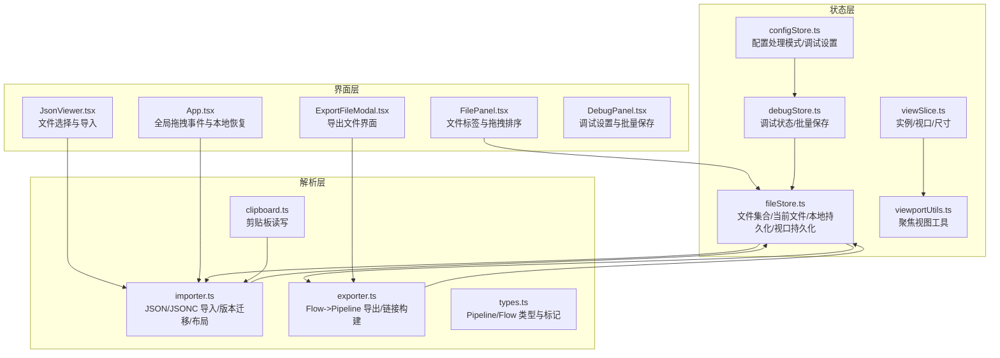
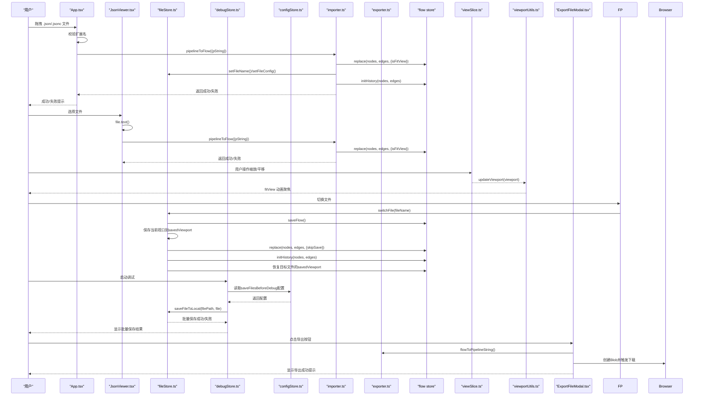
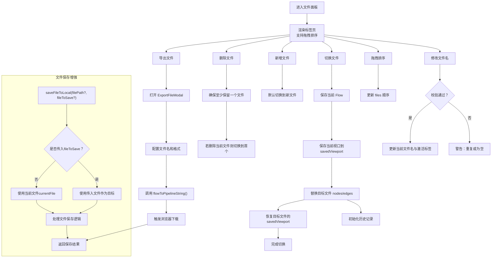
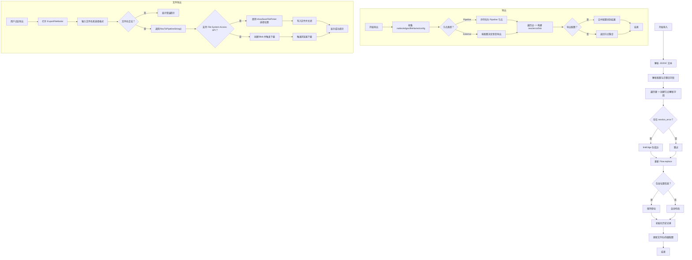
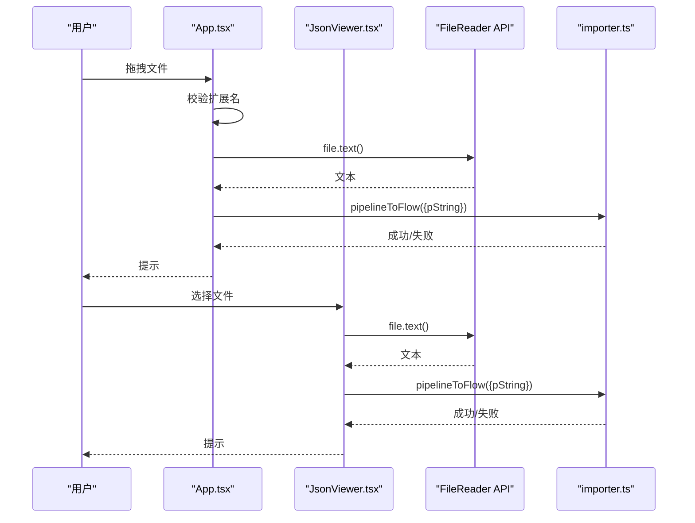
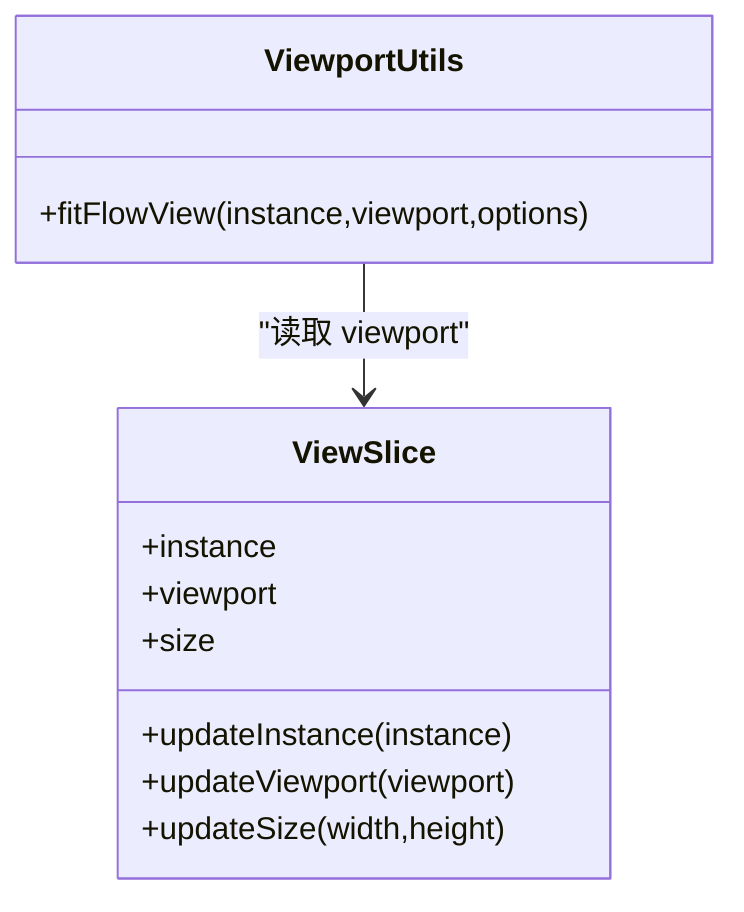
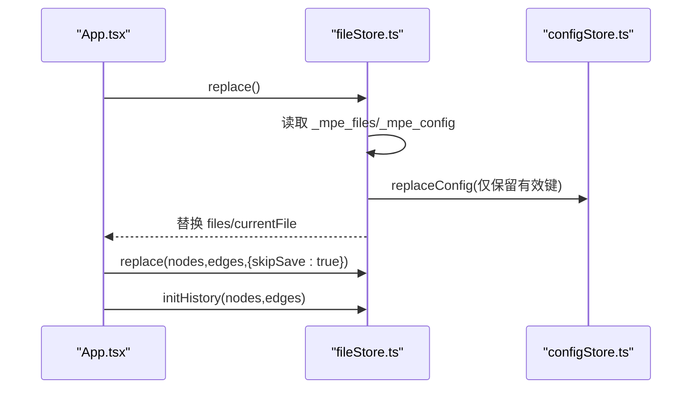
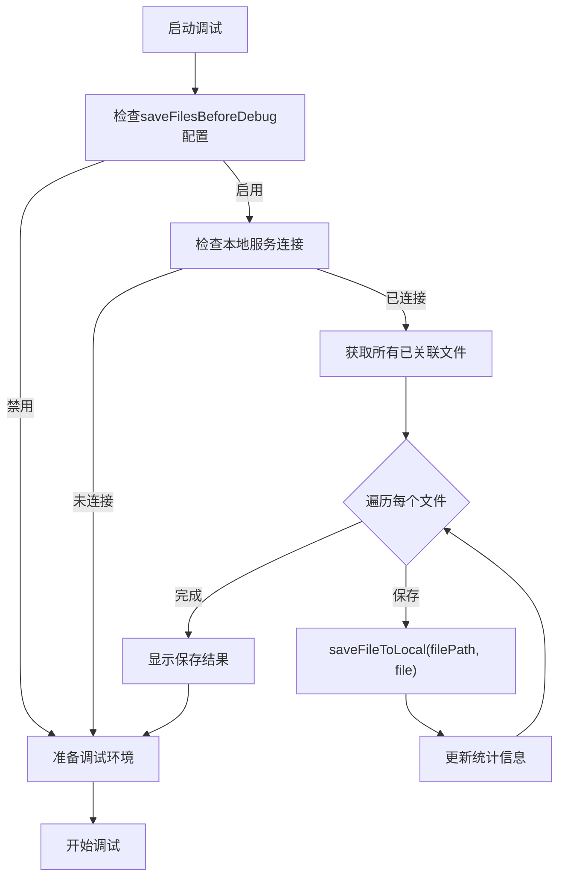
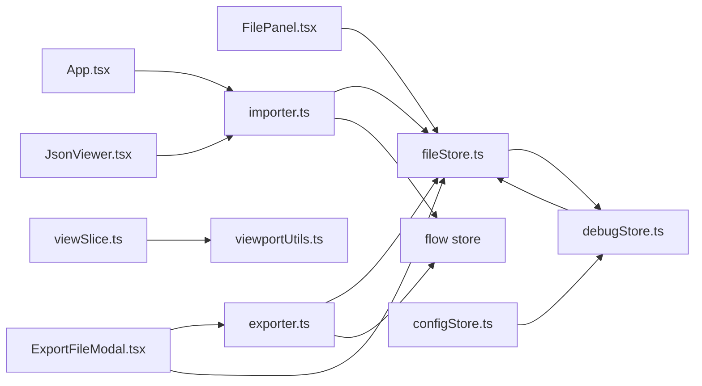

# 文件与视口

<cite>
**本文引用的文件**
- [src/components/panels/FilePanel.tsx](file://src/components/panels/FilePanel.tsx)
- [src/components/JsonViewer.tsx](file://src/components/JsonViewer.tsx)
- [src/App.tsx](file://src/App.tsx)
- [src/core/parser/importer.ts](file://src/core/parser/importer.ts)
- [src/core/parser/exporter.ts](file://src/core/parser/exporter.ts)
- [src/core/parser/types.ts](file://src/core/parser/types.ts)
- [src/stores/fileStore.ts](file://src/stores/fileStore.ts)
- [src/stores/debugStore.ts](file://src/stores/debugStore.ts)
- [src/stores/configStore.ts](file://src/stores/configStore.ts)
- [src/stores/flow/slices/viewSlice.ts](file://src/stores/flow/slices/viewSlice.ts)
- [src/stores/flow/utils/viewportUtils.ts](file://src/stores/flow/utils/viewportUtils.ts)
- [src/stores/flow/index.ts](file://src/stores/flow/index.ts)
- [src/utils/clipboard.ts](file://src/utils/clipboard.ts)
- [src/services/responds.ts](file://src/services/responds.ts)
- [src/components/modals/ExportFileModal.tsx](file://src/components/modals/ExportFileModal.tsx)
</cite>

## 更新摘要
**变更内容**
- 新增支持在无本地服务连接时导出JSON/JSONC文件的功能，通过ExportFileModal提供用户友好的导出界面
- 在"核心组件"部分新增对ExportFileModal的说明
- 更新"架构总览"时序图，增加导出文件流程
- 更新"详细组件分析"中的"文件面板与文件仓库"流程图，增加导出功能按钮
- 在"JSON/JSONC 导入与导出"部分新增导出功能说明
- **新增：文件保存机制增强，saveFileToLocal函数支持目标文件对象参数，允许直接保存指定文件而非仅当前文件**
- **新增：调试模式自动保存优化，支持批量保存所有已关联文件到本地，提升调试效率**

## 目录
1. [简介](#简介)
2. [项目结构](#项目结构)
3. [核心组件](#核心组件)
4. [架构总览](#架构总览)
5. [详细组件分析](#详细组件分析)
6. [依赖分析](#依赖分析)
7. [性能考虑](#性能考虑)
8. [故障排查指南](#故障排查指南)
9. [结论](#结论)

## 简介
本章节系统性介绍文件操作与视口控制功能，重点覆盖：
- FilePanel.tsx 如何支持多文件标签页、拖拽排序与文件名校验，并通过 fileStore 实现文件集合的增删改与切换。
- JSON/JSONC 的导入导出：importer.ts 与 exporter.ts 在格式转换中的职责边界、版本兼容与字段迁移策略。
- 文件拖拽上传：浏览器 FileReader API 的使用、错误处理与类型校验。
- 视口（Viewport）的缩放、平移与居中：viewSlice.ts 的状态管理与 viewportUtils.ts 的聚焦动画。
- localStorage 自动保存与恢复：fileStore 的本地持久化与 App.tsx 的启动恢复流程。
- **新增：支持在无本地服务连接时导出JSON/JSONC文件的功能，通过ExportFileModal提供用户友好的导出界面，使用浏览器原生下载功能保存到本地。**
- **新增：文件保存机制增强，saveFileToLocal函数支持目标文件对象参数，允许直接保存指定文件而非仅当前文件。**
- **新增：调试模式自动保存优化，支持批量保存所有已关联文件到本地，提升调试效率。**
- 最佳实践：版本兼容性处理、大文件导入性能优化、错误提示与用户体验。

## 项目结构
围绕"文件与视口"主题，涉及的关键模块如下：
- 文件面板与文件仓库：FilePanel.tsx、fileStore.ts
- 导入导出管线：importer.ts、exporter.ts、types.ts
- 视口状态与工具：viewSlice.ts、viewportUtils.ts、flow store 导出
- 拖拽上传入口：App.tsx、JsonViewer.tsx
- 剪贴板辅助：clipboard.ts
- 服务器响应处理：responds.ts
- **新增：文件导出模态框：ExportFileModal.tsx**
- **新增：调试存储：debugStore.ts（支持批量文件保存）**
- **新增：配置存储：configStore.ts（支持配置处理模式）**

图表来源
- [src/components/panels/FilePanel.tsx](file://src/components/panels/FilePanel.tsx#L1-L151)
- [src/components/JsonViewer.tsx](file://src/components/JsonViewer.tsx#L43-L84)
- [src/App.tsx](file://src/App.tsx#L86-L150)
- [src/stores/fileStore.ts](file://src/stores/fileStore.ts#L1-L675)
- [src/stores/debugStore.ts](file://src/stores/debugStore.ts#L1-L906)
- [src/stores/configStore.ts](file://src/stores/configStore.ts#L1-L251)
- [src/stores/flow/slices/viewSlice.ts](file://src/stores/flow/slices/viewSlice.ts#L1-L28)
- [src/stores/flow/utils/viewportUtils.ts](file://src/stores/flow/utils/viewportUtils.ts#L1-L37)
- [src/core/parser/importer.ts](file://src/core/parser/importer.ts#L1-L295)
- [src/core/parser/exporter.ts](file://src/core/parser/exporter.ts#L1-L137)
- [src/core/parser/types.ts](file://src/core/parser/types.ts#L1-L78)
- [src/utils/clipboard.ts](file://src/utils/clipboard.ts#L1-L44)
- [src/components/modals/ExportFileModal.tsx](file://src/components/modals/ExportFileModal.tsx#L1-L232)

章节来源
- [src/components/panels/FilePanel.tsx](file://src/components/panels/FilePanel.tsx#L1-L151)
- [src/stores/fileStore.ts](file://src/stores/fileStore.ts#L1-L675)
- [src/stores/debugStore.ts](file://src/stores/debugStore.ts#L1-L906)
- [src/stores/configStore.ts](file://src/stores/configStore.ts#L1-L251)
- [src/core/parser/importer.ts](file://src/core/parser/importer.ts#L1-L295)
- [src/core/parser/exporter.ts](file://src/core/parser/exporter.ts#L1-L137)
- [src/stores/flow/slices/viewSlice.ts](file://src/stores/flow/slices/viewSlice.ts#L1-L28)
- [src/stores/flow/utils/viewportUtils.ts](file://src/stores/flow/utils/viewportUtils.ts#L1-L37)
- [src/App.tsx](file://src/App.tsx#L86-L150)
- [src/components/JsonViewer.tsx](file://src/components/JsonViewer.tsx#L43-L84)
- [src/utils/clipboard.ts](file://src/utils/clipboard.ts#L1-L44)
- [src/core/parser/types.ts](file://src/core/parser/types.ts#L1-L78)
- [src/components/modals/ExportFileModal.tsx](file://src/components/modals/ExportFileModal.tsx#L1-L232)

## 核心组件
- 文件面板 FilePanel.tsx：提供可编辑卡片式标签页，支持拖拽排序、新增/删除文件、文件名变更校验与切换。
- 文件仓库 fileStore.ts：维护 files 数组与 currentFile，提供 setFileName、switchFile、addFile、removeFile、onDragEnd、replace 等能力，并负责本地持久化与恢复。**新增：支持视口状态（x, y, zoom）的持久化存储与恢复。** **新增：saveFileToLocal函数支持目标文件对象参数，允许直接保存指定文件。**
- 导入器 importer.ts：解析 JSON/JSONC 文本，迁移旧版字段，构建节点与边，更新 Flow 并初始化历史记录。
- 导出器 exporter.ts：将 Flow 转换为 Pipeline 对象，按配置决定是否导出配置块与外部节点。
- 视口切片 viewSlice.ts：保存 ReactFlow 实例、当前视口（x/y/zoom）与画布尺寸，供 viewportUtils.ts 执行聚焦动画。
- 视口工具 viewportUtils.ts：封装 fitView 动画，支持最小/最大缩放与过渡效果。
- 拖拽上传入口 App.tsx 与 JsonViewer.tsx：注册全局 drop/dragover 事件，校验文件扩展名，使用 FileReader API 读取文本并调用导入器。
- **新增：文件导出模态框 ExportFileModal.tsx：提供用户友好的导出界面，支持选择文件名、格式（.json/.jsonc），并使用浏览器原生下载功能保存到本地，无需依赖本地服务连接。**
- **新增：调试存储 debugStore.ts：支持批量保存所有已关联文件到本地，提升调试效率。**
- **新增：配置存储 configStore.ts：支持配置处理模式（integrated/separated/none），与文件保存机制协同工作。**

章节来源
- [src/components/panels/FilePanel.tsx](file://src/components/panels/FilePanel.tsx#L1-L151)
- [src/stores/fileStore.ts](file://src/stores/fileStore.ts#L1-L675)
- [src/stores/debugStore.ts](file://src/stores/debugStore.ts#L1-L906)
- [src/stores/configStore.ts](file://src/stores/configStore.ts#L1-L251)
- [src/core/parser/importer.ts](file://src/core/parser/importer.ts#L1-L295)
- [src/core/parser/exporter.ts](file://src/core/parser/exporter.ts#L1-L137)
- [src/stores/flow/slices/viewSlice.ts](file://src/stores/flow/slices/viewSlice.ts#L1-L28)
- [src/stores/flow/utils/viewportUtils.ts](file://src/stores/flow/utils/viewportUtils.ts#L1-L37)
- [src/App.tsx](file://src/App.tsx#L86-L150)
- [src/components/JsonViewer.tsx](file://src/components/JsonViewer.tsx#L43-L84)
- [src/components/modals/ExportFileModal.tsx](file://src/components/modals/ExportFileModal.tsx#L1-L232)

## 架构总览
下图展示从用户触发到状态更新的整体流程，涵盖文件导入、视口聚焦与自动保存恢复，**新增了文件导出流程和调试批量保存流程**。

图表来源
- [src/App.tsx](file://src/App.tsx#L86-L150)
- [src/components/JsonViewer.tsx](file://src/components/JsonViewer.tsx#L43-L84)
- [src/stores/fileStore.ts](file://src/stores/fileStore.ts#L1-L675)
- [src/stores/debugStore.ts](file://src/stores/debugStore.ts#L1-L906)
- [src/stores/configStore.ts](file://src/stores/configStore.ts#L1-L251)
- [src/core/parser/importer.ts](file://src/core/parser/importer.ts#L1-L295)
- [src/stores/flow/slices/viewSlice.ts](file://src/stores/flow/slices/viewSlice.ts#L1-L28)
- [src/stores/flow/utils/viewportUtils.ts](file://src/stores/flow/utils/viewportUtils.ts#L1-L37)
- [src/components/modals/ExportFileModal.tsx](file://src/components/modals/ExportFileModal.tsx#L1-L232)

## 详细组件分析

### 文件面板与文件仓库（FilePanel.tsx 与 fileStore.ts）
- 文件标签页渲染与拖拽排序：FilePanel.tsx 使用 DndKit 将标签页转为可拖拽卡片，拖拽结束后通过 fileStore.onDragEnd 更新 files 顺序。
- 文件名变更：setFileName 校验空名与重复名，成功后同步更新当前文件名与 activeKey。
- 文件切换：switchFile 保存当前 Flow，替换到目标文件的 nodes/edges，并初始化历史记录。
- **新增：文件切换时的视口状态持久化**：
  - 在切换文件前，通过 `useFlowStore.getState().viewport` 获取当前视口状态（x, y, zoom）。
  - 将当前视口状态保存到当前文件的 `config.savedViewport` 中。
  - 切换到目标文件后，检查其 `config.savedViewport` 是否存在，若存在则通过 `instance.setViewport()` 恢复视口状态。
- 新增/删除文件：addFile 默认切换到新文件；removeFile 保证至少保留一个文件，若删除当前文件则切换到首个文件。
- 本地持久化与恢复：localSave 将 files 与 config 写入 localStorage；replace 从 localStorage 读取并替换当前状态，随后初始化 Flow。
- **新增：导出文件功能**：FilePanel.tsx 新增导出按钮，点击后打开 ExportFileModal 提供导出界面。
- **新增：saveFileToLocal函数增强**：
  - 支持两个参数：filePath（可选）和 fileToSave（可选）FileType对象。
  - 优先使用传入的fileToSave作为目标文件，否则使用当前文件（currentFile）。
  - 允许直接保存指定文件，而不仅限于当前文件，提升灵活性。

图表来源
- [src/components/panels/FilePanel.tsx](file://src/components/panels/FilePanel.tsx#L1-L151)
- [src/stores/fileStore.ts](file://src/stores/fileStore.ts#L1-L675)
- [src/components/modals/ExportFileModal.tsx](file://src/components/modals/ExportFileModal.tsx#L1-L232)

章节来源
- [src/components/panels/FilePanel.tsx](file://src/components/panels/FilePanel.tsx#L1-L151)
- [src/stores/fileStore.ts](file://src/stores/fileStore.ts#L1-L675)
- [src/components/modals/ExportFileModal.tsx](file://src/components/modals/ExportFileModal.tsx#L1-L232)

### JSON/JSONC 导入与导出（importer.ts 与 exporter.ts）
- 导入流程（pipelineToFlow）：
  - 从剪贴板或传入文本解析 JSONC。
  - 解析配置（文件名、前缀等），迁移旧版字段（如将 interrupt 合并到 next 并加前缀，清理 is_sub）。
  - 遍历对象键，识别外部节点与普通节点，创建节点并解析字段，未处理字段归入 extras。
  - 解析 next/on_error 连接，生成边集。
  - 调用 Flow.replace 并根据是否包含位置信息决定是否自动布局。
  - 初始化历史记录，更新文件名与前缀配置。
- 导出流程（flowToPipeline）：
  - 从 Flow 与 fileStore 获取 nodes/edges/fileName/config。
  - 根据节点类型分别序列化为 Pipeline 节点；外部节点在配置允许时导出。
  - 遍历边，按源句柄类型与锚点/回跳属性决定引用形式（字符串或对象），填充 next/error/link。
  - 若配置允许，将文件配置块合并到结果对象顶部。
- **新增：导出文件功能**：
  - ExportFileModal 提供用户界面，支持输入文件名、选择格式（.json/.jsonc）。
  - 调用 flowToPipelineString() 获取格式化JSON字符串。
  - 优先使用 File System Access API 选择保存位置，降级使用传统 Blob 下载方式。
  - 支持文件名合法性校验（不能包含特殊字符）。

图表来源
- [src/core/parser/importer.ts](file://src/core/parser/importer.ts#L1-L295)
- [src/core/parser/exporter.ts](file://src/core/parser/exporter.ts#L1-L137)
- [src/core/parser/types.ts](file://src/core/parser/types.ts#L1-L78)
- [src/components/modals/ExportFileModal.tsx](file://src/components/modals/ExportFileModal.tsx#L1-L232)

章节来源
- [src/core/parser/importer.ts](file://src/core/parser/importer.ts#L1-L295)
- [src/core/parser/exporter.ts](file://src/core/parser/exporter.ts#L1-L137)
- [src/core/parser/types.ts](file://src/core/parser/types.ts#L1-L78)
- [src/components/modals/ExportFileModal.tsx](file://src/components/modals/ExportFileModal.tsx#L1-L232)

### 文件拖拽上传（App.tsx 与 JsonViewer.tsx）
- App.tsx 注册全局 drop/dragover 事件，限制文件类型为 .json 或 .jsonc，使用 file.text() 读取文本，调用 pipelineToFlow 并给出成功/失败提示。
- JsonViewer.tsx 提供文件选择入口，读取文件文本后同样调用 pipelineToFlow，并清空 input 值以允许重复选择同一文件。

图表来源
- [src/App.tsx](file://src/App.tsx#L86-L150)
- [src/components/JsonViewer.tsx](file://src/components/JsonViewer.tsx#L43-L84)

章节来源
- [src/App.tsx](file://src/App.tsx#L86-L150)
- [src/components/JsonViewer.tsx](file://src/components/JsonViewer.tsx#L43-L84)

### 视口控制（viewSlice.ts 与 viewportUtils.ts）
- 视口状态：viewSlice.ts 维护 instance、viewport（x/y/zoom）、size（width/height），提供 updateInstance/updateViewport/updateSize。
- 聚焦视图：viewportUtils.ts 的 fitFlowView 封装 ReactFlow 的 fitView，支持聚焦节点、插值方式、动画时长与最小/最大缩放；内部延迟执行以等待渲染稳定。
- Flow 编辑器默认视口：Flow.tsx 设置 defaultViewport 与缩放范围，配合 viewSlice 与 viewportUtils 完成平滑缩放与居中。

图表来源
- [src/stores/flow/slices/viewSlice.ts](file://src/stores/flow/slices/viewSlice.ts#L1-L28)
- [src/stores/flow/utils/viewportUtils.ts](file://src/stores/flow/utils/viewportUtils.ts#L1-L37)

章节来源
- [src/stores/flow/slices/viewSlice.ts](file://src/stores/flow/slices/viewSlice.ts#L1-L28)
- [src/stores/flow/utils/viewportUtils.ts](file://src/stores/flow/utils/viewportUtils.ts#L1-L37)

### localStorage 自动保存与恢复
- 自动保存：fileStore.localSave 将当前 Flow（清除选中态）与配置序列化后写入 localStorage。
- 启动恢复：App.tsx 在挂载时调用 fileStore.replace，优先从 localStorage 读取并替换状态，随后初始化 Flow 与历史记录。

图表来源
- [src/App.tsx](file://src/App.tsx#L124-L146)
- [src/stores/fileStore.ts](file://src/stores/fileStore.ts#L232-L254)

章节来源
- [src/App.tsx](file://src/App.tsx#L124-L146)
- [src/stores/fileStore.ts](file://src/stores/fileStore.ts#L232-L254)

### 调试模式自动保存优化
- **新增：批量文件保存机制**：
  - debugStore在启动调试前检查saveFilesBeforeDebug配置。
  - 如果启用且本地服务已连接，会自动保存所有已关联文件到本地。
  - 支持批量保存多个文件，提升调试效率。
  - 保存时直接使用saveFileToLocal(file.config.filePath, file)调用，传入目标文件对象。
- **配置支持**：
  - configStore提供saveFilesBeforeDebug配置项，默认启用。
  - 支持用户自定义是否在调试前自动保存文件。
- **错误处理**：
  - 批量保存过程中单个文件失败不会影响整体流程。
  - 统计成功和失败数量，向用户反馈结果。

图表来源
- [src/stores/debugStore.ts](file://src/stores/debugStore.ts#L334-L381)
- [src/stores/configStore.ts](file://src/stores/configStore.ts#L168-L168)

章节来源
- [src/stores/debugStore.ts](file://src/stores/debugStore.ts#L334-L381)
- [src/stores/configStore.ts](file://src/stores/configStore.ts#L168-L168)

### 版本兼容与字段迁移
- importer.ts 中对旧版字段进行迁移，例如将 interrupt 合并到 next 并统一加前缀，清理 is_sub；同时处理 next/on_error 对 sub 节点的引用，必要时添加 JumpBack 前缀。
- 导出时根据配置决定是否输出配置块与外部节点，避免不必要的冗余。
- **新增：配置处理模式支持**：
  - integrated：集成模式，配置与主文件一起导出。
  - separated：分离模式，配置单独保存为.mpe.json文件。
  - none：不导出配置。

章节来源
- [src/core/parser/importer.ts](file://src/core/parser/importer.ts#L1-L295)
- [src/core/parser/exporter.ts](file://src/core/parser/exporter.ts#L1-L137)
- [src/core/parser/types.ts](file://src/core/parser/types.ts#L1-L78)
- [src/stores/configStore.ts](file://src/stores/configStore.ts#L82-L82)

## 依赖分析
- 组件耦合：
  - FilePanel.tsx 与 fileStore.ts 强耦合，负责标签页交互与文件生命周期。
  - importer.ts 与 exporter.ts 依赖 flow store 与 fileStore，完成数据形态转换与配置注入。
  - viewportUtils.ts 依赖 viewSlice.ts 的 viewport 状态，用于聚焦动画。
  - **ExportFileModal.tsx 依赖 fileStore 获取当前文件名，依赖 exporter.ts 生成导出内容。**
  - **debugStore.ts 依赖 fileStore.saveFileToLocal 实现批量文件保存。**
  - **configStore.ts 为debugStore提供配置支持，控制批量保存行为。**
- 外部依赖：
  - jsonc-parser 用于 JSONC 解析。
  - @dnd-kit 用于标签页拖拽排序。
  - @xyflow/react 用于视口与画布交互。

图表来源
- [src/components/panels/FilePanel.tsx](file://src/components/panels/FilePanel.tsx#L1-L151)
- [src/stores/fileStore.ts](file://src/stores/fileStore.ts#L1-L675)
- [src/stores/debugStore.ts](file://src/stores/debugStore.ts#L1-L906)
- [src/stores/configStore.ts](file://src/stores/configStore.ts#L1-L251)
- [src/core/parser/importer.ts](file://src/core/parser/importer.ts#L1-L295)
- [src/core/parser/exporter.ts](file://src/core/parser/exporter.ts#L1-L137)
- [src/stores/flow/slices/viewSlice.ts](file://src/stores/flow/slices/viewSlice.ts#L1-L28)
- [src/stores/flow/utils/viewportUtils.ts](file://src/stores/flow/utils/viewportUtils.ts#L1-L37)
- [src/App.tsx](file://src/App.tsx#L86-L150)
- [src/components/JsonViewer.tsx](file://src/components/JsonViewer.tsx#L43-L84)
- [src/components/modals/ExportFileModal.tsx](file://src/components/modals/ExportFileModal.tsx#L1-L232)

章节来源
- [src/components/panels/FilePanel.tsx](file://src/components/panels/FilePanel.tsx#L1-L151)
- [src/stores/fileStore.ts](file://src/stores/fileStore.ts#L1-L675)
- [src/stores/debugStore.ts](file://src/stores/debugStore.ts#L1-L906)
- [src/stores/configStore.ts](file://src/stores/configStore.ts#L1-L251)
- [src/core/parser/importer.ts](file://src/core/parser/importer.ts#L1-L295)
- [src/core/parser/exporter.ts](file://src/core/parser/exporter.ts#L1-L137)
- [src/stores/flow/slices/viewSlice.ts](file://src/stores/flow/slices/viewSlice.ts#L1-L28)
- [src/stores/flow/utils/viewportUtils.ts](file://src/stores/flow/utils/viewportUtils.ts#L1-L37)
- [src/App.tsx](file://src/App.tsx#L86-L150)
- [src/components/JsonViewer.tsx](file://src/components/JsonViewer.tsx#L43-L84)
- [src/components/modals/ExportFileModal.tsx](file://src/components/modals/ExportFileModal.tsx#L1-L232)

## 性能考虑
- 大文件导入：
  - 采用分步解析与增量构建：先解析 JSONC，再逐节点解析字段，最后批量生成边，减少一次性内存压力。
  - 自动布局仅在未包含位置信息时触发，避免不必要的计算。
  - 导入失败时尽早抛错并提示，避免无谓的后续处理。
- 历史记录节流：
  - flow store 的历史保存采用延时队列与快照比较，限制历史栈大小，降低频繁变更带来的性能开销。
- 视口动画：
  - fitView 动画带延迟与插值参数，避免频繁重绘导致卡顿。
- 本地持久化：
  - 仅在必要时写入 localStorage，避免阻塞主线程；启动时批量恢复，减少多次 IO。
- **文件导出性能**：
  - 使用 JSON.stringify 的格式化参数（null, 2）生成可读性强的JSON，但对大文件可能影响性能。
  - 优先使用 File System Access API 避免创建大Blob对象，降级方案使用Blob时注意内存占用。
- **文件保存优化**：
  - saveFileToLocal函数支持直接保存指定文件，避免不必要的当前文件切换。
  - 批量保存时使用异步循环，避免阻塞UI线程。
  - 单个文件保存失败不影响整体流程，提升容错性。

章节来源
- [src/core/parser/importer.ts](file://src/core/parser/importer.ts#L1-L295)
- [src/stores/flow/slices/historySlice.ts](file://src/stores/flow/slices/historySlice.ts#L48-L229)
- [src/stores/flow/utils/viewportUtils.ts](file://src/stores/flow/utils/viewportUtils.ts#L1-L37)
- [src/stores/fileStore.ts](file://src/stores/fileStore.ts#L66-L96)
- [src/components/modals/ExportFileModal.tsx](file://src/components/modals/ExportFileModal.tsx#L1-L232)
- [src/stores/debugStore.ts](file://src/stores/debugStore.ts#L350-L380)

## 故障排查指南
- 导入失败：
  - 检查文件扩展名是否为 .json 或 .jsonc。
  - 确认 JSONC 文法正确，字段类型与版本匹配。
  - 查看控制台错误日志，定位具体节点或字段问题。
- 文件名冲突：
  - setFileName 会检测重复文件名并给出警告，建议使用不同名称或中间状态后再确认。
- 视口异常：
  - 确认 viewSlice.updateViewport 是否被正确调用；fitFlowView 的 options 参数（minZoom/maxZoom/interpolate/duration）是否合理。
- 本地恢复失败：
  - 检查 localStorage 中是否存在 _mpe_files/_mpe_config；若缺失，将无法恢复。
- **视口状态未恢复**：
  - 确认目标文件的 `config.savedViewport` 是否存在。
  - 检查 `instance.setViewport()` 调用是否成功，确保 ReactFlow 实例已就绪。
- **文件导出失败**：
  - 检查文件名是否包含非法字符（\ / : * ? " < > |）。
  - 确认浏览器是否支持 File System Access API，不支持时会降级到传统下载。
  - 查看控制台错误日志，确认 flowToPipelineString() 是否成功生成内容。
- **文件保存失败**：
  - 检查本地服务连接状态，确保WebSocket已连接。
  - 确认目标文件路径是否有效。
  - 对于批量保存，检查单个文件保存结果，定位失败原因。
- **调试前自动保存无效**：
  - 检查configStore中的saveFilesBeforeDebug配置。
  - 确认本地服务已连接，否则不会执行批量保存。
  - 查看控制台错误日志，确认saveFileToLocal调用是否成功。

章节来源
- [src/App.tsx](file://src/App.tsx#L86-L150)
- [src/stores/fileStore.ts](file://src/stores/fileStore.ts#L118-L177)
- [src/stores/flow/utils/viewportUtils.ts](file://src/stores/flow/utils/viewportUtils.ts#L1-L37)
- [src/stores/fileStore.ts](file://src/stores/fileStore.ts#L232-L254)
- [src/components/modals/ExportFileModal.tsx](file://src/components/modals/ExportFileModal.tsx#L1-L232)
- [src/stores/debugStore.ts](file://src/stores/debugStore.ts#L334-L381)
- [src/stores/configStore.ts](file://src/stores/configStore.ts#L168-L168)

## 结论
本系统围绕"文件与视口"提供了完整的端到端能力：文件多标签管理、拖拽上传、JSON/JSONC 导入导出、版本兼容迁移、视口缩放与居中、以及基于 localStorage 的自动保存与恢复。**新增了视口状态持久化功能，在切换文件或加载流水线时保存并恢复视口配置（x, y, zoom），确保用户返回到之前的视图位置**。**特别新增了在无本地服务连接时导出JSON/JSONC文件的功能，通过ExportFileModal提供用户友好的导出界面，使用浏览器原生下载功能保存到本地，提升了离线场景下的可用性**。**新增的文件保存机制增强，saveFileToLocal函数支持目标文件对象参数，允许直接保存指定文件而非仅当前文件，提升了灵活性和效率**。**新增的调试模式自动保存优化，支持批量保存所有已关联文件到本地，显著提升调试效率**。通过合理的状态拆分与工具函数封装，既保证了易用性，也兼顾了性能与可维护性。建议在实际使用中关注字段类型与版本一致性，结合历史记录与自动布局策略提升编辑体验，并在大文件场景下注意分步处理与节流策略。