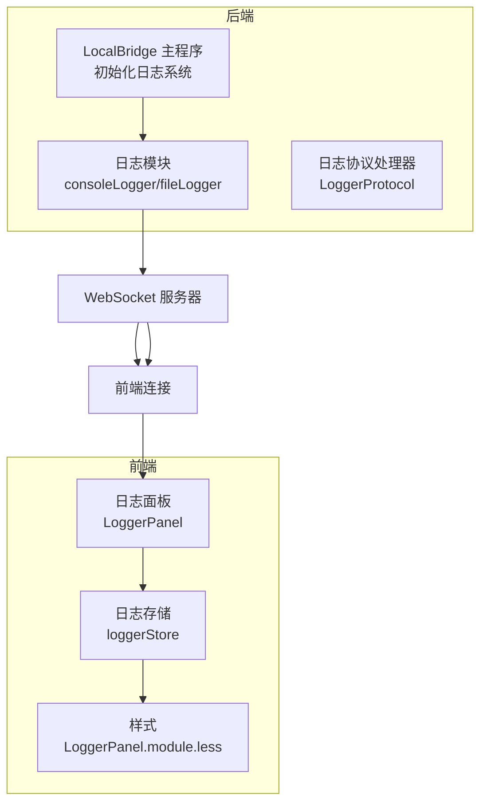
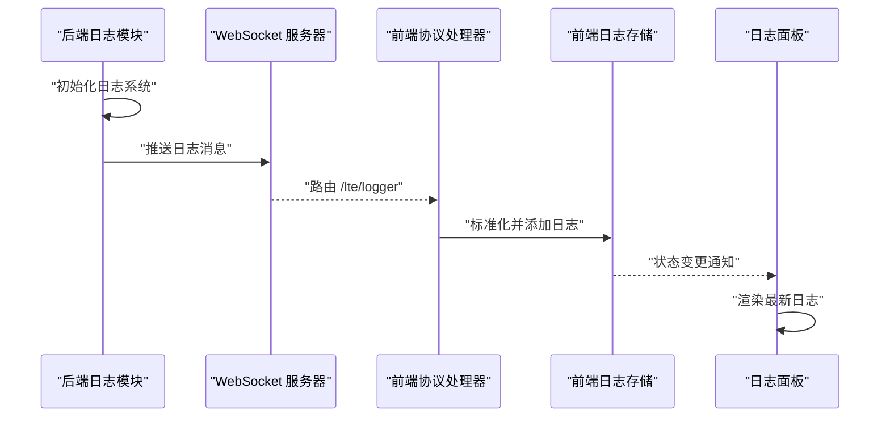
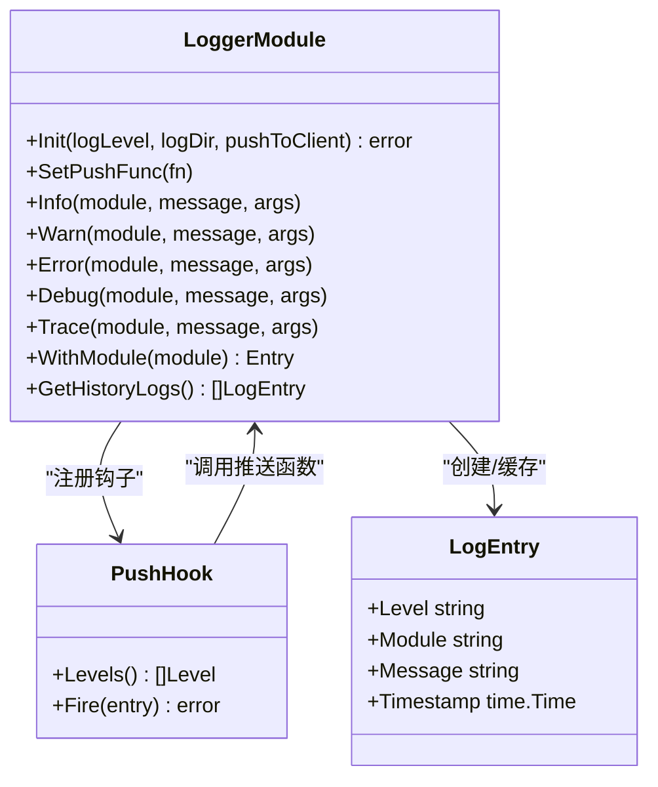
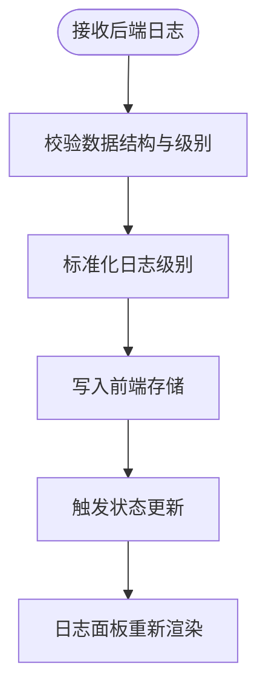
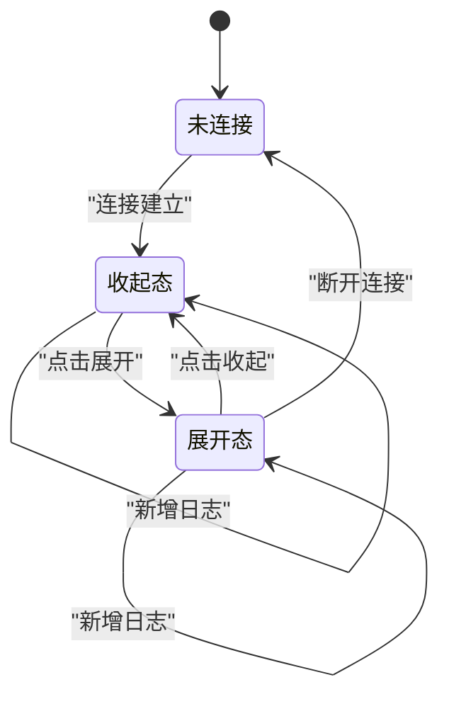
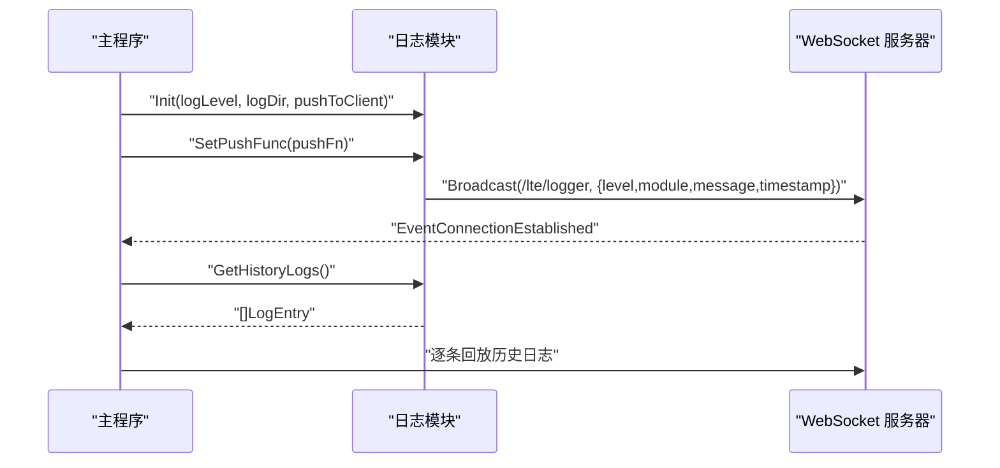
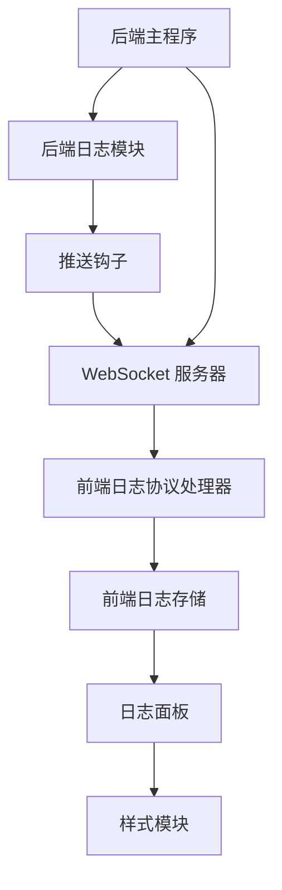

# 日志系统

<cite>
**本文档引用的文件**
- [logger.go](file://LocalBridge/internal/logger/logger.go)
- [loggerStore.ts](file://src/stores/loggerStore.ts)
- [LoggerProtocol.ts](file://src/services/protocols/LoggerProtocol.ts)
- [LoggerPanel.tsx](file://src/components/panels/tools/LoggerPanel.tsx)
- [LoggerPanel.module.less](file://src/styles/LoggerPanel.module.less)
- [main.go](file://LocalBridge/cmd/lb/main.go)
- [controller_manager.go](file://LocalBridge/internal/mfw/controller_manager.go)
- [wailsBridge.ts](file://src/utils/wailsBridge.ts)
- [log.mdx](file://instructions/wails/reference/runtime/log.mdx)
</cite>

## 目录
1. [简介](#简介)
2. [项目结构](#项目结构)
3. [核心组件](#核心组件)
4. [架构总览](#架构总览)
5. [详细组件分析](#详细组件分析)
6. [依赖关系分析](#依赖关系分析)
7. [性能考虑](#性能考虑)
8. [故障排除指南](#故障排除指南)
9. [结论](#结论)

## 简介
本文件全面阐述 MaaPipelineEditor 项目的日志系统，涵盖后端 Go 侧日志模块、前端日志存储与展示、以及前后端通信协议。系统采用多级日志输出策略：控制台日志用于实时调试与交互；文件日志用于持久化记录；同时通过 WebSocket 将关键日志推送至前端界面，便于用户直观查看。

## 项目结构
日志系统涉及三个层面：
- 后端日志模块：负责日志初始化、格式化、文件落盘与推送钩子
- 前端日志存储与展示：负责接收后端推送、本地缓存与 UI 展示
- 通信协议：负责后端与前端之间的日志消息路由与标准化

**图表来源**
- [main.go](file://LocalBridge/cmd/lb/main.go#L283-L324)
- [logger.go](file://LocalBridge/internal/logger/logger.go#L43-L100)
- [LoggerProtocol.ts](file://src/services/protocols/LoggerProtocol.ts#L25-L56)
- [loggerStore.ts](file://src/stores/loggerStore.ts#L21-L45)
- [LoggerPanel.tsx](file://src/components/panels/tools/LoggerPanel.tsx#L55-L181)

**章节来源**
- [main.go](file://LocalBridge/cmd/lb/main.go#L283-L324)
- [logger.go](file://LocalBridge/internal/logger/logger.go#L43-L100)
- [LoggerProtocol.ts](file://src/services/protocols/LoggerProtocol.ts#L25-L56)
- [loggerStore.ts](file://src/stores/loggerStore.ts#L21-L45)
- [LoggerPanel.tsx](file://src/components/panels/tools/LoggerPanel.tsx#L55-L181)

## 核心组件
- 后端日志模块：提供统一的日志接口，支持控制台与文件双通道输出，并内置推送钩子以将日志广播到前端
- 前端日志存储：基于 Zustand 的轻量状态管理，维护日志列表、展开/收起状态与最大容量
- 日志协议处理器：接收后端推送的日志消息，进行标准化后写入前端存储
- 日志面板：React 组件，负责渲染日志列表、自动滚动、脉冲提示与清空操作
- 样式系统：Less 模块化样式，定义不同日志级别的视觉风格与动画效果

**章节来源**
- [logger.go](file://LocalBridge/internal/logger/logger.go#L13-L206)
- [loggerStore.ts](file://src/stores/loggerStore.ts#L3-L45)
- [LoggerProtocol.ts](file://src/services/protocols/LoggerProtocol.ts#L16-L56)
- [LoggerPanel.tsx](file://src/components/panels/tools/LoggerPanel.tsx#L13-L181)
- [LoggerPanel.module.less](file://src/styles/LoggerPanel.module.less#L3-L272)

## 架构总览
后端通过初始化函数配置日志级别与输出目标，并注册推送钩子；前端通过协议处理器订阅特定路由，接收并标准化日志；最终由日志面板展示。

**图表来源**
- [main.go](file://LocalBridge/cmd/lb/main.go#L283-L324)
- [logger.go](file://LocalBridge/internal/logger/logger.go#L147-L162)
- [LoggerProtocol.ts](file://src/services/protocols/LoggerProtocol.ts#L27-L56)
- [loggerStore.ts](file://src/stores/loggerStore.ts#L26-L38)
- [LoggerPanel.tsx](file://src/components/panels/tools/LoggerPanel.tsx#L56-L98)

## 详细组件分析

### 后端日志模块（Go）
- 初始化流程：解析日志级别、创建控制台与文件日志器、设置文本格式、注册推送钩子、清理旧日志文件
- 推送钩子：仅对 Info/Warn/Error 级别触发，提取模块名与消息，写入内存缓冲并调用推送函数
- 便捷方法：Info/Warn/Error/Debug/Trace 提供带模块字段的便捷接口，控制台与文件通道同步输出
- 历史日志：提供获取历史日志的方法，供新连接建立时回放

**图表来源**
- [logger.go](file://LocalBridge/internal/logger/logger.go#L43-L206)
- [logger.go](file://LocalBridge/internal/logger/logger.go#L137-L162)
- [logger.go](file://LocalBridge/internal/logger/logger.go#L28-L33)

**章节来源**
- [logger.go](file://LocalBridge/internal/logger/logger.go#L43-L100)
- [logger.go](file://LocalBridge/internal/logger/logger.go#L137-L162)
- [logger.go](file://LocalBridge/internal/logger/logger.go#L165-L201)
- [logger.go](file://LocalBridge/internal/logger/logger.go#L108-L134)

### 前端日志存储与协议（TypeScript）
- 日志存储：定义日志条目结构、最大容量、添加/清空/切换展开状态等操作
- 协议处理器：注册路由 "/lte/logger"，接收后端推送，标准化日志级别与时间戳，写入存储
- 使用场景：在应用启动时订阅日志路由，在连接断开时不渲染面板

**图表来源**
- [LoggerProtocol.ts](file://src/services/protocols/LoggerProtocol.ts#L32-L56)
- [loggerStore.ts](file://src/stores/loggerStore.ts#L26-L38)
- [LoggerPanel.tsx](file://src/components/panels/tools/LoggerPanel.tsx#L56-L98)

**章节来源**
- [loggerStore.ts](file://src/stores/loggerStore.ts#L3-L45)
- [LoggerProtocol.ts](file://src/services/protocols/LoggerProtocol.ts#L16-L56)
- [LoggerPanel.tsx](file://src/components/panels/tools/LoggerPanel.tsx#L55-L98)

### 日志面板（React + Less）
- 展示逻辑：根据连接状态决定是否渲染；展开态支持自动滚动与清空；收起态显示最新一条日志并带脉冲动画
- 视觉设计：按日志级别设置图标与颜色；支持模块名与时间戳显示；空状态友好提示
- 交互细节：滚动到底部时自动跟随；离开展开态时恢复自动滚动

**图表来源**
- [LoggerPanel.tsx](file://src/components/panels/tools/LoggerPanel.tsx#L56-L98)
- [LoggerPanel.module.less](file://src/styles/LoggerPanel.module.less#L34-L67)

**章节来源**
- [LoggerPanel.tsx](file://src/components/panels/tools/LoggerPanel.tsx#L55-L181)
- [LoggerPanel.module.less](file://src/styles/LoggerPanel.module.less#L3-L272)

### 后端主程序集成点
- 初始化日志系统：在启动时调用初始化函数，设置日志级别与目录
- 设置推送函数：将日志推送至 WebSocket 广播，携带时间戳
- 历史日志回放：连接建立事件触发时，向新连接推送历史日志

**图表来源**
- [main.go](file://LocalBridge/cmd/lb/main.go#L283-L324)
- [logger.go](file://LocalBridge/internal/logger/logger.go#L43-L100)
- [logger.go](file://LocalBridge/internal/logger/logger.go#L108-L134)

**章节来源**
- [main.go](file://LocalBridge/cmd/lb/main.go#L283-L324)

### MFW 控制器管理器中的日志使用
- 在控制器创建与连接过程中，使用 Debug/Error 级别日志记录关键步骤与错误信息
- 通过模块字段区分日志来源，便于前端筛选与定位问题

**章节来源**
- [controller_manager.go](file://LocalBridge/internal/mfw/controller_manager.go#L35-L75)
- [controller_manager.go](file://LocalBridge/internal/mfw/controller_manager.go#L79-L125)

### Wails 运行时日志桥接（可选）
- 前端可通过 wailsBridge 工具调用后端运行时日志接口，实现跨语言日志互通
- 类型声明与环境检测确保在 Wails 环境下才启用相应能力

**章节来源**
- [wailsBridge.ts](file://src/utils/wailsBridge.ts#L7-L15)
- [wailsBridge.ts](file://src/utils/wailsBridge.ts#L115-L128)
- [log.mdx](file://instructions/wails/reference/runtime/log.mdx#L63-L121)

## 依赖关系分析
- 后端日志模块依赖第三方日志库，负责格式化与输出
- 前端协议处理器依赖 WebSocket 服务器与状态存储
- 日志面板依赖样式模块与状态存储
- 后端主程序负责初始化与事件订阅，贯穿整个日志链路

**图表来源**
- [logger.go](file://LocalBridge/internal/logger/logger.go#L137-L162)
- [LoggerProtocol.ts](file://src/services/protocols/LoggerProtocol.ts#L25-L56)
- [loggerStore.ts](file://src/stores/loggerStore.ts#L21-L45)
- [LoggerPanel.tsx](file://src/components/panels/tools/LoggerPanel.tsx#L55-L181)
- [main.go](file://LocalBridge/cmd/lb/main.go#L283-L324)

**章节来源**
- [logger.go](file://LocalBridge/internal/logger/logger.go#L137-L162)
- [LoggerProtocol.ts](file://src/services/protocols/LoggerProtocol.ts#L25-L56)
- [loggerStore.ts](file://src/stores/loggerStore.ts#L21-L45)
- [LoggerPanel.tsx](file://src/components/panels/tools/LoggerPanel.tsx#L55-L181)
- [main.go](file://LocalBridge/cmd/lb/main.go#L283-L324)

## 性能考虑
- 内存缓冲：后端维护固定大小的历史日志缓冲，避免无限增长导致内存压力
- 文件轮转：按日期创建日志文件，定期清理过期文件，默认保留天数可配置
- 前端限流：前端存储限制最大日志数量，超出时丢弃最旧条目，保证 UI 流畅
- 推送粒度：仅对 Info/Warn/Error 级别推送，减少高频 Trace/Debug 消息对前端的压力

**章节来源**
- [logger.go](file://LocalBridge/internal/logger/logger.go#L36-L40)
- [logger.go](file://LocalBridge/internal/logger/logger.go#L209-L249)
- [loggerStore.ts](file://src/stores/loggerStore.ts#L14-L24)
- [logger.go](file://LocalBridge/internal/logger/logger.go#L139-L145)

## 故障排除指南
- 后端无法创建日志目录或文件
  - 检查日志目录权限与磁盘空间
  - 查看初始化阶段的错误输出
- 前端不显示日志
  - 确认 WebSocket 连接状态
  - 检查协议路由是否正确注册
- 日志级别不生效
  - 校验后端日志级别解析逻辑
  - 确认前端协议处理器对日志级别的过滤规则
- 历史日志未回放
  - 检查连接建立事件是否触发
  - 确认历史日志缓冲是否为空

**章节来源**
- [logger.go](file://LocalBridge/internal/logger/logger.go#L67-L83)
- [LoggerProtocol.ts](file://src/services/protocols/LoggerProtocol.ts#L32-L56)
- [main.go](file://LocalBridge/cmd/lb/main.go#L297-L315)

## 结论
该日志系统通过清晰的分层设计实现了从后端到前端的完整日志链路：后端负责高质量日志输出与推送，前端负责可视化呈现与交互体验。系统具备良好的扩展性与可维护性，既满足开发调试需求，也兼顾了生产环境的性能与稳定性。