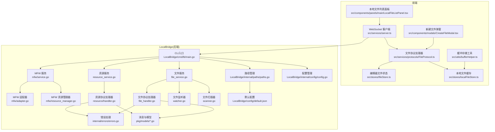
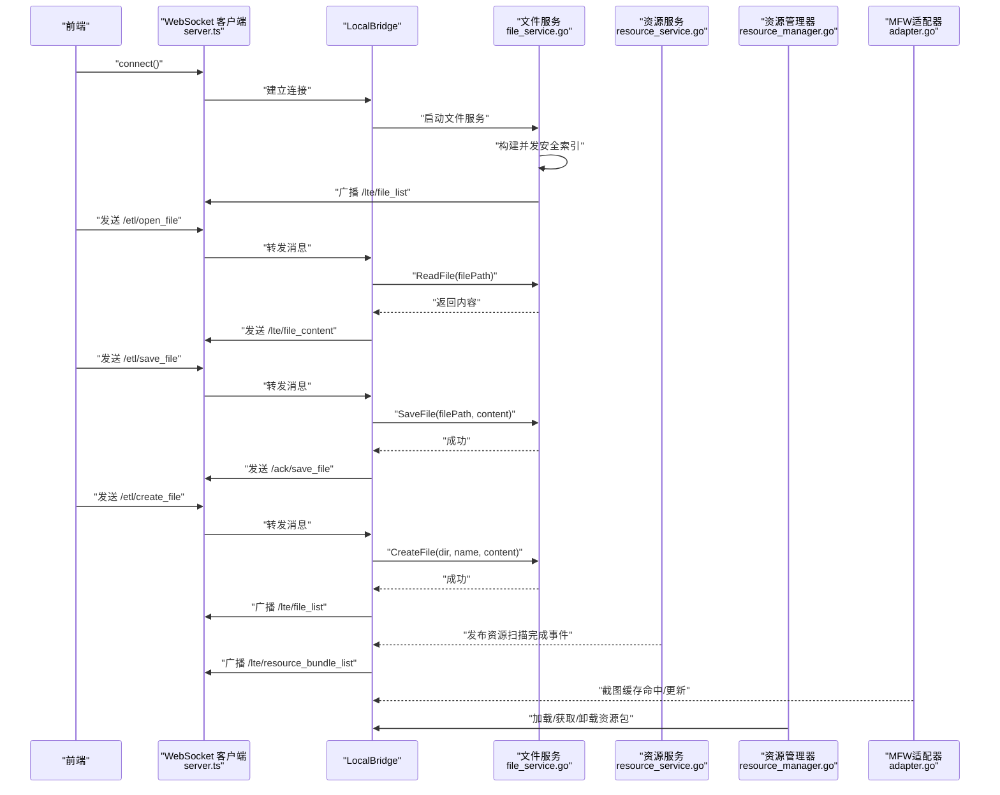

# 本地文件管理

<cite>
**本文引用的文件**
- [LocalBridge/README.md](file://LocalBridge/README.md)
- [LocalBridge/cmd/lb/main.go](file://LocalBridge/cmd/lb/main.go)
- [LocalBridge/internal/config/config.go](file://LocalBridge/internal/config/config.go)
- [LocalBridge/internal/service/file/file_service.go](file://LocalBridge/internal/service/file/file_service.go)
- [LocalBridge/internal/service/file/scanner.go](file://LocalBridge/internal/service/file/scanner.go)
- [LocalBridge/internal/service/file/watcher.go](file://LocalBridge/internal/service/file/watcher.go)
- [LocalBridge/internal/protocol/file/file_handler.go](file://LocalBridge/internal/protocol/file/file_handler.go)
- [LocalBridge/pkg/models/file.go](file://LocalBridge/pkg/models/file.go)
- [LocalBridge/pkg/models/message.go](file://LocalBridge/pkg/models/message.go)
- [LocalBridge/internal/errors/errors.go](file://LocalBridge/internal/errors/errors.go)
- [src/services/server.ts](file://src/services/server.ts)
- [src/services/protocols/FileProtocol.ts](file://src/services/protocols/FileProtocol.ts)
- [src/stores/localFileStore.ts](file://src/stores/localFileStore.ts)
- [src/stores/fileStore.ts](file://src/stores/fileStore.ts)
- [src/components/panels/main/LocalFileListPanel.tsx](file://src/components/panels/main/LocalFileListPanel.tsx)
- [src/components/modals/CreateFileModal.tsx](file://src/components/modals/CreateFileModal.tsx)
- [LocalBridge/internal/paths/paths.go](file://LocalBridge/internal/paths/paths.go)
- [LocalBridge/config/default.json](file://LocalBridge/config/default.json)
- [LocalBridge/internal/service/resource/resource_service.go](file://LocalBridge/internal/service/resource/resource_service.go)
- [LocalBridge/internal/protocol/resource/handler.go](file://LocalBridge/internal/protocol/resource/handler.go)
- [LocalBridge/internal/mfw/service.go](file://LocalBridge/internal/mfw/service.go)
- [LocalBridge/internal/mfw/resource_manager.go](file://LocalBridge/internal/mfw/resource_manager.go)
- [LocalBridge/internal/mfw/adapter.go](file://LocalBridge/internal/mfw/adapter.go)
- [src/utils/bufferHelper.ts](file://src/utils/bufferHelper.ts)
</cite>

## 更新摘要
**变更内容**
- 新增文件监听器防抖机制，有效减少频繁文件变更事件的处理压力
- 实现MaaFramework截图缓存机制，提升图像处理性能
- 优化文件索引结构，采用并发安全的读写锁机制
- 增强资源扫描性能，新增更多排除目录和优化扫描策略
- 前端实现图片缓存机制，提升资源包图片加载效率
- 改进文件服务的并发处理能力，支持高并发文件操作

## 目录
1. [简介](#简介)
2. [项目结构](#项目结构)
3. [核心组件](#核心组件)
4. [架构总览](#架构总览)
5. [详细组件分析](#详细组件分析)
6. [性能优化机制](#性能优化机制)
7. [依赖关系分析](#依赖关系分析)
8. [性能考量](#性能考量)
9. [故障排查指南](#故障排查指南)
10. [结论](#结论)
11. [附录](#附录)

## 简介
本章节面向"本地文件管理"主题，聚焦前端与本地桥接服务（LocalBridge）之间的文件管理能力，包括：
- 本地文件扫描与列表展示
- 打开/保存/创建本地文件
- 文件变更通知与外部修改提醒
- WebSocket 协议与消息路由
- 前端状态管理与交互体验
- 便携模式、开发模式和本地模式下的数据目录路径管理
- 配置文件自动创建机制
- **新增：文件监听器防抖机制，有效减少频繁文件变更事件的处理压力**
- **新增：MaaFramework截图缓存机制，提升图像处理性能**
- **新增：并发安全的文件索引结构，支持高并发文件操作**
- **新增：增强的资源扫描性能，包含更多排除目录和优化策略**
- **新增：前端图片缓存机制，提升资源包图片加载效率**

该能力由前端 WebSocket 客户端、协议处理器、文件存储以及 LocalBridge 的文件服务、扫描器、监听器、资源服务、MFW 服务与资源管理器共同协作实现。

## 项目结构
围绕本地文件管理与资源管理的关键文件分布如下：
- 前端
  - WebSocket 客户端与协议注册：src/services/server.ts、src/services/protocols/FileProtocol.ts
  - 本地文件列表与创建弹窗：src/components/panels/main/LocalFileListPanel.tsx、src/components/modals/CreateFileModal.tsx
  - 本地文件与编辑器文件状态：src/stores/localFileStore.ts、src/stores/fileStore.ts
  - **新增：缓冲存储工具：src/utils/bufferHelper.ts**
- 本地桥接服务（Go）
  - 入口与配置：LocalBridge/cmd/lb/main.go、LocalBridge/internal/config/config.go
  - 文件服务与扫描/监听：LocalBridge/internal/service/file/file_service.go、scanner.go、watcher.go
  - 文件协议处理器：LocalBridge/internal/protocol/file/file_handler.go
  - 资源服务与协议处理器：LocalBridge/internal/service/resource/resource_service.go、LocalBridge/internal/protocol/resource/handler.go
  - MFW 服务与资源管理器：LocalBridge/internal/mfw/service.go、LocalBridge/internal/mfw/resource_manager.go
  - **新增：MFW适配器与缓存机制：LocalBridge/internal/mfw/adapter.go**
  - 消息与模型：LocalBridge/pkg/models/message.go、file.go
  - 错误与日志：LocalBridge/internal/errors/errors.go
  - 路径管理：LocalBridge/internal/paths/paths.go
  - 默认配置：LocalBridge/config/default.json

**图表来源**
- [src/services/server.ts](file://src/services/server.ts#L1-L230)
- [src/services/protocols/FileProtocol.ts](file://src/services/protocols/FileProtocol.ts#L1-L248)
- [src/stores/localFileStore.ts](file://src/stores/localFileStore.ts#L1-L281)
- [src/stores/fileStore.ts](file://src/stores/fileStore.ts#L1-L461)
- [src/components/panels/main/LocalFileListPanel.tsx](file://src/components/panels/main/LocalFileListPanel.tsx#L1-L165)
- [src/components/modals/CreateFileModal.tsx](file://src/components/modals/CreateFileModal.tsx#L1-L433)
- [src/utils/bufferHelper.ts](file://src/utils/bufferHelper.ts#L1-L19)
- [LocalBridge/cmd/lb/main.go](file://LocalBridge/cmd/lb/main.go#L1-L128)
- [LocalBridge/internal/config/config.go](file://LocalBridge/internal/config/config.go#L1-L160)
- [LocalBridge/internal/paths/paths.go](file://LocalBridge/internal/paths/paths.go#L1-L236)
- [LocalBridge/config/default.json](file://LocalBridge/config/default.json#L1-L29)
- [LocalBridge/internal/service/file/file_service.go](file://LocalBridge/internal/service/file/file_service.go#L1-L251)
- [LocalBridge/internal/service/file/scanner.go](file://LocalBridge/internal/service/file/scanner.go#L1-L177)
- [LocalBridge/internal/service/file/watcher.go](file://LocalBridge/internal/service/file/watcher.go#L1-L192)
- [LocalBridge/internal/protocol/file/file_handler.go](file://LocalBridge/internal/protocol/file/file_handler.go#L1-L222)
- [LocalBridge/internal/service/resource/resource_service.go](file://LocalBridge/internal/service/resource/resource_service.go#L1-L361)
- [LocalBridge/internal/protocol/resource/handler.go](file://LocalBridge/internal/protocol/resource/handler.go#L1-L200)
- [LocalBridge/internal/mfw/service.go](file://LocalBridge/internal/mfw/service.go#L1-L200)
- [LocalBridge/internal/mfw/resource_manager.go](file://LocalBridge/internal/mfw/resource_manager.go#L1-L158)
- [LocalBridge/internal/mfw/adapter.go](file://LocalBridge/internal/mfw/adapter.go#L720-L817)
- [LocalBridge/pkg/models/message.go](file://LocalBridge/pkg/models/message.go#L1-L72)
- [LocalBridge/pkg/models/file.go](file://LocalBridge/pkg/models/file.go#L1-L19)
- [LocalBridge/internal/errors/errors.go](file://LocalBridge/internal/errors/errors.go#L1-L141)

## 核心组件
- 前端 WebSocket 客户端与协议注册
  - 负责连接 LocalBridge、注册路由、发送/接收消息、维护连接状态与超时。
  - 参考：[src/services/server.ts](file://src/services/server.ts#L1-L230)
- 文件协议处理器
  - 注册与处理本地文件相关路由（文件列表、文件内容、文件变化、保存确认等），并与前端 Store 协作更新状态。
  - 参考：[src/services/protocols/FileProtocol.ts](file://src/services/protocols/FileProtocol.ts#L1-L248)
- 本地文件缓存 Store
  - 存储从 LocalBridge 推送的文件列表、根目录、刷新状态等，不持久化，始终从后端实时获取。
  - **新增：实现图片缓存机制，支持Base64编码图片的缓存与复用**
  - 参考：[src/stores/localFileStore.ts](file://src/stores/localFileStore.ts#L1-L281)
- 编辑器文件状态 Store
  - 管理当前打开的文件、节点/边、文件配置（路径、是否删除/外部修改标记、最后同步时间）等。
  - 参考：[src/stores/fileStore.ts](file://src/stores/fileStore.ts#L1-L461)
- 本地文件列表面板与新建文件弹窗
  - 列表面板：搜索、刷新、打开文件；新建弹窗：校验文件名、目录、提交创建请求。
  - 参考：[src/components/panels/main/LocalFileListPanel.tsx](file://src/components/panels/main/LocalFileListPanel.tsx#L1-L165)、[src/components/modals/CreateFileModal.tsx](file://src/components/modals/CreateFileModal.tsx#L1-L433)
- LocalBridge 入口与配置
  - CLI 启动、配置加载与覆盖、日志初始化、事件总线、WebSocket 服务器、路由注册、文件服务启动。
  - 参考：[LocalBridge/cmd/lb/main.go](file://LocalBridge/cmd/lb/main.go#L1-L128)、[LocalBridge/internal/config/config.go](file://LocalBridge/internal/config/config.go#L1-L160)
- 路径管理
  - 管理不同运行模式下的数据目录路径，包括便携模式、开发模式和本地模式。
  - 参考：[LocalBridge/internal/paths/paths.go](file://LocalBridge/internal/paths/paths.go#L1-L236)
- 默认配置管理
  - 提供默认配置内容，并在配置文件不存在时自动创建。
  - 参考：[LocalBridge/config/default.json](file://LocalBridge/config/default.json#L1-L29)
- 文件服务与扫描/监听
  - 文件扫描、索引构建、文件读取/保存/创建、路径安全校验、文件监听与防抖、事件发布。
  - **新增：实现并发安全的读写锁机制，支持高并发文件操作**
  - 参考：[LocalBridge/internal/service/file/file_service.go](file://LocalBridge/internal/service/file/file_service.go#L1-L251)、[LocalBridge/internal/service/file/scanner.go](file://LocalBridge/internal/service/file/scanner.go#L1-L177)、[LocalBridge/internal/service/file/watcher.go](file://LocalBridge/internal/service/file/watcher.go#L1-L192)
- 文件协议处理器（后端）
  - 处理 /etl/* 请求（打开/保存/创建/刷新）、订阅事件并向前端广播 /lte/* 与 /ack/* 消息。
  - 参考：[LocalBridge/internal/protocol/file/file_handler.go](file://LocalBridge/internal/protocol/file/file_handler.go#L1-L222)
- 资源服务与协议处理器
  - 资源包扫描（pipeline、image、model、default_pipeline.json 标识）、图片索引、事件广播。
  - **新增：增强排除目录列表，包含更多开发环境专用目录**
  - 参考：[LocalBridge/internal/service/resource/resource_service.go](file://LocalBridge/internal/service/resource/resource_service.go#L1-L361)、[LocalBridge/internal/protocol/resource/handler.go](file://LocalBridge/internal/protocol/resource/handler.go#L1-L200)
- MFW 服务与资源管理器
  - 初始化 MaaFramework、加载/获取/卸载资源包、全局卸载与释放。
  - **新增：实现截图缓存机制，支持自定义缓存有效期**
  - 参考：[LocalBridge/internal/mfw/service.go](file://LocalBridge/internal/mfw/service.go#L1-L200)、[LocalBridge/internal/mfw/resource_manager.go](file://LocalBridge/internal/mfw/resource_manager.go#L1-L158)
- **新增：MFW适配器与缓存机制**
  - 截图缓存器实现，支持Base64编码的PNG图片缓存，提升图像处理性能。
  - 参考：[LocalBridge/internal/mfw/adapter.go](file://LocalBridge/internal/mfw/adapter.go#L720-L817)
- **新增：缓冲存储工具**
  - 通用缓冲管理器，支持键值对缓存与清理。
  - 参考：[src/utils/bufferHelper.ts](file://src/utils/bufferHelper.ts#L1-L19)
- 消息与模型
  - 统一消息结构、文件列表/内容/变化、请求与确认数据结构。
  - 参考：[LocalBridge/pkg/models/message.go](file://LocalBridge/pkg/models/message.go#L1-L72)、[LocalBridge/pkg/models/file.go](file://LocalBridge/pkg/models/file.go#L1-L19)
- 错误处理
  - 统一错误码与错误包装，便于前后端一致处理。
  - 参考：[LocalBridge/internal/errors/errors.go](file://LocalBridge/internal/errors/errors.go#L1-L141)

**章节来源**
- [src/services/server.ts](file://src/services/server.ts#L1-L230)
- [src/services/protocols/FileProtocol.ts](file://src/services/protocols/FileProtocol.ts#L1-L248)
- [src/stores/localFileStore.ts](file://src/stores/localFileStore.ts#L1-L281)
- [src/stores/fileStore.ts](file://src/stores/fileStore.ts#L1-L461)
- [src/components/panels/main/LocalFileListPanel.tsx](file://src/components/panels/main/LocalFileListPanel.tsx#L1-L165)
- [src/components/modals/CreateFileModal.tsx](file://src/components/modals/CreateFileModal.tsx#L1-L433)
- [LocalBridge/cmd/lb/main.go](file://LocalBridge/cmd/lb/main.go#L1-L128)
- [LocalBridge/internal/config/config.go](file://LocalBridge/internal/config/config.go#L1-L160)
- [LocalBridge/internal/paths/paths.go](file://LocalBridge/internal/paths/paths.go#L1-L236)
- [LocalBridge/config/default.json](file://LocalBridge/config/default.json#L1-L29)
- [LocalBridge/internal/service/file/file_service.go](file://LocalBridge/internal/service/file/file_service.go#L1-L251)
- [LocalBridge/internal/service/file/scanner.go](file://LocalBridge/internal/service/file/scanner.go#L1-L177)
- [LocalBridge/internal/service/file/watcher.go](file://LocalBridge/internal/service/file/watcher.go#L1-L192)
- [LocalBridge/internal/protocol/file/file_handler.go](file://LocalBridge/internal/protocol/file/file_handler.go#L1-L222)
- [LocalBridge/internal/service/resource/resource_service.go](file://LocalBridge/internal/service/resource/resource_service.go#L1-L361)
- [LocalBridge/internal/protocol/resource/handler.go](file://LocalBridge/internal/protocol/resource/handler.go#L1-L200)
- [LocalBridge/internal/mfw/service.go](file://LocalBridge/internal/mfw/service.go#L1-L200)
- [LocalBridge/internal/mfw/resource_manager.go](file://LocalBridge/internal/mfw/resource_manager.go#L1-L158)
- [LocalBridge/internal/mfw/adapter.go](file://LocalBridge/internal/mfw/adapter.go#L720-L817)
- [src/utils/bufferHelper.ts](file://src/utils/bufferHelper.ts#L1-L19)
- [LocalBridge/pkg/models/message.go](file://LocalBridge/pkg/models/message.go#L1-L72)
- [LocalBridge/pkg/models/file.go](file://LocalBridge/pkg/models/file.go#L1-L19)
- [LocalBridge/internal/errors/errors.go](file://LocalBridge/internal/errors/errors.go#L1-L141)

## 架构总览
本地文件管理与资源管理的端到端流程：
- 前端通过 WebSocket 连接 LocalBridge
- LocalBridge 启动后扫描根目录，推送文件列表
- 前端列表面板展示文件，支持刷新、搜索、打开
- 打开文件时前端请求 /etl/open_file，后端返回 /lte/file_content
- 保存文件时前端请求 /etl/save_file，后端返回 /ack/save_file
- 新建文件时前端请求 /etl/create_file，后端创建成功后推送更新后的文件列表
- 文件变化（新增/修改/删除）由后端监听器捕获并通过 /lte/file_changed 推送
- 资源扫描完成后，后端发布资源包列表事件；前端订阅并更新资源包与图片索引
- **新增：文件监听器使用防抖机制，减少频繁变更事件的处理压力**
- **新增：MFW截图器实现缓存机制，提升图像处理性能**

**图表来源**
- [src/services/server.ts](file://src/services/server.ts#L1-L230)
- [src/services/protocols/FileProtocol.ts](file://src/services/protocols/FileProtocol.ts#L1-L248)
- [LocalBridge/cmd/lb/main.go](file://LocalBridge/cmd/lb/main.go#L1-L128)
- [LocalBridge/internal/service/file/file_service.go](file://LocalBridge/internal/service/file/file_service.go#L1-L251)
- [LocalBridge/internal/service/resource/resource_service.go](file://LocalBridge/internal/service/resource/resource_service.go#L1-L361)
- [LocalBridge/internal/mfw/resource_manager.go](file://LocalBridge/internal/mfw/resource_manager.go#L1-L158)
- [LocalBridge/internal/mfw/adapter.go](file://LocalBridge/internal/mfw/adapter.go#L720-L817)
- [LocalBridge/internal/protocol/file/file_handler.go](file://LocalBridge/internal/protocol/file/file_handler.go#L1-L222)

## 详细组件分析

### 前端 WebSocket 客户端与协议注册
- 连接管理：超时控制、状态回调、错误与断开处理。
- 路由注册：集中注册协议处理器，按 path 分发消息。
- 发送消息：统一 JSON 序列化，保证 path/data 结构一致。
- 参考路径
  - [连接与路由注册](file://src/services/server.ts#L1-L230)
  - [协议注册与初始化](file://src/services/server.ts#L216-L230)

**章节来源**
- [src/services/server.ts](file://src/services/server.ts#L1-L230)

### 文件协议处理器（前端）
- 注册路由：/lte/file_list、/lte/file_content、/lte/file_changed、/ack/save_file
- 处理文件列表：更新本地文件缓存，提示刷新完成
- 处理文件内容：调用 fileStore 打开文件并导入内容
- 处理文件变化：根据类型更新本地缓存与编辑器文件状态
- 处理保存确认：提示保存成功
- 请求接口：requestOpenFile、requestCreateFile
- 参考路径
  - [路由注册与消息处理](file://src/services/protocols/FileProtocol.ts#L1-L248)

**章节来源**
- [src/services/protocols/FileProtocol.ts](file://src/services/protocols/FileProtocol.ts#L1-L248)

### 本地文件缓存 Store
- 字段：rootPath、files、lastUpdateTime、isRefreshing
- **新增字段**：resourceBundles、imageDirs、imageCache、pendingImageRequests、imageList、imageListBundleName、imageListIsFiltered、imageListLoading
- 方法：setFileList、addFile、removeFile、updateFile、findFileByPath、setRefreshing、clear
- **新增方法**：setResourceBundles、setImageCache、getImageCache、setPendingImageRequest、isImagePending、setImageList、setImageListLoading、clearImageList
- 行为：全量替换文件列表、增量增删、更新时间戳、清空缓存
- **新增行为**：实现图片缓存机制，支持Base64编码图片的缓存与复用，提升资源包图片加载效率
- 参考路径
  - [状态定义与方法](file://src/stores/localFileStore.ts#L1-L281)

**章节来源**
- [src/stores/localFileStore.ts](file://src/stores/localFileStore.ts#L1-L281)

### 编辑器文件状态 Store
- 字段：files、currentFile、config（filePath、relativePath、isDeleted、isModifiedExternally、lastSyncTime）
- 方法：openFileFromLocal、saveFileToLocal、markFileDeleted、markFileModified、reloadFileFromLocal、findFileByPath
- 行为：打开/保存/重载本地文件、标记外部修改/删除、同步时间戳
- 参考路径
  - [文件状态与方法](file://src/stores/fileStore.ts#L1-L461)

**章节来源**
- [src/stores/fileStore.ts](file://src/stores/fileStore.ts#L1-L461)

### 本地文件列表面板
- 功能：显示根目录、搜索过滤、刷新列表、打开文件
- 交互：连接断开时引导连接、发送 /etl/refresh_file_list
- 参考路径
  - [面板渲染与交互](file://src/components/panels/main/LocalFileListPanel.tsx#L1-L165)

**章节来源**
- [src/components/panels/main/LocalFileListPanel.tsx](file://src/components/panels/main/LocalFileListPanel.tsx#L1-L165)

### 新建文件弹窗
- 功能：校验文件名（非法字符、后缀、重名）、选择目录、提交创建请求
- 交互：连接检查、预览文件名、禁用提交按钮、提示成功/失败
- 参考路径
  - [弹窗与校验逻辑](file://src/components/modals/CreateFileModal.tsx#L1-L433)

**章节来源**
- [src/components/modals/CreateFileModal.tsx](file://src/components/modals/CreateFileModal.tsx#L1-L433)

### LocalBridge 入口与配置
- CLI：命令行参数覆盖配置、初始化日志、创建事件总线、文件服务、WebSocket 服务器、注册协议处理器、启动与退出
- 配置：默认值、路径规范化、根目录存在性校验、日志目录规范化
- 参考路径
  - [CLI 启动流程](file://LocalBridge/cmd/lb/main.go#L1-L128)
  - [配置加载与覆盖](file://LocalBridge/internal/config/config.go#L1-L160)

**章节来源**
- [LocalBridge/cmd/lb/main.go](file://LocalBridge/cmd/lb/main.go#L1-L128)
- [LocalBridge/internal/config/config.go](file://LocalBridge/internal/config/config.go#L1-L160)

### 路径管理
- 运行模式检测：根据命令行参数、可执行文件旁是否存在 config 目录等条件检测运行模式
- 数据目录设置：根据运行模式设置数据目录路径
- 路径获取：提供获取数据目录、配置文件目录、日志目录等路径的方法
- 参考路径
  - [路径管理实现](file://LocalBridge/internal/paths/paths.go#L1-L236)

**章节来源**
- [LocalBridge/internal/paths/paths.go](file://LocalBridge/internal/paths/paths.go#L1-L236)

### 默认配置管理
- 提供默认配置内容，包括服务器、文件、日志和 MaaFramework 配置
- 在配置文件不存在时自动创建默认配置
- 参考路径
  - [默认配置内容](file://LocalBridge/config/default.json#L1-L29)
  - [默认配置内容获取](file://LocalBridge/internal/paths/paths.go#L192-L215)

**章节来源**
- [LocalBridge/config/default.json](file://LocalBridge/config/default.json#L1-L29)
- [LocalBridge/internal/paths/paths.go](file://LocalBridge/internal/paths/paths.go#L192-L215)

### 文件服务与扫描/监听
- 文件服务：索引构建、读取/保存/创建、路径安全校验、事件发布
- **新增：实现并发安全的读写锁机制，支持高并发文件操作**
- 扫描器：递归遍历、排除目录、扩展名校验、相对路径计算
- 监听器：fsnotify 监听、事件类型判断、扩展名校验、防抖处理
- **新增：实现防抖机制，使用debouncer结构体管理定时器，减少频繁文件变更事件的处理压力**
- 参考路径
  - [文件服务](file://LocalBridge/internal/service/file/file_service.go#L1-L251)
  - [扫描器](file://LocalBridge/internal/service/file/scanner.go#L1-L177)
  - [监听器](file://LocalBridge/internal/service/file/watcher.go#L1-L192)

**章节来源**
- [LocalBridge/internal/service/file/file_service.go](file://LocalBridge/internal/service/file/file_service.go#L1-L251)
- [LocalBridge/internal/service/file/scanner.go](file://LocalBridge/internal/service/file/scanner.go#L1-L177)
- [LocalBridge/internal/service/file/watcher.go](file://LocalBridge/internal/service/file/watcher.go#L1-L192)

### 文件协议处理器（后端）
- 路由前缀：/etl/open_file、/etl/save_file、/etl/create_file、/etl/refresh_file_list
- 处理逻辑：解析请求、调用文件服务、返回 /lte/* 或 /ack/*、错误封装
- 事件广播：连接建立时推送文件列表；文件变化时广播 /lte/file_changed
- 参考路径
  - [处理器实现](file://LocalBridge/internal/protocol/file/file_handler.go#L1-L222)

**章节来源**
- [LocalBridge/internal/protocol/file/file_handler.go](file://LocalBridge/internal/protocol/file/file_handler.go#L1-L222)

### 资源服务与协议处理器（后端）
- 资源扫描：识别资源包（pipeline、image、model、default_pipeline.json 标识），最多两层递归
- 图片索引：遍历 image 目录，支持扩展名过滤与相对路径计算
- 事件广播：扫描完成后发布资源包列表事件，前端订阅并更新 UI
- **新增：增强排除目录列表，包含node_modules、__pycache__、venv、.venv、.git、.idea、.vscode、debug、logs、cache、config等开发环境专用目录**
- 参考路径
  - [资源服务](file://LocalBridge/internal/service/resource/resource_service.go#L1-L361)
  - [资源协议处理器](file://LocalBridge/internal/protocol/resource/handler.go#L1-L200)

**章节来源**
- [LocalBridge/internal/service/resource/resource_service.go](file://LocalBridge/internal/service/resource/resource_service.go#L1-L361)
- [LocalBridge/internal/protocol/resource/handler.go](file://LocalBridge/internal/protocol/resource/handler.go#L1-L200)

### MFW 服务与资源管理器（后端）
- 初始化：加载 MaaFramework 库与日志目录，处理 Windows 非 ASCII 路径
- 资源管理：加载/获取/卸载资源包，支持全局卸载与释放
- **新增：实现截图缓存机制，支持自定义缓存有效期，默认100ms**
- 参考路径
  - [MFW 服务](file://LocalBridge/internal/mfw/service.go#L1-L200)
  - [资源管理器](file://LocalBridge/internal/mfw/resource_manager.go#L1-L158)

**章节来源**
- [LocalBridge/internal/mfw/service.go](file://LocalBridge/internal/mfw/service.go#L1-L200)
- [LocalBridge/internal/mfw/resource_manager.go](file://LocalBridge/internal/mfw/resource_manager.go#L1-L158)

### **新增：MFW适配器与缓存机制**
- 截图缓存器：实现Base64编码的PNG图片缓存，提升图像处理性能
- 缓存策略：支持自定义缓存有效期，提供强制截图、清除缓存等功能
- 并发安全：使用互斥锁保护缓存访问，确保多线程安全
- 参考路径
  - [截图缓存器实现](file://LocalBridge/internal/mfw/adapter.go#L720-L817)

**章节来源**
- [LocalBridge/internal/mfw/adapter.go](file://LocalBridge/internal/mfw/adapter.go#L720-L817)

### **新增：缓冲存储工具**
- 通用缓冲管理器：支持键值对缓存与清理，提供buf、read、clear方法
- 应用场景：可用于前端图片缓存、后端数据缓存等场景
- 参考路径
  - [缓冲存储实现](file://src/utils/bufferHelper.ts#L1-L19)

**章节来源**
- [src/utils/bufferHelper.ts](file://src/utils/bufferHelper.ts#L1-L19)

### 消息与模型
- 通用消息结构：path、data
- 文件相关模型：FileInfo、FileListData、FileContentData、FileChangedData、OpenFileRequest、SaveFileRequest、CreateFileRequest、SaveFileAckData
- 参考路径
  - [消息与模型](file://LocalBridge/pkg/models/message.go#L1-L72)
  - [文件内部模型](file://LocalBridge/pkg/models/file.go#L1-L19)

**章节来源**
- [LocalBridge/pkg/models/message.go](file://LocalBridge/pkg/models/message.go#L1-L72)
- [LocalBridge/pkg/models/file.go](file://LocalBridge/pkg/models/file.go#L1-L19)

### 错误处理
- 错误码：FILE_NOT_FOUND、FILE_READ_ERROR、FILE_WRITE_ERROR、FILE_NAME_CONFLICT、INVALID_JSON、PERMISSION_DENIED、INVALID_REQUEST、CONNECTION_FAILED、INTERNAL_ERROR
- 错误包装：统一错误结构与 ToErrorData 转换
- 参考路径
  - [错误定义与构造](file://LocalBridge/internal/errors/errors.go#L1-L141)

**章节来源**
- [LocalBridge/internal/errors/errors.go](file://LocalBridge/internal/errors/errors.go#L1-L141)

## 性能优化机制

### 文件监听器防抖机制
- **实现原理**：使用debouncer结构体管理定时器，对同一文件的多次变更事件进行合并处理
- **防抖延迟**：默认300毫秒，可根据需要调整
- **性能收益**：显著减少频繁文件保存操作产生的大量事件处理，提升系统响应性能
- **实现细节**：
  - 每个文件路径维护独立的定时器
  - 新的变更事件会取消之前的定时器并重新计时
  - 定时器到期后执行实际的文件处理逻辑

**章节来源**
- [LocalBridge/internal/service/file/watcher.go](file://LocalBridge/internal/service/file/watcher.go#L151-L192)

### 并发安全的文件索引
- **实现原理**：使用sync.RWMutex读写锁保护文件索引访问
- **性能收益**：支持高并发的文件读取操作，同时保证数据一致性
- **实现细节**：
  - 读操作使用RLock，允许多个并发读取
  - 写操作使用Lock，确保索引更新的原子性
  - 文件创建、删除、修改时进行相应的索引更新

**章节来源**
- [LocalBridge/internal/service/file/file_service.go](file://LocalBridge/internal/service/file/file_service.go#L18-L25)

### MaaFramework截图缓存
- **实现原理**：Screenshotter结构体实现图像缓存，支持自定义缓存有效期
- **缓存策略**：默认100ms缓存有效期，超过有效期重新截图
- **性能收益**：大幅减少重复截图操作，提升图像处理效率
- **实现细节**：
  - 使用互斥锁保护缓存访问
  - 支持强制截图、清除缓存、设置缓存有效期等操作
  - 缓存图像数据和时间戳，用于有效性检查

**章节来源**
- [LocalBridge/internal/mfw/adapter.go](file://LocalBridge/internal/mfw/adapter.go#L720-L817)

### 增强的资源扫描性能
- **排除目录优化**：新增多个开发环境专用目录排除，包括node_modules、__pycache__、venv、.venv、.git、.idea、.vscode、debug、logs、cache、config等
- **扫描策略优化**：使用filepath.Walk递归扫描，配合排除列表提升扫描效率
- **性能收益**：显著减少不必要的文件扫描，提升资源包识别速度

**章节来源**
- [LocalBridge/internal/service/resource/resource_service.go](file://LocalBridge/internal/service/resource/resource_service.go#L208-L228)

### 前端图片缓存机制
- **实现原理**：localFileStore中实现Map结构的图片缓存，支持Base64编码图片的缓存与复用
- **缓存策略**：记录图片的MIME类型、尺寸、所属资源包等元数据
- **性能收益**：避免重复请求相同图片，提升资源包图片加载效率
- **实现细节**：
  - 支持pendingImageRequests跟踪正在进行的图片请求
  - 提供setImageCache、getImageCache、setPendingImageRequest等操作方法

**章节来源**
- [src/stores/localFileStore.ts](file://src/stores/localFileStore.ts#L39-L47)
- [src/stores/localFileStore.ts](file://src/stores/localFileStore.ts#L201-L236)

## 依赖关系分析
- 前端依赖
  - WebSocket 客户端依赖协议处理器；协议处理器依赖前端 Store 与 server.ts
  - 列表面板依赖本地文件 Store 与 server.ts
  - 新建弹窗依赖本地文件 Store、fileStore、server.ts 与协议处理器
  - **新增：本地文件Store依赖缓冲存储工具**
- 后端依赖
  - CLI 依赖配置、日志、事件总线、文件服务、资源服务、MFW 服务、WebSocket 服务器、路由
  - 文件服务依赖扫描器、监听器、事件总线
  - 资源服务依赖事件总线与模型
  - 协议处理器依赖对应服务、事件总线、WebSocket 服务器、消息模型与错误处理
  - 配置管理依赖路径管理
  - 路径管理依赖默认配置
  - **新增：MFW适配器依赖MFW服务与资源管理器**

**图表来源**
- [src/services/server.ts](file://src/services/server.ts#L1-L230)
- [src/services/protocols/FileProtocol.ts](file://src/services/protocols/FileProtocol.ts#L1-L248)
- [src/stores/localFileStore.ts](file://src/stores/localFileStore.ts#L1-L281)
- [src/stores/fileStore.ts](file://src/stores/fileStore.ts#L1-L461)
- [src/components/panels/main/LocalFileListPanel.tsx](file://src/components/panels/main/LocalFileListPanel.tsx#L1-L165)
- [src/components/modals/CreateFileModal.tsx](file://src/components/modals/CreateFileModal.tsx#L1-L433)
- [src/utils/bufferHelper.ts](file://src/utils/bufferHelper.ts#L1-L19)
- [LocalBridge/cmd/lb/main.go](file://LocalBridge/cmd/lb/main.go#L1-L128)
- [LocalBridge/internal/config/config.go](file://LocalBridge/internal/config/config.go#L1-L160)
- [LocalBridge/internal/paths/paths.go](file://LocalBridge/internal/paths/paths.go#L1-L236)
- [LocalBridge/config/default.json](file://LocalBridge/config/default.json#L1-L29)
- [LocalBridge/internal/service/file/file_service.go](file://LocalBridge/internal/service/file/file_service.go#L1-L251)
- [LocalBridge/internal/service/file/scanner.go](file://LocalBridge/internal/service/file/scanner.go#L1-L177)
- [LocalBridge/internal/service/file/watcher.go](file://LocalBridge/internal/service/file/watcher.go#L1-L192)
- [LocalBridge/internal/protocol/file/file_handler.go](file://LocalBridge/internal/protocol/file/file_handler.go#L1-L222)
- [LocalBridge/internal/service/resource/resource_service.go](file://LocalBridge/internal/service/resource/resource_service.go#L1-L361)
- [LocalBridge/internal/protocol/resource/handler.go](file://LocalBridge/internal/protocol/resource/handler.go#L1-L200)
- [LocalBridge/internal/mfw/service.go](file://LocalBridge/internal/mfw/service.go#L1-L200)
- [LocalBridge/internal/mfw/resource_manager.go](file://LocalBridge/internal/mfw/resource_manager.go#L1-L158)
- [LocalBridge/internal/mfw/adapter.go](file://LocalBridge/internal/mfw/adapter.go#L720-L817)
- [LocalBridge/pkg/models/message.go](file://LocalBridge/pkg/models/message.go#L1-L72)
- [LocalBridge/pkg/models/file.go](file://LocalBridge/pkg/models/file.go#L1-L19)
- [LocalBridge/internal/errors/errors.go](file://LocalBridge/internal/errors/errors.go#L1-L141)

## 性能考量
- 文件扫描
  - 递归遍历根目录，建议合理设置排除目录（如 node_modules、.git），减少 IO 压力。
  - **新增：增强的排除目录列表，包含更多开发环境专用目录**
  - 参考：[扫描器](file://LocalBridge/internal/service/file/scanner.go#L1-L177)
- 文件监听
  - 使用 fsnotify 监听目录树，结合防抖（默认 300ms）降低频繁变更带来的广播风暴。
  - **新增：实现防抖机制，显著减少频繁文件保存操作产生的事件处理压力**
  - 参考：[监听器](file://LocalBridge/internal/service/file/watcher.go#L1-L192)
- JSON 解析与序列化
  - 读取/保存均进行 JSON 解析/序列化，建议保持文件大小适中，避免大文件频繁写入。
  - 参考：[文件服务](file://LocalBridge/internal/service/file/file_service.go#L1-L251)
- 前端渲染
  - 列表面板支持搜索过滤，建议在大数据量场景下限制一次性渲染数量或增加虚拟滚动。
  - **新增：实现图片缓存机制，提升资源包图片加载效率**
  - 参考：[列表面板](file://src/components/panels/main/LocalFileListPanel.tsx#L1-L165)
- 资源扫描
  - 仅扫描两层子目录，避免深度遍历导致的性能问题；图片扫描仅遍历 image 目录并过滤扩展名。
  - **新增：增强排除目录列表，包含更多开发环境专用目录**
  - 参考：[资源服务](file://LocalBridge/internal/service/resource/resource_service.go#L1-L361)
- **新增：并发安全优化**
  - 文件服务使用读写锁保护文件索引，支持高并发文件操作
  - MFW截图器使用互斥锁保护缓存访问，确保多线程安全
  - 本地文件Store使用Map结构存储图片缓存，提供高效的缓存访问

## 故障排查指南
- 连接问题
  - 检查 LocalBridge 是否在默认端口 9066 启动；前端连接超时约 3 秒。
  - 参考：[连接与超时](file://src/services/server.ts#L1-L230)
- 文件列表为空
  - 确认 LocalBridge 根目录配置正确且存在；可在前端面板点击刷新。
  - **新增：检查文件监听器是否正常启动，确认防抖机制是否影响文件变更事件处理**
  - 参考：[刷新请求](file://src/components/panels/main/LocalFileListPanel.tsx#L1-L165)、[刷新路由](file://LocalBridge/internal/protocol/file/file_handler.go#L1-L222)
- 打开/保存失败
  - 检查文件路径合法性与权限；查看错误码（如 FILE_NOT_FOUND、FILE_READ_ERROR、FILE_WRITE_ERROR）。
  - 参考：[错误码定义](file://LocalBridge/internal/errors/errors.go#L1-L141)
- 文件名冲突或非法字符
  - 新建文件时检查文件名是否包含非法字符、是否已存在同名文件。
  - 参考：[新建弹窗校验](file://src/components/modals/CreateFileModal.tsx#L1-L433)、[创建请求处理](file://LocalBridge/internal/protocol/file/file_handler.go#L1-L222)
- 外部修改提醒
  - 当文件被外部修改时，前端会提示重新加载；编辑器侧也会标记 isModifiedExternally。
  - **新增：检查防抖机制是否导致文件变更事件延迟处理**
  - 参考：[文件变化处理](file://src/services/protocols/FileProtocol.ts#L1-L248)、[文件服务变化处理](file://LocalBridge/internal/service/file/file_service.go#L1-L251)
- 资源包扫描无结果
  - 确认资源包包含 pipeline、image、model 或 default_pipeline.json 标识之一；检查根目录与扫描深度。
  - **新增：检查排除目录配置，确认是否误排除了资源包目录**
  - 参考：[资源包识别规则](file://LocalBridge/internal/service/resource/resource_service.go#L121-L152)、[扫描深度](file://LocalBridge/internal/service/resource/resource_service.go#L64-L66)
- 图片索引为空
  - 确认资源包内存在 image 目录且包含受支持扩展名的图片文件。
  - **新增：检查图片缓存机制是否正常工作，确认缓存有效期设置是否合理**
  - 参考：[图片扩展名支持](file://LocalBridge/internal/service/resource/resource_service.go#L230-L239)、[图片扫描](file://LocalBridge/internal/service/resource/resource_service.go#L299-L335)
- **新增：性能相关问题排查**
  - 文件监听器防抖：检查防抖延迟设置是否过长，导致文件变更事件处理延迟
  - 并发安全：确认读写锁机制是否正常工作，避免死锁或竞态条件
  - 缓存失效：检查MFW截图缓存和前端图片缓存的有效期设置

## 结论
本地文件管理通过前端 WebSocket 客户端与 LocalBridge 的紧密协作，实现了从文件扫描、列表展示、打开/保存/创建到文件变更通知的完整闭环。后端采用事件驱动与模块化设计，前端通过 Store 与协议处理器实现状态同步与用户体验优化。

**本次性能优化主要体现在以下几个方面**：
- **文件监听器防抖机制**：显著减少频繁文件变更事件的处理压力，提升系统响应性能
- **并发安全的文件索引**：使用读写锁保护文件索引，支持高并发文件操作
- **MaaFramework截图缓存**：实现图像缓存机制，提升图像处理效率
- **增强的资源扫描性能**：新增更多排除目录，优化扫描策略
- **前端图片缓存机制**：提升资源包图片加载效率

新增的资源扫描与 MFW 集成进一步扩展了本地文件管理的能力边界，使其能够识别并索引资源包中的 pipeline、image、model 等目录，为后续的图像资源选择与流水线配置提供支撑。这些性能优化措施确保了系统在处理大量文件和高并发操作时仍能保持良好的响应性能。

## 附录
- 协议与消息
  - 路由约定：/lte/*（服务端推送）、/etl/*（客户端请求）、/ack/*（确认）、/error（错误）
  - 文件相关消息：/lte/file_list、/lte/file_content、/lte/file_changed、/ack/save_file、/etl/open_file、/etl/save_file、/etl/create_file、/etl/refresh_file_list
  - 资源相关消息：/lte/resource_bundle_list、/lte/image_list
  - 参考：[协议与消息定义](file://LocalBridge/README.md#L114-L281)
- 配置项
  - server.host/port、file.root/exclude/extensions、log.level/dir/push_to_client、maafw.enabled/lib_dir
  - **新增：文件监听器防抖延迟配置（默认300ms）**
  - 参考：[配置结构](file://LocalBridge/internal/config/config.go#L1-L160)、[默认配置](file://LocalBridge/README.md#L75-L100)
- 运行模式
  - **本地模式**：使用系统用户数据目录，适用于常规使用场景
  - **开发模式**：使用可执行文件同目录，当可执行文件旁存在 config 目录时自动启用，适用于开发和调试
  - **便携模式**：使用可执行文件同目录（用户指定），通过 --portable 参数启用，适用于便携使用场景
  - 参考：[运行模式检测](file://LocalBridge/internal/paths/paths.go#L72-L87)
- 配置文件管理
  - 配置文件自动创建：当配置文件不存在时，系统会自动创建默认配置文件
  - 默认配置内容：提供服务器、文件、日志和 MaaFramework 的默认配置
  - 参考：[配置文件自动创建](file://LocalBridge/internal/paths/paths.go#L217-L234)、[默认配置内容](file://LocalBridge/config/default.json#L1-L29)
- 资源包识别规则
  - 至少包含 pipeline、image、model 或 default_pipeline.json 之一才被视为资源包
  - **新增：增强的排除目录列表，包含更多开发环境专用目录**
  - 参考：[资源包识别](file://LocalBridge/internal/service/resource/resource_service.go#L121-L152)
- 图片索引策略
  - 仅扫描 image 目录，支持扩展名过滤（png/jpg/jpeg/gif/webp/bmp），相对路径统一为斜杠分隔
  - **新增：前端图片缓存机制，提升资源包图片加载效率**
  - 参考：[图片扩展名支持](file://LocalBridge/internal/service/resource/resource_service.go#L230-L239)、[图片扫描](file://LocalBridge/internal/service/resource/resource_service.go#L299-L335)
- **新增：性能优化配置**
  - 文件监听器防抖延迟：默认300ms，可通过配置调整
  - MFW截图缓存有效期：默认100ms，可通过SetCacheTTL方法动态调整
  - 并发安全：文件索引使用读写锁保护，支持高并发访问
  - 图片缓存：前端Store实现Map结构的图片缓存，支持Base64编码图片的缓存与复用