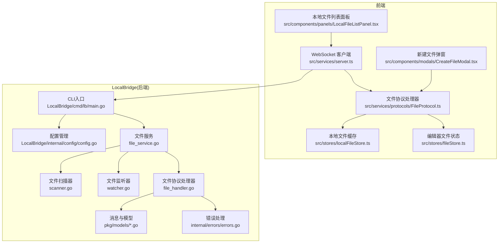
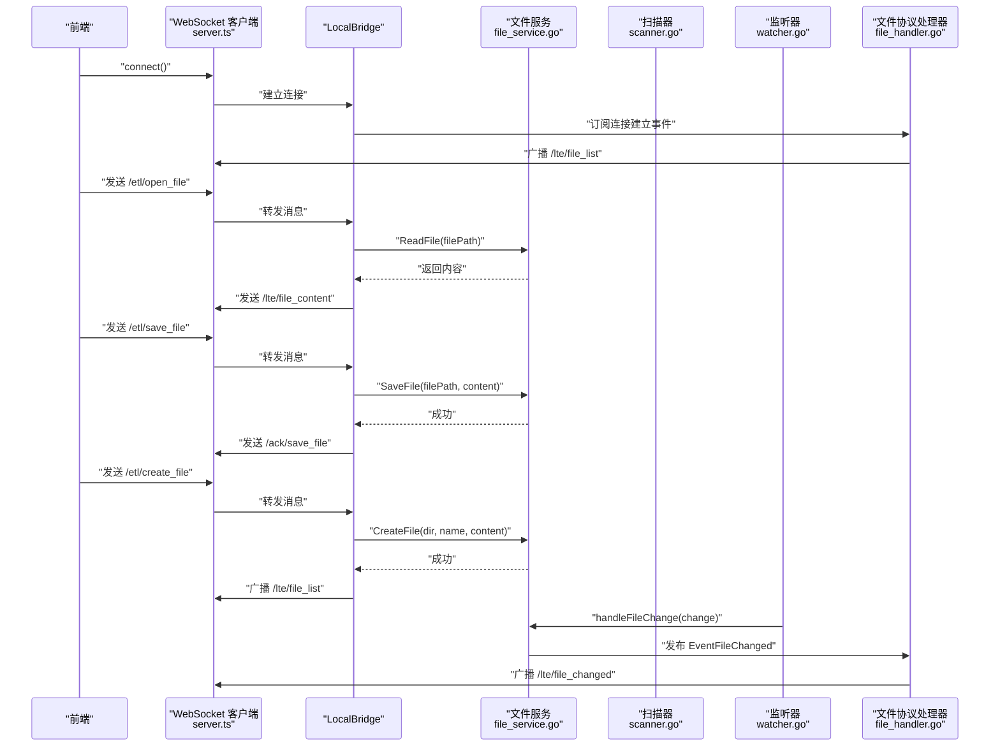
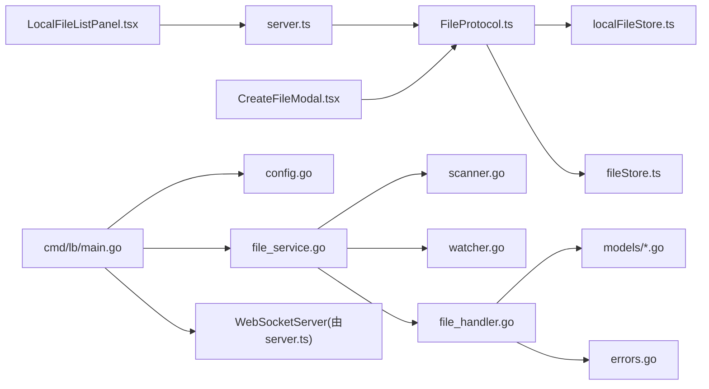

# 本地文件管理

<cite>
**本文引用的文件**
- [LocalBridge/README.md](file://LocalBridge/README.md)
- [LocalBridge/cmd/lb/main.go](file://LocalBridge/cmd/lb/main.go)
- [LocalBridge/internal/config/config.go](file://LocalBridge/internal/config/config.go)
- [LocalBridge/internal/service/file/file_service.go](file://LocalBridge/internal/service/file/file_service.go)
- [LocalBridge/internal/service/file/scanner.go](file://LocalBridge/internal/service/file/scanner.go)
- [LocalBridge/internal/service/file/watcher.go](file://LocalBridge/internal/service/file/watcher.go)
- [LocalBridge/internal/protocol/file/file_handler.go](file://LocalBridge/internal/protocol/file/file_handler.go)
- [LocalBridge/pkg/models/file.go](file://LocalBridge/pkg/models/file.go)
- [LocalBridge/pkg/models/message.go](file://LocalBridge/pkg/models/message.go)
- [LocalBridge/internal/errors/errors.go](file://LocalBridge/internal/errors/errors.go)
- [src/services/server.ts](file://src/services/server.ts)
- [src/services/protocols/FileProtocol.ts](file://src/services/protocols/FileProtocol.ts)
- [src/stores/localFileStore.ts](file://src/stores/localFileStore.ts)
- [src/stores/fileStore.ts](file://src/stores/fileStore.ts)
- [src/components/panels/LocalFileListPanel.tsx](file://src/components/panels/LocalFileListPanel.tsx)
- [src/components/modals/CreateFileModal.tsx](file://src/components/modals/CreateFileModal.tsx)
</cite>

## 目录
1. [简介](#简介)
2. [项目结构](#项目结构)
3. [核心组件](#核心组件)
4. [架构总览](#架构总览)
5. [详细组件分析](#详细组件分析)
6. [依赖关系分析](#依赖关系分析)
7. [性能考量](#性能考量)
8. [故障排查指南](#故障排查指南)
9. [结论](#结论)
10. [附录](#附录)

## 简介
本章节面向“本地文件管理”主题，聚焦前端与本地桥接服务（LocalBridge）之间的文件管理能力，包括：
- 本地文件扫描与列表展示
- 打开/保存/创建本地文件
- 文件变更通知与外部修改提醒
- WebSocket 协议与消息路由
- 前端状态管理与交互体验

该能力由前端 WebSocket 客户端、协议处理器、文件存储以及 LocalBridge 的文件服务、扫描器、监听器共同协作实现。

## 项目结构
围绕本地文件管理的关键文件分布如下：
- 前端
  - WebSocket 客户端与协议注册：src/services/server.ts、src/services/protocols/FileProtocol.ts
  - 本地文件列表与创建弹窗：src/components/panels/LocalFileListPanel.tsx、src/components/modals/CreateFileModal.tsx
  - 本地文件与编辑器文件状态：src/stores/localFileStore.ts、src/stores/fileStore.ts
- 本地桥接服务（Go）
  - 入口与配置：LocalBridge/cmd/lb/main.go、LocalBridge/internal/config/config.go
  - 文件服务与扫描/监听：LocalBridge/internal/service/file/file_service.go、scanner.go、watcher.go
  - 文件协议处理器：LocalBridge/internal/protocol/file/file_handler.go
  - 消息与模型：LocalBridge/pkg/models/message.go、file.go
  - 错误与日志：LocalBridge/internal/errors/errors.go

图表来源
- [src/services/server.ts](file://src/services/server.ts#L1-L230)
- [src/services/protocols/FileProtocol.ts](file://src/services/protocols/FileProtocol.ts#L1-L248)
- [src/stores/localFileStore.ts](file://src/stores/localFileStore.ts#L1-L117)
- [src/stores/fileStore.ts](file://src/stores/fileStore.ts#L1-L461)
- [src/components/panels/LocalFileListPanel.tsx](file://src/components/panels/LocalFileListPanel.tsx#L1-L165)
- [src/components/modals/CreateFileModal.tsx](file://src/components/modals/CreateFileModal.tsx#L1-L433)
- [LocalBridge/cmd/lb/main.go](file://LocalBridge/cmd/lb/main.go#L1-L128)
- [LocalBridge/internal/config/config.go](file://LocalBridge/internal/config/config.go#L1-L160)
- [LocalBridge/internal/service/file/file_service.go](file://LocalBridge/internal/service/file/file_service.go#L1-L245)
- [LocalBridge/internal/service/file/scanner.go](file://LocalBridge/internal/service/file/scanner.go#L1-L121)
- [LocalBridge/internal/service/file/watcher.go](file://LocalBridge/internal/service/file/watcher.go#L1-L192)
- [LocalBridge/internal/protocol/file/file_handler.go](file://LocalBridge/internal/protocol/file/file_handler.go#L1-L222)
- [LocalBridge/pkg/models/message.go](file://LocalBridge/pkg/models/message.go#L1-L72)
- [LocalBridge/pkg/models/file.go](file://LocalBridge/pkg/models/file.go#L1-L19)
- [LocalBridge/internal/errors/errors.go](file://LocalBridge/internal/errors/errors.go#L1-L141)

章节来源
- [LocalBridge/README.md](file://LocalBridge/README.md#L1-L385)

## 核心组件
- 前端 WebSocket 客户端与协议注册
  - 负责连接 LocalBridge、注册路由、发送/接收消息、维护连接状态与超时。
  - 参考：[src/services/server.ts](file://src/services/server.ts#L1-L230)
- 文件协议处理器
  - 注册与处理本地文件相关路由（文件列表、文件内容、文件变化、保存确认等），并与前端 Store 协作更新状态。
  - 参考：[src/services/protocols/FileProtocol.ts](file://src/services/protocols/FileProtocol.ts#L1-L248)
- 本地文件缓存 Store
  - 存储从 LocalBridge 推送的文件列表、根目录、刷新状态等，不持久化，始终从后端实时获取。
  - 参考：[src/stores/localFileStore.ts](file://src/stores/localFileStore.ts#L1-L117)
- 编辑器文件状态 Store
  - 管理当前打开的文件、节点/边、文件配置（路径、是否删除/外部修改标记、最后同步时间）等。
  - 参考：[src/stores/fileStore.ts](file://src/stores/fileStore.ts#L1-L461)
- 本地文件列表面板与新建文件弹窗
  - 列表面板：搜索、刷新、打开文件；新建弹窗：校验文件名、目录、提交创建请求。
  - 参考：[src/components/panels/LocalFileListPanel.tsx](file://src/components/panels/LocalFileListPanel.tsx#L1-L165)、[src/components/modals/CreateFileModal.tsx](file://src/components/modals/CreateFileModal.tsx#L1-L433)
- LocalBridge 入口与配置
  - CLI 启动、配置加载与覆盖、日志初始化、事件总线、WebSocket 服务器、路由注册、文件服务启动。
  - 参考：[LocalBridge/cmd/lb/main.go](file://LocalBridge/cmd/lb/main.go#L1-L128)、[LocalBridge/internal/config/config.go](file://LocalBridge/internal/config/config.go#L1-L160)
- 文件服务与扫描/监听
  - 文件扫描、索引构建、文件读取/保存/创建、路径安全校验、文件监听与防抖、事件发布。
  - 参考：[LocalBridge/internal/service/file/file_service.go](file://LocalBridge/internal/service/file/file_service.go#L1-L245)、[LocalBridge/internal/service/file/scanner.go](file://LocalBridge/internal/service/file/scanner.go#L1-L121)、[LocalBridge/internal/service/file/watcher.go](file://LocalBridge/internal/service/file/watcher.go#L1-L192)
- 文件协议处理器（后端）
  - 处理 /etl/* 请求（打开/保存/创建/刷新）、订阅事件并向前端广播 /lte/* 与 /ack/* 消息。
  - 参考：[LocalBridge/internal/protocol/file/file_handler.go](file://LocalBridge/internal/protocol/file/file_handler.go#L1-L222)
- 消息与模型
  - 统一消息结构、文件列表/内容/变化、请求与确认数据结构。
  - 参考：[LocalBridge/pkg/models/message.go](file://LocalBridge/pkg/models/message.go#L1-L72)、[LocalBridge/pkg/models/file.go](file://LocalBridge/pkg/models/file.go#L1-L19)
- 错误处理
  - 统一错误码与错误包装，便于前后端一致处理。
  - 参考：[LocalBridge/internal/errors/errors.go](file://LocalBridge/internal/errors/errors.go#L1-L141)

章节来源
- [src/services/server.ts](file://src/services/server.ts#L1-L230)
- [src/services/protocols/FileProtocol.ts](file://src/services/protocols/FileProtocol.ts#L1-L248)
- [src/stores/localFileStore.ts](file://src/stores/localFileStore.ts#L1-L117)
- [src/stores/fileStore.ts](file://src/stores/fileStore.ts#L1-L461)
- [src/components/panels/LocalFileListPanel.tsx](file://src/components/panels/LocalFileListPanel.tsx#L1-L165)
- [src/components/modals/CreateFileModal.tsx](file://src/components/modals/CreateFileModal.tsx#L1-L433)
- [LocalBridge/cmd/lb/main.go](file://LocalBridge/cmd/lb/main.go#L1-L128)
- [LocalBridge/internal/config/config.go](file://LocalBridge/internal/config/config.go#L1-L160)
- [LocalBridge/internal/service/file/file_service.go](file://LocalBridge/internal/service/file/file_service.go#L1-L245)
- [LocalBridge/internal/service/file/scanner.go](file://LocalBridge/internal/service/file/scanner.go#L1-L121)
- [LocalBridge/internal/service/file/watcher.go](file://LocalBridge/internal/service/file/watcher.go#L1-L192)
- [LocalBridge/internal/protocol/file/file_handler.go](file://LocalBridge/internal/protocol/file/file_handler.go#L1-L222)
- [LocalBridge/pkg/models/message.go](file://LocalBridge/pkg/models/message.go#L1-L72)
- [LocalBridge/pkg/models/file.go](file://LocalBridge/pkg/models/file.go#L1-L19)
- [LocalBridge/internal/errors/errors.go](file://LocalBridge/internal/errors/errors.go#L1-L141)

## 架构总览
本地文件管理的端到端流程：
- 前端通过 WebSocket 连接 LocalBridge
- LocalBridge 启动后扫描根目录，推送文件列表
- 前端列表面板展示文件，支持刷新、搜索、打开
- 打开文件时前端请求 /etl/open_file，后端返回 /lte/file_content
- 保存文件时前端请求 /etl/save_file，后端返回 /ack/save_file
- 新建文件时前端请求 /etl/create_file，后端创建成功后推送更新后的文件列表
- 文件变化（新增/修改/删除）由后端监听器捕获并通过 /lte/file_changed 推送

图表来源
- [src/services/server.ts](file://src/services/server.ts#L1-L230)
- [src/services/protocols/FileProtocol.ts](file://src/services/protocols/FileProtocol.ts#L1-L248)
- [LocalBridge/cmd/lb/main.go](file://LocalBridge/cmd/lb/main.go#L1-L128)
- [LocalBridge/internal/service/file/file_service.go](file://LocalBridge/internal/service/file/file_service.go#L1-L245)
- [LocalBridge/internal/service/file/scanner.go](file://LocalBridge/internal/service/file/scanner.go#L1-L121)
- [LocalBridge/internal/service/file/watcher.go](file://LocalBridge/internal/service/file/watcher.go#L1-L192)
- [LocalBridge/internal/protocol/file/file_handler.go](file://LocalBridge/internal/protocol/file/file_handler.go#L1-L222)

## 详细组件分析

### 前端 WebSocket 客户端与协议注册
- 连接管理：超时控制、状态回调、错误与断开处理。
- 路由注册：集中注册协议处理器，按 path 分发消息。
- 发送消息：统一 JSON 序列化，保证 path/data 结构一致。
- 参考路径
  - [连接与路由注册](file://src/services/server.ts#L1-L230)
  - [协议注册与初始化](file://src/services/server.ts#L216-L230)

章节来源
- [src/services/server.ts](file://src/services/server.ts#L1-L230)

### 文件协议处理器（前端）
- 注册路由：/lte/file_list、/lte/file_content、/lte/file_changed、/ack/save_file
- 处理文件列表：更新本地文件缓存，提示刷新完成
- 处理文件内容：调用 fileStore 打开文件并导入内容
- 处理文件变化：根据类型更新本地缓存与编辑器文件状态
- 处理保存确认：提示保存成功
- 请求接口：requestOpenFile、requestCreateFile
- 参考路径
  - [路由注册与消息处理](file://src/services/protocols/FileProtocol.ts#L1-L248)

章节来源
- [src/services/protocols/FileProtocol.ts](file://src/services/protocols/FileProtocol.ts#L1-L248)

### 本地文件缓存 Store
- 字段：rootPath、files、lastUpdateTime、isRefreshing
- 方法：setFileList、addFile、removeFile、updateFile、findFileByPath、setRefreshing、clear
- 行为：全量替换文件列表、增量增删、更新时间戳、清空缓存
- 参考路径
  - [状态定义与方法](file://src/stores/localFileStore.ts#L1-L117)

章节来源
- [src/stores/localFileStore.ts](file://src/stores/localFileStore.ts#L1-L117)

### 编辑器文件状态 Store
- 字段：files、currentFile、config（filePath、relativePath、isDeleted、isModifiedExternally、lastSyncTime）
- 方法：openFileFromLocal、saveFileToLocal、markFileDeleted、markFileModified、reloadFileFromLocal、findFileByPath
- 行为：打开/保存/重载本地文件、标记外部修改/删除、同步时间戳
- 参考路径
  - [文件状态与方法](file://src/stores/fileStore.ts#L1-L461)

章节来源
- [src/stores/fileStore.ts](file://src/stores/fileStore.ts#L1-L461)

### 本地文件列表面板
- 功能：显示根目录、搜索过滤、刷新列表、打开文件
- 交互：连接断开时引导连接、发送 /etl/refresh_file_list
- 参考路径
  - [面板渲染与交互](file://src/components/panels/LocalFileListPanel.tsx#L1-L165)

章节来源
- [src/components/panels/LocalFileListPanel.tsx](file://src/components/panels/LocalFileListPanel.tsx#L1-L165)

### 新建文件弹窗
- 功能：校验文件名（非法字符、后缀、重名）、选择目录、提交创建请求
- 交互：连接检查、预览文件名、禁用提交按钮、提示成功/失败
- 参考路径
  - [弹窗与校验逻辑](file://src/components/modals/CreateFileModal.tsx#L1-L433)

章节来源
- [src/components/modals/CreateFileModal.tsx](file://src/components/modals/CreateFileModal.tsx#L1-L433)

### LocalBridge 入口与配置
- CLI：命令行参数覆盖配置、初始化日志、创建事件总线、文件服务、WebSocket 服务器、注册协议处理器、启动与退出
- 配置：默认值、路径规范化、根目录存在性校验、日志目录规范化
- 参考路径
  - [CLI 启动流程](file://LocalBridge/cmd/lb/main.go#L1-L128)
  - [配置加载与覆盖](file://LocalBridge/internal/config/config.go#L1-L160)

章节来源
- [LocalBridge/cmd/lb/main.go](file://LocalBridge/cmd/lb/main.go#L1-L128)
- [LocalBridge/internal/config/config.go](file://LocalBridge/internal/config/config.go#L1-L160)

### 文件服务与扫描/监听
- 文件服务：索引构建、读取/保存/创建、路径安全校验、事件发布
- 扫描器：递归遍历、排除目录、扩展名校验、相对路径计算
- 监听器：fsnotify 监听、事件类型判断、扩展名校验、防抖处理
- 参考路径
  - [文件服务](file://LocalBridge/internal/service/file/file_service.go#L1-L245)
  - [扫描器](file://LocalBridge/internal/service/file/scanner.go#L1-L121)
  - [监听器](file://LocalBridge/internal/service/file/watcher.go#L1-L192)

章节来源
- [LocalBridge/internal/service/file/file_service.go](file://LocalBridge/internal/service/file/file_service.go#L1-L245)
- [LocalBridge/internal/service/file/scanner.go](file://LocalBridge/internal/service/file/scanner.go#L1-L121)
- [LocalBridge/internal/service/file/watcher.go](file://LocalBridge/internal/service/file/watcher.go#L1-L192)

### 文件协议处理器（后端）
- 路由前缀：/etl/open_file、/etl/save_file、/etl/create_file、/etl/refresh_file_list
- 处理逻辑：解析请求、调用文件服务、返回 /lte/* 或 /ack/*、错误封装
- 事件广播：连接建立时推送文件列表；文件变化时广播 /lte/file_changed
- 参考路径
  - [处理器实现](file://LocalBridge/internal/protocol/file/file_handler.go#L1-L222)

章节来源
- [LocalBridge/internal/protocol/file/file_handler.go](file://LocalBridge/internal/protocol/file/file_handler.go#L1-L222)

### 消息与模型
- 通用消息结构：path、data
- 文件相关模型：FileInfo、FileListData、FileContentData、FileChangedData、OpenFileRequest、SaveFileRequest、CreateFileRequest、SaveFileAckData
- 参考路径
  - [消息与模型](file://LocalBridge/pkg/models/message.go#L1-L72)
  - [文件内部模型](file://LocalBridge/pkg/models/file.go#L1-L19)

章节来源
- [LocalBridge/pkg/models/message.go](file://LocalBridge/pkg/models/message.go#L1-L72)
- [LocalBridge/pkg/models/file.go](file://LocalBridge/pkg/models/file.go#L1-L19)

### 错误处理
- 错误码：FILE_NOT_FOUND、FILE_READ_ERROR、FILE_WRITE_ERROR、FILE_NAME_CONFLICT、INVALID_JSON、PERMISSION_DENIED、INVALID_REQUEST、CONNECTION_FAILED、INTERNAL_ERROR
- 错误包装：统一错误结构与 ToErrorData 转换
- 参考路径
  - [错误定义与构造](file://LocalBridge/internal/errors/errors.go#L1-L141)

章节来源
- [LocalBridge/internal/errors/errors.go](file://LocalBridge/internal/errors/errors.go#L1-L141)

## 依赖关系分析
- 前端依赖
  - WebSocket 客户端依赖协议处理器；协议处理器依赖前端 Store 与 server.ts
  - 列表面板依赖本地文件 Store 与 server.ts
  - 新建弹窗依赖本地文件 Store、fileStore、server.ts 与协议处理器
- 后端依赖
  - CLI 依赖配置、日志、事件总线、文件服务、WebSocket 服务器、路由
  - 文件服务依赖扫描器、监听器、事件总线
  - 协议处理器依赖文件服务、事件总线、WebSocket 服务器、消息模型与错误处理

图表来源
- [src/services/server.ts](file://src/services/server.ts#L1-L230)
- [src/services/protocols/FileProtocol.ts](file://src/services/protocols/FileProtocol.ts#L1-L248)
- [src/stores/localFileStore.ts](file://src/stores/localFileStore.ts#L1-L117)
- [src/stores/fileStore.ts](file://src/stores/fileStore.ts#L1-L461)
- [src/components/panels/LocalFileListPanel.tsx](file://src/components/panels/LocalFileListPanel.tsx#L1-L165)
- [src/components/modals/CreateFileModal.tsx](file://src/components/modals/CreateFileModal.tsx#L1-L433)
- [LocalBridge/cmd/lb/main.go](file://LocalBridge/cmd/lb/main.go#L1-L128)
- [LocalBridge/internal/config/config.go](file://LocalBridge/internal/config/config.go#L1-L160)
- [LocalBridge/internal/service/file/file_service.go](file://LocalBridge/internal/service/file/file_service.go#L1-L245)
- [LocalBridge/internal/service/file/scanner.go](file://LocalBridge/internal/service/file/scanner.go#L1-L121)
- [LocalBridge/internal/service/file/watcher.go](file://LocalBridge/internal/service/file/watcher.go#L1-L192)
- [LocalBridge/internal/protocol/file/file_handler.go](file://LocalBridge/internal/protocol/file/file_handler.go#L1-L222)
- [LocalBridge/pkg/models/message.go](file://LocalBridge/pkg/models/message.go#L1-L72)
- [LocalBridge/pkg/models/file.go](file://LocalBridge/pkg/models/file.go#L1-L19)
- [LocalBridge/internal/errors/errors.go](file://LocalBridge/internal/errors/errors.go#L1-L141)

## 性能考量
- 文件扫描
  - 递归遍历根目录，建议合理设置排除目录（如 node_modules、.git），减少 IO 压力。
  - 参考：[扫描器](file://LocalBridge/internal/service/file/scanner.go#L1-L121)
- 文件监听
  - 使用 fsnotify 监听目录树，结合防抖（默认 300ms）降低频繁变更带来的广播风暴。
  - 参考：[监听器](file://LocalBridge/internal/service/file/watcher.go#L1-L192)
- JSON 解析与序列化
  - 读取/保存均进行 JSON 解析/序列化，建议保持文件大小适中，避免大文件频繁写入。
  - 参考：[文件服务](file://LocalBridge/internal/service/file/file_service.go#L1-L245)
- 前端渲染
  - 列表面板支持搜索过滤，建议在大数据量场景下限制一次性渲染数量或增加虚拟滚动。
  - 参考：[列表面板](file://src/components/panels/LocalFileListPanel.tsx#L1-L165)

## 故障排查指南
- 连接问题
  - 检查 LocalBridge 是否在默认端口 9066 启动；前端连接超时约 3 秒。
  - 参考：[连接与超时](file://src/services/server.ts#L1-L230)
- 文件列表为空
  - 确认 LocalBridge 根目录配置正确且存在；可在前端面板点击刷新。
  - 参考：[刷新请求](file://src/components/panels/LocalFileListPanel.tsx#L1-L165)、[刷新路由](file://LocalBridge/internal/protocol/file/file_handler.go#L1-L222)
- 打开/保存失败
  - 检查文件路径合法性与权限；查看错误码（如 FILE_NOT_FOUND、FILE_READ_ERROR、FILE_WRITE_ERROR）。
  - 参考：[错误码定义](file://LocalBridge/internal/errors/errors.go#L1-L141)
- 文件名冲突或非法字符
  - 新建文件时检查文件名是否包含非法字符、是否已存在同名文件。
  - 参考：[新建弹窗校验](file://src/components/modals/CreateFileModal.tsx#L1-L433)、[创建请求处理](file://LocalBridge/internal/protocol/file/file_handler.go#L1-L222)
- 外部修改提醒
  - 当文件被外部修改时，前端会提示重新加载；编辑器侧也会标记 isModifiedExternally。
  - 参考：[文件变化处理](file://src/services/protocols/FileProtocol.ts#L1-L248)、[文件服务变化处理](file://LocalBridge/internal/service/file/file_service.go#L1-L245)

章节来源
- [src/services/server.ts](file://src/services/server.ts#L1-L230)
- [src/components/panels/LocalFileListPanel.tsx](file://src/components/panels/LocalFileListPanel.tsx#L1-L165)
- [src/components/modals/CreateFileModal.tsx](file://src/components/modals/CreateFileModal.tsx#L1-L433)
- [LocalBridge/internal/protocol/file/file_handler.go](file://LocalBridge/internal/protocol/file/file_handler.go#L1-L222)
- [LocalBridge/internal/errors/errors.go](file://LocalBridge/internal/errors/errors.go#L1-L141)
- [src/services/protocols/FileProtocol.ts](file://src/services/protocols/FileProtocol.ts#L1-L248)
- [LocalBridge/internal/service/file/file_service.go](file://LocalBridge/internal/service/file/file_service.go#L1-L245)

## 结论
本地文件管理通过前端 WebSocket 客户端与 LocalBridge 的紧密协作，实现了从文件扫描、列表展示、打开/保存/创建到文件变更通知的完整闭环。后端采用事件驱动与模块化设计，前端通过 Store 与协议处理器实现状态同步与用户体验优化。整体架构清晰、扩展性强，适合进一步引入更多协议与功能。

## 附录
- 协议与消息
  - 路由约定：/lte/*（服务端推送）、/etl/*（客户端请求）、/ack/*（确认）、/error（错误）
  - 文件相关消息：/lte/file_list、/lte/file_content、/lte/file_changed、/ack/save_file、/etl/open_file、/etl/save_file、/etl/create_file、/etl/refresh_file_list
  - 参考：[协议与消息定义](file://LocalBridge/README.md#L114-L281)
- 配置项
  - server.host/port、file.root/exclude/extensions、log.level/dir/push_to_client、maafw.enabled/lib_dir
  - 参考：[配置结构](file://LocalBridge/internal/config/config.go#L1-L160)、[默认配置](file://LocalBridge/README.md#L75-L100)