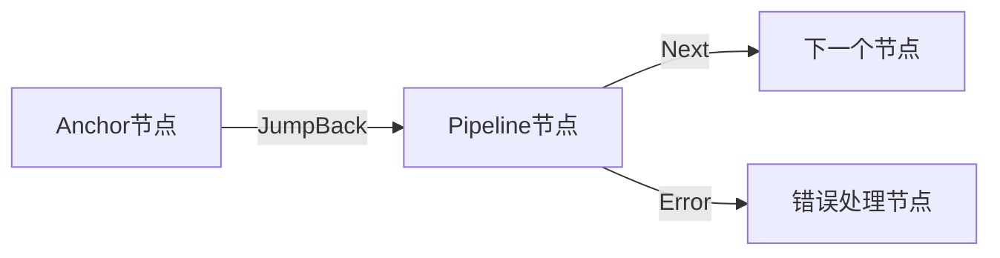
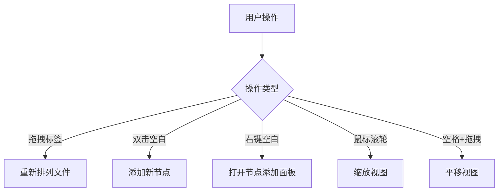

# 核心概念

<cite>
**本文档引用的文件**
- [nodeContextMenu.tsx](file://src/components/flow/nodes/nodeContextMenu.tsx)
- [debugStore.ts](file://src/stores/debugStore.ts)
- [DebugProtocol.ts](file://src/services/protocols/DebugProtocol.ts)
- [configStore.ts](file://src/stores/configStore.ts)
- [NodeTypeEnum](file://src/components/flow/nodes/constants.ts#L9-L13)
- [EdgeType](file://src/stores/flow/types.ts#L26-L36)
- [PipelineNodeType](file://src/stores/flow/types.ts#L132-L143)
- [ExternalNodeType](file://src/stores/flow/types.ts#L146-L157)
- [AnchorNodeType](file://src/stores/flow/types.ts#L160-L171)
- [FieldPanel.tsx](file://src/components/panels/FieldPanel.tsx)
- [FilePanel.tsx](file://src/components/panels/FilePanel.tsx)
- [ToolPanel.tsx](file://src/components/panels/ToolPanel.tsx)
- [Flow.tsx](file://src/components/Flow.tsx)
- [viewSlice.ts](file://src/stores/flow/slices/viewSlice.ts)
- [importer.ts](file://src/core/parser/importer.ts)
- [exporter.ts](file://src/core/parser/exporter.ts)
- [edges.tsx](file://src/components/flow/edges.tsx)
- [layout.ts](file://src/core/layout.ts)
- [graphSlice.ts](file://src/stores/flow/slices/graphSlice.ts)
- [EdgePanel.tsx](file://src/components/panels/EdgePanel.tsx)
- [nodeTemplates.ts](file://src/data/nodeTemplates.ts)
- [NodeAddPanel.tsx](file://src/components/panels/NodeAddPanel.tsx)
- [customTemplateStore.ts](file://src/stores/customTemplateStore.ts)
</cite>

## 更新摘要
**已做更改**
- 新增“调试框架”章节，详细说明调试模式、断点、执行历史等核心功能
- 新增“节点右键菜单”章节，解释复制节点名、保存为模板、设置断点等操作
- 在“配置持久化”部分更新了配置存储机制，说明配置如何通过`configStore`持久化
- 在“协议兼容性”部分补充了调试协议的版本管理和事件兼容机制
- 更新“工具”章节，增加调试相关功能说明
- 优化“Pipeline面板”章节，补充调试模式下的编译预览功能

## 目录
1. [节点](#节点)
2. [连接](#连接)
3. [字段面板](#字段面板)
4. [文件与视口](#文件与视口)
5. [工具](#工具)
6. [Pipeline面板](#pipeline面板)
7. [节点模板面板](#节点模板面板)
8. [调试框架](#调试框架)
9. [节点右键菜单](#节点右键菜单)
10. [配置持久化](#配置持久化)
11. [协议兼容性](#协议兼容性)

## 节点

MaaPipelineEditor中的节点是流程图的基本构建单元，代表了自动化流程中的一个执行步骤。根据功能和语义的不同，节点被分为三种类型：Pipeline节点、External节点和Anchor节点。这些类型在代码中通过`NodeTypeEnum`枚举进行定义。

### Pipeline节点

Pipeline节点是执行核心逻辑的节点，它包含了识别（recognition）和动作（action）两大核心功能。每个Pipeline节点都包含一个标签（label），用于在流程图中标识该节点。在数据模型中，Pipeline节点由`PipelineNodeType`接口定义，其`data`属性包含`recognition`和`action`对象，分别用于配置识别算法和执行动作。识别部分定义了如何在屏幕上查找目标，而动作部分则定义了找到目标后要执行的操作。

### External节点

External节点代表对外部流程的调用。它不包含复杂的识别和动作配置，其主要作用是引用另一个Pipeline文件中的节点。在数据模型中，External节点由`ExternalNodeType`接口定义，其`data`属性仅包含一个`label`字段。当流程执行到External节点时，会跳转到指定的外部Pipeline文件并执行其中的流程。

### Anchor节点

Anchor节点是一种流程锚点，用于实现流程的重定向。它不执行任何实际操作，而是作为一个跳转目标，使流程可以跳转到该节点。在数据模型中，Anchor节点由`AnchorNodeType`接口定义，其`data`属性也仅包含一个`label`字段。Anchor节点在编译时会自动添加`[Anchor]`前缀，以区别于其他类型的节点。

**Section sources**
- [constants.ts](file://src/components/flow/nodes/constants.ts#L9-L13)
- [types.ts](file://src/stores/flow/types.ts#L132-L171)

## 连接

连接（Edge）在MaaPipelineEditor中表示控制流与数据流，定义了节点之间的执行顺序和状态转移。连接在状态机中具有重要意义，它决定了流程的走向。连接由`EdgeType`接口定义，包含`source`（源节点ID）、`target`（目标节点ID）、`sourceHandle`（源句柄类型）等属性。

连接的`sourceHandle`属性使用`SourceHandleTypeEnum`枚举来区分不同的控制流类型：
- **Next**: 表示正常执行的下一个节点，通常用绿色线条表示。
- **Error**: 表示发生错误时的跳转节点，通常用红色线条表示。
- **JumpBack**: 表示跳回之前的节点，通常用蓝色线条表示。

在视觉表现上，连接的样式根据其类型而变化，通过CSS类`edge-next`、`edge-error`和`edge-jumpback`来实现不同的颜色和样式。连接还可以包含标签（label），用于显示连接的序号，帮助用户理解复杂的流程逻辑。

### 删除连接功能

从最新版本开始，用户可以在选中单条连接后，在右侧“连接设置”面板中看到一个红色垃圾桶图标。点击该图标即可直接删除当前选中的连接。此功能通过`EdgePanel.tsx`中的`handleDelete`回调函数实现，调用`updateEdges`方法将删除指令提交至状态管理器。该操作支持撤销（Ctrl+Z），确保误删可恢复。

**Diagram sources**
- [edges.tsx](file://src/components/flow/edges.tsx)
- [types.ts](file://src/stores/flow/types.ts#L26-L36)

**Section sources**
- [edges.tsx](file://src/components/flow/edges.tsx)
- [types.ts](file://src/stores/flow/types.ts#L26-L36)
- [EdgePanel.tsx](file://src/components/panels/EdgePanel.tsx)

## 字段面板

字段面板是MaaPipelineEditor中用于动态呈现和配置节点参数的核心组件。当用户选中一个节点时，字段面板会根据节点类型动态显示相应的配置选项。面板的实现位于`FieldPanel.tsx`文件中，它通过React的`useMemo`和`useCallback`钩子来优化渲染性能。

字段面板支持三类主要参数的配置：
1. **识别参数**：配置节点的识别算法，如模板匹配、OCR等。
2. **动作参数**：配置节点执行的动作，如点击、滑动、输入文本等。
3. **其他参数**：配置节点的通用行为，如超时时间、延迟、是否启用等。

对于Pipeline节点，字段面板提供了一个结构化的界面，允许用户选择识别算法和动作类型，并为每种类型配置具体的参数。用户可以通过“添加字段”按钮来添加新的参数配置。对于External节点和Anchor节点，字段面板则简化为仅编辑节点名称。

字段面板还集成了一个工具栏，提供复制节点名等功能，方便用户在不同上下文中使用节点标识。

### 删除节点功能

在字段面板的右上角新增了一个红色垃圾桶图标，当用户选中某个节点时，该图标将变为可点击状态。点击后会触发删除操作，调用`updateNodes`方法从流程图中移除该节点及其所有相关连接。该功能在`FieldPanel.tsx`中通过`handleDelete`回调函数实现，并已集成至状态管理系统，支持撤销与重做操作。此设计提升了编辑效率，使用户无需右键菜单即可快速删除节点。

**Section sources**
- [FieldPanel.tsx](file://src/components/panels/FieldPanel.tsx)

## 文件与视口

文件与视口管理机制是MaaPipelineEditor中处理用户工作流和视图交互的核心部分。

### 文件管理

文件管理功能允许用户创建、打开、保存和切换多个Pipeline文件。文件面板（`FilePanel.tsx`）提供了标签页式的界面，用户可以通过拖拽来重新排列文件标签，通过点击“+”按钮来创建新文件，或通过点击“x”按钮来关闭文件。文件名在保存时会作为JSON/JSONC文件的名称。

文件的导入导出功能由`importer.ts`和`exporter.ts`模块处理。导入时，系统会解析JSON/JSONC格式的Pipeline配置，并将其转换为内部的节点和连接数据结构。导出时，系统会将当前流程图转换为标准的Pipeline配置格式，并可以包含配置元数据。

### 视口控制

视口控制允许用户通过缩放和平移来浏览大型流程图。视口状态由`viewSlice.ts`中的`FlowViewState`定义，包含`viewport`（视口坐标和缩放级别）和`size`（画布尺寸）等属性。用户可以通过鼠标滚轮进行缩放，通过按住空格键并拖动鼠标进行平移。控制组件（Controls）提供了缩放按钮和重置视图的功能。

**Diagram sources**
- [FilePanel.tsx](file://src/components/panels/FilePanel.tsx)
- [Flow.tsx](file://src/components/Flow.tsx)
- [viewSlice.ts](file://src/stores/flow/slices/viewSlice.ts)

**Section sources**
- [FilePanel.tsx](file://src/components/panels/FilePanel.tsx)
- [Flow.tsx](file://src/components/Flow.tsx)
- [viewSlice.ts](file://src/stores/flow/slices/viewSlice.ts)

## 工具

工具栏提供了多种辅助功能，以提高用户的编辑效率和体验。工具栏由`ToolPanel.tsx`实现，分为添加、全局和布局三个部分。

### 添加工具

添加工具提供了一组预设的节点模板，用户可以通过点击相应的图标来快速添加常用类型的节点，如图像识别、OCR、点击动作等。这些模板定义在`nodeTemplates.ts`文件中，包含了节点的图标、标签和默认配置。

### 全局工具

全局工具提供了以下功能：
- **设置**：打开配置面板，调整编辑器的各种设置。
- **AI对话历史**：查看与AI助手的交互历史。
- **复制/粘贴**：支持节点的复制和粘贴操作，便于复用流程片段。
- **撤销/重做**：提供无限层级的撤销和重做功能，基于`historySlice.ts`中的历史状态管理。

### 布局工具

布局工具提供了以下功能：
- **对齐**：支持居中对齐、顶部对齐、底部对齐等，帮助用户整齐排列多个节点。
- **自动布局**：一键将所有节点按照合理的布局算法排列，避免手动调整。
- **节点间距缩放**：通过“增加水平间距”、“缩减水平间距”、“增加垂直间距”和“缩减垂直间距”工具，可以按比例调整选中节点之间的相对间距。该功能基于`shiftNodes`方法实现，根据节点与基准点的距离按比例移动，保持相对布局关系。
- **保存为图片**：将当前流程图导出为PNG图片，便于分享和文档化。

此外，工具栏还集成了调试相关功能，包括调试模式切换、单步执行、继续执行等，这些功能与`DebugPanel`紧密集成，为用户提供完整的调试体验。

**Section sources**
- [ToolPanel.tsx](file://src/components/panels/ToolPanel.tsx)
- [layout.ts](file://src/core/layout.ts)
- [graphSlice.ts](file://src/stores/flow/slices/graphSlice.ts)

## Pipeline面板

Pipeline面板提供了全局流程信息与编译结果预览。它显示了当前流程的概要信息，包括节点数量、连接数量、编译状态等。用户可以通过该面板预览编译后的Pipeline配置，检查是否存在配置错误或逻辑问题。

在代码层面，Pipeline面板与`flowToPipeline`函数紧密集成，该函数负责将内部的节点和连接数据结构转换为标准的Pipeline配置格式。面板会实时反映流程图的当前状态，并在用户进行修改时更新预览内容。

Pipeline面板还可能集成编译器的输出信息，显示警告或错误，帮助用户及时发现和修复问题。它是连接可视化编辑器与底层配置文件的桥梁，确保用户所见即所得。在调试模式下，Pipeline面板还会显示调试相关的元数据，如入口节点、断点配置等。

**Section sources**
- [exporter.ts](file://src/core/parser/exporter.ts)

## 节点模板面板

节点模板面板是快速添加节点的工具，提供预制模板和自定义模板的选择与预览功能。用户可以通过右键单击编辑区空白区域呼出该面板，面板会在鼠标位置附近弹出，并自动计算最佳显示位置以避免超出视口。

### 面板界面

节点模板面板采用左右分栏布局，左侧为节点预览区，右侧为模板列表区，界面功能划分如下：
1. `节点预览区`：实时预览当前选中模板的节点样式和配置内容。
2. `搜索框`：输入关键词快速过滤模板列表。
3. `模板列表`：显示所有可用的节点模板，包括预制模板和自定义模板。
4. `模板项`：每个模板项显示图标、名称和简要描述。
5. `自定义标记`：自定义模板会显示"自定义"标签。
6. `删除按钮`：鼠标悬停在自定义模板上时显示删除按钮。
7. `快捷键提示`：底部显示可用的键盘快捷键。

### 模板管理

#### 保存为自定义模板
用户可以将当前编辑的Pipeline节点保存为自定义模板，以便后续快速复用。操作步骤如下：
1. 在编辑区选中需要保存为模板的Pipeline节点
2. 在[字段面板](/guide/core/field-panel)顶部工具栏中点击 <IconFont name="icon-biaodanmoban" /> 保存模板按钮
3. 在弹出的对话框中输入模板名称（最长30个字符）
4. 点击"保存"按钮确认
5. 保存后的模板会立即出现在节点模板面板的列表顶部，并带有"自定义"标签

:::tip 提示
- 仅Pipeline节点支持保存为自定义模板
- 自定义模板会保存节点的所有字段配置，包括识别类型、动作类型及其参数值（不包含节点名）
- 模板名称重复时会提示是否覆盖现有模板
- 自定义模板数量上限为50个
:::

自定义模板保存在浏览器本地存储中，方便用户在后续工作中快速复用相同配置的节点。

#### 删除自定义模板
鼠标悬停在自定义模板上时，会显示删除按钮。点击删除按钮会弹出二次确认对话框，确认后将永久删除该自定义模板。预制模板无法删除，只有自定义模板可以被删除。

### 搜索功能

在搜索框中输入关键词可快速过滤模板列表，支持按模板名称模糊匹配。当搜索结果为空时，会显示"未找到匹配的模板"提示。

### 节点预览

节点预览区会实时展示当前选中模板的详细信息：
- **Pipeline节点**：显示节点标题、识别类型、动作类型以及各字段的参数值
- **External节点**：显示紫色外部节点样式
- **Anchor节点**：显示青绿色重定向节点样式

预览区会智能格式化参数值的显示：
- 字符串值会添加引号
- 数组和对象会显示元素数量

### 模板类型

#### 预制模板
MPE内置了多种常用节点模板，包括：
- **空白节点**：不包含任何识别与动作的基础节点
- **识别类模板**：预配置常用识别类型（OCR、模板匹配等）的节点
- **动作类模板**：预配置常用动作类型（点击、等待等）的节点
- **特殊节点**：External外部引用节点、Anchor重定向节点

#### 自定义模板
用户可以将当前编辑的节点保存为自定义模板，方便后续快速复用。自定义模板会显示"自定义"标签，并支持删除操作。

### 面板操作

#### 添加节点
- **鼠标点击**：点击任意模板项即可在唤出位置添加对应节点
- **键盘操作**：
  - 使用 `↑` `↓` 方向键选择模板
  - 按 `Enter` 键添加当前选中的模板
  - 按 `Esc` 键关闭面板

### 快捷键
| 快捷键  | 功能               |
| ------- | ------------------ |
| `↑`     | 向上选择模板       |
| `↓`     | 向下选择模板       |
| `Enter` | 添加当前选中的模板 |
| `Esc`   | 关闭面板           |

### 注意事项
- 模板仅用于快速初始化节点，添加后可在[字段面板](/guide/core/field-panel)中自由调整任意字段
- 即使空白节点模板不含任何配置，导出时也会生成默认的 `recognition: "DirectHit"` 和 `action: "DoNothing"`

**Section sources**
- [NodeAddPanel.tsx](file://src/components/panels/NodeAddPanel.tsx)
- [nodeTemplates.ts](file://src/data/nodeTemplates.ts)
- [customTemplateStore.ts](file://src/stores/customTemplateStore.ts)

## 调试框架

调试框架是MaaPipelineEditor中用于流程调试的核心系统，提供了一套完整的调试工具链。调试功能通过`debugStore.ts`实现，采用Zustand状态管理，维护调试模式、断点、执行历史等核心状态。

### 调试模式

调试模式允许用户逐步执行流程，观察每个节点的执行状态。用户可以通过工具栏的调试按钮或`useDebugStore`的`toggleDebugMode`方法切换调试模式。进入调试模式后，界面会高亮显示已执行的节点和连接，帮助用户直观理解流程执行路径。

### 断点系统

断点系统允许用户在特定节点暂停执行，便于检查流程状态。用户可以通过节点右键菜单的"设置断点"选项或`useDebugStore`的`toggleBreakpoint`方法管理断点。断点信息存储在`breakpoints`集合中，当流程执行到断点节点时，会自动暂停。

### 执行历史

执行历史记录了每个节点的执行详情，包括开始时间、结束时间、耗时、识别结果和动作结果。这些信息存储在`executionHistory`数组中，用户可以在`DebugPanel`中查看详细的执行日志。执行历史支持导出为文本或JSON格式，便于问题分析和分享。

### 调试控制

调试框架提供了多种控制功能：
- **开始调试**：从指定入口节点启动调试
- **暂停调试**：立即暂停当前执行
- **继续执行**：从暂停点继续执行
- **单步执行**：逐个节点执行，便于精细调试
- **停止调试**：终止当前调试会话

这些控制功能通过`DebugProtocol`与后端通信，确保调试指令能够准确传达。

**Section sources**
- [debugStore.ts](file://src/stores/debugStore.ts)
- [DebugProtocol.ts](file://src/services/protocols/DebugProtocol.ts)

## 节点右键菜单

节点右键菜单为用户提供了一组便捷的操作选项，通过`nodeContextMenu.tsx`实现。当用户右键点击节点时，会弹出包含多个操作项的上下文菜单。

### 菜单项

节点右键菜单包含以下主要操作项：
- **复制节点名**：将节点名称复制到剪贴板，便于在其他地方引用
- **保存为模板**：将当前节点保存为自定义模板，仅对Pipeline节点可用
- **设为调试开始节点**：在调试模式下，将该节点设为入口节点
- **设置/移除断点**：在调试模式下，切换该节点的断点状态
- **删除**：删除当前节点及其相关连接

### 菜单逻辑

右键菜单的行为由`getNodeContextMenuConfig`函数控制，该函数根据节点类型和当前状态动态生成菜单配置。例如，仅Pipeline节点显示"保存为模板"选项，仅在调试模式下显示断点相关选项。

菜单项的点击事件通过`onClick`回调处理，调用相应的业务逻辑函数，如`copyNodeName`、`saveNodeAsTemplate`、`deleteNode`等。这些函数位于`nodeOperations.tsx`中，确保操作的原子性和可撤销性。

**Section sources**
- [nodeContextMenu.tsx](file://src/components/flow/nodes/nodeContextMenu.tsx)

## 配置持久化

配置持久化机制确保用户的编辑器设置能够在会话间保持一致。配置系统通过`configStore.ts`实现，采用Zustand状态管理，并自动同步到浏览器本地存储。

### 配置项

配置系统管理以下主要设置：
- **实时预览**：是否在编辑时实时预览编译结果
- **导出配置**：是否将配置信息包含在导出文件中
- **处理模式**：配置文件的处理方式（集成、分离、无）
- **边标签**：是否显示连接的序号标签
- **自动聚焦**：是否在选择节点时自动聚焦
- **暗色模式**：是否启用暗色主题
- **历史记录限制**：撤销/重做历史的最大条目数
- **节点风格**：节点的视觉风格（现代、经典）
- **属性导出形式**：节点属性的导出格式（对象、前缀）
- **WebSocket端口**：本地服务的WebSocket端口
- **自动连接**：是否在启动时自动连接WebSocket
- **文件自动重载**：是否在文件变化时自动重载

### 持久化机制

配置在`useConfigStore`初始化时从本地存储加载，当配置发生变化时自动保存。`replaceConfig`方法支持配置的批量更新和迁移，确保旧版本配置能够平滑升级到新版本。

**Section sources**
- [configStore.ts](file://src/stores/configStore.ts)

## 协议兼容性

协议兼容性机制确保MaaPipelineEditor能够与不同版本的后端服务正常通信。通信协议通过`DebugProtocol.ts`实现，采用分层设计，支持版本管理和向后兼容。

### 版本管理

调试协议通过`getVersion`方法声明其版本号，当前版本为"1.0.0"。前端通过`protocolVersion`配置项管理协议版本，确保与后端的版本匹配。

### 事件兼容

协议实现了完善的事件兼容机制，能够处理新旧版本的事件名称。例如，同时支持`node_execution_completed`和旧版的`node_completed`事件。`handleDebugEvent`方法中的`switch`语句包含了对多种事件名称的处理，确保不同版本的后端都能正常通信。

### 错误处理

协议包含健壮的错误处理机制，当WebSocket连接断开时，会自动清理调试状态。`onStatus`回调监听连接状态变化，在断开连接时调用`stopDebug`方法，防止状态不一致。

### 向后兼容

为了支持旧版客户端，协议保留了`/lte/debug/`前缀的路由，同时支持新的`/mpe/debug/`前缀。发送调试指令时，根据后端能力选择合适的路由，确保最大程度的兼容性。

**Section sources**
- [DebugProtocol.ts](file://src/services/protocols/DebugProtocol.ts)
- [configStore.ts](file://src/stores/configStore.ts)