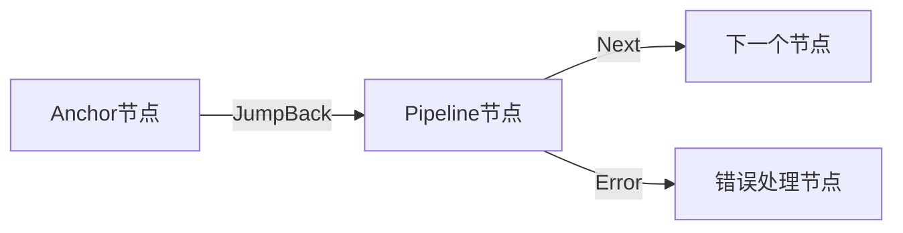
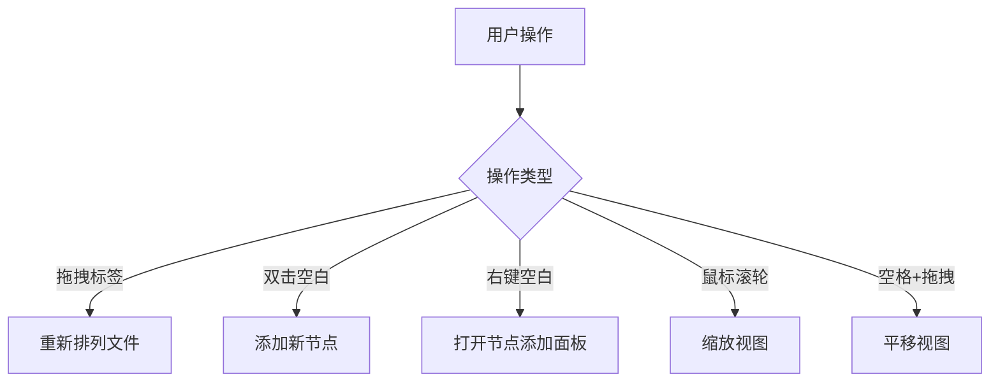

# 核心概念

<cite>
**本文档引用的文件**
- [NodeTypeEnum](file://src/components/flow/nodes/constants.ts#L9-L13)
- [EdgeType](file://src/stores/flow/types.ts#L26-L36)
- [PipelineNodeType](file://src/stores/flow/types.ts#L132-L143)
- [ExternalNodeType](file://src/stores/flow/types.ts#L146-L157)
- [AnchorNodeType](file://src/stores/flow/types.ts#L160-L171)
- [FieldPanel.tsx](file://src/components/panels/FieldPanel.tsx)
- [FilePanel.tsx](file://src/components/panels/FilePanel.tsx)
- [ToolPanel.tsx](file://src/components/panels/ToolPanel.tsx)
- [Flow.tsx](file://src/components/Flow.tsx)
- [viewSlice.ts](file://src/stores/flow/slices/viewSlice.ts)
- [importer.ts](file://src/core/parser/importer.ts)
- [exporter.ts](file://src/core/parser/exporter.ts)
- [edges.tsx](file://src/components/flow/edges.tsx)
- [layout.ts](file://src/core/layout.ts)
- [graphSlice.ts](file://src/stores/flow/slices/graphSlice.ts)
- [EdgePanel.tsx](file://src/components/panels/EdgePanel.tsx)
</cite>

## 更新摘要
**已做更改**
- 在“字段面板”和“连接”章节中新增了关于删除按钮功能的说明
- 更新了“字段面板”和“连接”部分的源文件引用，以包含 `FieldPanel.tsx` 和 `EdgePanel.tsx`
- 补充了节点与连接删除操作的交互细节

## 目录
1. [节点](#节点)
2. [连接](#连接)
3. [字段面板](#字段面板)
4. [文件与视口](#文件与视口)
5. [工具](#工具)
6. [Pipeline面板](#pipeline面板)

## 节点

MaaPipelineEditor中的节点是流程图的基本构建单元，代表了自动化流程中的一个执行步骤。根据功能和语义的不同，节点被分为三种类型：Pipeline节点、External节点和Anchor节点。这些类型在代码中通过`NodeTypeEnum`枚举进行定义。

### Pipeline节点

Pipeline节点是执行核心逻辑的节点，它包含了识别（recognition）和动作（action）两大核心功能。每个Pipeline节点都包含一个标签（label），用于在流程图中标识该节点。在数据模型中，Pipeline节点由`PipelineNodeType`接口定义，其`data`属性包含`recognition`和`action`对象，分别用于配置识别算法和执行动作。识别部分定义了如何在屏幕上查找目标，而动作部分则定义了找到目标后要执行的操作。

### External节点

External节点代表对外部流程的调用。它不包含复杂的识别和动作配置，其主要作用是引用另一个Pipeline文件中的节点。在数据模型中，External节点由`ExternalNodeType`接口定义，其`data`属性仅包含一个`label`字段。当流程执行到External节点时，会跳转到指定的外部Pipeline文件并执行其中的流程。

### Anchor节点

Anchor节点是一种流程锚点，用于实现流程的重定向。它不执行任何实际操作，而是作为一个跳转目标，使流程可以跳转到该节点。在数据模型中，Anchor节点由`AnchorNodeType`接口定义，其`data`属性也仅包含一个`label`字段。Anchor节点在编译时会自动添加`[Anchor]`前缀，以区别于其他类型的节点。

**Section sources**
- [constants.ts](file://src/components/flow/nodes/constants.ts#L9-L13)
- [types.ts](file://src/stores/flow/types.ts#L132-L171)

## 连接

连接（Edge）在MaaPipelineEditor中表示控制流与数据流，定义了节点之间的执行顺序和状态转移。连接在状态机中具有重要意义，它决定了流程的走向。连接由`EdgeType`接口定义，包含`source`（源节点ID）、`target`（目标节点ID）、`sourceHandle`（源句柄类型）等属性。

连接的`sourceHandle`属性使用`SourceHandleTypeEnum`枚举来区分不同的控制流类型：
- **Next**: 表示正常执行的下一个节点，通常用绿色线条表示。
- **Error**: 表示发生错误时的跳转节点，通常用红色线条表示。
- **JumpBack**: 表示跳回之前的节点，通常用蓝色线条表示。

在视觉表现上，连接的样式根据其类型而变化，通过CSS类`edge-next`、`edge-error`和`edge-jumpback`来实现不同的颜色和样式。连接还可以包含标签（label），用于显示连接的序号，帮助用户理解复杂的流程逻辑。

### 删除连接功能

从最新版本开始，用户可以在选中单条连接后，在右侧“连接设置”面板中看到一个红色垃圾桶图标。点击该图标即可直接删除当前选中的连接。此功能通过`EdgePanel.tsx`中的`handleDelete`回调函数实现，调用`updateEdges`方法将删除指令提交至状态管理器。该操作支持撤销（Ctrl+Z），确保误删可恢复。

**Diagram sources**
- [edges.tsx](file://src/components/flow/edges.tsx)
- [types.ts](file://src/stores/flow/types.ts#L26-L36)

**Section sources**
- [edges.tsx](file://src/components/flow/edges.tsx)
- [types.ts](file://src/stores/flow/types.ts#L26-L36)
- [EdgePanel.tsx](file://src/components/panels/EdgePanel.tsx)

## 字段面板

字段面板是MaaPipelineEditor中用于动态呈现和配置节点参数的核心组件。当用户选中一个节点时，字段面板会根据节点类型动态显示相应的配置选项。面板的实现位于`FieldPanel.tsx`文件中，它通过React的`useMemo`和`useCallback`钩子来优化渲染性能。

字段面板支持三类主要参数的配置：
1. **识别参数**：配置节点的识别算法，如模板匹配、OCR等。
2. **动作参数**：配置节点执行的动作，如点击、滑动、输入文本等。
3. **其他参数**：配置节点的通用行为，如超时时间、延迟、是否启用等。

对于Pipeline节点，字段面板提供了一个结构化的界面，允许用户选择识别算法和动作类型，并为每种类型配置具体的参数。用户可以通过“添加字段”按钮来添加新的参数配置。对于External节点和Anchor节点，字段面板则简化为仅编辑节点名称。

字段面板还集成了一个工具栏，提供复制节点名等功能，方便用户在不同上下文中使用节点标识。

### 删除节点功能

在字段面板的右上角新增了一个红色垃圾桶图标，当用户选中某个节点时，该图标将变为可点击状态。点击后会触发删除操作，调用`updateNodes`方法从流程图中移除该节点及其所有相关连接。该功能在`FieldPanel.tsx`中通过`handleDelete`回调函数实现，并已集成至状态管理系统，支持撤销与重做操作。此设计提升了编辑效率，使用户无需右键菜单即可快速删除节点。

**Section sources**
- [FieldPanel.tsx](file://src/components/panels/FieldPanel.tsx)

## 文件与视口

文件与视口管理机制是MaaPipelineEditor中处理用户工作流和视图交互的核心部分。

### 文件管理

文件管理功能允许用户创建、打开、保存和切换多个Pipeline文件。文件面板（`FilePanel.tsx`）提供了标签页式的界面，用户可以通过拖拽来重新排列文件标签，通过点击“+”按钮来创建新文件，或通过点击“x”按钮来关闭文件。文件名在保存时会作为JSON/JSONC文件的名称。

文件的导入导出功能由`importer.ts`和`exporter.ts`模块处理。导入时，系统会解析JSON/JSONC格式的Pipeline配置，并将其转换为内部的节点和连接数据结构。导出时，系统会将当前流程图转换为标准的Pipeline配置格式，并可以包含配置元数据。

### 视口控制

视口控制允许用户通过缩放和平移来浏览大型流程图。视口状态由`viewSlice.ts`中的`FlowViewState`定义，包含`viewport`（视口坐标和缩放级别）和`size`（画布尺寸）等属性。用户可以通过鼠标滚轮进行缩放，通过按住空格键并拖动鼠标进行平移。控制组件（Controls）提供了缩放按钮和重置视图的功能。

**Diagram sources**
- [FilePanel.tsx](file://src/components/panels/FilePanel.tsx)
- [Flow.tsx](file://src/components/Flow.tsx)
- [viewSlice.ts](file://src/stores/flow/slices/viewSlice.ts)

**Section sources**
- [FilePanel.tsx](file://src/components/panels/FilePanel.tsx)
- [Flow.tsx](file://src/components/Flow.tsx)
- [viewSlice.ts](file://src/stores/flow/slices/viewSlice.ts)

## 工具

工具栏提供了多种辅助功能，以提高用户的编辑效率和体验。工具栏由`ToolPanel.tsx`实现，分为添加、全局和布局三个部分。

### 添加工具

添加工具提供了一组预设的节点模板，用户可以通过点击相应的图标来快速添加常用类型的节点，如图像识别、OCR、点击动作等。这些模板定义在`nodeTemplates.ts`文件中，包含了节点的图标、标签和默认配置。

### 全局工具

全局工具提供了以下功能：
- **设置**：打开配置面板，调整编辑器的各种设置。
- **AI对话历史**：查看与AI助手的交互历史。
- **复制/粘贴**：支持节点的复制和粘贴操作，便于复用流程片段。
- **撤销/重做**：提供无限层级的撤销和重做功能，基于`historySlice.ts`中的历史状态管理。

### 布局工具

布局工具提供了以下功能：
- **对齐**：支持居中对齐、顶部对齐、底部对齐等，帮助用户整齐排列多个节点。
- **自动布局**：一键将所有节点按照合理的布局算法排列，避免手动调整。
- **节点间距缩放**：通过“增加水平间距”、“缩减水平间距”、“增加垂直间距”和“缩减垂直间距”工具，可以按比例调整选中节点之间的相对间距。该功能基于`shiftNodes`方法实现，根据节点与基准点的距离按比例移动，保持相对布局关系。
- **保存为图片**：将当前流程图导出为PNG图片，便于分享和文档化。

**Section sources**
- [ToolPanel.tsx](file://src/components/panels/ToolPanel.tsx)
- [layout.ts](file://src/core/layout.ts)
- [graphSlice.ts](file://src/stores/flow/slices/graphSlice.ts)

## Pipeline面板

Pipeline面板提供了全局流程信息与编译结果预览。它显示了当前流程的概要信息，包括节点数量、连接数量、编译状态等。用户可以通过该面板预览编译后的Pipeline配置，检查是否存在配置错误或逻辑问题。

在代码层面，Pipeline面板与`flowToPipeline`函数紧密集成，该函数负责将内部的节点和连接数据结构转换为标准的Pipeline配置格式。面板会实时反映流程图的当前状态，并在用户进行修改时更新预览内容。

Pipeline面板还可能集成编译器的输出信息，显示警告或错误，帮助用户及时发现和修复问题。它是连接可视化编辑器与底层配置文件的桥梁，确保用户所见即所得。

**Section sources**
- [exporter.ts](file://src/core/parser/exporter.ts)