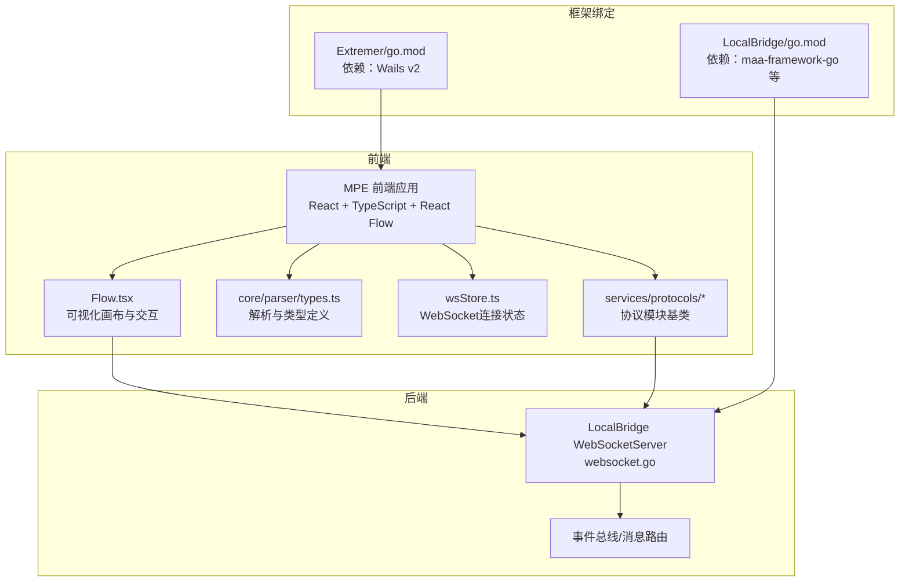
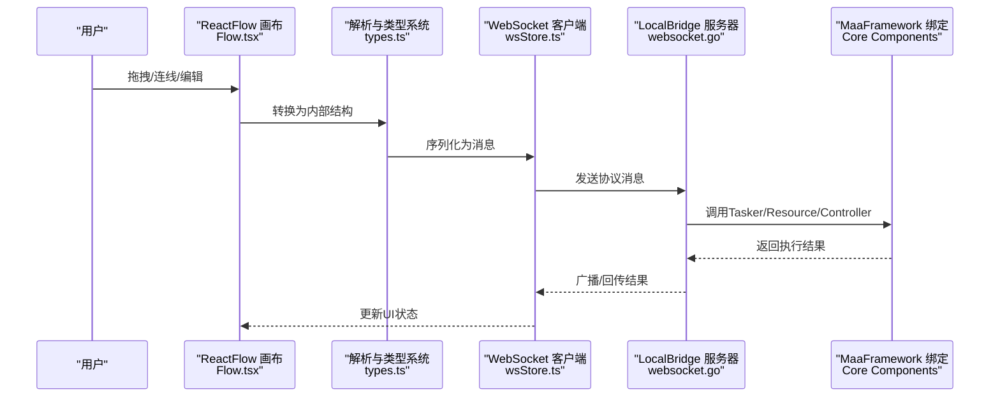
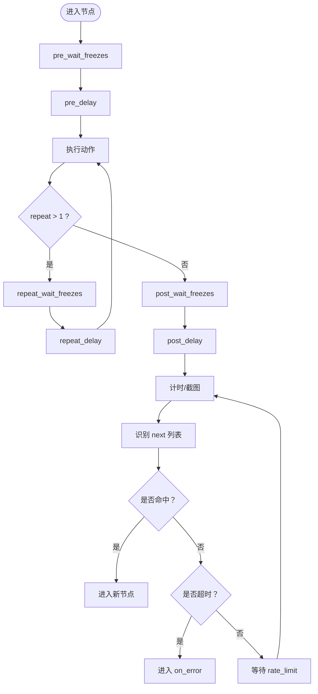
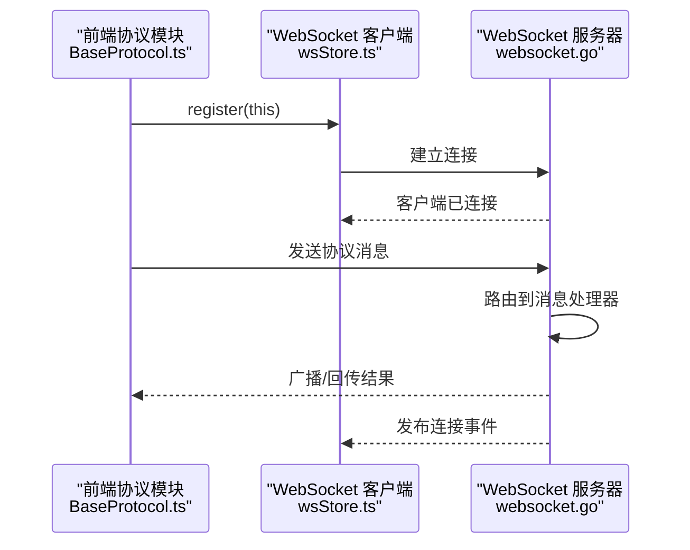
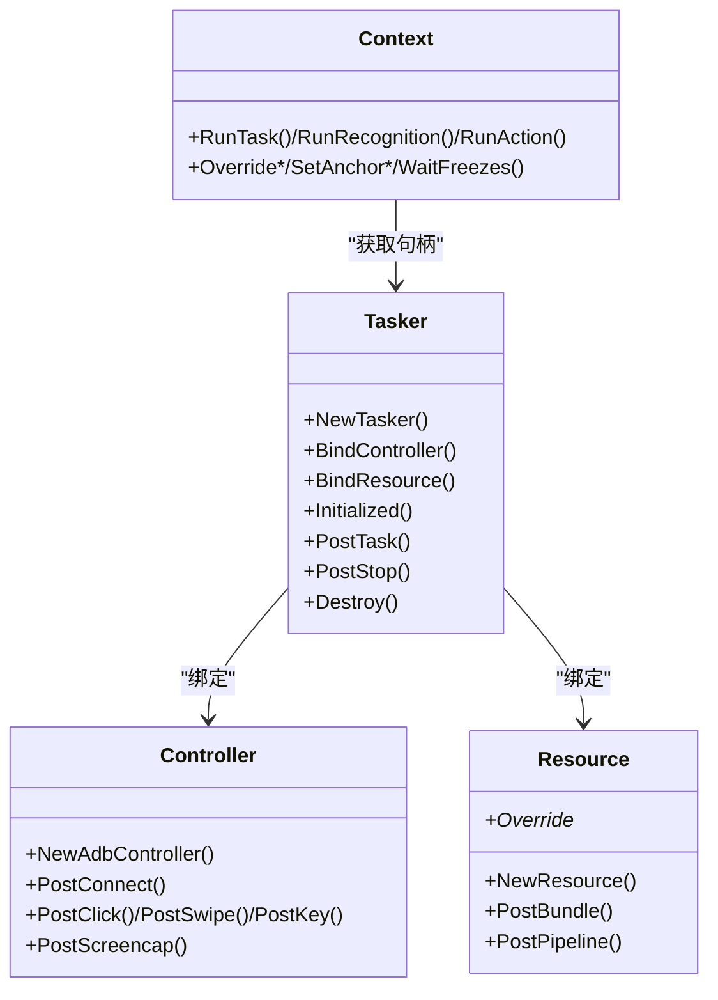
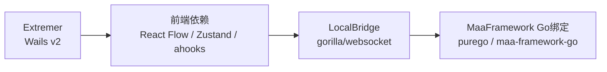

# 核心概念

<cite>
**本文引用的文件**
- [README.md](file://README.md)
- [3.1-PipelineProtocol.md](file://dev/instructions/maafw-guide/3.1-PipelineProtocol.md)
- [1.2-ExplanationOfTerms.md](file://dev/instructions/maafw-guide/1.2-ExplanationOfTerms.md)
- [Pipeline and Nodes.md](file://dev/instructions/maafw-golang-binding/Pipeline and Nodes.md)
- [Core Components.md](file://dev/instructions/maafw-golang-binding/Core Components.md)
- [types.ts](file://src/core/parser/types.ts)
- [websocket.go](file://LocalBridge/internal/server/websocket.go)
- [BaseProtocol.ts](file://src/services/protocols/BaseProtocol.ts)
- [wsStore.ts](file://src/stores/wsStore.ts)
- [Flow.tsx](file://src/components/Flow.tsx)
- [go.mod（LocalBridge）](file://LocalBridge/go.mod)
- [go.mod（Extremer）](file://Extremer/go.mod)
</cite>

## 目录
1. [简介](#简介)
2. [项目结构](#项目结构)
3. [核心组件](#核心组件)
4. [架构总览](#架构总览)
5. [详细组件分析](#详细组件分析)
6. [依赖分析](#依赖分析)
7. [性能考虑](#性能考虑)
8. [故障排查指南](#故障排查指南)
9. [结论](#结论)
10. [附录](#附录)

## 简介
本文件面向MaaPipelineEditor（MPE）的核心概念与基础架构，系统性阐述以下主题：
- MaaFramework基础概念与Pipeline工作流原理
- Pipeline格式结构、字段语义与版本演进
- React Flow在可视化编辑中的应用原理与交互模式
- WebSocket通信机制与消息协议设计
- 可视化编辑器的交互模式与用户体验设计理念
- MaaFramework Go绑定的使用方法与集成要点
- 实际代码示例与最佳实践指导

## 项目结构
MPE采用前后端分离架构，前端以React + TypeScript + React Flow为核心，后端通过LocalBridge提供本地能力扩展与WebSocket桥接；同时提供Extremer作为桌面端打包方案。

```mermaid
graph TB
subgraph "前端"
FE_App["MPE 前端应用<br/>React + TypeScript + React Flow"]
FE_Flow["Flow.tsx<br/>可视化画布与交互"]
FE_Parser["core/parser/types.ts<br/>解析与类型定义"]
FE_WS["wsStore.ts<br/>WebSocket连接状态"]
FE_Protocols["services/protocols/*<br/>协议模块基类"]
end
subgraph "后端"
LB_Server["LocalBridge WebSocketServer<br/>websocket.go"]
LB_Event["事件总线/消息路由"]
end
subgraph "框架绑定"
GoModLB["LocalBridge/go.mod<br/>依赖：maa-framework-go 等"]
GoModExt["Extremer/go.mod<br/>依赖：Wails v2"]
end
FE_App --> FE_Flow
FE_App --> FE_Parser
FE_App --> FE_WS
FE_App --> FE_Protocols
FE_Flow --> LB_Server
FE_Protocols --> LB_Server
LB_Server --> LB_Event
GoModLB --> LB_Server
GoModExt --> FE_App
```

图表来源
- [Flow.tsx:235-709](file://src/components/Flow.tsx#L235-L709)
- [websocket.go:35-93](file://LocalBridge/internal/server/websocket.go#L35-L93)
- [types.ts:24-113](file://src/core/parser/types.ts#L24-L113)
- [wsStore.ts:1-24](file://src/stores/wsStore.ts#L1-L24)
- [BaseProtocol.ts:1-40](file://src/services/protocols/BaseProtocol.ts#L1-L40)
- [go.mod（LocalBridge）:1-38](file://LocalBridge/go.mod#L1-L38)
- [go.mod（Extremer）:1-39](file://Extremer/go.mod#L1-L39)

章节来源
- [README.md:31-161](file://README.md#L31-L161)
- [go.mod（LocalBridge）:1-38](file://LocalBridge/go.mod#L1-L38)
- [go.mod（Extremer）:1-39](file://Extremer/go.mod#L1-L39)

## 核心组件
- MaaFramework核心组件（Go绑定）
  - Tasker：任务执行器，协调识别与动作
  - Controller：设备接口，负责输入注入与截图
  - Resource：资源容器，加载Pipeline与资产
  - Context：回调上下文，提供同步执行能力
- 前端可视化组件
  - React Flow画布：节点、边、连接、对齐与分组
  - 解析与类型系统：统一Pipeline结构与字段类型
  - WebSocket协议层：协议抽象与消息路由
  - 连接状态管理：前端连接生命周期

章节来源
- [Core Components.md:16-112](file://dev/instructions/maafw-golang-binding/Core Components.md#L16-L112)
- [Pipeline and Nodes.md:48-106](file://dev/instructions/maafw-golang-binding/Pipeline and Nodes.md#L48-L106)
- [Flow.tsx:235-709](file://src/components/Flow.tsx#L235-L709)
- [types.ts:24-113](file://src/core/parser/types.ts#L24-L113)
- [BaseProtocol.ts:1-40](file://src/services/protocols/BaseProtocol.ts#L1-L40)
- [wsStore.ts:1-24](file://src/stores/wsStore.ts#L1-L24)

## 架构总览
MPE的可视化编辑器通过React Flow提供节点拖拽、连线与属性编辑；当用户进行编辑时，前端将Pipeline结构转换为MaaFramework期望的JSON，并通过WebSocket发送至LocalBridge；LocalBridge根据协议路由消息，驱动MaaFramework执行任务或返回结果。

```mermaid
sequenceDiagram
participant U as "用户"
participant RF as "ReactFlow 画布<br/>Flow.tsx"
participant Parser as "解析与类型系统<br/>types.ts"
participant WS as "WebSocket 客户端<br/>wsStore.ts"
participant LB as "LocalBridge 服务器<br/>websocket.go"
participant FW as "MaaFramework 绑定<br/>Core Components"
U->>RF : 拖拽/连线/编辑
RF->>Parser : 转换为内部结构
Parser->>WS : 序列化为消息
WS->>LB : 发送协议消息
LB->>FW : 调用Tasker/Resource/Controller
FW-->>LB : 返回执行结果
LB-->>WS : 广播/回传结果
WS-->>RF : 更新UI状态
```

图表来源
- [Flow.tsx:300-424](file://src/components/Flow.tsx#L300-L424)
- [types.ts:24-113](file://src/core/parser/types.ts#L24-L113)
- [wsStore.ts:7-23](file://src/stores/wsStore.ts#L7-L23)
- [websocket.go:144-161](file://LocalBridge/internal/server/websocket.go#L144-L161)
- [Core Components.md:197-311](file://dev/instructions/maafw-golang-binding/Core Components.md#L197-L311)

## 详细组件分析

### MaaFramework基础概念与Pipeline工作流
- 基本术语
  - Node：符合Pipeline协议的完整JSON对象
  - Task：若干Node按顺序连接的逻辑序列
  - Entry：Task中的首个Node
  - Pipeline：pipeline目录下的全部Node集合
  - Bundle：标准资源结构（含pipeline、model、image等）
  - Resource：多个Bundle按序加载的资源集合
- Pipeline协议（v1/v2）
  - v1：根对象直接包含识别、动作、next/on_error等字段
  - v2：识别与动作参数分别置于recognition.param与action.param
  - 默认值：default_pipeline.json提供默认参数，支持字典合并与继承优先级
- 执行逻辑
  - 任务触发：通过tasker.post_task指定入口节点
  - 顺序检测：依次尝试next列表，命中后中断后续检测
  - 成功/失败分支：成功进入子节点next，失败进入on_error
  - 终止条件：next为空、超时、外部停止或节点自身结束
- 字段与语义
  - ROI/box/target：识别区域、匹配框、动作目标区域
  - 时间与等待：rate_limit、timeout、pre/post_delay、wait_freezes
  - 流控：enabled、max_hit、repeat/repeat_delay、anchor、inverse
  - 通知：focus用于附加回调消息

```mermaid
flowchart TD
Start(["进入节点"]) --> PreFreeze["pre_wait_freezes"]
PreFreeze --> PreDelay["pre_delay"]
PreDelay --> Action["执行动作"]
Action --> Repeat{"repeat > 1 ?"}
Repeat --> |是| RepFreeze["repeat_wait_freezes"]
RepFreeze --> RepDelay["repeat_delay"]
RepDelay --> Action
Repeat --> |否| PostFreeze["post_wait_freezes"]
PostFreeze --> PostDelay["post_delay"]
PostDelay --> Timer["计时/截图"]
Timer --> Recognize["识别 next 列表"]
Recognize --> Hit{"是否命中？"}
Hit --> |是| Enter["进入新节点"]
Hit --> |否| Timeout{"是否超时？"}
Timeout --> |是| OnError["进入 on_error"]
Timeout --> |否| RateLimit["等待 rate_limit"]
RateLimit --> Timer
```

图表来源
- [3.1-PipelineProtocol.md:22-48](file://dev/instructions/maafw-guide/3.1-PipelineProtocol.md#L22-L48)
- [3.1-PipelineProtocol.md:264-286](file://dev/instructions/maafw-guide/3.1-PipelineProtocol.md#L264-L286)

章节来源
- [1.2-ExplanationOfTerms.md:1-43](file://dev/instructions/maafw-guide/1.2-ExplanationOfTerms.md#L1-L43)
- [3.1-PipelineProtocol.md:130-451](file://dev/instructions/maafw-guide/3.1-PipelineProtocol.md#L130-L451)

### React Flow在可视化编辑中的应用原理
- 节点与边
  - 节点类型：Pipeline节点、外部节点、锚点、贴纸、分组等
  - 边类型：next与error两类边，支持中点连接与属性编辑
- 交互模式
  - 拖拽与磁吸：拖拽节点时计算对齐参考线，释放时自动吸附
  - 分组嵌套：拖入分组节点时自动加入父节点，拖出边界时脱离
  - 快捷创建：在空白处双击或右键打开节点添加面板
  - 选区与右键菜单：支持批量操作与上下文菜单
- 状态与持久化
  - 视口状态：记录zoom与偏移，离开页面再进入保持一致
  - 本地存储：基于防抖的增量保存策略

```mermaid
classDiagram
class FlowCanvas {
+nodes : NodeType[]
+edges : EdgeType[]
+onNodesChange()
+onEdgesChange()
+onConnect()
+onNodeDrag()
+onNodeDragStop()
}
class NodeType {
+id : string
+type : string
+position : {x,y}
+data : any
}
class EdgeType {
+id : string
+source : string
+target : string
+type : "next"|"error"
}
FlowCanvas --> NodeType : "管理"
FlowCanvas --> EdgeType : "管理"
```

图表来源
- [Flow.tsx:235-709](file://src/components/Flow.tsx#L235-L709)
- [types.ts:24-113](file://src/core/parser/types.ts#L24-L113)

章节来源
- [Flow.tsx:235-709](file://src/components/Flow.tsx#L235-L709)
- [types.ts:24-113](file://src/core/parser/types.ts#L24-L113)

### WebSocket通信机制与消息协议设计
- 服务器
  - 升级HTTP为WebSocket，维护连接注册/注销与广播
  - 提供版本握手路由与在线服务地址生成
- 客户端
  - 协议模块基类：定义getName/getVersion/register/unregister及消息入口
  - 连接状态：connected/connecting状态管理
- 协议路由
  - 消息处理器接收消息并分派到具体协议模块
  - 事件总线发布连接建立/关闭事件

```mermaid
sequenceDiagram
participant FE as "前端协议模块<br/>BaseProtocol.ts"
participant WS as "WebSocket 客户端<br/>wsStore.ts"
participant SV as "WebSocket 服务器<br/>websocket.go"
FE->>WS : register(this)
WS->>SV : 建立连接
SV-->>WS : 客户端已连接
FE->>SV : 发送协议消息
SV->>SV : 路由到消息处理器
SV-->>FE : 广播/回传结果
SV-->>WS : 发布连接事件
```

图表来源
- [BaseProtocol.ts:1-40](file://src/services/protocols/BaseProtocol.ts#L1-L40)
- [wsStore.ts:1-24](file://src/stores/wsStore.ts#L1-L24)
- [websocket.go:35-93](file://LocalBridge/internal/server/websocket.go#L35-L93)
- [websocket.go:144-161](file://LocalBridge/internal/server/websocket.go#L144-L161)

章节来源
- [websocket.go:1-179](file://LocalBridge/internal/server/websocket.go#L1-L179)
- [BaseProtocol.ts:1-40](file://src/services/protocols/BaseProtocol.ts#L1-L40)
- [wsStore.ts:1-24](file://src/stores/wsStore.ts#L1-L24)

### 可视化编辑器的交互模式与用户体验设计理念
- 以“所见即所得”为核心，强调编辑体验与阅读体验并重
- 支持节点聚焦、关键路径高亮、中点连接、贴纸与分组等增强逻辑表达
- 提供快捷键与上下文菜单，降低认知负担
- 布局紧凑、逻辑清晰，复杂任务一目了然

章节来源
- [README.md:54-87](file://README.md#L54-L87)

### MaaFramework Go绑定的使用方法与集成要点
- 核心组件
  - Tasker：任务执行器，需绑定Controller与Resource后初始化
  - Controller：设备接口，支持ADB/Win32/macOS/Linux等平台
  - Resource：资源容器，支持bundle加载、pipeline覆盖与模型注册
  - Context：回调上下文，提供同步执行与状态访问
- Pipeline与Node
  - 通过Go类型构建Pipeline与Node，最终MarshalJSON为MaaFramework消费的结构
  - 支持NextItem属性（jump_back/anchor）与锚点映射
- 生命周期
  - 构建 → 配置（异步作业）→ 绑定 → 使用 → 销毁
  - 注意：未调用Destroy会导致内存泄漏与回调注册残留

```mermaid
classDiagram
class Tasker {
+NewTasker()
+BindController()
+BindResource()
+Initialized()
+PostTask()
+PostStop()
+Destroy()
}
class Controller {
+NewAdbController()
+PostConnect()
+PostClick()/PostSwipe()/PostKey()
+PostScreencap()
}
class Resource {
+NewResource()
+PostBundle()
+PostPipeline()
+Override*
}
class Context {
+RunTask()/RunRecognition()/RunAction()
+Override*/SetAnchor*/WaitFreezes()
}
Tasker --> Controller : "绑定"
Tasker --> Resource : "绑定"
Context --> Tasker : "获取句柄"
```

图表来源
- [Core Components.md:197-446](file://dev/instructions/maafw-golang-binding/Core Components.md#L197-L446)
- [Pipeline and Nodes.md:48-106](file://dev/instructions/maafw-golang-binding/Pipeline and Nodes.md#L48-L106)

章节来源
- [Core Components.md:1-529](file://dev/instructions/maafw-golang-binding/Core Components.md#L1-L529)
- [Pipeline and Nodes.md:1-386](file://dev/instructions/maafw-golang-binding/Pipeline and Nodes.md#L1-L386)

## 依赖分析
- 前端依赖
  - React Flow：提供节点、边、连接与交互能力
  - Zustand：状态管理（连接状态、文件配置等）
  - ahooks：防抖与快捷键钩子
- 后端依赖
  - gorilla/websocket：WebSocket协议
  - maa-framework-go：MaaFramework Go绑定
  - purego：FFI调用底层C++库
- 桌面端打包
  - Wails v2：将前端应用打包为桌面应用

```mermaid
graph LR
FE["前端依赖<br/>React Flow / Zustand / ahooks"] --> LB["LocalBridge<br/>gorilla/websocket"]
LB --> FW["MaaFramework Go绑定<br/>purego / maa-framework-go"]
Ext["Extremer<br/>Wails v2"] --> FE
```

图表来源
- [go.mod（LocalBridge）:5-16](file://LocalBridge/go.mod#L5-L16)
- [go.mod（Extremer）:6-8](file://Extremer/go.mod#L6-L8)

章节来源
- [go.mod（LocalBridge）:1-38](file://LocalBridge/go.mod#L1-L38)
- [go.mod（Extremer）:1-39](file://Extremer/go.mod#L1-L39)

## 性能考虑
- 识别节流与等待
  - rate_limit限制每轮识别最小间隔，避免频繁截图
  - pre/post_wait_freezes等待屏幕稳定，减少误判
- 重复执行
  - repeat/repeat_delay/repeat_wait_freezes支持多次执行与稳定等待
- 磁吸与布局
  - 拖拽时仅在视口范围内计算对齐，减少不必要的计算
- 序列化与传输
  - 前端采用防抖保存与增量持久化，降低I/O压力
  - WebSocket消息按协议路由，避免冗余广播

## 故障排查指南
- 连接问题
  - 检查WebSocket服务器是否启动与端口占用
  - 确认协议模块已正确注册并处理消息
- 执行异常
  - 确认Tasker已完成BindController与BindResource
  - 检查Resource是否成功加载bundle且节点可用
- 识别不稳定
  - 调整pre/post_wait_freezes与rate_limit
  - 使用ROI/目标偏移精确定位
- 性能瓶颈
  - 减少重复截图与过度识别
  - 合理设置repeat与delay，避免阻塞

章节来源
- [websocket.go:66-93](file://LocalBridge/internal/server/websocket.go#L66-L93)
- [Core Components.md:115-194](file://dev/instructions/maafw-golang-binding/Core Components.md#L115-L194)

## 结论
MPE以React Flow提供直观的可视化编辑体验，结合LocalBridge与MaaFramework Go绑定，实现了从图形化编辑到自动化执行的完整闭环。通过明确的Pipeline协议、协议化的消息通信与稳健的组件生命周期，MPE在易用性与可扩展性之间取得平衡，适合资源开发者高效构建与调试自动化流程。

## 附录
- 最佳实践
  - 使用默认值文件集中管理通用参数，降低重复配置
  - 合理划分Bundle，隔离不同环境的配置
  - 利用锚点与跳转回机制组织复杂流程
  - 在前端使用防抖与增量保存，提升编辑流畅度
- 示例路径
  - Pipeline与Node类型定义与序列化：[Pipeline and Nodes.md:48-106](file://dev/instructions/maafw-golang-binding/Pipeline and Nodes.md#L48-L106)
  - 任务执行与组件生命周期：[Core Components.md:197-311](file://dev/instructions/maafw-golang-binding/Core Components.md#L197-L311)
  - 画布交互与节点操作：[Flow.tsx:300-424](file://src/components/Flow.tsx#L300-L424)
  - WebSocket协议与消息路由：[websocket.go:144-161](file://LocalBridge/internal/server/websocket.go#L144-L161)