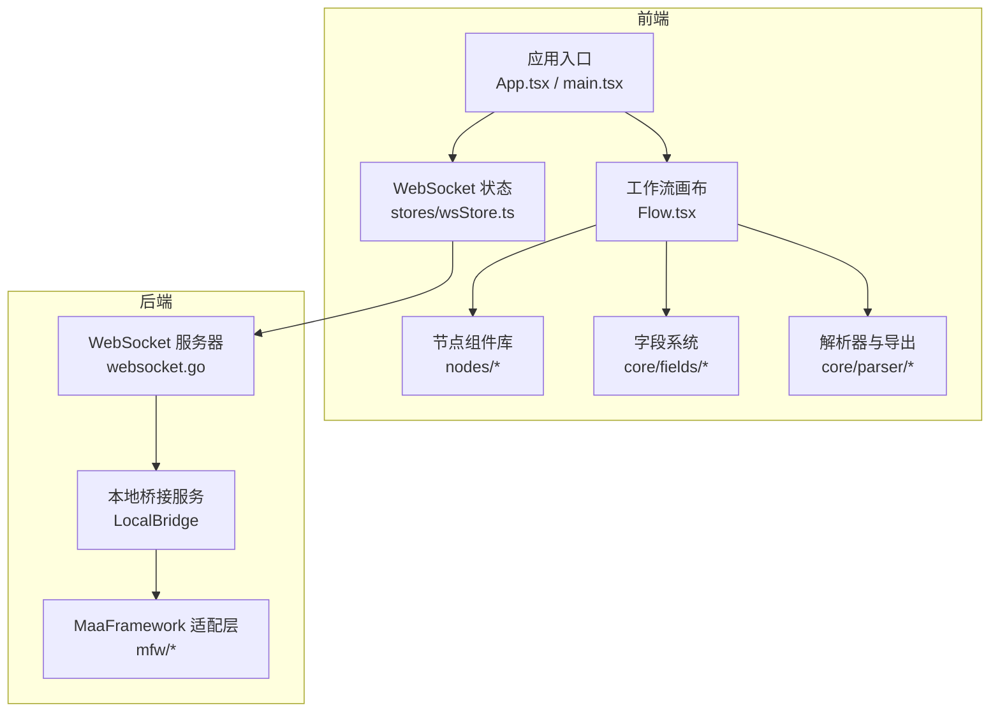
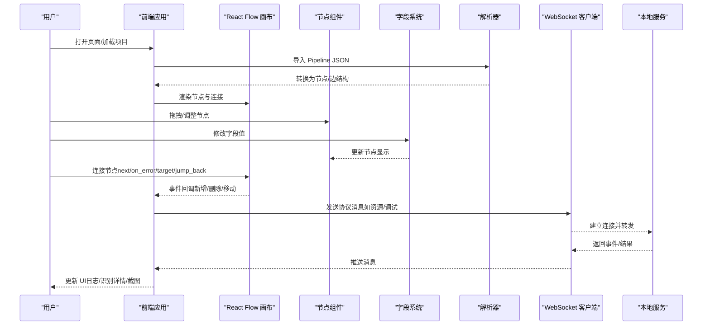
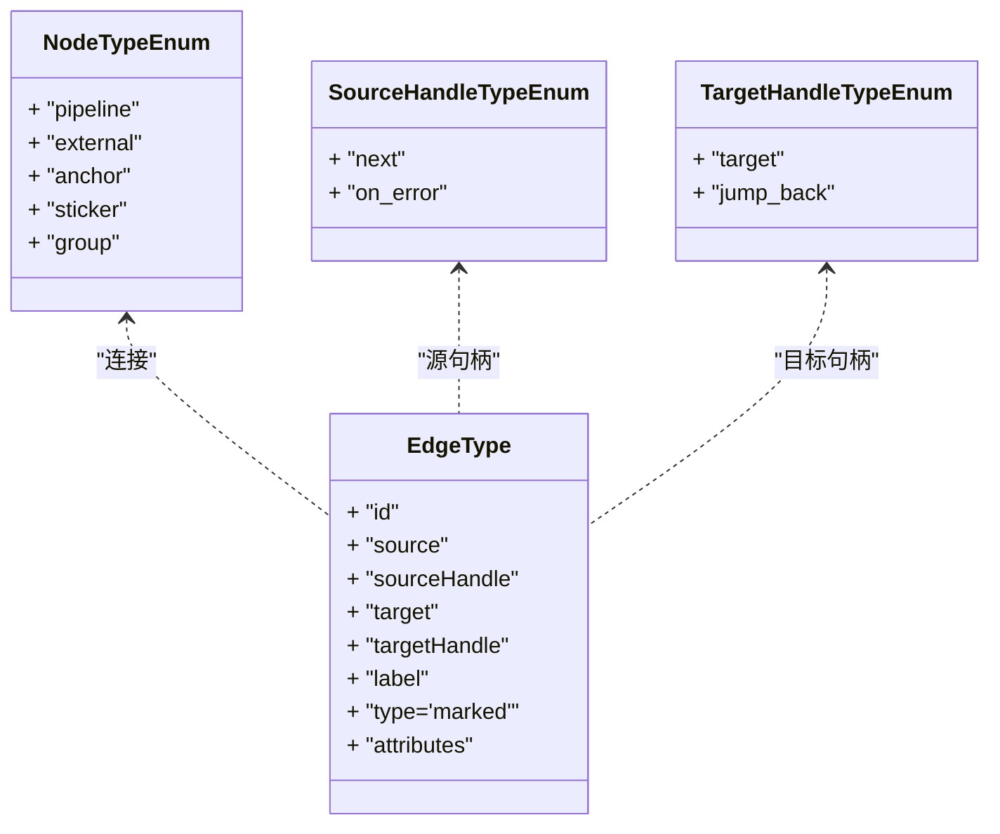
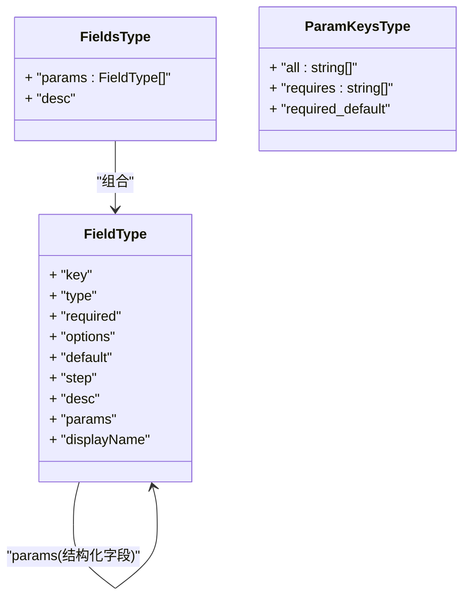
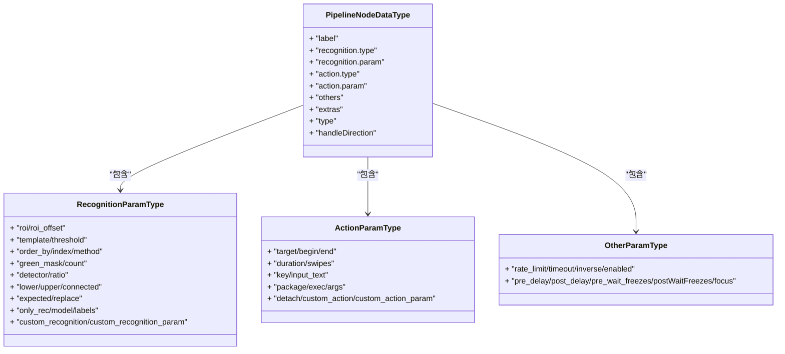
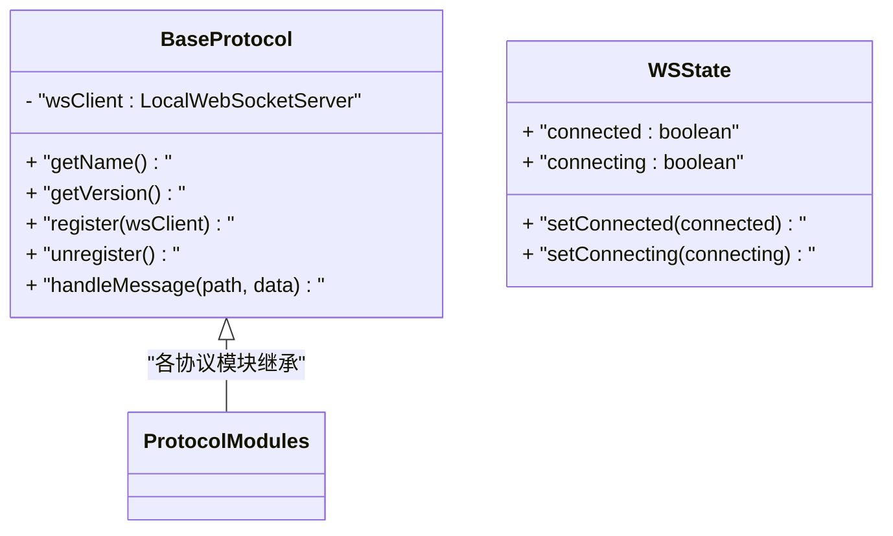
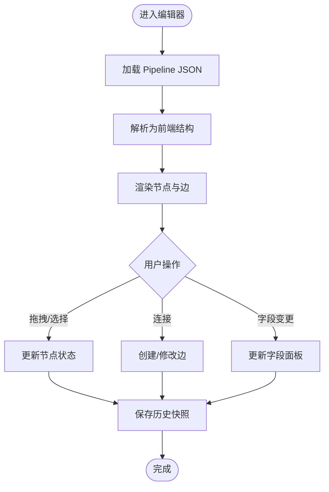
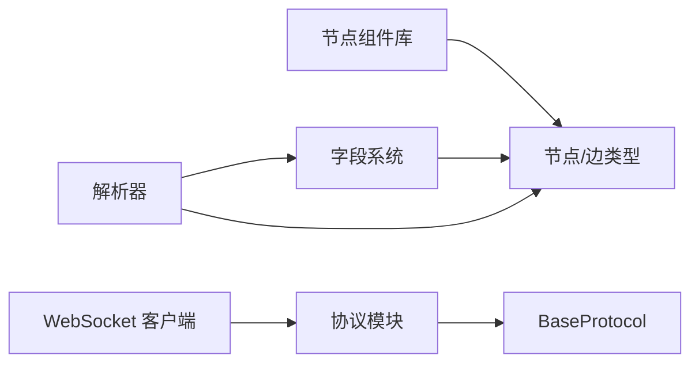

# 核心概念

<cite>
**本文引用的文件**
- [README.md](file://README.md)
- [src/core/parser/types.ts](file://src/core/parser/types.ts)
- [src/stores/flow/types.ts](file://src/stores/flow/types.ts)
- [src/components/flow/nodes/constants.ts](file://src/components/flow/nodes/constants.ts)
- [src/components/flow/nodes/index.ts](file://src/components/flow/nodes/index.ts)
- [src/core/fields/types.ts](file://src/core/fields/types.ts)
- [src/core/fields/fieldTypes.ts](file://src/core/fields/fieldTypes.ts)
- [src/core/fields/index.ts](file://src/core/fields/index.ts)
- [src/services/protocols/BaseProtocol.ts](file://src/services/protocols/BaseProtocol.ts)
- [src/services/protocols/index.ts](file://src/services/protocols/index.ts)
- [src/stores/wsStore.ts](file://src/stores/wsStore.ts)
</cite>

## 目录
1. [简介](#简介)
2. [项目结构](#项目结构)
3. [核心组件](#核心组件)
4. [架构总览](#架构总览)
5. [详细组件分析](#详细组件分析)
6. [依赖分析](#依赖分析)
7. [性能考虑](#性能考虑)
8. [故障排查指南](#故障排查指南)
9. [结论](#结论)
10. [附录](#附录)

## 简介
本文件面向初学者与开发者，系统阐述 MaaPipelineEditor（MPE）的核心概念与实现要点，涵盖：
- MaaFramework Pipeline 协议基础：节点类型、字段系统、连接机制
- 工作流编辑器设计：React Flow 集成、节点渲染、拖拽交互、连接系统
- 字段配置体系：识别字段、动作字段、其他参数的定义与使用
- WebSocket 通信协议：消息格式、事件类型、错误处理
- 数据模型说明：NodeType、PipelineNodeDataType、BackendConfig 等关键结构

## 项目结构
MPE 采用前后端分离架构，前端基于 React + TypeScript + React Flow，后端以本地服务形式提供资源、设备、调试等能力，并通过 WebSocket 协议与前端通信。

```mermaid
graph TB
subgraph "前端"
FE_App["应用入口<br/>App.tsx / main.tsx"]
FE_Flow["工作流画布<br/>Flow.tsx"]
FE_Nodes["节点组件库<br/>nodes/*"]
FE_Fields["字段系统<br/>core/fields/*"]
FE_Parser["解析器与导出<br/>core/parser/*"]
FE_WS["WebSocket 状态<br/>stores/wsStore.ts"]
end
subgraph "后端"
LB_Server["本地桥接服务<br/>LocalBridge"]
LB_WS["WebSocket 服务器<br/>websocket.go"]
LB_MFW["MaaFramework 适配层<br/>mfw/*"]
end
FE_App --> FE_Flow
FE_Flow --> FE_Nodes
FE_Flow --> FE_Fields
FE_Flow --> FE_Parser
FE_App --> FE_WS
FE_WS --> LB_WS
LB_WS --> LB_Server
LB_Server --> LB_MFW
```

图表来源
- [src/components/flow/nodes/index.ts:1-26](file://src/components/flow/nodes/index.ts#L1-L26)
- [src/core/fields/index.ts:1-45](file://src/core/fields/index.ts#L1-L45)
- [src/core/parser/types.ts:1-107](file://src/core/parser/types.ts#L1-L107)
- [src/stores/wsStore.ts:1-24](file://src/stores/wsStore.ts#L1-L24)

章节来源
- [README.md:30-90](file://README.md#L30-L90)

## 核心组件
- 节点类型与句柄
  - 节点类型：Pipeline、External、Anchor、Sticker、Group
  - 源句柄：next、on_error；目标句柄：target、jump_back
  - 句柄方向：left-right、right-left、top-bottom、bottom-top
- 字段系统
  - 字段类型枚举：整数、浮点、布尔、字符串、列表、坐标、图片路径等
  - 字段集合：识别字段、动作字段、其他参数
- 数据模型
  - PipelineNodeDataType：包含识别、动作、其他三部分参数
  - EdgeType：带属性的边，支持跳转与锚点
- 解析与导出
  - 解析 Pipeline JSON 到前端节点/边结构
  - 导出时支持强制导出配置与外部节点
- WebSocket 通信
  - 协议基类与路由注册
  - 连接状态管理

章节来源
- [src/components/flow/nodes/constants.ts:1-47](file://src/components/flow/nodes/constants.ts#L1-L47)
- [src/core/fields/fieldTypes.ts:1-27](file://src/core/fields/fieldTypes.ts#L1-L27)
- [src/stores/flow/types.ts:108-122](file://src/stores/flow/types.ts#L108-L122)
- [src/stores/flow/types.ts:28-38](file://src/stores/flow/types.ts#L28-L38)
- [src/core/parser/types.ts:24-44](file://src/core/parser/types.ts#L24-L44)
- [src/services/protocols/BaseProtocol.ts:1-40](file://src/services/protocols/BaseProtocol.ts#L1-L40)
- [src/stores/wsStore.ts:1-24](file://src/stores/wsStore.ts#L1-L24)

## 架构总览
MPE 的工作流编辑器以 React Flow 为核心，节点渲染由组件库负责，字段面板根据节点类型动态生成识别/动作/其他参数表单。后端通过本地服务提供资源扫描、设备管理、MaaFramework 执行与调试能力，前端通过 WebSocket 与后端协议模块通信。

```mermaid
sequenceDiagram
participant U as "用户"
participant F as "前端应用"
participant R as "React Flow 画布"
participant N as "节点组件"
participant FS as "字段系统"
participant P as "解析器"
participant WS as "WebSocket 客户端"
participant S as "本地服务"
U->>F : 打开页面/加载项目
F->>P : 导入 Pipeline JSON
P-->>F : 转换为节点/边结构
F->>R : 渲染节点与连接
U->>N : 拖拽/调整节点
U->>FS : 修改字段值
FS-->>N : 更新节点显示
U->>R : 连接节点next/on_error/target/jump_back
R-->>F : 事件回调新增/删除/移动
F->>WS : 发送协议消息如资源/调试
WS-->>S : 建立连接并转发
S-->>WS : 返回事件/结果
WS-->>F : 推送消息
F-->>U : 更新 UI日志/识别详情/截图
```

图表来源
- [src/components/flow/nodes/index.ts:1-26](file://src/components/flow/nodes/index.ts#L1-L26)
- [src/core/fields/index.ts:1-45](file://src/core/fields/index.ts#L1-L45)
- [src/core/parser/types.ts:1-107](file://src/core/parser/types.ts#L1-L107)
- [src/stores/wsStore.ts:1-24](file://src/stores/wsStore.ts#L1-L24)

## 详细组件分析

### 节点类型与连接机制
- 节点类型
  - Pipeline：核心执行节点，包含识别、动作、其他参数
  - External：外部引用节点
  - Anchor：锚点重定向节点
  - Sticker：便签节点，支持颜色主题
  - Group：分组节点，支持颜色主题
- 句柄与连接
  - 源句柄：next（正常流转）、on_error（错误分支）
  - 目标句柄：target（常规输入）、jump_back（回跳）
  - 边属性：jump_back、anchor 等
- 句柄方向
  - 支持四向布局，便于复杂流程的视觉组织

```mermaid
classDiagram
class NodeTypeEnum {
+ "pipeline"
+ "external"
+ "anchor"
+ "sticker"
+ "group"
}
class SourceHandleTypeEnum {
+ "next"
+ "on_error"
}
class TargetHandleTypeEnum {
+ "target"
+ "jump_back"
}
class EdgeType {
+ "id"
+ "source"
+ "sourceHandle"
+ "target"
+ "targetHandle"
+ "label"
+ "type='marked'"
+ "attributes"
}
NodeTypeEnum <.. EdgeType : "连接"
SourceHandleTypeEnum <.. EdgeType : "源句柄"
TargetHandleTypeEnum <.. EdgeType : "目标句柄"
```

图表来源
- [src/components/flow/nodes/constants.ts:14-20](file://src/components/flow/nodes/constants.ts#L14-L20)
- [src/components/flow/nodes/constants.ts:2-5](file://src/components/flow/nodes/constants.ts#L2-L5)
- [src/components/flow/nodes/constants.ts:7-11](file://src/components/flow/nodes/constants.ts#L7-L11)
- [src/stores/flow/types.ts:28-38](file://src/stores/flow/types.ts#L28-L38)

章节来源
- [src/components/flow/nodes/constants.ts:1-47](file://src/components/flow/nodes/constants.ts#L1-L47)
- [src/stores/flow/types.ts:28-38](file://src/stores/flow/types.ts#L28-L38)

### 字段配置体系
- 字段类型
  - 基础类型：整数、浮点、布尔、字符串
  - 列表类型：整数/浮点/字符串列表、二维列表
  - 坐标类型：XYWH、位置列表
  - 图片路径：单个与列表
  - 其他：任意类型、对象列表、字符串或对象列表
- 字段集合
  - 识别字段：图像识别、OCR、模板匹配等参数
  - 动作字段：点击、滑动、输入、执行等参数
  - 其他参数：超时、限速、前置/后置延时、是否启用等
- 字段工厂与键生成
  - 通过工厂创建字段，生成参数键与大写映射，便于解析与校验

```mermaid
classDiagram
class FieldType {
+ "key"
+ "type"
+ "required"
+ "options"
+ "default"
+ "step"
+ "desc"
+ "params"
+ "displayName"
}
class FieldsType {
+ "params : FieldType[]"
+ "desc"
}
class ParamKeysType {
+ "all : string[]"
+ "requires : string[]"
+ "required_default"
}
FieldType --> FieldType : "params(结构化字段)"
FieldsType --> FieldType : "组合"
```

图表来源
- [src/core/fields/types.ts:6-16](file://src/core/fields/types.ts#L6-L16)
- [src/core/fields/types.ts:21-24](file://src/core/fields/types.ts#L21-L24)
- [src/core/fields/types.ts:29-33](file://src/core/fields/types.ts#L29-L33)

章节来源
- [src/core/fields/fieldTypes.ts:1-27](file://src/core/fields/fieldTypes.ts#L1-L27)
- [src/core/fields/types.ts:1-34](file://src/core/fields/types.ts#L1-L34)
- [src/core/fields/index.ts:1-45](file://src/core/fields/index.ts#L1-L45)

### 数据模型说明
- PipelineNodeDataType
  - 包含 label、识别类型与参数、动作类型与参数、others（其他参数）、extras、type、handleDirection
- RecognitionParamType / ActionParamType / OtherParamType
  - 识别参数：ROI、阈值、模板、排序、检测器、模型等
  - 动作参数：目标区域、持续时间、按键、输入文本、执行命令等
  - 其他参数：超时、限速、反转、启用、延时、冻结等待等
- EdgeAttributesType
  - jump_back：回跳标记
  - anchor：锚点标记
- 解析与导出类型
  - ParsedPipelineNodeType：解析后的节点结构
  - MpeConfigType：分离配置（文件名、版本、节点布局、外部/锚点/便签/分组节点）

```mermaid
classDiagram
class PipelineNodeDataType {
+ "label"
+ "recognition.type"
+ "recognition.param"
+ "action.type"
+ "action.param"
+ "others"
+ "extras"
+ "type"
+ "handleDirection"
}
class RecognitionParamType {
+ "roi/roi_offset"
+ "template/threshold"
+ "order_by/index/method"
+ "green_mask/count"
+ "detector/ratio"
+ "lower/upper/connected"
+ "expected/replace"
+ "only_rec/model/labels"
+ "custom_recognition/custom_recognition_param"
}
class ActionParamType {
+ "target/begin/end"
+ "duration/swipes"
+ "key/input_text"
+ "package/exec/args"
+ "detach/custom_action/custom_action_param"
}
class OtherParamType {
+ "rate_limit/timeout/inverse/enabled"
+ "pre_delay/post_delay/pre_wait_freezes/postWaitFreezes/focus"
}
PipelineNodeDataType --> RecognitionParamType : "包含"
PipelineNodeDataType --> ActionParamType : "包含"
PipelineNodeDataType --> OtherParamType : "包含"
```

图表来源
- [src/stores/flow/types.ts:108-122](file://src/stores/flow/types.ts#L108-L122)
- [src/stores/flow/types.ts:44-67](file://src/stores/flow/types.ts#L44-L67)
- [src/stores/flow/types.ts:69-88](file://src/stores/flow/types.ts#L69-L88)
- [src/stores/flow/types.ts:90-102](file://src/stores/flow/types.ts#L90-L102)

章节来源
- [src/stores/flow/types.ts:108-122](file://src/stores/flow/types.ts#L108-L122)
- [src/stores/flow/types.ts:44-102](file://src/stores/flow/types.ts#L44-L102)
- [src/core/parser/types.ts:24-79](file://src/core/parser/types.ts#L24-L79)

### WebSocket 通信协议设计
- 协议基类
  - BaseProtocol：定义协议名称、版本、注册/注销、消息入口
- 协议模块索引
  - 统一导出协议模块（错误、文件、MFW、资源、日志等）
- 连接状态
  - wsStore：维护连接与连接中状态，供 UI 使用

```mermaid
classDiagram
class BaseProtocol {
- "wsClient : LocalWebSocketServer"
+ "getName()"
+ "getVersion()"
+ "register(wsClient)"
+ "unregister()"
+ "handleMessage(path, data)"
}
class WSState {
+ "connected : boolean"
+ "connecting : boolean"
+ "setConnected(connected)"
+ "setConnecting(connecting)"
}
BaseProtocol <|-- ProtocolModules : "各协议模块继承"
```

图表来源
- [src/services/protocols/BaseProtocol.ts:7-39](file://src/services/protocols/BaseProtocol.ts#L7-L39)
- [src/services/protocols/index.ts:1-6](file://src/services/protocols/index.ts#L1-L6)
- [src/stores/wsStore.ts:7-23](file://src/stores/wsStore.ts#L7-L23)

章节来源
- [src/services/protocols/BaseProtocol.ts:1-40](file://src/services/protocols/BaseProtocol.ts#L1-L40)
- [src/services/protocols/index.ts:1-6](file://src/services/protocols/index.ts#L1-L6)
- [src/stores/wsStore.ts:1-24](file://src/stores/wsStore.ts#L1-L24)

### 工作流编辑器设计原理
- React Flow 集成
  - 节点类型注册：将五种节点类型映射到对应的 Memo 组件
  - 句柄位置计算：根据句柄方向计算输入输出点位
- 节点渲染
  - Pipeline 节点：支持经典/现代/极简三种内容渲染
  - External/Anchor/Sticker/Group：独立渲染与交互
- 拖拽与交互
  - 节点拖拽、选择、历史撤销/重做、路径模式
  - 边标签与控制重置、边属性（跳转/锚点）
- 字段面板
  - 根据节点类型动态生成识别/动作/其他参数表单
  - 支持字段快捷工具与 AI 补全

```mermaid
flowchart TD
Start(["进入编辑器"]) --> Load["加载 Pipeline JSON"]
Load --> Parse["解析为前端结构"]
Parse --> Render["渲染节点与边"]
Render --> Interact{"用户操作"}
Interact --> |拖拽/选择| Drag["更新节点状态"]
Interact --> |连接| Connect["创建/修改边"]
Interact --> |字段变更| FieldEdit["更新字段面板"]
Drag --> Save["保存历史快照"]
Connect --> Save
FieldEdit --> Save
Save --> End(["完成"])
```

图表来源
- [src/components/flow/nodes/index.ts:1-26](file://src/components/flow/nodes/index.ts#L1-L26)
- [src/core/fields/index.ts:1-45](file://src/core/fields/index.ts#L1-L45)
- [src/core/parser/types.ts:1-107](file://src/core/parser/types.ts#L1-L107)

章节来源
- [src/components/flow/nodes/index.ts:1-26](file://src/components/flow/nodes/index.ts#L1-L26)
- [src/core/fields/index.ts:1-45](file://src/core/fields/index.ts#L1-L45)
- [src/core/parser/types.ts:1-107](file://src/core/parser/types.ts#L1-L107)

## 依赖分析
- 组件耦合
  - 节点组件依赖句柄方向与类型枚举
  - 字段系统依赖字段类型与工厂
  - 解析器依赖节点/边类型与标记前缀
- 外部依赖
  - React Flow：画布与交互
  - Zustand：状态管理（连接状态）
- 协议依赖
  - 协议模块统一继承基类，按需注册路由

```mermaid
graph LR
Nodes["节点组件库"] --> Types["节点/边类型"]
Fields["字段系统"] --> Types
Parser["解析器"] --> Types
Parser --> Fields
WS["WebSocket 客户端"] --> Protocols["协议模块"]
Protocols --> Base["BaseProtocol"]
```

图表来源
- [src/components/flow/nodes/index.ts:1-26](file://src/components/flow/nodes/index.ts#L1-L26)
- [src/stores/flow/types.ts:1-362](file://src/stores/flow/types.ts#L1-L362)
- [src/core/fields/index.ts:1-45](file://src/core/fields/index.ts#L1-L45)
- [src/core/parser/types.ts:1-107](file://src/core/parser/types.ts#L1-L107)
- [src/services/protocols/BaseProtocol.ts:1-40](file://src/services/protocols/BaseProtocol.ts#L1-L40)

章节来源
- [src/stores/flow/types.ts:1-362](file://src/stores/flow/types.ts#L1-L362)
- [src/core/fields/index.ts:1-45](file://src/core/fields/index.ts#L1-L45)
- [src/core/parser/types.ts:1-107](file://src/core/parser/types.ts#L1-L107)
- [src/services/protocols/BaseProtocol.ts:1-40](file://src/services/protocols/BaseProtocol.ts#L1-L40)

## 性能考虑
- 渲染优化
  - 使用 Memo 包裹节点组件，避免不必要重渲染
  - 控制字段面板渲染频率，批量更新节点数据
- 交互性能
  - 历史记录采用节流/防抖策略，降低频繁快照带来的开销
  - 边标签与控制重置仅在需要时触发
- 数据结构
  - 使用键值映射（如参数键、大写值映射）加速查找与校验
- 导出与导入
  - 导出时可选择性强制导出配置，减少冗余数据

## 故障排查指南
- 连接问题
  - 检查 wsStore 中连接状态，确认是否处于 connecting 或 connected
  - 若连接失败，查看协议模块注册与消息入口是否正确
- 节点/边异常
  - 确认节点类型与句柄方向设置是否符合预期
  - 检查边属性（jump_back、anchor）是否被误用
- 字段校验
  - 使用字段工厂生成的键与映射进行参数校验
  - 对列表/坐标/图片路径等特殊类型进行格式检查
- 导入/导出
  - 导入时注意版本与标记前缀（如 $__mpe_*），确保兼容性
  - 导出时根据需要开启强制导出配置

章节来源
- [src/stores/wsStore.ts:1-24](file://src/stores/wsStore.ts#L1-L24)
- [src/services/protocols/BaseProtocol.ts:1-40](file://src/services/protocols/BaseProtocol.ts#L1-L40)
- [src/stores/flow/types.ts:28-38](file://src/stores/flow/types.ts#L28-L38)
- [src/core/fields/index.ts:1-45](file://src/core/fields/index.ts#L1-L45)
- [src/core/parser/types.ts:15-22](file://src/core/parser/types.ts#L15-L22)

## 结论
MPE 将 MaaFramework Pipeline 协议抽象为可编辑、可调试、可分享的工作流，结合 React Flow 的强大交互能力与完善的字段系统，为资源开发者提供了高效、直观的开发体验。通过明确的数据模型与协议设计，MPE 在保持易用性的同时，也为扩展与二次开发提供了清晰的边界与接口。

## 附录
- 快速参考
  - 节点类型：pipeline、external、anchor、sticker、group
  - 句柄：next/on_error（源），target/jump_back（目标）
  - 字段类型：整数、浮点、布尔、字符串、列表、坐标、图片路径等
  - 边属性：jump_back、anchor
  - 关键配置标记：$__mpe_code、$__mpe_config_*、$__mpe_external_*、$__mpe_anchor_*、$__mpe_sticker_*、$__mpe_group_*