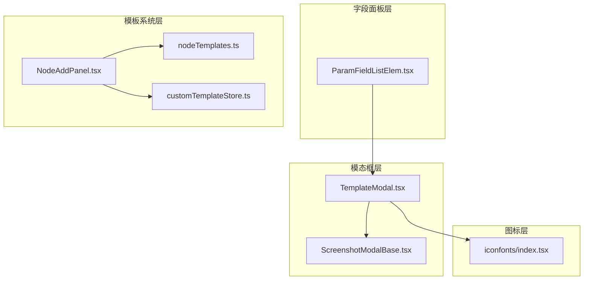
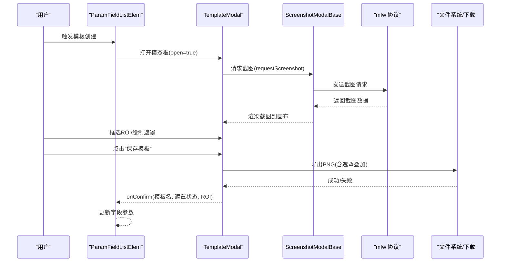
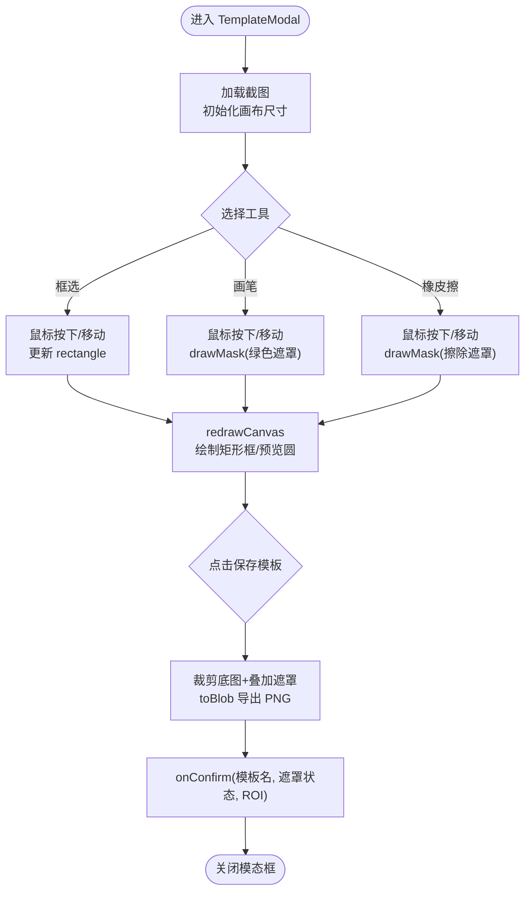
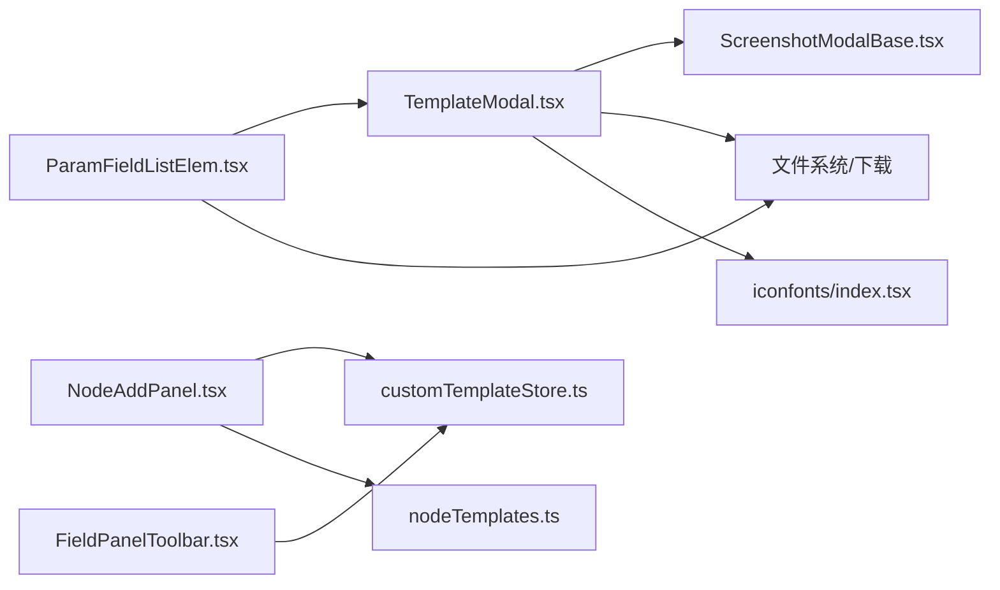

# 模板创建模态框

<cite>
**本文引用的文件**
- [TemplateModal.tsx](file://src/components/modals/TemplateModal.tsx)
- [ScreenshotModalBase.tsx](file://src/components/modals/ScreenshotModalBase.tsx)
- [ParamFieldListElem.tsx](file://src/components/panels/field-items/ParamFieldListElem.tsx)
- [FieldPanelToolbar.tsx](file://src/components/panels/field-tools/FieldPanelToolbar.tsx)
- [customTemplateStore.ts](file://src/stores/customTemplateStore.ts)
- [nodeTemplates.ts](file://src/data/nodeTemplates.ts)
- [NodeAddPanel.tsx](file://src/components/panels/NodeAddPanel.tsx)
- [index.ts](file://src/components/modals/index.ts)
- [iconfonts/index.tsx](file://src/components/iconfonts/index.tsx)
</cite>

## 目录
1. [简介](#简介)
2. [项目结构](#项目结构)
3. [核心组件](#核心组件)
4. [架构总览](#架构总览)
5. [详细组件分析](#详细组件分析)
6. [依赖关系分析](#依赖关系分析)
7. [性能考量](#性能考量)
8. [故障排查指南](#故障排查指南)
9. [结论](#结论)

## 简介
本文件围绕“模板创建模态框”的实现进行系统化文档化，重点说明如何通过截图采集、ROI 区域框选与遮罩绘制，最终导出模板图片并回填到字段参数中；同时梳理该模态框与字段面板、节点模板系统、自定义模板存储之间的协作关系。文档面向不同技术背景的读者，既提供高层架构说明，也给出关键流程的可视化图示与定位路径。

## 项目结构
与“模板创建模态框”直接相关的模块分布如下：
- 模态框组件：TemplateModal.tsx（基于 ScreenshotModalBase.tsx 的通用截图容器）
- 字段面板与参数编辑：ParamFieldListElem.tsx（在字段参数中触发模板创建）
- 节点模板与自定义模板：nodeTemplates.ts、customTemplateStore.ts
- 节点添加面板：NodeAddPanel.tsx（展示与管理模板列表）
- 图标系统：iconfonts/index.tsx（提供模板相关图标）

图表来源
- [TemplateModal.tsx](file://src/components/modals/TemplateModal.tsx#L1-L602)
- [ScreenshotModalBase.tsx](file://src/components/modals/ScreenshotModalBase.tsx#L1-L293)
- [ParamFieldListElem.tsx](file://src/components/panels/field-items/ParamFieldListElem.tsx#L420-L478)
- [nodeTemplates.ts](file://src/data/nodeTemplates.ts#L1-L96)
- [customTemplateStore.ts](file://src/stores/customTemplateStore.ts#L1-L242)
- [NodeAddPanel.tsx](file://src/components/panels/NodeAddPanel.tsx#L1-L542)
- [iconfonts/index.tsx](file://src/components/iconfonts/index.tsx#L1-L200)

章节来源
- [TemplateModal.tsx](file://src/components/modals/TemplateModal.tsx#L1-L602)
- [ScreenshotModalBase.tsx](file://src/components/modals/ScreenshotModalBase.tsx#L1-L293)
- [ParamFieldListElem.tsx](file://src/components/panels/field-items/ParamFieldListElem.tsx#L420-L478)
- [NodeAddPanel.tsx](file://src/components/panels/NodeAddPanel.tsx#L1-L542)
- [customTemplateStore.ts](file://src/stores/customTemplateStore.ts#L1-L242)
- [nodeTemplates.ts](file://src/data/nodeTemplates.ts#L1-L96)
- [iconfonts/index.tsx](file://src/components/iconfonts/index.tsx#L1-L200)

## 核心组件
- TemplateModal：提供截图采集、ROI 框选、遮罩绘制、画笔/橡皮擦、导出模板图片、回填字段参数的完整交互。
- ScreenshotModalBase：封装截图请求、缩放/平移、工具栏与确认按钮等通用能力。
- ParamFieldListElem：在字段参数编辑界面触发 TemplateModal，并接收确认回调，将模板路径、遮罩状态与 ROI 写回字段数据。
- customTemplateStore：负责自定义模板的持久化、增删改查与版本迁移。
- nodeTemplates：内置模板集合，NodeAddPanel 展示时会合并自定义模板与预设模板。
- NodeAddPanel：模板列表展示、搜索、键盘导航、删除自定义模板。
- iconfonts：提供模板相关图标资源。

章节来源
- [TemplateModal.tsx](file://src/components/modals/TemplateModal.tsx#L1-L602)
- [ScreenshotModalBase.tsx](file://src/components/modals/ScreenshotModalBase.tsx#L1-L293)
- [ParamFieldListElem.tsx](file://src/components/panels/field-items/ParamFieldListElem.tsx#L420-L478)
- [customTemplateStore.ts](file://src/stores/customTemplateStore.ts#L1-L242)
- [nodeTemplates.ts](file://src/data/nodeTemplates.ts#L1-L96)
- [NodeAddPanel.tsx](file://src/components/panels/NodeAddPanel.tsx#L1-L542)
- [iconfonts/index.tsx](file://src/components/iconfonts/index.tsx#L1-L200)

## 架构总览
TemplateModal 作为“模板创建模态框”，其工作流由以下步骤构成：
1. 通过 ScreenshotModalBase 请求设备截图并渲染到画布。
2. 用户使用“框选/画笔/橡皮擦”工具完成 ROI 选择与遮罩绘制。
3. 点击“保存模板”，将裁剪后的截图与遮罩叠加导出为 PNG 文件，同时回传模板文件名、遮罩状态与 ROI。
4. 字段面板接收回传数据，写入对应字段参数（如模板路径、ROI、是否使用绿色遮罩）。

图表来源
- [ParamFieldListElem.tsx](file://src/components/panels/field-items/ParamFieldListElem.tsx#L420-L478)
- [TemplateModal.tsx](file://src/components/modals/TemplateModal.tsx#L1-L602)
- [ScreenshotModalBase.tsx](file://src/components/modals/ScreenshotModalBase.tsx#L1-L293)

## 详细组件分析

### TemplateModal 组件
- 截图与画布渲染
  - 基于 ScreenshotModalBase 的截图请求与渲染，内部维护两层 Canvas：底图 Canvas 与遮罩 Canvas。
  - 通过 redrawCanvas 将底图与遮罩层叠加绘制，并在 ROI 选择状态下绘制矩形框与预览圆。
- 工具与状态
  - 支持“框选/画笔/橡皮擦”三种工具；画笔大小可调；支持清除遮罩。
  - 维护 isDrawing、startPoint、mousePos 等状态，保证拖拽过程的连续性。
- ROI 与遮罩
  - rectangle 表示当前 ROI；hasGreenMask 标记是否使用绿色遮罩。
  - drawMask 在遮罩 Canvas 上绘制圆形区域，brush/eraser 分别填充或擦除。
- 导出与回填
  - handleSave 将 ROI 区域从底图裁剪并叠加遮罩，导出为 PNG；优先使用 File System Access API，否则回退到传统下载。
  - onConfirm 回传模板文件名、遮罩状态与 ROI，供字段面板写入参数。

图表来源
- [TemplateModal.tsx](file://src/components/modals/TemplateModal.tsx#L1-L602)

章节来源
- [TemplateModal.tsx](file://src/components/modals/TemplateModal.tsx#L1-L602)

### ScreenshotModalBase 组件
- 截图请求与监听
  - 打开时自动请求截图；监听 mfw 协议的截图结果事件，成功后设置截图并回调 onScreenshotChange。
- 视口控制
  - 提供缩放、平移、重置等能力，统一传递给子组件渲染。
- 通用 UI
  - 提供工具栏、缩放控制、确认/取消按钮、重新截图等通用交互。

章节来源
- [ScreenshotModalBase.tsx](file://src/components/modals/ScreenshotModalBase.tsx#L1-L293)

### 字段面板与参数编辑（ParamFieldListElem）
- 触发与回填
  - 在字段参数编辑界面，当需要选择模板时打开 TemplateModal；onConfirm 回调中将模板文件名、遮罩状态与 ROI 写回到字段数据结构。
- 初始 ROI
  - 若字段参数中已有 ROI，可通过 initialROI 传入，便于复用或编辑。

章节来源
- [ParamFieldListElem.tsx](file://src/components/panels/field-items/ParamFieldListElem.tsx#L420-L478)

### 自定义模板存储（customTemplateStore）
- 数据结构
  - 以 localStorage 为持久化介质，版本号为 1.0；每条模板包含 label、nodeType、data、createTime。
- 能力
  - loadTemplates：加载并校验版本，转换为 NodeTemplateType 列表；异常时清空并提示。
  - addTemplate/updateTemplate/removeTemplate：增删改查与本地持久化。
  - getAllTemplates：合并预设模板与自定义模板，空节点模板优先。
  - hasTemplate：判断名称是否存在。

章节来源
- [customTemplateStore.ts](file://src/stores/customTemplateStore.ts#L1-L242)

### 节点模板与节点添加面板（NodeAddPanel）
- 模板展示
  - NodeAddPanel 从 customTemplateStore 获取模板列表，结合 nodeTemplates 合并展示；支持搜索、键盘导航、删除自定义模板。
- 图标与描述
  - 使用 iconfonts 提供的图标；描述根据识别/动作类型生成。

章节来源
- [NodeAddPanel.tsx](file://src/components/panels/NodeAddPanel.tsx#L1-L542)
- [nodeTemplates.ts](file://src/data/nodeTemplates.ts#L1-L96)
- [iconfonts/index.tsx](file://src/components/iconfonts/index.tsx#L1-L200)

### 模板保存入口（FieldPanelToolbar）
- 保存为模板
  - 在字段面板工具栏中，针对 Pipeline 节点提供“保存为模板”入口；弹窗输入模板名，调用 customTemplateStore 完成保存或覆盖。
- 与模板列表联动
  - 保存后可在 NodeAddPanel 中查看与删除。

章节来源
- [FieldPanelToolbar.tsx](file://src/components/panels/field-tools/FieldPanelToolbar.tsx#L1-L148)
- [customTemplateStore.ts](file://src/stores/customTemplateStore.ts#L1-L242)

## 依赖关系分析
- 组件耦合
  - TemplateModal 依赖 ScreenshotModalBase 提供截图与视口控制；依赖字段面板 ParamFieldListElem 作为调用方与回填目标。
  - NodeAddPanel 依赖 customTemplateStore 与 nodeTemplates，用于展示与管理模板。
  - FieldPanelToolbar 依赖 customTemplateStore，用于保存节点为模板。
- 数据流
  - 字段参数 -> TemplateModal -> 导出模板 -> 字段参数
  - 节点数据 -> FieldPanelToolbar -> customTemplateStore -> NodeAddPanel
- 外部依赖
  - mfw 协议用于截图请求与结果监听。
  - File System Access API 用于现代浏览器的文件保存体验。

图表来源
- [ParamFieldListElem.tsx](file://src/components/panels/field-items/ParamFieldListElem.tsx#L420-L478)
- [TemplateModal.tsx](file://src/components/modals/TemplateModal.tsx#L1-L602)
- [ScreenshotModalBase.tsx](file://src/components/modals/ScreenshotModalBase.tsx#L1-L293)
- [NodeAddPanel.tsx](file://src/components/panels/NodeAddPanel.tsx#L1-L542)
- [customTemplateStore.ts](file://src/stores/customTemplateStore.ts#L1-L242)
- [nodeTemplates.ts](file://src/data/nodeTemplates.ts#L1-L96)
- [FieldPanelToolbar.tsx](file://src/components/panels/field-tools/FieldPanelToolbar.tsx#L1-L148)
- [iconfonts/index.tsx](file://src/components/iconfonts/index.tsx#L1-L200)

## 性能考量
- Canvas 绘制
  - redrawCanvas 与 drawMask 均在内存 Canvas 上进行，避免频繁 DOM 操作；建议在高分辨率截图场景下注意内存占用。
- 导出策略
  - 优先使用 File System Access API，减少中间 URL 对象的创建与释放；若回退到传统下载，注意及时 revokeObjectURL。
- 截图与渲染
  - 截图请求与渲染采用异步监听，避免阻塞 UI；在多次打开模态框时应重置视口与遮罩状态，防止残留影响。

[本节为通用性能建议，不直接分析具体文件]

## 故障排查指南
- 无法获取截图
  - 检查连接状态与控制器 ID；确认 mfw 协议已注册截图结果监听。
  - 参考路径：[ScreenshotModalBase.tsx](file://src/components/modals/ScreenshotModalBase.tsx#L106-L149)
- 导出失败
  - 检查 toBlob 是否返回 Blob；确认浏览器支持 File System Access API 或传统下载回退路径。
  - 参考路径：[TemplateModal.tsx](file://src/components/modals/TemplateModal.tsx#L287-L386)
- 遮罩未生效
  - 确认 hasGreenMask 状态与 drawMask 的绘制逻辑；检查遮罩 Canvas 是否初始化。
  - 参考路径：[TemplateModal.tsx](file://src/components/modals/TemplateModal.tsx#L115-L156)
- 模板保存/加载异常
  - 检查 localStorage 权限与容量；确认版本号匹配；异常时会清空并提示。
  - 参考路径：[customTemplateStore.ts](file://src/stores/customTemplateStore.ts#L52-L96)
- 模板列表为空
  - 确认 getAllTemplates 合并顺序与过滤条件；检查自定义模板数量上限。
  - 参考路径：[customTemplateStore.ts](file://src/stores/customTemplateStore.ts#L215-L234)

章节来源
- [ScreenshotModalBase.tsx](file://src/components/modals/ScreenshotModalBase.tsx#L106-L149)
- [TemplateModal.tsx](file://src/components/modals/TemplateModal.tsx#L115-L156)
- [TemplateModal.tsx](file://src/components/modals/TemplateModal.tsx#L287-L386)
- [customTemplateStore.ts](file://src/stores/customTemplateStore.ts#L52-L96)
- [customTemplateStore.ts](file://src/stores/customTemplateStore.ts#L215-L234)

## 结论
“模板创建模态框”通过 ScreenshotModalBase 提供稳定的截图与视口控制能力，结合 TemplateModal 的 ROI 框选与遮罩绘制，实现了从截图到模板导出的完整闭环。配合字段面板的回填与自定义模板存储，用户可以便捷地创建、保存、复用模板，并在节点添加面板中统一管理。整体设计具备良好的扩展性与可维护性，适合在复杂节点参数场景中推广使用。