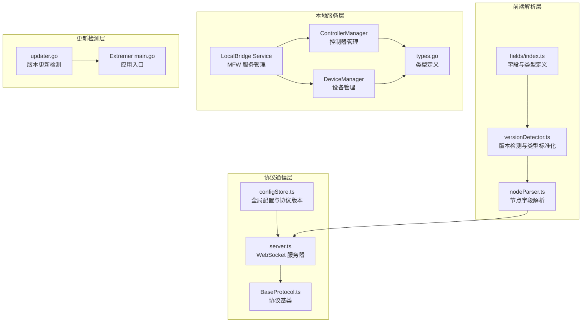
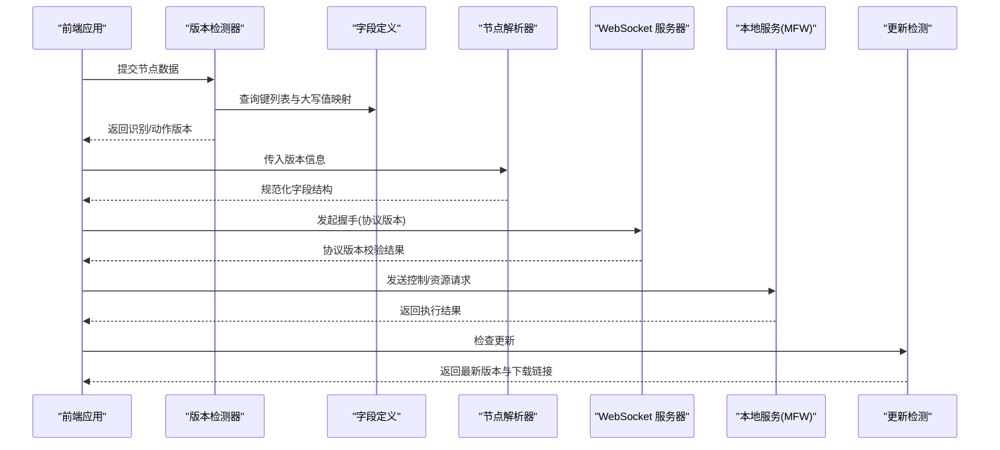
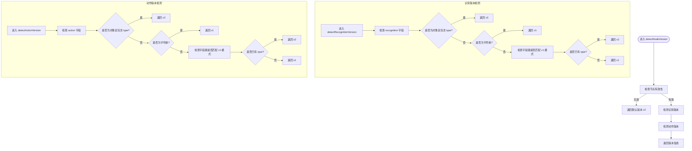
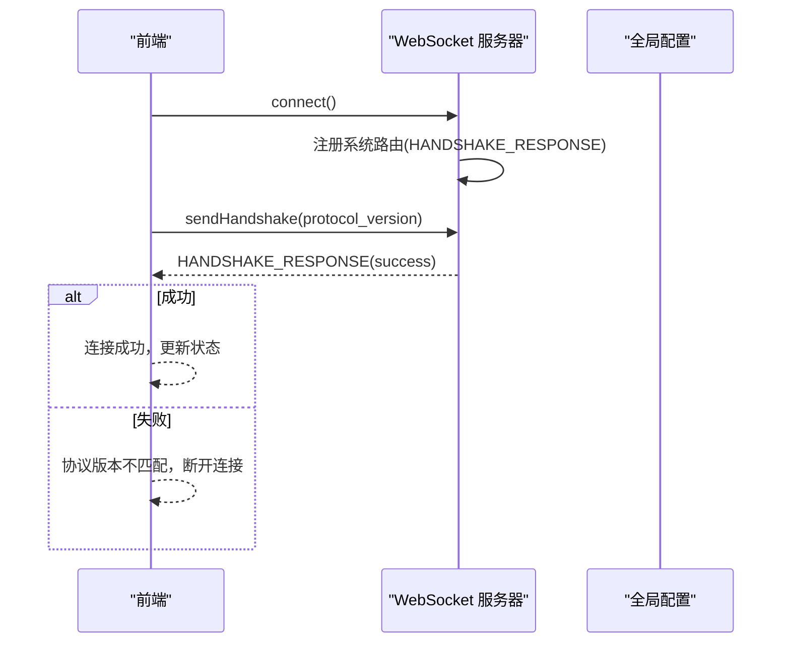
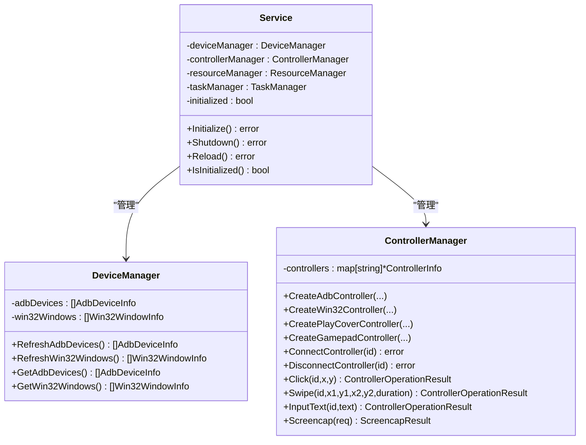
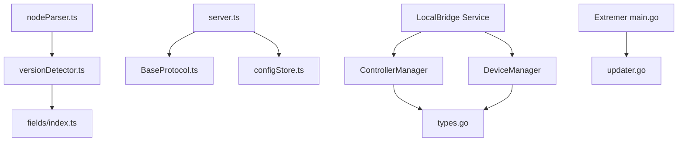

# 版本检测系统

<cite>
**本文档引用的文件**
- [versionDetector.ts](file://src/core/parser/versionDetector.ts)
- [index.ts](file://src/core/fields/index.ts)
- [server.ts](file://src/services/server.ts)
- [configStore.ts](file://src/stores/configStore.ts)
- [updater.go](file://Extremer/internal/updater/updater.go)
- [main.go](file://Extremer/main.go)
- [service.go](file://LocalBridge/internal/mfw/service.go)
- [controller_manager.go](file://LocalBridge/internal/mfw/controller_manager.go)
- [device_manager.go](file://LocalBridge/internal/mfw/device_manager.go)
- [types.go](file://LocalBridge/internal/mfw/types.go)
- [BaseProtocol.ts](file://src/services/protocols/BaseProtocol.ts)
- [nodeParser.ts](file://src/core/parser/nodeParser.ts)
</cite>

## 目录
1. [简介](#简介)
2. [项目结构](#项目结构)
3. [核心组件](#核心组件)
4. [架构总览](#架构总览)
5. [详细组件分析](#详细组件分析)
6. [依赖关系分析](#依赖关系分析)
7. [性能考虑](#性能考虑)
8. [故障排除指南](#故障排除指南)
9. [结论](#结论)

## 简介
本版本检测系统旨在自动识别和标准化 MaaPipelineEditor 中 Pipeline 节点的识别与动作字段版本，确保 v1 与 v2 两种格式的兼容性，并提供统一的类型规范化机制。系统通过字段模式匹配、类型大小写标准化以及协议版本握手验证，保障前端与本地服务之间的数据一致性与稳定性。

## 项目结构
版本检测系统涉及前端解析层、字段定义层、协议通信层与本地服务层，整体结构如下：

**图表来源**
- [versionDetector.ts:1-149](file://src/core/parser/versionDetector.ts#L1-L149)
- [nodeParser.ts:301-350](file://src/core/parser/nodeParser.ts#L301-L350)
- [index.ts:1-46](file://src/core/fields/index.ts#L1-L46)
- [server.ts:1-373](file://src/services/server.ts#L1-L373)
- [BaseProtocol.ts:1-40](file://src/services/protocols/BaseProtocol.ts#L1-L40)
- [configStore.ts:1-287](file://src/stores/configStore.ts#L1-L287)
- [service.go:1-218](file://LocalBridge/internal/mfw/service.go#L1-L218)
- [controller_manager.go:1-800](file://LocalBridge/internal/mfw/controller_manager.go#L1-L800)
- [device_manager.go:1-110](file://LocalBridge/internal/mfw/device_manager.go#L1-L110)
- [types.go:1-124](file://LocalBridge/internal/mfw/types.go#L1-L124)
- [updater.go:1-151](file://Extremer/internal/updater/updater.go#L1-L151)
- [main.go:1-90](file://Extremer/main.go#L1-L90)

**章节来源**
- [versionDetector.ts:1-149](file://src/core/parser/versionDetector.ts#L1-L149)
- [index.ts:1-46](file://src/core/fields/index.ts#L1-L46)
- [server.ts:1-373](file://src/services/server.ts#L1-L373)
- [configStore.ts:1-287](file://src/stores/configStore.ts#L1-L287)
- [service.go:1-218](file://LocalBridge/internal/mfw/service.go#L1-L218)
- [controller_manager.go:1-800](file://LocalBridge/internal/mfw/controller_manager.go#L1-L800)
- [device_manager.go:1-110](file://LocalBridge/internal/mfw/device_manager.go#L1-L110)
- [types.go:1-124](file://LocalBridge/internal/mfw/types.go#L1-L124)
- [updater.go:1-151](file://Extremer/internal/updater/updater.go#L1-L151)
- [main.go:1-90](file://Extremer/main.go#L1-L90)

## 核心组件
- 版本检测器：根据节点结构判断识别与动作字段的版本（v1 或 v2），并提供默认回退策略。
- 字段与类型定义：提供识别与动作字段的键列表及大写值映射，支撑版本检测与类型标准化。
- 节点解析器：依据检测到的版本，将字符串或对象格式的动作/识别字段规范化为统一结构。
- 协议握手：前端通过 WebSocket 与本地服务进行协议版本握手，确保兼容性。
- 本地服务：封装 MaaFramework 的初始化、设备与控制器管理、任务执行等能力。
- 更新检测：基于 GitHub Releases 的版本比较与平台适配下载链接解析。

**章节来源**
- [versionDetector.ts:23-110](file://src/core/parser/versionDetector.ts#L23-L110)
- [index.ts:42-46](file://src/core/fields/index.ts#L42-L46)
- [nodeParser.ts:301-350](file://src/core/parser/nodeParser.ts#L301-L350)
- [server.ts:20-331](file://src/services/server.ts#L20-L331)
- [service.go:25-138](file://LocalBridge/internal/mfw/service.go#L25-L138)
- [updater.go:44-99](file://Extremer/internal/updater/updater.go#L44-L99)

## 架构总览
版本检测系统采用分层设计，从前端解析到协议通信再到本地服务，形成完整的版本兼容链路：

**图表来源**
- [versionDetector.ts:23-110](file://src/core/parser/versionDetector.ts#L23-L110)
- [index.ts:42-46](file://src/core/fields/index.ts#L42-L46)
- [nodeParser.ts:301-350](file://src/core/parser/nodeParser.ts#L301-L350)
- [server.ts:268-283](file://src/services/server.ts#L268-L283)
- [service.go:37-138](file://LocalBridge/internal/mfw/service.go#L37-L138)
- [updater.go:44-99](file://Extremer/internal/updater/updater.go#L44-L99)

## 详细组件分析

### 版本检测器
版本检测器负责判断单个节点的识别与动作字段版本，并提供类型标准化功能：
- detectNodeVersion：综合识别与动作字段，返回版本信息。
- detectRecognitionVersion：优先检查 recognition 字段是否存在且包含 type；若不存在，则通过字段键列表判断 v1/v2。
- detectActionVersion：逻辑与识别版本类似，针对 action 字段。
- normalizeRecoType / normalizeActionType：将输入类型标准化为预定义的大写值集合，不匹配则抛出错误。

**图表来源**
- [versionDetector.ts:23-110](file://src/core/parser/versionDetector.ts#L23-L110)

**章节来源**
- [versionDetector.ts:23-110](file://src/core/parser/versionDetector.ts#L23-L110)

### 字段与类型定义
字段定义层提供识别与动作字段的键列表与大写值映射，支撑版本检测与类型标准化：
- 生成识别/动作字段的键列表与大写值映射，供版本检测器使用。
- 通过 generateParamKeys 与 generateUpperValues 统一字段键与类型值的大小写规范。

**章节来源**
- [index.ts:42-46](file://src/core/fields/index.ts#L42-L46)

### 节点解析器
节点解析器根据检测到的版本，将动作/识别字段规范化为统一结构：
- parseActionField：根据版本将字符串或对象格式的动作类型标准化。
- parseNodeField：处理节点字段，跳过连接字段，委托识别与动作字段解析。

**章节来源**
- [nodeParser.ts:301-350](file://src/core/parser/nodeParser.ts#L301-L350)

### 协议握手与通信
前端通过 WebSocket 与本地服务进行协议版本握手，确保兼容性：
- LocalWebSocketServer：封装连接、消息发送、握手处理与状态管理。
- 协议版本来自全局配置，握手失败时提示版本不匹配并断开连接。
- BaseProtocol：协议模块基类，定义协议名称、版本与路由注册接口。

**图表来源**
- [server.ts:20-331](file://src/services/server.ts#L20-L331)
- [configStore.ts:6-12](file://src/stores/configStore.ts#L6-L12)
- [BaseProtocol.ts:1-40](file://src/services/protocols/BaseProtocol.ts#L1-L40)

**章节来源**
- [server.ts:20-331](file://src/services/server.ts#L20-L331)
- [configStore.ts:6-12](file://src/stores/configStore.ts#L6-L12)
- [BaseProtocol.ts:1-40](file://src/services/protocols/BaseProtocol.ts#L1-L40)

### 本地服务与设备/控制器管理
本地服务封装 MaaFramework 的初始化、设备与控制器管理、任务执行等能力：
- Service：初始化/关闭 MFW，管理设备、控制器、资源与任务生命周期。
- DeviceManager：刷新 ADB 设备与 Win32 窗体列表，提供截图与输入方法选项。
- ControllerManager：创建/连接/断开控制器，执行点击、滑动、输入、截图等操作。
- 类型定义：统一控制器、资源、任务等信息的数据结构。

**图表来源**
- [service.go:15-197](file://LocalBridge/internal/mfw/service.go#L15-L197)
- [device_manager.go:11-110](file://LocalBridge/internal/mfw/device_manager.go#L11-L110)
- [controller_manager.go:20-321](file://LocalBridge/internal/mfw/controller_manager.go#L20-L321)
- [types.go:7-124](file://LocalBridge/internal/mfw/types.go#L7-L124)

**章节来源**
- [service.go:25-138](file://LocalBridge/internal/mfw/service.go#L25-L138)
- [device_manager.go:26-94](file://LocalBridge/internal/mfw/device_manager.go#L26-L94)
- [controller_manager.go:33-300](file://LocalBridge/internal/mfw/controller_manager.go#L33-L300)
- [types.go:7-124](file://LocalBridge/internal/mfw/types.go#L7-L124)

### 更新检测
更新检测模块基于 GitHub Releases 比较当前版本与最新版本，并根据平台选择合适的下载链接：
- CheckUpdate：发起 API 请求，解析版本号，比较大小，查找对应平台的下载链接。
- findDownloadURL：根据运行时平台与资产名称匹配 Extremer 包下载链接。
- GetPlatformName：返回人类可读的平台名称。

**章节来源**
- [updater.go:44-151](file://Extremer/internal/updater/updater.go#L44-L151)
- [main.go:24-33](file://Extremer/main.go#L24-L33)

## 依赖关系分析
版本检测系统各组件之间的依赖关系如下：

**图表来源**
- [versionDetector.ts:1-6](file://src/core/parser/versionDetector.ts#L1-L6)
- [index.ts:42-46](file://src/core/fields/index.ts#L42-L46)
- [nodeParser.ts:301-350](file://src/core/parser/nodeParser.ts#L301-L350)
- [server.ts:1-16](file://src/services/server.ts#L1-L16)
- [BaseProtocol.ts:1-40](file://src/services/protocols/BaseProtocol.ts#L1-L40)
- [configStore.ts:6-12](file://src/stores/configStore.ts#L6-L12)
- [service.go:3-13](file://LocalBridge/internal/mfw/service.go#L3-L13)
- [controller_manager.go:3-18](file://LocalBridge/internal/mfw/controller_manager.go#L3-L18)
- [device_manager.go:3-9](file://LocalBridge/internal/mfw/device_manager.go#L3-L9)
- [types.go:3-5](file://LocalBridge/internal/mfw/types.go#L3-L5)
- [main.go:3-16](file://Extremer/main.go#L3-L16)
- [updater.go:3-12](file://Extremer/internal/updater/updater.go#L3-L12)

**章节来源**
- [versionDetector.ts:1-6](file://src/core/parser/versionDetector.ts#L1-L6)
- [index.ts:42-46](file://src/core/fields/index.ts#L42-L46)
- [nodeParser.ts:301-350](file://src/core/parser/nodeParser.ts#L301-L350)
- [server.ts:1-16](file://src/services/server.ts#L1-L16)
- [BaseProtocol.ts:1-40](file://src/services/protocols/BaseProtocol.ts#L1-L40)
- [configStore.ts:6-12](file://src/stores/configStore.ts#L6-L12)
- [service.go:3-13](file://LocalBridge/internal/mfw/service.go#L3-L13)
- [controller_manager.go:3-18](file://LocalBridge/internal/mfw/controller_manager.go#L3-L18)
- [device_manager.go:3-9](file://LocalBridge/internal/mfw/device_manager.go#L3-L9)
- [types.go:3-5](file://LocalBridge/internal/mfw/types.go#L3-L5)
- [main.go:3-16](file://Extremer/main.go#L3-L16)
- [updater.go:3-12](file://Extremer/internal/updater/updater.go#L3-L12)

## 性能考虑
- 版本检测复杂度：主要为 O(n) 的键遍历与类型判断，n 为节点字段数量，开销较小。
- 类型标准化：通过预构建的大写值映射进行查找，平均时间复杂度为 O(1)，异常分支使用线性查找以保证准确性。
- WebSocket 连接：采用超时与状态管理，避免重复连接与阻塞；握手失败快速断开，减少资源占用。
- 本地服务初始化：在 Windows 上对路径进行短路径转换或工作目录切换，降低中文路径导致的初始化失败风险。

[本节为通用性能讨论，无需列出具体文件来源]

## 故障排除指南
- 协议版本不匹配：握手阶段若版本不一致，前端会提示并断开连接。请确认前端与本地服务的协议版本一致。
- 节点版本识别异常：当节点缺少识别/动作字段或字段结构不符合预期时，版本检测器返回默认 v2。建议检查节点数据结构或启用字段修复逻辑。
- 类型标准化错误：当识别/动作类型不在预定义集合内时抛出错误。请核对类型名称大小写或使用提供的标准化函数。
- 本地服务初始化失败：检查 MaaFramework 库路径配置，确保路径存在且可访问；Windows 平台注意中文路径问题。
- 控制器连接超时：检查设备/应用状态与权限，确保截图与输入方法可用；必要时调整截图目标尺寸或禁用缓存。

**章节来源**
- [server.ts:40-64](file://src/services/server.ts#L40-L64)
- [versionDetector.ts:118-148](file://src/core/parser/versionDetector.ts#L118-L148)
- [service.go:67-94](file://LocalBridge/internal/mfw/service.go#L67-L94)
- [controller_manager.go:278-288](file://LocalBridge/internal/mfw/controller_manager.go#L278-L288)

## 结论
版本检测系统通过明确的版本判定规则与类型标准化机制，有效解决了 v1 与 v2 两种格式的兼容性问题。结合协议握手与本地服务管理，系统在保证数据一致性的同时，提供了良好的扩展性与稳定性。建议在后续版本中进一步完善字段校验与错误提示，提升用户体验与系统健壮性。