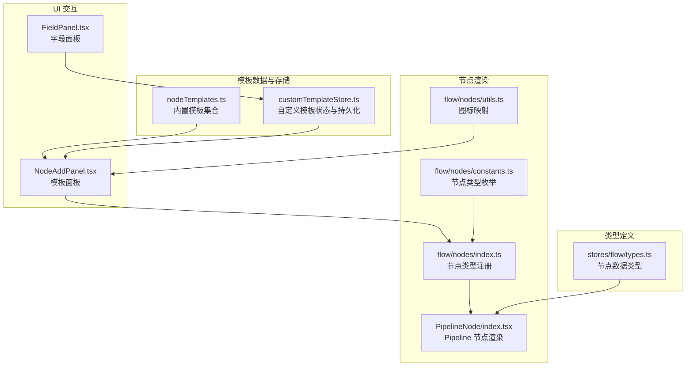
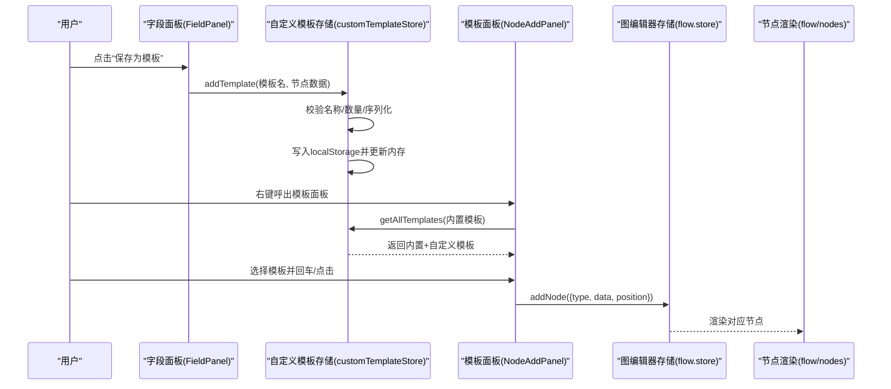
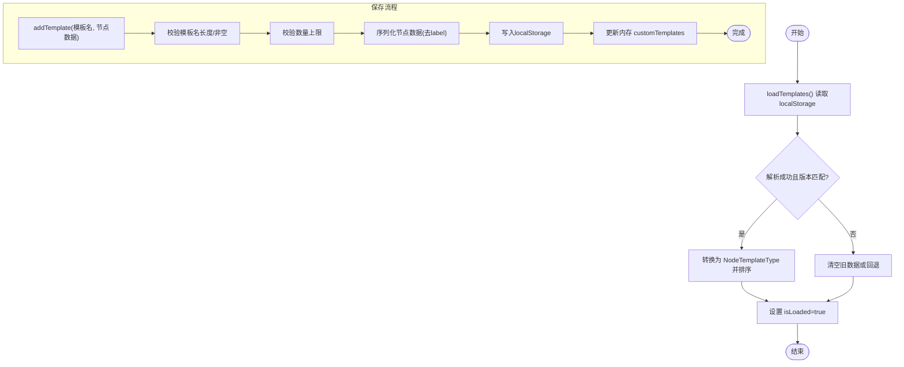
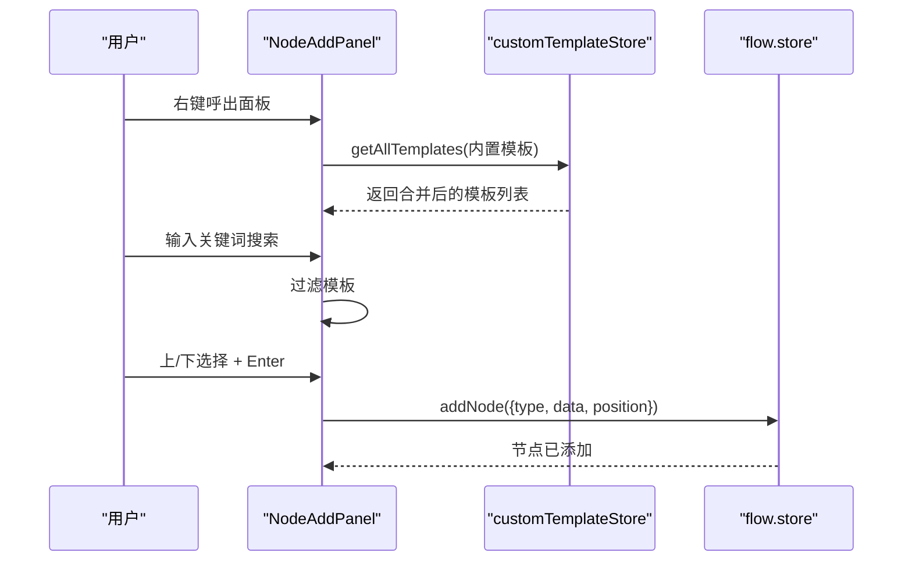
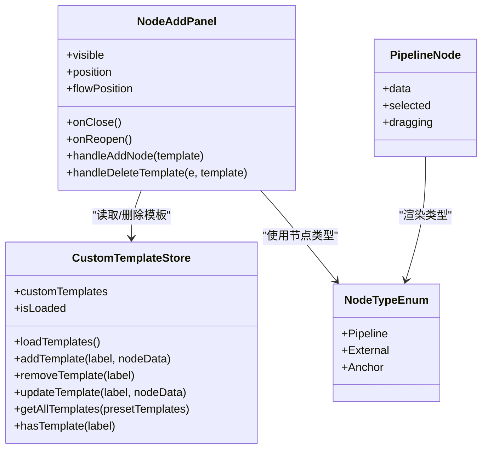
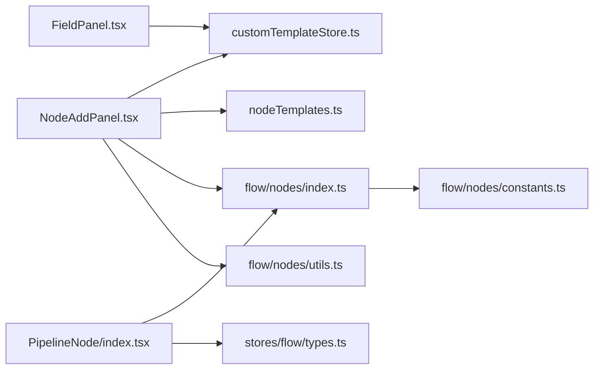

# 自定义节点模板

<cite>
**本文引用的文件**
- [src/data/nodeTemplates.ts](file://src/data/nodeTemplates.ts)
- [src/stores/customTemplateStore.ts](file://src/stores/customTemplateStore.ts)
- [src/components/panels/NodeAddPanel.tsx](file://src/components/panels/NodeAddPanel.tsx)
- [src/components/panels/FieldPanel.tsx](file://src/components/panels/FieldPanel.tsx)
- [src/components/flow/nodes/index.ts](file://src/components/flow/nodes/index.ts)
- [src/components/flow/nodes/constants.ts](file://src/components/flow/nodes/constants.ts)
- [src/components/flow/nodes/utils.ts](file://src/components/flow/nodes/utils.ts)
- [src/components/flow/nodes/PipelineNode/index.tsx](file://src/components/flow/nodes/PipelineNode/index.tsx)
- [src/stores/flow/types.ts](file://src/stores/flow/types.ts)
- [docsite/docs/01.指南/02.核心概念/35.节点模板面板.md](file://docsite/docs/01.指南/02.核心概念/35.节点模板面板.md)
</cite>

## 目录
1. [简介](#简介)
2. [项目结构](#项目结构)
3. [核心组件](#核心组件)
4. [架构总览](#架构总览)
5. [详细组件分析](#详细组件分析)
6. [依赖关系分析](#依赖关系分析)
7. [性能考量](#性能考量)
8. [故障排查指南](#故障排查指南)
9. [结论](#结论)
10. [附录](#附录)

## 简介
本章节面向“自定义节点模板”的使用与实现，帮助用户通过节点模板面板快速创建、保存、管理和复用节点配置；同时为开发者梳理模板的数据结构、持久化策略、UI 展示与交互流程，以及与节点渲染、字段面板的协作关系。

## 项目结构
围绕“自定义节点模板”，涉及以下关键模块：
- 预置模板数据：定义内置模板集合及默认节点数据。
- 自定义模板存储：基于浏览器本地存储的模板持久化与版本管理。
- 节点模板面板：提供模板预览、搜索、键盘导航与添加节点的能力。
- 字段面板：提供保存为模板的入口与交互。
- 节点渲染：根据模板数据渲染 Pipeline/External/Anchor 节点。
- 节点类型与图标：统一的节点类型枚举与图标映射。

图表来源
- [src/data/nodeTemplates.ts](file://src/data/nodeTemplates.ts#L1-L96)
- [src/stores/customTemplateStore.ts](file://src/stores/customTemplateStore.ts#L1-L242)
- [src/components/panels/NodeAddPanel.tsx](file://src/components/panels/NodeAddPanel.tsx#L1-L542)
- [src/components/panels/FieldPanel.tsx](file://src/components/panels/FieldPanel.tsx#L1-L932)
- [src/components/flow/nodes/index.ts](file://src/components/flow/nodes/index.ts#L1-L14)
- [src/components/flow/nodes/constants.ts](file://src/components/flow/nodes/constants.ts#L1-L14)
- [src/components/flow/nodes/utils.ts](file://src/components/flow/nodes/utils.ts#L1-L99)
- [src/components/flow/nodes/PipelineNode/index.tsx](file://src/components/flow/nodes/PipelineNode/index.tsx#L1-L77)
- [src/stores/flow/types.ts](file://src/stores/flow/types.ts#L1-L268)

章节来源
- [src/data/nodeTemplates.ts](file://src/data/nodeTemplates.ts#L1-L96)
- [src/stores/customTemplateStore.ts](file://src/stores/customTemplateStore.ts#L1-L242)
- [src/components/panels/NodeAddPanel.tsx](file://src/components/panels/NodeAddPanel.tsx#L1-L542)
- [src/components/panels/FieldPanel.tsx](file://src/components/panels/FieldPanel.tsx#L1-L932)
- [src/components/flow/nodes/index.ts](file://src/components/flow/nodes/index.ts#L1-L14)
- [src/components/flow/nodes/constants.ts](file://src/components/flow/nodes/constants.ts#L1-L14)
- [src/components/flow/nodes/utils.ts](file://src/components/flow/nodes/utils.ts#L1-L99)
- [src/components/flow/nodes/PipelineNode/index.tsx](file://src/components/flow/nodes/PipelineNode/index.tsx#L1-L77)
- [src/stores/flow/types.ts](file://src/stores/flow/types.ts#L1-L268)

## 核心组件
- 预置模板集合：定义内置模板列表，包含节点标签、图标、节点类型与初始数据工厂。
- 自定义模板存储：负责加载、保存、更新、删除自定义模板，使用本地存储并带版本校验与上限控制。
- 节点模板面板：提供模板预览、搜索、键盘导航与添加节点的交互。
- 字段面板：提供“保存为模板”入口，收集用户输入并调用存储层。
- 节点渲染：根据模板数据渲染 Pipeline/External/Anchor 节点，使用图标映射与节点类型枚举。

章节来源
- [src/data/nodeTemplates.ts](file://src/data/nodeTemplates.ts#L1-L96)
- [src/stores/customTemplateStore.ts](file://src/stores/customTemplateStore.ts#L1-L242)
- [src/components/panels/NodeAddPanel.tsx](file://src/components/panels/NodeAddPanel.tsx#L1-L542)
- [src/components/panels/FieldPanel.tsx](file://src/components/panels/FieldPanel.tsx#L821-L862)
- [src/components/flow/nodes/index.ts](file://src/components/flow/nodes/index.ts#L1-L14)
- [src/components/flow/nodes/utils.ts](file://src/components/flow/nodes/utils.ts#L1-L99)

## 架构总览
自定义节点模板的端到端流程如下：
- 用户在字段面板触发“保存为模板”，输入模板名并确认。
- 存储层接收当前节点数据（去除 label），序列化后写入本地存储，同时更新内存状态。
- 模板面板加载所有模板（内置 + 自定义），支持搜索与键盘导航。
- 用户选择模板后，面板调用图编辑器的添加节点接口，传入模板节点类型与数据，完成节点创建。

图表来源
- [src/components/panels/FieldPanel.tsx](file://src/components/panels/FieldPanel.tsx#L821-L862)
- [src/stores/customTemplateStore.ts](file://src/stores/customTemplateStore.ts#L120-L172)
- [src/components/panels/NodeAddPanel.tsx](file://src/components/panels/NodeAddPanel.tsx#L276-L289)
- [src/components/flow/nodes/index.ts](file://src/components/flow/nodes/index.ts#L1-L14)

## 详细组件分析

### 预置模板集合（nodeTemplates.ts）
- 定义内置模板数组，包含标签、图标、节点类型与初始数据工厂。
- 支持多种节点类型：Pipeline、External、Anchor；部分模板提供默认 recognition/action/others 数据。
- 为模板面板提供基础数据源。

章节来源
- [src/data/nodeTemplates.ts](file://src/data/nodeTemplates.ts#L1-L96)

### 自定义模板存储（customTemplateStore.ts）
- 状态结构
  - customTemplates：当前加载的自定义模板数组。
  - isLoaded：是否完成初次加载。
- 行为
  - loadTemplates：从 localStorage 读取并校验版本，转换为 NodeTemplateType，按创建时间倒序排序。
  - addTemplate：校验模板名长度与数量上限，序列化节点数据（去除 label），写入 localStorage 并更新内存。
  - removeTemplate：删除指定模板并同步更新 localStorage。
  - updateTemplate：通过先删后增实现更新。
  - getAllTemplates：将内置模板与自定义模板合并，保持“空节点”在首位。
  - hasTemplate：检查模板名是否存在。
- 持久化策略
  - 使用 localStorage，键名为固定字符串，版本号固定，便于后续迁移。
  - 对异常数据进行清理与回滚，保证稳定性。

图表来源
- [src/stores/customTemplateStore.ts](file://src/stores/customTemplateStore.ts#L52-L97)
- [src/stores/customTemplateStore.ts](file://src/stores/customTemplateStore.ts#L99-L173)

章节来源
- [src/stores/customTemplateStore.ts](file://src/stores/customTemplateStore.ts#L1-L242)

### 节点模板面板（NodeAddPanel.tsx）
- 功能
  - 模板预览：根据模板类型与数据渲染 Pipeline/External/Anchor 的预览卡片。
  - 搜索过滤：支持按模板名模糊搜索。
  - 键盘导航：上下方向键选择、Enter 添加、Esc 关闭。
  - 删除自定义模板：悬停显示删除按钮，二次确认后调用存储层删除。
  - 添加节点：将模板的节点类型与数据传递给图编辑器的 addNode 接口。
- 交互细节
  - 面板位置根据鼠标位置与视口边界自动计算，避免溢出。
  - 预览区域根据识别/动作类型与参数动态展示。

图表来源
- [src/components/panels/NodeAddPanel.tsx](file://src/components/panels/NodeAddPanel.tsx#L260-L309)
- [src/components/panels/NodeAddPanel.tsx](file://src/components/panels/NodeAddPanel.tsx#L276-L289)
- [src/stores/customTemplateStore.ts](file://src/stores/customTemplateStore.ts#L215-L234)

章节来源
- [src/components/panels/NodeAddPanel.tsx](file://src/components/panels/NodeAddPanel.tsx#L1-L542)

### 字段面板（FieldPanel.tsx）
- 功能
  - 提供“保存为模板”入口，弹窗收集模板名（最大 30 字符）。
  - 调用自定义模板存储的 addTemplate 方法，完成保存。
- 与模板面板的关系
  - 字段面板负责“产出模板”，模板面板负责“消费模板”。

章节来源
- [src/components/panels/FieldPanel.tsx](file://src/components/panels/FieldPanel.tsx#L821-L862)

### 节点渲染与类型（flow/nodes）
- 节点类型注册：将 Pipeline/External/Anchor 三种节点类型注册到渲染层。
- 节点类型枚举：统一 NodeTypeEnum，用于区分节点类型。
- 图标映射：根据识别类型、动作类型与节点类型返回图标配置，用于模板预览与节点展示。
- Pipeline 节点渲染：根据配置选择现代或经典内容组件，支持 memo 化优化。

图表来源
- [src/components/flow/nodes/index.ts](file://src/components/flow/nodes/index.ts#L1-L14)
- [src/components/flow/nodes/constants.ts](file://src/components/flow/nodes/constants.ts#L1-L14)
- [src/components/panels/NodeAddPanel.tsx](file://src/components/panels/NodeAddPanel.tsx#L276-L309)
- [src/stores/customTemplateStore.ts](file://src/stores/customTemplateStore.ts#L1-L242)
- [src/components/flow/nodes/PipelineNode/index.tsx](file://src/components/flow/nodes/PipelineNode/index.tsx#L1-L77)

章节来源
- [src/components/flow/nodes/index.ts](file://src/components/flow/nodes/index.ts#L1-L14)
- [src/components/flow/nodes/constants.ts](file://src/components/flow/nodes/constants.ts#L1-L14)
- [src/components/flow/nodes/utils.ts](file://src/components/flow/nodes/utils.ts#L1-L99)
- [src/components/flow/nodes/PipelineNode/index.tsx](file://src/components/flow/nodes/PipelineNode/index.tsx#L1-L77)

### 数据模型与类型（stores/flow/types.ts）
- PipelineNodeDataType：定义 Pipeline 节点的数据结构，包含识别、动作、其他参数与可选扩展字段。
- ExternalNodeDataType/AnchorNodeDataType：定义外部节点与锚点节点的数据结构。
- FlowStore 的 addNode 接口：支持传入 type、data、position、select、link、focus 等选项。

章节来源
- [src/stores/flow/types.ts](file://src/stores/flow/types.ts#L102-L171)
- [src/stores/flow/types.ts](file://src/stores/flow/types.ts#L217-L232)

## 依赖关系分析
- 模板面板依赖自定义模板存储与内置模板集合，用于展示与筛选模板。
- 字段面板依赖自定义模板存储，用于保存模板。
- 节点渲染依赖节点类型枚举与图标映射，确保不同节点类型的正确展示。
- 节点类型注册表将节点组件与类型绑定，供渲染层使用。

图表来源
- [src/components/panels/NodeAddPanel.tsx](file://src/components/panels/NodeAddPanel.tsx#L1-L542)
- [src/stores/customTemplateStore.ts](file://src/stores/customTemplateStore.ts#L1-L242)
- [src/data/nodeTemplates.ts](file://src/data/nodeTemplates.ts#L1-L96)
- [src/components/panels/FieldPanel.tsx](file://src/components/panels/FieldPanel.tsx#L821-L862)
- [src/components/flow/nodes/index.ts](file://src/components/flow/nodes/index.ts#L1-L14)
- [src/components/flow/nodes/constants.ts](file://src/components/flow/nodes/constants.ts#L1-L14)
- [src/components/flow/nodes/utils.ts](file://src/components/flow/nodes/utils.ts#L1-L99)
- [src/components/flow/nodes/PipelineNode/index.tsx](file://src/components/flow/nodes/PipelineNode/index.tsx#L1-L77)
- [src/stores/flow/types.ts](file://src/stores/flow/types.ts#L1-L268)

章节来源
- [src/components/panels/NodeAddPanel.tsx](file://src/components/panels/NodeAddPanel.tsx#L1-L542)
- [src/stores/customTemplateStore.ts](file://src/stores/customTemplateStore.ts#L1-L242)
- [src/data/nodeTemplates.ts](file://src/data/nodeTemplates.ts#L1-L96)
- [src/components/panels/FieldPanel.tsx](file://src/components/panels/FieldPanel.tsx#L821-L862)
- [src/components/flow/nodes/index.ts](file://src/components/flow/nodes/index.ts#L1-L14)
- [src/components/flow/nodes/constants.ts](file://src/components/flow/nodes/constants.ts#L1-L14)
- [src/components/flow/nodes/utils.ts](file://src/components/flow/nodes/utils.ts#L1-L99)
- [src/components/flow/nodes/PipelineNode/index.tsx](file://src/components/flow/nodes/PipelineNode/index.tsx#L1-L77)
- [src/stores/flow/types.ts](file://src/stores/flow/types.ts#L1-L268)

## 性能考量
- 模板预览与列表渲染
  - 使用 memo 与 useMemo 减少不必要的重渲染。
  - 搜索过滤在内存中进行，建议模板数量控制在合理范围（存储层上限为 50）。
- 本地存储
  - 序列化与反序列化成本较低，但应避免频繁写入；批量更新时尽量减少多次 localStorage 操作。
- 节点渲染
  - PipelineNodeMemo 基于关键字段浅比较，避免无关变更导致的重渲染。

章节来源
- [src/components/panels/NodeAddPanel.tsx](file://src/components/panels/NodeAddPanel.tsx#L1-L542)
- [src/stores/customTemplateStore.ts](file://src/stores/customTemplateStore.ts#L1-L242)
- [src/components/flow/nodes/PipelineNode/index.tsx](file://src/components/flow/nodes/PipelineNode/index.tsx#L40-L77)

## 故障排查指南
- 模板加载失败或为空
  - 检查 localStorage 中的模板键是否存在，确认版本号是否匹配。
  - 若版本不匹配，存储层会清空旧数据并回退，需重新保存模板。
- 保存模板失败
  - 检查浏览器存储空间是否充足，或模板名是否为空/超长。
  - 存储层会捕获异常并回滚，查看控制台错误日志。
- 删除模板无效
  - 确认模板是否为自定义模板（预制模板不可删除）。
  - 检查删除确认对话框是否被取消。
- 模板列表不显示最新模板
  - 确认模板面板已重新加载（首次打开或刷新页面）。
  - 检查 getAllTemplates 的合并顺序是否正确（空节点始终在首位）。

章节来源
- [src/stores/customTemplateStore.ts](file://src/stores/customTemplateStore.ts#L52-L97)
- [src/stores/customTemplateStore.ts](file://src/stores/customTemplateStore.ts#L99-L173)
- [src/stores/customTemplateStore.ts](file://src/stores/customTemplateStore.ts#L175-L203)
- [src/stores/customTemplateStore.ts](file://src/stores/customTemplateStore.ts#L215-L234)
- [src/components/panels/NodeAddPanel.tsx](file://src/components/panels/NodeAddPanel.tsx#L291-L309)

## 结论
自定义节点模板通过“字段面板保存 + 模板面板消费”的双通道设计，实现了模板的快速创建与复用。其核心在于：
- 明确的数据结构与类型定义，确保模板与节点渲染的一致性。
- 稳健的本地存储与版本管理，保障跨版本兼容与数据安全。
- 友好的 UI 交互与预览能力，提升模板使用的效率与准确性。

## 附录
- 使用说明与注意事项可参考官方指南文档。
- 导出行为：即使空白节点模板不含任何配置，导出时也会生成默认的识别与动作类型。

章节来源
- [docsite/docs/01.指南/02.核心概念/35.节点模板面板.md](file://docsite/docs/01.指南/02.核心概念/35.节点模板面板.md#L1-L113)