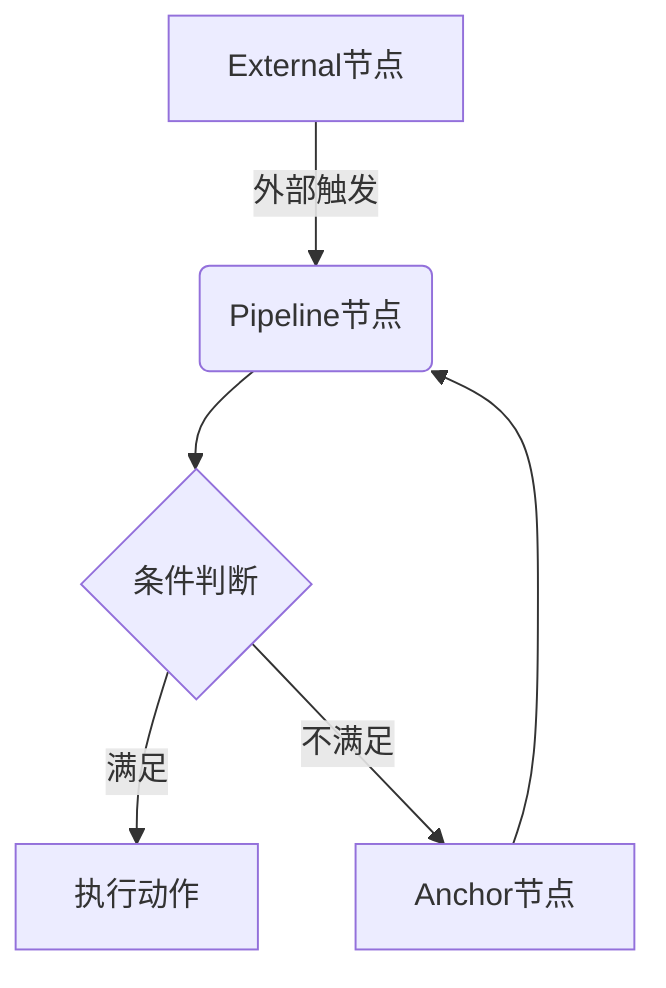
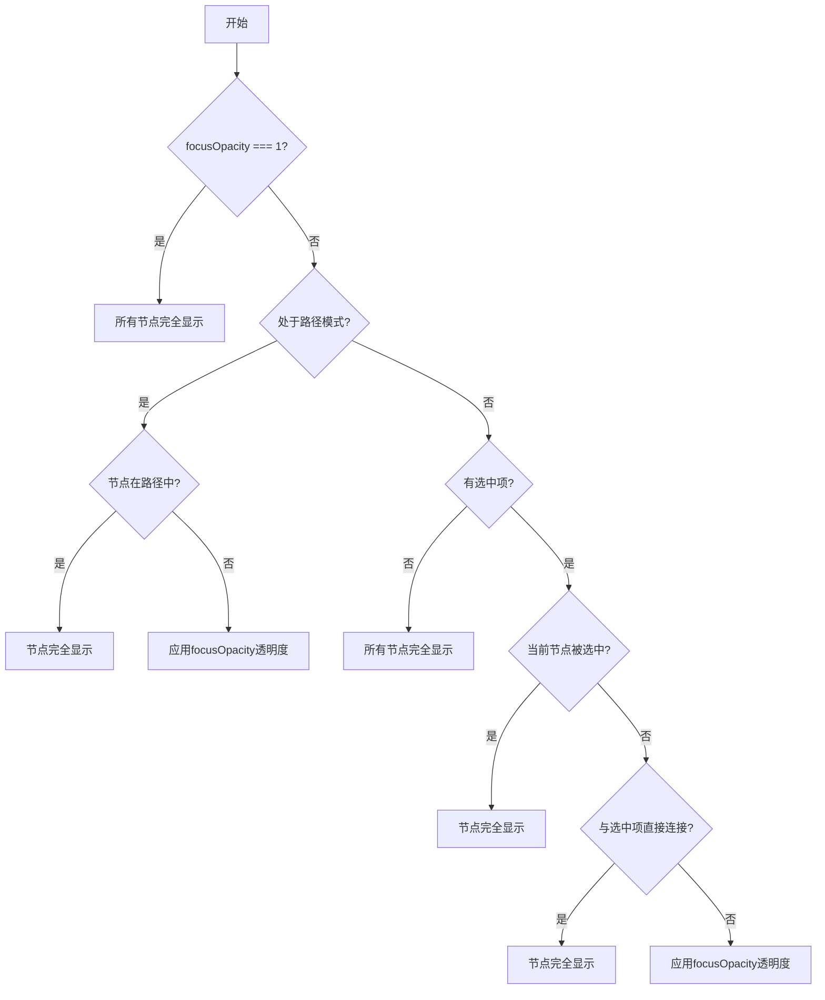
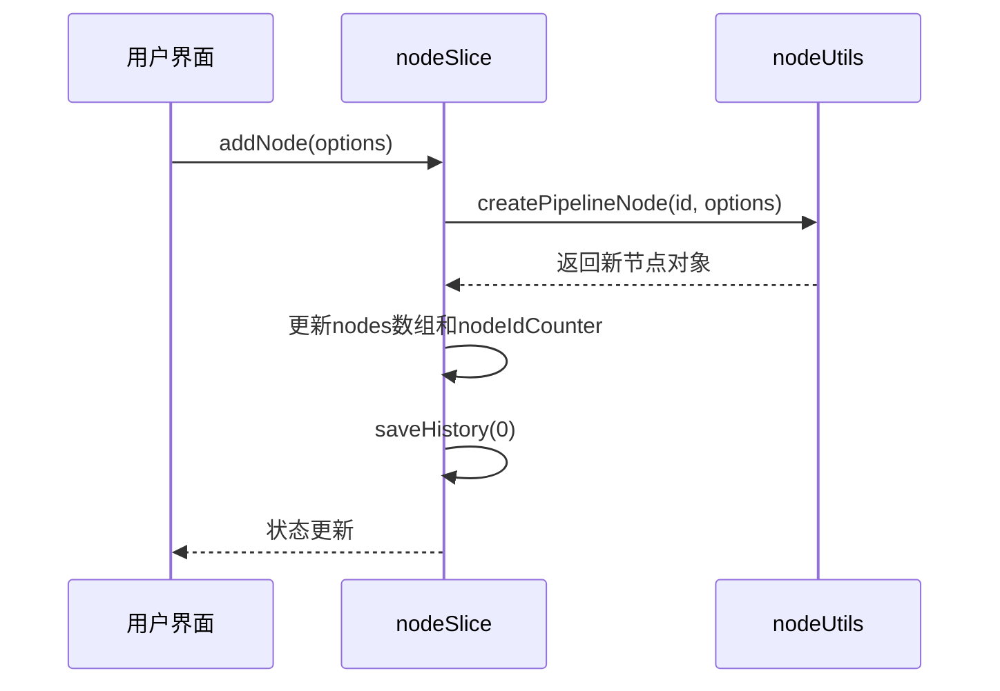
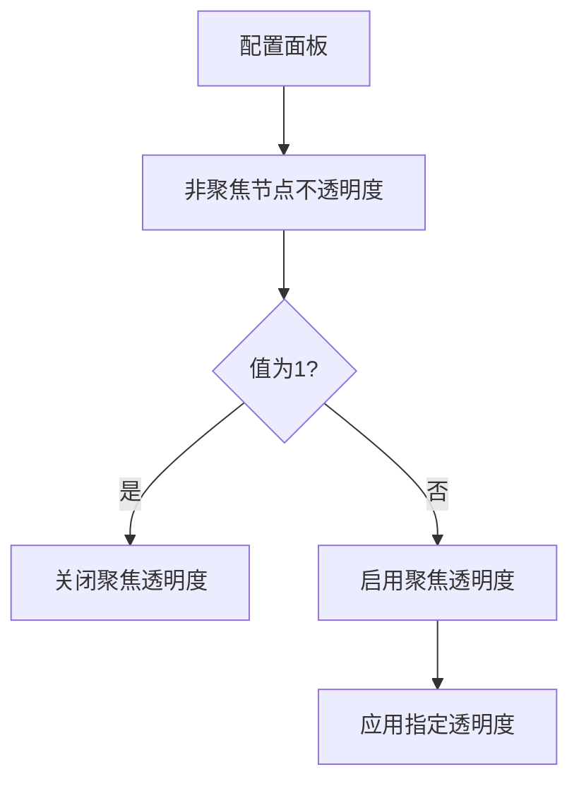

# 节点

<cite>
**本文档中引用的文件**  
- [nodeTypes.ts](file://src/components/flow/nodes/index.ts)
- [constants.ts](file://src/components/flow/nodes/constants.ts)
- [utils.ts](file://src/components/flow/nodes/utils.ts)
- [nodeSlice.ts](file://src/stores/flow/slices/nodeSlice.ts)
- [nodeUtils.ts](file://src/stores/flow/utils/nodeUtils.ts)
- [nodeTemplates.ts](file://src/data/nodeTemplates.ts)
- [PipelineNode.tsx](file://src/components/flow/nodes/PipelineNode/index.tsx)
- [ExternalNode.tsx](file://src/components/flow/nodes/ExternalNode.tsx)
- [AnchorNode.tsx](file://src/components/flow/nodes/AnchorNode.tsx)
- [fields.ts](file://src/core/fields/action/fields.ts)
- [fields.ts](file://src/core/fields/recognition/fields.ts)
- [index.ts](file://src/core/fields/index.ts)
- [types.ts](file://src/core/fields/types.ts)
- [configStore.ts](file://src/stores/configStore.ts)
- [ConfigPanel.tsx](file://src/components/panels/ConfigPanel.tsx)
</cite>

## 更新摘要
**已更新内容**   
- 在“节点渲染机制”部分新增了聚焦透明度功能的详细说明
- 在“状态管理机制（Zustand store）”部分更新了配置状态管理
- 在“实际使用示例”部分增加了聚焦透明度功能的使用说明
- 新增了“聚焦透明度功能”专门章节

## 目录

1. [引言](#引言)
2. [核心节点类型](#核心节点类型)
3. [节点渲染机制](#节点渲染机制)
4. [状态管理机制（Zustand store）](#状态管理机制zustand-store)
5. [字段配置模型（fields.ts）](#字段配置模型fieldsts)
6. [节点可扩展性设计与模板定义](#节点可扩展性设计与模板定义)
7. [节点与字段面板的数据绑定](#节点与字段面板的数据绑定)
8. [节点的JSON序列化结构](#节点的json序列化结构)
9. [聚焦透明度功能](#聚焦透明度功能)
10. [实际使用示例](#实际使用示例)
11. [总结](#总结)

## 引言

MaaPipelineEditor 是一个用于构建自动化任务流程的可视化编辑器，其核心功能依赖于灵活的节点系统。节点是流程图中的基本执行单元，通过不同类型节点的组合与连接，用户可以构建复杂的自动化逻辑。本文档将深入解析该系统中的三种核心节点类型：**Pipeline节点**、**External节点**和**Anchor节点**，从代码实现层面详细阐述其渲染机制、状态管理、字段模型、可扩展性设计以及与UI组件的交互方式。

**Section sources**
- [index.ts](file://src/components/flow/nodes/index.ts#L1-L14)
- [constants.ts](file://src/components/flow/nodes/constants.ts#L1-L14)

## 核心节点类型

MaaPipelineEditor 定义了三种核心节点类型，每种类型在自动化流程中扮演不同的角色：

### Pipeline节点（执行自动化任务的核心单元）

Pipeline节点是执行自动化任务的核心单元。每个Pipeline节点包含识别（recognition）和动作（action）两个主要部分，用于定义“在什么条件下执行什么操作”。例如，识别屏幕上某个图标（如“开始按钮”），然后执行点击操作。它还包含“其他”（others）配置，如前后延迟时间。

### External节点（用于调用外部服务或脚本）

External节点作为流程的入口或出口，用于接收外部触发或向外部系统发送信号。它只有一个目标句柄（target handle），表示流程可以从外部跳转到该节点。这种节点常用于构建模块化的子流程或与外部API集成。

### Anchor节点（作为流程跳转或条件分支的锚点）

Anchor节点（重定向节点）作为流程跳转的锚点。它同样只有一个目标句柄，允许流程中的其他节点（如Pipeline节点）通过“跳转”逻辑跳转到该节点。这为实现复杂的流程控制（如循环、条件分支）提供了基础。



**Diagram sources**
- [constants.ts](file://src/components/flow/nodes/constants.ts#L8-L13)
- [ExternalNode.tsx](file://src/components/flow/nodes/ExternalNode.tsx#L9-L22)
- [AnchorNode.tsx](file://src/components/flow/nodes/AnchorNode.tsx#L9-L22)

## 节点渲染机制

节点的渲染基于React Flow库，通过自定义节点组件实现。系统通过`nodeTypes`映射将节点类型与对应的React组件关联。

### 节点类型注册

在`src/components/flow/nodes/index.ts`中，通过`nodeTypes`对象将`NodeTypeEnum`枚举值映射到具体的React组件：

```typescript
export const nodeTypes = {
  [NodeTypeEnum.Pipeline]: PipelineNodeMemo,
  [NodeTypeEnum.External]: ExternalNodeMemo,
  [NodeTypeEnum.Anchor]: AnchorNodeMemo,
};
```

React Flow在渲染时会根据节点的`type`属性查找并使用对应的组件。

### Pipeline节点渲染

`PipelineNode`组件根据全局配置的样式（现代或经典）动态选择渲染`ModernContent`或`ClassicContent`。其核心是一个带有句柄（Handle）的div容器，句柄用于建立节点间的连接。

**Section sources**
- [index.ts](file://src/components/flow/nodes/index.ts#L6-L9)
- [PipelineNode/index.tsx](file://src/components/flow/nodes/PipelineNode/index.tsx#L1-L41)

### External节点与Anchor节点渲染

`ExternalNode`和`AnchorNode`的渲染逻辑非常相似。它们都只包含一个位于左侧的目标句柄（`target`），用于接收来自其他节点的连接。节点主体显示其标签（label）。两者的主要区别在于使用的CSS类名和图标，以在视觉上区分。

### 聚焦透明度功能实现

当`focusOpacity`配置小于1时，系统会启用聚焦透明度功能，通过调整非相关节点和边的透明度来突出显示当前选择或路径。该功能在所有节点组件中统一实现，其核心逻辑如下：

1. **透明度判断**：首先检查`focusOpacity`是否等于1，若等于1则直接返回`true`，表示所有节点都应完全显示，不应用透明度效果。

2. **路径模式处理**：如果处于路径模式（`pathMode`为`true`）且路径节点ID集合（`pathNodeIds`）不为空，则检查当前节点是否在路径中，若在则完全显示。

3. **选中状态判断**：如果没有选中任何节点或边，或者当前节点本身被选中，则该节点完全显示。

4. **关联性检查**：检查当前节点是否与任何选中的节点或边直接连接。如果存在直接连接关系，则该节点被视为相关节点，应完全显示。

5. **透明度应用**：对于不满足上述条件的节点，应用`focusOpacity`配置的透明度值，使其半透明显示，从而突出显示选中的节点和相关路径。



**Diagram sources**
- [PipelineNode/index.tsx](file://src/components/flow/nodes/PipelineNode/index.tsx#L34-L70)
- [AnchorNode.tsx](file://src/components/flow/nodes/AnchorNode.tsx#L46-L76)
- [ExternalNode.tsx](file://src/components/flow/nodes/ExternalNode.tsx#L46-L76)

**Section sources**
- [PipelineNode/index.tsx](file://src/components/flow/nodes/PipelineNode/index.tsx#L34-L107)
- [AnchorNode.tsx](file://src/components/flow/nodes/AnchorNode.tsx#L46-L107)
- [ExternalNode.tsx](file://src/components/flow/nodes/ExternalNode.tsx#L46-L107)

## 状态管理机制（Zustand store）

整个流程图的状态由Zustand库管理，其中`nodeSlice.ts`负责管理所有与节点相关的状态和操作。

### 核心状态

- `nodes`: 存储所有节点对象的数组。
- `nodeIdCounter`: 用于生成唯一节点ID的计数器。

### 核心操作

#### `addNode`

`addNode`方法是创建新节点的核心。它根据传入的`type`参数，调用`createPipelineNode`、`createExternalNode`或`createAnchorNode`来生成节点实例。该方法还处理节点标签的自动生成与查重，并可选择性地将新节点与当前选中的节点连接。

#### `updateNodes`

此方法处理节点的更新，如位置移动、选中状态变化等。它使用React Flow提供的`applyNodeChanges`函数来应用变更，并根据变更类型（如删除、移动）决定是否保存历史记录。

#### `setNodeData`

这是更新节点内部数据（即`data`字段）的关键方法。它支持更新识别、动作和“其他”字段。当更改识别或动作的`type`时，该方法会智能地清理旧类型中不存在的参数，并为新类型添加必需的默认参数，确保数据结构的完整性。

### 配置状态管理

`configStore.ts`文件中定义了全局配置状态，其中包含了`focusOpacity`配置项，用于控制聚焦透明度功能。该配置的默认值为0.3，表示当启用该功能时，非相关节点和边的透明度为30%。

```typescript
configs: {
  // ... 其他配置
  // 聚焦透明度
  focusOpacity: 0.3,
  // 边控制点
  showEdgeControlPoint: true,
}
```

当用户在配置面板中调整`focusOpacity`值时，`setConfig`方法会更新该配置，并触发所有使用该配置的组件重新渲染，从而实时应用新的透明度设置。



**Diagram sources**
- [nodeSlice.ts](file://src/stores/flow/slices/nodeSlice.ts#L23-L156)
- [nodeUtils.ts](file://src/stores/flow/utils/nodeUtils.ts#L10-L102)

**Section sources**
- [nodeSlice.ts](file://src/stores/flow/slices/nodeSlice.ts#L23-L156)
- [configStore.ts](file://src/stores/configStore.ts#L82-L83)

## 字段配置模型（fields.ts）

节点的可配置字段由`src/core/fields`目录下的模块统一管理，形成了一套清晰的配置模型。

### 核心概念

- `FieldType`: 定义单个字段的元数据，包括类型、是否必填、默认值、描述等。
- `FieldsType`: 定义一个功能模块（如“点击”动作）所需的所有字段集合。
- `recoFields` 和 `actionFields`: 分别是所有识别类型和动作类型的配置映射表。

### 动作字段配置

`action/fields.ts`文件定义了所有动作类型的字段。例如，`Click`动作需要`clickTarget`（点击目标）和`targetOffset`（目标偏移）等字段。每个字段的配置都包含了其UI表现形式（如输入框、下拉框）和默认值。

### 识别字段配置

`recognition/fields.ts`文件定义了所有识别类型的字段。例如，`OCR`（文字识别）需要`roi`（识别区域）、`ocrExpected`（期望文本）等字段。

### 参数键生成

`index.ts`中的`generateParamKeys`函数会遍历`recoFields`和`actionFields`，为每种类型生成一个`ParamKeysType`对象，包含所有参数、必需参数和默认值。这为`setNodeData`中的智能参数清理和填充提供了数据支持。

**Section sources**
- [fields.ts](file://src/core/fields/action/fields.ts#L1-L123)
- [fields.ts](file://src/core/fields/recognition/fields.ts#L1-L101)
- [index.ts](file://src/core/fields/index.ts#L1-L39)
- [types.ts](file://src/core/fields/types.ts#L1-L32)

## 节点可扩展性设计与模板定义

系统通过`nodeTemplates.ts`实现了节点的可扩展性，允许轻松添加新的节点模板。

### 模板定义

`nodeTemplates`是一个`NodeTemplateType`对象数组。每个模板定义了：
- `label`: 模板在添加面板中显示的名称。
- `iconName`: 使用的图标名称。
- `data`: 一个函数，返回该模板的默认数据结构。

### 扩展新节点

要添加一个新节点模板，只需在`nodeTemplates`数组中添加一个新对象。例如，要添加一个“启动应用”的快捷模板，可以这样定义：

```typescript
{
  label: "启动应用",
  iconName: "icon-start",
  data: () => ({
    action: {
      type: "StartApp",
      param: { package: "com.example.app" }
    }
  })
}
```

当用户从添加面板选择此模板时，`data`函数的返回值会被作为新节点的初始数据。

**Section sources**
- [nodeTemplates.ts](file://src/data/nodeTemplates.ts#L1-L94)

## 节点与字段面板的数据绑定

字段面板（FieldPanel）是用户配置节点属性的主要UI。它与节点状态通过Zustand store紧密绑定。

当用户选中一个节点时，`FieldPanel`会从store中获取该节点的`data`，并根据其`recognition.type`和`action.type`动态渲染对应的字段配置。用户在面板中的每一次修改，都会触发`setNodeData`方法，从而更新store中的节点数据，实现双向数据绑定。

**Section sources**
- [nodeSlice.ts](file://src/stores/flow/slices/nodeSlice.ts#L158-L247)

## 节点的JSON序列化结构

当流程图被导出为JSON时，所有节点都会被序列化为标准的JSON对象。一个典型的Pipeline节点序列化后如下所示：

```json
{
  "id": "1",
  "type": "pipeline",
  "data": {
    "label": "新建节点1",
    "recognition": {
      "type": "TemplateMatch",
      "param": {
        "template": ["button.png"]
      }
    },
    "action": {
      "type": "Click",
      "param": {
        "target": [0, 0, 100, 100]
      }
    },
    "others": {
      "pre_delay": 1000
    }
  },
  "position": { "x": 100, "y": 200 }
}
```

External和Anchor节点的结构更简单，主要包含`id`、`type`、`data.label`和`position`。

**Section sources**
- [nodeSlice.ts](file://src/stores/flow/slices/nodeSlice.ts#L250-L252)
- [nodeUtils.ts](file://src/stores/flow/utils/nodeUtils.ts#L27-L46)

## 聚焦透明度功能

聚焦透明度功能是MaaPipelineEditor中的一项重要可视化增强特性，旨在帮助用户在复杂的流程图中更好地聚焦于关键路径和选中元素。

### 功能原理

该功能通过`focusOpacity`配置项控制，其工作原理如下：

1. **配置获取**：所有节点组件通过`useConfigStore` Hook获取`focusOpacity`配置值。
2. **关联性计算**：每个节点组件使用`useMemo`钩子计算自身是否与当前选中元素相关联。
3. **透明度应用**：根据关联性计算结果，为节点应用相应的透明度样式。

### 配置界面

用户可以在配置面板（ConfigPanel）中调整`focusOpacity`值。该配置项位于“面板配置”部分，提供一个范围在0到1之间的数字输入框，步长为0.1。当设置为1时，关闭此功能；当设置为小于1的值时，启用该功能。



**Diagram sources**
- [ConfigPanel.tsx](file://src/components/panels/ConfigPanel.tsx#L331-L357)

**Section sources**
- [ConfigPanel.tsx](file://src/components/panels/ConfigPanel.tsx#L331-L357)
- [configStore.ts](file://src/stores/configStore.ts#L41-L42)

## 实际使用示例

1.  **添加节点**：用户在节点添加面板中选择“图像识别”模板，编辑器调用`addNode`并传入该模板的`data`函数返回值，创建一个预配置了“图像识别”和“点击”动作的Pipeline节点。
2.  **配置节点**：用户选中该节点，字段面板显示“图像识别”和“点击”的配置项。用户修改“期望文本”和“点击目标”，这些更改通过`setNodeData`实时更新节点数据。
3.  **连接节点**：用户从一个External节点拖出连接线到该Pipeline节点，创建一个执行入口。
4.  **使用聚焦透明度**：用户在配置面板中将`focusOpacity`设置为0.3。当用户选中某个节点时，只有与该节点直接连接的节点和边保持完全不透明，其他所有节点和边都变为30%的透明度，从而突出显示当前工作区域。
5.  **导出流程**：用户导出流程，系统将所有节点和边序列化为JSON，其中包含了每个节点的完整配置。

## 总结

MaaPipelineEditor的节点系统通过清晰的类型划分、基于React Flow的灵活渲染、Zustand驱动的集中式状态管理、模块化的字段配置模型以及可扩展的模板机制，构建了一个强大且易于使用的可视化编程环境。特别是新增的聚焦透明度功能，通过智能的关联性计算和透明度应用，显著提升了用户在复杂流程图中的导航和编辑体验。理解这一系统的核心组件和交互逻辑，对于开发新功能或进行深度定制至关重要。