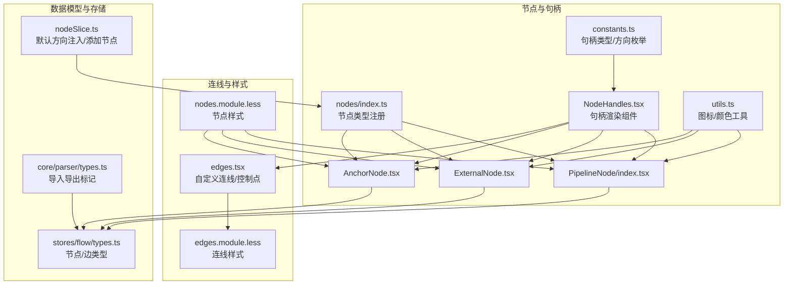
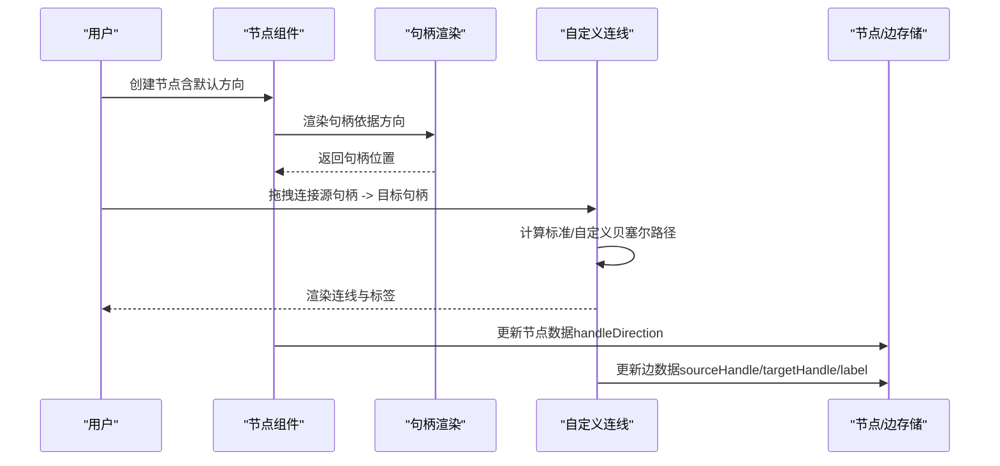
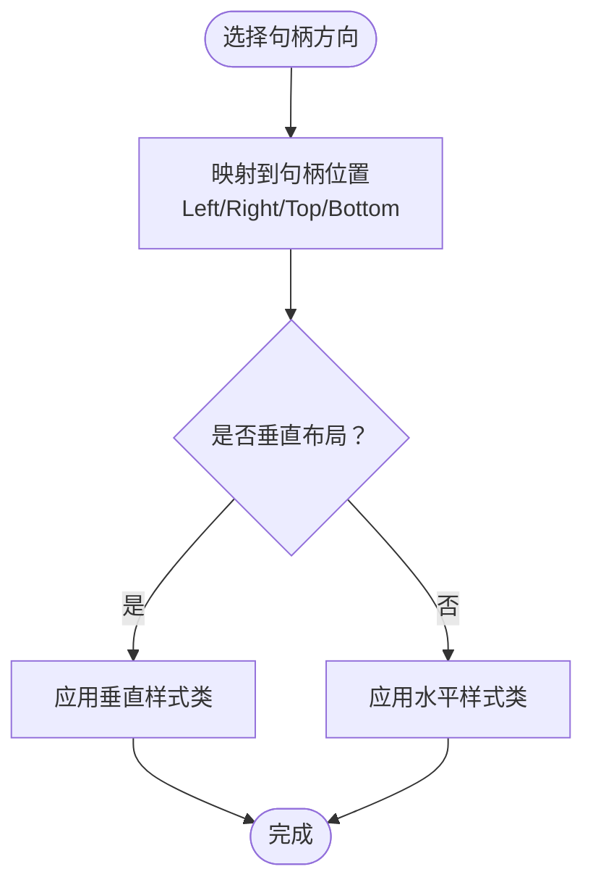
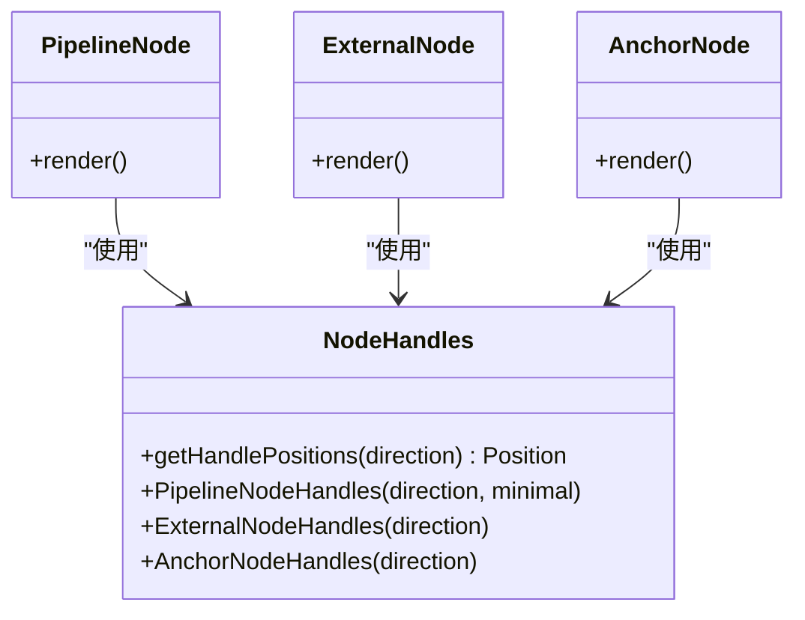
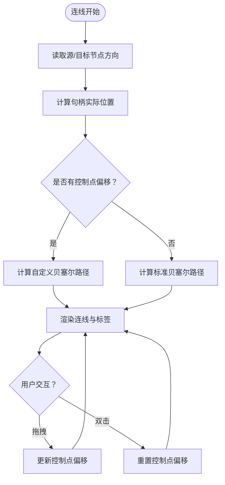
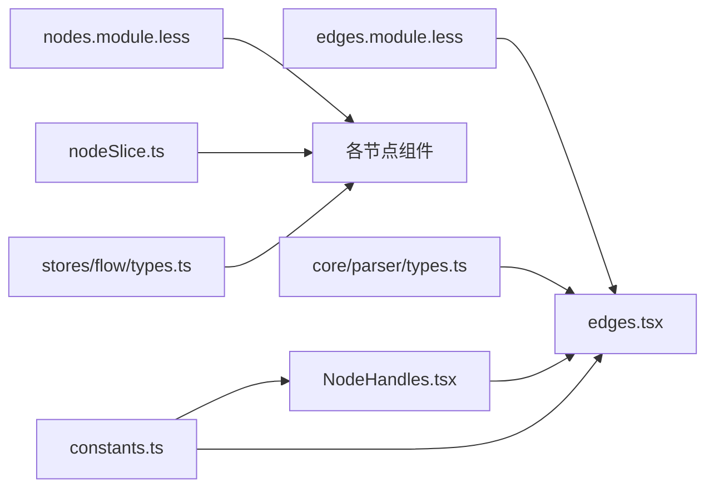

# 可定制节点连接点

<cite>
**本文引用的文件**
- [src/components/flow/nodes/index.ts](file://src/components/flow/nodes/index.ts)
- [src/components/flow/nodes/constants.ts](file://src/components/flow/nodes/constants.ts)
- [src/components/flow/nodes/utils.ts](file://src/components/flow/nodes/utils.ts)
- [src/components/flow/nodes/components/NodeHandles.tsx](file://src/components/flow/nodes/components/NodeHandles.tsx)
- [src/components/flow/edges.tsx](file://src/components/flow/edges.tsx)
- [src/stores/flow/types.ts](file://src/stores/flow/types.ts)
- [src/stores/flow/slices/nodeSlice.ts](file://src/stores/flow/slices/nodeSlice.ts)
- [src/components/flow/nodes/PipelineNode/index.tsx](file://src/components/flow/nodes/PipelineNode/index.tsx)
- [src/components/flow/nodes/ExternalNode.tsx](file://src/components/flow/nodes/ExternalNode.tsx)
- [src/components/flow/nodes/AnchorNode.tsx](file://src/components/flow/nodes/AnchorNode.tsx)
- [src/styles/edges.module.less](file://src/styles/edges.module.less)
- [src/styles/nodes.module.less](file://src/styles/nodes.module.less)
- [src/core/parser/types.ts](file://src/core/parser/types.ts)
</cite>

## 目录
1. [简介](#简介)
2. [项目结构](#项目结构)
3. [核心组件](#核心组件)
4. [架构总览](#架构总览)
5. [详细组件分析](#详细组件分析)
6. [依赖分析](#依赖分析)
7. [性能考虑](#性能考虑)
8. [故障排查指南](#故障排查指南)
9. [结论](#结论)

## 简介
本篇文档围绕“可定制节点连接点”展开，系统梳理了编辑器中节点句柄（Handle）的类型、布局方向、渲染与交互、以及连线（Edge）的可视化与可调性。重点包括：
- 节点句柄类型：目标句柄（Target）、错误句柄（Error）、跳转回退句柄（JumpBack）、普通输出句柄（Next）
- 句柄方向：支持“左入右出”、“右入左出”、“上入下出”、“下入上出”
- 句柄渲染：基于方向自动定位句柄位置，并提供极简/现代/经典等多风格
- 连线绘制：标准与自定义贝塞尔曲线、控制点拖拽、标签与样式分类
- 数据模型：节点与边的数据结构、句柄方向持久化与导入导出

## 项目结构
与“可定制节点连接点”直接相关的模块分布如下：
- 节点与句柄
  - 句柄常量与方向：[src/components/flow/nodes/constants.ts](file://src/components/flow/nodes/constants.ts)
  - 句柄渲染组件：[src/components/flow/nodes/components/NodeHandles.tsx](file://src/components/flow/nodes/components/NodeHandles.tsx)
  - 节点类型注册与导出：[src/components/flow/nodes/index.ts](file://src/components/flow/nodes/index.ts)
  - 节点样式与图标工具：[src/components/flow/nodes/utils.ts](file://src/components/flow/nodes/utils.ts)
  - 典型节点组件：PipelineNode、ExternalNode、AnchorNode
- 连线与交互
  - 自定义连线与控制点：[src/components/flow/edges.tsx](file://src/components/flow/edges.tsx)
  - 连线样式：[src/styles/edges.module.less](file://src/styles/edges.module.less)
- 数据模型与存储
  - 节点/边类型定义：[src/stores/flow/types.ts](file://src/stores/flow/types.ts)
  - 节点创建与默认方向注入：[src/stores/flow/slices/nodeSlice.ts](file://src/stores/flow/slices/nodeSlice.ts)
  - 导入导出与句柄方向标记：[src/core/parser/types.ts](file://src/core/parser/types.ts)

图表来源
- [src/components/flow/nodes/constants.ts](file://src/components/flow/nodes/constants.ts#L1-L45)
- [src/components/flow/nodes/components/NodeHandles.tsx](file://src/components/flow/nodes/components/NodeHandles.tsx#L1-L246)
- [src/components/flow/nodes/index.ts](file://src/components/flow/nodes/index.ts#L1-L22)
- [src/components/flow/nodes/utils.ts](file://src/components/flow/nodes/utils.ts#L1-L139)
- [src/components/flow/nodes/PipelineNode/index.tsx](file://src/components/flow/nodes/PipelineNode/index.tsx#L1-L221)
- [src/components/flow/nodes/ExternalNode.tsx](file://src/components/flow/nodes/ExternalNode.tsx#L1-L156)
- [src/components/flow/nodes/AnchorNode.tsx](file://src/components/flow/nodes/AnchorNode.tsx#L1-L156)
- [src/components/flow/edges.tsx](file://src/components/flow/edges.tsx#L1-L507)
- [src/styles/edges.module.less](file://src/styles/edges.module.less#L1-L98)
- [src/styles/nodes.module.less](file://src/styles/nodes.module.less#L1-L200)
- [src/stores/flow/types.ts](file://src/stores/flow/types.ts#L1-L294)
- [src/stores/flow/slices/nodeSlice.ts](file://src/stores/flow/slices/nodeSlice.ts#L1-L451)
- [src/core/parser/types.ts](file://src/core/parser/types.ts#L1-L97)

章节来源
- [src/components/flow/nodes/index.ts](file://src/components/flow/nodes/index.ts#L1-L22)
- [src/components/flow/nodes/constants.ts](file://src/components/flow/nodes/constants.ts#L1-L45)
- [src/components/flow/nodes/utils.ts](file://src/components/flow/nodes/utils.ts#L1-L139)
- [src/components/flow/nodes/components/NodeHandles.tsx](file://src/components/flow/nodes/components/NodeHandles.tsx#L1-L246)
- [src/components/flow/edges.tsx](file://src/components/flow/edges.tsx#L1-L507)
- [src/stores/flow/types.ts](file://src/stores/flow/types.ts#L1-L294)
- [src/stores/flow/slices/nodeSlice.ts](file://src/stores/flow/slices/nodeSlice.ts#L1-L451)
- [src/styles/edges.module.less](file://src/styles/edges.module.less#L1-L98)
- [src/styles/nodes.module.less](file://src/styles/nodes.module.less#L1-L200)
- [src/core/parser/types.ts](file://src/core/parser/types.ts#L1-L97)

## 核心组件
- 句柄类型与方向
  - 目标句柄（Target）、错误句柄（Error）、跳转回退句柄（JumpBack）、普通输出句柄（Next）
  - 句柄方向枚举：left-right、right-left、top-bottom、bottom-top
  - 默认方向与选项配置
- 句柄渲染
  - 根据方向自动设置句柄位置（左/右/上/下），并区分垂直与水平布局
  - 提供极简风格样式与多套视觉类名
- 连线与控制点
  - 标准与自定义贝塞尔曲线路径
  - 控制点拖拽调整曲线，双击重置
  - 标签渲染与样式分类（Next/Error/JumpBack/Error+JumpBack）
- 节点与边的数据模型
  - 节点数据包含 label、识别/动作参数、others、extras、handleDirection
  - 边数据包含 source/target、sourceHandle/targetHandle、label、attributes（如 jump_back/anchor）

章节来源
- [src/components/flow/nodes/constants.ts](file://src/components/flow/nodes/constants.ts#L1-L45)
- [src/components/flow/nodes/components/NodeHandles.tsx](file://src/components/flow/nodes/components/NodeHandles.tsx#L1-L246)
- [src/components/flow/edges.tsx](file://src/components/flow/edges.tsx#L1-L507)
- [src/stores/flow/types.ts](file://src/stores/flow/types.ts#L1-L294)

## 架构总览
以下图展示“可定制节点连接点”的端到端流程：节点创建时注入默认句柄方向；渲染阶段依据方向生成句柄；连线阶段根据源/目标节点的方向计算句柄位置，并绘制标准或自定义曲线；最终以样式类区分不同类型的连线。

图表来源
- [src/stores/flow/slices/nodeSlice.ts](file://src/stores/flow/slices/nodeSlice.ts#L95-L216)
- [src/components/flow/nodes/components/NodeHandles.tsx](file://src/components/flow/nodes/components/NodeHandles.tsx#L1-L246)
- [src/components/flow/edges.tsx](file://src/components/flow/edges.tsx#L188-L507)
- [src/stores/flow/types.ts](file://src/stores/flow/types.ts#L1-L294)

## 详细组件分析

### 句柄类型与方向
- 句柄类型
  - 源句柄：Next（普通输出）、Error（错误分支）
  - 目标句柄：Target（普通输入）、JumpBack（回退输入）
- 句柄方向
  - 四种方向枚举，分别映射到左/右/上/下的句柄位置
  - 默认方向与可选方向列表
- 句柄位置计算
  - 根据方向返回目标/源句柄的位置（Position.Left/Right/Top/Bottom）
  - 垂直布局与水平布局的样式区分

图表来源
- [src/components/flow/nodes/constants.ts](file://src/components/flow/nodes/constants.ts#L1-L45)
- [src/components/flow/nodes/components/NodeHandles.tsx](file://src/components/flow/nodes/components/NodeHandles.tsx#L1-L120)

章节来源
- [src/components/flow/nodes/constants.ts](file://src/components/flow/nodes/constants.ts#L1-L45)
- [src/components/flow/nodes/components/NodeHandles.tsx](file://src/components/flow/nodes/components/NodeHandles.tsx#L1-L120)

### 句柄渲染组件（NodeHandles）
- PipelineNodeHandles
  - 渲染目标句柄（Target/JumpBack）与源句柄（Next/Error）
  - 根据方向与风格（极简/非极简）选择样式类
  - 方向变化时触发内部更新，确保句柄位置正确
- ExternalNodeHandles
  - 仅渲染目标句柄（Target/JumpBack），并提供差异化定位
- AnchorNodeHandles
  - 渲染目标句柄（Target）与源句柄（Next），用于重定向场景

图表来源
- [src/components/flow/nodes/components/NodeHandles.tsx](file://src/components/flow/nodes/components/NodeHandles.tsx#L1-L246)
- [src/components/flow/nodes/PipelineNode/index.tsx](file://src/components/flow/nodes/PipelineNode/index.tsx#L1-L221)
- [src/components/flow/nodes/ExternalNode.tsx](file://src/components/flow/nodes/ExternalNode.tsx#L1-L156)
- [src/components/flow/nodes/AnchorNode.tsx](file://src/components/flow/nodes/AnchorNode.tsx#L1-L156)

章节来源
- [src/components/flow/nodes/components/NodeHandles.tsx](file://src/components/flow/nodes/components/NodeHandles.tsx#L1-L246)
- [src/components/flow/nodes/PipelineNode/index.tsx](file://src/components/flow/nodes/PipelineNode/index.tsx#L1-L221)
- [src/components/flow/nodes/ExternalNode.tsx](file://src/components/flow/nodes/ExternalNode.tsx#L1-L156)
- [src/components/flow/nodes/AnchorNode.tsx](file://src/components/flow/nodes/AnchorNode.tsx#L1-L156)

### 连线与控制点（MarkedEdge）
- 路径计算
  - 标准贝塞尔曲线：根据源/目标方向计算切线长度与控制点
  - 自定义贝塞尔曲线：支持控制点偏移，拖拽实时调整曲线
- 交互
  - 鼠标按下开始拖拽，移动过程中计算屏幕坐标到 Flow 坐标的差值并更新偏移
  - 双击重置控制点偏移
  - 键盘重置信号触发控制点复位
- 样式与标签
  - 根据 sourceHandle/targetHandle 与 JumpBack 标记设置样式类
  - 标签随曲线路径居中渲染，支持聚焦透明度与选中态
  - 控制点可配置显示，悬停与拖拽态样式区分

图表来源
- [src/components/flow/edges.tsx](file://src/components/flow/edges.tsx#L188-L507)
- [src/styles/edges.module.less](file://src/styles/edges.module.less#L1-L98)

章节来源
- [src/components/flow/edges.tsx](file://src/components/flow/edges.tsx#L1-L507)
- [src/styles/edges.module.less](file://src/styles/edges.module.less#L1-L98)

### 节点与边的数据模型
- 节点类型
  - PipelineNodeDataType：包含 label、识别/动作参数、others、extras、handleDirection
  - ExternalNodeDataType：包含 label、handleDirection
  - AnchorNodeDataType：包含 label、handleDirection
- 边类型
  - EdgeType：包含 source/target、sourceHandle/targetHandle、label、type（marked）、attributes（jump_back/anchor）
- 默认方向注入
  - 新增节点时从配置读取默认句柄方向，并写入节点 data.handleDirection
  - 若默认为“left-right”，则不显式写入，保持默认

章节来源
- [src/stores/flow/types.ts](file://src/stores/flow/types.ts#L1-L294)
- [src/stores/flow/slices/nodeSlice.ts](file://src/stores/flow/slices/nodeSlice.ts#L95-L216)

### 导入导出与句柄方向
- 导出配置标记
  - 使用特定标记前缀存储节点位置与句柄方向
- 导入时恢复
  - 解析外部配置，将句柄方向写入节点数据，保证还原连线布局

章节来源
- [src/core/parser/types.ts](file://src/core/parser/types.ts#L1-L97)

## 依赖分析
- 组件耦合
  - NodeHandles 依赖 constants 的方向枚举与 Position
  - edges 依赖 NodeHandles 的 getHandlePositions 与 constants 的句柄类型
  - 节点组件依赖 NodeHandles 渲染句柄
- 存储层
  - nodeSlice 在新增节点时注入默认方向
  - edges 从 flow store 读取节点方向并计算句柄位置
- 样式层
  - edges.module.less 定义连线与控制点样式
  - nodes.module.less 定义节点风格样式

图表来源
- [src/components/flow/nodes/constants.ts](file://src/components/flow/nodes/constants.ts#L1-L45)
- [src/components/flow/nodes/components/NodeHandles.tsx](file://src/components/flow/nodes/components/NodeHandles.tsx#L1-L246)
- [src/components/flow/edges.tsx](file://src/components/flow/edges.tsx#L1-L507)
- [src/stores/flow/types.ts](file://src/stores/flow/types.ts#L1-L294)
- [src/stores/flow/slices/nodeSlice.ts](file://src/stores/flow/slices/nodeSlice.ts#L1-L451)
- [src/core/parser/types.ts](file://src/core/parser/types.ts#L1-L97)
- [src/styles/edges.module.less](file://src/styles/edges.module.less#L1-L98)
- [src/styles/nodes.module.less](file://src/styles/nodes.module.less#L1-L200)

章节来源
- [src/components/flow/nodes/constants.ts](file://src/components/flow/nodes/constants.ts#L1-L45)
- [src/components/flow/nodes/components/NodeHandles.tsx](file://src/components/flow/nodes/components/NodeHandles.tsx#L1-L246)
- [src/components/flow/edges.tsx](file://src/components/flow/edges.tsx#L1-L507)
- [src/stores/flow/types.ts](file://src/stores/flow/types.ts#L1-L294)
- [src/stores/flow/slices/nodeSlice.ts](file://src/stores/flow/slices/nodeSlice.ts#L1-L451)
- [src/core/parser/types.ts](file://src/core/parser/types.ts#L1-L97)
- [src/styles/edges.module.less](file://src/styles/edges.module.less#L1-L98)
- [src/styles/nodes.module.less](file://src/styles/nodes.module.less#L1-L200)

## 性能考虑
- 句柄更新策略
  - 方向变更时通过内部更新函数触发多次延时更新，确保渲染稳定
- 连线计算
  - 控制点偏移仅在拖拽时计算路径，避免频繁重算
  - 标签与控制点的样式切换采用条件类名，减少不必要的重绘
- 选择与聚焦
  - 通过聚焦透明度与路径模式减少无关元素绘制，提升大图渲染效率

## 故障排查指南
- 句柄未出现在预期位置
  - 检查节点 data.handleDirection 是否正确写入与传递
  - 确认 NodeHandles 的方向映射与 Position 是否匹配
- 连线样式异常
  - 检查 edges 的 sourceHandle/targetHandle 与 JumpBack 标记
  - 确认 edges.module.less 中对应样式类是否启用
- 控制点不可拖拽或无法重置
  - 确认 showEdgeControlPoint 配置开启
  - 检查键盘重置信号与双击事件绑定
- 导入后方向不一致
  - 检查导入配置中句柄方向标记是否正确
  - 确认解析器对 handleDirection 的提取与写入

章节来源
- [src/components/flow/nodes/components/NodeHandles.tsx](file://src/components/flow/nodes/components/NodeHandles.tsx#L1-L246)
- [src/components/flow/edges.tsx](file://src/components/flow/edges.tsx#L1-L507)
- [src/styles/edges.module.less](file://src/styles/edges.module.less#L1-L98)
- [src/core/parser/types.ts](file://src/core/parser/types.ts#L1-L97)

## 结论
本系统通过“句柄类型 + 句柄方向 + 渲染组件 + 自定义连线”的组合，实现了高度可定制的节点连接点体验。用户可按需调整节点方向、拖拽控制点微调连线路径，并借助样式与标签清晰表达流程意图。配合导入导出对句柄方向的持久化，可在团队协作与版本管理中保持一致性。