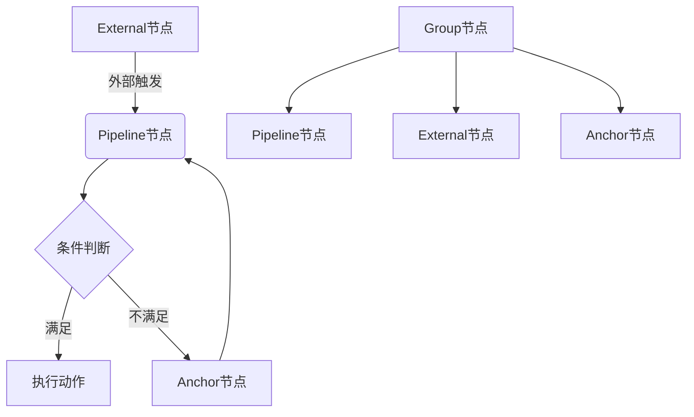

# 节点

<cite>
**本文档中引用的文件**  
- [nodeTypes.ts](file://src/components/flow/nodes/index.ts)
- [constants.ts](file://src/components/flow/nodes/constants.ts)
- [utils.ts](file://src/components/flow/nodes/utils.ts)
- [nodeSlice.ts](file://src/stores/flow/slices/nodeSlice.ts)
- [nodeUtils.ts](file://src/stores/flow/utils/nodeUtils.ts)
- [nodeTemplates.ts](file://src/data/nodeTemplates.ts)
- [GroupNode.tsx](file://src/components/flow/nodes/GroupNode.tsx)
- [GroupEditor.tsx](file://src/components/panels/node-editors/GroupEditor.tsx)
- [NodeContextMenu.tsx](file://src/components/flow/nodes/nodeContextMenu.tsx)
- [PipelineNode.tsx](file://src/components/flow/nodes/PipelineNode/index.tsx)
- [ExternalNode.tsx](file://src/components/flow/nodes/ExternalNode.tsx)
- [AnchorNode.tsx](file://src/components/flow/nodes/AnchorNode.tsx)
- [fields.ts](file://src/core/fields/action/fields.ts)
- [fields.ts](file://src/core/fields/recognition/fields.ts)
- [index.ts](file://src/core/fields/index.ts)
- [types.ts](file://src/core/fields/types.ts)
- [configStore.ts](file://src/stores/configStore.ts)
- [ConfigPanel.tsx](file://src/components/panels/ConfigPanel.tsx)
- [nodes.module.less](file://src/styles/nodes.module.less)
- [PanelConfigSection.tsx](file://src/components/panels/config/PanelConfigSection.tsx)
</cite>

## 更新摘要
**已更新内容**   
- 在"核心节点类型"部分新增GroupNode（分组节点）的详细说明
- 在"节点渲染机制"部分更新GroupNode的视觉设计和交互功能
- 在"状态管理机制（Zustand store）"部分新增分组节点的状态管理方法
- 在"节点样式配置"部分新增GroupNode的颜色主题系统
- 在"节点可扩展性设计"部分新增分组节点的模板定义
- 新增"分组节点功能详解"专门章节，涵盖父子关系管理、自动布局等功能
- 更新"实际使用示例"部分以包含分组节点的操作流程

## 目录

1. [引言](#引言)
2. [核心节点类型](#核心节点类型)
3. [节点渲染机制](#节点渲染机制)
4. [状态管理机制（Zustand store）](#状态管理机制zustand-store)
5. [字段配置模型（fields.ts）](#字段配置模型fieldsts)
6. [节点可扩展性设计与模板定义](#节点可扩展性设计与模板定义)
7. [节点与字段面板的数据绑定](#节点与字段面板的数据绑定)
8. [节点的JSON序列化结构](#节点的json序列化结构)
9. [分组节点功能详解](#分组节点功能详解)
10. [极简风格节点颜色映射](#极简风格节点颜色映射)
11. [实际使用示例](#实际使用示例)
12. [总结](#总结)

## 引言

MaaPipelineEditor 是一个用于构建自动化任务流程的可视化编辑器，其核心功能依赖于灵活的节点系统。节点是流程图中的基本执行单元，通过不同类型节点的组合与连接，用户可以构建复杂的自动化逻辑。本文档将深入解析该系统中的四种核心节点类型：**Pipeline节点**、**External节点**、**Anchor节点**和**Group节点**，从代码实现层面详细阐述其渲染机制、状态管理、字段模型、可扩展性设计以及与UI组件的交互方式。

**Section sources**
- [index.ts](file://src/components/flow/nodes/index.ts#L1-L14)
- [constants.ts](file://src/components/flow/nodes/constants.ts#L1-L14)

## 核心节点类型

MaaPipelineEditor 定义了四种核心节点类型，每种类型在自动化流程中扮演不同的角色：

### Pipeline节点（执行自动化任务的核心单元）

Pipeline节点是执行自动化任务的核心单元。每个Pipeline节点包含识别（recognition）和动作（action）两个主要部分，用于定义"在什么条件下执行什么操作"。例如，识别屏幕上某个图标（如"开始按钮"），然后执行点击操作。它还包含"其他"（others）配置，如前后延迟时间。在极简风格下，Pipeline节点仅显示一个80x80像素的彩色方框和节点名称，方框颜色根据识别类型动态变化。

### External节点（用于调用外部服务或脚本）

External节点作为流程的入口或出口，用于接收外部触发或向外部系统发送信号。它只有一个目标句柄（target handle），表示流程可以从外部跳转到该节点。这种节点常用于构建模块化的子流程或与外部API集成。在极简风格下，External节点的视觉表现与其他节点一致，通过颜色区分。

### Anchor节点（作为流程跳转或条件分支的锚点）

Anchor节点（重定向节点）作为流程跳转的锚点。它同样只有一个目标句柄，允许流程中的其他节点（如Pipeline节点）通过"跳转"逻辑跳转到该节点。这为实现复杂的流程控制（如循环、条件分支）提供了基础。在极简风格下，Anchor节点的视觉表现与其他节点一致，通过颜色区分。

### Group节点（流程分组管理的核心单元）

Group节点是流程分组管理的核心单元，用于将多个相关节点组织在一个容器中。它具有以下特性：
- **容器结构**：采用虚线边框的容器设计，包含标题栏和内容区域
- **颜色主题**：支持蓝色、绿色、紫色、橙色、灰色五种颜色主题
- **父子关系**：子节点相对于分组节点的绝对位置转换为相对坐标
- **自动布局**：根据子节点自动计算分组容器的尺寸和位置
- **拖拽调整**：支持拖拽调整分组容器的大小和位置



**Diagram sources**
- [constants.ts](file://src/components/flow/nodes/constants.ts#L8-L13)
- [ExternalNode.tsx](file://src/components/flow/nodes/ExternalNode.tsx#L9-L22)
- [AnchorNode.tsx](file://src/components/flow/nodes/AnchorNode.tsx#L9-L22)
- [GroupNode.tsx](file://src/components/flow/nodes/GroupNode.tsx#L1-L180)

**Section sources**
- [constants.ts](file://src/components/flow/nodes/constants.ts#L13-L20)
- [GroupNode.tsx](file://src/components/flow/nodes/GroupNode.tsx#L1-L180)

## 节点渲染机制

节点的渲染基于React Flow库，通过自定义节点组件实现。系统通过`nodeTypes`映射将节点类型与对应的React组件关联。

### 节点类型注册

在`src/components/flow/nodes/index.ts`中，通过`nodeTypes`对象将`NodeTypeEnum`枚举值映射到具体的React组件：

```typescript
export const nodeTypes = {
  [NodeTypeEnum.Pipeline]: PipelineNodeMemo,
  [NodeTypeEnum.External]: ExternalNodeMemo,
  [NodeTypeEnum.Anchor]: AnchorNodeMemo,
  [NodeTypeEnum.Sticker]: StickerNodeMemo,
  [NodeTypeEnum.Group]: GroupNodeMemo,
};
```

React Flow在渲染时会根据节点的`type`属性查找并使用对应的组件。

### Pipeline节点渲染

`PipelineNode`组件根据全局配置的样式（现代、经典或极简）动态选择渲染`ModernContent`、`ClassicContent`或`MinimalContent`。其核心是一个带有句柄（Handle）的div容器，句柄用于建立节点间的连接。

### Group节点渲染

`GroupNode`组件采用独特的容器设计，具有以下特征：

1. **容器结构**：使用`NodeResizer`组件提供拖拽调整功能，支持最小宽度200px和最小高度150px
2. **颜色主题**：通过`GROUP_COLOR_THEMES`配置实现五种颜色主题的动态切换
3. **标题栏**：包含可编辑的标题输入框，支持直接修改分组名称
4. **内容区域**：子节点将渲染在内容区域内，支持嵌套分组
5. **选中状态**：选中时显示蓝色外发光效果，提升视觉反馈

### 极简风格节点渲染

当`nodeStyle`配置为"minimal"时，系统启用极简风格。`PipelineNode`组件会渲染`MinimalContent`组件，该组件具有以下特征：

1. **紧凑布局**：节点整体宽度固定为80px，高度自适应，采用垂直布局，包含图标和名称。
2. **彩色方框**：主体为80x80像素的方框，带有2px实线边框，边框和背景颜色根据识别类型动态变化。
3. **圆形句柄**：连接点为直径10px的圆形手柄，带有白色边框和阴影，悬停时放大至14px。
4. **图标居中**：识别类型图标居中显示在方框内，大小为28px。
5. **名称显示**：节点名称显示在方框下方，限制为两行，超出部分显示省略号。

```mermaid
graph TD
A[开始] --> B{nodeStyle === "minimal"?}
B --> |是| C[渲染MinimalContent]
B --> |否| D{nodeStyle === "modern"?}
D --> |是| E[渲染ModernContent]
D --> |否| F[渲染ClassicContent]
```

**Diagram sources**
- [PipelineNode/index.tsx](file://src/components/flow/nodes/PipelineNode/index.tsx#L127-L134)
- [MinimalContent.tsx](file://src/components/flow/nodes/PipelineNode/MinimalContent.tsx#L1-L85)
- [nodes.module.less](file://src/styles/nodes.module.less#L300-L401)

**Section sources**
- [PipelineNode/index.tsx](file://src/components/flow/nodes/PipelineNode/index.tsx#L108-L134)
- [GroupNode.tsx](file://src/components/flow/nodes/GroupNode.tsx#L112-L158)
- [MinimalContent.tsx](file://src/components/flow/nodes/PipelineNode/MinimalContent.tsx#L1-L85)
- [nodes.module.less](file://src/styles/nodes.module.less#L300-L401)

## 状态管理机制（Zustand store）

整个流程图的状态由Zustand库管理，其中`nodeSlice.ts`负责管理所有与节点相关的状态和操作。

### 核心状态

- `nodes`: 存储所有节点对象的数组，包括分组节点
- `nodeIdCounter`: 用于生成唯一节点ID的计数器

### 核心操作

#### `addNode`

`addNode`方法是创建新节点的核心。它根据传入的`type`参数，调用`createPipelineNode`、`createExternalNode`、`createAnchorNode`或`createGroupNode`来生成节点实例。该方法还处理节点标签的自动生成与查重，并可选择性地将新节点与当前选中的节点连接。

#### `updateNodes`

此方法处理节点的更新，如位置移动、选中状态变化等。它使用React Flow提供的`applyNodeChanges`函数来应用变更，并根据变更类型（如删除、移动）决定是否保存历史记录。

#### `setNodeData`

这是更新节点内部数据（即`data`字段）的关键方法。它支持更新识别、动作、"其他"和分组节点的标签及颜色。当更改识别或动作的`type`时，该方法会智能地清理旧类型中不存在的参数，并为新类型添加必需的默认参数，确保数据结构的完整性。

### 分组节点状态管理

#### `groupSelectedNodes`

`groupSelectedNodes`方法实现了分组功能的核心逻辑：
1. 计算选中节点的包围盒，包括PADDING和HEADER_HEIGHT
2. 生成唯一的分组ID，避免重复
3. 创建Group节点，设置初始位置和尺寸
4. 将选中节点转换为相对坐标，设置parentId
5. 确保Group节点在子节点之前排列

#### `ungroupNodes`

`ungroupNodes`方法负责解散分组：
1. 获取分组节点的绝对位置
2. 将子节点的位置转换为绝对坐标，清除parentId
3. 清理被删除节点的选中状态

#### `attachNodeToGroup` 和 `detachNodeFromGroup`

这两个方法分别处理节点的加入和移出分组：
1. 将节点位置转换为相对坐标（加入）或绝对坐标（移出）
2. 更新节点的parentId属性
3. 重新排列节点顺序

**Section sources**
- [nodeSlice.ts](file://src/stores/flow/slices/nodeSlice.ts#L23-L156)
- [nodeSlice.ts](file://src/stores/flow/slices/nodeSlice.ts#L510-L695)
- [nodeUtils.ts](file://src/stores/flow/utils/nodeUtils.ts#L10-L102)
- [configStore.ts](file://src/stores/configStore.ts#L82-L83)

## 字段配置模型（fields.ts）

节点的可配置字段由`src/core/fields`目录下的模块统一管理，形成了一套清晰的配置模型。

### 核心概念

- `FieldType`: 定义单个字段的元数据，包括类型、是否必填、默认值、描述等。
- `FieldsType`: 定义一个功能模块（如"点击"动作）所需的所有字段集合。
- `recoFields` 和 `actionFields`: 分别是所有识别类型和动作类型的配置映射表。

### 动作字段配置

`action/fields.ts`文件定义了所有动作类型的字段。例如，`Click`动作需要`clickTarget`（点击目标）和`targetOffset`（目标偏移）等字段。每个字段的配置都包含了其UI表现形式（如输入框、下拉框）和默认值。

### 识别字段配置

`recognition/fields.ts`文件定义了所有识别类型的字段。例如，`OCR`（文字识别）需要`roi`（识别区域）、`ocrExpected`（期望文本）等字段。

### 分组节点字段配置

分组节点的字段配置相对简单，只包含：
- `label`: 分组名称，默认为"分组"+序号
- `color`: 颜色主题，默认为"blue"

### 参数键生成

`index.ts`中的`generateParamKeys`函数会遍历`recoFields`和`actionFields`，为每种类型生成一个`ParamKeysType`对象，包含所有参数、必需参数和默认值。这为`setNodeData`中的智能参数清理和填充提供了数据支持。

**Section sources**
- [fields.ts](file://src/core/fields/action/fields.ts#L1-L123)
- [fields.ts](file://src/core/fields/recognition/fields.ts#L1-L101)
- [index.ts](file://src/core/fields/index.ts#L1-L39)
- [types.ts](file://src/core/fields/types.ts#L1-L32)
- [types.ts](file://src/stores/flow/types.ts#L159-L163)

## 节点可扩展性设计与模板定义

系统通过`nodeTemplates.ts`实现了节点的可扩展性，允许轻松添加新的节点模板。

### 模板定义

`nodeTemplates`是一个`NodeTemplateType`对象数组。每个模板定义了：
- `label`: 模板在添加面板中显示的名称。
- `iconName`: 使用的图标名称。
- `data`: 一个函数，返回该模板的默认数据结构。

### 分组节点模板

虽然分组节点不通过模板面板添加，但可以通过编程方式创建：
```typescript
{
  label: "新建分组",
  color: "blue",
  type: NodeTypeEnum.Group
}
```

### 扩展新节点

要添加一个新节点模板，只需在`nodeTemplates`数组中添加一个新对象。例如，要添加一个"启动应用"的快捷模板，可以这样定义：

```typescript
{
  label: "启动应用",
  iconName: "icon-start",
  data: () => ({
    action: {
      type: "StartApp",
      param: { package: "com.example.app" }
    }
  })
}
```

当用户从添加面板选择此模板时，`data`函数的返回值会被作为新节点的初始数据。

**Section sources**
- [nodeTemplates.ts](file://src/data/nodeTemplates.ts#L1-L94)

## 节点与字段面板的数据绑定

字段面板（FieldPanel）是用户配置节点属性的主要UI。它与节点状态通过Zustand store紧密绑定。

当用户选中一个节点时，`FieldPanel`会从store中获取该节点的`data`，并根据其`recognition.type`和`action.type`动态渲染对应的字段配置。用户在面板中的每一次修改，都会触发`setNodeData`方法，从而更新store中的节点数据，实现双向数据绑定。

对于分组节点，系统提供了专门的`GroupEditor`组件，支持直接修改分组名称和颜色主题。

**Section sources**
- [nodeSlice.ts](file://src/stores/flow/slices/nodeSlice.ts#L158-L247)
- [GroupEditor.tsx](file://src/components/panels/node-editors/GroupEditor.tsx#L1-L96)

## 节点的JSON序列化结构

当流程图被导出为JSON时，所有节点都会被序列化为标准的JSON对象。一个典型的Pipeline节点序列化后如下所示：

```json
{
  "id": "1",
  "type": "pipeline",
  "data": {
    "label": "新建节点1",
    "recognition": {
      "type": "TemplateMatch",
      "param": {
        "template": ["button.png"]
      }
    },
    "action": {
      "type": "Click",
      "param": {
        "target": [0, 0, 100, 100]
      }
    },
    "others": {
      "pre_delay": 1000
    }
  },
  "position": { "x": 100, "y": 200 }
}
```

分组节点的序列化结构：
```json
{
  "id": "group_1",
  "type": "group",
  "data": {
    "label": "分组1",
    "color": "blue"
  },
  "position": { "x": 50, "y": 50 },
  "style": { "width": 300, "height": 200 }
}
```

External和Anchor节点的结构更简单，主要包含`id`、`type`、`data.label`和`position`。

**Section sources**
- [nodeSlice.ts](file://src/stores/flow/slices/nodeSlice.ts#L250-L252)
- [nodeUtils.ts](file://src/stores/flow/utils/nodeUtils.ts#L27-L46)

## 分组节点功能详解

分组节点是MaaPipelineEditor的重要增强功能，提供了强大的流程组织能力。

### 视觉设计

分组节点采用容器式设计，具有以下视觉特征：
- **虚线边框**：使用2px虚线边框，清晰标识容器边界
- **颜色主题**：支持五种颜色主题，通过CSS变量实现动态切换
- **标题栏**：包含可编辑的标题输入框，支持直接修改
- **内容区域**：子节点渲染在此区域内，支持嵌套分组

### 颜色主题系统

分组节点支持五种颜色主题，每种主题包含背景色、边框色、标题背景色和文字色：

```typescript
export const GROUP_COLOR_THEMES: Record<
  GroupColorTheme,
  { bg: string; border: string; headerBg: string; text: string }
> = {
  blue: {
    bg: "rgba(24, 144, 255, 0.06)",
    border: "rgba(24, 144, 255, 0.4)",
    headerBg: "rgba(24, 144, 255, 0.12)",
    text: "#1890ff",
  },
  green: {
    bg: "rgba(82, 196, 26, 0.06)",
    border: "rgba(82, 196, 26, 0.4)",
    headerBg: "rgba(82, 196, 26, 0.12)",
    text: "#52c41a",
  },
  purple: {
    bg: "rgba(114, 46, 209, 0.06)",
    border: "rgba(114, 46, 209, 0.4)",
    headerBg: "rgba(114, 46, 209, 0.12)",
    text: "#722ed1",
  },
  orange: {
    bg: "rgba(250, 140, 22, 0.06)",
    border: "rgba(250, 140, 22, 0.4)",
    headerBg: "rgba(250, 140, 22, 0.12)",
    text: "#fa8c16",
  },
  gray: {
    bg: "rgba(0, 0, 0, 0.03)",
    border: "rgba(0, 0, 0, 0.1)",
    headerBg: "rgba(0, 0, 0, 0.06)",
    text: "#595959",
  },
};
```

### 右键菜单功能

分组节点拥有专用的右键菜单，提供以下功能：
- **分组颜色**：快速切换颜色主题
- **解散分组**：将子节点移出分组并保持相对位置
- **删除分组**：先解散子节点再删除分组

### 自动布局和父子关系管理

分组节点实现了智能的自动布局和父子关系管理：

#### 自动布局
1. **包围盒计算**：根据子节点的实际尺寸计算分组容器的最佳尺寸
2. **间距调整**：自动添加PADDING（40px）和HEADER_HEIGHT（36px）
3. **位置定位**：将分组容器定位在子节点的左上角

#### 父子关系管理
1. **相对坐标转换**：子节点的绝对位置转换为相对坐标
2. **层级维护**：确保分组节点始终位于子节点之前
3. **拖拽同步**：拖拽分组容器时，子节点同步移动

### 交互功能

分组节点支持多种交互操作：
- **拖拽调整**：通过NodeResizer组件调整容器大小
- **双击编辑**：双击标题栏进入编辑模式
- **选中高亮**：选中时显示蓝色外发光效果
- **嵌套支持**：支持在分组内创建新的分组

**Section sources**
- [GroupNode.tsx](file://src/components/flow/nodes/GroupNode.tsx#L1-L180)
- [GroupEditor.tsx](file://src/components/panels/node-editors/GroupEditor.tsx#L1-L96)
- [NodeContextMenu.tsx](file://src/components/flow/nodes/nodeContextMenu.tsx#L354-L403)
- [nodeSlice.ts](file://src/stores/flow/slices/nodeSlice.ts#L510-L695)

## 极简风格节点颜色映射

极简风格节点通过颜色编码来快速区分不同的识别类型，提升用户的视觉识别效率。

### 颜色映射机制

颜色映射由`getMinimalNodeColor`函数实现，该函数根据识别类型返回对应的主色和背景色：

```typescript
export const getMinimalNodeColor = (recoType: string): MinimalNodeColor => {
  switch (recoType) {
    case "OCR":
      return { primary: "#1890ff", background: "#e6f4ff" };
    case "TemplateMatch":
      return { primary: "#13c2c2", background: "#e6fffb" };
    case "ColorMatch":
      return { primary: "#722ed1", background: "#f9f0ff" };
    case "FeatureMatch":
      return { primary: "#2f54eb", background: "#f0f5ff" };
    case "NeuralNetworkClassify":
    case "NeuralNetworkDetect":
      return { primary: "#9254de", background: "#f9f0ff" };
    case "And":
    case "Or":
      return { primary: "#fa8c16", background: "#fff7e6" };
    case "Custom":
      return { primary: "#52c41a", background: "#f6ffed" };
    default:
      return { primary: "#595959", background: "#fafafa" };
  }
};
```

### 颜色方案

| 识别类型 | 主色 | 背景色 | 说明 |
|---------|------|--------|------|
| OCR | #1890ff (科技蓝) | #e6f4ff | 文字识别 |
| TemplateMatch | #13c2c2 (青色) | #e6fffb | 图像识别 |
| ColorMatch | #722ed1 (紫色) | #f9f0ff | 颜色识别 |
| FeatureMatch | #2f54eb (深蓝) | #f0f5ff | 特征匹配 |
| NeuralNetwork | #9254de (渐变紫) | #f9f0ff | AI识别 |
| Logic | #fa8c16 (橙色) | #fff7e6 | 逻辑判断 |
| Custom | #52c41a (绿色) | #f6ffed | 自定义 |
| Default | #595959 (灰色) | #fafafa | 默认 |

**Section sources**
- [utils.ts](file://src/components/flow/nodes/utils.ts#L110-L138)
- [nodes.module.less](file://src/styles/nodes.module.less#L300-L358)

## 实际使用示例

### 基础节点操作

1. **添加节点**：用户在节点添加面板中选择"图像识别"模板，编辑器调用`addNode`并传入该模板的`data`函数返回值，创建一个预配置了"图像识别"和"点击"动作的Pipeline节点。
2. **配置节点**：用户选中该节点，字段面板显示"图像识别"和"点击"的配置项。用户修改"期望文本"和"点击目标"，这些更改通过`setNodeData`实时更新节点数据。
3. **连接节点**：用户从一个External节点拖出连接线到该Pipeline节点，创建一个执行入口。
4. **切换极简风格**：用户在配置面板中将`nodeStyle`设置为"minimal"。所有Pipeline节点变为80x80像素的彩色方框，颜色根据识别类型自动变化，如OCR节点显示为蓝色，图像识别节点显示为青色。
5. **导出流程**：用户导出流程，系统将所有节点和边序列化为JSON，其中包含了每个节点的完整配置。

### 分组节点操作

1. **创建分组**：用户选中多个Pipeline节点，右键选择"创建分组"或使用快捷键。系统自动计算包围盒，创建一个包含这些节点的分组容器。
2. **编辑分组**：用户双击分组标题进入编辑模式，修改分组名称。用户右键分组选择"分组颜色"，切换到绿色主题。
3. **调整布局**：用户拖拽分组边缘调整容器大小，子节点自动适应新的布局。
4. **移动分组**：用户拖拽分组容器到新的位置，所有子节点同步移动，保持相对位置不变。
5. **解散分组**：用户右键分组选择"解散分组"，子节点保持原有绝对位置，脱离分组关系。

### 高级功能示例

1. **嵌套分组**：用户在现有分组内创建新的分组，实现多层嵌套的组织结构。
2. **父子关系**：用户将未分组的节点拖拽到分组内，或从分组内拖拽节点到外部，系统自动处理坐标转换和层级关系。
3. **批量操作**：用户可以对分组内的所有节点执行统一操作，如批量修改参数或删除。

## 总结

MaaPipelineEditor的节点系统通过清晰的类型划分、基于React Flow的灵活渲染、Zustand驱动的集中式状态管理、模块化的字段配置模型以及可扩展的模板机制，构建了一个强大且易于使用的可视化编程环境。特别是新增的分组节点功能，通过容器式设计、颜色主题系统、自动布局和父子关系管理，显著提升了复杂流程图的组织和管理能力。

理解这一系统的核心组件和交互逻辑，对于开发新功能或进行深度定制至关重要。分组节点不仅增强了用户体验，还为未来的功能扩展奠定了坚实的基础。