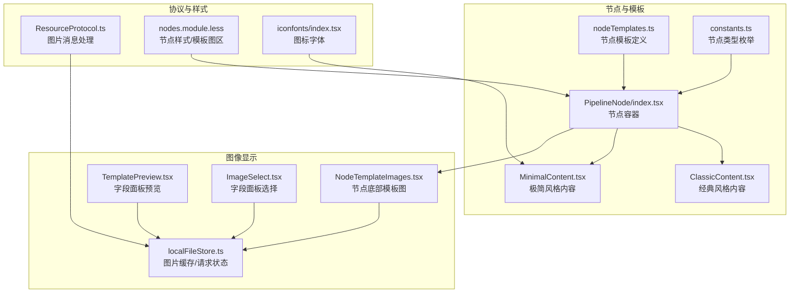
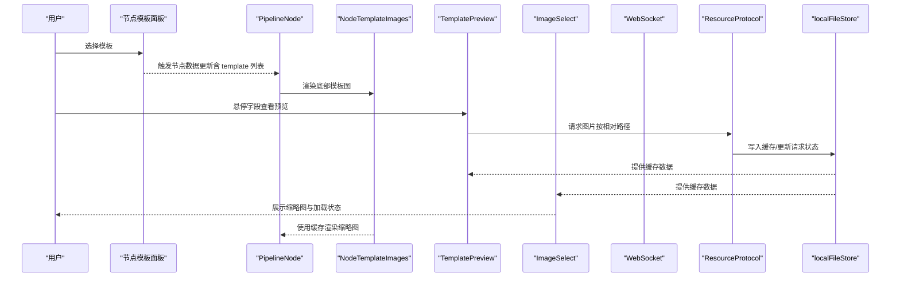
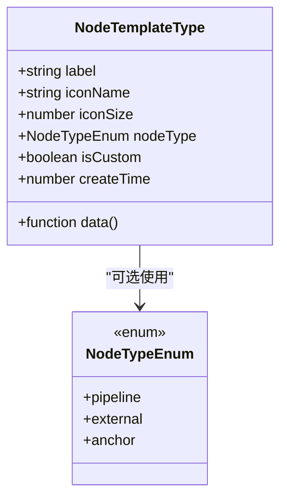
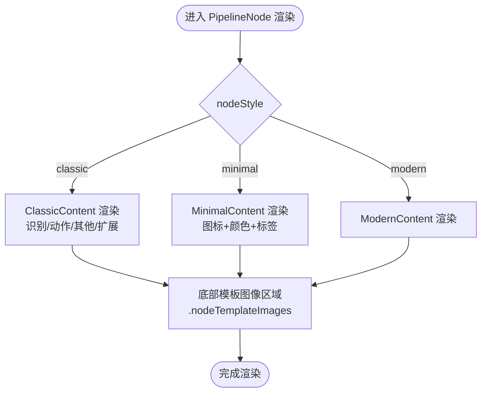
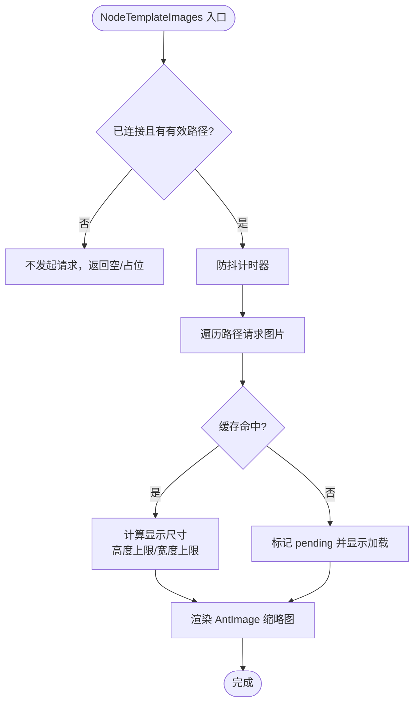
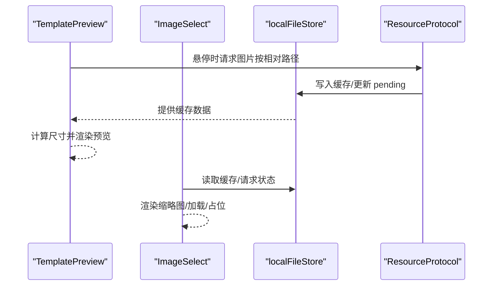
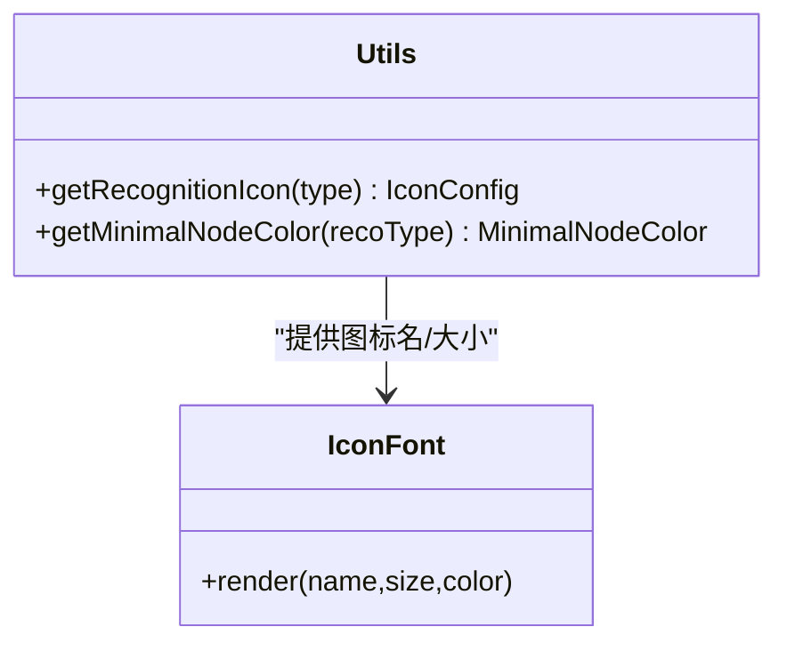
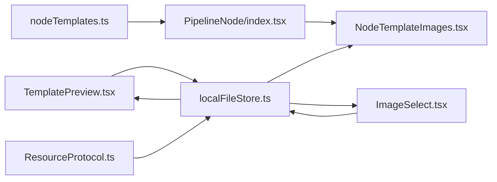

# 节点模板图像

<cite>
**本文引用的文件**
- [src/data/nodeTemplates.ts](file://src/data/nodeTemplates.ts)
- [src/components/flow/nodes/constants.ts](file://src/components/flow/nodes/constants.ts)
- [src/components/flow/nodes/utils.ts](file://src/components/flow/nodes/utils.ts)
- [src/components/flow/nodes/PipelineNode/index.tsx](file://src/components/flow/nodes/PipelineNode/index.tsx)
- [src/components/flow/nodes/PipelineNode/ClassicContent.tsx](file://src/components/flow/nodes/PipelineNode/ClassicContent.tsx)
- [src/components/flow/nodes/PipelineNode/MinimalContent.tsx](file://src/components/flow/nodes/PipelineNode/MinimalContent.tsx)
- [src/components/flow/nodes/components/NodeTemplateImages.tsx](file://src/components/flow/nodes/components/NodeTemplateImages.tsx)
- [src/components/panels/field/items/TemplatePreview.tsx](file://src/components/panels/field/items/TemplatePreview.tsx)
- [src/components/panels/field/items/ImageSelect.tsx](file://src/components/panels/field/items/ImageSelect.tsx)
- [src/stores/localFileStore.ts](file://src/stores/localFileStore.ts)
- [src/services/protocols/ResourceProtocol.ts](file://src/services/protocols/ResourceProtocol.ts)
- [src/styles/nodes.module.less](file://src/styles/nodes.module.less)
- [src/components/iconfonts/index.tsx](file://src/components/iconfonts/index.tsx)
- [src/components/iconfonts/helper.ts](file://src/components/iconfonts/helper.ts)
</cite>

## 目录
1. [简介](#简介)
2. [项目结构](#项目结构)
3. [核心组件](#核心组件)
4. [架构总览](#架构总览)
5. [详细组件分析](#详细组件分析)
6. [依赖关系分析](#依赖关系分析)
7. [性能考量](#性能考量)
8. [故障排查指南](#故障排查指南)
9. [结论](#结论)

## 简介
本节聚焦“节点模板图像”能力，即在节点编辑与可视化过程中，如何通过模板字段（如 template）展示与管理图像资源，并在节点的不同风格（经典/极简/现代）中呈现这些图像。该能力贯穿以下方面：
- 节点模板定义与默认数据填充
- 节点内容渲染（含模板图像区域）
- 字段面板中的模板图像预览与选择
- 本地资源缓存与图片请求协议
- 图像尺寸计算与显示策略

## 项目结构
围绕“节点模板图像”的关键文件分布如下：
- 模板与节点类型：nodeTemplates.ts、constants.ts
- 节点渲染：PipelineNode 的多种风格内容组件
- 图像显示：NodeTemplateImages、TemplatePreview、ImageSelect
- 状态与协议：localFileStore、ResourceProtocol
- 样式与图标：nodes.module.less、iconfonts

图表来源
- [src/data/nodeTemplates.ts](file://src/data/nodeTemplates.ts#L1-L96)
- [src/components/flow/nodes/constants.ts](file://src/components/flow/nodes/constants.ts#L1-L45)
- [src/components/flow/nodes/PipelineNode/index.tsx](file://src/components/flow/nodes/PipelineNode/index.tsx#L108-L152)
- [src/components/flow/nodes/PipelineNode/ClassicContent.tsx](file://src/components/flow/nodes/PipelineNode/ClassicContent.tsx#L1-L77)
- [src/components/flow/nodes/PipelineNode/MinimalContent.tsx](file://src/components/flow/nodes/PipelineNode/MinimalContent.tsx#L1-L58)
- [src/components/flow/nodes/components/NodeTemplateImages.tsx](file://src/components/flow/nodes/components/NodeTemplateImages.tsx#L1-L119)
- [src/components/panels/field/items/TemplatePreview.tsx](file://src/components/panels/field/items/TemplatePreview.tsx#L1-L185)
- [src/components/panels/field/items/ImageSelect.tsx](file://src/components/panels/field/items/ImageSelect.tsx#L166-L249)
- [src/stores/localFileStore.ts](file://src/stores/localFileStore.ts#L1-L271)
- [src/services/protocols/ResourceProtocol.ts](file://src/services/protocols/ResourceProtocol.ts#L1-L146)
- [src/styles/nodes.module.less](file://src/styles/nodes.module.less#L226-L259)
- [src/components/iconfonts/index.tsx](file://src/components/iconfonts/index.tsx#L1-L407)

章节来源
- [src/data/nodeTemplates.ts](file://src/data/nodeTemplates.ts#L1-L96)
- [src/components/flow/nodes/constants.ts](file://src/components/flow/nodes/constants.ts#L1-L45)
- [src/styles/nodes.module.less](file://src/styles/nodes.module.less#L226-L259)

## 核心组件
- 节点模板与默认数据
  - nodeTemplates.ts 定义了节点模板数组，包含标签、图标名、可选的节点类型与默认数据工厂函数。例如“文字识别”“图像识别”等模板会提供 recognition/action 的初始参数结构，便于用户快速创建节点。
- 节点类型枚举
  - constants.ts 提供 NodeTypeEnum（pipeline/external/anchor），用于区分节点类型，影响图标与行为。
- 节点渲染
  - PipelineNode/index.tsx 根据当前风格渲染 ClassicContent 或 MinimalContent；节点底部预留模板图像区域，由 NodeTemplateImages 渲染。
- 图像显示组件
  - NodeTemplateImages.tsx：在节点底部展示 template 字段的图片缩略图，具备请求防抖、尺寸计算与缓存使用。
  - TemplatePreview.tsx：在字段面板中悬停预览模板图片，支持多图与尺寸适配。
  - ImageSelect.tsx：字段选择器中展示图片缩略图与加载状态。
- 状态与协议
  - localFileStore.ts：维护资源包、图片列表、图片缓存与请求挂起集合。
  - ResourceProtocol.ts：处理来自 LocalBridge 的资源与图片消息，写入缓存或更新请求状态。

章节来源
- [src/data/nodeTemplates.ts](file://src/data/nodeTemplates.ts#L1-L96)
- [src/components/flow/nodes/constants.ts](file://src/components/flow/nodes/constants.ts#L1-L45)
- [src/components/flow/nodes/PipelineNode/index.tsx](file://src/components/flow/nodes/PipelineNode/index.tsx#L108-L152)
- [src/components/flow/nodes/components/NodeTemplateImages.tsx](file://src/components/flow/nodes/components/NodeTemplateImages.tsx#L1-L119)
- [src/components/panels/field/items/TemplatePreview.tsx](file://src/components/panels/field/items/TemplatePreview.tsx#L1-L185)
- [src/components/panels/field/items/ImageSelect.tsx](file://src/components/panels/field/items/ImageSelect.tsx#L166-L249)
- [src/stores/localFileStore.ts](file://src/stores/localFileStore.ts#L1-L271)
- [src/services/protocols/ResourceProtocol.ts](file://src/services/protocols/ResourceProtocol.ts#L1-L146)

## 架构总览
节点模板图像的端到端流程如下：
- 用户在节点模板面板选择模板，系统根据模板的 data 工厂函数生成节点初始数据（含 recognition/action 与 template 字段）。
- 节点渲染时，底部区域调用 NodeTemplateImages 展示 template 列表中的图片缩略图。
- 字段面板中的 TemplatePreview 与 ImageSelect 通过 ResourceProtocol 请求图片，localFileStore 缓存图片数据，组件基于缓存渲染占位、加载与最终图像。

图表来源
- [src/data/nodeTemplates.ts](file://src/data/nodeTemplates.ts#L1-L96)
- [src/components/flow/nodes/PipelineNode/index.tsx](file://src/components/flow/nodes/PipelineNode/index.tsx#L108-L152)
- [src/components/flow/nodes/components/NodeTemplateImages.tsx](file://src/components/flow/nodes/components/NodeTemplateImages.tsx#L1-L119)
- [src/components/panels/field/items/TemplatePreview.tsx](file://src/components/panels/field/items/TemplatePreview.tsx#L1-L185)
- [src/components/panels/field/items/ImageSelect.tsx](file://src/components/panels/field/items/ImageSelect.tsx#L166-L249)
- [src/stores/localFileStore.ts](file://src/stores/localFileStore.ts#L1-L271)
- [src/services/protocols/ResourceProtocol.ts](file://src/services/protocols/ResourceProtocol.ts#L1-L146)

## 详细组件分析

### 节点模板与默认数据
- NodeTemplateType 接口包含 label、iconName、iconSize、nodeType、data 工厂、自定义标记与创建时间等字段。
- nodeTemplates 数组内置多个常用模板，如“文字识别”“图像识别”“无延迟节点”“直接点击”“Custom”“外部节点”“重定向节点（Anchor）”。其中“文字识别”“图像识别”提供 recognition/action 的初始结构；“无延迟节点”“Custom”提供 others/pre_delay/post_delay 的初始值；“外部节点”“重定向节点”设置 nodeType。

图表来源
- [src/data/nodeTemplates.ts](file://src/data/nodeTemplates.ts#L1-L96)
- [src/components/flow/nodes/constants.ts](file://src/components/flow/nodes/constants.ts#L1-L45)

章节来源
- [src/data/nodeTemplates.ts](file://src/data/nodeTemplates.ts#L1-L96)
- [src/components/flow/nodes/constants.ts](file://src/components/flow/nodes/constants.ts#L1-L45)

### 节点渲染与模板图像区域
- PipelineNode/index.tsx 根据 nodeStyle 渲染 ClassicContent 或 MinimalContent；同时支持上下文菜单与调试高亮。
- nodes.module.less 定义了 .modern-content/.minimal-node/.nodeTemplateImages 等样式，其中 .nodeTemplateImages 为节点底部模板图像区域，包含布局、滚动与悬停放大效果。
- MinimalContent.tsx 使用 getRecognitionIcon 与 getMinimalNodeColor 为极简风格节点提供图标与配色；ClassicContent.tsx 展示 recognition/action/others/extras 的键值对。

图表来源
- [src/components/flow/nodes/PipelineNode/index.tsx](file://src/components/flow/nodes/PipelineNode/index.tsx#L108-L152)
- [src/components/flow/nodes/PipelineNode/ClassicContent.tsx](file://src/components/flow/nodes/PipelineNode/ClassicContent.tsx#L1-L77)
- [src/components/flow/nodes/PipelineNode/MinimalContent.tsx](file://src/components/flow/nodes/PipelineNode/MinimalContent.tsx#L1-L58)
- [src/styles/nodes.module.less](file://src/styles/nodes.module.less#L226-L259)

章节来源
- [src/components/flow/nodes/PipelineNode/index.tsx](file://src/components/flow/nodes/PipelineNode/index.tsx#L108-L152)
- [src/styles/nodes.module.less](file://src/styles/nodes.module.less#L226-L259)

### 模板图像显示组件（NodeTemplateImages）
- 功能要点
  - 输入：templatePaths（字符串数组）
  - 连接状态与缓存：订阅 ws 连接状态与 localFileStore 的 imageCache/pendingImageRequests
  - 过滤空路径、去重请求、防抖延迟、尺寸计算（最大高度与最大宽度）、缩放适配、禁用预览遮罩
- 关键流程

图表来源
- [src/components/flow/nodes/components/NodeTemplateImages.tsx](file://src/components/flow/nodes/components/NodeTemplateImages.tsx#L1-L119)
- [src/stores/localFileStore.ts](file://src/stores/localFileStore.ts#L1-L271)

章节来源
- [src/components/flow/nodes/components/NodeTemplateImages.tsx](file://src/components/flow/nodes/components/NodeTemplateImages.tsx#L1-L119)
- [src/stores/localFileStore.ts](file://src/stores/localFileStore.ts#L1-L271)

### 字段面板中的模板预览与选择（TemplatePreview / ImageSelect）
- TemplatePreview
  - 输入：templatePaths/title/description/children
  - 行为：hover 打开时请求图片；根据缓存渲染加载中/未找到/成功三种状态；多图时限制最大尺寸并居中或左对齐
- ImageSelect
  - 输入：图片列表与当前选中值
  - 行为：根据缓存渲染缩略图；pending 时显示加载；未缓存时显示问号占位；支持搜索与过滤

图表来源
- [src/components/panels/field/items/TemplatePreview.tsx](file://src/components/panels/field/items/TemplatePreview.tsx#L1-L185)
- [src/components/panels/field/items/ImageSelect.tsx](file://src/components/panels/field/items/ImageSelect.tsx#L166-L249)
- [src/stores/localFileStore.ts](file://src/stores/localFileStore.ts#L1-L271)
- [src/services/protocols/ResourceProtocol.ts](file://src/services/protocols/ResourceProtocol.ts#L1-L146)

章节来源
- [src/components/panels/field/items/TemplatePreview.tsx](file://src/components/panels/field/items/TemplatePreview.tsx#L1-L185)
- [src/components/panels/field/items/ImageSelect.tsx](file://src/components/panels/field/items/ImageSelect.tsx#L166-L249)
- [src/stores/localFileStore.ts](file://src/stores/localFileStore.ts#L1-L271)
- [src/services/protocols/ResourceProtocol.ts](file://src/services/protocols/ResourceProtocol.ts#L1-L146)

### 图标与颜色体系（辅助节点模板图像的视觉表达）
- utils.ts 提供识别类型到图标与颜色的映射，用于极简风格节点的主色与背景色配置。
- iconfonts/index.tsx 汇总所有图标组件，MinimalContent.tsx 使用 IconFont 渲染对应图标。

图表来源
- [src/components/flow/nodes/utils.ts](file://src/components/flow/nodes/utils.ts#L1-L139)
- [src/components/iconfonts/index.tsx](file://src/components/iconfonts/index.tsx#L1-L407)
- [src/components/flow/nodes/PipelineNode/MinimalContent.tsx](file://src/components/flow/nodes/PipelineNode/MinimalContent.tsx#L1-L58)

章节来源
- [src/components/flow/nodes/utils.ts](file://src/components/flow/nodes/utils.ts#L1-L139)
- [src/components/iconfonts/index.tsx](file://src/components/iconfonts/index.tsx#L1-L407)
- [src/components/flow/nodes/PipelineNode/MinimalContent.tsx](file://src/components/flow/nodes/PipelineNode/MinimalContent.tsx#L1-L58)

## 依赖关系分析
- 组件耦合
  - NodeTemplateImages 依赖 ws 连接状态与 localFileStore 的 imageCache/pendingImageRequests
  - TemplatePreview 与 ImageSelect 同样依赖 localFileStore 的缓存与请求状态
  - ResourceProtocol 负责接收后端推送的图片数据并写入缓存
- 数据流向
  - 模板选择 → 节点数据生成 → 节点渲染 → 底部模板图渲染 → 字段面板预览/选择 → 缓存命中/请求图片 → 渲染完成

图表来源
- [src/data/nodeTemplates.ts](file://src/data/nodeTemplates.ts#L1-L96)
- [src/components/flow/nodes/PipelineNode/index.tsx](file://src/components/flow/nodes/PipelineNode/index.tsx#L108-L152)
- [src/components/flow/nodes/components/NodeTemplateImages.tsx](file://src/components/flow/nodes/components/NodeTemplateImages.tsx#L1-L119)
- [src/components/panels/field/items/TemplatePreview.tsx](file://src/components/panels/field/items/TemplatePreview.tsx#L1-L185)
- [src/components/panels/field/items/ImageSelect.tsx](file://src/components/panels/field/items/ImageSelect.tsx#L166-L249)
- [src/stores/localFileStore.ts](file://src/stores/localFileStore.ts#L1-L271)
- [src/services/protocols/ResourceProtocol.ts](file://src/services/protocols/ResourceProtocol.ts#L1-L146)

章节来源
- [src/stores/localFileStore.ts](file://src/stores/localFileStore.ts#L1-L271)
- [src/services/protocols/ResourceProtocol.ts](file://src/services/protocols/ResourceProtocol.ts#L1-L146)

## 性能考量
- 请求防抖与去重
  - NodeTemplateImages 使用防抖计时器避免频繁请求；对同一路径重复请求会被 pending 集合去重。
- 缓存优先
  - 优先使用 localFileStore 的 imageCache，减少重复网络请求与解码成本。
- 尺寸控制
  - 固定最大高度与最大宽度，自动按比例缩放，避免超大图片导致布局抖动与渲染压力。
- 懒加载与懒预览
  - TemplatePreview 仅在 hover 时请求；ImageSelect 仅在需要时渲染缩略图，降低初始渲染负担。
- 样式优化
  - .nodeTemplateImages 使用 flex-wrap 与 max-height 控制溢出，AntImage 预览关闭遮罩以减少层级与交互成本。

章节来源
- [src/components/flow/nodes/components/NodeTemplateImages.tsx](file://src/components/flow/nodes/components/NodeTemplateImages.tsx#L1-L119)
- [src/components/panels/field/items/TemplatePreview.tsx](file://src/components/panels/field/items/TemplatePreview.tsx#L1-L185)
- [src/stores/localFileStore.ts](file://src/stores/localFileStore.ts#L1-L271)
- [src/styles/nodes.module.less](file://src/styles/nodes.module.less#L226-L259)

## 故障排查指南
- 图片未显示
  - 检查 ws 连接状态与 pendingImageRequests，确认请求是否被正确发出与缓存是否写入。
  - 确认 templatePaths 非空且为有效相对路径。
- 预览为空或显示“未找到”
  - 检查 ResourceProtocol 是否收到 /lte/image 或 /lte/images 推送，确认 relative_path 与 base64 是否存在。
  - 若请求失败，localFileStore 会移除 pending 状态，请重试或检查后端资源路径。
- 缩略图尺寸异常
  - 确认 MAX_IMAGE_HEIGHT 与 maxWidth 的限制逻辑是否生效；检查图片原始宽高比与显示宽高计算。
- 字段面板选择器加载慢
  - 检查 imageListLoading 与 filteredOptions，确认图片列表是否已加载完成；必要时触发刷新资源包。

章节来源
- [src/components/flow/nodes/components/NodeTemplateImages.tsx](file://src/components/flow/nodes/components/NodeTemplateImages.tsx#L1-L119)
- [src/components/panels/field/items/TemplatePreview.tsx](file://src/components/panels/field/items/TemplatePreview.tsx#L1-L185)
- [src/stores/localFileStore.ts](file://src/stores/localFileStore.ts#L1-L271)
- [src/services/protocols/ResourceProtocol.ts](file://src/services/protocols/ResourceProtocol.ts#L1-L146)

## 结论
“节点模板图像”能力通过模板数据驱动、节点渲染扩展、字段面板预览与选择、以及本地缓存与协议处理，实现了从模板到可视化的完整闭环。其设计强调：
- 模板即用：模板内置默认数据，降低用户配置成本
- 视觉一致：图标与颜色体系统一节点风格
- 性能友好：缓存优先、懒加载、尺寸控制与防抖
- 易用性强：字段面板提供预览与选择，提升编辑效率