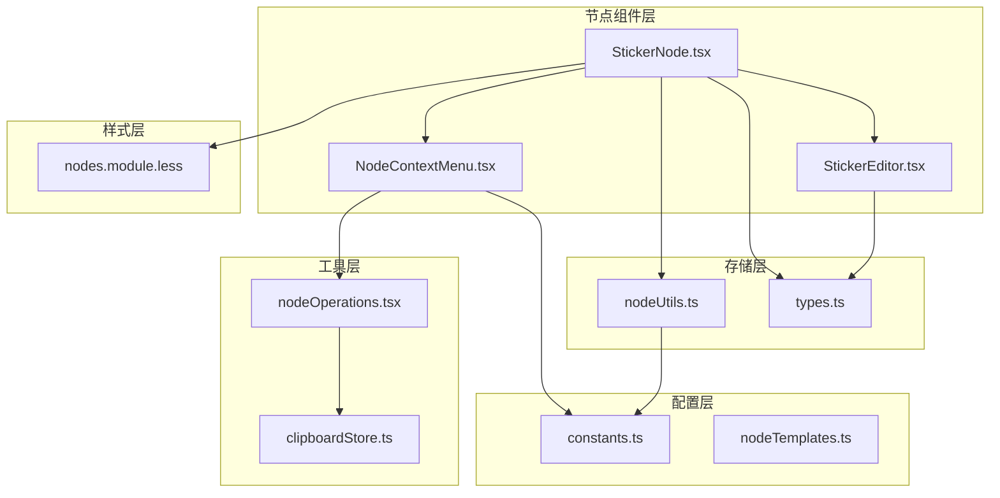
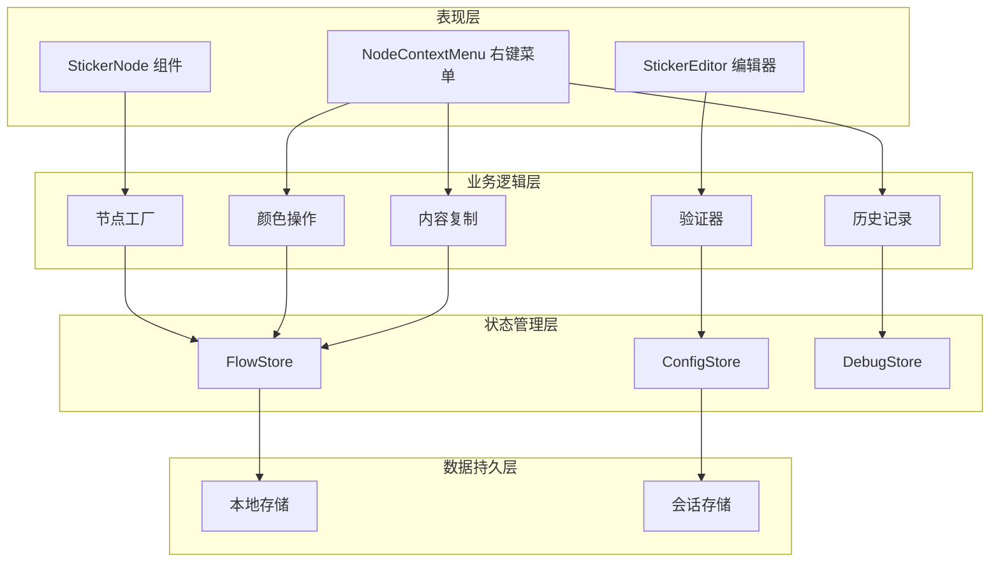
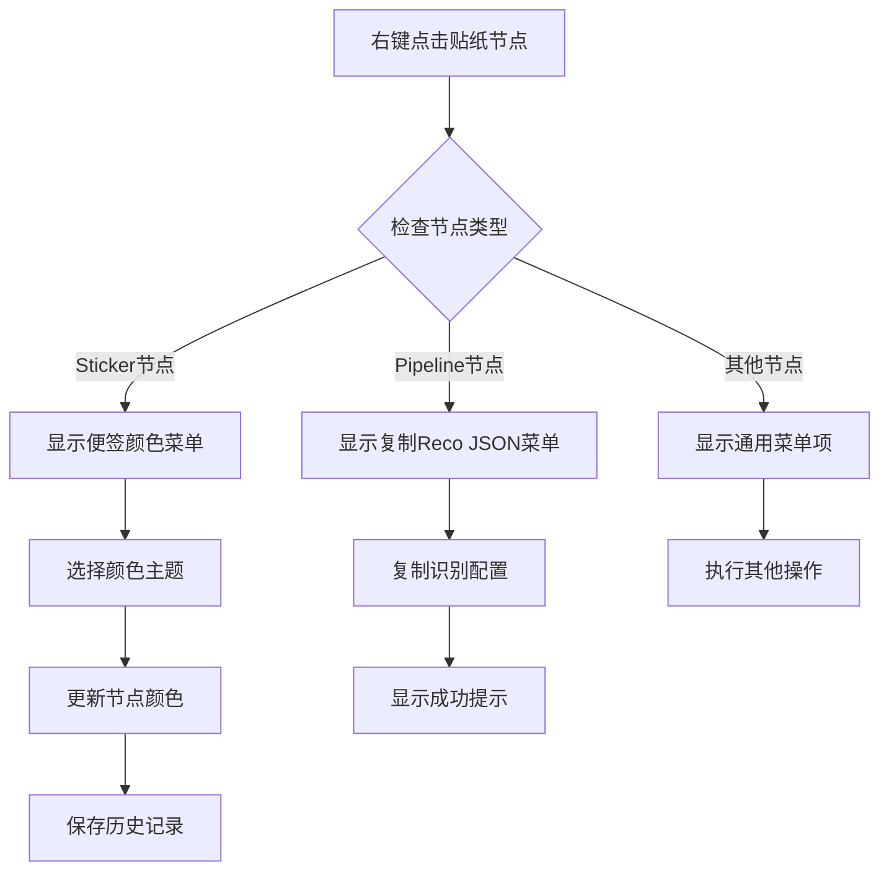
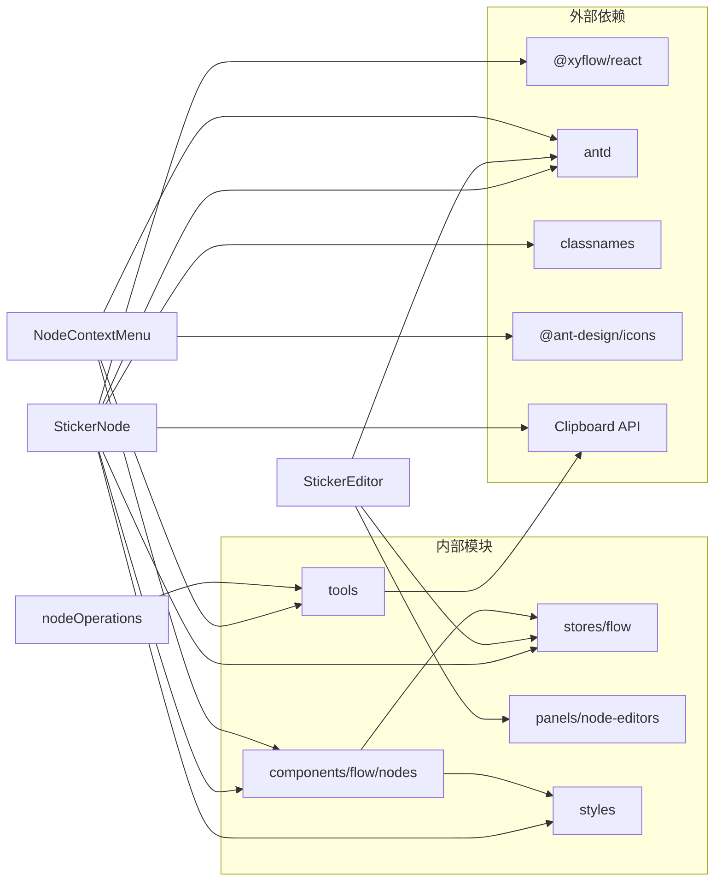

# 贴纸节点

<cite>
**本文档引用的文件**
- [StickerNode.tsx](file://src/components/flow/nodes/StickerNode.tsx)
- [StickerEditor.tsx](file://src/components/panels/node-editors/StickerEditor.tsx)
- [nodeUtils.ts](file://src/stores/flow/utils/nodeUtils.ts)
- [types.ts](file://src/stores/flow/types.ts)
- [constants.ts](file://src/components/flow/nodes/constants.ts)
- [index.ts](file://src/components/flow/nodes/index.ts)
- [nodes.module.less](file://src/styles/nodes.module.less)
- [FieldPanel.tsx](file://src/components/panels/main/FieldPanel.tsx)
- [NodeContextMenu.tsx](file://src/components/flow/nodes/components/NodeContextMenu.tsx)
- [nodeContextMenu.tsx](file://src/components/flow/nodes/nodeContextMenu.tsx)
- [Flow.tsx](file://src/components/Flow.tsx)
- [nodeTemplates.ts](file://src/data/nodeTemplates.ts)
- [nodeOperations.tsx](file://src/components/flow/nodes/utils/nodeOperations.tsx)
- [clipboardStore.ts](file://src/stores/clipboardStore.ts)
</cite>

## 更新摘要
**变更内容**
- 新增贴纸节点内容复制功能，支持一键复制便签内容到剪贴板
- 扩展右键菜单功能，增加便签颜色主题选择子菜单
- 完善贴纸节点颜色主题系统，支持五种颜色主题的完整配置
- 增强节点操作的用户交互体验

## 目录
1. [简介](#简介)
2. [项目结构](#项目结构)
3. [核心组件](#核心组件)
4. [架构概览](#架构概览)
5. [详细组件分析](#详细组件分析)
6. [依赖关系分析](#依赖关系分析)
7. [性能考虑](#性能考虑)
8. [故障排除指南](#故障排除指南)
9. [结论](#结论)

## 简介

贴纸节点是 MaaPipelineEditor 工作流编辑器中的一个特殊节点类型，用于在工作流画布上添加注释、备忘录和临时标记。该节点提供了一个可编辑的便签界面，支持多种颜色主题，并允许用户在节点上添加文本内容。

**更新** 贴纸节点现已支持完整的颜色主题系统和便捷的内容复制功能，为用户提供更加丰富的注释和标记体验。

贴纸节点具有以下特点：
- 支持五种颜色主题：黄色、绿色、蓝色、粉色、紫色
- 可双击进入编辑模式
- 支持拖拽调整大小
- 提供右键菜单功能，包括颜色主题选择和内容复制
- 与工作流编辑器的其他组件无缝集成

## 项目结构

贴纸节点的实现分布在多个文件中，形成了清晰的模块化架构：



**图表来源**
- [StickerNode.tsx](file://src/components/flow/nodes/StickerNode.tsx#L1-L237)
- [StickerEditor.tsx](file://src/components/panels/node-editors/StickerEditor.tsx#L1-L132)
- [nodeUtils.ts](file://src/stores/flow/utils/nodeUtils.ts#L137-L149)
- [nodeOperations.tsx](file://src/components/flow/nodes/utils/nodeOperations.tsx#L1-L182)

**章节来源**
- [StickerNode.tsx](file://src/components/flow/nodes/StickerNode.tsx#L1-L237)
- [StickerEditor.tsx](file://src/components/panels/node-editors/StickerEditor.tsx#L1-L132)
- [nodeUtils.ts](file://src/stores/flow/utils/nodeUtils.ts#L137-L149)

## 核心组件

贴纸节点系统由多个核心组件组成，每个组件都有特定的职责：

### 节点类型定义
贴纸节点使用统一的节点类型枚举系统，确保与其他节点类型的兼容性。

### 数据结构
贴纸节点的数据结构包含标签、内容和颜色三个主要属性，支持完整的 TypeScript 类型安全。

### 编辑器组件
独立的编辑器组件提供了专门的字段面板，用于配置贴纸节点的各种属性。

### 颜色主题系统
**新增** 完整的颜色主题系统，支持五种预定义颜色主题，每种主题都包含完整的视觉配置。

### 右键菜单扩展
**新增** 扩展的右键菜单功能，包括颜色主题选择和内容复制选项。

**章节来源**
- [types.ts](file://src/stores/flow/types.ts#L136-L149)
- [constants.ts](file://src/components/flow/nodes/constants.ts#L14-L19)
- [StickerEditor.tsx](file://src/components/panels/node-editors/StickerEditor.tsx#L13-L19)

## 架构概览

贴纸节点的架构采用分层设计，实现了良好的关注点分离：



**图表来源**
- [StickerNode.tsx](file://src/components/flow/nodes/StickerNode.tsx#L1-L237)
- [StickerEditor.tsx](file://src/components/panels/node-editors/StickerEditor.tsx#L1-L132)
- [Flow.tsx](file://src/components/Flow.tsx#L190-L404)

## 详细组件分析

### StickerNode 主组件

StickerNode 是贴纸节点的核心组件，负责渲染节点的视觉外观和交互行为。

#### 颜色主题系统
**更新** 贴纸节点支持五种预定义的颜色主题，每种主题都包含背景色、边框色、头部背景色和文本色的完整配置。

```mermaid
classDiagram
class STICKER_COLOR_THEMES {
+yellow : {bg, border, headerBg, text}
+green : {bg, border, headerBg, text}
+blue : {bg, border, headerBg, text}
+pink : {bg, border, headerBg, text}
+purple : {bg, border, headerBg, text}
}
class StickerNode {
+props : NodeProps
+state : editing : boolean
+theme : STICKER_COLOR_THEMES
+handleDoubleClick()
+handleBlur()
+handleContentChange()
+handleTitleChange()
}
class StickerContent {
+data : StickerNodeDataType
+nodeId : string
+selected : boolean
+editing : boolean
+textareaRef : Ref
+handleDoubleClick()
+handleBlur()
+handleContentChange()
+handleTitleChange()
}
class StickerNodeMemo {
+compare(prev, next) : boolean
}
StickerNode --> STICKER_COLOR_THEMES
StickerNode --> StickerContent
StickerNode --> StickerNodeMemo
```

**图表来源**
- [StickerNode.tsx](file://src/components/flow/nodes/StickerNode.tsx#L14-L48)
- [StickerNode.tsx](file://src/components/flow/nodes/StickerNode.tsx#L53-L237)

#### 编辑功能
节点支持双击进入编辑模式，提供即时的内容编辑体验。编辑状态下，用户可以修改节点的标题和内容。

#### 拖拽调整
通过 NodeResizer 组件，用户可以拖拽节点的边缘来调整其尺寸。

#### 右键菜单集成
**新增** 节点集成了扩展的右键菜单，提供颜色主题选择和内容复制功能。

#### 用户交互流程
贴纸节点的用户交互遵循标准的 React 组件模式，支持事件冒泡阻止和状态管理。

**章节来源**
- [StickerNode.tsx](file://src/components/flow/nodes/StickerNode.tsx#L13-L237)

### StickerEditor 编辑器

StickerEditor 是专门用于编辑贴纸节点的组件，提供直观的配置界面。

#### 字段面板设计
编辑器采用两列布局设计，左侧显示字段标签，右侧显示对应的输入控件。

#### 颜色选择器
提供下拉选择器让用户选择贴纸的颜色主题，支持五种预定义颜色。

#### 文本编辑
使用 TextArea 组件提供多行文本编辑功能，支持自动调整大小。


**图表来源**
- [StickerEditor.tsx](file://src/components/panels/node-editors/StickerEditor.tsx#L44-L64)

**章节来源**
- [StickerEditor.tsx](file://src/components/panels/node-editors/StickerEditor.tsx#L1-L132)

### 节点创建和管理

节点工厂模式用于创建不同类型的节点，包括贴纸节点。

#### 创建流程
节点创建过程包括 ID 生成、位置计算、数据初始化和样式设置。

#### 默认值处理
当创建贴纸节点时，如果没有指定颜色，会自动使用黄色作为默认颜色。

**章节来源**
- [nodeUtils.ts](file://src/stores/flow/utils/nodeUtils.ts#L137-L149)
- [nodeUtils.ts](file://src/stores/flow/utils/nodeUtils.ts#L135-L147)

### 样式系统

贴纸节点的样式系统基于 CSS Modules，提供了完整的视觉定制能力。

#### 主题样式
每种颜色主题都有对应的 CSS 类，确保一致的视觉体验。

#### 交互状态
支持选中状态、悬停状态等不同的交互状态样式。

**章节来源**
- [nodes.module.less](file://src/styles/nodes.module.less#L547-L623)

### 右键菜单扩展

**新增** 贴纸节点的右键菜单功能得到了显著扩展，提供了更丰富的操作选项。

#### 菜单项配置
右键菜单包含以下主要功能：
- 复制节点名：支持复制节点的完整名称
- 复制便签内容：**新增** 支持复制贴纸节点的内容到剪贴板
- 复制 Reco JSON：支持复制识别配置
- 保存为模板：支持保存节点为模板
- 便签颜色：**新增** 颜色主题选择子菜单
- 端点位置：支持调整节点连接方向
- 删除：删除节点

#### 颜色主题选择
**新增** 便签颜色子菜单提供五种颜色主题选择：
- 黄色主题：适合高亮标注
- 绿色主题：适合提示信息
- 蓝色主题：适合说明文字
- 粉色主题：适合特殊标记
- 紫色主题：适合重要信息

#### 内容复制功能
**新增** 复制便签内容功能允许用户一键复制贴纸节点的内容到系统剪贴板，支持批量复制和格式保持。



**图表来源**
- [nodeContextMenu.tsx](file://src/components/flow/nodes/nodeContextMenu.tsx#L420-L501)
- [nodeContextMenu.tsx](file://src/components/flow/nodes/nodeContextMenu.tsx#L350-L361)

**章节来源**
- [nodeContextMenu.tsx](file://src/components/flow/nodes/nodeContextMenu.tsx#L1-L586)
- [NodeContextMenu.tsx](file://src/components/flow/nodes/components/NodeContextMenu.tsx#L1-L171)

## 依赖关系分析

贴纸节点系统展现了清晰的依赖层次结构：



**图表来源**
- [StickerNode.tsx](file://src/components/flow/nodes/StickerNode.tsx#L1-L12)
- [StickerEditor.tsx](file://src/components/panels/node-editors/StickerEditor.tsx#L1-L11)
- [NodeContextMenu.tsx](file://src/components/flow/nodes/components/NodeContextMenu.tsx#L1-L171)

### 组件耦合度
贴纸节点组件之间的耦合度适中，通过明确的接口和状态管理保持松散耦合。

### 外部依赖管理
系统对外部依赖进行了合理的抽象，便于未来的版本升级和替换。

**章节来源**
- [index.ts](file://src/components/flow/nodes/index.ts#L1-L24)
- [Flow.tsx](file://src/components/Flow.tsx#L31-L32)

## 性能考虑

贴纸节点系统在设计时充分考虑了性能优化：

### 渲染优化
- 使用 React.memo 包装组件，避免不必要的重新渲染
- 通过自定义比较函数精确控制组件更新时机
- 使用 useMemo 和 useCallback 优化昂贵的计算和回调

### 内存管理
- 合理的事件监听器清理机制
- 避免内存泄漏的引用管理
- 及时清理定时器和订阅

### 用户体验
- 防抖机制减少频繁的状态更新
- 平滑的动画过渡效果
- 响应式的布局适配

### 剪贴板操作优化
**新增** 内容复制功能采用了异步处理机制，避免阻塞主线程，提供流畅的用户体验。

## 故障排除指南

### 常见问题及解决方案

#### 节点无法编辑
**症状**: 双击贴纸节点无响应
**可能原因**:
- 事件冒泡被其他组件阻止
- 节点处于只读模式
- 样式冲突导致交互失效

**解决方法**:
1. 检查事件处理函数是否正确绑定
2. 验证节点的编辑权限状态
3. 检查 CSS 样式冲突

#### 颜色主题显示异常
**症状**: 贴纸颜色显示不符合预期
**可能原因**:
- 颜色主题配置错误
- CSS 样式加载失败
- 主题切换逻辑异常

**解决方法**:
1. 验证 STICKER_COLOR_THEMES 配置
2. 检查样式文件的正确加载
3. 确认主题切换逻辑的完整性

#### 编辑器不显示
**症状**: 选中贴纸节点后编辑器面板不出现
**可能原因**:
- 节点类型判断错误
- 编辑器组件渲染条件不满足
- 状态管理异常

**解决方法**:
1. 检查节点类型枚举的正确性
2. 验证编辑器的渲染条件逻辑
3. 确认 FlowStore 的状态同步

#### 复制功能失效
**症状**: 右键菜单中的复制功能无响应
**可能原因**:
- 剪贴板权限问题
- 浏览器兼容性问题
- 权限被用户拒绝

**解决方法**:
1. 检查浏览器的剪贴板权限设置
2. 验证 Clipboard API 的可用性
3. 提示用户手动授权剪贴板访问

#### 颜色主题选择无效
**症状**: 右键菜单中的颜色选择无反应
**可能原因**:
- 节点类型判断错误
- 颜色主题数据更新失败
- 状态管理异常

**解决方法**:
1. 验证节点类型是否为 Sticker
2. 检查颜色主题数据的正确性
3. 确认 FlowStore 的状态更新

**章节来源**
- [FieldPanel.tsx](file://src/components/panels/main/FieldPanel.tsx#L303-L317)
- [StickerNode.tsx](file://src/components/flow/nodes/StickerNode.tsx#L70-L91)

## 结论

贴纸节点作为 MaaPipelineEditor 的重要组成部分，展现了现代前端应用的设计理念和最佳实践。通过模块化的架构设计、清晰的组件职责划分和完善的类型系统，该实现为用户提供了直观易用的注释和标记功能。

**更新** 系统现已支持完整的颜色主题系统和便捷的内容复制功能，进一步提升了用户的操作效率和体验质量。

系统的主要优势包括：
- **类型安全**: 完整的 TypeScript 支持确保代码质量
- **用户体验**: 流畅的交互和响应式设计
- **扩展性**: 模块化设计便于功能扩展和维护
- **性能优化**: 多层次的性能优化策略
- **功能丰富**: 完整的颜色主题和复制功能支持

未来可以考虑的功能增强：
- 更丰富的文本格式支持
- 导入导出功能
- 模板系统
- 高级样式定制
- 批量操作功能

贴纸节点的成功实现为整个工作流编辑器系统的稳定性和可用性奠定了坚实基础。