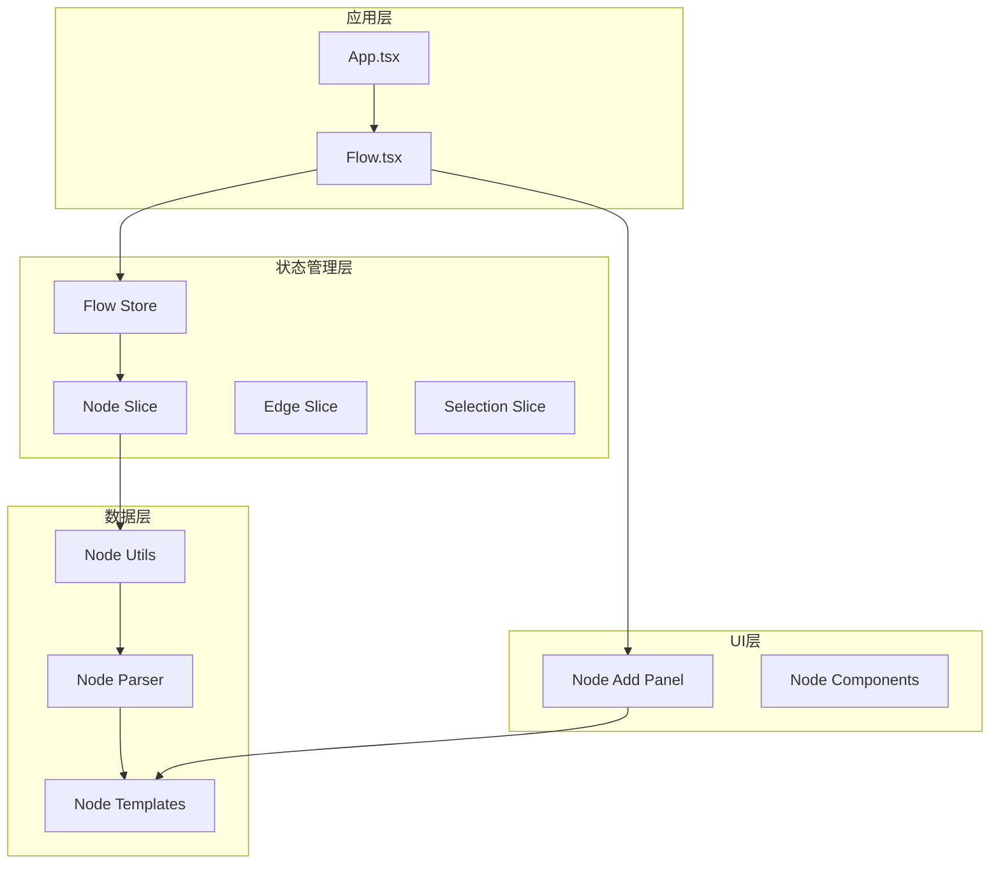
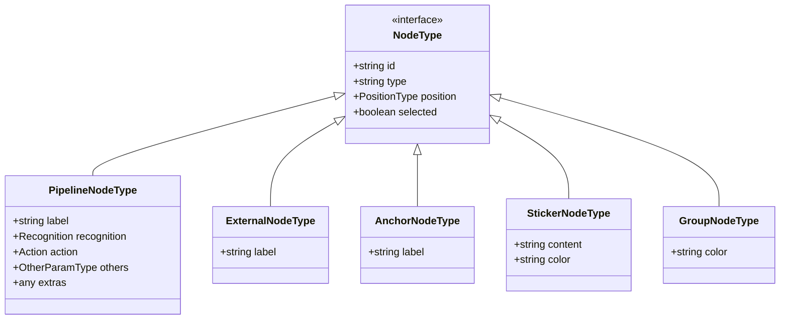
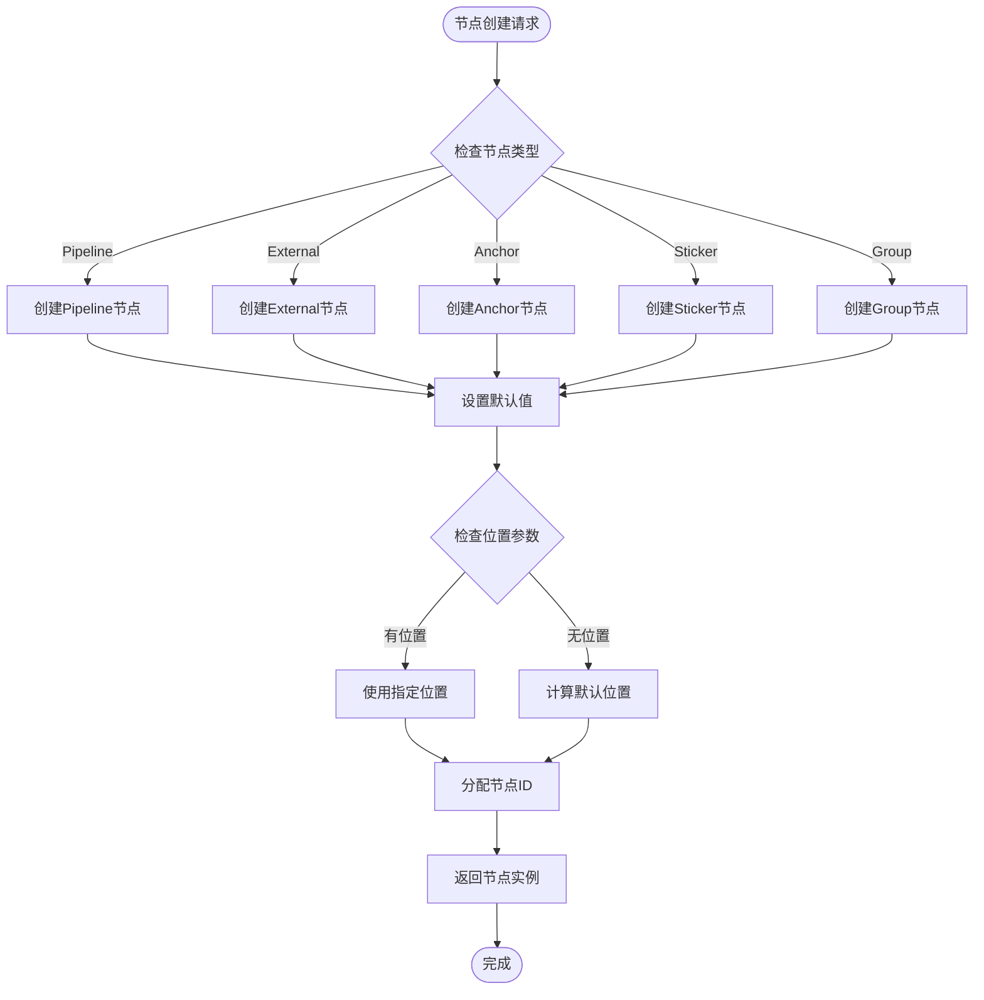
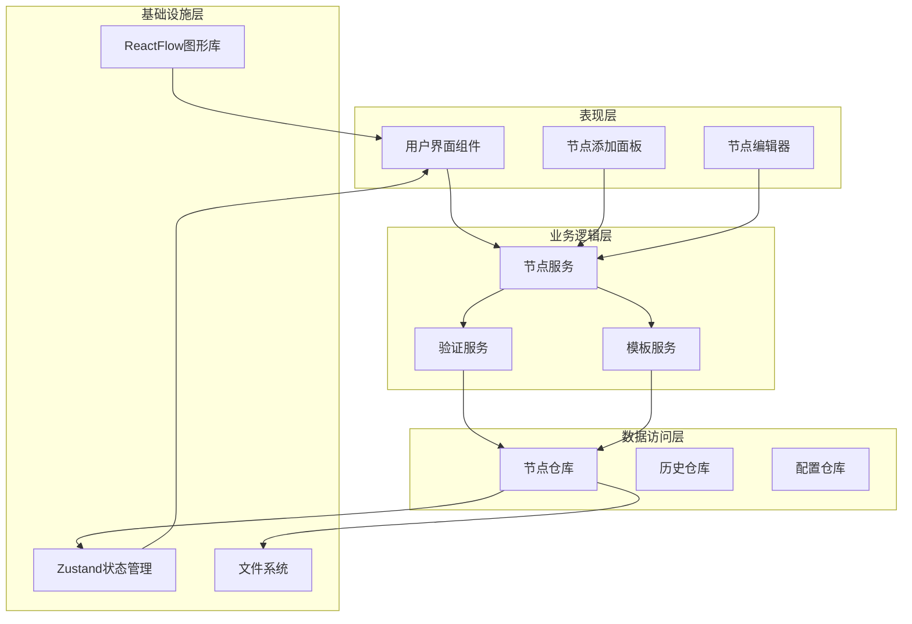
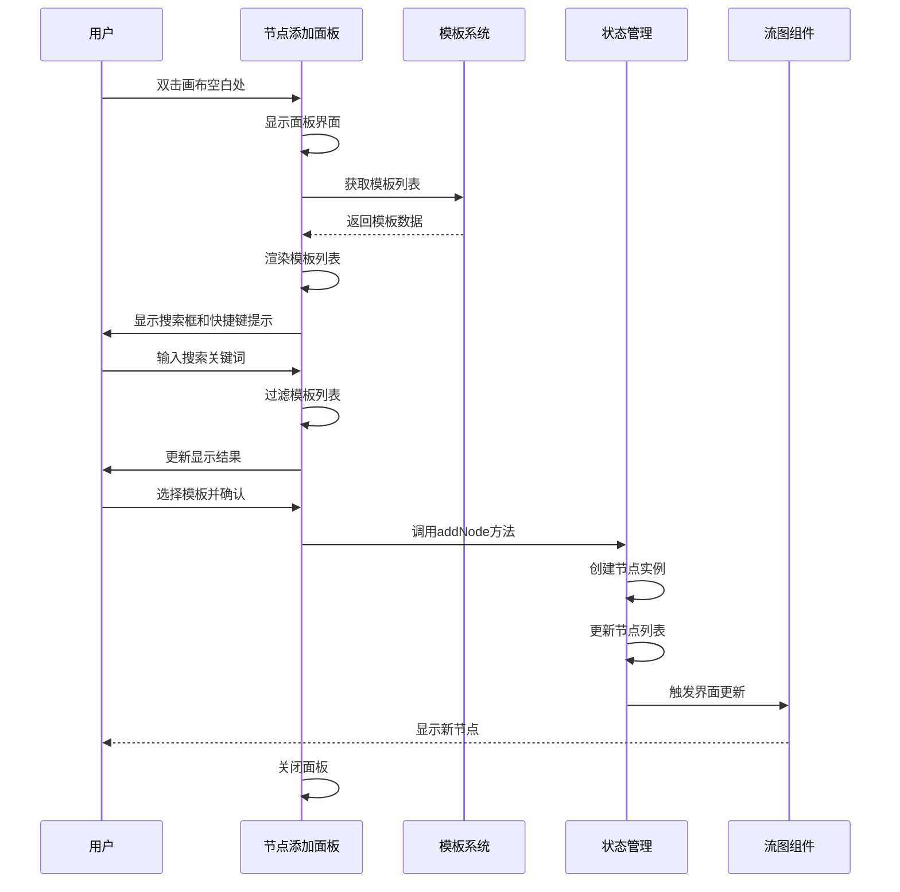
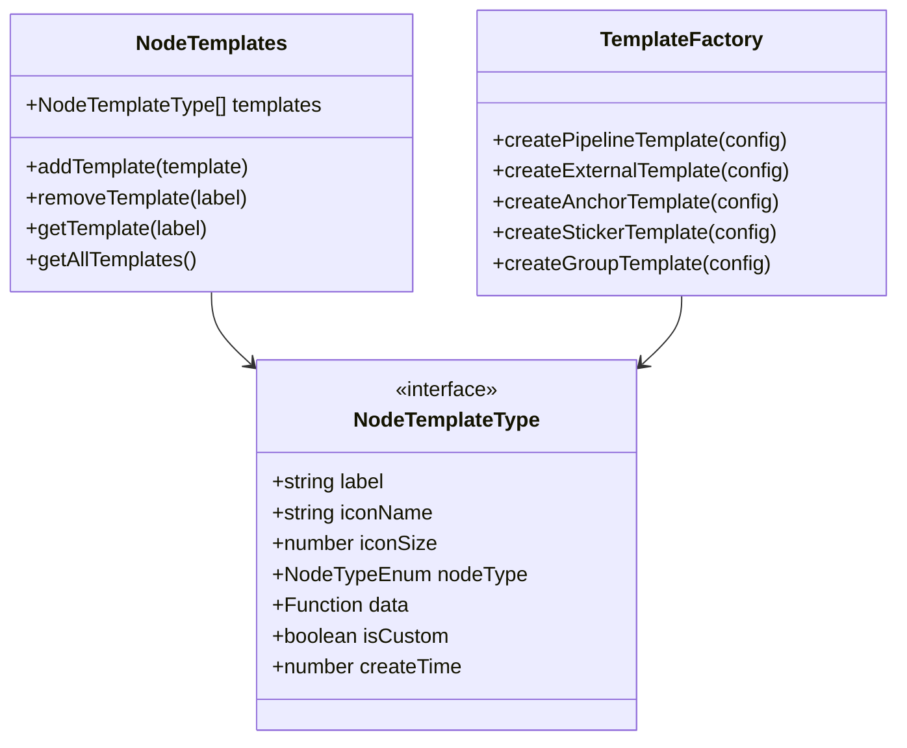
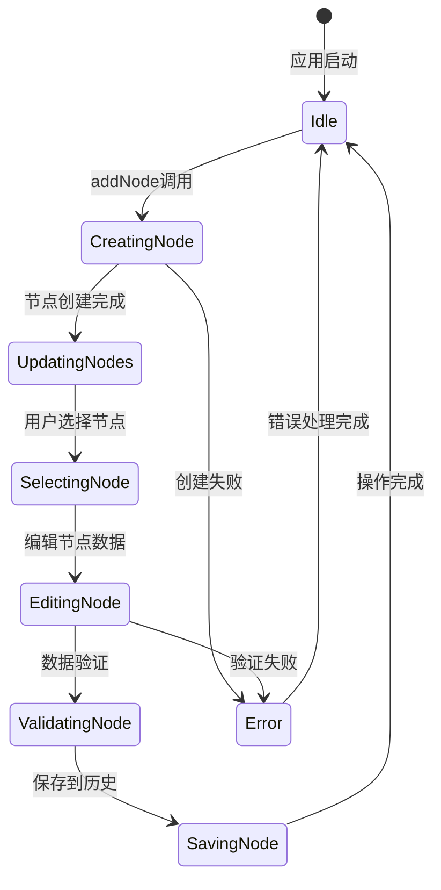
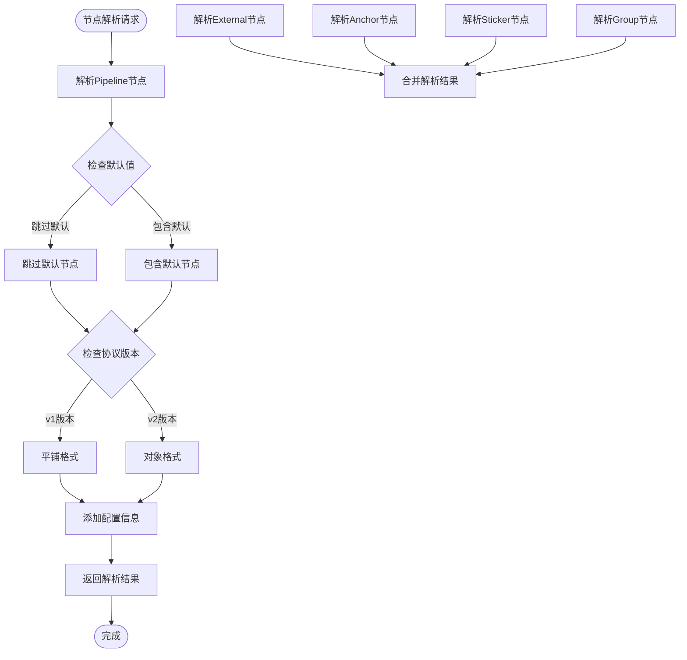

# 节点列表系统

<cite>
**本文档引用的文件**
- [App.tsx](file://src/App.tsx)
- [main.tsx](file://src/main.tsx)
- [Flow.tsx](file://src/components/Flow.tsx)
- [index.ts](file://src/stores/flow/index.ts)
- [types.ts](file://src/stores/flow/types.ts)
- [nodeSlice.ts](file://src/stores/flow/slices/nodeSlice.ts)
- [nodeUtils.ts](file://src/stores/flow/utils/nodeUtils.ts)
- [nodeParser.ts](file://src/core/parser/nodeParser.ts)
- [nodeTemplates.ts](file://src/data/nodeTemplates.ts)
- [NodeAddPanel.tsx](file://src/components/panels/main/NodeAddPanel.tsx)
- [constants.ts](file://src/components/flow/nodes/constants.ts)
</cite>

## 目录
1. [简介](#简介)
2. [项目结构](#项目结构)
3. [核心组件](#核心组件)
4. [架构概览](#架构概览)
5. [详细组件分析](#详细组件分析)
6. [依赖关系分析](#依赖关系分析)
7. [性能考虑](#性能考虑)
8. [故障排除指南](#故障排除指南)
9. [结论](#结论)

## 简介

节点列表系统是 MaaPipelineEditor 的核心功能模块，负责管理和操作工作流中的各种节点类型。该系统基于 React 和 Zustand 状态管理库构建，提供了完整的节点生命周期管理、可视化编辑界面和数据持久化功能。

系统支持五种主要的节点类型：Pipeline（管道节点）、External（外部节点）、Anchor（重定向节点）、Sticker（便签节点）和 Group（分组节点）。每个节点类型都有其特定的功能和用途，共同构成了强大的工作流编辑环境。

## 项目结构

节点列表系统采用模块化的架构设计，主要分为以下几个层次：



**图表来源**
- [App.tsx](file://src/App.tsx#L295-L330)
- [Flow.tsx](file://src/components/Flow.tsx#L462-L538)
- [index.ts](file://src/stores/flow/index.ts#L15-L24)

**章节来源**
- [App.tsx](file://src/App.tsx#L111-L330)
- [main.tsx](file://src/main.tsx#L1-L18)

## 核心组件

### 节点类型系统

系统定义了五种主要的节点类型，每种类型都有其独特的属性和行为：



**图表来源**
- [types.ts](file://src/stores/flow/types.ts#L165-L235)

### 节点创建工厂

系统提供了统一的节点创建工厂，用于生成不同类型的节点实例：



**图表来源**
- [nodeUtils.ts](file://src/stores/flow/utils/nodeUtils.ts#L14-L55)
- [nodeUtils.ts](file://src/stores/flow/utils/nodeUtils.ts#L57-L85)
- [nodeUtils.ts](file://src/stores/flow/utils/nodeUtils.ts#L87-L115)
- [nodeUtils.ts](file://src/stores/flow/utils/nodeUtils.ts#L117-L158)
- [nodeUtils.ts](file://src/stores/flow/utils/nodeUtils.ts#L277-L315)

**章节来源**
- [types.ts](file://src/stores/flow/types.ts#L107-L235)
- [nodeUtils.ts](file://src/stores/flow/utils/nodeUtils.ts#L14-L335)

## 架构概览

节点列表系统采用分层架构设计，确保了良好的模块分离和可维护性：



**图表来源**
- [Flow.tsx](file://src/components/Flow.tsx#L193-L542)
- [index.ts](file://src/stores/flow/index.ts#L15-L24)

## 详细组件分析

### 节点添加面板

节点添加面板是用户与节点列表系统交互的主要入口，提供了直观的节点创建体验：



**图表来源**
- [NodeAddPanel.tsx](file://src/components/panels/main/NodeAddPanel.tsx#L276-L583)
- [nodeSlice.ts](file://src/stores/flow/slices/nodeSlice.ts#L132-L288)

#### 模板系统架构

节点模板系统提供了灵活的节点创建机制，支持预定义模板和自定义模板：



**图表来源**
- [nodeTemplates.ts](file://src/data/nodeTemplates.ts#L3-L11)
- [nodeTemplates.ts](file://src/data/nodeTemplates.ts#L13-L107)

**章节来源**
- [NodeAddPanel.tsx](file://src/components/panels/main/NodeAddPanel.tsx#L276-L583)
- [nodeTemplates.ts](file://src/data/nodeTemplates.ts#L1-L108)

### 节点状态管理

节点状态管理系统基于 Zustand 构建，提供了高效的状态管理机制：



**图表来源**
- [nodeSlice.ts](file://src/stores/flow/slices/nodeSlice.ts#L44-L130)
- [nodeSlice.ts](file://src/stores/flow/slices/nodeSlice.ts#L290-L394)

#### 节点数据结构

系统定义了完整的节点数据结构，支持复杂的节点属性管理：

| 属性类别 | 描述 | 关键字段 |
|---------|------|----------|
| 基本信息 | 节点标识和位置 | id, type, position, selected |
| Pipeline节点 | 识别和动作配置 | recognition.type, recognition.param, action.type, action.param, others |
| 外部节点 | 引用外部节点 | label, handleDirection |
| 重定向节点 | 跳转到其他节点 | label, handleDirection |
| 便签节点 | 注释和标记 | content, color, style |
| 分组节点 | 节点容器 | color, style, children |

**章节来源**
- [types.ts](file://src/stores/flow/types.ts#L107-L235)
- [nodeSlice.ts](file://src/stores/flow/slices/nodeSlice.ts#L290-L516)

### 节点解析器

节点解析器负责将内部节点数据转换为导出格式，支持多种协议版本：



**图表来源**
- [nodeParser.ts](file://src/core/parser/nodeParser.ts#L21-L147)
- [nodeParser.ts](file://src/core/parser/nodeParser.ts#L154-L172)
- [nodeParser.ts](file://src/core/parser/nodeParser.ts#L179-L197)
- [nodeParser.ts](file://src/core/parser/nodeParser.ts#L204-L223)
- [nodeParser.ts](file://src/core/parser/nodeParser.ts#L231-L259)

**章节来源**
- [nodeParser.ts](file://src/core/parser/nodeParser.ts#L1-L372)

## 依赖关系分析

节点列表系统具有清晰的依赖关系，确保了模块间的松耦合：

```mermaid
graph TD
subgraph "核心依赖"
React[React 18+]
Zustand[Zustand]
ReactFlow[ReactFlow]
Antd[Ant Design]
end
subgraph "系统模块"
App[App.tsx]
Flow[Flow.tsx]
Stores[Stores]
Components[Components]
Core[Core]
end
subgraph "外部库"
Ahooks[ahooks]
ZustandLib[zustand]
XYFlow[@xyflow/react]
end
App --> Flow
Flow --> Stores
Stores --> Zustand
Flow --> ReactFlow
Flow --> Ahooks
Stores --> ZustandLib
ReactFlow --> XYFlow
Components --> Antd
```

**图表来源**
- [main.tsx](file://src/main.tsx#L1-L18)
- [Flow.tsx](file://src/components/Flow.tsx#L1-L542)

### 关键依赖关系

系统的关键依赖关系包括：

1. **状态管理依赖**：所有节点操作都通过 Zustand 状态管理
2. **UI渲染依赖**：ReactFlow 负责节点的可视化渲染
3. **工具函数依赖**：ahooks 提供响应式工具函数
4. **配置管理依赖**：Antd 提供 UI 组件和样式

**章节来源**
- [Flow.tsx](file://src/components/Flow.tsx#L1-L542)
- [index.ts](file://src/stores/flow/index.ts#L1-L109)

## 性能考虑

节点列表系统在设计时充分考虑了性能优化：

### 内存管理
- 使用 React.memo 优化组件渲染
- 采用浅比较减少不必要的重渲染
- 实现节点数据的深拷贝避免意外修改

### 渲染优化
- 节点位置计算采用防抖机制
- 大规模节点操作使用批量更新
- 只渲染可见区域内的节点

### 状态管理优化
- 分片状态管理减少全局状态更新
- 按需加载节点数据
- 历史记录的智能保存策略

## 故障排除指南

### 常见问题及解决方案

**节点创建失败**
- 检查节点类型是否正确
- 验证节点数据格式
- 确认节点ID唯一性

**节点渲染异常**
- 检查节点位置坐标
- 验证节点样式配置
- 确认父节点存在性

**节点拖拽问题**
- 检查磁吸功能配置
- 验证节点尺寸设置
- 确认分组节点顺序

**章节来源**
- [nodeSlice.ts](file://src/stores/flow/slices/nodeSlice.ts#L44-L130)
- [nodeUtils.ts](file://src/stores/flow/utils/nodeUtils.ts#L248-L275)

## 结论

节点列表系统是一个功能完整、架构清晰的工作流节点管理解决方案。系统通过模块化的设计、完善的类型系统和高效的性能优化，为用户提供了优秀的节点编辑体验。

主要特点包括：
- 支持五种不同类型的节点
- 提供直观的节点添加和编辑界面  
- 实现完整的节点生命周期管理
- 具备强大的模板系统
- 优化的性能表现和用户体验

该系统为 MaaPipelineEditor 的核心功能奠定了坚实的基础，为后续的功能扩展和维护提供了良好的架构支撑。