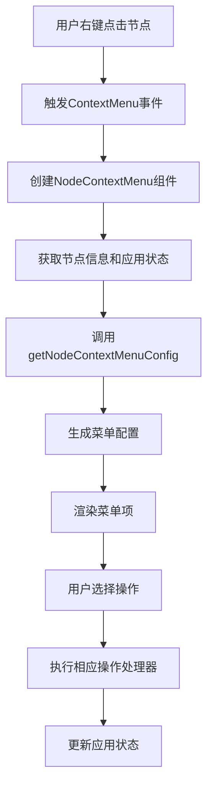
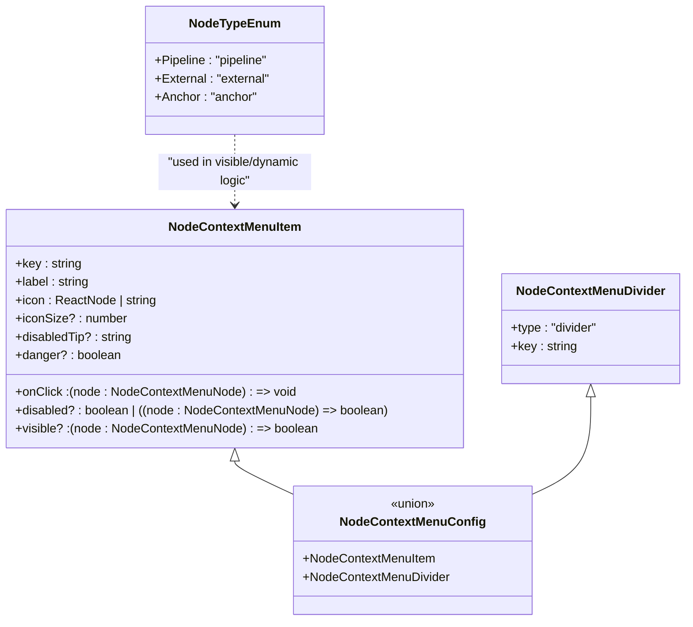
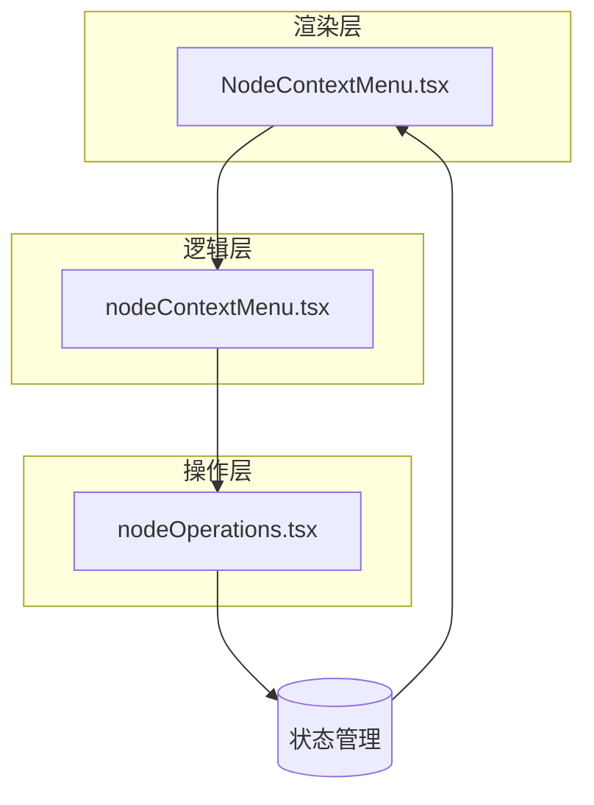

# 节点右键菜单

<cite>
**本文档引用的文件**   
- [NodeContextMenu.tsx](file://src/components/flow/nodes/components/NodeContextMenu.tsx)
- [nodeContextMenu.tsx](file://src/components/flow/nodes/nodeContextMenu.tsx)
- [nodeOperations.tsx](file://src/components/flow/nodes/utils/nodeOperations.tsx)
- [PipelineNode/index.tsx](file://src/components/flow/nodes/PipelineNode/index.tsx)
- [ExternalNode.tsx](file://src/components/flow/nodes/ExternalNode.tsx)
- [AnchorNode.tsx](file://src/components/flow/nodes/AnchorNode.tsx)
- [debugStore.ts](file://src/stores/debugStore.ts)
- [constants.ts](file://src/components/flow/nodes/constants.ts)
- [types.ts](file://src/stores/flow/types.ts)
</cite>

## 目录
1. [简介](#简介)
2. [核心组件](#核心组件)
3. [功能实现](#功能实现)
4. [菜单配置](#菜单配置)
5. [节点类型支持](#节点类型支持)
6. [调试功能集成](#调试功能集成)
7. [代码结构分析](#代码结构分析)
8. [交互流程](#交互流程)
9. [状态管理](#状态管理)
10. [最佳实践](#最佳实践)

## 简介
节点右键菜单是 MaaPipelineEditor 中的重要交互功能，为用户提供了一种便捷的方式来操作工作流中的各个节点。该功能允许用户通过右键点击节点来访问一系列上下文相关的操作选项，包括复制节点名、保存为模板、设置断点等。菜单内容会根据当前节点类型和应用状态动态调整，确保用户只能执行适用的操作。

**Section sources**
- [NodeContextMenu.tsx](file://src/components/flow/nodes/components/NodeContextMenu.tsx)
- [nodeContextMenu.tsx](file://src/components/flow/nodes/nodeContextMenu.tsx)

## 核心组件
节点右键菜单功能由多个核心组件构成，这些组件协同工作以提供完整的用户体验。主要组件包括菜单渲染组件、菜单配置生成器和操作处理器。菜单渲染组件负责显示和管理菜单的可见性，菜单配置生成器根据节点类型和应用状态生成相应的菜单项，而操作处理器则执行用户选择的具体操作。

**Section sources**
- [NodeContextMenu.tsx](file://src/components/flow/nodes/components/NodeContextMenu.tsx)
- [nodeContextMenu.tsx](file://src/components/flow/nodes/nodeContextMenu.tsx)

## 功能实现
节点右键菜单的功能实现基于 React 和 Ant Design 的 Dropdown 组件，结合 Zustand 状态管理库来处理应用状态。当用户右键点击一个节点时，系统会创建一个包含该节点信息的上下文，并根据此上下文生成相应的菜单配置。菜单项的可见性和启用状态会根据节点类型和当前应用模式（如调试模式）进行动态调整。

**Diagram sources**
- [NodeContextMenu.tsx](file://src/components/flow/nodes/components/NodeContextMenu.tsx)
- [nodeContextMenu.tsx](file://src/components/flow/nodes/nodeContextMenu.tsx)

## 菜单配置
菜单配置是节点右键菜单的核心部分，它定义了菜单中显示的各个选项及其行为。配置包括菜单项的键值、标签、图标、点击处理器以及可见性和启用状态的条件。菜单项分为普通菜单项和分隔线两种类型，通过联合类型 NodeContextMenuConfig 进行定义。配置生成函数会根据节点类型和应用状态过滤和调整菜单项。

**Section sources**
- [nodeContextMenu.tsx](file://src/components/flow/nodes/nodeContextMenu.tsx)
- [nodeOperations.tsx](file://src/components/flow/nodes/utils/nodeOperations.tsx)

## 节点类型支持
节点右键菜单支持多种节点类型，包括 Pipeline 节点、External 节点和 Anchor 节点。不同类型的节点具有不同的菜单选项，例如只有 Pipeline 节点可以保存为模板。系统通过 NodeTypeEnum 枚举来定义和区分这些节点类型，并在菜单配置生成过程中根据节点类型调整可用的菜单项。

**Diagram sources**
- [constants.ts](file://src/components/flow/nodes/constants.ts)
- [nodeContextMenu.tsx](file://src/components/flow/nodes/nodeContextMenu.tsx)

## 调试功能集成
节点右键菜单与应用的调试功能深度集成，特别是在调试模式下会显示额外的调试相关选项。这些选项包括设置调试入口节点和切换断点。系统通过 useDebugStore 钩子访问调试状态，并根据当前的调试模式和断点设置动态调整菜单内容。这种集成使得用户能够快速配置和控制调试会话。

**Section sources**
- [nodeContextMenu.tsx](file://src/components/flow/nodes/nodeContextMenu.tsx)
- [debugStore.ts](file://src/stores/debugStore.ts)

## 代码结构分析
节点右键菜单的代码结构遵循清晰的分层设计，将菜单渲染、配置生成和操作处理分离到不同的文件中。NodeContextMenu.tsx 文件负责菜单的渲染和交互，nodeContextMenu.tsx 文件包含菜单配置的生成逻辑，而 nodeOperations.tsx 文件则实现了具体的操作处理函数。这种分离提高了代码的可维护性和可测试性。

**Diagram sources**
- [NodeContextMenu.tsx](file://src/components/flow/nodes/components/NodeContextMenu.tsx)
- [nodeContextMenu.tsx](file://src/components/flow/nodes/nodeContextMenu.tsx)
- [nodeOperations.tsx](file://src/components/flow/nodes/utils/nodeOperations.tsx)

## 交互流程
节点右键菜单的交互流程从用户右键点击节点开始，经过一系列的事件处理和状态更新，最终执行用户选择的操作。流程包括菜单的显示、菜单项的生成、用户选择的处理和操作的执行。每个步骤都经过精心设计，以确保流畅的用户体验和正确的功能实现。

**Section sources**
- [NodeContextMenu.tsx](file://src/components/flow/nodes/components/NodeContextMenu.tsx)
- [nodeContextMenu.tsx](file://src/components/flow/nodes/nodeContextMenu.tsx)

## 状态管理
节点右键菜单的状态管理依赖于 Zustand 库，通过 useDebugStore 和其他状态存储来访问和更新应用状态。菜单的显示状态（打开/关闭）在组件本地管理，而与菜单项相关的应用状态（如断点设置）则存储在全局状态中。这种混合状态管理方法既保证了性能又确保了状态的一致性。

**Section sources**
- [NodeContextMenu.tsx](file://src/components/flow/nodes/components/NodeContextMenu.tsx)
- [debugStore.ts](file://src/stores/debugStore.ts)

## 最佳实践
在使用和扩展节点右键菜单功能时，应遵循一些最佳实践。这些包括保持菜单项的简洁性、确保操作的可逆性、提供清晰的反馈信息以及合理使用禁用状态来指导用户。此外，新功能的添加应考虑与其他系统组件的集成，以提供一致的用户体验。

**Section sources**
- [nodeContextMenu.tsx](file://src/components/flow/nodes/nodeContextMenu.tsx)
- [nodeOperations.tsx](file://src/components/flow/nodes/utils/nodeOperations.tsx)