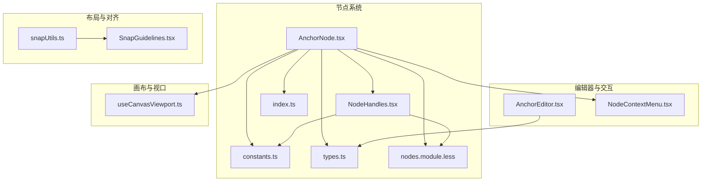
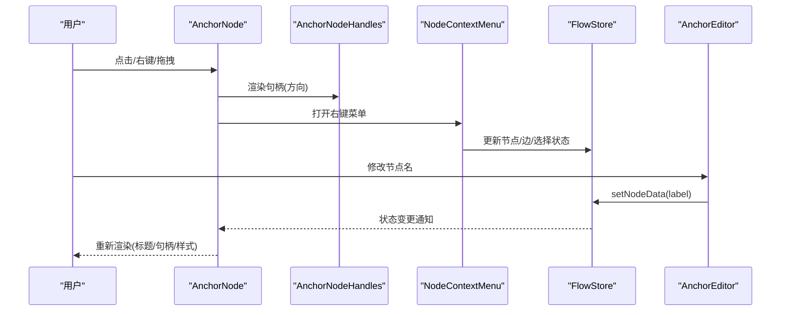
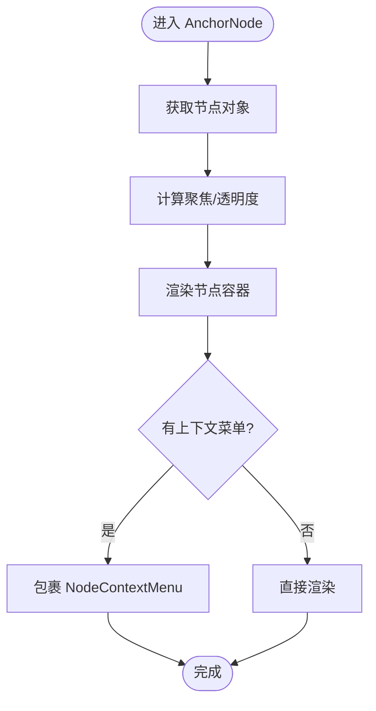
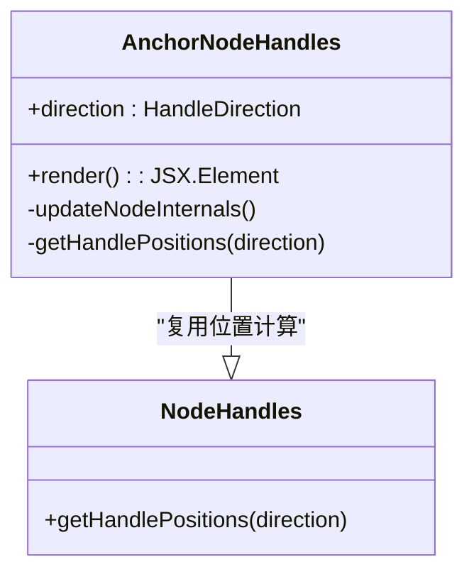
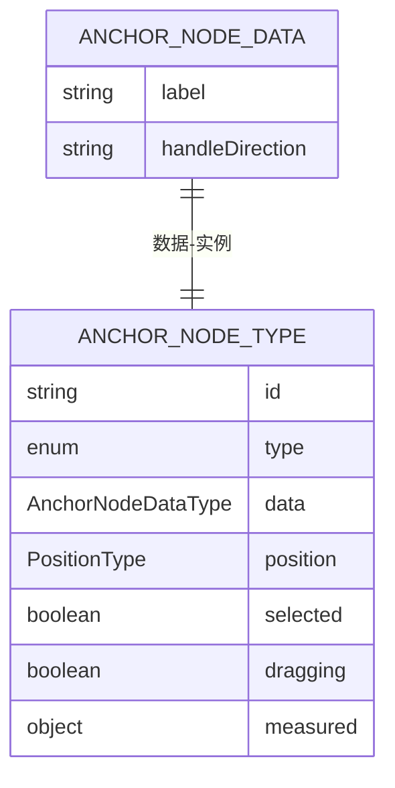
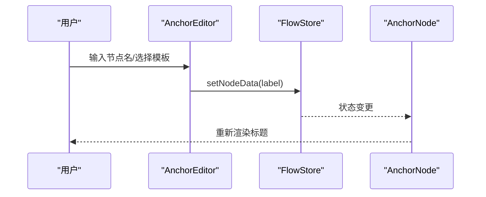
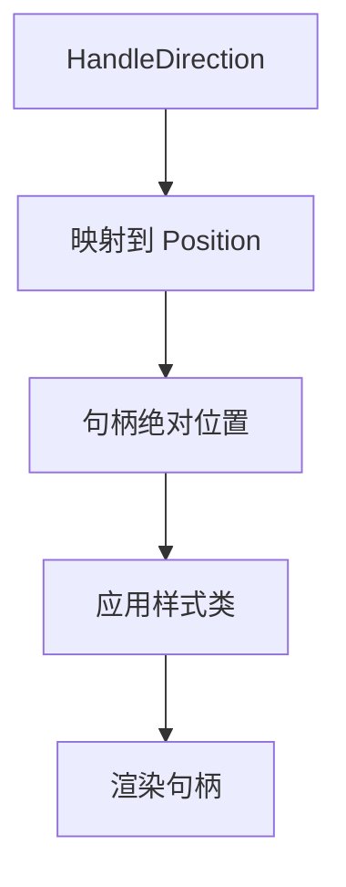
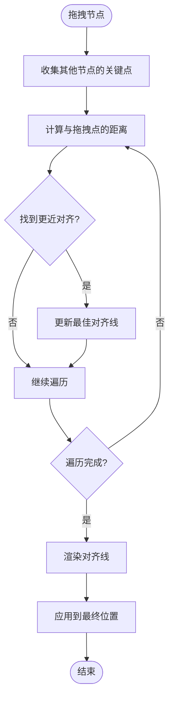
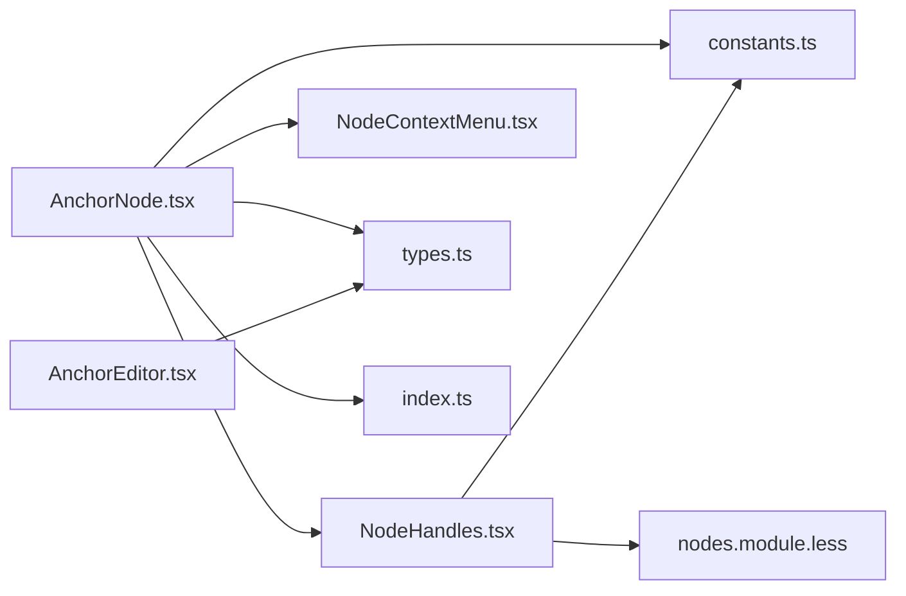

# Anchor节点

<cite>
**本文档引用的文件**
- [AnchorNode.tsx](file://src/components/flow/nodes/AnchorNode.tsx)
- [AnchorEditor.tsx](file://src/components/panels/node-editors/AnchorEditor.tsx)
- [NodeHandles.tsx](file://src/components/flow/nodes/components/NodeHandles.tsx)
- [constants.ts](file://src/components/flow/nodes/constants.ts)
- [types.ts](file://src/stores/flow/types.ts)
- [index.ts](file://src/components/flow/nodes/index.ts)
- [nodes.module.less](file://src/styles/nodes.module.less)
- [NodeContextMenu.tsx](file://src/components/flow/nodes/components/NodeContextMenu.tsx)
- [snapUtils.ts](file://src/core/snapUtils.ts)
- [SnapGuidelines.tsx](file://src/components/flow/SnapGuidelines.tsx)
- [useCanvasViewport.ts](file://src/hooks/useCanvasViewport.ts)
</cite>

## 目录
1. [简介](#简介)
2. [项目结构](#项目结构)
3. [核心组件](#核心组件)
4. [架构总览](#架构总览)
5. [详细组件分析](#详细组件分析)
6. [依赖关系分析](#依赖关系分析)
7. [性能考量](#性能考量)
8. [故障排查指南](#故障排查指南)
9. [结论](#结论)
10. [附录](#附录)

## 简介
Anchor节点是流程编辑器中的锚点定位节点，用于在复杂布局中提供稳定的连接入口与跳转锚点。它通过句柄（Handle）系统与上下游节点建立连接，并支持多种方向配置（左右、上下等）。本文档将深入解释Anchor节点的定位机制、坐标计算、位置锁定、视觉标识、交互行为与状态管理，并给出在复杂布局中的应用技巧与最佳实践。

## 项目结构
Anchor节点位于前端React组件体系中，采用模块化设计，与节点类型注册、句柄组件、样式系统、上下文菜单、编辑器面板等协同工作。

**图表来源**
- [AnchorNode.tsx:1-169](file://src/components/flow/nodes/AnchorNode.tsx#L1-L169)
- [NodeHandles.tsx:1-254](file://src/components/flow/nodes/components/NodeHandles.tsx#L1-L254)
- [constants.ts:1-47](file://src/components/flow/nodes/constants.ts#L1-L47)
- [types.ts:130-205](file://src/stores/flow/types.ts#L130-L205)
- [index.ts:1-26](file://src/components/flow/nodes/index.ts#L1-L26)
- [nodes.module.less:303-314](file://src/styles/nodes.module.less#L303-L314)
- [AnchorEditor.tsx:1-106](file://src/components/panels/node-editors/AnchorEditor.tsx#L1-L106)
- [NodeContextMenu.tsx:1-171](file://src/components/flow/nodes/components/NodeContextMenu.tsx#L1-L171)
- [snapUtils.ts:109-161](file://src/core/snapUtils.ts#L109-L161)
- [SnapGuidelines.tsx:1-59](file://src/components/flow/SnapGuidelines.tsx#L1-L59)
- [useCanvasViewport.ts:1-307](file://src/hooks/useCanvasViewport.ts#L1-L307)

**章节来源**
- [AnchorNode.tsx:1-169](file://src/components/flow/nodes/AnchorNode.tsx#L1-L169)
- [index.ts:1-26](file://src/components/flow/nodes/index.ts#L1-L26)

## 核心组件
- AnchorNode：锚点节点UI组件，负责渲染标题、句柄、上下文菜单与焦点/透明度状态。
- AnchorNodeHandles：锚点专用句柄组件，根据方向动态定位目标句柄与回跳句柄。
- AnchorEditor：锚点编辑器，提供节点名自动补全与模板选择能力。
- NodeContextMenu：节点右键菜单，统一承载删除、复制、粘贴、模板等操作。
- snapUtils与SnapGuidelines：吸附对齐算法与可视化引导线，提升布局精度。
- useCanvasViewport：画布视口控制，支撑缩放、平移与坐标换算。

**章节来源**
- [AnchorNode.tsx:18-147](file://src/components/flow/nodes/AnchorNode.tsx#L18-L147)
- [NodeHandles.tsx:198-249](file://src/components/flow/nodes/components/NodeHandles.tsx#L198-L249)
- [AnchorEditor.tsx:8-106](file://src/components/panels/node-editors/AnchorEditor.tsx#L8-L106)
- [NodeContextMenu.tsx:24-167](file://src/components/flow/nodes/components/NodeContextMenu.tsx#L24-L167)
- [snapUtils.ts:109-161](file://src/core/snapUtils.ts#L109-L161)
- [SnapGuidelines.tsx:5-58](file://src/components/flow/SnapGuidelines.tsx#L5-L58)
- [useCanvasViewport.ts:69-306](file://src/hooks/useCanvasViewport.ts#L69-L306)

## 架构总览
Anchor节点的实现遵循“组件-句柄-存储-编辑器”的分层架构：
- 组件层：AnchorNode负责渲染与交互；NodeHandles负责句柄布局与样式。
- 存储层：FlowStore维护节点、边、选择状态与历史；types.ts定义AnchorNodeDataType与AnchorNodeType。
- 编辑器层：AnchorEditor提供字段编辑与自动补全；NodeContextMenu提供上下文操作。
- 布局层：snapUtils与SnapGuidelines提供吸附与对齐；useCanvasViewport提供画布缩放与平移。

**图表来源**
- [AnchorNode.tsx:31-147](file://src/components/flow/nodes/AnchorNode.tsx#L31-L147)
- [NodeHandles.tsx:198-249](file://src/components/flow/nodes/components/NodeHandles.tsx#L198-L249)
- [NodeContextMenu.tsx:24-167](file://src/components/flow/nodes/components/NodeContextMenu.tsx#L24-L167)
- [types.ts:130-205](file://src/stores/flow/types.ts#L130-L205)
- [AnchorEditor.tsx:46-60](file://src/components/panels/node-editors/AnchorEditor.tsx#L46-L60)

## 详细组件分析

### AnchorNode组件
- 渲染内容：标题与句柄。
- 焦点与透明度：根据全局focusOpacity与路径模式、选中状态决定透明度。
- 上下文菜单：封装NodeContextMenu，提供统一操作入口。
- 性能优化：使用memo与浅比较，避免不必要的重渲染。

**图表来源**
- [AnchorNode.tsx:31-147](file://src/components/flow/nodes/AnchorNode.tsx#L31-L147)

**章节来源**
- [AnchorNode.tsx:18-147](file://src/components/flow/nodes/AnchorNode.tsx#L18-L147)

### 锚点句柄系统（AnchorNodeHandles）
- 方向映射：根据HandleDirection返回目标句柄与回跳句柄的位置（上下/左右）。
- 动态更新：当方向变化时，调用useUpdateNodeInternals确保句柄位置即时生效。
- 样式区分：锚点句柄使用独立样式类，便于视觉识别。

**图表来源**
- [NodeHandles.tsx:198-249](file://src/components/flow/nodes/components/NodeHandles.tsx#L198-L249)
- [constants.ts:28-35](file://src/components/flow/nodes/constants.ts#L28-L35)

**章节来源**
- [NodeHandles.tsx:198-249](file://src/components/flow/nodes/components/NodeHandles.tsx#L198-L249)

### 数据模型与类型定义
- AnchorNodeDataType：包含label与handleDirection。
- AnchorNodeType：扩展position、selected、dragging、measured等标准节点属性。
- NodeTypeEnum.Anchor：节点类型枚举值，用于注册与识别。

**图表来源**
- [types.ts:130-205](file://src/stores/flow/types.ts#L130-L205)
- [constants.ts:14-20](file://src/components/flow/nodes/constants.ts#L14-L20)

**章节来源**
- [types.ts:130-205](file://src/stores/flow/types.ts#L130-L205)

### 编辑器与交互
- AnchorEditor：提供节点名自动补全与模板选择，支持跨文件检索与提示。
- NodeContextMenu：统一的右键菜单，支持删除、复制、粘贴、模板等操作。
- 节点注册：index.ts中将AnchorNode注册为NodeTypeEnum.Anchor对应的组件。

**图表来源**
- [AnchorEditor.tsx:46-60](file://src/components/panels/node-editors/AnchorEditor.tsx#L46-L60)
- [types.ts:130-205](file://src/stores/flow/types.ts#L130-L205)
- [index.ts:8-14](file://src/components/flow/nodes/index.ts#L8-L14)

**章节来源**
- [AnchorEditor.tsx:1-106](file://src/components/panels/node-editors/AnchorEditor.tsx#L1-L106)
- [NodeContextMenu.tsx:1-171](file://src/components/flow/nodes/components/NodeContextMenu.tsx#L1-L171)
- [index.ts:1-26](file://src/components/flow/nodes/index.ts#L1-L26)

### 定位机制与坐标计算
- 句柄位置：根据HandleDirection映射到Position.Left/Right/Top/Bottom。
- 垂直/水平布局：通过样式类区分垂直与水平方向的句柄尺寸与定位。
- 画布坐标：节点position为画布坐标系中的绝对位置；缩放与平移由useCanvasViewport提供。

**图表来源**
- [NodeHandles.tsx:10-28](file://src/components/flow/nodes/components/NodeHandles.tsx#L10-L28)
- [nodes.module.less:316-394](file://src/styles/nodes.module.less#L316-L394)

**章节来源**
- [NodeHandles.tsx:10-28](file://src/components/flow/nodes/components/NodeHandles.tsx#L10-L28)
- [nodes.module.less:316-394](file://src/styles/nodes.module.less#L316-L394)

### 位置锁定与吸附对齐
- 吸附算法：遍历其他节点的多个关键点（如边缘与中心），计算最小距离，生成对齐参考线。
- 可视化引导：SnapGuidelines根据视口缩放与偏移实时绘制重复渐变线。
- 交互反馈：对齐时提供视觉引导，帮助用户精确对齐节点。

**图表来源**
- [snapUtils.ts:109-161](file://src/core/snapUtils.ts#L109-L161)
- [SnapGuidelines.tsx:24-54](file://src/components/flow/SnapGuidelines.tsx#L24-L54)

**章节来源**
- [snapUtils.ts:109-161](file://src/core/snapUtils.ts#L109-L161)
- [SnapGuidelines.tsx:1-59](file://src/components/flow/SnapGuidelines.tsx#L1-L59)

### 视觉标识与样式管理
- 节点外观：锚点节点使用绿色系背景，标题为白色粗体，突出识别度。
- 句柄样式：锚点句柄使用独立颜色与尺寸，区分于普通节点与外部节点。
- 选中状态：选中时显示蓝色描边阴影，增强交互反馈。

**章节来源**
- [nodes.module.less:303-314](file://src/styles/nodes.module.less#L303-L314)
- [nodes.module.less:391-393](file://src/styles/nodes.module.less#L391-L393)
- [nodes.module.less:261-264](file://src/styles/nodes.module.less#L261-L264)

### 交互行为与状态管理
- 选中与聚焦：根据focusOpacity、路径模式、选中节点与边的关系动态调整透明度。
- 右键菜单：统一承载删除、复制、粘贴、模板等操作，支持禁用条件与勾选状态。
- 编辑状态：通过FlowStore的setNodeData更新节点label，触发组件重渲染。

**章节来源**
- [AnchorNode.tsx:54-126](file://src/components/flow/nodes/AnchorNode.tsx#L54-L126)
- [NodeContextMenu.tsx:24-167](file://src/components/flow/nodes/components/NodeContextMenu.tsx#L24-L167)
- [types.ts:286-309](file://src/stores/flow/types.ts#L286-L309)

## 依赖关系分析
- 组件耦合：AnchorNode依赖NodeHandles、NodeContextMenu、FlowStore与配置存储；AnchorNodeHandles依赖NodeHandles工具函数与样式。
- 类型契约：types.ts定义AnchorNodeDataType与AnchorNodeType，确保数据一致性。
- 注册映射：index.ts将NodeTypeEnum.Anchor映射到AnchorNode组件，保证运行时正确渲染。

**图表来源**
- [AnchorNode.tsx:1-169](file://src/components/flow/nodes/AnchorNode.tsx#L1-L169)
- [NodeHandles.tsx:1-254](file://src/components/flow/nodes/components/NodeHandles.tsx#L1-L254)
- [types.ts:130-205](file://src/stores/flow/types.ts#L130-L205)
- [constants.ts:1-47](file://src/components/flow/nodes/constants.ts#L1-L47)
- [index.ts:1-26](file://src/components/flow/nodes/index.ts#L1-L26)
- [nodes.module.less:1-694](file://src/styles/nodes.module.less#L1-L694)
- [AnchorEditor.tsx:1-106](file://src/components/panels/node-editors/AnchorEditor.tsx#L1-L106)

**章节来源**
- [index.ts:8-14](file://src/components/flow/nodes/index.ts#L8-L14)

## 性能考量
- 渲染优化：AnchorNodeMemo使用浅比较，避免因无关属性变化导致的重渲染。
- 句柄更新：方向变化时通过useUpdateNodeInternals异步更新，减少同步重绘成本。
- 吸附计算：对齐算法仅在拖拽过程中触发，且对候选节点数量进行限制，降低计算开销。

**章节来源**
- [AnchorNode.tsx:149-168](file://src/components/flow/nodes/AnchorNode.tsx#L149-L168)
- [NodeHandles.tsx:209-220](file://src/components/flow/nodes/components/NodeHandles.tsx#L209-L220)

## 故障排查指南
- 句柄未对齐：检查handleDirection是否与预期一致；确认useUpdateNodeInternals已触发。
- 节点无法选中：确认focusOpacity设置；检查路径模式与选中状态逻辑。
- 编辑器无响应：检查FlowStore.setNodeData调用链；确认节点id与字段key正确。
- 吸附无效：检查其他节点是否具备measured尺寸；确认拖拽点集合与阈值设置。

**章节来源**
- [NodeHandles.tsx:209-220](file://src/components/flow/nodes/components/NodeHandles.tsx#L209-L220)
- [AnchorNode.tsx:54-126](file://src/components/flow/nodes/AnchorNode.tsx#L54-L126)
- [snapUtils.ts:109-161](file://src/core/snapUtils.ts#L109-L161)

## 结论
Anchor节点通过清晰的组件职责划分、完善的句柄系统与吸附对齐机制，在复杂布局中提供了可靠的锚点定位能力。其与编辑器、上下文菜单、视口控制与存储系统的协作，确保了良好的交互体验与开发效率。建议在实际使用中结合方向配置、吸附对齐与模板化编辑，以获得更高的布局精度与可维护性。

## 附录
- 应用场景：流程分支汇聚、跨模块跳转、复杂拓扑中的稳定连接点。
- 使用技巧：优先使用吸附对齐提升布局一致性；合理设置handleDirection以匹配流向；利用模板快速复用锚点命名规范。