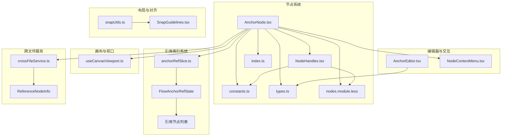
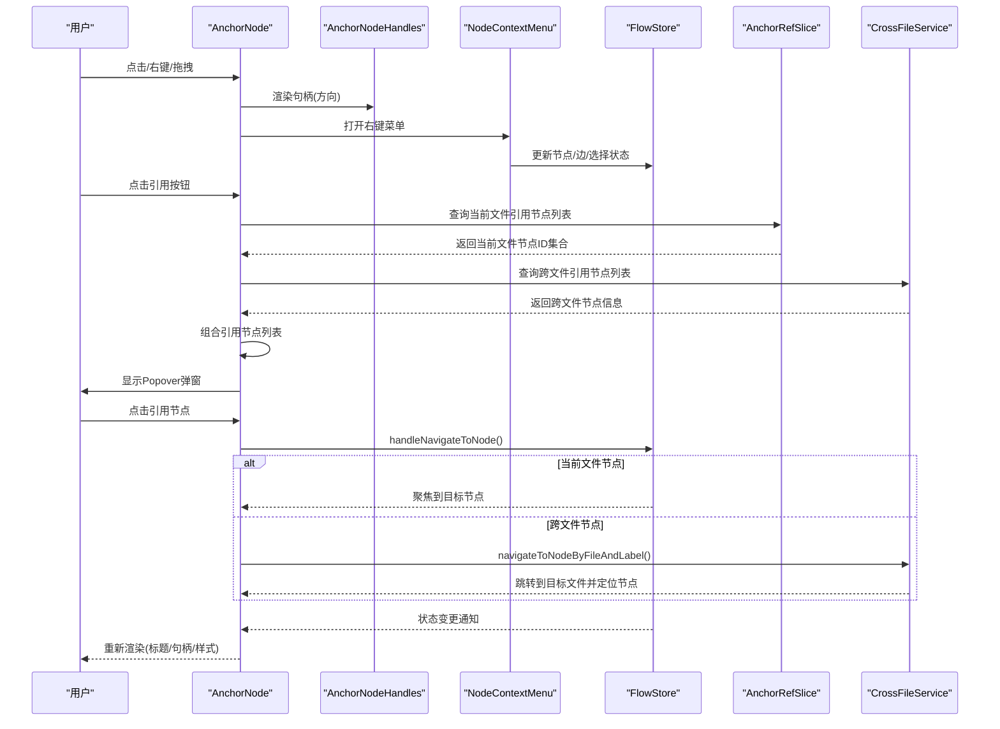
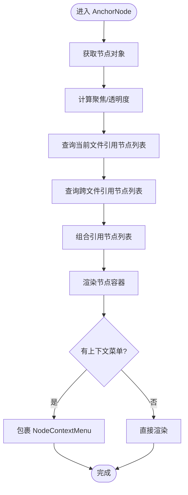
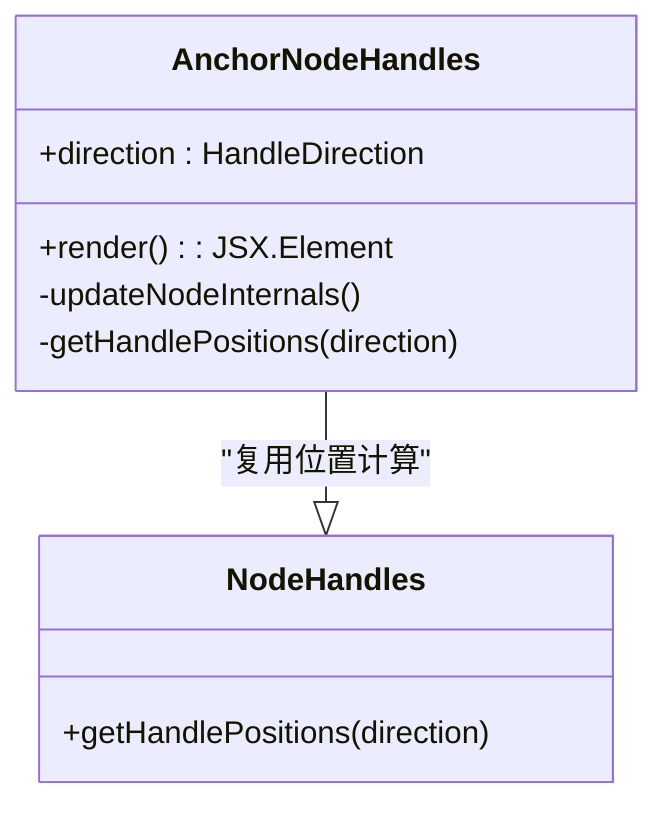
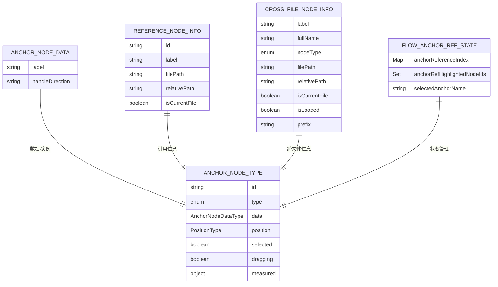
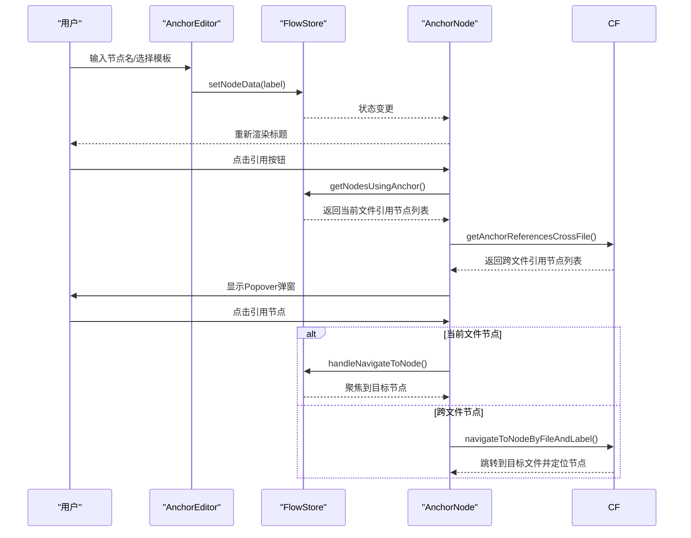
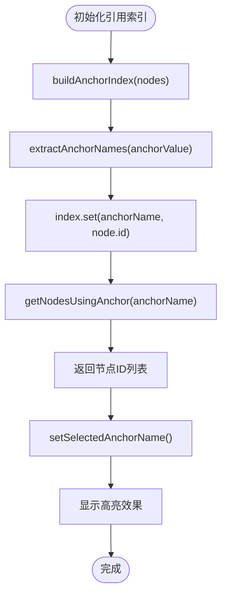
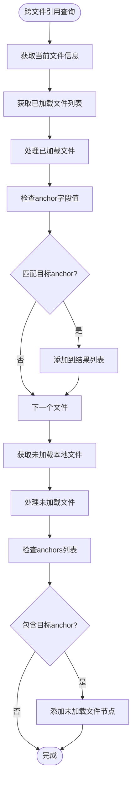
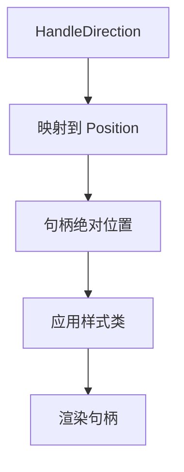
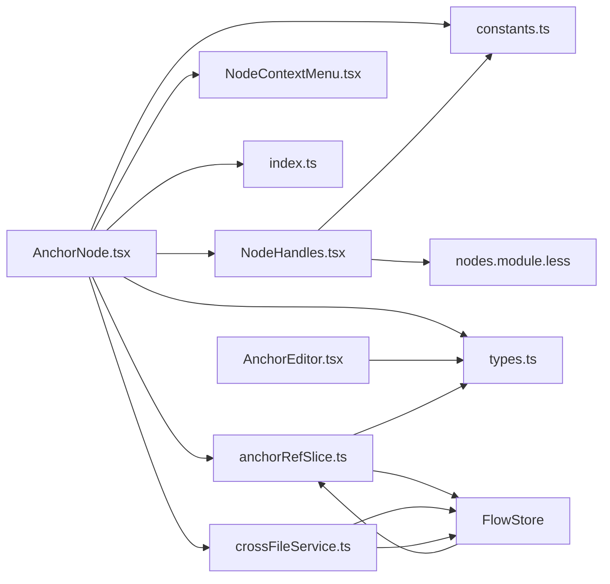

# Anchor节点

<cite>
**本文档引用的文件**
- [AnchorNode.tsx](file://src/components/flow/nodes/AnchorNode.tsx)
- [AnchorEditor.tsx](file://src/components/panels/node-editors/AnchorEditor.tsx)
- [NodeHandles.tsx](file://src/components/flow/nodes/components/NodeHandles.tsx)
- [constants.ts](file://src/components/flow/nodes/constants.ts)
- [types.ts](file://src/stores/flow/types.ts)
- [index.ts](file://src/components/flow/nodes/index.ts)
- [nodes.module.less](file://src/styles/nodes.module.less)
- [NodeContextMenu.tsx](file://src/components/flow/nodes/components/NodeContextMenu.tsx)
- [snapUtils.ts](file://src/core/snapUtils.ts)
- [SnapGuidelines.tsx](file://src/components/flow/SnapGuidelines.tsx)
- [useCanvasViewport.ts](file://src/hooks/useCanvasViewport.ts)
- [anchorRefSlice.ts](file://src/stores/flow/slices/anchorRefSlice.ts)
- [crossFileService.ts](file://src/services/crossFileService.ts)
- [PipelineNode/index.tsx](file://src/components/flow/nodes/PipelineNode/index.tsx)
</cite>

## 更新摘要
**变更内容**
- 新增Anchor节点跨文件导航功能，包括跨文件引用显示、文件路径信息展示、跨文件跳转等新特性
- 增强Anchor节点的实用性和可发现性，提供更好的节点间导航体验
- 新增FlowAnchorRefState状态管理，支持引用关系的实时查询和高亮显示
- 新增ReferenceNodeInfo接口，支持跨文件节点信息展示

## 目录
1. [简介](#简介)
2. [项目结构](#项目结构)
3. [核心组件](#核心组件)
4. [架构总览](#架构总览)
5. [详细组件分析](#详细组件分析)
6. [依赖关系分析](#依赖关系分析)
7. [性能考量](#性能考量)
8. [故障排查指南](#故障排查指南)
9. [结论](#结论)
10. [附录](#附录)

## 简介
Anchor节点是流程编辑器中的锚点定位节点，用于在复杂布局中提供稳定的连接入口与跳转锚点。它通过句柄（Handle）系统与上下游节点建立连接，并支持多种方向配置（左右、上下等）。本文档将深入解释Anchor节点的定位机制、坐标计算、位置锁定、视觉标识、交互行为与状态管理，并给出在复杂布局中的应用技巧与最佳实践。

**更新** 新增了跨文件导航功能，通过Popover弹窗展示引用此锚点的节点列表，支持当前文件和跨文件节点的一键跳转，显著提升了节点的可发现性和导航效率。新增了ReferenceNodeInfo接口，支持文件路径和相对路径信息展示。

## 项目结构
Anchor节点位于前端React组件体系中，采用模块化设计，与节点类型注册、句柄组件、样式系统、上下文菜单、编辑器面板、引用索引系统、跨文件服务等协同工作。

**图表来源**
- [AnchorNode.tsx:1-344](file://src/components/flow/nodes/AnchorNode.tsx#L1-L344)
- [NodeHandles.tsx:1-254](file://src/components/flow/nodes/components/NodeHandles.tsx#L1-L254)
- [constants.ts:1-47](file://src/components/flow/nodes/constants.ts#L1-L47)
- [types.ts:130-205](file://src/stores/flow/types.ts#L130-L205)
- [index.ts:1-26](file://src/components/flow/nodes/index.ts#L1-L26)
- [nodes.module.less:303-314](file://src/styles/nodes.module.less#L303-L314)
- [AnchorEditor.tsx:1-106](file://src/components/panels/node-editors/AnchorEditor.tsx#L1-L106)
- [NodeContextMenu.tsx:1-171](file://src/components/flow/nodes/components/NodeContextMenu.tsx#L1-L171)
- [snapUtils.ts:109-161](file://src/core/snapUtils.ts#L109-L161)
- [SnapGuidelines.tsx:1-59](file://src/components/flow/SnapGuidelines.tsx#L1-L59)
- [useCanvasViewport.ts:1-307](file://src/hooks/useCanvasViewport.ts#L1-L307)
- [anchorRefSlice.ts:1-101](file://src/stores/flow/slices/anchorRefSlice.ts#L1-L101)
- [crossFileService.ts:1-729](file://src/services/crossFileService.ts#L1-L729)
- [PipelineNode/index.tsx:1-283](file://src/components/flow/nodes/PipelineNode/index.tsx#L1-L283)

**章节来源**
- [AnchorNode.tsx:1-344](file://src/components/flow/nodes/AnchorNode.tsx#L1-L344)
- [index.ts:1-26](file://src/components/flow/nodes/index.ts#L1-L26)

## 核心组件
- AnchorNode：锚点节点UI组件，负责渲染标题、句柄、上下文菜单与焦点/透明度状态，**新增**跨文件引用节点列表显示与快捷跳转功能。
- AnchorNodeHandles：锚点专用句柄组件，根据方向动态定位目标句柄与回跳句柄。
- AnchorEditor：锚点编辑器，提供节点名自动补全与模板选择能力。
- NodeContextMenu：节点右键菜单，统一承载删除、复制、粘贴、模板等操作。
- **新增** FlowAnchorRefState：引用索引状态管理，提供引用关系的查询、高亮和导航功能。
- **新增** crossFileService：跨文件服务，提供跨文件节点搜索、跳转、自动完成等功能。
- **新增** ReferenceNodeInfo：引用节点信息接口，支持文件路径、相对路径和节点标签信息。
- snapUtils与SnapGuidelines：吸附对齐算法与可视化引导线，提升布局精度。
- useCanvasViewport：画布视口控制，支撑缩放、平移与坐标换算。

**章节来源**
- [AnchorNode.tsx:18-147](file://src/components/flow/nodes/AnchorNode.tsx#L18-L147)
- [NodeHandles.tsx:198-249](file://src/components/flow/nodes/components/NodeHandles.tsx#L198-L249)
- [AnchorEditor.tsx:8-106](file://src/components/panels/node-editors/AnchorEditor.tsx#L8-L106)
- [NodeContextMenu.tsx:24-167](file://src/components/flow/nodes/components/NodeContextMenu.tsx#L24-L167)
- [anchorRefSlice.ts:57-100](file://src/stores/flow/slices/anchorRefSlice.ts#L57-L100)
- [crossFileService.ts:55-729](file://src/services/crossFileService.ts#L55-L729)
- [snapUtils.ts:109-161](file://src/core/snapUtils.ts#L109-L161)
- [SnapGuidelines.tsx:5-58](file://src/components/flow/SnapGuidelines.tsx#L5-L58)
- [useCanvasViewport.ts:69-306](file://src/hooks/useCanvasViewport.ts#L69-L306)

## 架构总览
Anchor节点的实现遵循"组件-句柄-存储-编辑器-引用索引-跨文件服务"的分层架构：
- 组件层：AnchorNode负责渲染与交互；NodeHandles负责句柄布局与样式。
- 存储层：FlowStore维护节点、边、选择状态与历史；**新增**FlowAnchorRefState管理引用索引与高亮状态。
- 编辑器层：AnchorEditor提供字段编辑与自动补全；NodeContextMenu提供上下文操作。
- 布局层：snapUtils与SnapGuidelines提供吸附与对齐；useCanvasViewport提供画布缩放与平移。
- **新增**引用索引层：anchorRefSlice构建和维护引用关系索引，支持实时查询和高亮显示。
- **新增**跨文件服务层：crossFileService提供跨文件节点搜索、跳转和引用查询功能。

**图表来源**
- [AnchorNode.tsx:31-147](file://src/components/flow/nodes/AnchorNode.tsx#L31-L147)
- [NodeHandles.tsx:198-249](file://src/components/flow/nodes/components/NodeHandles.tsx#L198-L249)
- [NodeContextMenu.tsx:24-167](file://src/components/flow/nodes/components/NodeContextMenu.tsx#L24-L167)
- [types.ts:130-205](file://src/stores/flow/types.ts#L130-L205)
- [AnchorEditor.tsx:46-60](file://src/components/panels/node-editors/AnchorEditor.tsx#L46-L60)
- [anchorRefSlice.ts:57-100](file://src/stores/flow/slices/anchorRefSlice.ts#L57-L100)
- [crossFileService.ts:367-407](file://src/services/crossFileService.ts#L367-407)
- [PipelineNode/index.tsx:137-140](file://src/components/flow/nodes/PipelineNode/index.tsx#L137-L140)

## 详细组件分析

### AnchorNode组件
- 渲染内容：标题与句柄。
- **新增** 跨文件引用显示：通过Popover弹窗显示引用此锚点的节点列表，包括当前文件和跨文件节点，支持点击跳转。
- **新增** 文件路径信息：跨文件节点显示相对路径信息，便于用户识别目标文件。
- 焦点与透明度：根据全局focusOpacity与路径模式、选中状态决定透明度。
- 上下文菜单：封装NodeContextMenu，提供统一操作入口。
- 性能优化：使用memo与浅比较，避免不必要的重渲染。

**图表来源**
- [AnchorNode.tsx:139-170](file://src/components/flow/nodes/AnchorNode.tsx#L139-L170)
- [anchorRefSlice.ts:94-99](file://src/stores/flow/slices/anchorRefSlice.ts#L94-L99)
- [crossFileService.ts:616-698](file://src/services/crossFileService.ts#L616-L698)

**章节来源**
- [AnchorNode.tsx:18-147](file://src/components/flow/nodes/AnchorNode.tsx#L18-L147)

### 锚点句柄系统（AnchorNodeHandles）
- 方向映射：根据HandleDirection返回目标句柄与回跳句柄的位置（上下/左右）。
- 动态更新：当方向变化时，调用useUpdateNodeInternals确保句柄位置即时生效。
- 样式区分：锚点句柄使用独立样式类，便于视觉识别。

**图表来源**
- [NodeHandles.tsx:198-249](file://src/components/flow/nodes/components/NodeHandles.tsx#L198-L249)
- [constants.ts:28-35](file://src/components/flow/nodes/constants.ts#L28-L35)

**章节来源**
- [NodeHandles.tsx:198-249](file://src/components/flow/nodes/components/NodeHandles.tsx#L198-L249)

### 数据模型与类型定义
- AnchorNodeDataType：包含label与handleDirection。
- AnchorNodeDataType：扩展position、selected、dragging、measured等标准节点属性。
- NodeTypeEnum.Anchor：节点类型枚举值，用于注册与识别。
- **新增** FlowAnchorRefState：包含anchorReferenceIndex、anchorRefHighlightedNodeIds、selectedAnchorName等状态属性。
- **新增** ReferenceNodeInfo：引用节点信息接口，包含id、label、filePath、relativePath、isCurrentFile等属性。
- **新增** CrossFileNodeInfo：跨文件节点信息接口，包含label、fullName、nodeType、filePath、relativePath、isCurrentFile、isLoaded、prefix等属性。

**图表来源**
- [types.ts:130-205](file://src/stores/flow/types.ts#L130-L205)
- [constants.ts:14-20](file://src/components/flow/nodes/constants.ts#L14-L20)
- [types.ts:353-367](file://src/stores/flow/types.ts#L353-L367)
- [AnchorNode.tsx:17-27](file://src/components/flow/nodes/AnchorNode.tsx#L17-L27)
- [crossFileService.ts:18-37](file://src/services/crossFileService.ts#L18-L37)

**章节来源**
- [types.ts:130-205](file://src/stores/flow/types.ts#L130-L205)
- [types.ts:353-367](file://src/stores/flow/types.ts#L353-L367)
- [AnchorNode.tsx:17-27](file://src/components/flow/nodes/AnchorNode.tsx#L17-L27)
- [crossFileService.ts:18-37](file://src/services/crossFileService.ts#L18-L37)

### 编辑器与交互
- AnchorEditor：提供节点名自动补全与模板选择，支持跨文件检索与提示。
- NodeContextMenu：统一的右键菜单，支持删除、复制、粘贴、模板等操作。
- 节点注册：index.ts中将AnchorNode注册为NodeTypeEnum.Anchor对应的组件。
- **新增** 跨文件导航：通过Popover弹窗展示引用节点列表，支持当前文件和跨文件节点的一键跳转。
- **新增** 文件路径显示：跨文件节点显示相对路径信息，便于用户识别目标文件。

**图表来源**
- [AnchorEditor.tsx:46-60](file://src/components/panels/node-editors/AnchorEditor.tsx#L46-L60)
- [types.ts:130-205](file://src/stores/flow/types.ts#L130-L205)
- [index.ts:8-14](file://src/components/flow/nodes/index.ts#L8-L14)
- [anchorRefSlice.ts:94-99](file://src/stores/flow/slices/anchorRefSlice.ts#L94-L99)
- [crossFileService.ts:367-407](file://src/services/crossFileService.ts#L367-407)

**章节来源**
- [AnchorEditor.tsx:1-106](file://src/components/panels/node-editors/AnchorEditor.tsx#L1-L106)
- [NodeContextMenu.tsx:1-171](file://src/components/flow/nodes/components/NodeContextMenu.tsx#L1-L171)
- [index.ts:1-26](file://src/components/flow/nodes/index.ts#L1-L26)

### 引用索引系统
- **新增** anchorRefSlice：构建和维护Anchor引用索引，支持字符串、数组、对象三种格式的anchor字段解析。
- **新增** FlowAnchorRefState：管理引用关系的状态，包括anchorReferenceIndex、anchorRefHighlightedNodeIds、selectedAnchorName。
- **新增** 引用查询：getNodesUsingAnchor方法提供引用节点ID列表的查询接口。
- **新增** 高亮功能：支持根据选中的anchor名称高亮显示所有引用节点。
- **新增** 跨文件引用查询：getAnchorReferencesCrossFile方法提供跨文件引用节点信息查询接口。

**图表来源**
- [anchorRefSlice.ts:36-55](file://src/stores/flow/slices/anchorRefSlice.ts#L36-L55)
- [anchorRefSlice.ts:12-31](file://src/stores/flow/slices/anchorRefSlice.ts#L12-L31)
- [anchorRefSlice.ts:75-92](file://src/stores/flow/slices/anchorRefSlice.ts#L75-L92)

**章节来源**
- [anchorRefSlice.ts:1-101](file://src/stores/flow/slices/anchorRefSlice.ts#L1-L101)

### 跨文件导航服务
- **新增** crossFileService：提供跨文件节点搜索、跳转、自动完成等功能的单例服务。
- **新增** getAnchorReferencesCrossFile方法：查询引用指定anchor的跨文件节点信息。
- **新增** navigateToNodeByFileAndLabel方法：根据文件路径和节点标签精确跳转到目标节点。
- **新增** ReferenceNodeInfo接口：支持文件路径、相对路径和节点标签信息的引用节点信息结构。
- **新增** 文件路径处理：支持已加载和未加载文件的跨文件节点查询。

**图表来源**
- [crossFileService.ts:616-698](file://src/services/crossFileService.ts#L616-L698)
- [crossFileService.ts:367-407](file://src/services/crossFileService.ts#L367-407)
- [AnchorNode.tsx:155-167](file://src/components/flow/nodes/AnchorNode.tsx#L155-L167)

**章节来源**
- [crossFileService.ts:55-729](file://src/services/crossFileService.ts#L55-L729)
- [AnchorNode.tsx:155-167](file://src/components/flow/nodes/AnchorNode.tsx#L155-L167)

### 定位机制与坐标计算
- 句柄位置：根据HandleDirection映射到Position.Left/Right/Top/Bottom。
- 垂直/水平布局：通过样式类区分垂直与水平方向的句柄尺寸与定位。
- 画布坐标：节点position为画布坐标系中的绝对位置；缩放与平移由useCanvasViewport提供。

**图表来源**
- [NodeHandles.tsx:10-28](file://src/components/flow/nodes/components/NodeHandles.tsx#L10-L28)
- [nodes.module.less:316-394](file://src/styles/nodes.module.less#L316-L394)

**章节来源**
- [NodeHandles.tsx:10-28](file://src/components/flow/nodes/components/NodeHandles.tsx#L10-L28)
- [nodes.module.less:316-394](file://src/styles/nodes.module.less#L316-L394)

### 位置锁定与吸附对齐
- 吸附算法：遍历其他节点的多个关键点（如边缘与中心），计算最小距离，生成对齐参考线。
- 可视化引导：SnapGuidelines根据视口缩放与偏移实时绘制重复渐变线。
- 交互反馈：对齐时提供视觉引导，帮助用户精确对齐节点。

**图表来源**
- [snapUtils.ts:109-161](file://src/core/snapUtils.ts#L109-L161)
- [SnapGuidelines.tsx:24-54](file://src/components/flow/SnapGuidelines.tsx#L24-L54)

**章节来源**
- [snapUtils.ts:109-161](file://src/core/snapUtils.ts#L109-L161)
- [SnapGuidelines.tsx:1-59](file://src/components/flow/SnapGuidelines.tsx#L1-L59)

### 视觉标识与样式管理
- 节点外观：锚点节点使用绿色系背景，标题为白色粗体，突出识别度。
- **新增** 引用高亮样式：anchor-ref-highlighted类提供绿色边框和脉冲动画效果。
- **新增** 引用列表样式：anchor-ref-list、anchor-ref-item、anchor-ref-label、anchor-ref-file等样式类支持Popover弹窗的美观展示。
- 句柄样式：锚点句柄使用独立颜色与尺寸，区分于普通节点与外部节点。
- 选中状态：选中时显示蓝色描边阴影，增强交互反馈。

**章节来源**
- [nodes.module.less:303-314](file://src/styles/nodes.module.less#L303-L314)
- [nodes.module.less:266-280](file://src/styles/nodes.module.less#L266-L280)
- [nodes.module.less:391-393](file://src/styles/nodes.module.less#L391-L393)
- [nodes.module.less:261-264](file://src/styles/nodes.module.less#L261-L264)
- [nodes.module.less:356-415](file://src/styles/nodes.module.less#L356-L415)

### 交互行为与状态管理
- 选中与聚焦：根据focusOpacity、路径模式、选中节点与边的关系动态调整透明度。
- **新增** 跨文件引用导航：通过Popover弹窗显示引用节点列表，支持当前文件和跨文件节点的一键跳转。
- **新增** 高亮显示：根据selectedAnchorName高亮显示所有引用节点，提供视觉反馈。
- **新增** 文件路径显示：跨文件节点显示相对路径信息，便于用户识别目标文件。
- 右键菜单：统一承载删除、复制、粘贴、模板等操作，支持禁用条件与勾选状态。
- 编辑状态：通过FlowStore的setNodeData更新节点label，触发组件重渲染。

**章节来源**
- [AnchorNode.tsx:54-126](file://src/components/flow/nodes/AnchorNode.tsx#L54-L126)
- [NodeContextMenu.tsx:24-167](file://src/components/flow/nodes/components/NodeContextMenu.tsx#L24-L167)
- [types.ts:286-309](file://src/stores/flow/types.ts#L286-L309)
- [anchorRefSlice.ts:75-92](file://src/stores/flow/slices/anchorRefSlice.ts#L75-L92)

## 依赖关系分析
- 组件耦合：AnchorNode依赖NodeHandles、NodeContextMenu、FlowStore与配置存储；**新增**依赖anchorRefSlice提供的引用查询功能；**新增**依赖crossFileService提供的跨文件导航功能；AnchorNodeHandles依赖NodeHandles工具函数与样式。
- 类型契约：types.ts定义AnchorNodeDataType与AnchorNodeType，**新增**定义FlowAnchorRefState接口，**新增**定义ReferenceNodeInfo接口，确保数据一致性。
- 注册映射：index.ts将NodeTypeEnum.Anchor映射到AnchorNode组件，保证运行时正确渲染。
- **新增** 状态管理：anchorRefSlice通过createAnchorRefSlice创建引用索引状态，集成到FlowStore中。
- **新增** 跨文件服务：crossFileService作为单例服务，提供跨文件节点搜索和跳转功能。

**图表来源**
- [AnchorNode.tsx:1-344](file://src/components/flow/nodes/AnchorNode.tsx#L1-L344)
- [NodeHandles.tsx:1-254](file://src/components/flow/nodes/components/NodeHandles.tsx#L1-L254)
- [types.ts:130-205](file://src/stores/flow/types.ts#L130-L205)
- [constants.ts:1-47](file://src/components/flow/nodes/constants.ts#L1-L47)
- [index.ts:1-26](file://src/components/flow/nodes/index.ts#L1-L26)
- [nodes.module.less:1-694](file://src/styles/nodes.module.less#L1-L694)
- [AnchorEditor.tsx:1-106](file://src/components/panels/node-editors/AnchorEditor.tsx#L1-L106)
- [anchorRefSlice.ts:1-101](file://src/stores/flow/slices/anchorRefSlice.ts#L1-L101)
- [crossFileService.ts:1-729](file://src/services/crossFileService.ts#L1-L729)

**章节来源**
- [index.ts:8-14](file://src/components/flow/nodes/index.ts#L8-L14)

## 性能考量
- 渲染优化：AnchorNodeMemo使用浅比较，避免因无关属性变化导致的重渲染。
- 句柄更新：方向变化时通过useUpdateNodeInternals异步更新，减少同步重绘成本。
- 吸附计算：对齐算法仅在拖拽过程中触发，且对候选节点数量进行限制，降低计算开销。
- **新增** 引用索引缓存：anchorRefSlice使用Map和Set数据结构，提供O(1)的查询性能。
- **新增** 高亮状态优化：通过anchorRefHighlightedNodeIds Set快速判断节点是否需要高亮。
- **新增** 跨文件查询优化：crossFileService缓存文件信息，避免重复查询。
- **新增** 引用列表渲染优化：Popover组件按需渲染，减少DOM节点数量。

**章节来源**
- [AnchorNode.tsx:149-168](file://src/components/flow/nodes/AnchorNode.tsx#L149-L168)
- [NodeHandles.tsx:209-220](file://src/components/flow/nodes/components/NodeHandles.tsx#L209-L220)
- [anchorRefSlice.ts:36-55](file://src/stores/flow/slices/anchorRefSlice.ts#L36-L55)

## 故障排查指南
- 句柄未对齐：检查handleDirection是否与预期一致；确认useUpdateNodeInternals已触发。
- 节点无法选中：确认focusOpacity设置；检查路径模式与选中状态逻辑。
- 编辑器无响应：检查FlowStore.setNodeData调用链；确认节点id与字段key正确。
- 吸附无效：检查其他节点是否具备measured尺寸；确认拖拽点集合与阈值设置。
- **新增** 引用列表为空：检查anchor字段格式是否正确（字符串、数组、对象）；确认anchorRefSlice.rebuildAnchorReferenceIndex已调用。
- **新增** 高亮功能失效：检查selectedAnchorName状态是否正确设置；确认anchorRefHighlightedNodeIds集合是否包含目标节点ID。
- **新增** 跳转功能异常：检查handleNavigateToNode函数中的节点查找逻辑；确认ReactFlow实例存在且可用；检查crossFileService.navigateToNodeByFileAndLabel方法。
- **新增** 跨文件跳转失败：检查文件路径是否正确；确认文件已加载或可通过后端加载；检查网络连接状态。
- **新增** 文件路径显示异常：检查relativePath字段是否正确设置；确认文件信息缓存是否最新。

**章节来源**
- [NodeHandles.tsx:209-220](file://src/components/flow/nodes/components/NodeHandles.tsx#L209-L220)
- [AnchorNode.tsx:54-126](file://src/components/flow/nodes/AnchorNode.tsx#L54-L126)
- [snapUtils.ts:109-161](file://src/core/snapUtils.ts#L109-L161)
- [anchorRefSlice.ts:75-92](file://src/stores/flow/slices/anchorRefSlice.ts#L75-L92)
- [crossFileService.ts:367-407](file://src/services/crossFileService.ts#L367-407)

## 结论
Anchor节点通过清晰的组件职责划分、完善的句柄系统与吸附对齐机制，在复杂布局中提供了可靠的锚点定位能力。**新增的跨文件导航功能**进一步增强了节点的实用性和可发现性，通过Popover弹窗展示当前文件和跨文件引用节点列表，支持文件路径信息显示和一键跳转功能，显著提升了用户体验。其与编辑器、上下文菜单、视口控制、存储系统、引用索引系统与跨文件服务的协作，确保了良好的交互体验与开发效率。建议在实际使用中结合方向配置、吸附对齐、模板化编辑、引用导航与跨文件跳转功能，以获得更高的布局精度与可维护性。

## 附录
- 应用场景：流程分支汇聚、跨模块跳转、复杂拓扑中的稳定连接点、大型流程图的导航辅助、跨文件节点引用与跳转。
- 使用技巧：优先使用吸附对齐提升布局一致性；合理设置handleDirection以匹配流向；利用模板快速复用锚点命名规范；**新增**通过引用列表快速发现和跳转到相关节点；**新增**利用高亮功能标记重要的锚点节点；**新增**利用跨文件导航功能在大型项目中快速定位引用节点。
- **新增** 引用索引格式支持：支持字符串"AnchorName"、数组["A","B"]、对象{"A":"Target","B":""}三种格式，提供灵活的锚点定义方式。
- **新增** 跨文件导航支持：支持已加载文件和未加载文件的跨文件节点查询，提供文件路径和相对路径信息显示。
- **新增** 跳转功能优化：支持当前文件内跳转和跨文件精确跳转，提供消息提示和视觉反馈。