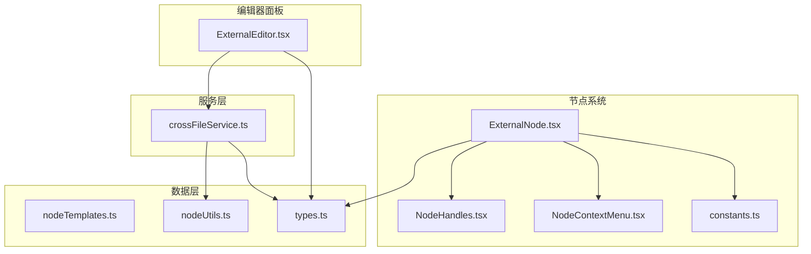
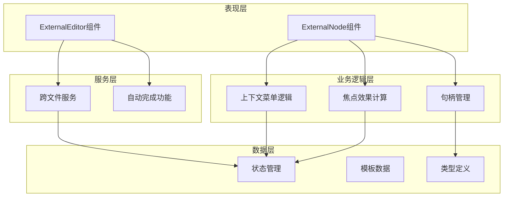
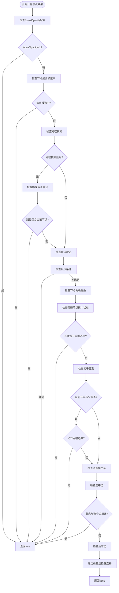
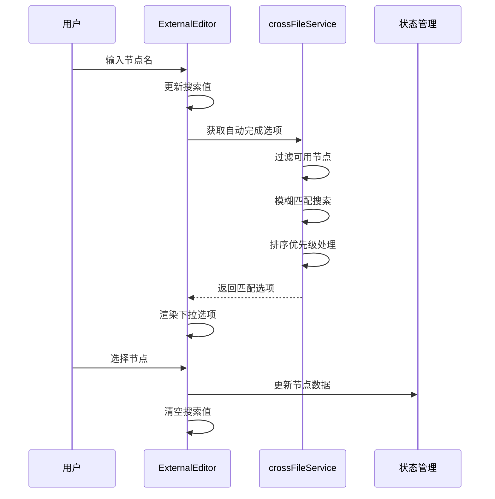
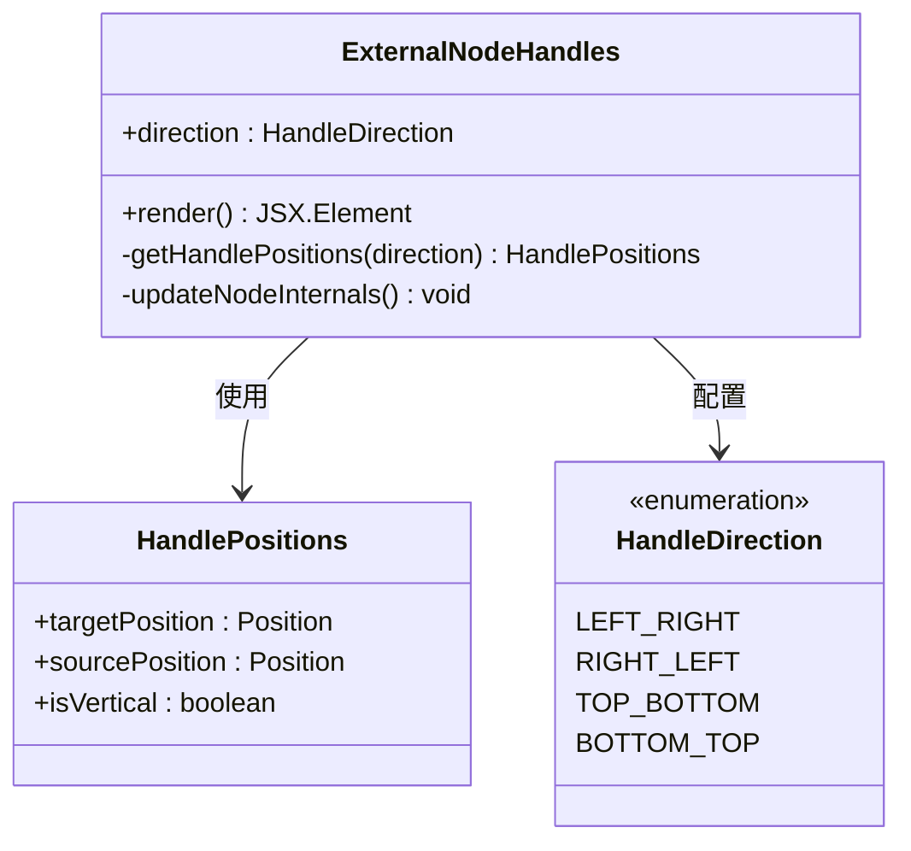
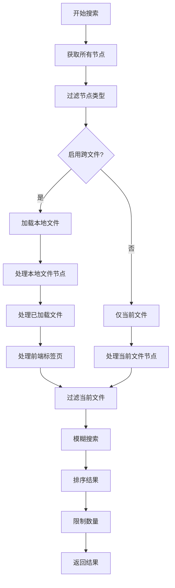

# External节点

<cite>
**本文档引用的文件**
- [ExternalNode.tsx](file://src/components/flow/nodes/ExternalNode.tsx)
- [ExternalEditor.tsx](file://src/components/panels/node-editors/ExternalEditor.tsx)
- [constants.ts](file://src/components/flow/nodes/constants.ts)
- [NodeHandles.tsx](file://src/components/flow/nodes/components/NodeHandles.tsx)
- [NodeContextMenu.tsx](file://src/components/flow/nodes/components/NodeContextMenu.tsx)
- [nodeContextMenu.tsx](file://src/components/flow/nodes/nodeContextMenu.tsx)
- [crossFileService.ts](file://src/services/crossFileService.ts)
- [nodeTemplates.ts](file://src/data/nodeTemplates.ts)
- [nodeUtils.ts](file://src/stores/flow/utils/nodeUtils.ts)
- [types.ts](file://src/stores/flow/types.ts)
- [index.ts](file://src/stores/flow/index.ts)
- [NodeTemplateImages.tsx](file://src/components/flow/nodes/components/NodeTemplateImages.tsx)
</cite>

## 目录
1. [简介](#简介)
2. [项目结构](#项目结构)
3. [核心组件](#核心组件)
4. [架构总览](#架构总览)
5. [详细组件分析](#详细组件分析)
6. [依赖关系分析](#依赖关系分析)
7. [性能考量](#性能考量)
8. [故障排查指南](#故障排查指南)
9. [结论](#结论)
10. [附录](#附录)

## 简介
External节点是一种外部引用节点，用于在流程图中表示对外部文件或远程资源的引用。它通过跨文件服务实现与其他文件节点的关联，支持自动完成功能、模板管理以及与外部文件系统的集成。该节点采用简洁的视觉设计，仅包含标题和必要的输入输出句柄，便于在复杂流程中清晰标识外部引用。

## 项目结构
External节点位于前端React组件体系中，与节点系统、编辑器面板、服务层协同工作：



**图表来源**
- [ExternalNode.tsx:1-167](file://src/components/flow/nodes/ExternalNode.tsx#L1-L167)
- [ExternalEditor.tsx:1-106](file://src/components/panels/node-editors/ExternalEditor.tsx#L1-L106)
- [crossFileService.ts:1-565](file://src/services/crossFileService.ts#L1-L565)

**章节来源**
- [ExternalNode.tsx:1-167](file://src/components/flow/nodes/ExternalNode.tsx#L1-L167)
- [ExternalEditor.tsx:1-106](file://src/components/panels/node-editors/ExternalEditor.tsx#L1-L106)
- [crossFileService.ts:1-565](file://src/services/crossFileService.ts#L1-L565)

## 核心组件
External节点由多个核心组件协同构成，每个组件负责特定的功能领域：

### 节点渲染组件
ExternalNode.tsx实现了节点的主要渲染逻辑，包括焦点效果计算、右键菜单集成和句柄渲染。

### 编辑器组件
ExternalEditor.tsx提供了节点属性编辑功能，支持节点名的自动完成功能。

### 句柄组件
NodeHandles.tsx定义了External节点特有的句柄布局，支持多种方向配置。

### 上下文菜单
NodeContextMenu.tsx和nodeContextMenu.tsx共同提供了完整的右键菜单功能。

**章节来源**
- [ExternalNode.tsx:14-24](file://src/components/flow/nodes/ExternalNode.tsx#L14-L24)
- [ExternalEditor.tsx:8-106](file://src/components/panels/node-editors/ExternalEditor.tsx#L8-L106)
- [NodeHandles.tsx:135-190](file://src/components/flow/nodes/components/NodeHandles.tsx#L135-L190)

## 架构总览
External节点采用分层架构设计，各层职责明确，耦合度低：



**图表来源**
- [ExternalNode.tsx:29-145](file://src/components/flow/nodes/ExternalNode.tsx#L29-L145)
- [ExternalEditor.tsx:9-105](file://src/components/panels/node-editors/ExternalEditor.tsx#L9-L105)
- [crossFileService.ts:55-565](file://src/services/crossFileService.ts#L55-L565)

## 详细组件分析

### ExternalNode组件分析
ExternalNode组件是External节点的核心渲染组件，实现了以下关键功能：

#### 焦点效果计算
组件通过复杂的逻辑计算节点的焦点状态，支持多种场景下的视觉反馈：



**图表来源**
- [ExternalNode.tsx:53-100](file://src/components/flow/nodes/ExternalNode.tsx#L53-L100)

#### 右键菜单集成
组件集成了完整的右键菜单功能，支持复制节点名、删除节点等操作：

**章节来源**
- [ExternalNode.tsx:29-145](file://src/components/flow/nodes/ExternalNode.tsx#L29-L145)

### ExternalEditor组件分析
ExternalEditor组件提供了External节点的属性编辑功能，主要特点包括：

#### 自动完成功能
组件实现了智能的节点名自动完成功能，支持模糊搜索和排序：



**图表来源**
- [ExternalEditor.tsx:19-60](file://src/components/panels/node-editors/ExternalEditor.tsx#L19-L60)
- [crossFileService.ts:531-560](file://src/services/crossFileService.ts#L531-L560)

#### 数据绑定机制
组件通过状态管理实现双向数据绑定，确保节点属性的实时更新。

**章节来源**
- [ExternalEditor.tsx:8-106](file://src/components/panels/node-editors/ExternalEditor.tsx#L8-L106)

### 句柄系统分析
ExternalNodeHandles组件实现了External节点特有的句柄布局：

#### 句柄方向配置
支持四种方向配置：左右、右左、上下、下上，每种方向都有对应的样式类：



**图表来源**
- [NodeHandles.tsx:140-190](file://src/components/flow/nodes/components/NodeHandles.tsx#L140-L190)
- [constants.ts:28-46](file://src/components/flow/nodes/constants.ts#L28-L46)

**章节来源**
- [NodeHandles.tsx:135-190](file://src/components/flow/nodes/components/NodeHandles.tsx#L135-L190)

### 跨文件服务集成
crossFileService提供了External节点与外部文件系统集成的核心能力：

#### 节点搜索机制
服务实现了智能的节点搜索功能，支持跨文件搜索和本地文件扫描：



**图表来源**
- [crossFileService.ts:68-268](file://src/services/crossFileService.ts#L68-L268)

#### 自动完成选项生成
服务为ExternalEditor提供智能的自动完成选项，支持节点名和文件路径的双重匹配。

**章节来源**
- [crossFileService.ts:55-565](file://src/services/crossFileService.ts#L55-L565)

## 依赖关系分析

### 组件依赖图
External节点的依赖关系呈现清晰的层次结构：

```mermaid
graph TB
subgraph "外部依赖"
React[React]
ZUSTAND[Zustand状态管理]
XYFLOW[@xyflow/react]
ANTD[Ant Design]
end
subgraph "内部模块"
ExternalNode[ExternalNode]
ExternalEditor[ExternalEditor]
NodeHandles[NodeHandles]
NodeContextMenu[NodeContextMenu]
crossFileService[crossFileService]
end
subgraph "数据模型"
ExternalNodeDataType[ExternalNodeDataType]
NodeTypeEnum[NodeTypeEnum]
HandleDirection[HandleDirection]
end
ExternalNode --> NodeHandles
ExternalNode --> NodeContextMenu
ExternalNode --> ZUSTAND
ExternalNode --> XYFLOW
ExternalEditor --> crossFileService
ExternalEditor --> ANTD
ExternalEditor --> ZUSTAND
NodeContextMenu --> ANTD
NodeHandles --> XYFLOW
ExternalNode --> ExternalNodeDataType
ExternalEditor --> ExternalNodeDataType
ExternalNode --> NodeTypeEnum
NodeHandles --> HandleDirection
```

**图表来源**
- [ExternalNode.tsx:1-12](file://src/components/flow/nodes/ExternalNode.tsx#L1-L12)
- [ExternalEditor.tsx:1-6](file://src/components/panels/node-editors/ExternalEditor.tsx#L1-L6)
- [NodeHandles.tsx:1-8](file://src/components/flow/nodes/components/NodeHandles.tsx#L1-L8)

### 状态管理集成
External节点与全局状态管理系统的集成关系：

| 状态模块 | 用途 | 集成方式 |
|---------|------|----------|
| flowStore | 节点数据管理 | 读取/更新节点属性 |
| configStore | 配置参数 | 获取焦点透明度设置 |
| fileStore | 文件信息 | 获取当前文件配置 |
| localFileStore | 本地文件 | 获取文件节点信息 |

**章节来源**
- [ExternalNode.tsx:30-50](file://src/components/flow/nodes/ExternalNode.tsx#L30-L50)
- [ExternalEditor.tsx:10](file://src/components/panels/node-editors/ExternalEditor.tsx#L10)

## 性能考量
External节点在设计时充分考虑了性能优化：

### 渲染优化
- 使用React.memo避免不必要的重渲染
- useMemo缓存计算结果，减少重复计算
- 条件渲染减少DOM节点数量

### 数据加载优化
- 自动完成功能实现请求防抖，避免频繁网络请求
- 图片资源加载采用缓存机制，提升用户体验
- 跨文件搜索结果进行数量限制，防止内存溢出

### 内存管理
- 组件卸载时清理定时器和事件监听器
- 使用useEffect清理函数避免内存泄漏
- 状态更新采用批量处理，减少重绘次数

## 故障排查指南

### 常见问题及解决方案

#### 节点无法显示焦点效果
**症状**: 节点在非选中状态下完全透明
**原因**: focusOpacity配置为0或焦点计算逻辑异常
**解决**: 检查配置中心的focusOpacity设置，确认焦点计算逻辑

#### 自动完成功能失效
**症状**: ExternalEditor无法显示节点建议
**原因**: crossFileService连接异常或节点数据加载失败
**解决**: 检查LocalBridge连接状态，确认文件扫描功能正常

#### 句柄位置显示异常
**症状**: External节点句柄位置不正确
**原因**: 句柄方向配置错误或节点尺寸计算异常
**解决**: 检查handleDirection配置，确认节点尺寸更新

**章节来源**
- [ExternalNode.tsx:121-125](file://src/components/flow/nodes/ExternalNode.tsx#L121-L125)
- [ExternalEditor.tsx:19-32](file://src/components/panels/node-editors/ExternalEditor.tsx#L19-L32)

## 结论
External节点作为流程图系统的重要组成部分，通过精心设计的架构实现了以下目标：

1. **清晰的职责分离**: 各组件职责明确，便于维护和扩展
2. **强大的集成能力**: 与跨文件服务深度集成，支持复杂的外部引用场景
3. **优秀的用户体验**: 智能的自动完成功能和流畅的交互体验
4. **良好的性能表现**: 通过多种优化技术确保系统的高效运行

该节点的设计体现了现代前端开发的最佳实践，为用户提供了强大而易用的外部引用功能。

## 附录

### 配置选项参考
| 配置项 | 类型 | 默认值 | 描述 |
|--------|------|--------|------|
| handleDirection | HandleDirection | "left-right" | 节点句柄方向配置 |
| focusOpacity | number | 0.3 | 焦点效果透明度 |
| label | string | 节点ID | 节点显示名称 |

### API接口说明
- `createExternalNode()`: 创建新的External节点
- `crossFileService.getAutoCompleteOptions()`: 获取自动完成选项
- `crossFileService.searchNodes()`: 搜索节点
- `crossFileService.navigateToNode()`: 跳转到指定节点

### 使用示例路径
- [External节点创建示例:57-85](file://src/stores/flow/utils/nodeUtils.ts#L57-L85)
- [自动完成功能示例:19-60](file://src/components/panels/node-editors/ExternalEditor.tsx#L19-L60)
- [跨文件搜索示例:207-268](file://src/services/crossFileService.ts#L207-L268)