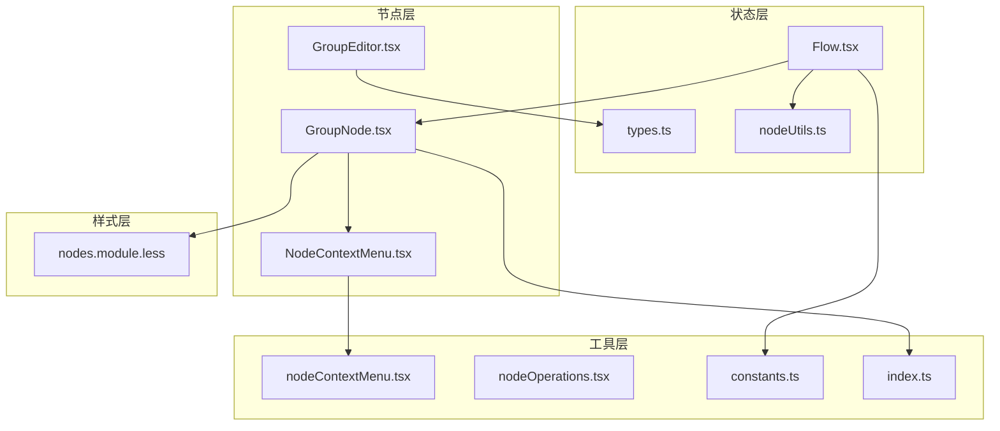
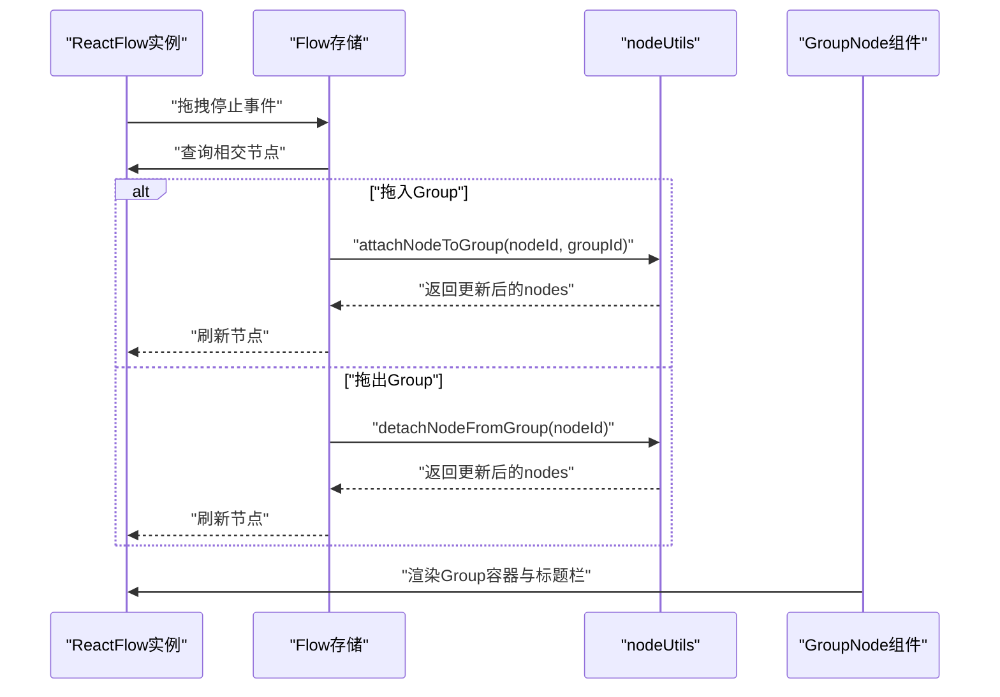
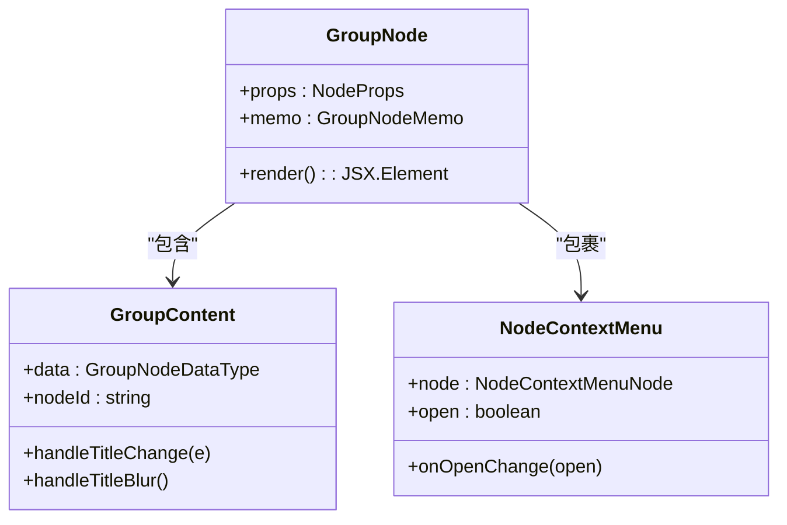
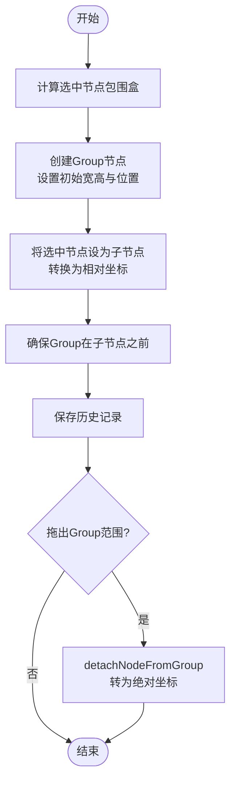
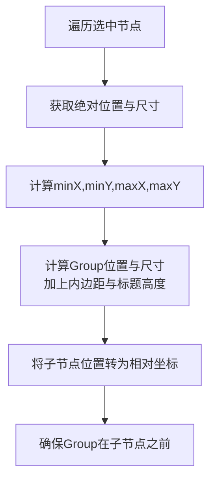
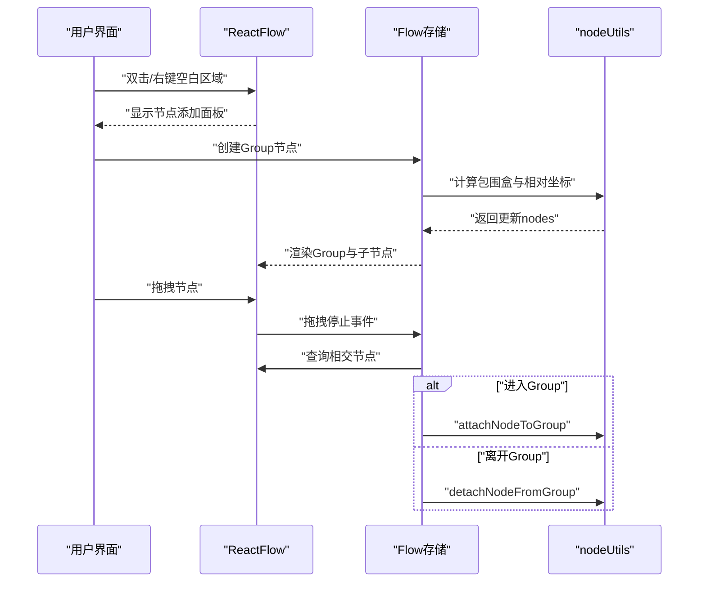
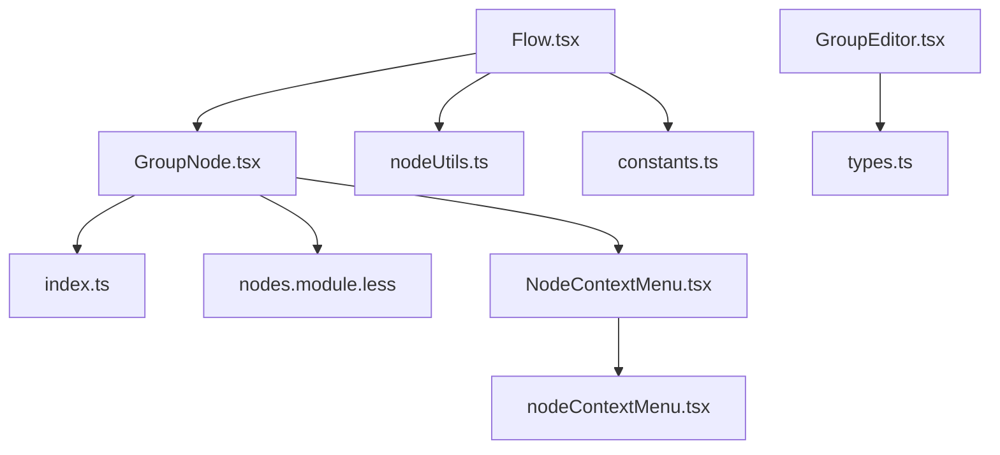

# Group节点

<cite>
**本文档引用的文件**
- [GroupNode.tsx](file://src/components/flow/nodes/GroupNode.tsx)
- [types.ts](file://src/stores/flow/types.ts)
- [GroupEditor.tsx](file://src/components/panels/node-editors/GroupEditor.tsx)
- [nodeContextMenu.tsx](file://src/components/flow/nodes/nodeContextMenu.tsx)
- [Flow.tsx](file://src/components/Flow.tsx)
- [nodes.module.less](file://src/styles/nodes.module.less)
- [nodeOperations.tsx](file://src/components/flow/nodes/utils/nodeOperations.tsx)
- [nodeUtils.ts](file://src/stores/flow/utils/nodeUtils.ts)
- [constants.ts](file://src/components/flow/nodes/constants.ts)
- [index.ts](file://src/components/flow/nodes/index.ts)
- [NodeContextMenu.tsx](file://src/components/flow/nodes/components/NodeContextMenu.tsx)
</cite>

## 目录
1. [简介](#简介)
2. [项目结构](#项目结构)
3. [核心组件](#核心组件)
4. [架构总览](#架构总览)
5. [详细组件分析](#详细组件分析)
6. [依赖关系分析](#依赖关系分析)
7. [性能考虑](#性能考虑)
8. [故障排除指南](#故障排除指南)
9. [结论](#结论)
10. [附录](#附录)

## 简介
本文件系统性地阐述Group节点作为分组容器的设计原理与实现细节，涵盖分组机制、子节点管理、边界计算逻辑、折叠展开行为、层级结构维护与嵌套关系处理，并说明与React Flow框架的集成方式及组内节点的选择、移动与操作能力。同时提供使用场景与最佳实践，包括复杂工作流的模块化组织、批量操作与权限控制等高级功能。

## 项目结构
Group节点位于前端工作流编辑器的节点体系中，采用React + TypeScript + Zustand + Ant Design + Less的组合实现。其核心文件分布如下：
- 节点渲染与交互：GroupNode.tsx、NodeContextMenu.tsx、index.ts
- 状态管理：types.ts、nodeUtils.ts、Flow.tsx
- 编辑器与样式：GroupEditor.tsx、nodes.module.less
- 上下文菜单与工具：nodeContextMenu.tsx、nodeOperations.tsx、constants.ts

**图表来源**
- [GroupNode.tsx:1-184](file://src/components/flow/nodes/GroupNode.tsx#L1-L184)
- [NodeContextMenu.tsx:1-171](file://src/components/flow/nodes/components/NodeContextMenu.tsx#L1-L171)
- [GroupEditor.tsx:1-97](file://src/components/panels/node-editors/GroupEditor.tsx#L1-L97)
- [types.ts:151-163](file://src/stores/flow/types.ts#L151-L163)
- [nodeUtils.ts:277-315](file://src/stores/flow/utils/nodeUtils.ts#L277-L315)
- [Flow.tsx:193-542](file://src/components/Flow.tsx#L193-L542)
- [nodes.module.less:632-694](file://src/styles/nodes.module.less#L632-L694)
- [nodeContextMenu.tsx:369-586](file://src/components/flow/nodes/nodeContextMenu.tsx#L369-L586)
- [nodeOperations.tsx:1-184](file://src/components/flow/nodes/utils/nodeOperations.tsx#L1-L184)
- [constants.ts:13-20](file://src/components/flow/nodes/constants.ts#L13-L20)
- [index.ts:1-26](file://src/components/flow/nodes/index.ts#L1-L26)

**章节来源**
- [GroupNode.tsx:1-184](file://src/components/flow/nodes/GroupNode.tsx#L1-L184)
- [Flow.tsx:193-542](file://src/components/Flow.tsx#L193-L542)

## 核心组件
- Group节点数据模型：GroupNodeDataType定义了标签与颜色主题；GroupNodeType扩展了位置、选中与测量信息。
- Group节点渲染：GroupNode组件负责渲染分组容器、标题栏与内容区，支持调整大小与右键菜单。
- 分组编辑器：GroupEditor提供名称与颜色主题的可视化编辑。
- 上下文菜单：针对Group节点提供颜色切换、解散分组与删除分组等专用菜单项。
- 状态与工具：通过Flow存储与nodeUtils实现分组创建、子节点附着/脱离、绝对坐标转换与顺序保证。

**章节来源**
- [types.ts:151-163](file://src/stores/flow/types.ts#L151-L163)
- [types.ts:222-235](file://src/stores/flow/types.ts#L222-L235)
- [GroupNode.tsx:112-161](file://src/components/flow/nodes/GroupNode.tsx#L112-L161)
- [GroupEditor.tsx:20-97](file://src/components/panels/node-editors/GroupEditor.tsx#L20-L97)
- [nodeContextMenu.tsx:369-418](file://src/components/flow/nodes/nodeContextMenu.tsx#L369-L418)
- [nodeUtils.ts:277-315](file://src/stores/flow/utils/nodeUtils.ts#L277-L315)

## 架构总览
Group节点与React Flow的集成遵循以下模式：
- 节点注册：通过nodeTypes将Group节点映射到NodeTypeEnum.Group。
- 渲染：GroupNode使用NodeResizer提供可调整大小的容器，内部包含标题栏与内容区。
- 交互：NodeContextMenu封装右键菜单，Group节点拥有专用菜单项。
- 状态：Flow存储提供groupSelectedNodes、attachNodeToGroup、detachNodeFromGroup等操作。
- 坐标：nodeUtils提供绝对坐标转换与顺序保证，确保父子关系正确渲染。

**图表来源**
- [Flow.tsx:361-413](file://src/components/Flow.tsx#L361-L413)
- [nodeUtils.ts:637-689](file://src/stores/flow/utils/nodeUtils.ts#L637-L689)
- [GroupNode.tsx:140-160](file://src/components/flow/nodes/GroupNode.tsx#L140-L160)

## 详细组件分析

### Group节点渲染与交互
- 容器与样式：GroupNode使用NodeResizer提供调整大小能力，容器样式由nodes.module.less定义，支持选中态高亮与虚线边框。
- 标题栏：标题输入框支持直接编辑，失焦自动保存历史。
- 右键菜单：通过NodeContextMenu组件包裹，Group节点拥有颜色切换、解散分组与删除分组等专用菜单项。

**图表来源**
- [GroupNode.tsx:112-161](file://src/components/flow/nodes/GroupNode.tsx#L112-L161)
- [GroupNode.tsx:52-109](file://src/components/flow/nodes/GroupNode.tsx#L52-L109)
- [NodeContextMenu.tsx:24-167](file://src/components/flow/nodes/components/NodeContextMenu.tsx#L24-L167)

**章节来源**
- [GroupNode.tsx:112-161](file://src/components/flow/nodes/GroupNode.tsx#L112-L161)
- [nodes.module.less:632-694](file://src/styles/nodes.module.less#L632-L694)
- [NodeContextMenu.tsx:24-167](file://src/components/flow/nodes/components/NodeContextMenu.tsx#L24-L167)

### 分组机制与子节点管理
- 创建分组：groupSelectedNodes计算选中节点包围盒，生成Group节点并将其余节点转为相对坐标，确保Group在子节点之前。
- 附着/脱离：attachNodeToGroup将节点设为某Group子节点并转换为相对坐标；detachNodeFromGroup将子节点转为绝对坐标并清除parentId。
- 删除处理：当Group节点被删除时，先将其子节点脱离并恢复绝对坐标，避免孤立节点。

**图表来源**
- [nodeUtils.ts:523-598](file://src/stores/flow/utils/nodeUtils.ts#L523-L598)
- [nodeUtils.ts:637-689](file://src/stores/flow/utils/nodeUtils.ts#L637-L689)
- [Flow.tsx:361-413](file://src/components/Flow.tsx#L361-L413)

**章节来源**
- [nodeUtils.ts:523-598](file://src/stores/flow/utils/nodeUtils.ts#L523-L598)
- [nodeUtils.ts:637-689](file://src/stores/flow/utils/nodeUtils.ts#L637-L689)
- [Flow.tsx:361-413](file://src/components/Flow.tsx#L361-L413)

### 边界计算逻辑
- 包围盒计算：基于选中节点的测量宽高与绝对位置，计算最小包围矩形并加上固定内边距与标题高度。
- 绝对坐标转换：getNodeAbsolutePosition递归累加父节点位置，确保子节点在Group内显示正确。
- 顺序保证：ensureGroupNodeOrder确保Group节点排在子节点之前，满足React Flow渲染要求。

**图表来源**
- [nodeUtils.ts:192-213](file://src/stores/flow/utils/nodeUtils.ts#L192-L213)
- [nodeUtils.ts:321-334](file://src/stores/flow/utils/nodeUtils.ts#L321-L334)
- [nodeUtils.ts:523-598](file://src/stores/flow/utils/nodeUtils.ts#L523-L598)

**章节来源**
- [nodeUtils.ts:192-213](file://src/stores/flow/utils/nodeUtils.ts#L192-L213)
- [nodeUtils.ts:321-334](file://src/stores/flow/utils/nodeUtils.ts#L321-L334)
- [nodeUtils.ts:523-598](file://src/stores/flow/utils/nodeUtils.ts#L523-L598)

### 折叠展开行为与层级结构维护
- 折叠/展开：Group节点本身不直接暴露折叠/展开API，但可通过“解散分组”将子节点还原为独立节点，达到“展开”的效果；“创建分组”将多个节点整合为一个容器，达到“折叠”的效果。
- 嵌套关系：通过parentId维护父子关系，getNodeAbsolutePosition支持多层嵌套的绝对坐标计算；ensureGroupNodeOrder保证渲染顺序。

**章节来源**
- [nodeUtils.ts:192-213](file://src/stores/flow/utils/nodeUtils.ts#L192-L213)
- [nodeUtils.ts:321-334](file://src/stores/flow/utils/nodeUtils.ts#L321-L334)
- [Flow.tsx:361-413](file://src/components/Flow.tsx#L361-L413)

### 与React Flow的集成
- 节点注册：index.ts将Group节点注册到React Flow的nodeTypes中。
- 事件处理：Flow.tsx在拖拽停止时检测Group相交，调用attach/detach方法；在拖拽过程中提供磁吸对齐与过滤Group节点。
- 选择与操作：支持选中多个节点后创建分组；右键菜单提供Group专用操作。

**图表来源**
- [index.ts:8-14](file://src/components/flow/nodes/index.ts#L8-L14)
- [Flow.tsx:264-289](file://src/components/Flow.tsx#L264-L289)
- [Flow.tsx:361-413](file://src/components/Flow.tsx#L361-L413)
- [nodeUtils.ts:637-689](file://src/stores/flow/utils/nodeUtils.ts#L637-L689)

**章节来源**
- [index.ts:8-14](file://src/components/flow/nodes/index.ts#L8-L14)
- [Flow.tsx:264-289](file://src/components/Flow.tsx#L264-L289)
- [Flow.tsx:361-413](file://src/components/Flow.tsx#L361-L413)

### 组内节点的选择、移动与操作
- 选择：选中多个非Group节点后创建分组；Group节点自身不参与常规节点选择流程。
- 移动：Group容器整体移动时，子节点保持相对位置不变；拖出Group范围时自动脱离。
- 操作：通过右键菜单对Group进行颜色调整、解散与删除；支持复制节点名、保存模板、删除节点等通用操作。

**章节来源**
- [Flow.tsx:424-427](file://src/components/Flow.tsx#L424-L427)
- [nodeContextMenu.tsx:369-418](file://src/components/flow/nodes/nodeContextMenu.tsx#L369-L418)
- [nodeOperations.tsx:17-28](file://src/components/flow/nodes/utils/nodeOperations.tsx#L17-L28)

## 依赖关系分析
- 组件耦合：GroupNode依赖NodeResizer、NodeContextMenu与样式模块；NodeContextMenu依赖上下文菜单配置与调试状态。
- 状态依赖：Flow存储提供节点增删改查、分组操作与历史记录；nodeUtils提供坐标转换与顺序保证。
- 外部依赖：React Flow提供节点渲染与交互；Ant Design提供菜单与表单组件；Less提供样式模块化。

**图表来源**
- [GroupNode.tsx:1-11](file://src/components/flow/nodes/GroupNode.tsx#L1-L11)
- [index.ts:1-26](file://src/components/flow/nodes/index.ts#L1-L26)
- [NodeContextMenu.tsx:1-171](file://src/components/flow/nodes/components/NodeContextMenu.tsx#L1-L171)
- [nodeContextMenu.tsx:1-586](file://src/components/flow/nodes/nodeContextMenu.tsx#L1-L586)
- [Flow.tsx:193-542](file://src/components/Flow.tsx#L193-L542)
- [nodeUtils.ts:1-335](file://src/stores/flow/utils/nodeUtils.ts#L1-L335)
- [constants.ts:1-47](file://src/components/flow/nodes/constants.ts#L1-L47)
- [GroupEditor.tsx:1-97](file://src/components/panels/node-editors/GroupEditor.tsx#L1-L97)
- [types.ts:151-163](file://src/stores/flow/types.ts#L151-L163)

**章节来源**
- [GroupNode.tsx:1-11](file://src/components/flow/nodes/GroupNode.tsx#L1-L11)
- [Flow.tsx:193-542](file://src/components/Flow.tsx#L193-L542)

## 性能考虑
- 节点数量与层级：Group节点本身不承载业务逻辑，主要影响渲染层级与布局计算；建议合理控制分组深度，避免过深嵌套导致布局计算开销。
- 磁吸与对齐：拖拽过程中的磁吸计算会过滤Group节点，减少不必要的对齐尝试，提升性能。
- 历史记录：分组操作与节点移动会触发历史记录保存，建议在批量操作时合并保存以降低频繁写入成本。

## 故障排除指南
- 分组后子节点位置异常：检查ensureGroupNodeOrder是否生效，确认Group在子节点之前；核对parentId与position转换逻辑。
- 拖拽时子节点未正确附着/脱离：确认React Flow实例可用，检查相交检测与过滤条件；确保attach/detach调用时机正确。
- 删除Group导致子节点丢失：确认删除Group时已先脱离子节点并恢复绝对坐标。

**章节来源**
- [nodeUtils.ts:321-334](file://src/stores/flow/utils/nodeUtils.ts#L321-L334)
- [Flow.tsx:361-413](file://src/components/Flow.tsx#L361-L413)

## 结论
Group节点通过清晰的容器设计与完善的子节点管理机制，实现了复杂工作流的模块化组织。其与React Flow的深度集成提供了直观的拖拽、选择与操作体验，配合上下文菜单与编辑器，满足从简单分组到高级权限控制的多种使用场景。建议在实际应用中结合批量操作与历史记录策略，优化性能与用户体验。

## 附录
- 使用场景与最佳实践
  - 模块化组织：将相关节点按功能或阶段分组，便于维护与复用。
  - 批量操作：选中多个节点后统一创建分组，减少重复劳动。
  - 权限控制：通过右键菜单限制敏感操作（如删除），或在应用层面对Group节点进行访问控制。
  - 视觉管理：利用颜色主题区分不同类型的分组，提升可读性。
  - 嵌套策略：避免过度嵌套，保持分组层次扁平化，便于导航与调试。