# Pipeline节点

<cite>
**本文引用的文件**
- [PipelineNode/index.tsx](file://src/components/flow/nodes/PipelineNode/index.tsx)
- [PipelineNode/ClassicContent.tsx](file://src/components/flow/nodes/PipelineNode/ClassicContent.tsx)
- [PipelineNode/ModernContent.tsx](file://src/components/flow/nodes/PipelineNode/ModernContent.tsx)
- [PipelineNode/MinimalContent.tsx](file://src/components/flow/nodes/PipelineNode/MinimalContent.tsx)
- [ExplorationPanel.module.less](file://src/styles/panels/ExplorationPanel.module.less)
- [explorationSlice.ts](file://src/stores/flow/slices/explorationSlice.ts)
- [anchorRefSlice.ts](file://src/stores/flow/slices/anchorRefSlice.ts)
- [nodes.module.less](file://src/styles/flow/nodes.module.less)
- [configStore.ts](file://src/stores/configStore.ts)
- [debugStore.ts](file://src/stores/debugStore.ts)
- [types.ts](file://src/stores/flow/types.ts)
- [constants.ts](file://src/components/flow/nodes/constants.ts)
- [utils.ts](file://src/components/flow/nodes/utils.ts)
- [NodeHandles.tsx](file://src/components/flow/nodes/components/NodeHandles.tsx)
- [KVElem.tsx](file://src/components/flow/nodes/components/KVElem.tsx)
- [NodeTemplateImages.tsx](file://src/components/flow/nodes/components/NodeTemplateImages.tsx)
- [AnchorNode.tsx](file://src/components/flow/nodes/AnchorNode.tsx)
</cite>

## 更新摘要
**变更内容**
- 新增幽灵节点(ghost node)支持用于AI生成步骤预览
- 新增内联动作按钮支持快速执行和确认
- 新增特殊样式系统支持探索模式和调试状态
- 增强节点状态管理和交互体验

## 目录
1. [简介](#简介)
2. [项目结构](#项目结构)
3. [核心组件](#核心组件)
4. [架构总览](#架构总览)
5. [详细组件分析](#详细组件分析)
6. [依赖关系分析](#依赖关系分析)
7. [性能考量](#性能考量)
8. [故障排查指南](#故障排查指南)
9. [结论](#结论)
10. [附录](#附录)

## 简介
本文件面向Pipeline节点的技术文档，系统阐述其作为工作流核心节点的设计原理与实现机制，覆盖三种显示样式（ClassicContent、ModernContent、MinimalContent）的特性与适用场景；详解节点渲染逻辑、内容布局、交互行为；解释节点与Pipeline配置数据的绑定关系及状态变化处理；并提供节点自定义样式的开发指南与最佳实践。

**更新** 新增幽灵节点支持用于AI生成步骤预览，内联动作按钮支持快速执行和确认，特殊样式系统增强节点状态管理。

## 项目结构
Pipeline节点位于前端工作流编辑器的"节点"体系中，采用按功能模块组织的目录结构：
- 节点渲染：PipelineNode/index.tsx负责整体渲染与样式绑定，新增幽灵节点和内联动作按钮支持
- 内容样式：ClassicContent、ModernContent、MinimalContent分别实现三种显示风格
- 探索模式：explorationSlice.ts提供AI探索和幽灵节点管理
- 样式与主题：nodes.module.less统一管理节点CSS类，包含锚点引用高亮样式
- 配置与状态：configStore.ts、debugStore.ts提供配置与调试状态
- 工具与图标：utils.ts提供图标映射与颜色配置；NodeHandles.tsx提供句柄渲染
- 数据模型：types.ts定义PipelineNodeDataType等类型

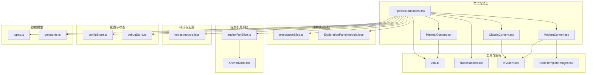

**图表来源**
- [PipelineNode/index.tsx:1-350](file://src/components/flow/nodes/PipelineNode/index.tsx#L1-L350)
- [explorationSlice.ts:1-270](file://src/stores/flow/slices/explorationSlice.ts#L1-L270)
- [ExplorationPanel.module.less:248-287](file://src/styles/panels/ExplorationPanel.module.less#L248-L287)

**章节来源**
- [PipelineNode/index.tsx:1-350](file://src/components/flow/nodes/PipelineNode/index.tsx#L1-L350)
- [explorationSlice.ts:1-270](file://src/stores/flow/slices/explorationSlice.ts#L1-L270)
- [nodes.module.less:1-795](file://src/styles/flow/nodes.module.less#L1-L795)

## 核心组件
- PipelineNode：节点渲染入口，负责根据配置选择内容组件、计算焦点透明度、应用调试样式、挂载右键菜单，**新增幽灵节点支持和内联动作按钮**。
- ClassicContent：经典风格内容，以键值对列表展示识别、动作、其他参数。
- ModernContent：现代风格内容，分"识别/动作/其他"三区，支持图标、模板图片预览、focus子项拆分显示。
- MinimalContent：极简风格内容，仅保留图标与标签，配色随识别类型动态变化。
- **explorationSlice**：探索模式状态管理，提供幽灵节点创建、执行和确认功能。
- **ExplorationPanel.module.less**：探索模式样式定义，包含幽灵节点样式和内联动作按钮样式。
- **anchorRefSlice**：锚点引用索引管理，提供锚点名称到节点ID的映射，支持锚点高亮功能。
- NodeHandles：句柄渲染，支持四种方向（左右/上下），区分普通与极简风格样式。
- KVElem：键值对渲染单元，统一展示参数键与值。
- NodeTemplateImages：模板图片预览，基于WebSocket资源协议异步请求并缓存图片。
- utils：图标映射、颜色配置、节点类型图标。
- configStore：节点样式、句柄方向、模板图片与字段显示等全局配置。
- debugStore：调试模式下的执行状态、历史记录、识别记录等。

**章节来源**
- [PipelineNode/index.tsx:25-289](file://src/components/flow/nodes/PipelineNode/index.tsx#L25-L289)
- [explorationSlice.ts:34-270](file://src/stores/flow/slices/explorationSlice.ts#L34-L270)
- [ExplorationPanel.module.less:248-287](file://src/styles/panels/ExplorationPanel.module.less#L248-L287)
- [anchorRefSlice.ts:57-101](file://src/stores/flow/slices/anchorRefSlice.ts#L57-L101)
- [PipelineNode/ClassicContent.tsx:16-120](file://src/components/flow/nodes/PipelineNode/ClassicContent.tsx#L16-L120)
- [PipelineNode/ModernContent.tsx:34-280](file://src/components/flow/nodes/PipelineNode/ModernContent.tsx#L34-L280)
- [PipelineNode/MinimalContent.tsx:11-58](file://src/components/flow/nodes/PipelineNode/MinimalContent.tsx#L11-L58)

## 架构总览
Pipeline节点的渲染与交互遵循以下关键流程：
- 配置驱动：读取configStore中的nodeStyle、focusOpacity、showNodeTemplateImages、showNodeDetailFields等配置，决定渲染风格与可见性。
- 状态联动：结合flowStore的选中/边/路径状态与debugStore的调试状态，动态计算节点透明度与样式类。
- **幽灵节点支持**：通过explorationSlice管理探索模式状态，支持创建、执行和确认幽灵节点。
- **内联动作按钮**：在活跃幽灵节点上显示执行和确认按钮，支持快速操作。
- 内容选择：根据nodeStyle切换Classic/Modern/Minimal内容组件。
- 交互扩展：在存在完整Node对象时包裹右键菜单，提供上下文操作。
- 句柄渲染：依据handleDirection与风格选择普通或极简句柄样式。

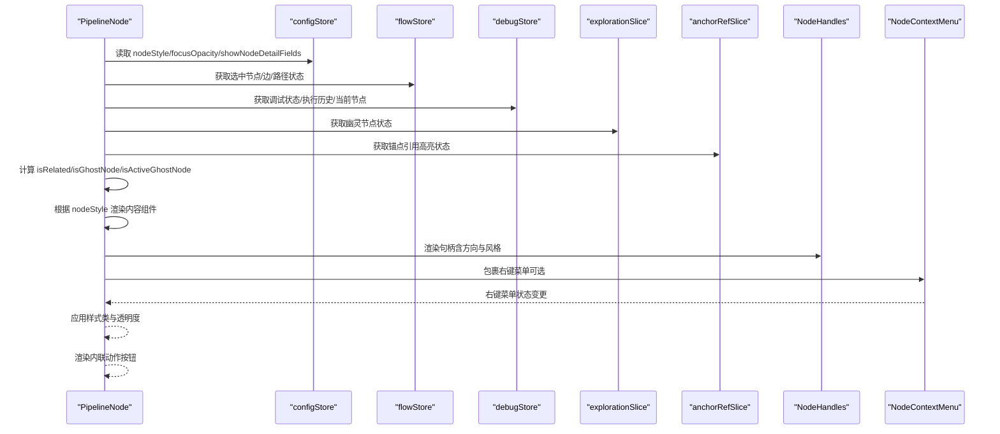

**图表来源**
- [PipelineNode/index.tsx:25-289](file://src/components/flow/nodes/PipelineNode/index.tsx#L25-L289)
- [explorationSlice.ts:34-270](file://src/stores/flow/slices/explorationSlice.ts#L34-L270)
- [configStore.ts:163-267](file://src/stores/configStore.ts#L163-L267)
- [debugStore.ts:227-800](file://src/stores/debugStore.ts#L227-L800)

## 详细组件分析

### PipelineNode 渲染与状态绑定
- 配置读取：从configStore读取nodeStyle、focusOpacity、showNodeTemplateImages、showNodeDetailFields等，作为渲染与可见性的依据。
- 焦点计算：isRelated综合考虑选中状态、路径模式、分组关系、边连接关系等，决定是否保持不透明。
- **幽灵节点检测**：isGhostNode基于data.extras.isGhost判断节点是否为幽灵节点；isActiveGhostNode判断是否为当前活跃的幽灵节点。
- **内联动作按钮**：当isActiveGhostNode为true时，渲染执行和确认按钮，支持快速操作。
- 样式类：根据selected、nodeStyle、调试状态（执行中/已执行/识别中/失败）和**锚点引用高亮**动态拼装CSS类，**新增幽灵节点样式**。
- 透明度：若非相关且focusOpacity小于1，则应用透明度样式。
- 内容渲染：根据nodeStyle选择Classic/Modern/Minimal内容组件。
- 右键菜单：当存在完整Node对象时，包裹NodeContextMenu以提供上下文操作。

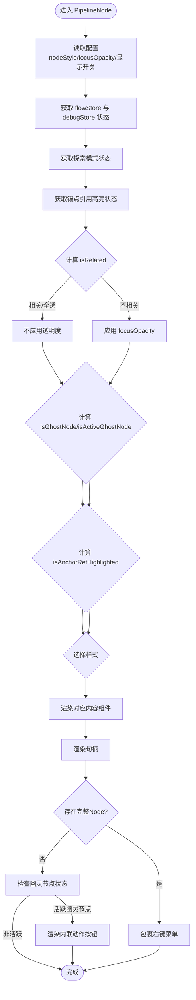

**图表来源**
- [PipelineNode/index.tsx:25-289](file://src/components/flow/nodes/PipelineNode/index.tsx#L25-L289)
- [PipelineNode/index.tsx:38-43](file://src/components/flow/nodes/PipelineNode/index.tsx#L38-L43)

**章节来源**
- [PipelineNode/index.tsx:25-289](file://src/components/flow/nodes/PipelineNode/index.tsx#L25-L289)
- [PipelineNode/index.tsx:38-43](file://src/components/flow/nodes/PipelineNode/index.tsx#L38-L43)
- [configStore.ts:163-267](file://src/stores/configStore.ts#L163-L267)
- [debugStore.ts:227-800](file://src/stores/debugStore.ts#L227-L800)

### explorationSlice（探索模式状态管理）
- **状态管理**：管理探索模式的完整生命周期，包括idle、predicting、reviewing、executing、completed状态。
- **幽灵节点创建**：通过predictExplorationStep生成AI预测结果，创建带有isGhost标记的临时节点。
- **执行控制**：提供execute方法执行当前方案，confirm方法确认并创建下一个幽灵节点。
- **进度跟踪**：支持进度阶段和详细信息的实时更新。
- **位置计算**：使用calculateGhostNodePosition智能计算幽灵节点的位置。

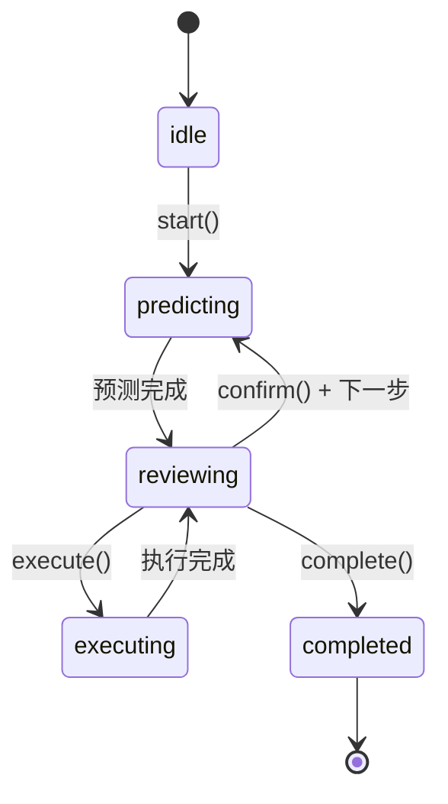

**图表来源**
- [explorationSlice.ts:21-32](file://src/stores/flow/slices/explorationSlice.ts#L21-L32)
- [explorationSlice.ts:42-118](file://src/stores/flow/slices/explorationSlice.ts#L42-L118)
- [explorationSlice.ts:120-142](file://src/stores/flow/slices/explorationSlice.ts#L120-L142)
- [explorationSlice.ts:144-231](file://src/stores/flow/slices/explorationSlice.ts#L144-L231)

**章节来源**
- [explorationSlice.ts:21-32](file://src/stores/flow/slices/explorationSlice.ts#L21-L32)
- [explorationSlice.ts:42-118](file://src/stores/flow/slices/explorationSlice.ts#L42-L118)
- [explorationSlice.ts:120-142](file://src/stores/flow/slices/explorationSlice.ts#L120-L142)
- [explorationSlice.ts:144-231](file://src/stores/flow/slices/explorationSlice.ts#L144-L231)

### ExplorationPanel.module.less（探索模式样式）
- **幽灵节点样式**：定义虚线边框、半透明背景和特殊标签，突出显示AI生成的临时节点。
- **内联动作按钮**：提供执行和确认按钮的样式定义，支持悬停和激活状态。
- **动画效果**：包含幽灵节点的脉冲动画和按钮的过渡效果。
- **主题适配**：支持明暗主题的自动适配。

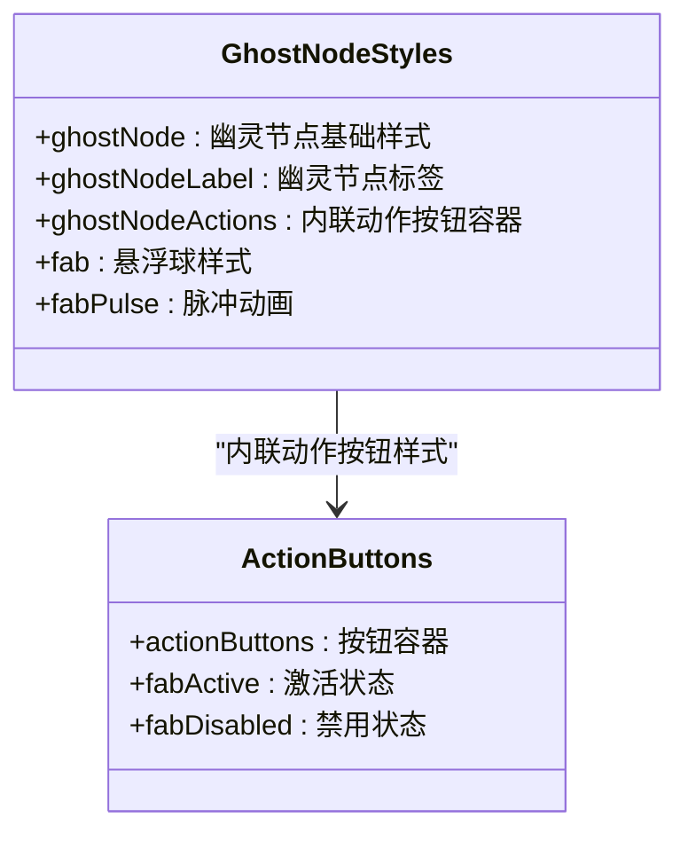

**图表来源**
- [ExplorationPanel.module.less:248-287](file://src/styles/panels/ExplorationPanel.module.less#L248-L287)

**章节来源**
- [ExplorationPanel.module.less:248-287](file://src/styles/panels/ExplorationPanel.module.less#L248-L287)

### anchorRefSlice（锚点引用索引）
- **锚点名称提取**：支持字符串、字符串数组、对象三种格式的anchor字段解析。
- **索引构建**：遍历所有Pipeline节点，提取anchor名称并建立名称到节点ID集合的映射。
- **高亮管理**：提供setSelectedAnchorName方法，根据选中的锚点名称计算需要高亮的节点ID集合。
- **查询接口**：getNodesUsingAnchor方法返回使用指定anchor的节点ID列表。

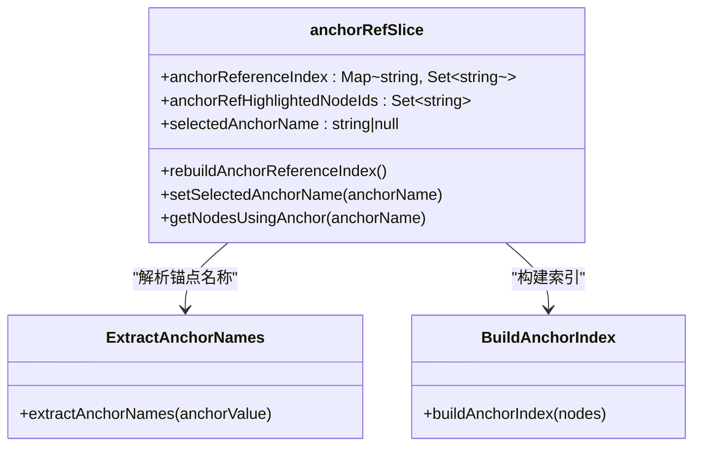

**图表来源**
- [anchorRefSlice.ts:12-31](file://src/stores/flow/slices/anchorRefSlice.ts#L12-L31)
- [anchorRefSlice.ts:36-55](file://src/stores/flow/slices/anchorRefSlice.ts#L36-L55)
- [anchorRefSlice.ts:57-101](file://src/stores/flow/slices/anchorRefSlice.ts#L57-L101)

**章节来源**
- [anchorRefSlice.ts:12-31](file://src/stores/flow/slices/anchorRefSlice.ts#L12-L31)
- [anchorRefSlice.ts:36-55](file://src/stores/flow/slices/anchorRefSlice.ts#L36-L55)
- [anchorRefSlice.ts:57-101](file://src/stores/flow/slices/anchorRefSlice.ts#L57-L101)

### ClassicContent（经典风格）
- 展示结构：标题 + 识别模块 + 动作模块 + 其他模块（可选）。
- 识别/动作模块：展示type与param键值对；受showNodeDetailFields控制是否展开。
- 其他模块：过滤空的focus字段，避免冗余显示；extras支持对象或字符串转对象渲染。
- 句柄：渲染标准句柄，方向由handleDirection决定。

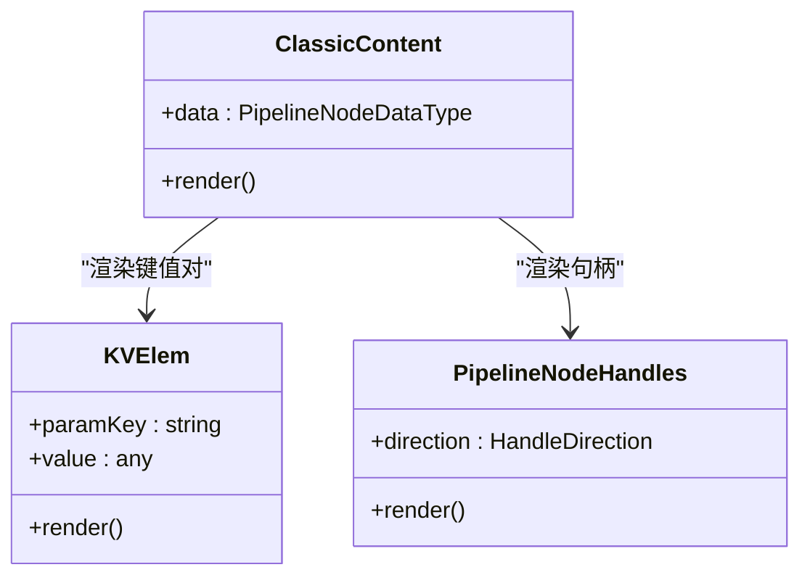

**图表来源**
- [PipelineNode/ClassicContent.tsx:16-120](file://src/components/flow/nodes/PipelineNode/ClassicContent.tsx#L16-L120)
- [KVElem.tsx:5-19](file://src/components/flow/nodes/components/KVElem.tsx#L5-L19)
- [NodeHandles.tsx:36-131](file://src/components/flow/nodes/components/NodeHandles.tsx#L36-L131)

**章节来源**
- [PipelineNode/ClassicContent.tsx:16-120](file://src/components/flow/nodes/PipelineNode/ClassicContent.tsx#L16-L120)
- [KVElem.tsx:5-19](file://src/components/flow/nodes/components/KVElem.tsx#L5-L19)
- [NodeHandles.tsx:36-131](file://src/components/flow/nodes/components/NodeHandles.tsx#L36-L131)

### ModernContent（现代风格）
- 展示结构：顶部头栏（类型图标+标题+更多按钮）+ 识别/动作/其他三区 + 模板图片区域（可选）。
- 头栏：显示节点类型图标与标题，右侧更多按钮占位。
- 识别/动作区：左侧图标（识别/动作类型映射）、右侧参数键值对列表。
- 其他区：过滤空focus；将focus对象按displayName映射拆分为子项；extras支持对象/字符串渲染。
- 模板图片：从recognition.param.template提取路径，异步请求并缓存，最多显示80px高度的缩略图。
- 句柄：渲染标准句柄，支持垂直/水平方向。

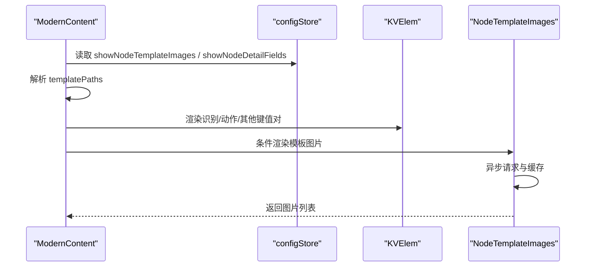

**图表来源**
- [PipelineNode/ModernContent.tsx:34-280](file://src/components/flow/nodes/PipelineNode/ModernContent.tsx#L34-L280)
- [configStore.ts:163-267](file://src/stores/configStore.ts#L163-L267)
- [NodeTemplateImages.tsx:21-119](file://src/components/flow/nodes/components/NodeTemplateImages.tsx#L21-L119)

**章节来源**
- [PipelineNode/ModernContent.tsx:34-280](file://src/components/flow/nodes/PipelineNode/ModernContent.tsx#L34-L280)
- [NodeTemplateImages.tsx:21-119](file://src/components/flow/nodes/components/NodeTemplateImages.tsx#L21-L119)

### MinimalContent（极简风格）
- 展示结构：中心图标 + 标题 + 句柄。
- 图标与颜色：根据识别类型动态获取图标与颜色配置，主色为主边框与图标色，背景色带透明度。
- 句柄：使用极简句柄样式，支持垂直/水平方向。

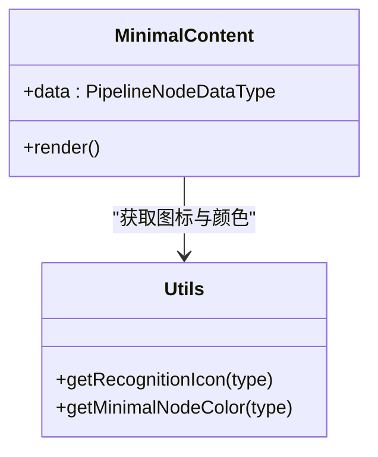

**图表来源**
- [PipelineNode/MinimalContent.tsx:11-58](file://src/components/flow/nodes/PipelineNode/MinimalContent.tsx#L11-L58)
- [utils.ts:14-139](file://src/components/flow/nodes/utils.ts#L14-L139)

**章节来源**
- [PipelineNode/MinimalContent.tsx:11-58](file://src/components/flow/nodes/PipelineNode/MinimalContent.tsx#L11-L58)
- [utils.ts:14-139](file://src/components/flow/nodes/utils.ts#L14-L139)

### NodeHandles（句柄渲染）
- 支持四种方向：left-right、right-left、top-bottom、bottom-top。
- 样式区分：普通与极简两种风格，垂直方向使用不同类名。
- 自适应：监听方向变化，调用useUpdateNodeInternals确保句柄位置正确。

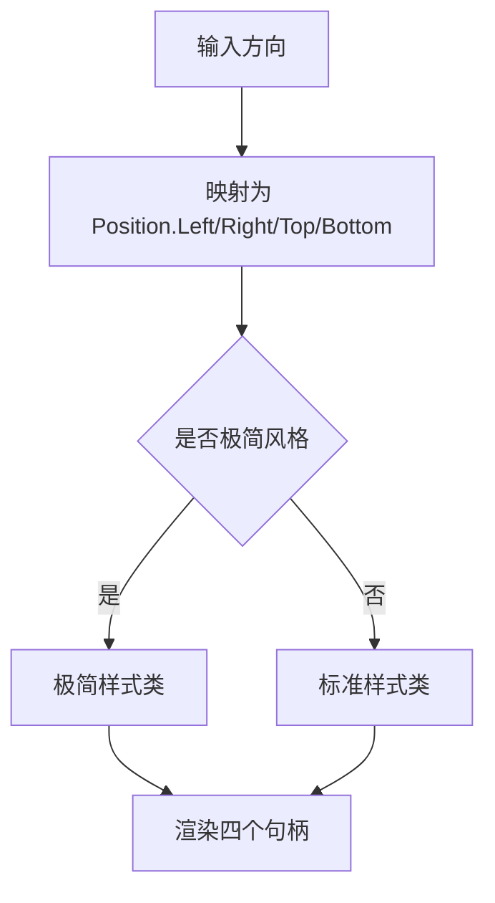

**图表来源**
- [NodeHandles.tsx:10-131](file://src/components/flow/nodes/components/NodeHandles.tsx#L10-L131)

**章节来源**
- [NodeHandles.tsx:36-131](file://src/components/flow/nodes/components/NodeHandles.tsx#L36-L131)

### 调试状态与节点样式
- 调试模式下，节点根据执行历史与当前状态添加样式类：
  - 已执行：高亮
  - 正在执行：高亮
  - 正在识别：高亮
  - 最近一次失败：高亮
- **锚点引用高亮**：当节点被锚点引用高亮时，应用特殊的绿色边框和脉冲动画效果。
- **幽灵节点样式**：当节点为幽灵节点时，应用虚线边框、半透明背景和特殊标签。
- 这些样式类来自DebugPanel.module.less和ExplorationPanel.module.less，与节点样式类组合应用。

**章节来源**
- [PipelineNode/index.tsx:156-200](file://src/components/flow/nodes/PipelineNode/index.tsx#L156-L200)
- [nodes.module.less:266-280](file://src/styles/flow/nodes.module.less#L266-L280)
- [ExplorationPanel.module.less:248-287](file://src/styles/panels/ExplorationPanel.module.less#L248-L287)
- [debugStore.ts:143-800](file://src/stores/debugStore.ts#L143-L800)

### 数据模型与绑定关系
- PipelineNodeDataType定义了节点的核心数据结构：label、recognition（type+param）、action（type+param）、others、extras、handleDirection等。
- **新增extras字段**：支持isGhost标记用于标识幽灵节点。
- 节点渲染直接消费data，无需额外转换；句柄方向由handleDirection控制。
- **锚点引用索引**：通过useFlowStore的getNodesUsingAnchor方法获取使用指定anchor的节点列表。
- 通过useConfigStore与useDebugStore的订阅，节点实时响应配置与调试状态变化。

**章节来源**
- [types.ts:107-122](file://src/stores/flow/types.ts#L107-L122)
- [PipelineNode/index.tsx:25-289](file://src/components/flow/nodes/PipelineNode/index.tsx#L25-L289)
- [AnchorNode.tsx:114-127](file://src/components/flow/nodes/AnchorNode.tsx#L114-L127)

## 依赖关系分析
- 组件耦合：
  - PipelineNode依赖configStore、debugStore、flowStore、utils、NodeHandles、NodeContextMenu。
  - **新增** explorationSlice提供探索模式功能，被PipelineNode通过flowStore访问。
  - **新增** ExplorationPanel.module.less提供探索模式样式支持。
  - 内容组件依赖utils（图标/颜色）、KVElem、NodeHandles、NodeTemplateImages（现代风格）。
- 样式解耦：
  - 节点样式集中在nodes.module.less，通过类名组合实现不同风格，**新增幽灵节点样式**。
  - **新增** 探索模式样式独立管理，避免与主样式冲突。
- 状态解耦：
  - 配置与调试状态通过zustand store集中管理，组件通过浅订阅减少重渲染。

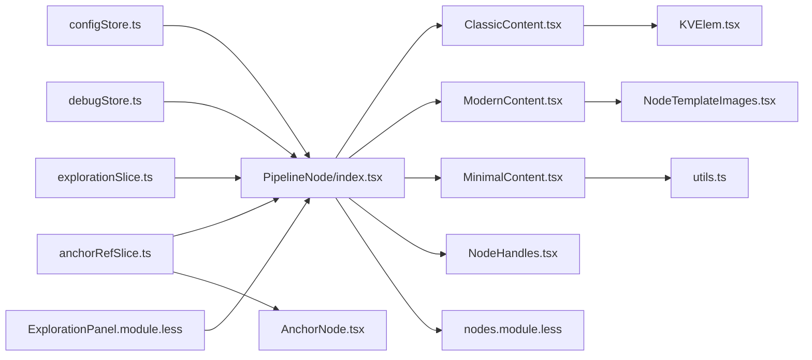

**图表来源**
- [PipelineNode/index.tsx:1-350](file://src/components/flow/nodes/PipelineNode/index.tsx#L1-L350)
- [explorationSlice.ts:1-270](file://src/stores/flow/slices/explorationSlice.ts#L1-L270)
- [configStore.ts:163-267](file://src/stores/configStore.ts#L163-L267)
- [debugStore.ts:227-800](file://src/stores/debugStore.ts#L227-L800)
- [utils.ts:14-139](file://src/components/flow/nodes/utils.ts#L14-L139)
- [NodeHandles.tsx:36-131](file://src/components/flow/nodes/components/NodeHandles.tsx#L36-L131)
- [KVElem.tsx:5-19](file://src/components/flow/nodes/components/KVElem.tsx#L5-L19)
- [NodeTemplateImages.tsx:21-119](file://src/components/flow/nodes/components/NodeTemplateImages.tsx#L21-L119)
- [nodes.module.less:1-795](file://src/styles/flow/nodes.module.less#L1-L795)

## 性能考量
- 渲染优化：
  - 使用memo包装内容组件与句柄组件，避免不必要的重渲染。
  - PipelineNode使用PipelineNodeMemo进行浅比较，仅在关键字段变化时重新渲染。
  - **新增** 幽灵节点状态检查使用简单条件判断，避免复杂计算。
- 计算优化：
  - isRelated与样式类计算使用useMemo，减少重复计算。
  - **锚点引用高亮**：isAnchorRefHighlighted使用Set.has方法进行O(1)查找。
  - **幽灵节点检测**：isGhostNode和isActiveGhostNode使用简单属性访问。
  - ModernContent中header高度计算仅在label变化时触发。
- 资源优化：
  - NodeTemplateImages对图片请求进行防抖与缓存，避免频繁网络请求。
- 状态订阅：
  - 使用useShallow浅订阅flowStore，降低无关状态变化导致的重渲染。

**章节来源**
- [PipelineNode/index.tsx:291-350](file://src/components/flow/nodes/PipelineNode/index.tsx#L291-L350)
- [PipelineNode/ModernContent.tsx:55-60](file://src/components/flow/nodes/PipelineNode/ModernContent.tsx#L55-L60)
- [NodeTemplateImages.tsx:37-61](file://src/components/flow/nodes/components/NodeTemplateImages.tsx#L37-L61)

## 故障排查指南
- 节点不显示或样式异常
  - 检查configStore中的nodeStyle与focusOpacity配置。
  - 确认nodes.module.less中对应类名是否存在。
- **幽灵节点不显示**
  - 检查explorationSlice的状态是否为reviewing或executing。
  - 确认节点data.extras.isGhost标记是否正确设置。
  - 验证isActiveGhostNode计算逻辑是否正确。
- **内联动作按钮不出现**
  - 检查isActiveGhostNode状态计算。
  - 确认explorationSlice中ghostNodeId是否与当前节点ID匹配。
  - 验证按钮点击事件绑定是否正常。
- **锚点引用高亮不工作**
  - 检查anchorRefSlice.rebuildAnchorReferenceIndex是否正确调用。
  - 确认Pipeline节点的others.anchor字段格式正确（字符串/数组/对象）。
  - 验证setSelectedAnchorName方法是否正确设置高亮节点ID集合。
- 句柄位置不正确
  - 确认handleDirection设置是否符合预期；检查NodeHandles的useUpdateNodeInternals调用是否生效。
- 模板图片不显示
  - 检查showNodeTemplateImages与showNodeDetailFields配置。
  - 确认recognition.param.template路径有效且可访问；检查WebSocket连接状态与资源协议。
- 调试状态下样式未更新
  - 确认debugStore的调试状态与执行历史是否正确更新；检查节点样式类拼装逻辑。

**章节来源**
- [configStore.ts:163-267](file://src/stores/configStore.ts#L163-L267)
- [explorationSlice.ts:34-270](file://src/stores/flow/slices/explorationSlice.ts#L34-L270)
- [anchorRefSlice.ts:68-92](file://src/stores/flow/slices/anchorRefSlice.ts#L68-L92)
- [NodeHandles.tsx:36-131](file://src/components/flow/nodes/components/NodeHandles.tsx#L36-L131)
- [NodeTemplateImages.tsx:21-119](file://src/components/flow/nodes/components/NodeTemplateImages.tsx#L21-L119)
- [debugStore.ts:437-795](file://src/stores/debugStore.ts#L437-L795)

## 结论
Pipeline节点通过配置驱动与状态联动实现了灵活多样的显示风格与交互体验。ClassicContent强调信息密度，ModernContent突出层次与可视化，MinimalContent追求简洁高效。**新增的幽灵节点支持**使AI生成的步骤预览成为可能，配合内联动作按钮提供快速执行和确认能力。**新增的探索模式样式系统**进一步增强了节点状态的可视化表达，配合句柄系统、模板图片与调试状态，节点在复杂工作流中提供了清晰的视觉反馈与良好的可维护性。

## 附录

### 三种显示样式对比与适用场景
- ClassicContent
  - 特点：键值对列表，适合初学者与需要逐项核对参数的场景。
  - 适用：参数较少、需要完整展示的节点。
- ModernContent
  - 特点：分区展示、图标+模板图片、focus子项拆分，适合复杂参数与可视化预览。
  - 适用：识别/动作参数较多、需要直观理解的节点。
- MinimalContent
  - 特点：图标+标签+极简句柄，适合密集布局与快速浏览。
  - 适用：节点数量大、关注流程连通性的场景。

**章节来源**
- [PipelineNode/ClassicContent.tsx:16-120](file://src/components/flow/nodes/PipelineNode/ClassicContent.tsx#L16-L120)
- [PipelineNode/ModernContent.tsx:34-280](file://src/components/flow/nodes/PipelineNode/ModernContent.tsx#L34-L280)
- [PipelineNode/MinimalContent.tsx:11-58](file://src/components/flow/nodes/PipelineNode/MinimalContent.tsx#L11-L58)

### 节点自定义样式开发指南与最佳实践
- 新增样式类
  - 在nodes.module.less中新增类名，避免与现有类冲突。
  - **新增** 在ExplorationPanel.module.less中定义探索模式相关样式。
  - 通过configStore扩展配置项，如showNodeDetailFields的变体。
- 动态样式策略
  - 使用useConfigStore读取配置，结合useMemo缓存计算结果。
  - 在PipelineNode中根据配置分支渲染不同内容组件。
  - **新增** 通过isGhostNode和isActiveGhostNode状态控制幽灵节点样式和内联按钮显示。
- **幽灵节点集成**
  - 在nodes.module.less中定义新的幽灵节点样式类，如ghostNode。
  - 使用@keyframes定义脉冲动画效果，增强视觉反馈。
  - 通过explorationSlice管理幽灵节点生命周期，提供create、execute、confirm方法。
  - 在PipelineNode中监听ghostNodeId状态，动态渲染内联动作按钮。
- **内联动作按钮开发**
  - 在ExplorationPanel.module.less中定义按钮容器和按钮样式。
  - 使用Ant Design的Button组件，设置合适的尺寸和图标。
  - 通过execute和confirm回调函数处理用户操作。
- 图标与颜色
  - 在utils.ts中扩展图标映射与颜色配置，确保一致性。
- 性能优化
  - 对内容组件使用memo；对计算逻辑使用useMemo/useCallback。
  - 控制模板图片请求频率与缓存大小，避免阻塞渲染。
  - **新增** 优化幽灵节点状态检查，避免不必要的重渲染。
- 调试集成
  - 在调试状态下同步更新节点样式，便于问题定位。
  - **新增** 在探索模式下提供详细的进度信息和状态反馈。

**章节来源**
- [nodes.module.less:1-795](file://src/styles/flow/nodes.module.less#L1-L795)
- [ExplorationPanel.module.less:248-287](file://src/styles/panels/ExplorationPanel.module.less#L248-L287)
- [configStore.ts:94-267](file://src/stores/configStore.ts#L94-L267)
- [utils.ts:14-139](file://src/components/flow/nodes/utils.ts#L14-L139)
- [PipelineNode/index.tsx:156-289](file://src/components/flow/nodes/PipelineNode/index.tsx#L156-L289)
- [explorationSlice.ts:34-270](file://src/stores/flow/slices/explorationSlice.ts#L34-L270)
- [anchorRefSlice.ts:57-101](file://src/stores/flow/slices/anchorRefSlice.ts#L57-L101)