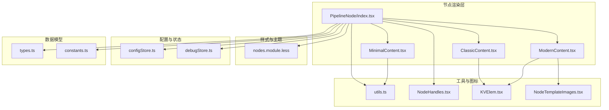
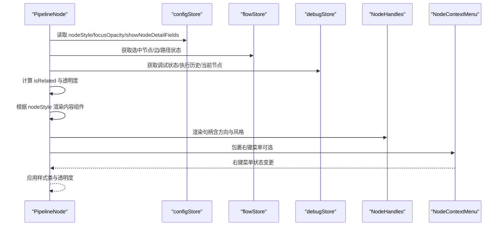
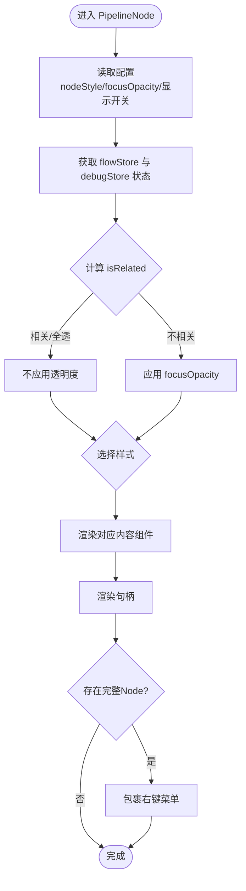
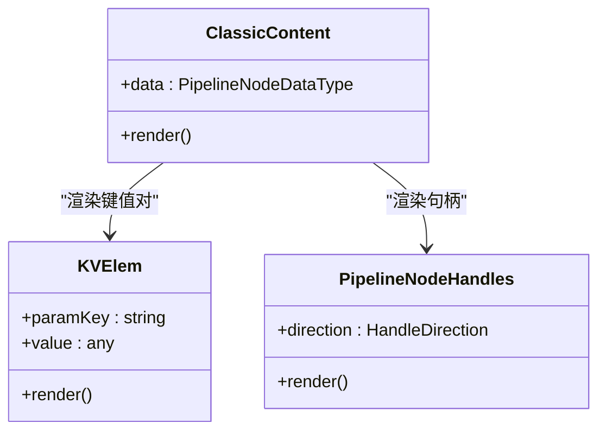
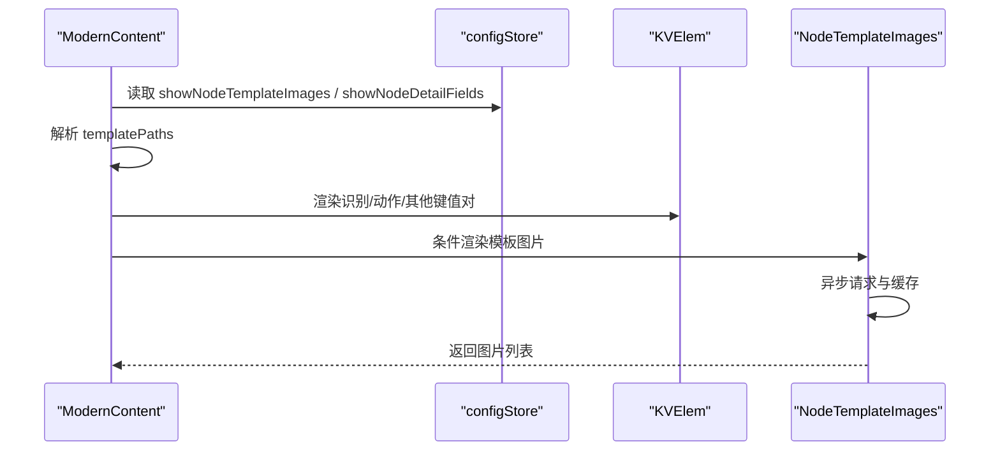
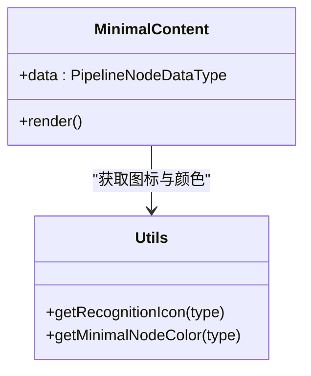
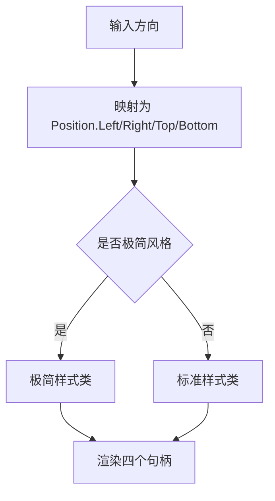
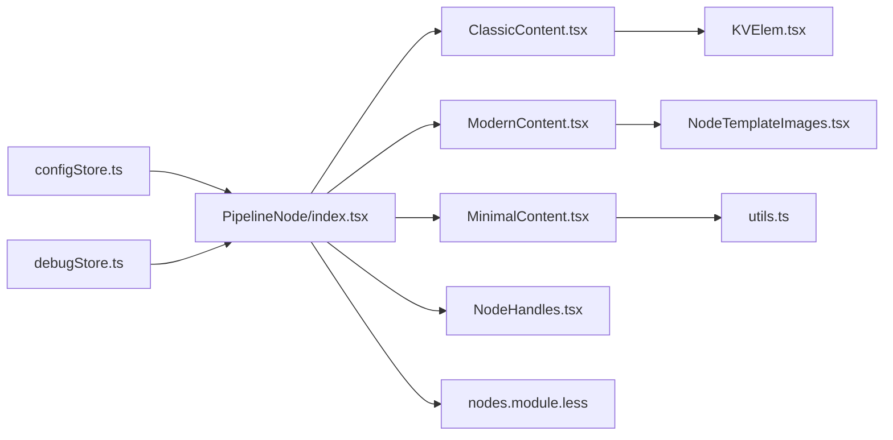

# Pipeline节点

<cite>
**本文引用的文件**
- [PipelineNode/index.tsx](file://src/components/flow/nodes/PipelineNode/index.tsx)
- [PipelineNode/ClassicContent.tsx](file://src/components/flow/nodes/PipelineNode/ClassicContent.tsx)
- [PipelineNode/ModernContent.tsx](file://src/components/flow/nodes/PipelineNode/ModernContent.tsx)
- [PipelineNode/MinimalContent.tsx](file://src/components/flow/nodes/PipelineNode/MinimalContent.tsx)
- [nodes.module.less](file://src/styles/nodes.module.less)
- [configStore.ts](file://src/stores/configStore.ts)
- [debugStore.ts](file://src/stores/debugStore.ts)
- [types.ts](file://src/stores/flow/types.ts)
- [constants.ts](file://src/components/flow/nodes/constants.ts)
- [utils.ts](file://src/components/flow/nodes/utils.ts)
- [NodeHandles.tsx](file://src/components/flow/nodes/components/NodeHandles.tsx)
- [KVElem.tsx](file://src/components/flow/nodes/components/KVElem.tsx)
- [NodeTemplateImages.tsx](file://src/components/flow/nodes/components/NodeTemplateImages.tsx)
</cite>

## 目录
1. [简介](#简介)
2. [项目结构](#项目结构)
3. [核心组件](#核心组件)
4. [架构总览](#架构总览)
5. [详细组件分析](#详细组件分析)
6. [依赖关系分析](#依赖关系分析)
7. [性能考量](#性能考量)
8. [故障排查指南](#故障排查指南)
9. [结论](#结论)
10. [附录](#附录)

## 简介
本文件面向Pipeline节点的技术文档，系统阐述其作为工作流核心节点的设计原理与实现机制，覆盖三种显示样式（ClassicContent、ModernContent、MinimalContent）的特性与适用场景；详解节点渲染逻辑、内容布局、交互行为；解释节点与Pipeline配置数据的绑定关系及状态变化处理；并提供节点自定义样式的开发指南与最佳实践。

## 项目结构
Pipeline节点位于前端工作流编辑器的“节点”体系中，采用按功能模块组织的目录结构：
- 节点渲染：PipelineNode/index.tsx负责整体渲染与样式绑定
- 内容样式：ClassicContent、ModernContent、MinimalContent分别实现三种显示风格
- 样式与主题：nodes.module.less统一管理节点CSS类
- 配置与状态：configStore.ts、debugStore.ts提供配置与调试状态
- 工具与图标：utils.ts提供图标映射与颜色配置；NodeHandles.tsx提供句柄渲染
- 数据模型：types.ts定义PipelineNodeDataType等类型

图表来源
- [PipelineNode/index.tsx:1-255](file://src/components/flow/nodes/PipelineNode/index.tsx#L1-L255)
- [PipelineNode/ClassicContent.tsx:1-84](file://src/components/flow/nodes/PipelineNode/ClassicContent.tsx#L1-L84)
- [PipelineNode/ModernContent.tsx:1-248](file://src/components/flow/nodes/PipelineNode/ModernContent.tsx#L1-L248)
- [PipelineNode/MinimalContent.tsx:1-58](file://src/components/flow/nodes/PipelineNode/MinimalContent.tsx#L1-L58)
- [nodes.module.less:1-694](file://src/styles/nodes.module.less#L1-L694)
- [configStore.ts:1-268](file://src/stores/configStore.ts#L1-L268)
- [debugStore.ts:1-800](file://src/stores/debugStore.ts#L1-L800)
- [utils.ts:1-139](file://src/components/flow/nodes/utils.ts#L1-L139)
- [NodeHandles.tsx:1-254](file://src/components/flow/nodes/components/NodeHandles.tsx#L1-L254)
- [KVElem.tsx:1-20](file://src/components/flow/nodes/components/KVElem.tsx#L1-L20)
- [NodeTemplateImages.tsx:1-120](file://src/components/flow/nodes/components/NodeTemplateImages.tsx#L1-L120)
- [types.ts:107-122](file://src/stores/flow/types.ts#L107-L122)
- [constants.ts:1-47](file://src/components/flow/nodes/constants.ts#L1-L47)

章节来源
- [PipelineNode/index.tsx:1-255](file://src/components/flow/nodes/PipelineNode/index.tsx#L1-L255)
- [nodes.module.less:1-694](file://src/styles/nodes.module.less#L1-L694)

## 核心组件
- PipelineNode：节点渲染入口，负责根据配置选择内容组件、计算焦点透明度、应用调试样式、挂载右键菜单。
- ClassicContent：经典风格内容，以键值对列表展示识别、动作、其他参数。
- ModernContent：现代风格内容，分“识别/动作/其他”三区，支持图标、模板图片预览、focus子项拆分显示。
- MinimalContent：极简风格内容，仅保留图标与标签，配色随识别类型动态变化。
- NodeHandles：句柄渲染，支持四种方向（左右/上下），区分普通与极简风格样式。
- KVElem：键值对渲染单元，统一展示参数键与值。
- NodeTemplateImages：模板图片预览，基于WebSocket资源协议异步请求并缓存图片。
- utils：图标映射、颜色配置、节点类型图标。
- configStore：节点样式、句柄方向、模板图片与字段显示等全局配置。
- debugStore：调试模式下的执行状态、历史记录、识别记录等。

章节来源
- [PipelineNode/index.tsx:21-194](file://src/components/flow/nodes/PipelineNode/index.tsx#L21-L194)
- [PipelineNode/ClassicContent.tsx:11-83](file://src/components/flow/nodes/PipelineNode/ClassicContent.tsx#L11-L83)
- [PipelineNode/ModernContent.tsx:29-247](file://src/components/flow/nodes/PipelineNode/ModernContent.tsx#L29-L247)
- [PipelineNode/MinimalContent.tsx:10-57](file://src/components/flow/nodes/PipelineNode/MinimalContent.tsx#L10-L57)
- [NodeHandles.tsx:36-131](file://src/components/flow/nodes/components/NodeHandles.tsx#L36-L131)
- [KVElem.tsx:5-19](file://src/components/flow/nodes/components/KVElem.tsx#L5-L19)
- [NodeTemplateImages.tsx:21-119](file://src/components/flow/nodes/components/NodeTemplateImages.tsx#L21-L119)
- [utils.ts:14-138](file://src/components/flow/nodes/utils.ts#L14-L138)
- [configStore.ts:94-267](file://src/stores/configStore.ts#L94-L267)
- [debugStore.ts:143-800](file://src/stores/debugStore.ts#L143-L800)

## 架构总览
Pipeline节点的渲染与交互遵循以下关键流程：
- 配置驱动：读取configStore中的nodeStyle、focusOpacity、showNodeTemplateImages、showNodeDetailFields等配置，决定渲染风格与可见性。
- 状态联动：结合flowStore的选中/边/路径状态与debugStore的调试状态，动态计算节点透明度与样式类。
- 内容选择：根据nodeStyle切换Classic/Modern/Minimal内容组件。
- 交互扩展：在存在完整Node对象时包裹右键菜单，提供上下文操作。
- 句柄渲染：依据handleDirection与风格选择普通或极简句柄样式。

图表来源
- [PipelineNode/index.tsx:22-194](file://src/components/flow/nodes/PipelineNode/index.tsx#L22-L194)
- [configStore.ts:163-267](file://src/stores/configStore.ts#L163-L267)
- [debugStore.ts:227-800](file://src/stores/debugStore.ts#L227-L800)

## 详细组件分析

### PipelineNode 渲染与状态绑定
- 配置读取：从configStore读取nodeStyle、focusOpacity、showNodeTemplateImages、showNodeDetailFields等，作为渲染与可见性的依据。
- 焦点计算：isRelated综合考虑选中状态、路径模式、分组关系、边连接关系等，决定是否保持不透明。
- 样式类：根据selected、nodeStyle、调试状态（执行中/已执行/识别中/失败）动态拼装CSS类。
- 透明度：若非相关且focusOpacity小于1，则应用透明度样式。
- 内容渲染：根据nodeStyle选择Classic/Modern/Minimal内容组件。
- 右键菜单：当存在完整Node对象时，包裹NodeContextMenu以提供上下文操作。

图表来源
- [PipelineNode/index.tsx:22-194](file://src/components/flow/nodes/PipelineNode/index.tsx#L22-L194)

章节来源
- [PipelineNode/index.tsx:22-194](file://src/components/flow/nodes/PipelineNode/index.tsx#L22-L194)
- [configStore.ts:163-267](file://src/stores/configStore.ts#L163-L267)
- [debugStore.ts:227-800](file://src/stores/debugStore.ts#L227-L800)

### ClassicContent（经典风格）
- 展示结构：标题 + 识别模块 + 动作模块 + 其他模块（可选）。
- 识别/动作模块：展示type与param键值对；受showNodeDetailFields控制是否展开。
- 其他模块：过滤空的focus字段，避免冗余显示；extras支持对象或字符串转对象渲染。
- 句柄：渲染标准句柄，方向由handleDirection决定。

图表来源
- [PipelineNode/ClassicContent.tsx:11-83](file://src/components/flow/nodes/PipelineNode/ClassicContent.tsx#L11-L83)
- [KVElem.tsx:5-19](file://src/components/flow/nodes/components/KVElem.tsx#L5-L19)
- [NodeHandles.tsx:36-131](file://src/components/flow/nodes/components/NodeHandles.tsx#L36-L131)

章节来源
- [PipelineNode/ClassicContent.tsx:11-83](file://src/components/flow/nodes/PipelineNode/ClassicContent.tsx#L11-L83)
- [KVElem.tsx:5-19](file://src/components/flow/nodes/components/KVElem.tsx#L5-L19)
- [NodeHandles.tsx:36-131](file://src/components/flow/nodes/components/NodeHandles.tsx#L36-L131)

### ModernContent（现代风格）
- 展示结构：顶部头栏（类型图标+标题+更多按钮）+ 识别/动作/其他三区 + 模板图片区域（可选）。
- 头栏：显示节点类型图标与标题，右侧更多按钮占位。
- 识别/动作区：左侧图标（识别/动作类型映射）、右侧参数键值对列表。
- 其他区：过滤空focus；将focus对象按displayName映射拆分为子项；extras支持对象/字符串渲染。
- 模板图片：从recognition.param.template提取路径，异步请求并缓存，最多显示80px高度的缩略图。
- 句柄：渲染标准句柄，支持垂直/水平方向。

图表来源
- [PipelineNode/ModernContent.tsx:29-247](file://src/components/flow/nodes/PipelineNode/ModernContent.tsx#L29-L247)
- [configStore.ts:163-267](file://src/stores/configStore.ts#L163-L267)
- [NodeTemplateImages.tsx:21-119](file://src/components/flow/nodes/components/NodeTemplateImages.tsx#L21-L119)

章节来源
- [PipelineNode/ModernContent.tsx:29-247](file://src/components/flow/nodes/PipelineNode/ModernContent.tsx#L29-L247)
- [NodeTemplateImages.tsx:21-119](file://src/components/flow/nodes/components/NodeTemplateImages.tsx#L21-L119)

### MinimalContent（极简风格）
- 展示结构：中心图标 + 标题 + 句柄。
- 图标与颜色：根据识别类型动态获取图标与颜色配置，主色为主边框与图标色，背景色带透明度。
- 句柄：使用极简句柄样式，支持垂直/水平方向。

图表来源
- [PipelineNode/MinimalContent.tsx:10-57](file://src/components/flow/nodes/PipelineNode/MinimalContent.tsx#L10-L57)
- [utils.ts:14-138](file://src/components/flow/nodes/utils.ts#L14-L138)

章节来源
- [PipelineNode/MinimalContent.tsx:10-57](file://src/components/flow/nodes/PipelineNode/MinimalContent.tsx#L10-L57)
- [utils.ts:14-138](file://src/components/flow/nodes/utils.ts#L14-L138)

### NodeHandles（句柄渲染）
- 支持四种方向：left-right、right-left、top-bottom、bottom-top。
- 样式区分：普通与极简两种风格，垂直方向使用不同类名。
- 自适应：监听方向变化，调用useUpdateNodeInternals确保句柄位置正确。

图表来源
- [NodeHandles.tsx:10-131](file://src/components/flow/nodes/components/NodeHandles.tsx#L10-L131)

章节来源
- [NodeHandles.tsx:36-131](file://src/components/flow/nodes/components/NodeHandles.tsx#L36-L131)

### 调试状态与节点样式
- 调试模式下，节点根据执行历史与当前状态添加样式类：
  - 已执行：高亮
  - 正在执行：高亮
  - 正在识别：高亮
  - 最近一次失败：高亮
- 这些样式类来自DebugPanel.module.less，与节点样式类组合应用。

章节来源
- [PipelineNode/index.tsx:125-144](file://src/components/flow/nodes/PipelineNode/index.tsx#L125-L144)
- [debugStore.ts:143-800](file://src/stores/debugStore.ts#L143-L800)

### 数据模型与绑定关系
- PipelineNodeDataType定义了节点的核心数据结构：label、recognition（type+param）、action（type+param）、others、extras、handleDirection等。
- 节点渲染直接消费data，无需额外转换；句柄方向由handleDirection控制。
- 通过useConfigStore与useDebugStore的订阅，节点实时响应配置与调试状态变化。

章节来源
- [types.ts:107-122](file://src/stores/flow/types.ts#L107-L122)
- [PipelineNode/index.tsx:22-194](file://src/components/flow/nodes/PipelineNode/index.tsx#L22-L194)

## 依赖关系分析
- 组件耦合：
  - PipelineNode依赖configStore、debugStore、flowStore、utils、NodeHandles、NodeContextMenu。
  - 内容组件依赖utils（图标/颜色）、KVElem、NodeHandles、NodeTemplateImages（现代风格）。
- 样式解耦：
  - 节点样式集中在nodes.module.less，通过类名组合实现不同风格。
- 状态解耦：
  - 配置与调试状态通过zustand store集中管理，组件通过浅订阅减少重渲染。

图表来源
- [PipelineNode/index.tsx:1-255](file://src/components/flow/nodes/PipelineNode/index.tsx#L1-L255)
- [configStore.ts:163-267](file://src/stores/configStore.ts#L163-L267)
- [debugStore.ts:227-800](file://src/stores/debugStore.ts#L227-L800)
- [utils.ts:14-138](file://src/components/flow/nodes/utils.ts#L14-L138)
- [NodeHandles.tsx:36-131](file://src/components/flow/nodes/components/NodeHandles.tsx#L36-L131)
- [KVElem.tsx:5-19](file://src/components/flow/nodes/components/KVElem.tsx#L5-L19)
- [NodeTemplateImages.tsx:21-119](file://src/components/flow/nodes/components/NodeTemplateImages.tsx#L21-L119)
- [nodes.module.less:1-694](file://src/styles/nodes.module.less#L1-L694)

## 性能考量
- 渲染优化：
  - 使用memo包装内容组件与句柄组件，避免不必要的重渲染。
  - PipelineNode使用PipelineNodeMemo进行浅比较，仅在关键字段变化时重新渲染。
- 计算优化：
  - isRelated与样式类计算使用useMemo，减少重复计算。
  - ModernContent中header高度计算仅在label变化时触发。
- 资源优化：
  - NodeTemplateImages对图片请求进行防抖与缓存，避免频繁网络请求。
- 状态订阅：
  - 使用useShallow浅订阅flowStore，降低无关状态变化导致的重渲染。

章节来源
- [PipelineNode/index.tsx:196-254](file://src/components/flow/nodes/PipelineNode/index.tsx#L196-L254)
- [PipelineNode/ModernContent.tsx:44-49](file://src/components/flow/nodes/PipelineNode/ModernContent.tsx#L44-L49)
- [NodeTemplateImages.tsx:37-61](file://src/components/flow/nodes/components/NodeTemplateImages.tsx#L37-L61)

## 故障排查指南
- 节点不显示或样式异常
  - 检查configStore中的nodeStyle与focusOpacity配置。
  - 确认nodes.module.less中对应类名是否存在。
- 句柄位置不正确
  - 确认handleDirection设置是否符合预期；检查NodeHandles的useUpdateNodeInternals调用是否生效。
- 模板图片不显示
  - 检查showNodeTemplateImages与showNodeDetailFields配置。
  - 确认recognition.param.template路径有效且可访问；检查WebSocket连接状态与资源协议。
- 调试状态下样式未更新
  - 确认debugStore的调试状态与执行历史是否正确更新；检查节点样式类拼装逻辑。

章节来源
- [configStore.ts:163-267](file://src/stores/configStore.ts#L163-L267)
- [NodeHandles.tsx:36-131](file://src/components/flow/nodes/components/NodeHandles.tsx#L36-L131)
- [NodeTemplateImages.tsx:21-119](file://src/components/flow/nodes/components/NodeTemplateImages.tsx#L21-L119)
- [debugStore.ts:437-795](file://src/stores/debugStore.ts#L437-L795)

## 结论
Pipeline节点通过配置驱动与状态联动实现了灵活多样的显示风格与交互体验。ClassicContent强调信息密度，ModernContent突出层次与可视化，MinimalContent追求简洁高效。配合句柄系统、模板图片与调试状态，节点在复杂工作流中提供了清晰的视觉反馈与良好的可维护性。

## 附录

### 三种显示样式对比与适用场景
- ClassicContent
  - 特点：键值对列表，适合初学者与需要逐项核对参数的场景。
  - 适用：参数较少、需要完整展示的节点。
- ModernContent
  - 特点：分区展示、图标+模板图片、focus子项拆分，适合复杂参数与可视化预览。
  - 适用：识别/动作参数较多、需要直观理解的节点。
- MinimalContent
  - 特点：图标+标签+极简句柄，适合密集布局与快速浏览。
  - 适用：节点数量大、关注流程连通性的场景。

章节来源
- [PipelineNode/ClassicContent.tsx:11-83](file://src/components/flow/nodes/PipelineNode/ClassicContent.tsx#L11-L83)
- [PipelineNode/ModernContent.tsx:29-247](file://src/components/flow/nodes/PipelineNode/ModernContent.tsx#L29-L247)
- [PipelineNode/MinimalContent.tsx:10-57](file://src/components/flow/nodes/PipelineNode/MinimalContent.tsx#L10-L57)

### 节点自定义样式开发指南与最佳实践
- 新增样式类
  - 在nodes.module.less中新增类名，避免与现有类冲突。
  - 通过configStore扩展配置项，如showNodeDetailFields的变体。
- 动态样式策略
  - 使用useConfigStore读取配置，结合useMemo缓存计算结果。
  - 在PipelineNode中根据配置分支渲染不同内容组件。
- 图标与颜色
  - 在utils.ts中扩展图标映射与颜色配置，确保一致性。
- 性能优化
  - 对内容组件使用memo；对计算逻辑使用useMemo/useCallback。
  - 控制模板图片请求频率与缓存大小，避免阻塞渲染。
- 调试集成
  - 在调试状态下同步更新节点样式，便于问题定位。

章节来源
- [nodes.module.less:1-694](file://src/styles/nodes.module.less#L1-L694)
- [configStore.ts:94-267](file://src/stores/configStore.ts#L94-L267)
- [utils.ts:14-138](file://src/components/flow/nodes/utils.ts#L14-L138)
- [PipelineNode/index.tsx:125-194](file://src/components/flow/nodes/PipelineNode/index.tsx#L125-L194)