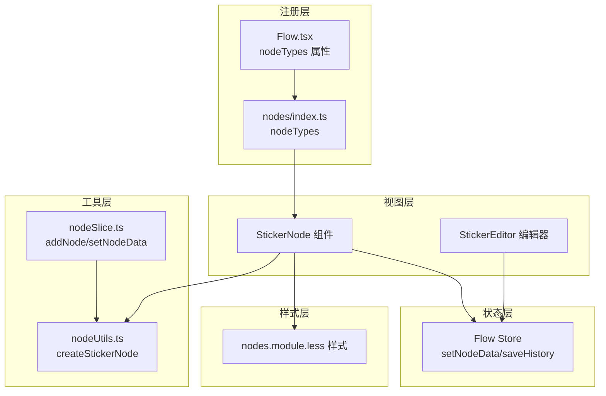
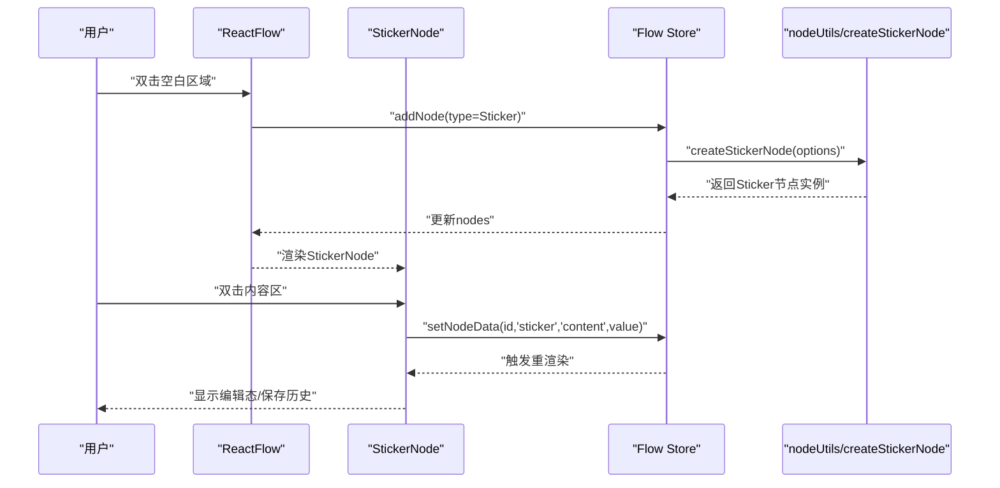
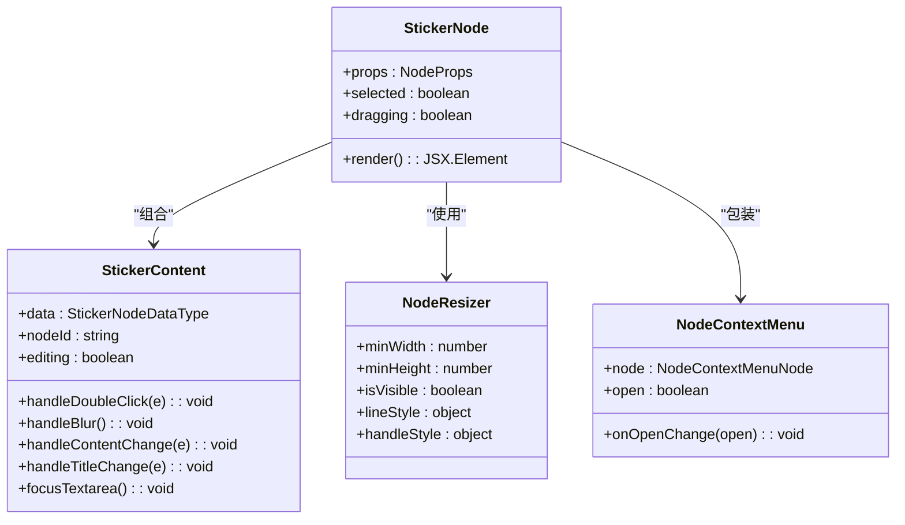
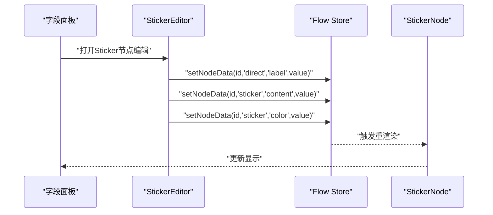
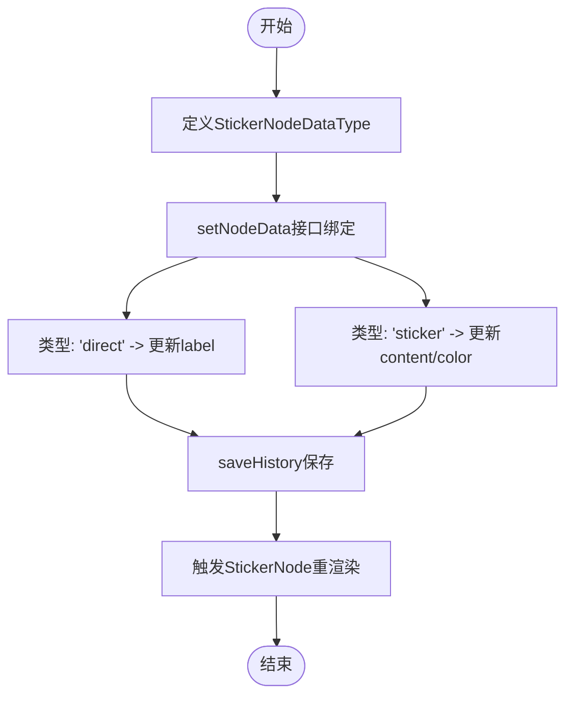
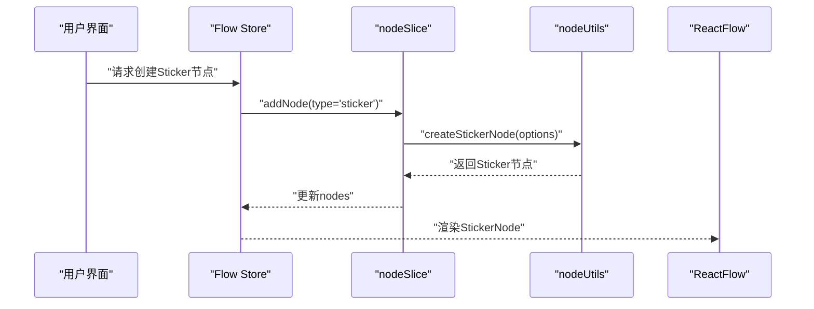
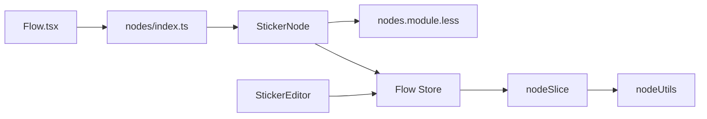

# Sticker节点

<cite>
**本文档引用的文件**
- [StickerNode.tsx](file://src/components/flow/nodes/StickerNode.tsx)
- [StickerEditor.tsx](file://src/components/panels/node-editors/StickerEditor.tsx)
- [nodes/index.ts](file://src/components/flow/nodes/index.ts)
- [nodes/constants.ts](file://src/components/flow/nodes/constants.ts)
- [nodes.module.less](file://src/styles/nodes.module.less)
- [stores/flow/types.ts](file://src/stores/flow/types.ts)
- [stores/flow/utils/nodeUtils.ts](file://src/stores/flow/utils/nodeUtils.ts)
- [stores/flow/slices/nodeSlice.ts](file://src/stores/flow/slices/nodeSlice.ts)
- [Flow.tsx](file://src/components/Flow.tsx)
</cite>

## 目录
1. [简介](#简介)
2. [项目结构](#项目结构)
3. [核心组件](#核心组件)
4. [架构总览](#架构总览)
5. [详细组件分析](#详细组件分析)
6. [依赖关系分析](#依赖关系分析)
7. [性能考虑](#性能考虑)
8. [故障排除指南](#故障排除指南)
9. [结论](#结论)
10. [附录](#附录)

## 简介
Sticker节点是工作流编辑器中的装饰与标注节点，用于在画布上添加便签式备注、说明文字或临时标记。它采用轻量级设计，支持可编辑的标题与正文内容，并提供多种颜色主题以满足不同场景下的视觉区分需求。Sticker节点不参与数据模型的识别与执行逻辑，而是专注于信息承载与辅助说明，适合在复杂流程图中进行注释、提醒、临时标注等用途。

## 项目结构
Sticker节点由以下层次组成：
- 视图层：StickerNode组件负责渲染与交互（编辑、双击、尺寸调整、右键菜单）。
- 编辑器面板：StickerEditor提供字段面板中的统一编辑入口（标题、颜色、内容）。
- 样式层：nodes.module.less定义了Sticker节点的UI样式与主题变量。
- 状态层：Flow Store通过setNodeData接口实现数据变更与历史记录保存。
- 工具层：nodeUtils.ts提供创建Sticker节点的工厂方法；nodeSlice.ts负责节点创建与数据更新逻辑。
- 注册层：nodes/index.ts将StickerNode注册为可用节点类型；Flow.tsx在ReactFlow中启用该类型。

**图表来源**
- [StickerNode.tsx:165-213](file://src/components/flow/nodes/StickerNode.tsx#L165-L213)
- [StickerEditor.tsx:21-131](file://src/components/panels/node-editors/StickerEditor.tsx#L21-L131)
- [nodes.module.less:539-630](file://src/styles/nodes.module.less#L539-L630)
- [stores/flow/utils/nodeUtils.ts:117-158](file://src/stores/flow/utils/nodeUtils.ts#L117-L158)
- [stores/flow/slices/nodeSlice.ts:210-288](file://src/stores/flow/slices/nodeSlice.ts#L210-L288)
- [nodes/index.ts:8-14](file://src/components/flow/nodes/index.ts#L8-L14)
- [Flow.tsx:466](file://src/components/Flow.tsx#L466)

**章节来源**
- [StickerNode.tsx:165-213](file://src/components/flow/nodes/StickerNode.tsx#L165-L213)
- [StickerEditor.tsx:21-131](file://src/components/panels/node-editors/StickerEditor.tsx#L21-L131)
- [nodes/index.ts:8-14](file://src/components/flow/nodes/index.ts#L8-L14)
- [Flow.tsx:466](file://src/components/Flow.tsx#L466)

## 核心组件
- StickerNode：渲染Sticker节点的UI，包含标题栏、内容区、颜色主题、尺寸调整器与右键菜单。支持双击进入编辑模式，实时更新内容并通过历史记录保存。
- StickerEditor：在字段面板中提供统一的编辑入口，允许修改标题、颜色与内容。
- StickerNodeDataType：定义Sticker节点的数据结构（label、content、color）。
- createStickerNode：工厂方法，创建Sticker节点实例并设置默认尺寸与颜色。
- setNodeData：Flow Store中的通用数据更新接口，支持按类型更新节点数据（如"sticker"、"direct"）。

**章节来源**
- [StickerNode.tsx:52-162](file://src/components/flow/nodes/StickerNode.tsx#L52-L162)
- [StickerEditor.tsx:21-131](file://src/components/panels/node-editors/StickerEditor.tsx#L21-L131)
- [stores/flow/types.ts:144-149](file://src/stores/flow/types.ts#L144-L149)
- [stores/flow/utils/nodeUtils.ts:117-158](file://src/stores/flow/utils/nodeUtils.ts#L117-L158)
- [stores/flow/slices/nodeSlice.ts:291-394](file://src/stores/flow/slices/nodeSlice.ts#L291-L394)

## 架构总览
Sticker节点的运行时架构遵循“视图-状态-工具-注册”的分层设计：
- 视图层通过StickerNode响应用户交互（双击、编辑、拖拽、尺寸调整），并将变更写入Flow Store。
- 状态层通过setNodeData统一管理节点数据更新，并触发历史记录保存。
- 工具层提供节点创建与默认值设置，确保Sticker节点具备一致的初始状态。
- 注册层在Flow.tsx中启用StickerNode类型，使其可在画布中被实例化与渲染。

**图表来源**
- [Flow.tsx:466](file://src/components/Flow.tsx#L466)
- [stores/flow/slices/nodeSlice.ts:210-288](file://src/stores/flow/slices/nodeSlice.ts#L210-L288)
- [stores/flow/utils/nodeUtils.ts:117-158](file://src/stores/flow/utils/nodeUtils.ts#L117-L158)
- [StickerNode.tsx:86-91](file://src/components/flow/nodes/StickerNode.tsx#L86-L91)

## 详细组件分析

### StickerNode组件分析
StickerNode负责Sticker节点的完整生命周期：
- 主题与样式：根据color映射STICKER_COLOR_THEMES生成背景、边框、标题背景与文本颜色。
- 编辑模式：双击内容区进入编辑态，显示textarea；失焦后退出编辑并保存历史。
- 尺寸调整：NodeResizer提供最小宽高限制与选中态样式。
- 右键菜单：NodeContextMenu提供上下文操作入口。
- 性能优化：StickerNodeMemo通过浅比较避免不必要的重渲染。

**图表来源**
- [StickerNode.tsx:52-162](file://src/components/flow/nodes/StickerNode.tsx#L52-L162)
- [StickerNode.tsx:165-213](file://src/components/flow/nodes/StickerNode.tsx#L165-L213)

**章节来源**
- [StickerNode.tsx:52-162](file://src/components/flow/nodes/StickerNode.tsx#L52-L162)
- [StickerNode.tsx:165-213](file://src/components/flow/nodes/StickerNode.tsx#L165-L213)

### StickerEditor编辑器分析
StickerEditor提供Sticker节点的字段面板编辑体验：
- 标题编辑：通过Input组件直接修改label。
- 颜色选择：使用Select组件切换颜色主题，支持黄色、绿色、蓝色、粉色、紫色。
- 内容编辑：通过TextArea组件编辑content，支持自动高度与多行输入。
- 数据更新：统一通过setNodeData写入Flow Store，保存历史记录。

**图表来源**
- [StickerEditor.tsx:21-131](file://src/components/panels/node-editors/StickerEditor.tsx#L21-L131)
- [StickerNode.tsx:86-99](file://src/components/flow/nodes/StickerNode.tsx#L86-L99)

**章节来源**
- [StickerEditor.tsx:21-131](file://src/components/panels/node-editors/StickerEditor.tsx#L21-L131)

### 数据模型与绑定关系
Sticker节点的数据模型由StickerNodeDataType定义，包含：
- label：节点标题
- content：节点正文内容
- color：颜色主题（yellow/green/blue/pink/purple）

Flow Store通过setNodeData实现双向绑定：
- "direct"类型：直接更新节点顶层字段（如label）。
- "sticker"类型：更新Sticker专用字段（如content、color）。
- 历史记录：每次数据更新后调用saveHistory保存快照，支持撤销/重做。

**图表来源**
- [stores/flow/types.ts:144-149](file://src/stores/flow/types.ts#L144-L149)
- [stores/flow/slices/nodeSlice.ts:291-394](file://src/stores/flow/slices/nodeSlice.ts#L291-L394)

**章节来源**
- [stores/flow/types.ts:144-149](file://src/stores/flow/types.ts#L144-L149)
- [stores/flow/slices/nodeSlice.ts:291-394](file://src/stores/flow/slices/nodeSlice.ts#L291-L394)

### 创建与注册流程
Sticker节点的创建与注册涉及多个模块协作：
- Flow.tsx通过nodeTypes属性启用StickerNode。
- nodes/index.ts将StickerNode注册为NodeTypeEnum.Sticker。
- nodeSlice.ts在addNode时根据类型调用createStickerNode。
- nodeUtils.ts提供工厂方法，设置默认尺寸与颜色。

**图表来源**
- [Flow.tsx:466](file://src/components/Flow.tsx#L466)
- [nodes/index.ts:8-14](file://src/components/flow/nodes/index.ts#L8-L14)
- [stores/flow/slices/nodeSlice.ts:210-288](file://src/stores/flow/slices/nodeSlice.ts#L210-L288)
- [stores/flow/utils/nodeUtils.ts:117-158](file://src/stores/flow/utils/nodeUtils.ts#L117-L158)

**章节来源**
- [Flow.tsx:466](file://src/components/Flow.tsx#L466)
- [nodes/index.ts:8-14](file://src/components/flow/nodes/index.ts#L8-L14)
- [stores/flow/slices/nodeSlice.ts:210-288](file://src/stores/flow/slices/nodeSlice.ts#L210-L288)
- [stores/flow/utils/nodeUtils.ts:117-158](file://src/stores/flow/utils/nodeUtils.ts#L117-L158)

## 依赖关系分析
Sticker节点的依赖关系如下：
- 视图层依赖样式层（nodes.module.less）与Flow Store（setNodeData）。
- 编辑器依赖Flow Store与Ant Design组件库。
- 工具层提供节点创建与默认值设置。
- 注册层在Flow.tsx与nodes/index.ts中完成类型注册。

**图表来源**
- [StickerNode.tsx:5-11](file://src/components/flow/nodes/StickerNode.tsx#L5-L11)
- [StickerEditor.tsx:1-9](file://src/components/panels/node-editors/StickerEditor.tsx#L1-L9)
- [nodes/index.ts:8-14](file://src/components/flow/nodes/index.ts#L8-L14)
- [Flow.tsx:466](file://src/components/Flow.tsx#L466)

**章节来源**
- [StickerNode.tsx:5-11](file://src/components/flow/nodes/StickerNode.tsx#L5-L11)
- [StickerEditor.tsx:1-9](file://src/components/panels/node-editors/StickerEditor.tsx#L1-L9)
- [nodes/index.ts:8-14](file://src/components/flow/nodes/index.ts#L8-L14)
- [Flow.tsx:466](file://src/components/Flow.tsx#L466)

## 性能考虑
- 渲染优化：StickerNodeMemo通过浅比较避免不必要的重渲染，仅在关键字段变化时更新。
- 事件处理：双击与失焦事件均通过useCallback缓存回调，减少闭包开销。
- 样式复用：颜色主题通过STICKER_COLOR_THEMES集中管理，避免重复计算。
- 历史记录：saveHistory按需触发，避免频繁快照导致的性能损耗。

[本节为通用性能建议，无需特定文件引用]

## 故障排除指南
- 无法编辑内容
  - 检查StickerNode的handleDoubleClick与handleContentChange事件绑定是否生效。
  - 确认setNodeData调用链路正常，且"sticker"类型参数正确传递。
- 颜色主题不生效
  - 核对color字段是否为合法枚举值（yellow/green/blue/pink/purple）。
  - 检查STICKER_COLOR_THEMES映射表与样式类名是否匹配。
- 尺寸调整无效
  - 确认NodeResizer的minWidth/minHeight与isVisible属性设置正确。
  - 检查节点selected状态与样式覆盖关系。
- 历史记录未保存
  - 确认handleBlur中调用了saveHistory(0)。
  - 检查setNodeData后是否触发了saveHistory(1000)。

**章节来源**
- [StickerNode.tsx:70-107](file://src/components/flow/nodes/StickerNode.tsx#L70-L107)
- [StickerNode.tsx:198-204](file://src/components/flow/nodes/StickerNode.tsx#L198-L204)
- [stores/flow/slices/nodeSlice.ts:392-394](file://src/stores/flow/slices/nodeSlice.ts#L392-L394)

## 结论
Sticker节点通过清晰的分层设计实现了“装饰与标注”的核心目标：简洁的UI、灵活的主题、可编辑的内容与稳定的性能表现。其与Flow Store的紧密耦合保证了数据一致性与可追溯性，同时通过编辑器面板与右键菜单提供了良好的用户体验。对于扩展与定制，建议遵循现有数据模型与更新接口，保持一致的交互与样式规范。

[本节为总结性内容，无需特定文件引用]

## 附录

### 使用示例与自定义方法
- 创建Sticker节点
  - 通过Flow Store的addNode接口传入type为Sticker，系统将调用createStickerNode生成节点。
  - 可在datas中指定label、content、color，默认尺寸为200x160。
- 编辑内容
  - 双击Sticker节点内容区进入编辑态，支持多行文本与自动高度。
  - 在StickerEditor中可同步修改标题、颜色与内容。
- 样式与布局
  - 颜色主题：yellow/green/blue/pink/purple五种预设。
  - 尺寸：NodeResizer提供最小宽高限制，支持拖拽调整。
  - 字体与排版：nodes.module.less中定义字号、行高、换行策略，可根据需要调整。
- 动态内容更新
  - 通过setNodeData统一更新，支持撤销/重做与历史记录保存。
  - 支持批量更新：batchSetNodeData可用于一次提交多个字段变更。

**章节来源**
- [stores/flow/utils/nodeUtils.ts:117-158](file://src/stores/flow/utils/nodeUtils.ts#L117-L158)
- [StickerEditor.tsx:21-131](file://src/components/panels/node-editors/StickerEditor.tsx#L21-L131)
- [nodes.module.less:539-630](file://src/styles/nodes.module.less#L539-L630)
- [stores/flow/slices/nodeSlice.ts:291-394](file://src/stores/flow/slices/nodeSlice.ts#L291-L394)