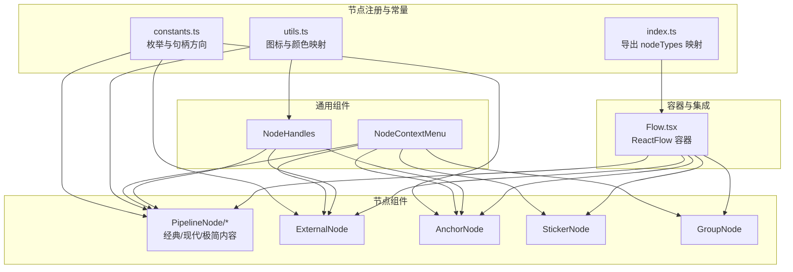
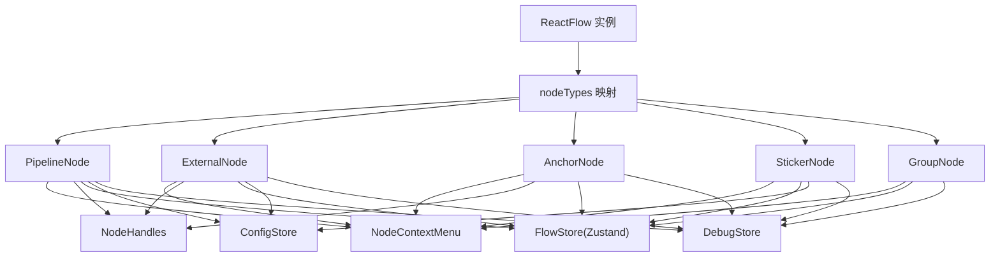
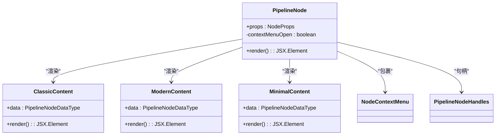
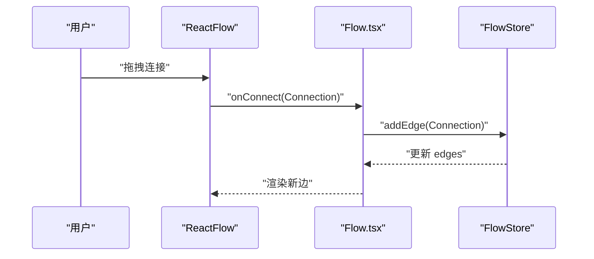
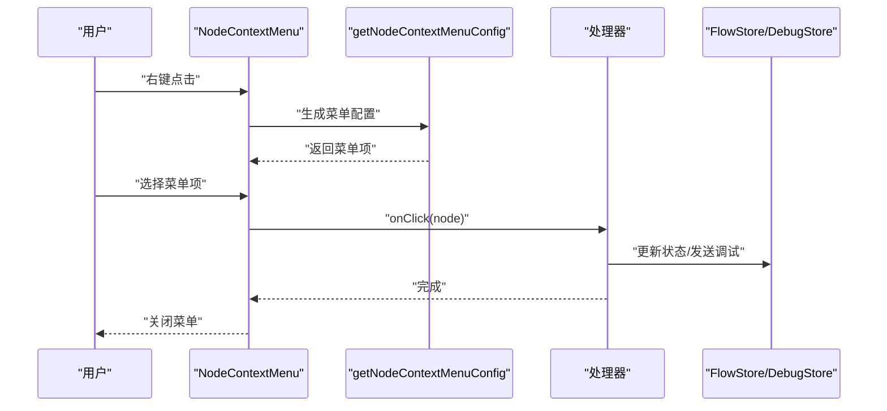
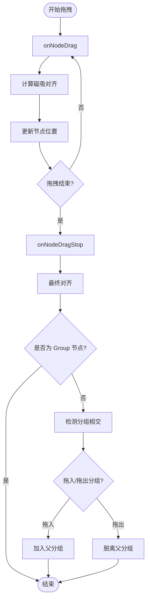
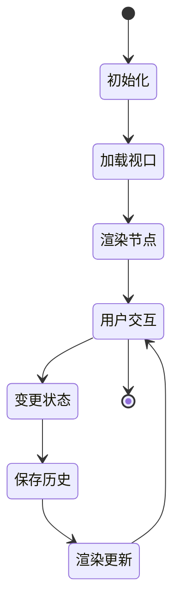
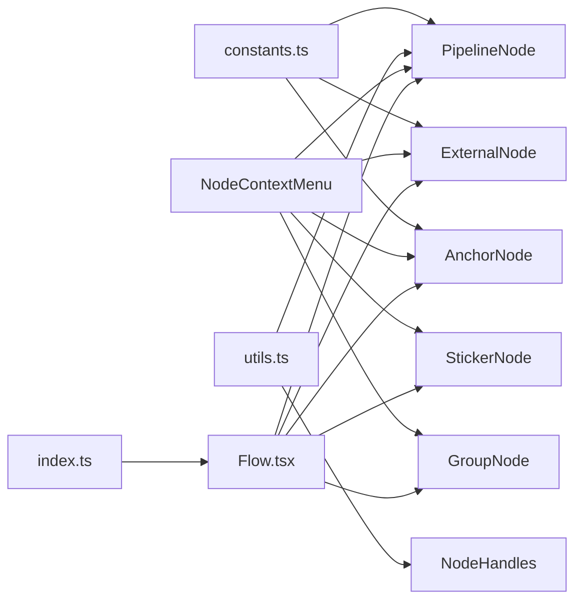

# 节点系统

<cite>
**本文档引用的文件**
- [src/components/flow/nodes/index.ts](file://src/components/flow/nodes/index.ts)
- [src/components/flow/nodes/constants.ts](file://src/components/flow/nodes/constants.ts)
- [src/components/flow/nodes/utils.ts](file://src/components/flow/nodes/utils.ts)
- [src/components/flow/nodes/PipelineNode/index.tsx](file://src/components/flow/nodes/PipelineNode/index.tsx)
- [src/components/flow/nodes/PipelineNode/ClassicContent.tsx](file://src/components/flow/nodes/PipelineNode/ClassicContent.tsx)
- [src/components/flow/nodes/PipelineNode/ModernContent.tsx](file://src/components/flow/nodes/PipelineNode/ModernContent.tsx)
- [src/components/flow/nodes/PipelineNode/MinimalContent.tsx](file://src/components/flow/nodes/PipelineNode/MinimalContent.tsx)
- [src/components/flow/nodes/ExternalNode.tsx](file://src/components/flow/nodes/ExternalNode.tsx)
- [src/components/flow/nodes/AnchorNode.tsx](file://src/components/flow/nodes/AnchorNode.tsx)
- [src/components/flow/nodes/StickerNode.tsx](file://src/components/flow/nodes/StickerNode.tsx)
- [src/components/flow/nodes/GroupNode.tsx](file://src/components/flow/nodes/GroupNode.tsx)
- [src/components/flow/nodes/components/NodeContextMenu.tsx](file://src/components/flow/nodes/components/NodeContextMenu.tsx)
- [src/components/flow/nodes/components/NodeHandles.tsx](file://src/components/flow/nodes/components/NodeHandles.tsx)
- [src/components/flow/nodes/nodeContextMenu.tsx](file://src/components/flow/nodes/nodeContextMenu.tsx)
- [src/components/Flow.tsx](file://src/components/Flow.tsx)
- [src/stores/flow/types.ts](file://src/stores/flow/types.ts)
</cite>

## 目录
1. [简介](#简介)
2. [项目结构](#项目结构)
3. [核心组件](#核心组件)
4. [架构总览](#架构总览)
5. [详细组件分析](#详细组件分析)
6. [依赖分析](#依赖分析)
7. [性能考虑](#性能考虑)
8. [故障排查指南](#故障排查指南)
9. [结论](#结论)
10. [附录](#附录)

## 简介
本文件面向节点系统的开发者与使用者，系统性阐述节点体系的设计与实现，覆盖以下方面：
- 节点类型：Pipeline 节点、External 节点、Anchor 节点、Sticker 便签节点、Group 分组节点
- 渲染机制：三套风格（经典/现代/极简）与内容组件化设计
- 拖拽交互：磁吸对齐、拖入/拖出分组检测、选区右键菜单
- 连接处理：句柄类型、方向配置、连接校验与标签
- 生命周期与状态：Zustand 状态管理、历史快照、选择与路径模式
- 事件处理：右键菜单、键盘快捷键、调试联动
- 扩展开发：自定义节点类型创建与集成
- 与 React Flow 框架的集成与优化策略

## 项目结构
节点系统位于前端 src/components/flow/nodes 目录，采用“按类型分层 + 组件模块化”的组织方式：
- 节点注册与常量：index.ts、constants.ts、utils.ts
- 节点实现：各节点的独立组件文件
- 通用组件：NodeContextMenu、NodeHandles 等
- 容器与集成：Flow.tsx 将节点类型注入 ReactFlow 并提供交互能力

图表来源
- [src/components/flow/nodes/index.ts:1-26](file://src/components/flow/nodes/index.ts#L1-L26)
- [src/components/flow/nodes/constants.ts:1-47](file://src/components/flow/nodes/constants.ts#L1-L47)
- [src/components/flow/nodes/utils.ts:1-139](file://src/components/flow/nodes/utils.ts#L1-L139)
- [src/components/Flow.tsx:462-504](file://src/components/Flow.tsx#L462-L504)

章节来源
- [src/components/flow/nodes/index.ts:1-26](file://src/components/flow/nodes/index.ts#L1-L26)
- [src/components/Flow.tsx:462-504](file://src/components/Flow.tsx#L462-L504)

## 核心组件
- 节点类型注册表：通过统一的 nodeTypes 映射将节点类型与组件绑定，供 ReactFlow 渲染
- 节点常量与句柄：定义节点类型枚举、句柄类型枚举、句柄方向及默认值
- 节点工具：图标映射、极简节点颜色映射、句柄位置计算
- 右键菜单：统一的菜单配置与处理器，支持调试、模板、颜色、方向等操作
- 句柄组件：根据方向动态渲染目标/源句柄，支持垂直/水平布局

章节来源
- [src/components/flow/nodes/index.ts:8-14](file://src/components/flow/nodes/index.ts#L8-L14)
- [src/components/flow/nodes/constants.ts:14-46](file://src/components/flow/nodes/constants.ts#L14-L46)
- [src/components/flow/nodes/utils.ts:14-139](file://src/components/flow/nodes/utils.ts#L14-L139)
- [src/components/flow/nodes/components/NodeContextMenu.tsx:24-168](file://src/components/flow/nodes/components/NodeContextMenu.tsx#L24-L168)
- [src/components/flow/nodes/components/NodeHandles.tsx:37-131](file://src/components/flow/nodes/components/NodeHandles.tsx#L37-L131)

## 架构总览
节点系统围绕 React Flow 容器构建，通过 Zustand 管理全局状态，节点组件负责渲染与交互，通用组件提供可复用能力。

图表来源
- [src/components/Flow.tsx:462-504](file://src/components/Flow.tsx#L462-L504)
- [src/components/flow/nodes/index.ts:8-14](file://src/components/flow/nodes/index.ts#L8-L14)
- [src/components/flow/nodes/PipelineNode/index.tsx:22-194](file://src/components/flow/nodes/PipelineNode/index.tsx#L22-L194)
- [src/components/flow/nodes/ExternalNode.tsx:29-145](file://src/components/flow/nodes/ExternalNode.tsx#L29-L145)
- [src/components/flow/nodes/AnchorNode.tsx:31-147](file://src/components/flow/nodes/AnchorNode.tsx#L31-L147)
- [src/components/flow/nodes/StickerNode.tsx:165-213](file://src/components/flow/nodes/StickerNode.tsx#L165-L213)
- [src/components/flow/nodes/GroupNode.tsx:112-160](file://src/components/flow/nodes/GroupNode.tsx#L112-L160)

## 详细组件分析

### Pipeline 节点
- 渲染风格
  - 经典风格：展示识别/动作/其他参数键值对
  - 现代风格：分区块展示识别/动作/其他，支持图标与模板预览
  - 极简风格：仅图标+标签+句柄，按识别类型自动配色
- 交互与状态
  - 根据焦点透明度与路径模式计算“相关性”，决定是否降低透明度
  - 支持调试态样式：执行中、已执行、识别中、失败
  - 右键菜单：复制节点名/Reco JSON、保存为模板、端点位置切换、调试测试
- 性能优化
  - 使用 memo 包裹组件与内容组件，避免不必要的重渲染
  - 通过浅比较优化 PipelineNodeMemo 的对比逻辑

图表来源
- [src/components/flow/nodes/PipelineNode/index.tsx:22-194](file://src/components/flow/nodes/PipelineNode/index.tsx#L22-L194)
- [src/components/flow/nodes/PipelineNode/ClassicContent.tsx:12-84](file://src/components/flow/nodes/PipelineNode/ClassicContent.tsx#L12-L84)
- [src/components/flow/nodes/PipelineNode/ModernContent.tsx:30-248](file://src/components/flow/nodes/PipelineNode/ModernContent.tsx#L30-L248)
- [src/components/flow/nodes/PipelineNode/MinimalContent.tsx:11-58](file://src/components/flow/nodes/PipelineNode/MinimalContent.tsx#L11-L58)
- [src/components/flow/nodes/components/NodeContextMenu.tsx:24-168](file://src/components/flow/nodes/components/NodeContextMenu.tsx#L24-L168)
- [src/components/flow/nodes/components/NodeHandles.tsx:37-131](file://src/components/flow/nodes/components/NodeHandles.tsx#L37-L131)

章节来源
- [src/components/flow/nodes/PipelineNode/index.tsx:22-194](file://src/components/flow/nodes/PipelineNode/index.tsx#L22-L194)
- [src/components/flow/nodes/PipelineNode/ClassicContent.tsx:12-84](file://src/components/flow/nodes/PipelineNode/ClassicContent.tsx#L12-L84)
- [src/components/flow/nodes/PipelineNode/ModernContent.tsx:30-248](file://src/components/flow/nodes/PipelineNode/ModernContent.tsx#L30-L248)
- [src/components/flow/nodes/PipelineNode/MinimalContent.tsx:11-58](file://src/components/flow/nodes/PipelineNode/MinimalContent.tsx#L11-L58)

### External 节点
- 特点：仅显示标题与句柄，用于外部流程接入
- 交互：支持右键菜单（复制节点名、端点位置切换），受焦点透明度影响
- 性能：memo 对比基础属性与 data 字段，减少重渲染

章节来源
- [src/components/flow/nodes/ExternalNode.tsx:29-145](file://src/components/flow/nodes/ExternalNode.tsx#L29-L145)

### Anchor 节点
- 特点：重定向节点，用于流程跳转
- 交互：支持右键菜单（复制节点名、端点位置切换），受焦点透明度影响
- 性能：memo 对比基础属性与 data 字段，减少重渲染

章节来源
- [src/components/flow/nodes/AnchorNode.tsx:31-147](file://src/components/flow/nodes/AnchorNode.tsx#L31-L147)

### Sticker 便签节点
- 特点：可编辑文本、可调整大小、多主题颜色
- 交互：双击进入编辑、拖拽调整尺寸、右键菜单（复制内容、颜色切换）
- 性能：memo 对比基础属性与 data 字段，编辑态即时保存历史

章节来源
- [src/components/flow/nodes/StickerNode.tsx:165-237](file://src/components/flow/nodes/StickerNode.tsx#L165-L237)

### Group 分组节点
- 特点：容器节点，可包含其他节点；可调整大小、多主题颜色
- 交互：双击标题编辑、拖拽调整尺寸、右键菜单（颜色切换、解散分组、删除分组）
- 性能：memo 对比基础属性与 data 字段

章节来源
- [src/components/flow/nodes/GroupNode.tsx:112-184](file://src/components/flow/nodes/GroupNode.tsx#L112-L184)

### 句柄与连接
- 句柄类型
  - 源句柄：Next（正常流转）、Error（错误流转）
  - 目标句柄：Target（普通输入）、JumpBack（回跳）
- 句柄方向
  - left-right、right-left、top-bottom、bottom-top
  - 默认 left-right
- 连接处理
  - ReactFlow 提供 onConnect 回调，Flow.tsx 中转发至 FlowStore.addedge
  - 边类型为 marked，支持 jump_back/anchor 属性

图表来源
- [src/components/Flow.tsx:256-262](file://src/components/Flow.tsx#L256-L262)
- [src/stores/flow/types.ts:28-38](file://src/stores/flow/types.ts#L28-L38)

章节来源
- [src/components/flow/nodes/components/NodeHandles.tsx:11-131](file://src/components/flow/nodes/components/NodeHandles.tsx#L11-L131)
- [src/components/Flow.tsx:256-262](file://src/components/Flow.tsx#L256-L262)
- [src/stores/flow/types.ts:28-38](file://src/stores/flow/types.ts#L28-L38)

### 右键菜单与事件处理
- 统一菜单配置：根据节点类型与调试模式动态生成菜单项
- 常用操作：复制节点名/内容、保存为模板、端点位置切换、颜色切换、删除
- 调试联动：从此节点开始调试、设为调试入口、测试识别/动作/节点
- 事件处理：菜单项 onClick 调用对应处理器，完成后关闭菜单

图表来源
- [src/components/flow/nodes/components/NodeContextMenu.tsx:24-168](file://src/components/flow/nodes/components/NodeContextMenu.tsx#L24-L168)
- [src/components/flow/nodes/nodeContextMenu.tsx:370-585](file://src/components/flow/nodes/nodeContextMenu.tsx#L370-L585)

章节来源
- [src/components/flow/nodes/components/NodeContextMenu.tsx:24-168](file://src/components/flow/nodes/components/NodeContextMenu.tsx#L24-L168)
- [src/components/flow/nodes/nodeContextMenu.tsx:370-585](file://src/components/flow/nodes/nodeContextMenu.tsx#L370-L585)

### 拖拽交互与磁吸对齐
- 拖拽过程
  - onNodeDrag：计算磁吸对齐并更新节点位置
  - onNodeDragStop：最终落位并对齐，同时检测拖入/拖出分组
- 磁吸规则
  - 可配置启用/禁用，可限制仅在视口内对齐
  - 基于节点边界与中心点进行对齐计算
- 分组交互
  - 拖入 Group：检测相交后加入父分组
  - 拖出 Group：若节点中心超出父分组范围则脱离

图表来源
- [src/components/Flow.tsx:297-413](file://src/components/Flow.tsx#L297-L413)

章节来源
- [src/components/Flow.tsx:297-413](file://src/components/Flow.tsx#L297-L413)

### 生命周期与状态管理
- 状态模型
  - FlowStore：节点/边/历史/选择/视口/路径等状态
  - ConfigStore：节点样式、背景模式、磁吸开关等配置
  - DebugStore：调试模式、入口节点、执行历史等
- 生命周期
  - 初始化：加载视口、文件配置
  - 变更：节点/边变更、选择变更、历史快照
  - 销毁：清理观察者、保存持久化

图表来源
- [src/components/Flow.tsx:95-147](file://src/components/Flow.tsx#L95-L147)
- [src/stores/flow/types.ts:286-361](file://src/stores/flow/types.ts#L286-L361)

章节来源
- [src/stores/flow/types.ts:286-361](file://src/stores/flow/types.ts#L286-L361)
- [src/components/Flow.tsx:95-147](file://src/components/Flow.tsx#L95-L147)

## 依赖分析
- 节点类型与组件
  - index.ts 将 NodeTypeEnum 与具体组件绑定
  - constants.ts 定义句柄类型与方向
  - utils.ts 提供图标与颜色映射
- 与 React Flow 的耦合
  - Flow.tsx 注入 nodeTypes/edgeTypes，处理 onConnect/onNodesChange/onEdgesChange
  - 节点组件使用 useReactFlow/useUpdateNodeInternals 等钩子
- 与状态管理
  - 节点组件读取/写入 FlowStore、ConfigStore、DebugStore
  - 右键菜单处理器通过 FlowStore/DebugStore 更新状态

图表来源
- [src/components/flow/nodes/index.ts:8-14](file://src/components/flow/nodes/index.ts#L8-L14)
- [src/components/Flow.tsx:462-504](file://src/components/Flow.tsx#L462-L504)

章节来源
- [src/components/flow/nodes/index.ts:8-14](file://src/components/flow/nodes/index.ts#L8-L14)
- [src/components/flow/nodes/constants.ts:14-46](file://src/components/flow/nodes/constants.ts#L14-L46)
- [src/components/flow/nodes/utils.ts:14-139](file://src/components/flow/nodes/utils.ts#L14-L139)
- [src/components/Flow.tsx:462-504](file://src/components/Flow.tsx#L462-L504)

## 性能考虑
- 渲染优化
  - 使用 memo 包裹节点组件与内容组件，减少重渲染
  - 通过 useMemo 计算样式与类名，避免重复计算
- 数据结构
  - 使用浅比较（useShallow）订阅 Zustand 状态，降低无关更新
  - FlowStore 的 setNodeData/batchSetNodeData 提供细粒度更新
- 交互优化
  - ResizeObserver 与防抖更新视口尺寸
  - 磁吸对齐仅在启用时计算，且可限制视口内节点
- 调试与历史
  - 保存历史时可设置延迟，避免频繁写入

## 故障排查指南
- 节点不显示或渲染异常
  - 检查 nodeTypes 是否正确注册
  - 确认节点 data 结构符合类型定义
- 句柄位置不正确
  - 检查 handleDirection 是否设置，默认为 left-right
  - 确认 useUpdateNodeInternals 已触发更新
- 连接失败
  - 检查 onConnect 回调是否正确转发至 FlowStore.addEdge
  - 确认边类型与属性（jump_back/anchor）合法
- 拖拽无响应或磁吸无效
  - 检查 enableNodeSnap 与 snapOnlyInViewport 配置
  - 确认未拖拽 Group 节点本身导致逻辑分支
- 右键菜单不出现
  - 检查 NodeContextMenu 包裹层级与触发条件
  - 确认 getNodeContextMenuConfig 返回有效菜单项

章节来源
- [src/components/flow/nodes/components/NodeHandles.tsx:48-59](file://src/components/flow/nodes/components/NodeHandles.tsx#L48-L59)
- [src/components/Flow.tsx:256-262](file://src/components/Flow.tsx#L256-L262)
- [src/components/flow/nodes/components/NodeContextMenu.tsx:24-168](file://src/components/flow/nodes/components/NodeContextMenu.tsx#L24-L168)

## 结论
该节点系统以 React Flow 为核心，结合 Zustand 状态管理与模块化的节点组件，实现了高可扩展、高性能的可视化编辑体验。通过统一的右键菜单与句柄系统，用户可以高效地构建、调试与维护复杂的工作流。建议在扩展新节点类型时遵循现有结构与命名规范，确保一致的交互与视觉体验。

## 附录

### 节点类型与数据结构概览
- PipelineNodeDataType：包含 label、recognition/action/others/extras、handleDirection
- ExternalNodeDataType：包含 label、handleDirection
- AnchorNodeDataType：包含 label、handleDirection
- StickerNodeDataType：包含 label/content/color
- GroupNodeDataType：包含 label/color

章节来源
- [src/stores/flow/types.ts:108-163](file://src/stores/flow/types.ts#L108-L163)

### 扩展开发指南（自定义节点类型）
- 创建组件
  - 新建组件文件，接收 NodeProps，使用 useReactFlow/useUpdateNodeInternals
  - 如需句柄，使用 NodeHandles 或自定义 Handle
- 定义数据结构
  - 在 flow/types.ts 中新增节点数据类型与节点接口
- 注册与导出
  - 在 nodes/index.ts 中导出组件与 memo 包裹版本
  - 在 nodeTypes 映射中注册新类型
- 集成到容器
  - Flow.tsx 已自动注入 nodeTypes，无需额外修改
- 右键菜单
  - 在 nodeContextMenu.tsx 中为新类型添加菜单项与处理器
- 性能与样式
  - 使用 memo 与 useMemo 优化渲染
  - 遵循现有样式类名与主题配置

章节来源
- [src/components/flow/nodes/index.ts:8-14](file://src/components/flow/nodes/index.ts#L8-L14)
- [src/stores/flow/types.ts:165-243](file://src/stores/flow/types.ts#L165-L243)
- [src/components/flow/nodes/nodeContextMenu.tsx:370-585](file://src/components/flow/nodes/nodeContextMenu.tsx#L370-L585)