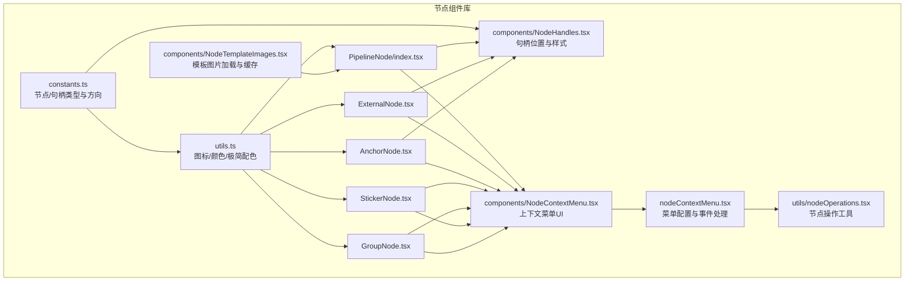
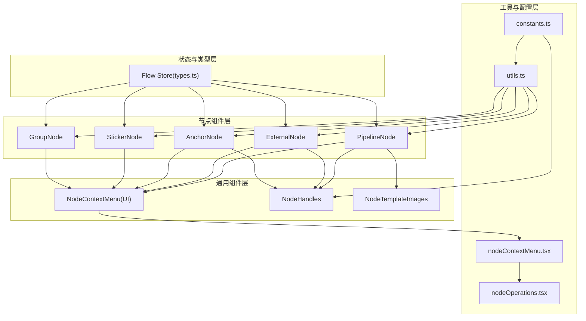
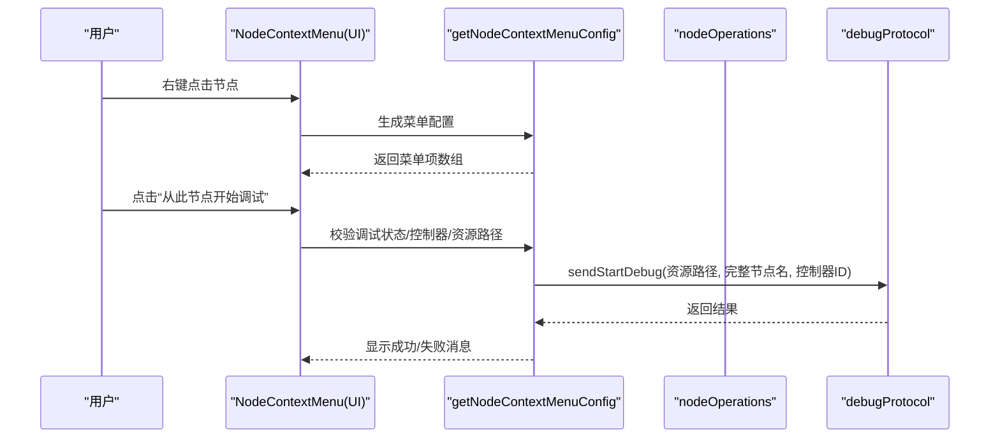
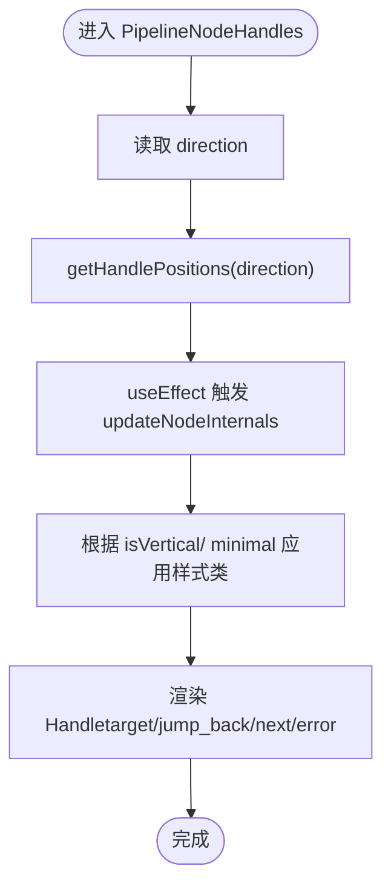
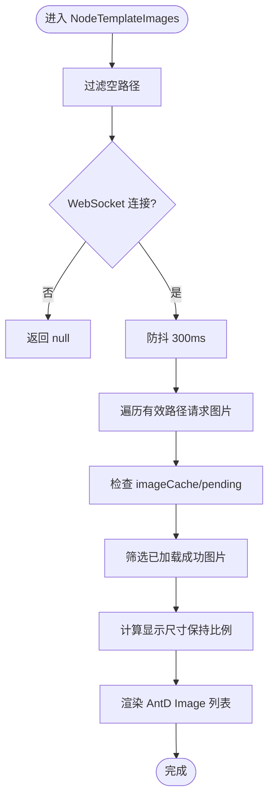
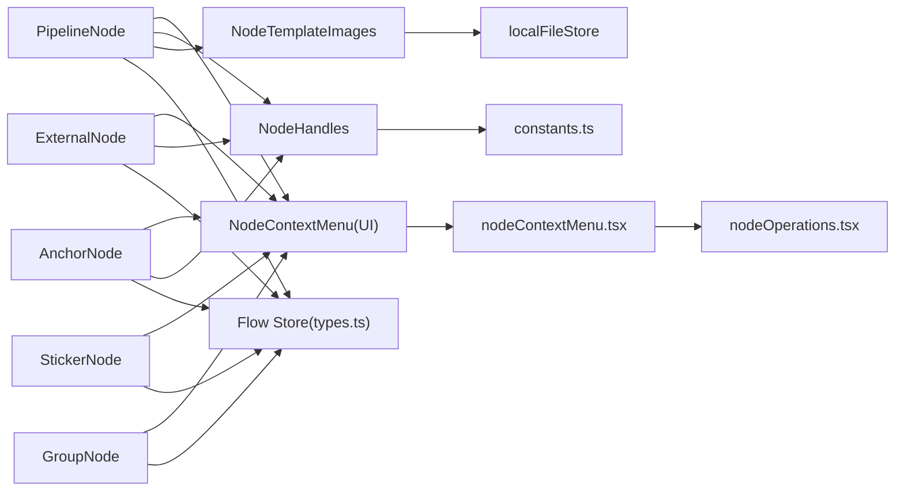

# 节点组件库

<cite>
**本文档引用的文件**
- [src/components/flow/nodes/index.ts](file://src/components/flow/nodes/index.ts)
- [src/components/flow/nodes/constants.ts](file://src/components/flow/nodes/constants.ts)
- [src/components/flow/nodes/utils.ts](file://src/components/flow/nodes/utils.ts)
- [src/components/flow/nodes/nodeContextMenu.tsx](file://src/components/flow/nodes/nodeContextMenu.tsx)
- [src/components/flow/nodes/utils/nodeOperations.tsx](file://src/components/flow/nodes/utils/nodeOperations.tsx)
- [src/components/flow/nodes/components/NodeContextMenu.tsx](file://src/components/flow/nodes/components/NodeContextMenu.tsx)
- [src/components/flow/nodes/components/NodeHandles.tsx](file://src/components/flow/nodes/components/NodeHandles.tsx)
- [src/components/flow/nodes/components/NodeTemplateImages.tsx](file://src/components/flow/nodes/components/NodeTemplateImages.tsx)
- [src/components/flow/nodes/PipelineNode/index.tsx](file://src/components/flow/nodes/PipelineNode/index.tsx)
- [src/components/flow/nodes/ExternalNode.tsx](file://src/components/flow/nodes/ExternalNode.tsx)
- [src/components/flow/nodes/AnchorNode.tsx](file://src/components/flow/nodes/AnchorNode.tsx)
- [src/components/flow/nodes/StickerNode.tsx](file://src/components/flow/nodes/StickerNode.tsx)
- [src/components/flow/nodes/GroupNode.tsx](file://src/components/flow/nodes/GroupNode.tsx)
- [src/stores/flow/types.ts](file://src/stores/flow/types.ts)
</cite>

## 目录
1. [简介](#简介)
2. [项目结构](#项目结构)
3. [核心组件](#核心组件)
4. [架构总览](#架构总览)
5. [详细组件分析](#详细组件分析)
6. [依赖分析](#依赖分析)
7. [性能考虑](#性能考虑)
8. [故障排查指南](#故障排查指南)
9. [结论](#结论)
10. [附录](#附录)

## 简介
本文件为节点组件库的综合技术文档，面向需要深入理解与扩展节点系统的开发者。文档涵盖以下重点：
- 共享的通用组件与工具函数：图标映射、颜色主题、句柄位置计算等
- 上下文菜单组件：菜单项配置、可见性/禁用条件、事件处理与调试集成
- 节点句柄组件：位置计算、样式切换、响应式更新
- 模板图片组件：加载策略、缓存机制与显示优化
- 节点工具函数：坐标转换、碰撞检测、布局计算等核心算法的实现要点

## 项目结构
节点组件库位于前端 src/components/flow/nodes 目录下，采用按功能模块划分的组织方式：
- constants.ts：节点类型、句柄类型与方向枚举
- utils.ts：图标映射、颜色主题、极简节点配色等工具
- components/：通用组件（上下文菜单、句柄、模板图片）
- 节点目录：PipelineNode、ExternalNode、AnchorNode、StickerNode、GroupNode
- utils/nodeOperations.tsx：节点操作工具函数（复制、保存模板、删除、复制 Reco JSON）

图表来源
- [src/components/flow/nodes/index.ts:1-26](file://src/components/flow/nodes/index.ts#L1-L26)
- [src/components/flow/nodes/constants.ts:1-47](file://src/components/flow/nodes/constants.ts#L1-L47)
- [src/components/flow/nodes/utils.ts:1-139](file://src/components/flow/nodes/utils.ts#L1-L139)
- [src/components/flow/nodes/components/NodeContextMenu.tsx:1-171](file://src/components/flow/nodes/components/NodeContextMenu.tsx#L1-L171)
- [src/components/flow/nodes/components/NodeHandles.tsx:1-254](file://src/components/flow/nodes/components/NodeHandles.tsx#L1-L254)
- [src/components/flow/nodes/components/NodeTemplateImages.tsx:1-120](file://src/components/flow/nodes/components/NodeTemplateImages.tsx#L1-L120)
- [src/components/flow/nodes/PipelineNode/index.tsx:1-255](file://src/components/flow/nodes/PipelineNode/index.tsx#L1-L255)
- [src/components/flow/nodes/ExternalNode.tsx:1-167](file://src/components/flow/nodes/ExternalNode.tsx#L1-L167)
- [src/components/flow/nodes/AnchorNode.tsx:1-169](file://src/components/flow/nodes/AnchorNode.tsx#L1-L169)
- [src/components/flow/nodes/StickerNode.tsx:1-237](file://src/components/flow/nodes/StickerNode.tsx#L1-L237)
- [src/components/flow/nodes/GroupNode.tsx:1-184](file://src/components/flow/nodes/GroupNode.tsx#L1-L184)
- [src/components/flow/nodes/nodeContextMenu.tsx:1-586](file://src/components/flow/nodes/nodeContextMenu.tsx#L1-L586)
- [src/components/flow/nodes/utils/nodeOperations.tsx:1-184](file://src/components/flow/nodes/utils/nodeOperations.tsx#L1-L184)

章节来源
- [src/components/flow/nodes/index.ts:1-26](file://src/components/flow/nodes/index.ts#L1-L26)

## 核心组件
本节梳理节点系统中的共享组件与工具函数，帮助快速定位实现位置与职责边界。

- 节点类型与句柄方向
  - 节点类型枚举：Pipeline、External、Anchor、Sticker、Group
  - 句柄类型枚举：SourceHandleTypeEnum（next、on_error）、TargetHandleTypeEnum（target、jump_back）
  - 句柄方向：left-right、right-left、top-bottom、bottom-top，默认 left-right
  - 参考路径：[src/components/flow/nodes/constants.ts:1-47](file://src/components/flow/nodes/constants.ts#L1-L47)

- 图标与颜色主题
  - 识别类型图标映射：DirectHit、OCR、TemplateMatch、ColorMatch、FeatureMatch、And、Or、NeuralNetworkClassify、NeuralNetworkDetect、Custom
  - 动作类型图标映射：DoNothing、Click、Swipe、Scroll、ClickKey、LongPress、TouchDown/Move/Up、LongPressKey、KeyDown/KeyUp、InputText、StartApp、StopApp、StopTask、Command、Key
  - 节点类型图标映射：pipeline、external、anchor
  - 极简节点颜色配置：按识别类型返回主色与背景色
  - 参考路径：[src/components/flow/nodes/utils.ts:1-139](file://src/components/flow/nodes/utils.ts#L1-L139)

- 节点操作工具
  - 复制节点名：支持拼接前缀（Pipeline 节点）
  - 保存节点为模板：弹窗输入模板名，覆盖确认，写入自定义模板存储
  - 删除节点：通过 FlowStore 更新节点集合
  - 复制节点 Reco JSON：解析节点为导出格式，提取 recognition 与 param，写入剪贴板
  - 参考路径：[src/components/flow/nodes/utils/nodeOperations.tsx:1-184](file://src/components/flow/nodes/utils/nodeOperations.tsx#L1-L184)

章节来源
- [src/components/flow/nodes/constants.ts:1-47](file://src/components/flow/nodes/constants.ts#L1-L47)
- [src/components/flow/nodes/utils.ts:1-139](file://src/components/flow/nodes/utils.ts#L1-L139)
- [src/components/flow/nodes/utils/nodeOperations.tsx:1-184](file://src/components/flow/nodes/utils/nodeOperations.tsx#L1-L184)

## 架构总览
节点系统以“节点组件 + 通用组件 + 工具函数”三层架构组织，配合 Flow Store 管理节点状态与历史，通过上下文菜单统一接入业务操作与调试能力。

图表来源
- [src/components/flow/nodes/constants.ts:1-47](file://src/components/flow/nodes/constants.ts#L1-L47)
- [src/components/flow/nodes/utils.ts:1-139](file://src/components/flow/nodes/utils.ts#L1-L139)
- [src/components/flow/nodes/components/NodeContextMenu.tsx:1-171](file://src/components/flow/nodes/components/NodeContextMenu.tsx#L1-L171)
- [src/components/flow/nodes/components/NodeHandles.tsx:1-254](file://src/components/flow/nodes/components/NodeHandles.tsx#L1-L254)
- [src/components/flow/nodes/components/NodeTemplateImages.tsx:1-120](file://src/components/flow/nodes/components/NodeTemplateImages.tsx#L1-L120)
- [src/components/flow/nodes/PipelineNode/index.tsx:1-255](file://src/components/flow/nodes/PipelineNode/index.tsx#L1-L255)
- [src/components/flow/nodes/ExternalNode.tsx:1-167](file://src/components/flow/nodes/ExternalNode.tsx#L1-L167)
- [src/components/flow/nodes/AnchorNode.tsx:1-169](file://src/components/flow/nodes/AnchorNode.tsx#L1-L169)
- [src/components/flow/nodes/StickerNode.tsx:1-237](file://src/components/flow/nodes/StickerNode.tsx#L1-L237)
- [src/components/flow/nodes/GroupNode.tsx:1-184](file://src/components/flow/nodes/GroupNode.tsx#L1-L184)
- [src/components/flow/nodes/nodeContextMenu.tsx:1-586](file://src/components/flow/nodes/nodeContextMenu.tsx#L1-L586)
- [src/components/flow/nodes/utils/nodeOperations.tsx:1-184](file://src/components/flow/nodes/utils/nodeOperations.tsx#L1-L184)
- [src/stores/flow/types.ts:1-362](file://src/stores/flow/types.ts#L1-L362)

## 详细组件分析

### 上下文菜单组件
- 组件职责
  - 将统一的菜单配置转换为 Ant Design Dropdown 的 items
  - 支持普通菜单项、带子菜单项、分隔线、可见性/禁用/危险样式
  - 与调试模式联动，动态注入调试相关菜单项
- 菜单配置
  - 基础项：复制节点名、复制便签内容（Sticker 节点）、复制 Reco JSON（Pipeline 节点）、保存为模板（Pipeline 节点）、便签颜色（Sticker 节点）、端点位置（除 Sticker/Group）
  - 调试项：从此节点开始调试、设为调试开始节点、测试此节点/识别/动作（仅 Pipeline）
  - 分组项：分组颜色、解散分组、删除分组
  - 删除项：危险操作
- 事件处理
  - 调用 nodeOperations 工具函数执行复制、保存、删除、复制 Reco JSON
  - 调试相关：校验连接状态、控制器、资源路径，构造完整节点名，通过 debugProtocol 发送启动消息
  - 端点位置：更新节点 data.handleDirection 并保存历史
  - 分组/便签颜色：调用 FlowStore.setNodeData 更新颜色并保存历史

图表来源
- [src/components/flow/nodes/components/NodeContextMenu.tsx:1-171](file://src/components/flow/nodes/components/NodeContextMenu.tsx#L1-L171)
- [src/components/flow/nodes/nodeContextMenu.tsx:1-586](file://src/components/flow/nodes/nodeContextMenu.tsx#L1-L586)
- [src/components/flow/nodes/utils/nodeOperations.tsx:1-184](file://src/components/flow/nodes/utils/nodeOperations.tsx#L1-L184)

章节来源
- [src/components/flow/nodes/components/NodeContextMenu.tsx:1-171](file://src/components/flow/nodes/components/NodeContextMenu.tsx#L1-L171)
- [src/components/flow/nodes/nodeContextMenu.tsx:1-586](file://src/components/flow/nodes/nodeContextMenu.tsx#L1-L586)
- [src/components/flow/nodes/utils/nodeOperations.tsx:1-184](file://src/components/flow/nodes/utils/nodeOperations.tsx#L1-L184)

### 节点句柄组件
- 设计思路
  - 通过 direction 参数决定目标/源句柄的位置（Left/Right/Top/Bottom）
  - 支持垂直/水平两种布局，对应不同样式类
  - 通过 useUpdateNodeInternals 强制刷新句柄位置，确保拖拽/方向变更后布局正确
- 位置计算
  - getHandlePositions(direction) 返回 targetPosition、sourcePosition 与 isVertical
  - 不同节点类型（Pipeline/External/Anchor）复用相同计算逻辑，但句柄数量与样式不同
- 交互逻辑
  - 当 direction 变更时，触发多次 updateNodeInternals 以保证视觉与逻辑一致
  - 样式类根据 minimal 与 isVertical 切换，满足现代/极简风格

图表来源
- [src/components/flow/nodes/components/NodeHandles.tsx:1-254](file://src/components/flow/nodes/components/NodeHandles.tsx#L1-L254)
- [src/components/flow/nodes/constants.ts:1-47](file://src/components/flow/nodes/constants.ts#L1-L47)

章节来源
- [src/components/flow/nodes/components/NodeHandles.tsx:1-254](file://src/components/flow/nodes/components/NodeHandles.tsx#L1-L254)
- [src/components/flow/nodes/constants.ts:1-47](file://src/components/flow/nodes/constants.ts#L1-L47)

### 模板图片组件
- 加载策略
  - 过滤空路径，仅对未缓存且未在请求队列中的路径发起请求
  - 使用防抖（300ms）批量触发请求，避免频繁网络请求
  - 仅在 WebSocket 连接建立且存在有效路径时渲染
- 缓存机制
  - 通过 localFileStore.imageCache 与 pendingImageRequests 管理缓存与待请求集合
  - 已加载成功的图片从缓存中读取，避免重复请求
- 显示优化
  - 限定最大高度与最大宽度，保持宽高比
  - 使用 data URI 展示 base64 图片，预览关闭遮罩，圆角边框提升观感

图表来源
- [src/components/flow/nodes/components/NodeTemplateImages.tsx:1-120](file://src/components/flow/nodes/components/NodeTemplateImages.tsx#L1-L120)

章节来源
- [src/components/flow/nodes/components/NodeTemplateImages.tsx:1-120](file://src/components/flow/nodes/components/NodeTemplateImages.tsx#L1-L120)

### 节点工具函数
- 复制节点名
  - 若为 Pipeline 节点且存在前缀，自动拼接 prefix_name
  - 写入剪贴板
- 保存为模板
  - 弹窗输入模板名，长度与唯一性校验
  - 存在则覆盖确认；否则新增模板
- 删除节点
  - 通过 FlowStore.updateNodes 移除节点
- 复制 Reco JSON
  - 解析节点为导出格式，提取 recognition 与 param
  - 依据配置缩进格式化 JSON，写入剪贴板并提示

章节来源
- [src/components/flow/nodes/utils/nodeOperations.tsx:1-184](file://src/components/flow/nodes/utils/nodeOperations.tsx#L1-L184)

## 依赖分析
- 节点组件与通用组件
  - PipelineNode/ExternalNode/AnchorNode 依赖 NodeContextMenu 与 NodeHandles
  - StickerNode/GroupNode 依赖 NodeContextMenu，StickerNode 还依赖 Resizer
- 通用组件与工具
  - NodeContextMenu 依赖 nodeContextMenu 配置与 nodeOperations 工具
  - NodeHandles 依赖 constants 中的方向枚举与 utils 的 getHandlePositions
  - NodeTemplateImages 依赖 localFileStore 与 resourceProtocol
- 状态与类型
  - 所有节点组件依赖 Flow Store 的节点/边/历史状态
  - 节点数据类型在 types.ts 中集中定义

图表来源
- [src/components/flow/nodes/PipelineNode/index.tsx:1-255](file://src/components/flow/nodes/PipelineNode/index.tsx#L1-L255)
- [src/components/flow/nodes/ExternalNode.tsx:1-167](file://src/components/flow/nodes/ExternalNode.tsx#L1-L167)
- [src/components/flow/nodes/AnchorNode.tsx:1-169](file://src/components/flow/nodes/AnchorNode.tsx#L1-L169)
- [src/components/flow/nodes/StickerNode.tsx:1-237](file://src/components/flow/nodes/StickerNode.tsx#L1-L237)
- [src/components/flow/nodes/GroupNode.tsx:1-184](file://src/components/flow/nodes/GroupNode.tsx#L1-L184)
- [src/components/flow/nodes/components/NodeContextMenu.tsx:1-171](file://src/components/flow/nodes/components/NodeContextMenu.tsx#L1-L171)
- [src/components/flow/nodes/components/NodeHandles.tsx:1-254](file://src/components/flow/nodes/components/NodeHandles.tsx#L1-L254)
- [src/components/flow/nodes/components/NodeTemplateImages.tsx:1-120](file://src/components/flow/nodes/components/NodeTemplateImages.tsx#L1-L120)
- [src/components/flow/nodes/nodeContextMenu.tsx:1-586](file://src/components/flow/nodes/nodeContextMenu.tsx#L1-L586)
- [src/components/flow/nodes/utils/nodeOperations.tsx:1-184](file://src/components/flow/nodes/utils/nodeOperations.tsx#L1-L184)
- [src/stores/flow/types.ts:1-362](file://src/stores/flow/types.ts#L1-L362)

章节来源
- [src/stores/flow/types.ts:1-362](file://src/stores/flow/types.ts#L1-L362)

## 性能考虑
- 句柄更新
  - NodeHandles 在方向变更时多次调用 updateNodeInternals，确保布局稳定，但应避免频繁切换导致的过度重绘
- 模板图片加载
  - 防抖与缓存显著降低网络请求与渲染压力；建议在大量节点同时展示模板图时，进一步限制并发请求
- 菜单渲染
  - NodeContextMenu 使用 useMemo 过滤可见项与构建菜单项，减少不必要的重渲染
- 节点记忆化
  - 各节点组件使用 memo，并对关键字段进行浅比较，避免无关更新

## 故障排查指南
- 右键菜单无效
  - 检查 NodeContextMenu 的 open/onOpenChange 状态是否正确传递
  - 确认 getNodeContextMenuConfig 返回的 items 未被全部过滤
- 端点位置不生效
  - 确认 direction 参数传入正确，且已触发 updateNodeInternals
  - 检查样式类是否按 isVertical 与 minimal 正确应用
- 模板图片不显示
  - 确认 WebSocket 已连接且 templatePaths 非空
  - 检查 imageCache 是否包含对应路径，pendingImageRequests 是否阻塞
- 调试启动失败
  - 校验 LocalBridge 连接状态、控制器连接、资源路径配置
  - 检查完整节点名生成与 debugProtocol.sendStartDebug 返回值

章节来源
- [src/components/flow/nodes/components/NodeContextMenu.tsx:1-171](file://src/components/flow/nodes/components/NodeContextMenu.tsx#L1-L171)
- [src/components/flow/nodes/components/NodeHandles.tsx:1-254](file://src/components/flow/nodes/components/NodeHandles.tsx#L1-L254)
- [src/components/flow/nodes/components/NodeTemplateImages.tsx:1-120](file://src/components/flow/nodes/components/NodeTemplateImages.tsx#L1-L120)
- [src/components/flow/nodes/nodeContextMenu.tsx:1-586](file://src/components/flow/nodes/nodeContextMenu.tsx#L1-L586)

## 结论
节点组件库通过清晰的分层设计与统一的工具函数，实现了可扩展、可维护的节点系统。上下文菜单提供一致的操作入口，句柄组件确保连接布局的灵活性，模板图片组件兼顾性能与体验。建议在后续迭代中：
- 对高频更新场景增加更细粒度的缓存与去抖策略
- 为节点工具函数补充单元测试，覆盖边界条件
- 优化调试流程的消息反馈与错误恢复

## 附录
- 节点类型与方向枚举参考：[src/components/flow/nodes/constants.ts:1-47](file://src/components/flow/nodes/constants.ts#L1-L47)
- 图标与颜色主题参考：[src/components/flow/nodes/utils.ts:1-139](file://src/components/flow/nodes/utils.ts#L1-L139)
- 节点数据类型定义：[src/stores/flow/types.ts:1-362](file://src/stores/flow/types.ts#L1-L362)