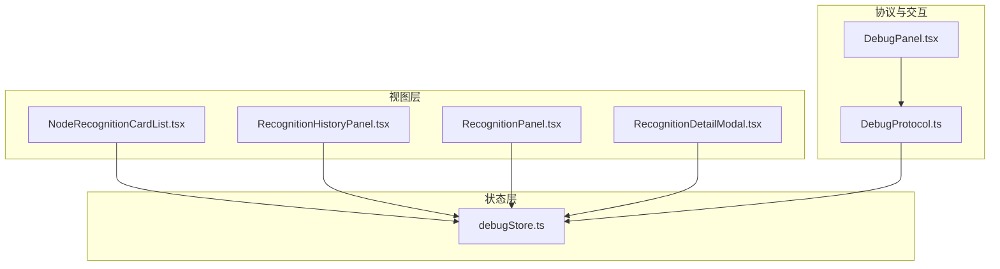
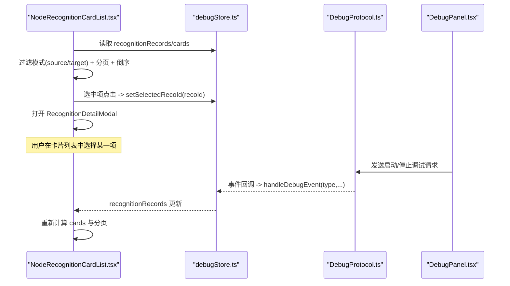
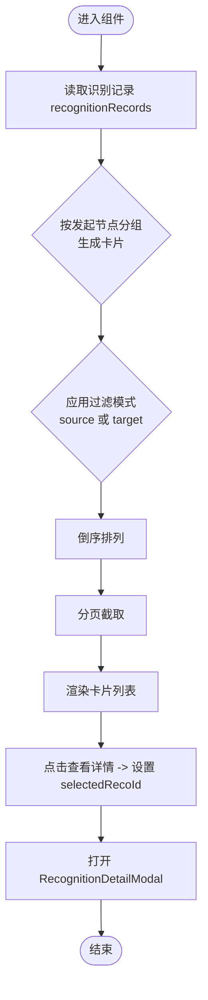
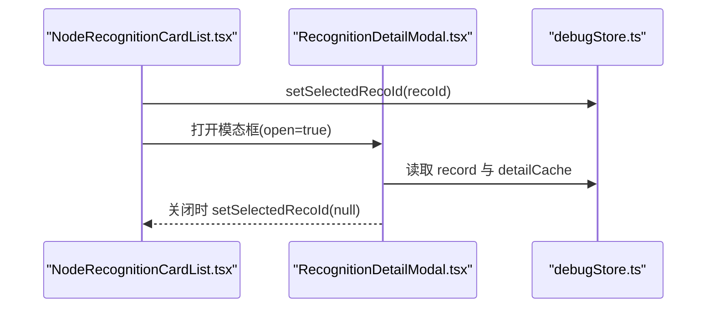
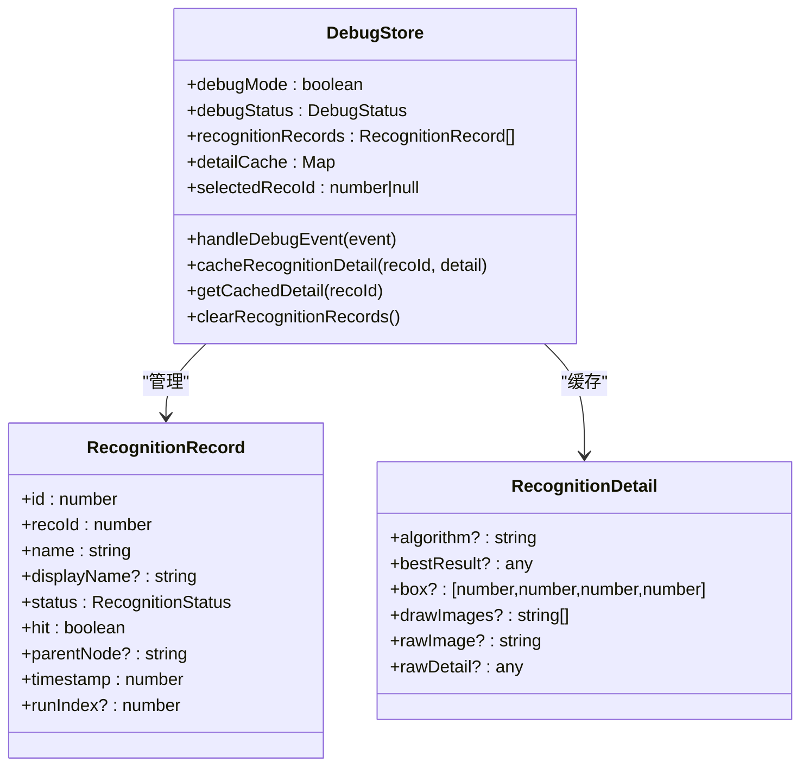
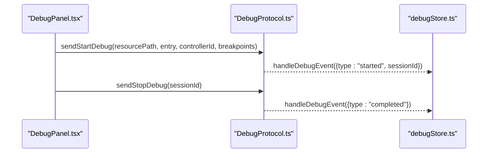
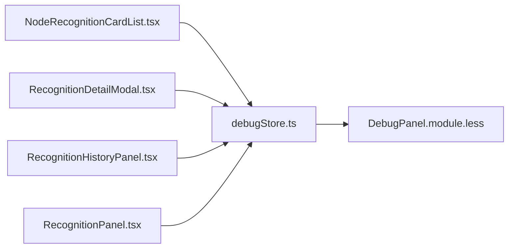

# 节点识别卡片列表

<cite>
**本文引用的文件**
- [NodeRecognitionCardList.tsx](file://src/components/panels/tools/NodeRecognitionCardList.tsx)
- [RecognitionDetailModal.tsx](file://src/components/panels/tools/RecognitionDetailModal.tsx)
- [debugStore.ts](file://src/stores/debugStore.ts)
- [DebugPanel.tsx](file://src/components/panels/tools/DebugPanel.tsx)
- [DebugProtocol.ts](file://src/services/protocols/DebugProtocol.ts)
- [RecognitionHistoryPanel.tsx](file://src/components/panels/main/RecognitionHistoryPanel.tsx)
- [RecognitionPanel.tsx](file://src/components/panels/main/RecognitionPanel.tsx)
- [DebugPanel.module.less](file://src/styles/DebugPanel.module.less)
</cite>

## 目录
1. [简介](#简介)
2. [项目结构](#项目结构)
3. [核心组件](#核心组件)
4. [架构总览](#架构总览)
5. [组件详细分析](#组件详细分析)
6. [依赖关系分析](#依赖关系分析)
7. [性能考量](#性能考量)
8. [故障排查指南](#故障排查指南)
9. [结论](#结论)

## 简介
节点识别卡片列表是调试面板中的一个关键子功能，用于以“卡片化”的方式展示一次“发起节点 -> 待识别目标节点”的识别轮次。每个卡片标题为“当前发起识别的节点”，卡片内容为该轮次中“next/on_error 列表”中的所有目标节点，按识别状态、是否命中、是否有详情等维度进行可视化呈现，并支持分页浏览与查看详情。

该功能与全局识别记录列表、识别详情模态框共同构成完整的识别结果浏览与诊断链路，便于用户快速定位某节点的识别行为、命中情况以及底层细节。

## 项目结构
围绕“节点识别卡片列表”的主要文件组织如下：
- 视图层组件
  - NodeRecognitionCardList.tsx：节点识别卡片列表组件（支持“出发节点记录/目标节点记录”两种过滤模式）
  - RecognitionDetailModal.tsx：识别详情模态框（展示命中状态、算法信息、绘制图像、最佳结果、识别框、原始详情与原始图像等）
  - RecognitionHistoryPanel.tsx：识别记录历史面板（以卡片形式展示全局识别轮次）
  - RecognitionPanel.tsx：识别结果面板（平铺列表）
- 状态层
  - debugStore.ts：调试状态与识别记录的集中存储（识别记录、详情缓存、当前选中识别ID等）
- 协议与交互
  - DebugProtocol.ts：调试协议封装（启动/停止调试、事件派发）
  - DebugPanel.tsx：调试面板（会话管理、时间计算、日志打开等）

图表来源
- [NodeRecognitionCardList.tsx](file://src/components/panels/tools/NodeRecognitionCardList.tsx#L1-L359)
- [RecognitionHistoryPanel.tsx](file://src/components/panels/main/RecognitionHistoryPanel.tsx#L1-L377)
- [RecognitionPanel.tsx](file://src/components/panels/main/RecognitionPanel.tsx#L1-L331)
- [RecognitionDetailModal.tsx](file://src/components/panels/tools/RecognitionDetailModal.tsx#L1-L261)
- [debugStore.ts](file://src/stores/debugStore.ts#L1-L724)
- [DebugPanel.tsx](file://src/components/panels/tools/DebugPanel.tsx#L112-L156)
- [DebugProtocol.ts](file://src/services/protocols/DebugProtocol.ts#L521-L695)

章节来源
- [NodeRecognitionCardList.tsx](file://src/components/panels/tools/NodeRecognitionCardList.tsx#L1-L359)
- [RecognitionDetailModal.tsx](file://src/components/panels/tools/RecognitionDetailModal.tsx#L1-L261)
- [debugStore.ts](file://src/stores/debugStore.ts#L1-L724)
- [DebugPanel.tsx](file://src/components/panels/tools/DebugPanel.tsx#L112-L156)
- [DebugProtocol.ts](file://src/services/protocols/DebugProtocol.ts#L521-L695)
- [RecognitionHistoryPanel.tsx](file://src/components/panels/main/RecognitionHistoryPanel.tsx#L1-L377)
- [RecognitionPanel.tsx](file://src/components/panels/main/RecognitionPanel.tsx#L1-L331)

## 核心组件
- 节点识别卡片列表（NodeRecognitionCardList）
  - 输入：当前节点名、过滤模式（"source" | "target"）
  - 输出：按轮次聚合的卡片列表，每张卡片包含“发起节点”和“待识别目标列表”
  - 功能：支持分页、倒序展示、命中高亮、查看详情弹窗
- 识别详情模态框（RecognitionDetailModal）
  - 输入：选中的识别ID（recoId）
  - 输出：命中/未命中状态、算法信息、绘制图像、最佳结果、识别框、原始详情与原始图像
- 调试状态存储（debugStore）
  - 管理识别记录数组、详情缓存、当前选中识别ID、调试会话状态等
- 调试协议（DebugProtocol）
  - 负责启动/停止调试、事件派发与会话一致性校验

章节来源
- [NodeRecognitionCardList.tsx](file://src/components/panels/tools/NodeRecognitionCardList.tsx#L1-L359)
- [RecognitionDetailModal.tsx](file://src/components/panels/tools/RecognitionDetailModal.tsx#L1-L261)
- [debugStore.ts](file://src/stores/debugStore.ts#L1-L724)
- [DebugProtocol.ts](file://src/services/protocols/DebugProtocol.ts#L521-L695)

## 架构总览
节点识别卡片列表与调试系统的关系如下：

图表来源
- [NodeRecognitionCardList.tsx](file://src/components/panels/tools/NodeRecognitionCardList.tsx#L1-L359)
- [debugStore.ts](file://src/stores/debugStore.ts#L1-L724)
- [DebugProtocol.ts](file://src/services/protocols/DebugProtocol.ts#L521-L695)
- [DebugPanel.tsx](file://src/components/panels/tools/DebugPanel.tsx#L112-L156)

## 组件详细分析

### 节点识别卡片列表（NodeRecognitionCardList）
- 过滤模式
  - "source"：仅保留“发起节点等于当前节点”的轮次
  - "target"：仅保留“待识别目标列表中包含当前节点”的轮次
- 数据转换
  - 将平铺的识别记录按“发起节点（parentNode）变更”切分为一张张卡片
  - 每张卡片包含：卡片ID、当前发起节点、时间戳、目标节点列表（名称、显示名、状态、是否命中、recoId）
- 展示与交互
  - 倒序展示（最新的在前）
  - 分页：每页固定数量
  - 命中高亮：当过滤模式为"target"且某目标节点名匹配当前节点时，该项高亮
  - 查看详情：点击“眼睛”图标，设置选中识别ID并打开详情模态框
- 空态与提示
  - 无记录时根据调试状态显示不同提示文案

图表来源
- [NodeRecognitionCardList.tsx](file://src/components/panels/tools/NodeRecognitionCardList.tsx#L1-L359)

章节来源
- [NodeRecognitionCardList.tsx](file://src/components/panels/tools/NodeRecognitionCardList.tsx#L1-L359)

### 识别详情模态框（RecognitionDetailModal）
- 作用：展示某一次识别的详细信息，包括命中状态、算法类型、绘制图像、最佳结果、识别框、原始详情与原始图像
- 数据来源：通过选中的识别ID从状态存储中读取识别记录与详情缓存
- 交互：支持关闭并清除选中ID

图表来源
- [NodeRecognitionCardList.tsx](file://src/components/panels/tools/NodeRecognitionCardList.tsx#L1-L359)
- [RecognitionDetailModal.tsx](file://src/components/panels/tools/RecognitionDetailModal.tsx#L1-L261)
- [debugStore.ts](file://src/stores/debugStore.ts#L1-L724)

章节来源
- [RecognitionDetailModal.tsx](file://src/components/panels/tools/RecognitionDetailModal.tsx#L1-L261)
- [debugStore.ts](file://src/stores/debugStore.ts#L1-L724)

### 调试状态与事件处理（debugStore）
- 识别记录结构：包含节点名、显示名、状态、是否命中、发起节点、时间戳、执行次数等
- 识别详情结构：包含算法类型、最佳结果、识别框、绘制图像、原始图像、原始详情等
- 事件处理要点：
  - 识别开始：创建识别记录（仅当存在发起节点时）
  - 识别成功/失败：更新对应记录状态与命中标记，并缓存详情
  - 节点执行：维护执行历史与当前节点状态
  - 调试控制：启动/停止/暂停/完成/错误等事件驱动状态机

图表来源
- [debugStore.ts](file://src/stores/debugStore.ts#L1-L724)

章节来源
- [debugStore.ts](file://src/stores/debugStore.ts#L1-L724)

### 调试协议与面板（DebugProtocol / DebugPanel）
- DebugProtocol：封装调试启动/停止请求，携带资源路径、入口节点、控制器ID、断点等参数
- DebugPanel：负责会话生命周期管理、时间计算、日志打开结果提示等

图表来源
- [DebugPanel.tsx](file://src/components/panels/tools/DebugPanel.tsx#L112-L156)
- [DebugProtocol.ts](file://src/services/protocols/DebugProtocol.ts#L521-L695)
- [debugStore.ts](file://src/stores/debugStore.ts#L1-L724)

章节来源
- [DebugPanel.tsx](file://src/components/panels/tools/DebugPanel.tsx#L112-L156)
- [DebugProtocol.ts](file://src/services/protocols/DebugProtocol.ts#L521-L695)
- [debugStore.ts](file://src/stores/debugStore.ts#L1-L724)

## 依赖关系分析
- 组件依赖
  - NodeRecognitionCardList 依赖 debugStore 的识别记录与当前选中ID
  - RecognitionDetailModal 依赖 debugStore 的识别记录与详情缓存
  - 识别历史面板（RecognitionHistoryPanel）与识别面板（RecognitionPanel）共享相同的数据结构与交互模式
- 样式依赖
  - 所有识别相关面板共用 DebugPanel.module.less 的样式类，保证视觉一致与滚动条统一

图表来源
- [NodeRecognitionCardList.tsx](file://src/components/panels/tools/NodeRecognitionCardList.tsx#L1-L359)
- [RecognitionDetailModal.tsx](file://src/components/panels/tools/RecognitionDetailModal.tsx#L1-L261)
- [RecognitionHistoryPanel.tsx](file://src/components/panels/main/RecognitionHistoryPanel.tsx#L1-L377)
- [RecognitionPanel.tsx](file://src/components/panels/main/RecognitionPanel.tsx#L1-L331)
- [debugStore.ts](file://src/stores/debugStore.ts#L1-L724)
- [DebugPanel.module.less](file://src/styles/DebugPanel.module.less#L516-L761)

章节来源
- [NodeRecognitionCardList.tsx](file://src/components/panels/tools/NodeRecognitionCardList.tsx#L1-L359)
- [RecognitionDetailModal.tsx](file://src/components/panels/tools/RecognitionDetailModal.tsx#L1-L261)
- [RecognitionHistoryPanel.tsx](file://src/components/panels/main/RecognitionHistoryPanel.tsx#L1-L377)
- [RecognitionPanel.tsx](file://src/components/panels/main/RecognitionPanel.tsx#L1-L331)
- [debugStore.ts](file://src/stores/debugStore.ts#L1-L724)
- [DebugPanel.module.less](file://src/styles/DebugPanel.module.less#L516-L761)

## 性能考量
- 渲染优化
  - 使用 useMemo 对卡片分组、倒序与分页结果进行缓存，避免重复计算
  - 使用 memo 包装子组件，减少不必要的重渲染
- 数据规模
  - 识别记录与卡片列表均支持分页，避免一次性渲染大量节点导致卡顿
- 状态更新
  - 识别详情采用懒加载缓存策略，仅在需要时读取与渲染，降低内存占用

## 故障排查指南
- 无识别记录
  - 若调试未启动或未产生识别事件，列表可能为空；可在调试面板启动调试后再查看
- 无法查看详情
  - 确认已选中有效识别ID；若详情尚未缓存，需等待后端事件携带完整详情后再显示
- 卡片不显示目标节点
  - 检查过滤模式是否正确（source/target）；仅当存在“发起节点”时才会生成识别记录卡片
- 识别历史面板不显示
  - 确认已通过调试工具栏按钮开启识别历史面板可见性

章节来源
- [NodeRecognitionCardList.tsx](file://src/components/panels/tools/NodeRecognitionCardList.tsx#L1-L359)
- [RecognitionHistoryPanel.tsx](file://src/components/panels/main/RecognitionHistoryPanel.tsx#L1-L377)
- [debugStore.ts](file://src/stores/debugStore.ts#L1-L724)

## 结论
节点识别卡片列表通过“发起节点 -> 目标节点”的轮次化展示，将复杂的识别过程以直观的卡片形式呈现，结合分页与命中高亮，显著提升了调试效率。配合识别详情模态框与全局识别记录面板，形成了从宏观到微观的完整识别诊断链路。建议在大规模流水线下优先使用“目标节点记录”模式聚焦特定节点，再通过“查看详情”深入定位问题根因。