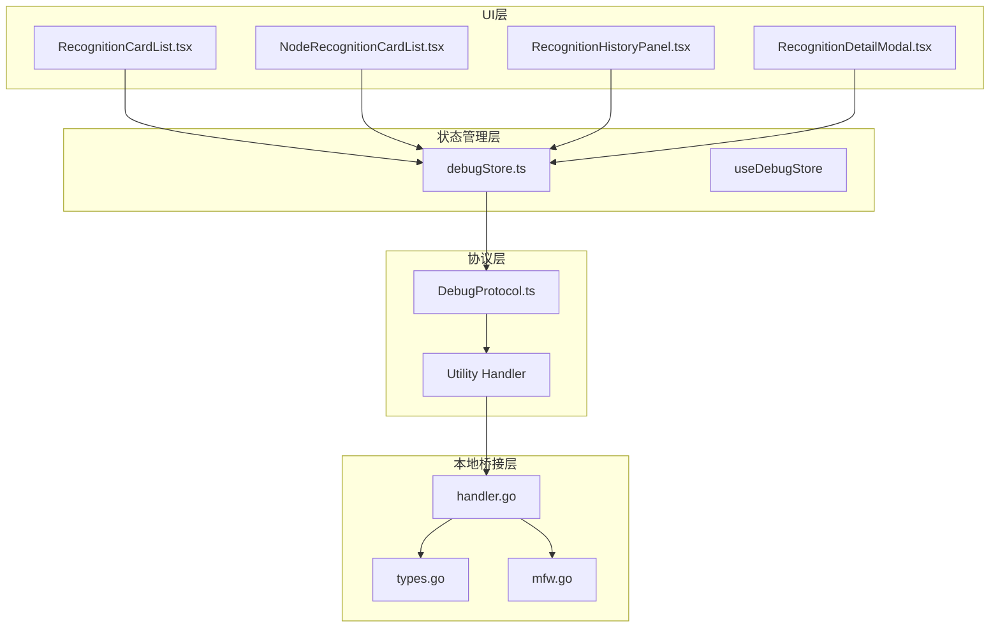
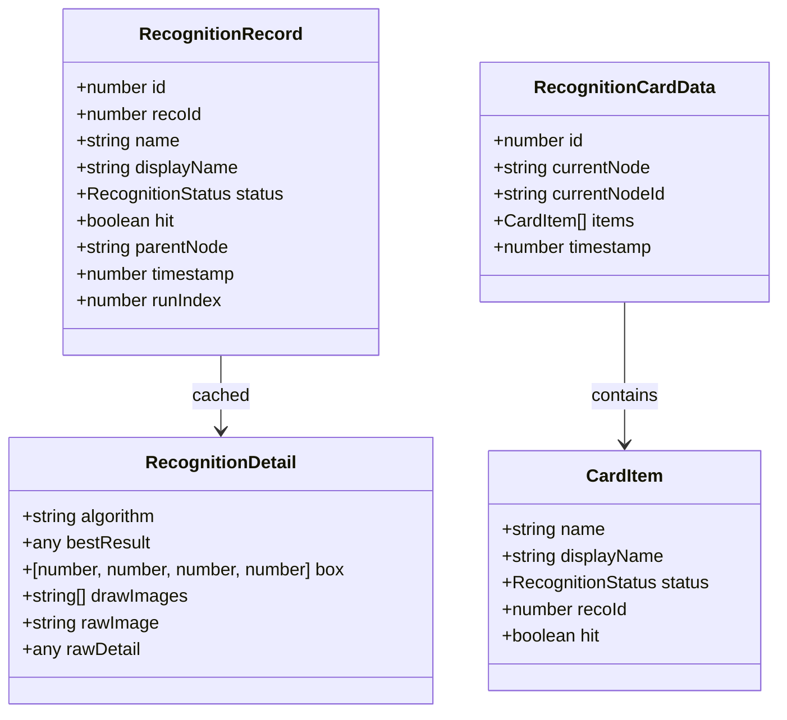
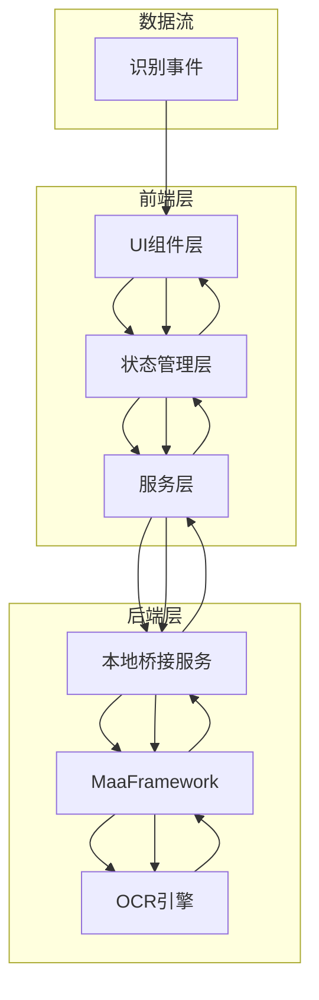
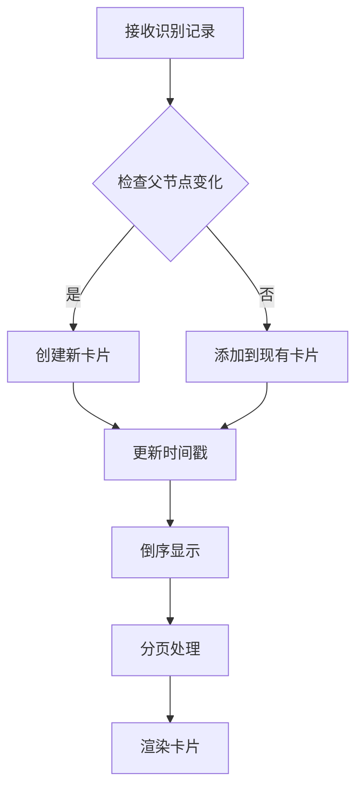
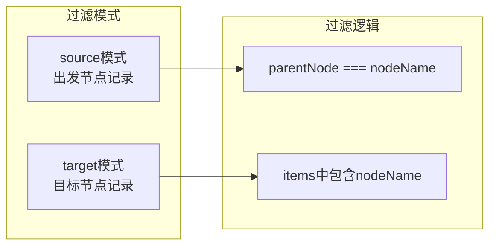
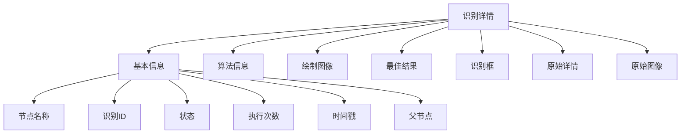
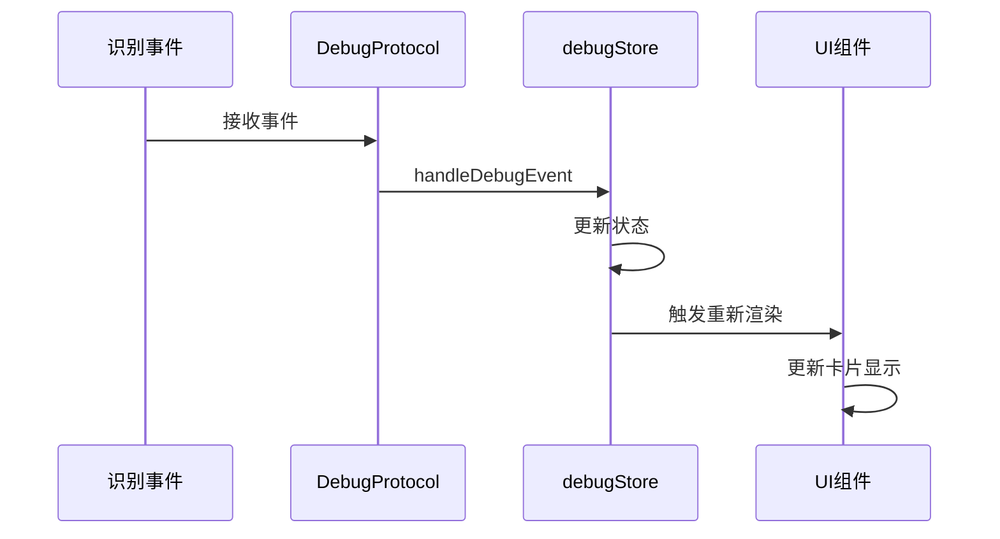
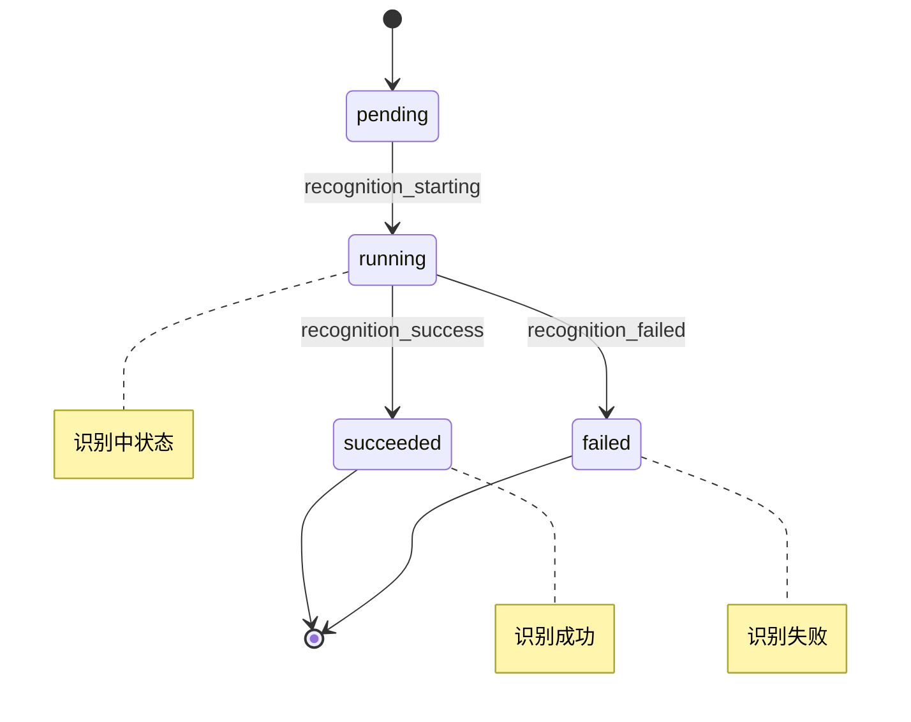
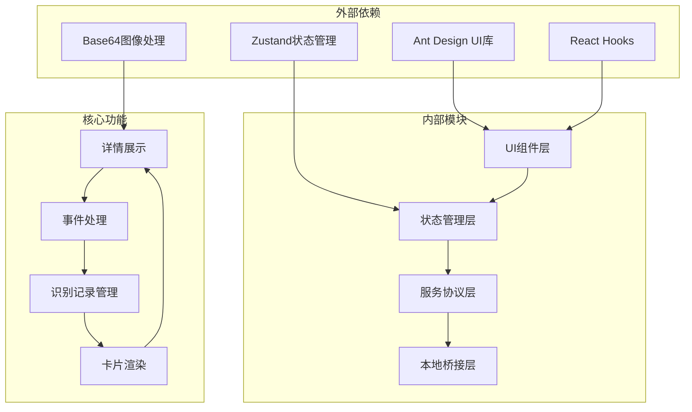

# 识别卡片列表

<cite>
**本文档引用的文件**
- [RecognitionCardList.tsx](file://src/components/panels/tools/RecognitionCardList.tsx)
- [NodeRecognitionCardList.tsx](file://src/components/panels/tools/NodeRecognitionCardList.tsx)
- [RecognitionHistoryPanel.tsx](file://src/components/panels/main/RecognitionHistoryPanel.tsx)
- [RecognitionDetailModal.tsx](file://src/components/panels/tools/RecognitionDetailModal.tsx)
- [debugStore.ts](file://src/stores/debugStore.ts)
- [DebugProtocol.ts](file://src/services/protocols/DebugProtocol.ts)
- [handler.go](file://LocalBridge/internal/protocol/utility/handler.go)
- [types.go](file://LocalBridge/internal/mfw/types.go)
- [mfw.go](file://LocalBridge/pkg/models/mfw.go)
</cite>

## 目录
1. [简介](#简介)
2. [项目结构](#项目结构)
3. [核心组件](#核心组件)
4. [架构概览](#架构概览)
5. [详细组件分析](#详细组件分析)
6. [依赖关系分析](#依赖关系分析)
7. [性能考虑](#性能考虑)
8. [故障排除指南](#故障排除指南)
9. [结论](#结论)

## 简介

识别卡片列表是 MaaPipelineEditor 调试系统中的核心可视化组件，用于展示和管理识别过程中的节点状态。该功能通过卡片形式组织识别记录，提供直观的状态展示、详情查看和历史追踪能力。

该系统实现了以下核心功能：
- 将识别记录按父节点分组为卡片
- 实时显示识别状态（等待中、识别中、成功、失败）
- 支持详情模态框查看识别结果
- 提供分页浏览大量识别记录
- 支持全局和节点级别的识别记录过滤

## 项目结构

识别卡片列表功能分布在多个层次中：



**图表来源**
- [RecognitionCardList.tsx](file://src/components/panels/tools/RecognitionCardList.tsx#L1-L344)
- [debugStore.ts](file://src/stores/debugStore.ts#L1-L724)
- [DebugProtocol.ts](file://src/services/protocols/DebugProtocol.ts#L208-L367)

## 核心组件

### 识别卡片数据结构

识别卡片系统的核心数据结构包括：



**图表来源**
- [debugStore.ts](file://src/stores/debugStore.ts#L38-L76)
- [RecognitionCardList.tsx](file://src/components/panels/tools/RecognitionCardList.tsx#L65-L71)

### 状态管理系统

识别状态通过统一的状态管理器进行维护：

```mermaid
stateDiagram-v2
[*] --> idle
idle --> preparing : startDebug
preparing --> running : debug started
running --> paused : debug paused
paused --> running : debug resumed
running --> completed : debug completed
completed --> idle : reset
state running {
[*] --> pending
pending --> running : recognition_starting
running --> succeeded : recognition_success
running --> failed : recognition_failed
succeeded --> pending
failed --> pending
}
```

**图表来源**
- [debugStore.ts](file://src/stores/debugStore.ts#L8-L13)
- [debugStore.ts](file://src/stores/debugStore.ts#L321-L652)

## 架构概览

识别卡片列表系统采用分层架构设计，确保组件间的松耦合和高内聚：



**图表来源**
- [RecognitionCardList.tsx](file://src/components/panels/tools/RecognitionCardList.tsx#L172-L344)
- [debugStore.ts](file://src/stores/debugStore.ts#L168-L724)

## 详细组件分析

### RecognitionCardList 组件

主识别卡片列表组件负责展示全局的识别记录：

#### 核心功能实现



**图表来源**
- [RecognitionCardList.tsx](file://src/components/panels/tools/RecognitionCardList.tsx#L190-L234)

#### 组件属性和方法

| 属性/方法 | 类型 | 描述 |
|-----------|------|------|
| recognitionRecords | RecognitionRecord[] | 识别记录数组 |
| debugStatus | DebugStatus | 调试状态 |
| clearRecognitionRecords | () => void | 清空识别记录 |
| setSelectedRecoId | (id: number) => void | 设置选中的识别ID |

### NodeRecognitionCardList 组件

节点特定的识别卡片列表，支持两种过滤模式：

#### 过滤模式对比



**图表来源**
- [NodeRecognitionCardList.tsx](file://src/components/panels/tools/NodeRecognitionCardList.tsx#L251-L262)

#### 高亮功能

节点识别卡片列表支持智能高亮功能：

- **目标节点高亮**：当过滤模式为 `target` 时，匹配的节点名称会被高亮显示
- **样式增强**：高亮节点名称会加粗并改变颜色
- **视觉反馈**：提供清晰的视觉指示帮助用户定位相关节点

### RecognitionDetailModal 组件

识别详情模态框提供详细的识别结果展示：

#### 详情内容结构



**图表来源**
- [RecognitionDetailModal.tsx](file://src/components/panels/tools/RecognitionDetailModal.tsx#L86-L256)

#### 图像展示功能

详情模态框支持多种图像格式的展示：

- **绘制图像**：显示识别过程中的标注图像
- **原始图像**：显示原始截图
- **Base64编码**：自动处理图像数据格式
- **响应式布局**：支持多图像并排展示

### 状态管理实现

识别状态管理通过集中式的 store 实现：

#### 事件处理流程



**图表来源**
- [DebugProtocol.ts](file://src/services/protocols/DebugProtocol.ts#L221-L229)
- [debugStore.ts](file://src/stores/debugStore.ts#L321-L652)

#### 识别记录生命周期



**图表来源**
- [debugStore.ts](file://src/stores/debugStore.ts#L429-L542)

## 依赖关系分析

识别卡片列表系统的依赖关系呈现清晰的层次结构：



**图表来源**
- [RecognitionCardList.tsx](file://src/components/panels/tools/RecognitionCardList.tsx#L1-L15)
- [debugStore.ts](file://src/stores/debugStore.ts#L1-L4)

### 组件间通信

识别卡片列表组件通过以下方式进行通信：

1. **状态共享**：所有组件共享同一个状态存储
2. **事件驱动**：基于事件的异步通信机制
3. **回调函数**：组件间通过回调函数传递数据
4. **模态框通信**：详情模态框与父组件的数据交换

## 性能考虑

识别卡片列表系统在设计时充分考虑了性能优化：

### 渲染优化

- **虚拟滚动**：对于大量识别记录，使用虚拟滚动技术提升渲染性能
- **记忆化计算**：使用 `useMemo` 缓存计算结果，避免重复渲染
- **分页加载**：限制每页显示的卡片数量，减少DOM节点数量

### 状态管理优化

- **局部状态**：只更新必要的状态，避免全量重渲染
- **状态分离**：将识别记录和执行历史分离管理
- **增量更新**：使用增量更新策略减少状态变更成本

### 内存管理

- **缓存机制**：识别详情采用缓存机制，避免重复请求
- **垃圾回收**：及时清理不再使用的状态和事件
- **内存泄漏防护**：确保组件卸载时清理所有订阅和定时器

## 故障排除指南

### 常见问题及解决方案

#### 识别记录不显示

**问题描述**：识别卡片列表为空，没有任何记录显示

**可能原因**：
1. 调试模式未启动
2. 识别事件未正确处理
3. 父节点信息缺失

**解决步骤**：
1. 确认调试模式已启动
2. 检查识别事件是否正常接收
3. 验证父节点信息是否正确传递

#### 卡片渲染异常

**问题描述**：卡片显示异常或布局错乱

**可能原因**：
1. 状态更新时机问题
2. 数据结构不一致
3. 样式冲突

**解决步骤**：
1. 检查状态更新逻辑
2. 验证数据结构完整性
3. 检查CSS样式冲突

#### 详情模态框无法打开

**问题描述**：点击查看详情按钮无响应

**可能原因**：
1. 识别ID为空
2. 详情数据未缓存
3. 模态框状态管理问题

**解决步骤**：
1. 确认识别ID有效
2. 检查详情数据缓存
3. 验证模态框状态切换

### 调试技巧

#### 状态监控

使用浏览器开发者工具监控状态变化：
1. 打开 Redux DevTools 或类似工具
2. 监控识别记录的状态变化
3. 跟踪事件处理流程

#### 性能分析

使用性能分析工具：
1. 分析组件渲染性能
2. 监控内存使用情况
3. 检查事件处理效率

## 结论

识别卡片列表系统通过精心设计的架构和实现，为用户提供了一个强大而直观的识别过程可视化工具。系统的主要优势包括：

1. **直观的可视化**：通过卡片形式清晰展示识别状态
2. **灵活的过滤**：支持全局和节点级别的识别记录过滤
3. **丰富的详情**：提供详细的识别结果展示和分析
4. **良好的性能**：通过多种优化技术确保流畅的用户体验
5. **可靠的架构**：分层设计确保系统的可维护性和扩展性

该系统不仅满足了当前的功能需求，还为未来的功能扩展奠定了坚实的基础。通过持续的优化和改进，识别卡片列表将继续为 MaaPipelineEditor 用户提供优质的调试体验。