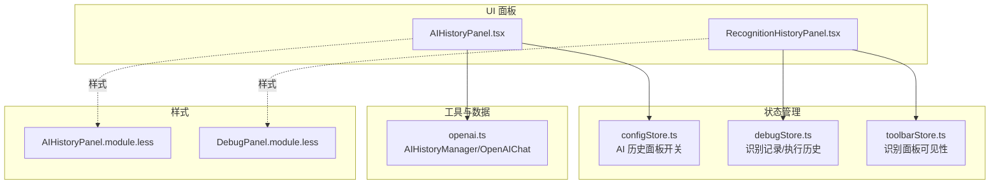
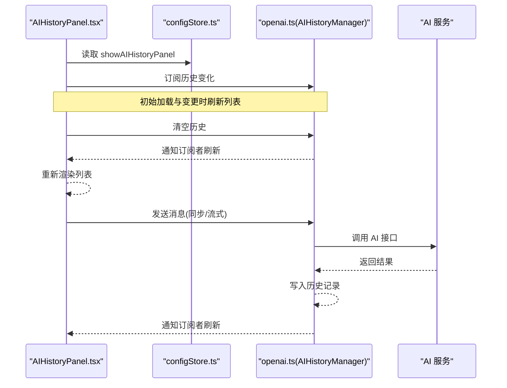
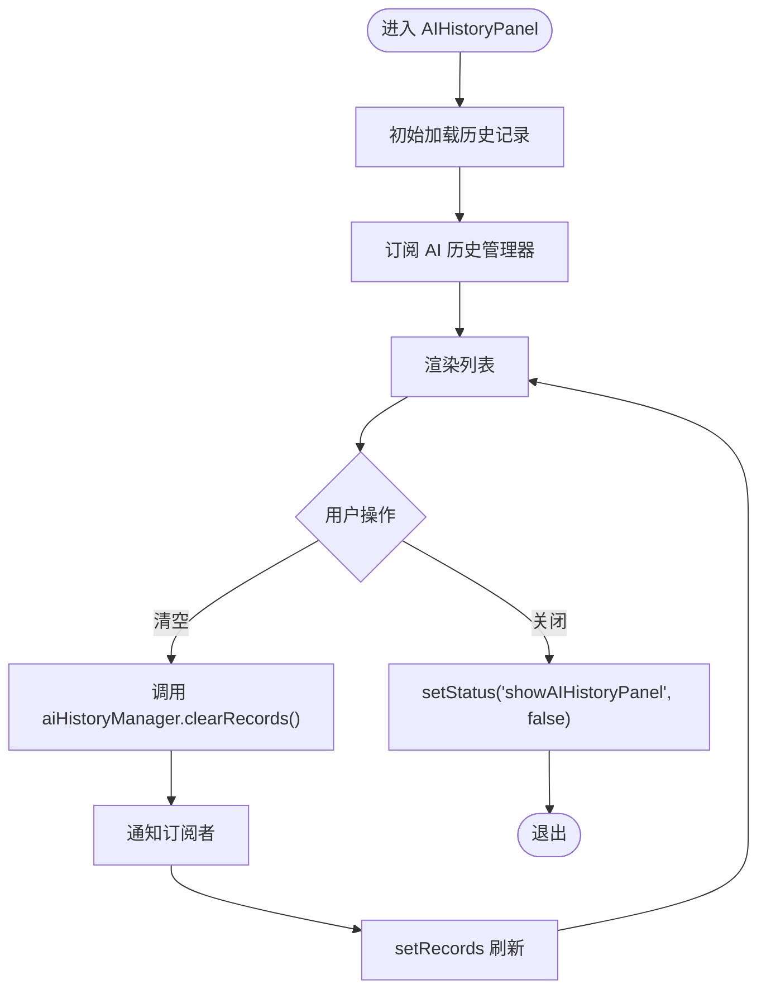
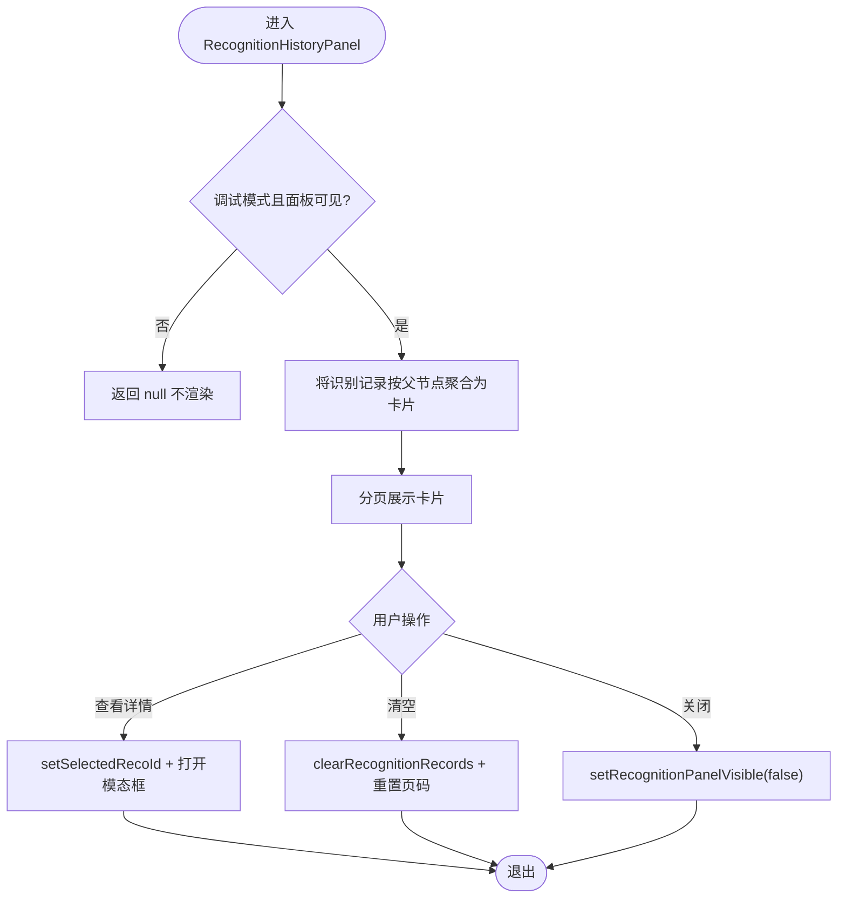
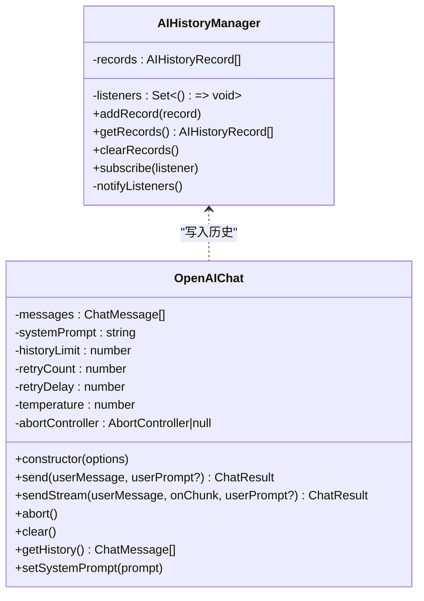
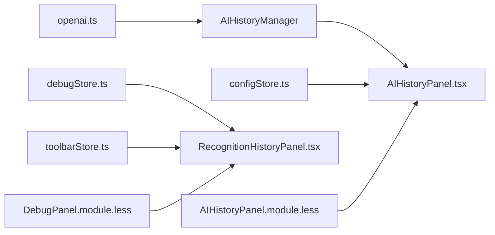

# 识别历史面板

<cite>
**本文引用的文件**
- [AIHistoryPanel.tsx](file://src/components/panels/main/AIHistoryPanel.tsx)
- [RecognitionHistoryPanel.tsx](file://src/components/panels/main/RecognitionHistoryPanel.tsx)
- [openai.ts](file://src/utils/openai.ts)
- [debugStore.ts](file://src/stores/debugStore.ts)
- [configStore.ts](file://src/stores/configStore.ts)
- [toolbarStore.ts](file://src/stores/toolbarStore.ts)
- [AIHistoryPanel.module.less](file://src/styles/AIHistoryPanel.module.less)
- [DebugPanel.module.less](file://src/styles/DebugPanel.module.less)
</cite>

## 目录
1. [简介](#简介)
2. [项目结构](#项目结构)
3. [核心组件](#核心组件)
4. [架构总览](#架构总览)
5. [详细组件分析](#详细组件分析)
6. [依赖关系分析](#依赖关系分析)
7. [性能考量](#性能考量)
8. [故障排查指南](#故障排查指南)
9. [结论](#结论)

## 简介
本文件聚焦“识别历史面板”的设计与实现，涵盖两类历史记录：
- AI 对话历史：记录与 AI 服务交互的请求与响应，支持展开查看实际消息、清空历史等。
- 识别记录历史：记录调试过程中各节点的识别尝试与结果，按“父节点”聚合为卡片，支持分页、查看详情、清空等。

二者均以独立面板形式呈现，分别由各自的组件与样式模块驱动，并通过全局状态管理进行联动。

## 项目结构
识别历史相关的关键位置如下：
- 主面板组件
  - AI 对话历史面板：[AIHistoryPanel.tsx](file://src/components/panels/main/AIHistoryPanel.tsx)
  - 识别记录历史面板：[RecognitionHistoryPanel.tsx](file://src/components/panels/main/RecognitionHistoryPanel.tsx)
- 工具与数据
  - AI 历史管理器与聊天封装：[openai.ts](file://src/utils/openai.ts)
  - 调试状态与识别记录存储：[debugStore.ts](file://src/stores/debugStore.ts)
  - 面板可见性与右侧面板状态：[toolbarStore.ts](file://src/stores/toolbarStore.ts)
  - 配置与 AI 历史面板开关：[configStore.ts](file://src/stores/configStore.ts)
- 样式
  - AI 历史面板样式：[AIHistoryPanel.module.less](file://src/styles/AIHistoryPanel.module.less)
  - 调试面板样式（含识别卡片列表样式）：[DebugPanel.module.less](file://src/styles/DebugPanel.module.less)

图表来源
- [AIHistoryPanel.tsx](file://src/components/panels/main/AIHistoryPanel.tsx#L82-L166)
- [RecognitionHistoryPanel.tsx](file://src/components/panels/main/RecognitionHistoryPanel.tsx#L170-L377)
- [openai.ts](file://src/utils/openai.ts#L48-L87)
- [debugStore.ts](file://src/stores/debugStore.ts#L1-L120)
- [toolbarStore.ts](file://src/stores/toolbarStore.ts#L1-L90)
- [AIHistoryPanel.module.less](file://src/styles/AIHistoryPanel.module.less#L1-L119)
- [DebugPanel.module.less](file://src/styles/DebugPanel.module.less#L708-L761)

章节来源
- [AIHistoryPanel.tsx](file://src/components/panels/main/AIHistoryPanel.tsx#L82-L166)
- [RecognitionHistoryPanel.tsx](file://src/components/panels/main/RecognitionHistoryPanel.tsx#L170-L377)
- [openai.ts](file://src/utils/openai.ts#L48-L87)
- [debugStore.ts](file://src/stores/debugStore.ts#L1-L120)
- [toolbarStore.ts](file://src/stores/toolbarStore.ts#L1-L90)
- [AIHistoryPanel.module.less](file://src/styles/AIHistoryPanel.module.less#L1-L119)
- [DebugPanel.module.less](file://src/styles/DebugPanel.module.less#L708-L761)

## 核心组件
- AI 对话历史面板
  - 负责渲染 AI 历史记录列表，提供清空与关闭操作；通过订阅 AI 历史管理器实时更新。
  - 关键实现位置：[AIHistoryPanel.tsx](file://src/components/panels/main/AIHistoryPanel.tsx#L82-L166)
- 识别记录历史面板
  - 负责将识别记录按“父节点”聚合为卡片，支持分页、查看详情、清空与关闭；仅在调试模式且面板可见时显示。
  - 关键实现位置：[RecognitionHistoryPanel.tsx](file://src/components/panels/main/RecognitionHistoryPanel.tsx#L170-L377)
- AI 历史管理器与聊天封装
  - 提供全局历史记录的增删查与订阅通知；封装 OpenAI 请求（同步/流式），并在每次请求后写入历史。
  - 关键实现位置：[openai.ts](file://src/utils/openai.ts#L48-L87), [openai.ts](file://src/utils/openai.ts#L169-L243), [openai.ts](file://src/utils/openai.ts#L251-L358)
- 调试状态与识别记录存储
  - 维护识别记录数组、当前父节点、运行计数、详情缓存等；提供清理识别记录与选择当前详情 ID 的方法。
  - 关键实现位置：[debugStore.ts](file://src/stores/debugStore.ts#L34-L72)
- 面板可见性与右侧面板状态
  - 控制识别历史面板的显示/隐藏；维护右侧面板类型等。
  - 关键实现位置：[toolbarStore.ts](file://src/stores/toolbarStore.ts#L1-L90)

章节来源
- [AIHistoryPanel.tsx](file://src/components/panels/main/AIHistoryPanel.tsx#L82-L166)
- [RecognitionHistoryPanel.tsx](file://src/components/panels/main/RecognitionHistoryPanel.tsx#L170-L377)
- [openai.ts](file://src/utils/openai.ts#L48-L87)
- [debugStore.ts](file://src/stores/debugStore.ts#L34-L72)
- [toolbarStore.ts](file://src/stores/toolbarStore.ts#L1-L90)

## 架构总览
AI 对话历史与识别记录历史分别由独立组件驱动，共享的状态与工具如下：
- AI 对话历史
  - 依赖：全局配置状态（控制面板开关）、AI 历史管理器（增删查与订阅）
  - 输出：列表项（时间、成功/失败、用户输入、实际消息、AI 回复/错误）
- 识别记录历史
  - 依赖：调试状态（调试模式、调试状态、识别记录）、工具栏状态（面板可见性）
  - 输出：卡片列表（按父节点聚合，每张卡片内含若干识别项）

图表来源
- [AIHistoryPanel.tsx](file://src/components/panels/main/AIHistoryPanel.tsx#L82-L166)
- [openai.ts](file://src/utils/openai.ts#L48-L87)
- [openai.ts](file://src/utils/openai.ts#L169-L243)
- [openai.ts](file://src/utils/openai.ts#L251-L358)
- [configStore.ts](file://src/stores/configStore.ts#L122-L132)

## 详细组件分析

### AI 对话历史面板
- 功能要点
  - 展示历史记录列表，每条记录包含时间、成功/失败标记、用户输入、实际消息（可展开）、AI 回复或错误信息。
  - 支持清空历史与关闭面板；面板显隐受全局配置控制。
- 数据与状态
  - 来源：AI 历史管理器（全局单例），初始加载与订阅变更时更新。
  - 订阅：组件挂载时订阅，卸载时取消。
- 交互流程
  - 清空历史：调用管理器清空并触发刷新。
  - 关闭面板：通过配置状态关闭。
- 样式与主题
  - 使用模块化样式文件，支持暗色模式适配。

图表来源
- [AIHistoryPanel.tsx](file://src/components/panels/main/AIHistoryPanel.tsx#L82-L166)
- [openai.ts](file://src/utils/openai.ts#L48-L87)
- [configStore.ts](file://src/stores/configStore.ts#L122-L132)

章节来源
- [AIHistoryPanel.tsx](file://src/components/panels/main/AIHistoryPanel.tsx#L82-L166)
- [AIHistoryPanel.module.less](file://src/styles/AIHistoryPanel.module.less#L1-L119)
- [openai.ts](file://src/utils/openai.ts#L48-L87)
- [configStore.ts](file://src/stores/configStore.ts#L122-L132)

### 识别记录历史面板
- 功能要点
  - 将识别记录按“父节点”聚合为卡片，每张卡片包含若干识别项（名称、状态、是否命中、详情按钮）。
  - 支持分页、清空、关闭；仅在调试模式且面板可见时显示。
- 数据与状态
  - 来源：调试状态中的识别记录数组；工具栏状态控制面板可见性。
  - 聚合逻辑：遍历识别记录，遇到父节点变化则生成新卡片；时间戳随最新记录更新。
- 交互流程
  - 查看详情：根据 recoId 选择并打开详情模态框。
  - 清空：调用调试状态的清理方法并重置页码。
  - 关闭：设置面板不可见。

图表来源
- [RecognitionHistoryPanel.tsx](file://src/components/panels/main/RecognitionHistoryPanel.tsx#L170-L377)
- [debugStore.ts](file://src/stores/debugStore.ts#L699-L723)
- [toolbarStore.ts](file://src/stores/toolbarStore.ts#L114-L121)
- [DebugPanel.module.less](file://src/styles/DebugPanel.module.less#L708-L761)

章节来源
- [RecognitionHistoryPanel.tsx](file://src/components/panels/main/RecognitionHistoryPanel.tsx#L170-L377)
- [debugStore.ts](file://src/stores/debugStore.ts#L34-L72)
- [debugStore.ts](file://src/stores/debugStore.ts#L699-L723)
- [toolbarStore.ts](file://src/stores/toolbarStore.ts#L114-L121)
- [DebugPanel.module.less](file://src/styles/DebugPanel.module.less#L708-L761)

### AI 历史管理器与聊天封装
- 职责
  - 全局历史记录管理：新增、查询、清空、订阅通知。
  - OpenAI 聊天封装：校验配置、构建请求体、维护历史长度、重试与取消、记录成功/失败历史。
- 关键行为
  - 新增历史：自动生成唯一 ID 与时间戳，插入队首并通知订阅者。
  - 历史上限：按配置裁剪历史，确保内存与性能稳定。
  - 请求失败：记录错误原因（如配置缺失、网络异常）。
- 与面板协作
  - AIHistoryPanel 通过订阅管理器刷新列表。
  - OpenAIChat 在每次请求后调用管理器写入历史。

图表来源
- [openai.ts](file://src/utils/openai.ts#L48-L87)
- [openai.ts](file://src/utils/openai.ts#L93-L113)
- [openai.ts](file://src/utils/openai.ts#L141-L157)
- [openai.ts](file://src/utils/openai.ts#L169-L243)
- [openai.ts](file://src/utils/openai.ts#L251-L358)

章节来源
- [openai.ts](file://src/utils/openai.ts#L48-L87)
- [openai.ts](file://src/utils/openai.ts#L93-L113)
- [openai.ts](file://src/utils/openai.ts#L141-L157)
- [openai.ts](file://src/utils/openai.ts#L169-L243)
- [openai.ts](file://src/utils/openai.ts#L251-L358)

## 依赖关系分析
- 组件与状态
  - AIHistoryPanel 依赖 configStore 的面板开关与 aiHistoryManager 的订阅/清空。
  - RecognitionHistoryPanel 依赖 debugStore 的识别记录与清理方法，以及 toolbarStore 的面板可见性。
- 数据流向
  - AI 历史：OpenAIChat -> AIHistoryManager -> AIHistoryPanel
  - 识别历史：MaaFW 调试事件 -> debugStore -> RecognitionHistoryPanel
- 样式耦合
  - 识别历史面板使用 DebugPanel.module.less 中的卡片与列表样式。
  - AI 历史面板使用 AIHistoryPanel.module.less。

图表来源
- [openai.ts](file://src/utils/openai.ts#L48-L87)
- [AIHistoryPanel.tsx](file://src/components/panels/main/AIHistoryPanel.tsx#L82-L166)
- [configStore.ts](file://src/stores/configStore.ts#L122-L132)
- [debugStore.ts](file://src/stores/debugStore.ts#L699-L723)
- [toolbarStore.ts](file://src/stores/toolbarStore.ts#L114-L121)
- [DebugPanel.module.less](file://src/styles/DebugPanel.module.less#L708-L761)
- [AIHistoryPanel.module.less](file://src/styles/AIHistoryPanel.module.less#L1-L119)

章节来源
- [openai.ts](file://src/utils/openai.ts#L48-L87)
- [AIHistoryPanel.tsx](file://src/components/panels/main/AIHistoryPanel.tsx#L82-L166)
- [configStore.ts](file://src/stores/configStore.ts#L122-L132)
- [debugStore.ts](file://src/stores/debugStore.ts#L699-L723)
- [toolbarStore.ts](file://src/stores/toolbarStore.ts#L114-L121)
- [DebugPanel.module.less](file://src/styles/DebugPanel.module.less#L708-L761)
- [AIHistoryPanel.module.less](file://src/styles/AIHistoryPanel.module.less#L1-L119)

## 性能考量
- 历史记录上限
  - AI 历史：通过裁剪非系统消息数量控制内存占用，避免无限增长导致卡顿。
  - 配置项：historyLimit（来自全局配置）影响历史长度。
- 渲染优化
  - AI 历史：列表项使用记忆化组件，订阅变更时仅更新列表。
  - 识别历史：卡片列表分页展示，减少一次性渲染压力。
- 请求与重试
  - OpenAIChat 支持重试与取消，避免长时间阻塞；失败时同样记录历史，便于回溯。

章节来源
- [openai.ts](file://src/utils/openai.ts#L141-L157)
- [openai.ts](file://src/utils/openai.ts#L169-L243)
- [openai.ts](file://src/utils/openai.ts#L251-L358)
- [configStore.ts](file://src/stores/configStore.ts#L81-L115)

## 故障排查指南
- AI 对话历史为空
  - 检查 AI 配置是否完整（API URL、API Key、模型），若缺失将记录失败历史。
  - 确认面板开关已开启。
- 识别记录历史为空
  - 确认处于调试模式且面板可见；检查是否存在识别事件（父节点存在时才会生成记录）。
  - 若已调试但无记录，检查调试事件处理逻辑与父节点信息。
- 清空历史无效
  - 确认调用的是对应面板的清空方法（AI 历史或识别记录）。
  - 检查订阅是否正常，确认刷新逻辑生效。
- 请求被取消或失败
  - 查看错误记录中的原因（配置缺失、网络异常、HTTP 错误）。
  - 检查重试次数与延迟设置，必要时调整。

章节来源
- [openai.ts](file://src/utils/openai.ts#L169-L243)
- [openai.ts](file://src/utils/openai.ts#L251-L358)
- [debugStore.ts](file://src/stores/debugStore.ts#L428-L542)
- [toolbarStore.ts](file://src/stores/toolbarStore.ts#L114-L121)

## 结论
识别历史面板通过清晰的职责划分与状态解耦，实现了两类历史记录的可视化与可操作性：
- AI 对话历史：统一管理对话上下文与历史，支持清空与关闭，适合回溯与审计。
- 识别记录历史：按父节点聚合展示调试过程中的识别尝试，支持分页与详情查看，便于定位问题。

建议在生产环境中合理设置历史上限与重试策略，结合面板开关与可见性控制，平衡性能与可观测性。