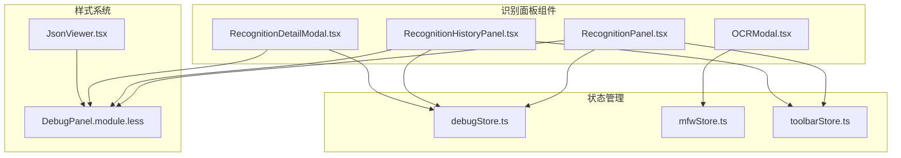
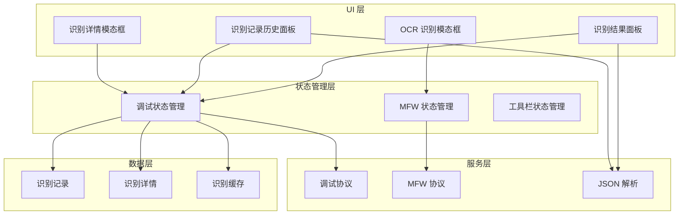
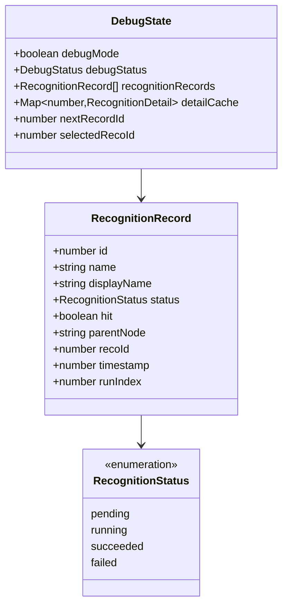
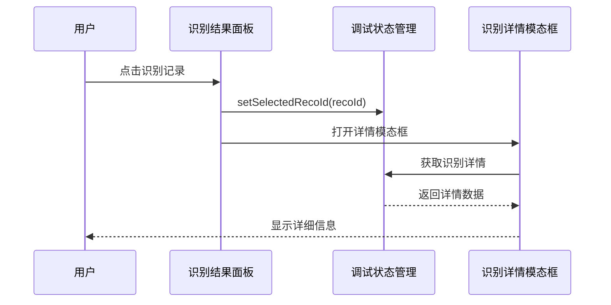
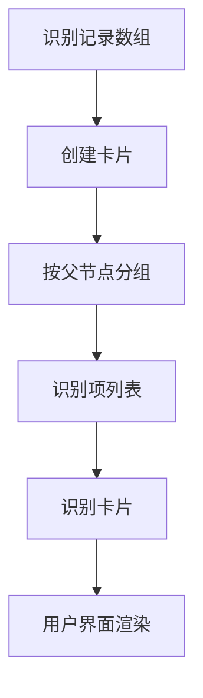
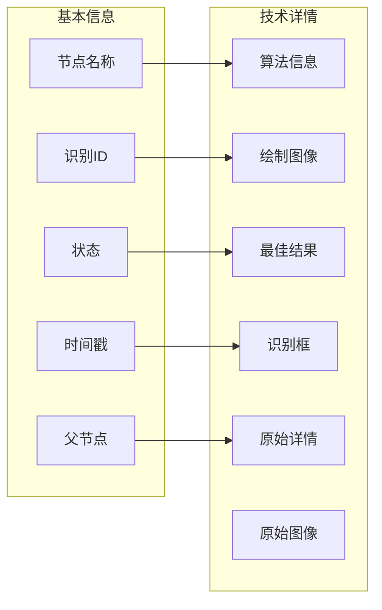
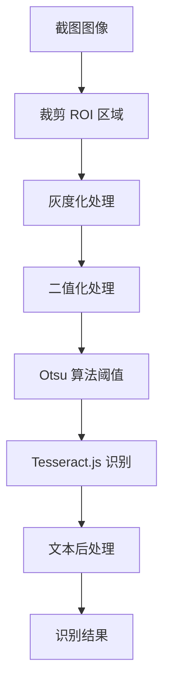
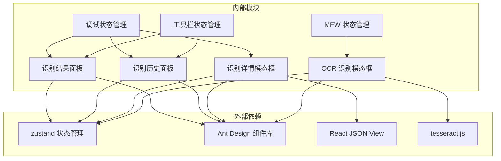

# 识别结果面板

<cite>
**本文档引用的文件**
- [RecognitionPanel.tsx](file://src/components/panels/main/RecognitionPanel.tsx)
- [RecognitionHistoryPanel.tsx](file://src/components/panels/main/RecognitionHistoryPanel.tsx)
- [RecognitionDetailModal.tsx](file://src/components/panels/tools/RecognitionDetailModal.tsx)
- [OCRModal.tsx](file://src/components/modals/OCRModal.tsx)
- [debugStore.ts](file://src/stores/debugStore.ts)
- [mfwStore.ts](file://src/stores/mfwStore.ts)
- [toolbarStore.ts](file://src/stores/toolbarStore.ts)
- [DebugPanel.module.less](file://src/styles/DebugPanel.module.less)
- [JsonViewer.tsx](file://src/components/JsonViewer.tsx)
</cite>

## 目录
1. [简介](#简介)
2. [项目结构](#项目结构)
3. [核心组件](#核心组件)
4. [架构概览](#架构概览)
5. [详细组件分析](#详细组件分析)
6. [依赖关系分析](#依赖关系分析)
7. [性能考量](#性能考量)
8. [故障排除指南](#故障排除指南)
9. [结论](#结论)

## 简介

识别结果面板是 MaaPipelineEditor 中用于展示和管理识别任务执行结果的核心组件。该面板提供了两种不同的展示方式：独立的识别结果面板和识别记录历史面板，同时集成了 OCR 识别功能和详细的识别结果查看器。

该系统支持实时监控识别任务的状态变化，提供丰富的可视化反馈，并允许用户深入查看每个识别任务的详细信息，包括最佳结果、识别框、绘制图像等。

## 项目结构

识别结果面板相关的文件组织结构如下：

**图表来源**
- [RecognitionPanel.tsx](file://src/components/panels/main/RecognitionPanel.tsx#L1-L331)
- [RecognitionHistoryPanel.tsx](file://src/components/panels/main/RecognitionHistoryPanel.tsx#L1-L377)
- [RecognitionDetailModal.tsx](file://src/components/panels/tools/RecognitionDetailModal.tsx#L1-L261)
- [OCRModal.tsx](file://src/components/modals/OCRModal.tsx#L1-L884)

## 核心组件

识别结果面板系统由以下核心组件构成：

### 1. 识别结果面板 (RecognitionPanel)
- **功能**：独立的识别结果展示面板，采用平铺列表形式
- **特点**：支持分页、排序、详情查看等功能
- **数据结构**：RecognitionRecord 数组

### 2. 识别记录历史面板 (RecognitionHistoryPanel)
- **功能**：在调试工具栏下方显示的识别记录面板
- **特点**：卡片式布局，按父节点分组显示
- **数据结构**：识别记录卡片数组

### 3. 识别详情模态框 (RecognitionDetailModal)
- **功能**：显示单个识别任务的详细信息
- **特点**：模态框形式，支持多种详情内容展示
- **内容**：基本信息、算法信息、绘制图像、最佳结果、识别框、原始详情等

### 4. OCR 识别模态框 (OCRModal)
- **功能**：提供 OCR 文字识别功能
- **特点**：支持前端和原生两种识别模式
- **功能**：ROI 区域选择、图像预处理、识别结果显示

**章节来源**
- [RecognitionPanel.tsx](file://src/components/panels/main/RecognitionPanel.tsx#L1-L331)
- [RecognitionHistoryPanel.tsx](file://src/components/panels/main/RecognitionHistoryPanel.tsx#L1-L377)
- [RecognitionDetailModal.tsx](file://src/components/panels/tools/RecognitionDetailModal.tsx#L1-L261)
- [OCRModal.tsx](file://src/components/modals/OCRModal.tsx#L1-L884)

## 架构概览

识别结果面板采用分层架构设计，实现了清晰的关注点分离：

**图表来源**
- [debugStore.ts](file://src/stores/debugStore.ts#L1-L724)
- [mfwStore.ts](file://src/stores/mfwStore.ts#L1-L147)
- [toolbarStore.ts](file://src/stores/toolbarStore.ts#L1-L141)

## 详细组件分析

### 识别结果面板 (RecognitionPanel)

识别结果面板是系统的主要交互界面，提供了丰富的功能：

#### 数据结构设计

**图表来源**
- [debugStore.ts](file://src/stores/debugStore.ts#L34-L91)

#### 核心功能实现

1. **状态管理**：通过 zustand 状态管理库实现响应式状态更新
2. **分页显示**：支持每页 30 条记录的分页显示
3. **排序功能**：支持正序和倒序显示
4. **详情查看**：点击查看详情按钮弹出模态框
5. **清空功能**：一键清空所有识别记录

#### 用户交互流程

**图表来源**
- [RecognitionPanel.tsx](file://src/components/panels/main/RecognitionPanel.tsx#L169-L182)
- [RecognitionDetailModal.tsx](file://src/components/panels/tools/RecognitionDetailModal.tsx#L22-L32)

**章节来源**
- [RecognitionPanel.tsx](file://src/components/panels/main/RecognitionPanel.tsx#L133-L331)

### 识别记录历史面板 (RecognitionHistoryPanel)

识别记录历史面板提供了另一种展示方式：

#### 卡片式布局设计

**图表来源**
- [RecognitionHistoryPanel.tsx](file://src/components/panels/main/RecognitionHistoryPanel.tsx#L194-L233)

#### 主要特性

1. **卡片分组**：按父节点名称自动分组
2. **时间戳显示**：显示每轮识别的时间信息
3. **分页功能**：每页显示 10 个卡片
4. **工具栏控制**：提供清空和关闭功能

**章节来源**
- [RecognitionHistoryPanel.tsx](file://src/components/panels/main/RecognitionHistoryPanel.tsx#L173-L377)

### 识别详情模态框 (RecognitionDetailModal)

识别详情模态框提供了最详细的识别信息展示：

#### 详情内容结构

**图表来源**
- [RecognitionDetailModal.tsx](file://src/components/panels/tools/RecognitionDetailModal.tsx#L85-L246)

#### 支持的详情类型

1. **基本信息**：节点名称、识别ID、状态、时间戳等
2. **算法信息**：识别算法类型
3. **视觉内容**：绘制图像、原始图像
4. **结构化数据**：最佳结果、原始详情（JSON 格式）
5. **几何信息**：识别框坐标 (x, y, w, h)

**章节来源**
- [RecognitionDetailModal.tsx](file://src/components/panels/tools/RecognitionDetailModal.tsx#L1-L261)

### OCR 识别模态框 (OCRModal)

OCR 识别模态框提供了强大的文字识别功能：

#### 识别模式对比

| 特性 | 前端 OCR (Tesseract.js) | 原生 OCR (MaaFramework) |
|------|----------------------|----------------------|
| 识别速度 | 快速 | 较慢 |
| 识别准确性 | 高 | 更高 |
| 模型大小 | 较小 | 较大 |
| 首次加载 | 需要加载模型 | 无需加载 |
| 窗口更新 | 不受影响 | 可能受影响 |

#### 图像处理流程

**图表来源**
- [OCRModal.tsx](file://src/components/modals/OCRModal.tsx#L94-L254)

**章节来源**
- [OCRModal.tsx](file://src/components/modals/OCRModal.tsx#L1-L884)

## 依赖关系分析

识别结果面板系统的依赖关系如下：

**图表来源**
- [RecognitionPanel.tsx](file://src/components/panels/main/RecognitionPanel.tsx#L1-L41)
- [RecognitionHistoryPanel.tsx](file://src/components/panels/main/RecognitionHistoryPanel.tsx#L1-L23)
- [RecognitionDetailModal.tsx](file://src/components/panels/tools/RecognitionDetailModal.tsx#L1-L10)

### 状态管理依赖

系统采用分层状态管理模式：

1. **调试状态管理**：集中管理识别相关的所有状态
2. **MFW 状态管理**：管理设备连接和控制器状态
3. **工具栏状态管理**：管理面板可见性和布局状态

**章节来源**
- [debugStore.ts](file://src/stores/debugStore.ts#L168-L724)
- [mfwStore.ts](file://src/stores/mfwStore.ts#L91-L147)
- [toolbarStore.ts](file://src/stores/toolbarStore.ts#L89-L141)

## 性能考量

识别结果面板系统在设计时充分考虑了性能优化：

### 1. 状态管理优化
- 使用 zustand 替代 Redux，减少不必要的状态更新
- 采用 useMemo 和 useCallback 优化组件渲染
- 分离关注点，避免状态污染

### 2. 数据结构优化
- RecognitionRecord 使用扁平化结构，便于快速查找
- detailCache 使用 Map 结构，提供 O(1) 查找性能
- 分页机制避免一次性渲染大量数据

### 3. 渲染性能优化
- 使用虚拟滚动处理大量数据
- 按需加载识别详情，避免阻塞主界面
- 图像资源使用懒加载策略

### 4. 内存管理
- 及时清理过期的识别记录
- 合理的缓存策略，避免内存泄漏
- 组件卸载时清理事件监听器

## 故障排除指南

### 常见问题及解决方案

#### 1. 识别结果不显示
**症状**：识别面板为空白
**可能原因**：
- 调试模式未启用
- 识别记录为空
- 状态管理异常

**解决方法**：
1. 检查调试模式状态
2. 确认识别记录是否正确生成
3. 查看控制台错误信息

#### 2. 识别详情无法加载
**症状**：点击查看详情无响应
**可能原因**：
- 识别ID无效
- 详情缓存为空
- 网络请求失败

**解决方法**：
1. 验证识别ID的有效性
2. 检查 detailCache 状态
3. 重新触发识别任务

#### 3. OCR 识别失败
**症状**：OCR 模态框显示错误
**可能原因**：
- 模型加载失败
- 截图数据异常
- 权限不足

**解决方法**：
1. 检查网络连接
2. 验证截图权限
3. 重新加载模型

**章节来源**
- [RecognitionPanel.tsx](file://src/components/panels/main/RecognitionPanel.tsx#L274-L284)
- [RecognitionDetailModal.tsx](file://src/components/panels/tools/RecognitionDetailModal.tsx#L47-L60)
- [OCRModal.tsx](file://src/components/modals/OCRModal.tsx#L292-L323)

## 结论

识别结果面板系统是一个功能完整、架构清晰的识别任务管理界面。系统通过合理的组件划分、状态管理和用户交互设计，为用户提供了直观、高效的识别结果查看和管理体验。

### 主要优势

1. **多维度展示**：提供列表和卡片两种展示方式
2. **详细信息**：支持丰富的识别详情查看
3. **实时更新**：基于状态管理的实时响应
4. **用户友好**：直观的操作界面和交互设计
5. **性能优化**：合理的数据结构和渲染策略

### 技术亮点

1. **状态管理**：采用现代状态管理方案，确保数据一致性
2. **组件设计**：模块化组件设计，便于维护和扩展
3. **用户体验**：丰富的交互反馈和视觉效果
4. **性能优化**：多层面的性能优化策略

该系统为 MaaPipelineEditor 提供了强大的识别任务管理能力，是整个应用的重要组成部分。