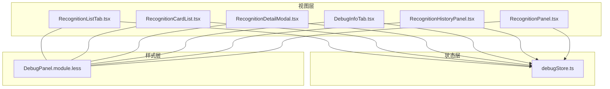
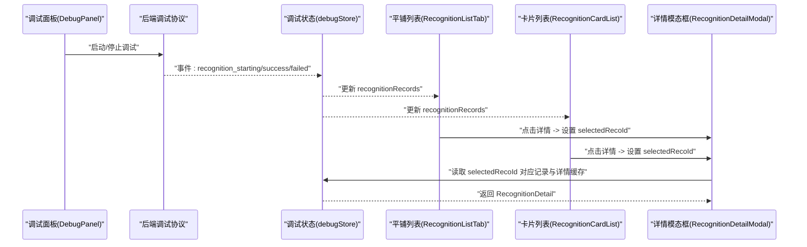
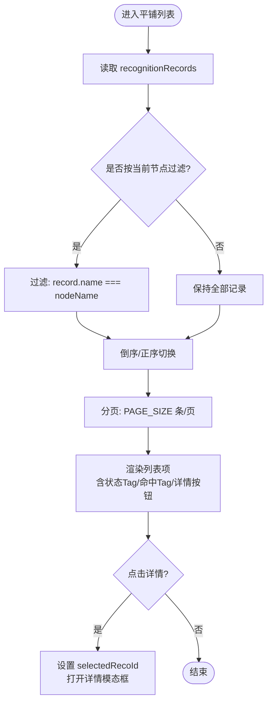
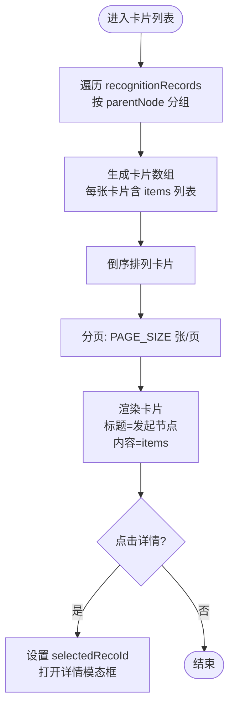
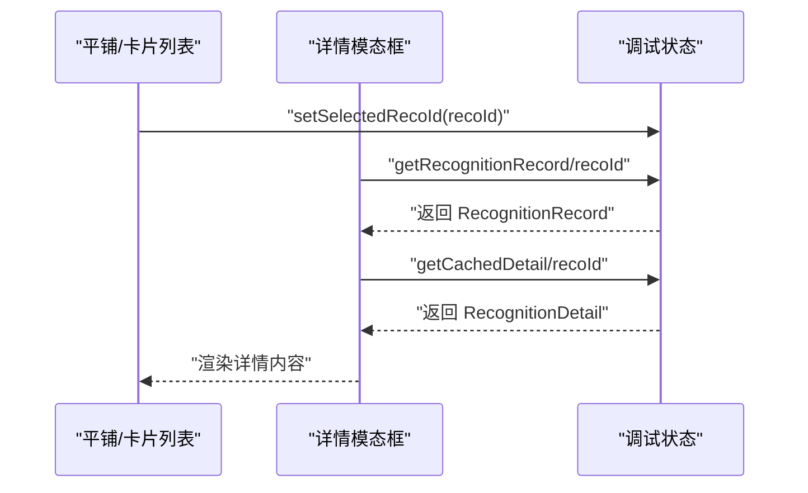
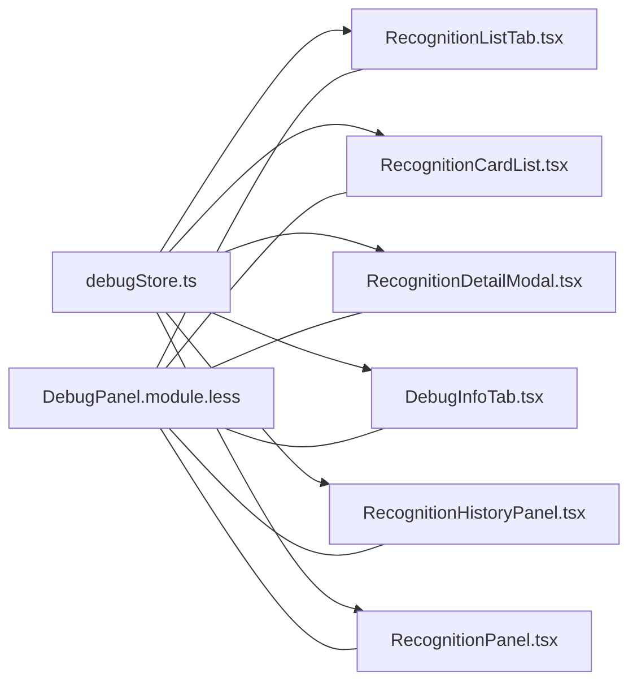

# 识别记录标签页

<cite>
**本文引用的文件**
- [RecognitionListTab.tsx](file://src/components/panels/tools/RecognitionListTab.tsx)
- [RecognitionCardList.tsx](file://src/components/panels/tools/RecognitionCardList.tsx)
- [RecognitionDetailModal.tsx](file://src/components/panels/tools/RecognitionDetailModal.tsx)
- [DebugInfoTab.tsx](file://src/components/panels/tools/DebugInfoTab.tsx)
- [RecognitionHistoryPanel.tsx](file://src/components/panels/main/RecognitionHistoryPanel.tsx)
- [RecognitionPanel.tsx](file://src/components/panels/main/RecognitionPanel.tsx)
- [debugStore.ts](file://src/stores/debugStore.ts)
- [DebugPanel.tsx](file://src/components/panels/tools/DebugPanel.tsx)
- [DebugPanel.module.less](file://src/styles/DebugPanel.module.less)
</cite>

## 目录
1. [简介](#简介)
2. [项目结构](#项目结构)
3. [核心组件](#核心组件)
4. [架构总览](#架构总览)
5. [详细组件分析](#详细组件分析)
6. [依赖关系分析](#依赖关系分析)
7. [性能考量](#性能考量)
8. [故障排查指南](#故障排查指南)
9. [结论](#结论)

## 简介
本节聚焦“识别记录标签页”的功能与实现，涵盖两类主要视图：
- 平铺列表视图：按时间顺序展示所有识别记录，支持清空、倒序/正序切换、分页与“查看详情”。
- 卡片分组视图：按“发起识别的节点”分组，每组卡片展示该轮 next/on_error 列表中的节点识别情况。

二者均由调试状态管理 store 驱动，配合详情模态框展示识别算法、最佳结果、绘制图像、原始详情与原始图像等信息。

## 项目结构
围绕“识别记录标签页”，涉及以下关键文件：
- 视图组件：平铺列表、卡片列表、详情模态框、调试信息标签页、独立面板
- 状态管理：调试 store（识别记录、执行历史、当前节点等）
- 样式：统一的调试面板样式模块

图表来源
- [RecognitionListTab.tsx](file://src/components/panels/tools/RecognitionListTab.tsx#L1-L291)
- [RecognitionCardList.tsx](file://src/components/panels/tools/RecognitionCardList.tsx#L1-L344)
- [RecognitionDetailModal.tsx](file://src/components/panels/tools/RecognitionDetailModal.tsx#L1-L261)
- [DebugInfoTab.tsx](file://src/components/panels/tools/DebugInfoTab.tsx#L1-L375)
- [RecognitionHistoryPanel.tsx](file://src/components/panels/main/RecognitionHistoryPanel.tsx#L1-L377)
- [RecognitionPanel.tsx](file://src/components/panels/main/RecognitionPanel.tsx#L1-L331)
- [debugStore.ts](file://src/stores/debugStore.ts#L1-L724)
- [DebugPanel.module.less](file://src/styles/DebugPanel.module.less#L260-L761)

章节来源
- [RecognitionListTab.tsx](file://src/components/panels/tools/RecognitionListTab.tsx#L1-L291)
- [RecognitionCardList.tsx](file://src/components/panels/tools/RecognitionCardList.tsx#L1-L344)
- [RecognitionDetailModal.tsx](file://src/components/panels/tools/RecognitionDetailModal.tsx#L1-L261)
- [DebugInfoTab.tsx](file://src/components/panels/tools/DebugInfoTab.tsx#L1-L375)
- [RecognitionHistoryPanel.tsx](file://src/components/panels/main/RecognitionHistoryPanel.tsx#L1-L377)
- [RecognitionPanel.tsx](file://src/components/panels/main/RecognitionPanel.tsx#L1-L331)
- [debugStore.ts](file://src/stores/debugStore.ts#L1-L724)
- [DebugPanel.module.less](file://src/styles/DebugPanel.module.less#L260-L761)

## 核心组件
- 平铺列表视图（RecognitionListTab）
  - 作用：按时间顺序展示识别记录，支持清空、倒序/正序、分页、查看详情。
  - 关键交互：点击“详情”按钮打开识别详情模态框；可按当前选中节点过滤仅显示“该节点被识别”的记录。
- 卡片分组视图（RecognitionCardList）
  - 作用：按“发起识别的节点”分组，每组卡片展示该轮 next/on_error 列表中的节点识别情况。
  - 关键交互：点击卡片项“详情”按钮打开识别详情模态框；支持清空、分页。
- 识别详情模态框（RecognitionDetailModal）
  - 作用：展示识别记录基本信息与缓存的识别详情（算法、最佳结果、绘制图像、识别框、原始详情、原始图像）。
- 调试信息标签页（DebugInfoTab）
  - 作用：在节点级调试信息页中，展示“该节点被识别”的记录列表，并提供“详情”入口。
- 独立面板（RecognitionHistoryPanel / RecognitionPanel）
  - 作用：作为独立面板显示全局识别记录（卡片或平铺），并通过调试工具栏按钮切换显示/隐藏。

章节来源
- [RecognitionListTab.tsx](file://src/components/panels/tools/RecognitionListTab.tsx#L1-L291)
- [RecognitionCardList.tsx](file://src/components/panels/tools/RecognitionCardList.tsx#L1-L344)
- [RecognitionDetailModal.tsx](file://src/components/panels/tools/RecognitionDetailModal.tsx#L1-L261)
- [DebugInfoTab.tsx](file://src/components/panels/tools/DebugInfoTab.tsx#L1-L375)
- [RecognitionHistoryPanel.tsx](file://src/components/panels/main/RecognitionHistoryPanel.tsx#L1-L377)
- [RecognitionPanel.tsx](file://src/components/panels/main/RecognitionPanel.tsx#L1-L331)

## 架构总览
识别记录标签页的数据流与控制流如下：

图表来源
- [DebugPanel.tsx](file://src/components/panels/tools/DebugPanel.tsx#L229-L327)
- [debugStore.ts](file://src/stores/debugStore.ts#L428-L542)
- [RecognitionListTab.tsx](file://src/components/panels/tools/RecognitionListTab.tsx#L130-L291)
- [RecognitionCardList.tsx](file://src/components/panels/tools/RecognitionCardList.tsx#L172-L344)
- [RecognitionDetailModal.tsx](file://src/components/panels/tools/RecognitionDetailModal.tsx#L1-L261)

## 详细组件分析

### 平铺列表视图（RecognitionListTab）
- 数据来源：从调试 store 读取 recognitionRecords，支持按当前选中节点过滤（仅显示“该节点被识别”的记录）。
- 排序与分页：默认倒序（最新在前），支持切换正序/倒序；每页显示固定数量记录。
- 交互细节：
  - “详情”按钮仅在存在有效 recoId 时显示；
  - 点击“详情”设置 selectedRecoId 并打开识别详情模态框；
  - 提供“清空”按钮，调用 store 清空识别记录。

图表来源
- [RecognitionListTab.tsx](file://src/components/panels/tools/RecognitionListTab.tsx#L130-L291)
- [debugStore.ts](file://src/stores/debugStore.ts#L695-L724)

章节来源
- [RecognitionListTab.tsx](file://src/components/panels/tools/RecognitionListTab.tsx#L1-L291)
- [debugStore.ts](file://src/stores/debugStore.ts#L695-L724)

### 卡片分组视图（RecognitionCardList）
- 数据来源：从调试 store 读取 recognitionRecords，按“发起识别的节点”分组形成卡片列表。
- 排序与分页：卡片整体倒序显示（最新轮次在前），每页固定数量卡片。
- 交互细节：
  - 每张卡片标题为“当前运行的节点”，内容为该轮 next/on_error 列表中的节点；
  - 卡片项包含状态、命中标记与“详情”按钮；
  - 提供“清空”按钮，调用 store 清空识别记录。

图表来源
- [RecognitionCardList.tsx](file://src/components/panels/tools/RecognitionCardList.tsx#L172-L344)
- [debugStore.ts](file://src/stores/debugStore.ts#L695-L724)

章节来源
- [RecognitionCardList.tsx](file://src/components/panels/tools/RecognitionCardList.tsx#L1-L344)
- [debugStore.ts](file://src/stores/debugStore.ts#L695-L724)

### 识别详情模态框（RecognitionDetailModal）
- 数据来源：读取 selectedRecoId 对应的 RecognitionRecord 与详情缓存（RecognitionDetail）。
- 展示内容：
  - 基本信息：节点名称、识别ID、状态、执行次数、时间戳、父节点；
  - 算法信息：算法类型；
  - 最佳结果：对象或字符串形式展示；
  - 绘制图像：多图展示；
  - 识别框：四元组坐标；
  - 原始详情与原始图像：JSON 与图像展示。
- 加载策略：详情在事件到达时缓存，打开模态框时按需读取。

图表来源
- [RecognitionDetailModal.tsx](file://src/components/panels/tools/RecognitionDetailModal.tsx#L1-L261)
- [debugStore.ts](file://src/stores/debugStore.ts#L709-L724)

章节来源
- [RecognitionDetailModal.tsx](file://src/components/panels/tools/RecognitionDetailModal.tsx#L1-L261)
- [debugStore.ts](file://src/stores/debugStore.ts#L709-L724)

### 调试信息标签页（DebugInfoTab）
- 数据来源：executionHistory 与 recognitionRecords。
- 功能要点：
  - 展示当前选中节点的执行历史时间轴；
  - 展示“该节点被识别”的识别记录列表，并提供“详情”入口；
  - 提供会话概览（状态、Session ID、执行次数、执行时间）。

章节来源
- [DebugInfoTab.tsx](file://src/components/panels/tools/DebugInfoTab.tsx#L1-L375)
- [debugStore.ts](file://src/stores/debugStore.ts#L314-L427)

### 独立面板（RecognitionHistoryPanel / RecognitionPanel）
- RecognitionHistoryPanel
  - 作为悬浮独立面板显示全局识别记录卡片列表；
  - 通过调试工具栏按钮切换显示/隐藏；
  - 支持清空与分页。
- RecognitionPanel
  - 作为右侧固定面板显示全局识别记录平铺列表；
  - 支持清空、倒序/正序、分页与“查看详情”。

章节来源
- [RecognitionHistoryPanel.tsx](file://src/components/panels/main/RecognitionHistoryPanel.tsx#L1-L377)
- [RecognitionPanel.tsx](file://src/components/panels/main/RecognitionPanel.tsx#L1-L331)
- [DebugPanel.tsx](file://src/components/panels/tools/DebugPanel.tsx#L316-L327)

## 依赖关系分析
- 组件依赖
  - 平铺列表与卡片列表均依赖调试 store 的 recognitionRecords 与 selectedRecoId；
  - 详情模态框依赖 selectedRecoId 与详情缓存；
  - 调试信息标签页依赖 executionHistory 与 recognitionRecords；
  - 独立面板依赖调试 store 与工具栏 store 控制可见性。
- 样式依赖
  - 所有识别相关视图共享 DebugPanel.module.less，确保一致的视觉与交互体验。

图表来源
- [debugStore.ts](file://src/stores/debugStore.ts#L1-L724)
- [RecognitionListTab.tsx](file://src/components/panels/tools/RecognitionListTab.tsx#L1-L291)
- [RecognitionCardList.tsx](file://src/components/panels/tools/RecognitionCardList.tsx#L1-L344)
- [RecognitionDetailModal.tsx](file://src/components/panels/tools/RecognitionDetailModal.tsx#L1-L261)
- [DebugInfoTab.tsx](file://src/components/panels/tools/DebugInfoTab.tsx#L1-L375)
- [RecognitionHistoryPanel.tsx](file://src/components/panels/main/RecognitionHistoryPanel.tsx#L1-L377)
- [RecognitionPanel.tsx](file://src/components/panels/main/RecognitionPanel.tsx#L1-L331)
- [DebugPanel.module.less](file://src/styles/DebugPanel.module.less#L260-L761)

章节来源
- [debugStore.ts](file://src/stores/debugStore.ts#L1-L724)
- [DebugPanel.module.less](file://src/styles/DebugPanel.module.less#L260-L761)

## 性能考量
- 列表渲染
  - 平铺列表与卡片列表均使用 useMemo 与分页，避免不必要的重渲染；
  - 列表项组件使用 memo 包装，减少子组件重复渲染。
- 数据访问
  - 详情数据通过 selectedRecoId 与缓存 Map 获取，避免重复拉取；
  - 详情内容按需渲染，仅在模态框打开时读取。
- 交互优化
  - 分页与排序切换为本地计算，避免频繁网络请求；
  - 清空操作一次性重置识别记录与缓存，保证状态一致性。

## 故障排查指南
- 无法看到识别记录
  - 确认已启动调试且后端事件已到达；检查调试状态与空闲状态描述文案。
  - 确认当前视图是否按节点过滤（仅显示“该节点被识别”的记录）。
- 详情为空
  - 确认事件中是否携带识别详情；详情会在事件到达时缓存；
  - 确认 selectedRecoId 是否正确设置。
- 面板不可见
  - 独立面板需通过调试工具栏按钮切换显示/隐藏；
  - 右侧固定面板受调试模式与右侧面板布局影响，注意面板偏移样式。

章节来源
- [RecognitionListTab.tsx](file://src/components/panels/tools/RecognitionListTab.tsx#L209-L223)
- [RecognitionCardList.tsx](file://src/components/panels/tools/RecognitionCardList.tsx#L272-L286)
- [RecognitionDetailModal.tsx](file://src/components/panels/tools/RecognitionDetailModal.tsx#L249-L258)
- [RecognitionHistoryPanel.tsx](file://src/components/panels/main/RecognitionHistoryPanel.tsx#L275-L278)
- [RecognitionPanel.tsx](file://src/components/panels/main/RecognitionPanel.tsx#L226-L229)

## 结论
“识别记录标签页”通过平铺列表与卡片分组两种视图，结合调试 store 的识别记录与详情缓存，为用户提供从全局到节点级的识别过程可视化与诊断能力。配合调试工具栏与独立面板，用户可在不同场景下高效定位识别问题并深入分析识别详情。