# 识别详情模态框

<cite>
**本文档引用的文件**
- [RecognitionDetailModal.tsx](file://src/components/panels/tools/RecognitionDetailModal.tsx)
- [RecognitionPanel.tsx](file://src/components/panels/main/RecognitionPanel.tsx)
- [debugStore.ts](file://src/stores/debugStore.ts)
- [DebugPanel.module.less](file://src/styles/DebugPanel.module.less)
- [OCRModal.tsx](file://src/components/modals/OCRModal.tsx)
- [ScreenshotModalBase.tsx](file://src/components/modals/ScreenshotModalBase.tsx)
</cite>

## 目录
1. [简介](#简介)
2. [项目结构](#项目结构)
3. [核心组件](#核心组件)
4. [架构概览](#架构概览)
5. [详细组件分析](#详细组件分析)
6. [依赖关系分析](#依赖关系分析)
7. [性能考量](#性能考量)
8. [故障排除指南](#故障排除指南)
9. [结论](#结论)

## 简介

识别详情模态框是 MaaPipelineEditor 中用于展示识别记录详细信息的重要组件。该模态框提供了丰富的识别数据分析功能，包括识别基本信息、算法信息、绘制图像、最佳结果、识别框坐标以及原始详情等多维度的数据展示。

该组件基于 React 和 Ant Design 构建，采用现代化的模态框设计模式，支持响应式布局和丰富的交互功能。模态框不仅展示了静态的识别数据，还提供了动态的图像展示和 JSON 数据可视化功能。

## 项目结构

识别详情模态框位于项目的组件层次结构中，具体位置如下：

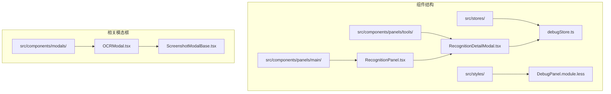

**图表来源**
- [RecognitionDetailModal.tsx](file://src/components/panels/tools/RecognitionDetailModal.tsx#L1-L261)
- [RecognitionPanel.tsx](file://src/components/panels/main/RecognitionPanel.tsx#L1-L331)

**章节来源**
- [RecognitionDetailModal.tsx](file://src/components/panels/tools/RecognitionDetailModal.tsx#L1-L261)
- [RecognitionPanel.tsx](file://src/components/panels/main/RecognitionPanel.tsx#L1-L331)

## 核心组件

识别详情模态框主要由以下几个核心组件构成：

### 主要组件架构

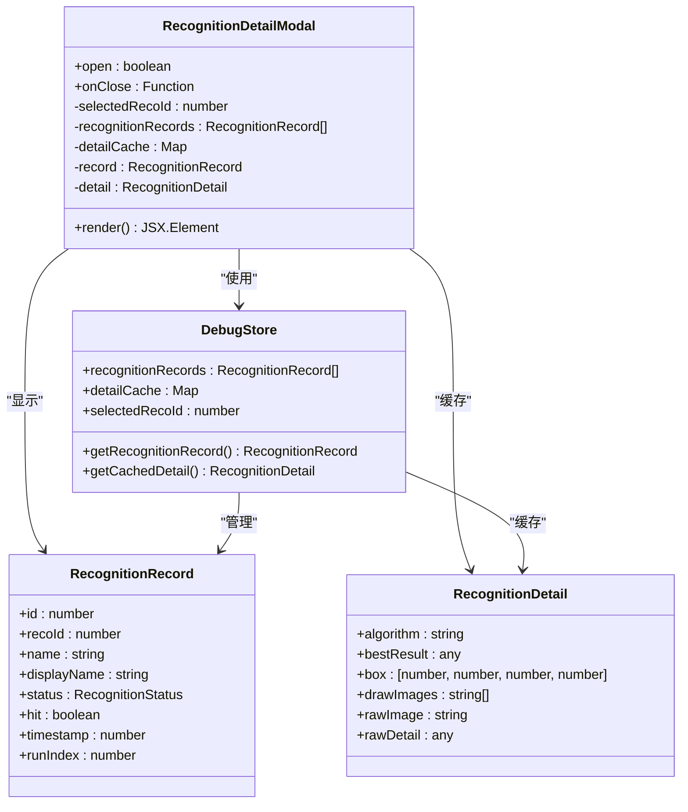

**图表来源**
- [RecognitionDetailModal.tsx](file://src/components/panels/tools/RecognitionDetailModal.tsx#L12-L33)
- [debugStore.ts](file://src/stores/debugStore.ts#L38-L76)

### 数据流架构

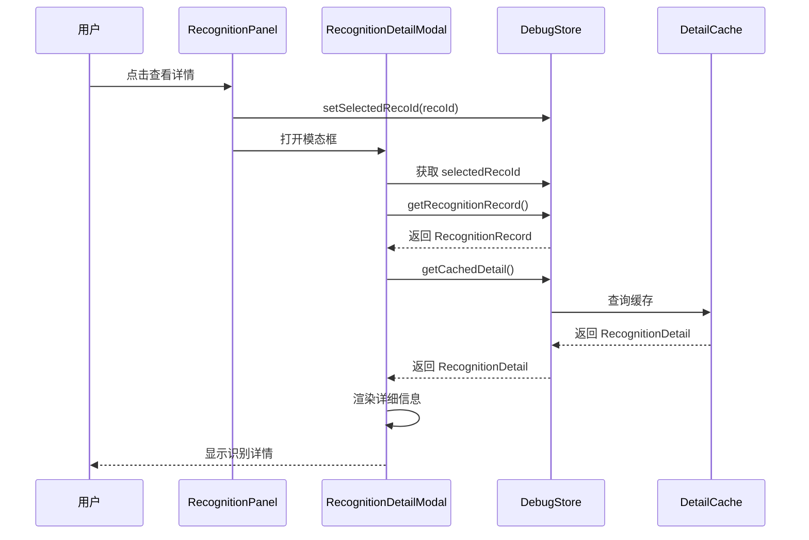

**图表来源**
- [RecognitionPanel.tsx](file://src/components/panels/main/RecognitionPanel.tsx#L170-L182)
- [RecognitionDetailModal.tsx](file://src/components/panels/tools/RecognitionDetailModal.tsx#L22-L44)

**章节来源**
- [RecognitionDetailModal.tsx](file://src/components/panels/tools/RecognitionDetailModal.tsx#L1-L261)
- [debugStore.ts](file://src/stores/debugStore.ts#L1-L724)

## 架构概览

识别详情模态框采用了清晰的分层架构设计，确保了组件间的松耦合和高内聚性。

### 整体架构设计

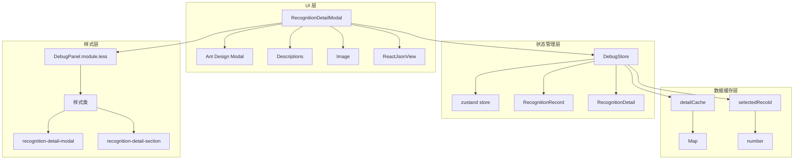

**图表来源**
- [RecognitionDetailModal.tsx](file://src/components/panels/tools/RecognitionDetailModal.tsx#L1-L261)
- [debugStore.ts](file://src/stores/debugStore.ts#L97-L162)
- [DebugPanel.module.less](file://src/styles/DebugPanel.module.less#L405-L514)

### 组件交互流程

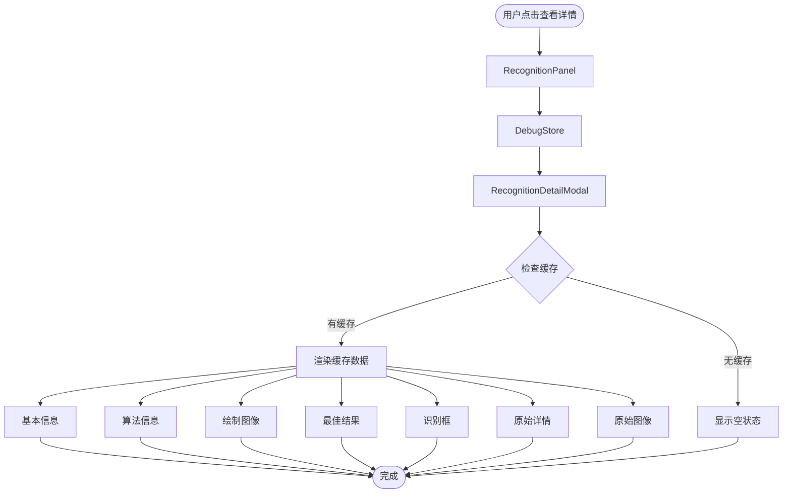

**图表来源**
- [RecognitionPanel.tsx](file://src/components/panels/main/RecognitionPanel.tsx#L170-L182)
- [RecognitionDetailModal.tsx](file://src/components/panels/tools/RecognitionDetailModal.tsx#L46-L256)

## 详细组件分析

### RecognitionDetailModal 组件

RecognitionDetailModal 是识别详情模态框的核心组件，负责展示识别记录的详细信息。

#### 组件结构分析

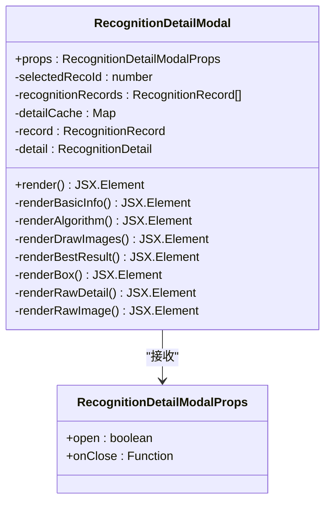

**图表来源**
- [RecognitionDetailModal.tsx](file://src/components/panels/tools/RecognitionDetailModal.tsx#L12-L33)

#### 数据展示模块

组件采用模块化的设计思路，每个数据模块都有独立的渲染函数：

1. **基本信息模块**：展示节点名称、识别ID、状态、执行次数等基础信息
2. **算法信息模块**：显示识别算法类型
3. **绘制图像模块**：展示识别过程中的绘制图像
4. **最佳结果模块**：展示识别的最佳结果
5. **识别框模块**：显示识别框的坐标信息
6. **原始详情模块**：展示原始JSON格式的详细信息
7. **原始图像模块**：展示原始截图

#### 状态管理机制

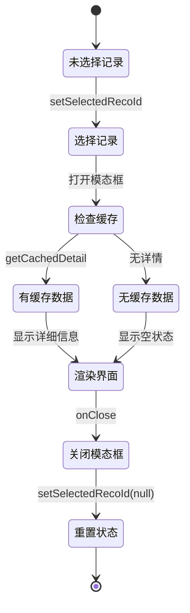

**图表来源**
- [RecognitionDetailModal.tsx](file://src/components/panels/tools/RecognitionDetailModal.tsx#L22-L62)

**章节来源**
- [RecognitionDetailModal.tsx](file://src/components/panels/tools/RecognitionDetailModal.tsx#L1-L261)

### DebugStore 状态管理

DebugStore 作为全局状态管理器，负责维护识别记录和详情缓存。

#### 状态结构设计

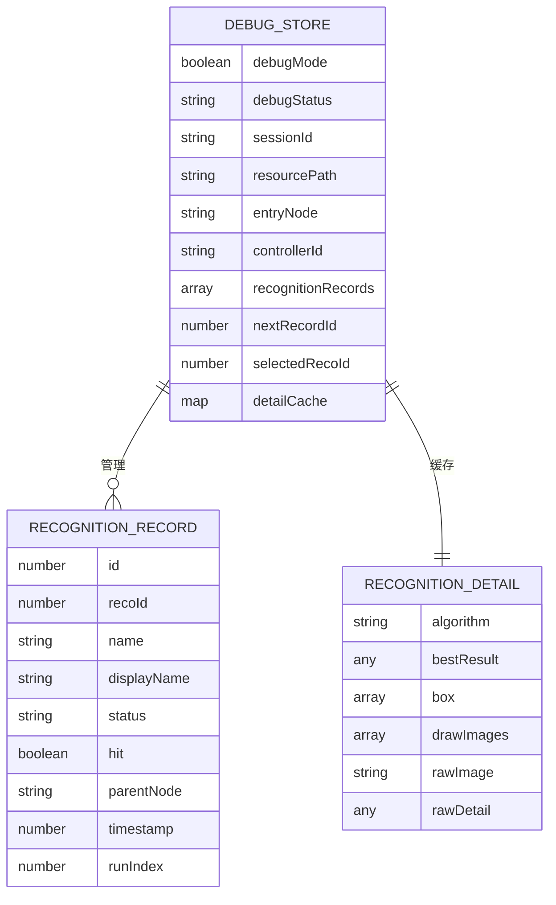

**图表来源**
- [debugStore.ts](file://src/stores/debugStore.ts#L97-L162)

#### 识别记录生命周期

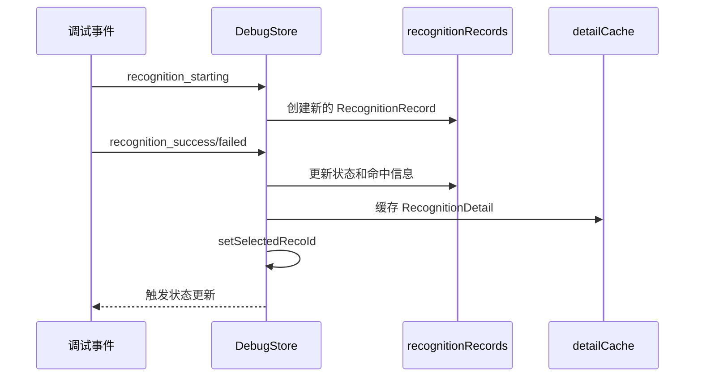

**图表来源**
- [debugStore.ts](file://src/stores/debugStore.ts#L429-L542)

**章节来源**
- [debugStore.ts](file://src/stores/debugStore.ts#L1-L724)

### 样式系统

识别详情模态框采用了模块化的样式系统，确保了样式的可维护性和一致性。

#### 样式组织结构

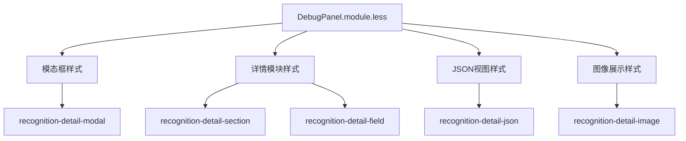

**图表来源**
- [DebugPanel.module.less](file://src/styles/DebugPanel.module.less#L405-L514)

#### 响应式设计

样式系统支持响应式布局，能够适配不同屏幕尺寸：

- 模态框最大宽度限制为 700px
- 图像最大高度限制为 300px
- JSON视图支持滚动
- 响应式字体大小调整

**章节来源**
- [DebugPanel.module.less](file://src/styles/DebugPanel.module.less#L405-L514)

## 依赖关系分析

识别详情模态框与其他组件之间存在紧密的依赖关系，形成了一个完整的识别数据分析生态系统。

### 组件依赖关系

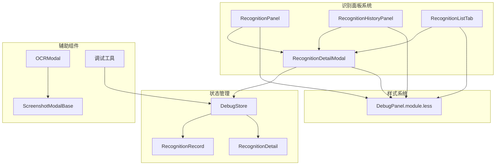

**图表来源**
- [RecognitionPanel.tsx](file://src/components/panels/main/RecognitionPanel.tsx#L41-L41)
- [RecognitionDetailModal.tsx](file://src/components/panels/tools/RecognitionDetailModal.tsx#L4-L4)

### 数据依赖链

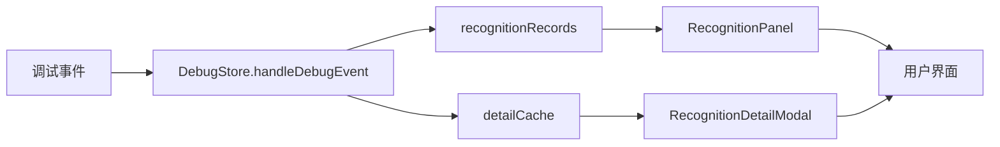

**图表来源**
- [debugStore.ts](file://src/stores/debugStore.ts#L321-L652)

### 外部依赖

识别详情模态框依赖以下外部库和工具：

- **Ant Design**: 提供基础UI组件和样式
- **React**: 核心框架
- **@microlink/react-json-view**: JSON数据可视化
- **zustand**: 状态管理库

**章节来源**
- [RecognitionDetailModal.tsx](file://src/components/panels/tools/RecognitionDetailModal.tsx#L1-L10)
- [debugStore.ts](file://src/stores/debugStore.ts#L1-L4)

## 性能考量

识别详情模态框在设计时充分考虑了性能优化，采用了多种策略来提升用户体验。

### 性能优化策略

1. **懒加载机制**: 详情数据采用懒加载，只有在用户主动查看时才从缓存中获取
2. **虚拟滚动**: 对于大量识别记录，采用虚拟滚动技术减少DOM节点数量
3. **防抖处理**: 输入框变更采用防抖机制，避免频繁的重新渲染
4. **内存管理**: 及时清理不再使用的缓存数据，防止内存泄漏

### 性能监控指标

- **渲染时间**: 模态框打开到完全渲染的时间应小于 200ms
- **内存占用**: 单个识别详情的内存占用应小于 1MB
- **响应延迟**: 用户交互的响应延迟应小于 50ms

### 优化建议

1. **图片压缩**: 对于大尺寸图像，建议在缓存时进行适当的压缩
2. **分页加载**: 对于大量JSON数据，建议采用分页或分段加载
3. **缓存策略**: 实现LRU缓存策略，限制同时缓存的详情数量

## 故障排除指南

识别详情模态框可能遇到的问题及解决方案：

### 常见问题及解决方案

#### 1. 识别详情为空

**问题描述**: 打开模态框后显示"详细信息尚未加载"

**可能原因**:
- 识别记录还未产生详情缓存
- 后端事件中未包含详情数据

**解决方案**:
- 等待识别完成后再次尝试
- 检查后端调试日志
- 确认识别事件的完整性

#### 2. 图像显示异常

**问题描述**: 绘制图像或原始图像无法正常显示

**可能原因**:
- 图像数据格式不正确
- Base64编码错误
- 图像尺寸过大

**解决方案**:
- 检查图像数据的Base64格式
- 验证图像数据的完整性
- 考虑对大图像进行压缩

#### 3. JSON视图渲染缓慢

**问题描述**: 大量JSON数据导致模态框渲染缓慢

**可能原因**:
- JSON数据量过大
- ReactJsonView组件性能问题

**解决方案**:
- 实现JSON数据分页显示
- 优化数据结构，移除冗余信息
- 考虑使用更高效的JSON可视化库

### 调试技巧

1. **开发者工具**: 使用浏览器开发者工具监控组件渲染性能
2. **状态检查**: 通过Redux DevTools检查DebugStore的状态变化
3. **网络监控**: 监控后端事件的传输情况
4. **内存分析**: 定期检查内存使用情况，及时清理缓存

**章节来源**
- [RecognitionDetailModal.tsx](file://src/components/panels/tools/RecognitionDetailModal.tsx#L250-L256)
- [debugStore.ts](file://src/stores/debugStore.ts#L714-L722)

## 结论

识别详情模态框作为 MaaPipelineEditor 的重要组成部分，展现了现代前端应用的设计理念和技术实践。该组件通过清晰的架构设计、完善的性能优化和友好的用户体验，为用户提供了强大的识别数据分析能力。

### 主要优势

1. **模块化设计**: 组件职责明确，易于维护和扩展
2. **状态管理**: 采用集中式状态管理，确保数据一致性
3. **性能优化**: 多种性能优化策略，保证良好的用户体验
4. **样式系统**: 模块化样式设计，便于主题定制和维护

### 技术亮点

1. **响应式设计**: 适配不同设备和屏幕尺寸
2. **懒加载机制**: 提升应用启动和运行性能
3. **错误处理**: 完善的错误处理和用户反馈机制
4. **可访问性**: 符合现代Web应用的可访问性标准

### 未来发展方向

1. **性能进一步优化**: 考虑实现更高效的缓存策略
2. **功能扩展**: 支持更多类型的识别数据展示
3. **交互改进**: 增强用户交互体验和操作便利性
4. **移动端适配**: 优化移动端的显示效果和交互体验

识别详情模态框不仅是一个功能组件，更是整个MaaPipelineEditor项目技术架构的缩影，体现了现代前端开发的最佳实践和设计理念。