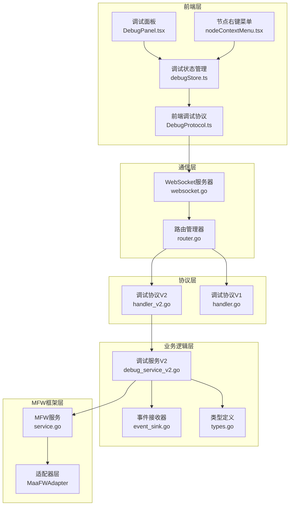
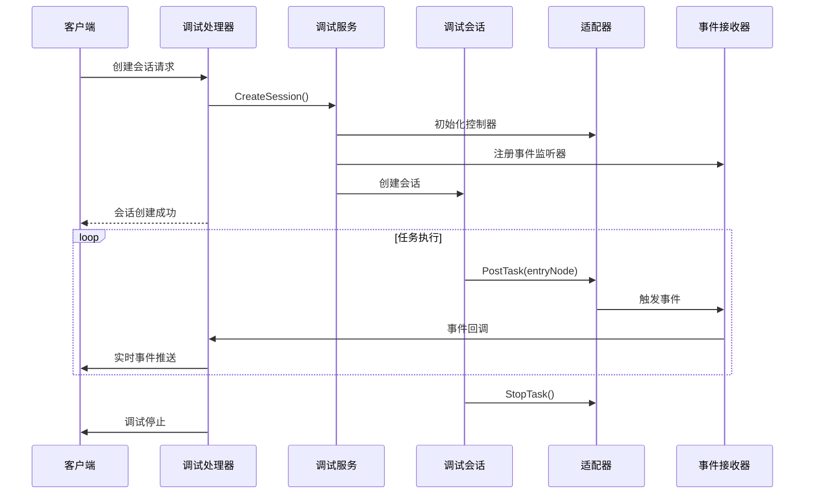
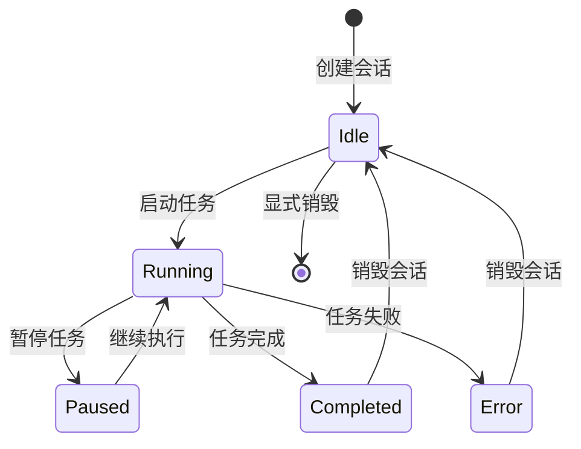
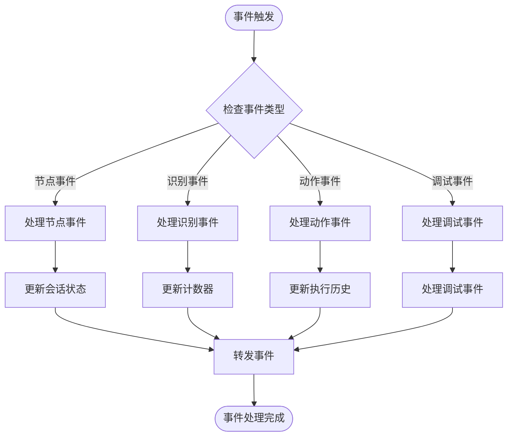
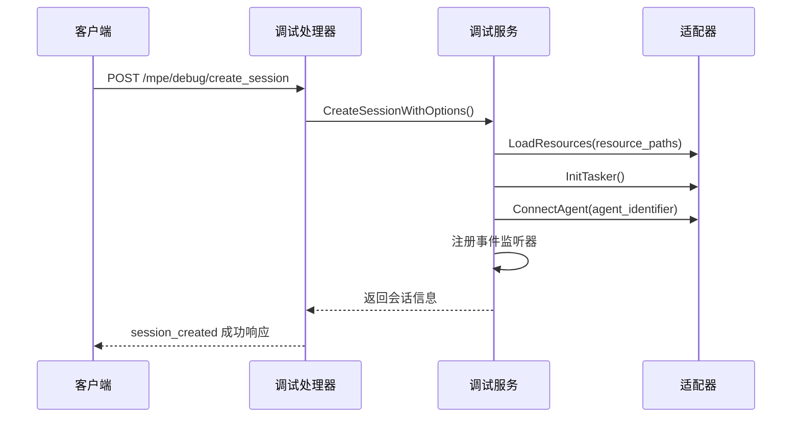
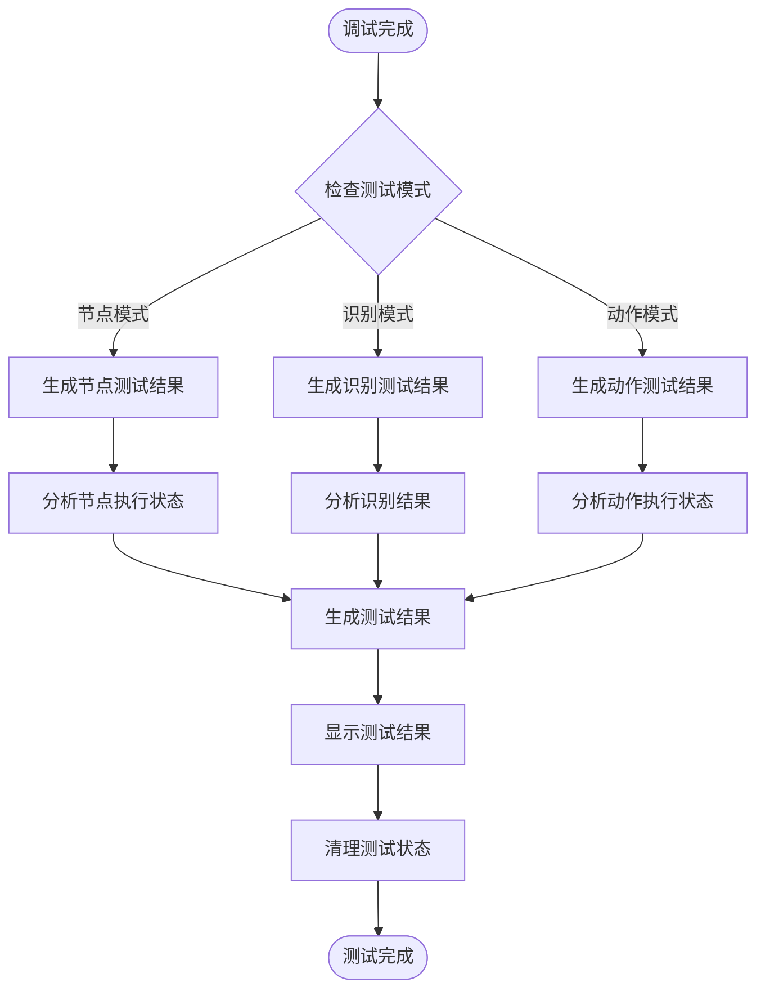
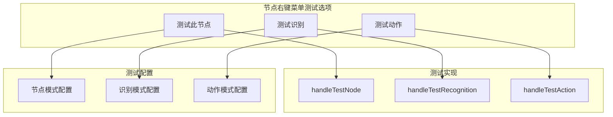
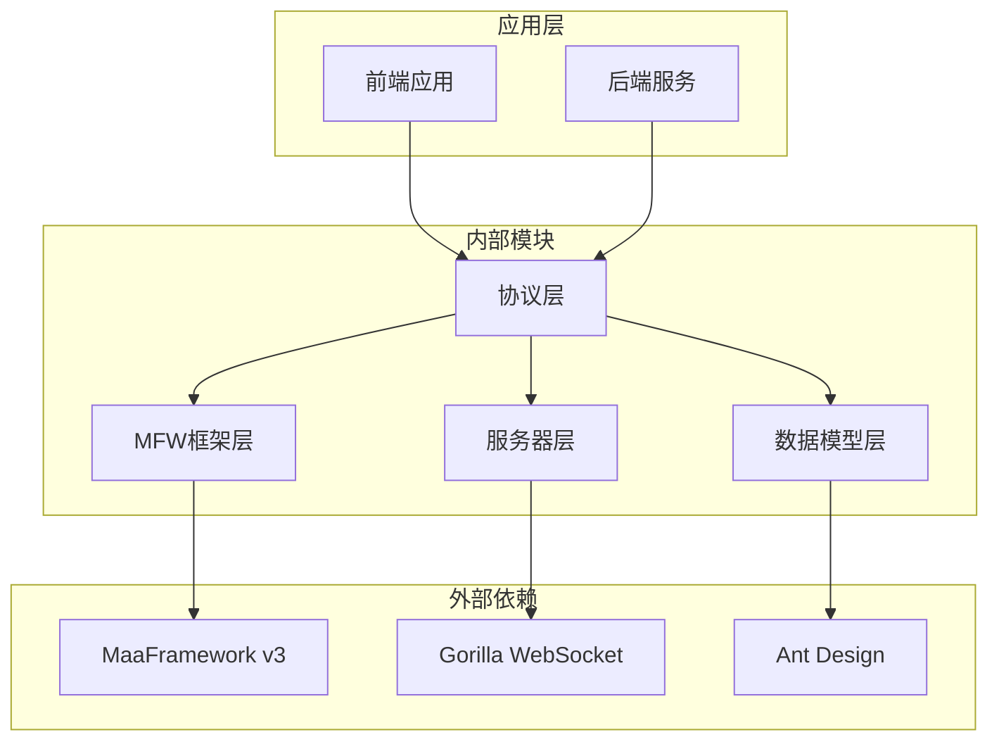

# 调试协议 V2

<cite>
**本文档引用的文件**
- [handler_v2.go](file://LocalBridge/internal/protocol/debug/handler_v2.go)
- [debug_service_v2.go](file://LocalBridge/internal/mfw/debug_service_v2.go)
- [event_sink.go](file://LocalBridge/internal/mfw/event_sink.go)
- [types.go](file://LocalBridge/internal/mfw/types.go)
- [service.go](file://LocalBridge/internal/mfw/service.go)
- [websocket.go](file://LocalBridge/internal/server/websocket.go)
- [message.go](file://LocalBridge/pkg/models/message.go)
- [DebugProtocol.ts](file://src/services/protocols/DebugProtocol.ts)
- [debugStore.ts](file://src/stores/debugStore.ts)
- [DebugPanel.tsx](file://src/components/panels/tools/DebugPanel.tsx)
- [nodeContextMenu.tsx](file://src/components/flow/nodes/nodeContextMenu.tsx)
</cite>

## 更新摘要
**变更内容**
- 新增单节点测试结果生成功能，支持节点、识别和动作三种测试模式
- 增强handleV2DebugCompleted方法，实现测试结果分析和展示
- 实现generateTestResult方法，提供统一的测试结果生成逻辑
- 新增测试模式状态管理和测试结果清理机制
- 扩展前端节点右键菜单，提供一键测试功能

## 目录
1. [简介](#简介)
2. [项目结构](#项目结构)
3. [核心组件](#核心组件)
4. [架构概览](#架构概览)
5. [详细组件分析](#详细组件分析)
6. [新增端点详解](#新增端点详解)
7. [单节点测试功能](#单节点测试功能)
8. [动态资源路径管理](#动态资源路径管理)
9. [依赖关系分析](#依赖关系分析)
10. [性能考虑](#性能考虑)
11. [故障排除指南](#故障排除指南)
12. [结论](#结论)

## 简介

调试协议 V2 是 MaaPipelineEditor 本地桥接服务中的核心调试功能模块，基于 MaaFramework v3 开发，提供了完整的流程级调试能力。该协议支持会话管理、实时事件监控、节点执行跟踪、识别过程可视化等功能，为开发者提供强大的调试工具。

**更新** 本次更新反映了协议层的重大扩展，包括新增的会话管理端点、调试控制端点、数据查询端点、单节点测试结果生成功能等，以及与前端DebugPanel.tsx和nodeContextMenu.tsx的动态资源路径管理功能的配合。

## 项目结构

调试协议 V2 的整体架构采用分层设计，主要包含以下层次：



**图表来源**
- [handler_v2.go](file://LocalBridge/internal/protocol/debug/handler_v2.go#L1-L50)
- [debug_service_v2.go](file://LocalBridge/internal/mfw/debug_service_v2.go#L1-L30)
- [websocket.go](file://LocalBridge/internal/server/websocket.go#L1-L50)

**章节来源**
- [handler_v2.go](file://LocalBridge/internal/protocol/debug/handler_v2.go#L1-L80)
- [debug_service_v2.go](file://LocalBridge/internal/mfw/debug_service_v2.go#L1-L80)
- [websocket.go](file://LocalBridge/internal/server/websocket.go#L1-L80)

## 核心组件

### 调试协议处理器 V2

调试协议处理器 V2 是整个调试系统的核心入口，负责处理所有调试相关的 WebSocket 消息请求。

```mermaid
classDiagram
class DebugHandlerV2 {
-service : Service
-debugService : DebugServiceV2
+GetRoutePrefix() []string
+Handle(msg, conn) *Message
+handleCreateSession(conn, msg)
+handleDestroySession(conn, msg)
+handleListSessions(conn, msg)
+handleGetSession(conn, msg)
+handleStart(conn, msg)
+handleRun(conn, msg)
+handleStop(conn, msg)
+handleGetNodeData(conn, msg)
+handleScreencap(conn, msg)
+handleV2DebugCompleted(conn, msg)
+sendResponse(conn, path, data)
+sendError(conn, errorMsg)
+createEventCallbackWithSessionID(conn, sessionIDHolder)
}
class DebugServiceV2 {
-service : Service
-sessions : map[string]*DebugSessionV2
+CreateSession(resourcePath, controllerID, eventCallback) *DebugSessionV2
+GetSession(sessionID) *DebugSessionV2
+DestroySession(sessionID) error
+ListSessions() []*DebugSessionV2
}
class DebugSessionV2 {
+SessionID : string
+ResourcePaths : []string
+EntryNode : string
+Status : DebugSessionStatus
+adapter : MaaFWAdapter
+eventCallback : DebugEventCallback
+RunTask(entryNode) error
+Stop() error
+GetStatus() DebugSessionStatus
+GetCurrentNode() string
+GetAdapter() *MaaFWAdapter
+GetNodeJSON(nodeName) (map[string]interface{}, bool)
}
DebugHandlerV2 --> DebugServiceV2 : "使用"
DebugServiceV2 --> DebugSessionV2 : "管理"
```

**图表来源**
- [handler_v2.go](file://LocalBridge/internal/protocol/debug/handler_v2.go#L16-L28)
- [debug_service_v2.go](file://LocalBridge/internal/mfw/debug_service_v2.go#L58-L71)
- [debug_service_v2.go](file://LocalBridge/internal/mfw/debug_service_v2.go#L29-L56)

### 事件系统

调试协议 V2 采用事件驱动架构，通过 SimpleContextSink 实现高效的事件收集和处理。



**图表来源**
- [handler_v2.go](file://LocalBridge/internal/protocol/debug/handler_v2.go#L85-L125)
- [debug_service_v2.go](file://LocalBridge/internal/mfw/debug_service_v2.go#L77-L143)
- [event_sink.go](file://LocalBridge/internal/mfw/event_sink.go#L108-L167)

**章节来源**
- [handler_v2.go](file://LocalBridge/internal/protocol/debug/handler_v2.go#L1-L491)
- [debug_service_v2.go](file://LocalBridge/internal/mfw/debug_service_v2.go#L1-L409)
- [event_sink.go](file://LocalBridge/internal/mfw/event_sink.go#L1-L519)

## 架构概览

调试协议 V2 采用现代化的微服务架构设计，具有以下特点：

### 1. 会话管理架构

每个调试会话都是独立的执行环境，包含完整的生命周期管理：

- **会话创建**: 初始化控制器、加载资源、设置事件监听器
- **会话运行**: 提交任务、监控执行状态、实时事件推送
- **会话销毁**: 清理资源、断开连接、释放内存

### 2. 事件处理机制

系统采用多级事件过滤机制，确保事件流的高效性和准确性：

- **节点级事件**: 节点开始、成功、失败
- **识别级事件**: 识别开始、成功、失败
- **动作级事件**: 动作开始、成功、失败
- **任务级事件**: 任务开始、成功、失败、错误

### 3. 状态同步机制

前端和后端保持严格的状态同步，通过 WebSocket 实现实时双向通信。

**章节来源**
- [debug_service_v2.go](file://LocalBridge/internal/mfw/debug_service_v2.go#L77-L186)
- [event_sink.go](file://LocalBridge/internal/mfw/event_sink.go#L15-L52)

## 详细组件分析

### 会话管理系统

会话管理系统是调试协议 V2 的核心基础设施，负责管理所有调试会话的生命周期。

#### 会话状态管理



**图表来源**
- [debug_service_v2.go](file://LocalBridge/internal/mfw/debug_service_v2.go#L17-L27)
- [debug_service_v2.go](file://LocalBridge/internal/mfw/debug_service_v2.go#L192-L250)

#### 会话创建流程

会话创建过程涉及多个组件的协调工作：

1. **控制器验证**: 验证控制器实例的有效性
2. **资源加载**: 加载指定的资源文件
3. **适配器初始化**: 创建并配置 MaaFW 适配器
4. **事件监听器注册**: 设置事件回调函数
5. **会话持久化**: 存储会话信息以便后续管理

**章节来源**
- [debug_service_v2.go](file://LocalBridge/internal/mfw/debug_service_v2.go#L77-L143)

### 事件处理系统

事件处理系统采用观察者模式，通过 SimpleContextSink 实现高效的事件收集和分发。

#### 事件类型定义

系统支持多种事件类型，每种事件都有特定的数据结构：

| 事件类型 | 描述 | 数据字段 |
|---------|------|----------|
| node_starting | 节点开始执行 | node_name, node_id, task_id |
| node_succeeded | 节点执行成功 | node_name, node_id, task_id, latency |
| node_failed | 节点执行失败 | node_name, node_id, task_id, latency |
| reco_starting | 识别开始 | node_name, reco_id, task_id, detail |
| reco_succeeded | 识别成功 | node_name, reco_id, task_id, detail |
| reco_failed | 识别失败 | node_name, reco_id, task_id, detail |
| action_starting | 动作开始 | node_name, action_id, task_id |
| action_succeeded | 动作成功 | node_name, action_id, task_id |
| action_failed | 动作失败 | node_name, action_id, task_id |
| debug_completed | 调试完成 | timestamp |
| debug_error | 调试错误 | detail |

#### 事件处理流程



**图表来源**
- [event_sink.go](file://LocalBridge/internal/mfw/event_sink.go#L108-L167)
- [event_sink.go](file://LocalBridge/internal/mfw/event_sink.go#L169-L325)

**章节来源**
- [event_sink.go](file://LocalBridge/internal/mfw/event_sink.go#L1-L519)

### 前端集成

前端通过 DebugProtocol 类与后端进行通信，实现了完整的调试界面功能。

#### 前端状态管理

前端使用 Zustand 状态管理库，定义了完整的调试状态结构：

```mermaid
graph TB
subgraph "调试状态"
DS[debugStatus: idle/preparing/running/paused/completed]
SID[sessionId: string|null]
EP[executedNodes: Set<string>]
CN[currentNode: string|null]
EH[executionHistory: ExecutionRecord[]]
end
subgraph "识别状态"
RR[recognitionRecords: RecognitionRecord[]]
SR[selectedRecoId: number|null]
DC[detailCache: Map<number, RecognitionDetail>]
end
subgraph "配置状态"
RP[resourcePaths: string[]]
EN[entryNode: string]
CID[controllerId: string|null]
LL[logLevel: LogLevel]
end
subgraph "测试状态"
TM[testMode: TestMode]
TN[testNodeName: string|null]
TR[testResult: TestResult|null]
end
```

**图表来源**
- [debugStore.ts](file://src/stores/debugStore.ts#L97-L162)

#### 事件处理映射

前端将后端事件映射到对应的 UI 更新逻辑：

| 后端事件 | 前端处理 | UI 更新 |
|----------|----------|---------|
| node_starting | 更新执行状态 | 节点高亮显示 |
| node_succeeded | 更新执行历史 | 节点完成状态 |
| node_failed | 更新错误状态 | 节点失败状态 |
| reco_starting | 创建识别记录 | 识别卡片显示 |
| reco_succeeded | 更新识别结果 | 识别成功状态 |
| reco_failed | 更新识别结果 | 识别失败状态 |
| debug_completed | 生成测试结果 | 测试结果展示 |
| debug_error | 显示错误信息 | 错误提示 |

**章节来源**
- [DebugProtocol.ts](file://src/services/protocols/DebugProtocol.ts#L1-L695)
- [debugStore.ts](file://src/stores/debugStore.ts#L1-L724)

## 新增端点详解

### 会话管理端点

调试协议 V2 新增了完整的会话管理端点，支持对调试会话的全生命周期管理：

#### 1. 创建会话端点 (`/mpe/debug/create_session`)

支持多资源路径和Agent连接的会话创建：



**图表来源**
- [handler_v2.go](file://LocalBridge/internal/protocol/debug/handler_v2.go#L117-L136)
- [debug_service_v2.go](file://LocalBridge/internal/mfw/debug_service_v2.go#L98-L170)

#### 2. 销毁会话端点 (`/mpe/debug/destroy_session`)

优雅地销毁调试会话并清理资源：

#### 3. 列出会话端点 (`/mpe/debug/list_sessions`)

获取所有活动会话的列表信息：

#### 4. 获取会话端点 (`/mpe/debug/get_session`)

获取指定会话的详细状态信息。

### 调试控制端点

新增的调试控制端点提供了更精细的调试控制能力：

#### 1. 启动调试端点 (`/mpe/debug/start`)

自动创建会话并运行任务，支持pipeline override：

#### 2. 运行任务端点 (`/mpe/debug/run`)

在现有会话中运行指定入口节点的任务。

#### 3. 停止调试端点 (`/mpe/debug/stop`)

停止当前运行的调试任务。

### 数据查询端点

新增的数据查询端点提供了丰富的调试数据访问能力：

#### 1. 获取节点数据端点 (`/mpe/debug/get_node_data`)

获取指定节点的JSON数据结构。

#### 2. 截图端点 (`/mpe/debug/screencap`)

获取当前设备的屏幕截图，支持base64编码。

**章节来源**
- [handler_v2.go](file://LocalBridge/internal/protocol/debug/handler_v2.go#L48-L79)
- [handler_v2.go](file://LocalBridge/internal/protocol/debug/handler_v2.go#L85-L445)

## 单节点测试功能

### 测试模式概述

调试协议 V2 新增了单节点测试功能，允许开发者针对特定节点进行独立测试，支持三种测试模式：

- **节点模式 (node)**: 测试整个节点的执行流程
- **识别模式 (recognition)**: 仅测试识别功能
- **动作模式 (action)**: 仅测试动作执行

### 测试结果生成机制

当调试完成时，系统会自动生成测试结果并进行展示：



**图表来源**
- [DebugProtocol.ts](file://src/services/protocols/DebugProtocol.ts#L762-L795)
- [DebugProtocol.ts](file://src/services/protocols/DebugProtocol.ts#L800-L864)

### 测试结果数据结构

测试结果包含以下关键信息：

| 字段 | 类型 | 描述 | 示例 |
|------|------|------|------|
| type | TestMode | 测试类型 | "node" \| "recognition" \| "action" |
| nodeName | string | 节点名称 | "LoginNode" |
| success | boolean | 是否成功 | true \| false |
| recognitionHit | boolean | 识别是否命中 | true \| false |
| recognitionAlgorithm | string | 识别算法类型 | "TemplateMatch" |
| latency | number | 执行耗时(毫秒) | 1234 |
| error | string | 错误信息 | "识别失败" |

### 测试结果显示逻辑

系统根据测试类型和结果状态显示不同的消息：

#### 节点测试结果
- 成功: `"节点执行成功："${nodeName}" 识别命中 [算法类型] (耗时 Xms)`
- 失败: `"节点执行失败："${nodeName} (耗时 Xms)`

#### 识别测试结果
- 成功且命中: `"识别成功："${nodeName}" 已命中 [算法类型] (耗时 Xms)`
- 成功但未命中: `"识别完成："${nodeName}" 未命中 (耗时 Xms)`
- 失败: `"识别失败："${nodeName} (耗时 Xms)`

#### 动作测试结果
- 成功: `"动作执行成功："${nodeName} (耗时 Xms)`
- 失败: `"动作执行失败："${nodeName} (耗时 Xms)`

**章节来源**
- [DebugProtocol.ts](file://src/services/protocols/DebugProtocol.ts#L762-L938)
- [debugStore.ts](file://src/stores/debugStore.ts#L40-L58)

### 前端测试功能集成

前端通过节点右键菜单提供一键测试功能：

#### 测试菜单项



**图表来源**
- [nodeContextMenu.tsx](file://src/components/flow/nodes/nodeContextMenu.tsx#L254-L296)

#### 测试配置实现

每种测试模式都有特定的配置：

- **节点测试**: 将 `next` 和 `on_error` 设置为空数组，仅执行当前节点
- **识别测试**: 将 `action` 设置为 "DoNothing"，`timeout` 设置为 0，仅测试识别
- **动作测试**: 将 `recognition` 设置为 "DirectHit"，仅测试动作执行

**章节来源**
- [nodeContextMenu.tsx](file://src/components/flow/nodes/nodeContextMenu.tsx#L182-L248)
- [nodeContextMenu.tsx](file://src/components/flow/nodes/nodeContextMenu.tsx#L254-L296)

## 动态资源路径管理

### 前端资源路径管理

DebugPanel.tsx 实现了动态资源路径管理功能，支持多路径配置和自动填充：

#### 资源路径配置

```mermaid
graph TB
subgraph "资源路径管理"
RP[resourcePaths: string[]]
ARP[addResourcePath]
RRP[removeResourcePath]
URP[updateResourcePath]
end
subgraph "自动填充"
BC[后端配置] --> FILL[自动填充逻辑]
FILL --> RP
end
subgraph "验证机制"
VALID[路径验证] --> START[启动调试]
end
RP --> VALID
```

**图表来源**
- [DebugPanel.tsx](file://src/components/panels/tools/DebugPanel.tsx#L190-L220)
- [DebugPanel.tsx](file://src/components/panels/tools/DebugPanel.tsx#L91-L128)

#### 自动配置填充

前端在连接成功时自动请求后端配置并填充资源路径：

1. **连接状态监听**: 监听WebSocket连接状态变化
2. **配置请求**: 请求后端配置信息
3. **路径填充**: 根据配置自动填充资源路径
4. **优先级处理**: 支持多级优先级（命令行参数 > 配置文件 > 用户输入）

### 后端资源路径支持

后端调试服务支持多资源路径加载，路径具有覆盖优先级：

- **路径顺序**: 后面的路径会覆盖前面路径中的同名资源
- **资源合并**: 多个资源路径中的资源会被合并加载
- **冲突处理**: 后加载的资源会覆盖先加载的同名资源

**章节来源**
- [DebugPanel.tsx](file://src/components/panels/tools/DebugPanel.tsx#L91-L128)
- [DebugPanel.tsx](file://src/components/panels/tools/DebugPanel.tsx#L189-L220)
- [DebugProtocol.ts](file://src/services/protocols/DebugProtocol.ts#L88-L120)

## 依赖关系分析

调试协议 V2 的依赖关系呈现清晰的分层结构，各层之间职责明确，耦合度低。



**图表来源**
- [handler_v2.go](file://LocalBridge/internal/protocol/debug/handler_v2.go#L3-L10)
- [websocket.go](file://LocalBridge/internal/server/websocket.go#L3-L13)

### 主要依赖关系

1. **MaaFramework v3**: 提供底层的自动化控制和识别能力
2. **Gorilla WebSocket**: 实现 WebSocket 通信协议
3. **Ant Design**: 提供 UI 组件和样式支持
4. **Zustand**: 实现轻量级状态管理

### 循环依赖检查

经过分析，调试协议 V2 不存在循环依赖问题：
- 协议层不依赖前端
- 服务器层不依赖协议层
- MFW 框架层独立于协议层
- 前端仅依赖协议层的接口定义

**章节来源**
- [handler_v2.go](file://LocalBridge/internal/protocol/debug/handler_v2.go#L3-L10)
- [websocket.go](file://LocalBridge/internal/server/websocket.go#L3-L13)

## 性能考虑

调试协议 V2 在设计时充分考虑了性能优化，采用了多种策略来提升系统性能。

### 1. 事件过滤机制

SimpleContextSink 实现了智能事件过滤，避免不必要的事件传播：

- **节点级事件**: 仅在节点状态变化时触发
- **识别级事件**: 仅在识别过程开始、成功、失败时触发
- **动作级事件**: 仅在动作执行开始、成功、失败时触发

### 2. 内存管理优化

- **会话池管理**: 使用 map 结构存储会话，支持快速查找和删除
- **事件缓冲区**: 使用 channel 实现事件的异步处理
- **资源清理**: 确保会话销毁时及时释放所有资源

### 3. 并发安全

- **读写锁**: 使用 RWMutex 确保并发访问的安全性
- **goroutine 管理**: 合理使用 goroutine 处理异步任务
- **通道通信**: 通过 channel 实现 goroutine 间的安全通信

### 4. 网络优化

- **WebSocket 复用**: 单个连接支持多路复用
- **消息压缩**: 对大消息进行压缩传输
- **心跳机制**: 保持连接的活跃状态

### 5. 测试性能优化

- **测试结果缓存**: 缓存识别详情以避免重复请求
- **异步测试执行**: 测试过程不会阻塞主调试流程
- **智能测试配置**: 仅加载必要的测试配置

**章节来源**
- [debug_service_v2.go](file://LocalBridge/internal/mfw/debug_service_v2.go#L55-L56)
- [event_sink.go](file://LocalBridge/internal/mfw/event_sink.go#L63-L71)

## 故障排除指南

### 常见问题及解决方案

#### 1. 会话创建失败

**症状**: 创建会话时返回错误信息

**可能原因**:
- 控制器实例不存在
- 资源文件加载失败
- 适配器初始化失败

**解决步骤**:
1. 检查控制器 ID 是否正确
2. 验证资源路径是否存在
3. 查看日志获取详细错误信息

#### 2. 任务执行异常

**症状**: 任务执行过程中出现异常中断

**可能原因**:
- 节点配置错误
- 识别算法失败
- 设备连接问题

**解决步骤**:
1. 检查节点配置的正确性
2. 验证识别算法的适用性
3. 重新连接设备并测试

#### 3. 事件丢失问题

**症状**: 调试界面缺少部分事件信息

**可能原因**:
- 事件过滤器过于严格
- 网络连接不稳定
- 前端状态不同步

**解决步骤**:
1. 调整事件过滤级别
2. 检查网络连接质量
3. 刷新前端页面重新同步

#### 4. 测试结果不显示

**症状**: 调试完成后没有显示测试结果

**可能原因**:
- 测试模式未正确设置
- 测试结果生成失败
- 前端测试状态未清理

**解决步骤**:
1. 检查测试模式配置
2. 验证测试结果生成逻辑
3. 清理测试状态并重新测试

### 调试技巧

1. **启用详细日志**: 在开发环境中启用详细日志输出
2. **使用断点调试**: 在关键节点设置断点进行调试
3. **监控资源使用**: 定期检查内存和 CPU 使用情况
4. **测试网络稳定性**: 确保 WebSocket 连接的稳定性
5. **验证测试配置**: 确保测试模式的配置正确无误

**章节来源**
- [handler_v2.go](file://LocalBridge/internal/protocol/debug/handler_v2.go#L40-L45)
- [debug_service_v2.go](file://LocalBridge/internal/mfw/debug_service_v2.go#L152-L174)

## 结论

调试协议 V2 是一个设计精良、功能完善的调试系统，具有以下优势：

### 技术优势

1. **架构清晰**: 分层设计使得代码结构清晰，易于维护
2. **性能优秀**: 采用事件驱动和异步处理，性能表现优异
3. **扩展性强**: 模块化设计便于功能扩展和定制
4. **稳定性高**: 完善的错误处理和资源管理机制
5. **测试完善**: 新增的单节点测试功能提供了强大的测试能力

### 功能特色

1. **完整的调试体验**: 支持从会话管理到事件监控的全流程调试
2. **实时反馈**: 通过 WebSocket 实现实时事件推送
3. **可视化界面**: 前端提供直观的调试界面
4. **灵活配置**: 支持多种控制器和资源配置
5. **动态资源管理**: 支持多资源路径和自动配置填充
6. **智能测试**: 支持节点、识别、动作三种测试模式的自动化测试
7. **结果展示**: 自动生成测试结果并提供友好的用户界面

### 应用价值

调试协议 V2 为 MaaPipelineEditor 提供了强大的调试能力，显著提升了开发效率和用户体验。其设计思想和实现方式可以作为类似项目的参考模板。

**更新** 本次重大扩展进一步增强了调试协议的功能完整性，新增的会话管理、调试控制、数据查询端点、单节点测试结果生成功能以及动态资源路径管理功能，使得调试系统更加完善和实用，为开发者提供了更加强大和灵活的调试工具。特别是单节点测试功能，为开发者提供了精确的节点级测试能力，大大提高了调试效率和准确性。