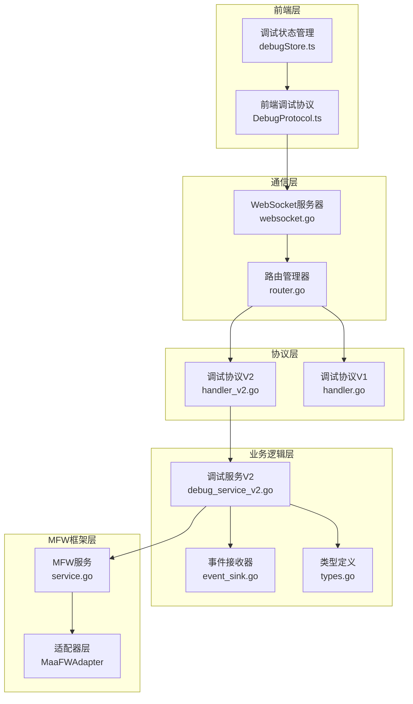
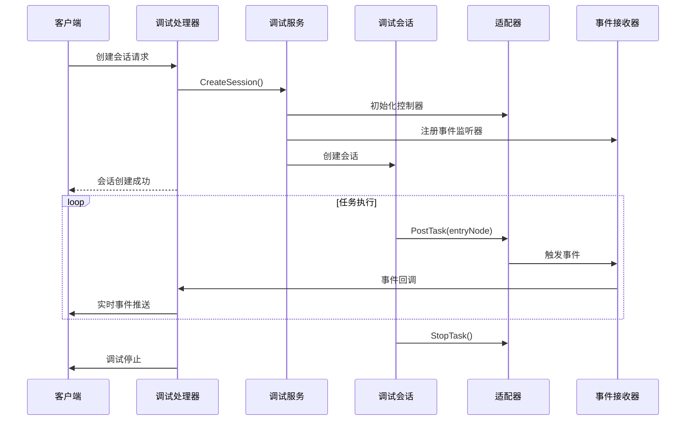
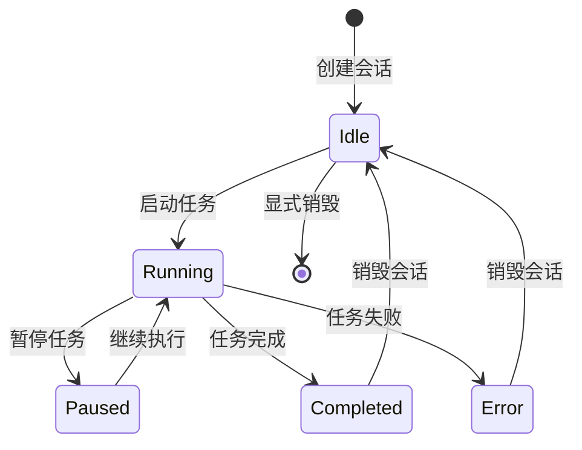
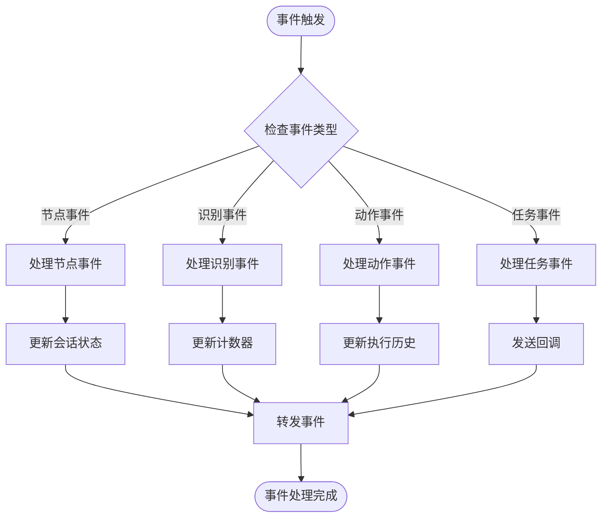
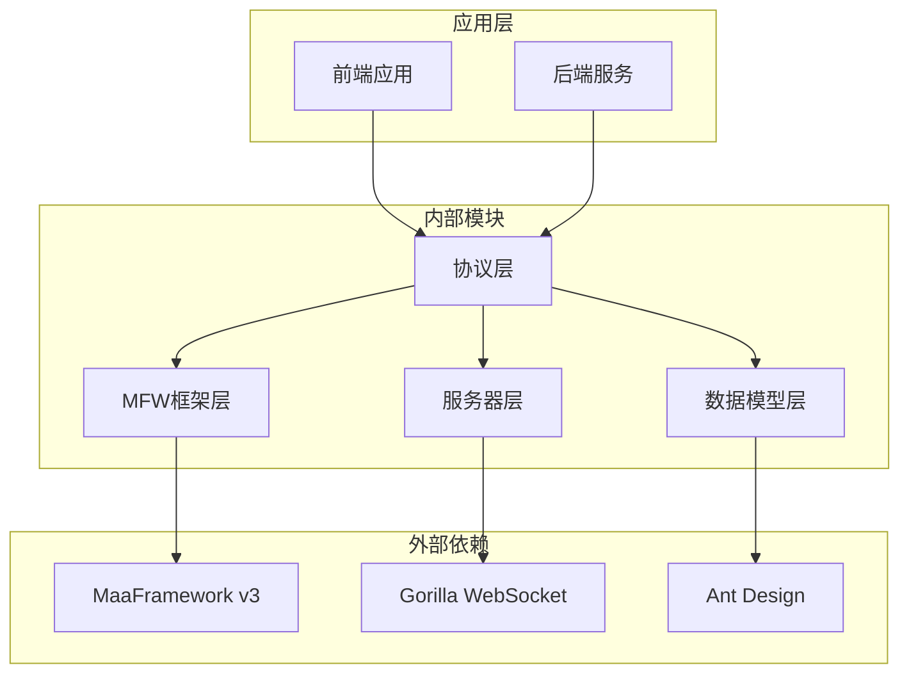

# 调试协议 V2

<cite>
**本文档引用的文件**
- [handler_v2.go](file://LocalBridge/internal/protocol/debug/handler_v2.go)
- [debug_service_v2.go](file://LocalBridge/internal/mfw/debug_service_v2.go)
- [event_sink.go](file://LocalBridge/internal/mfw/event_sink.go)
- [types.go](file://LocalBridge/internal/mfw/types.go)
- [service.go](file://LocalBridge/internal/mfw/service.go)
- [websocket.go](file://LocalBridge/internal/server/websocket.go)
- [message.go](file://LocalBridge/pkg/models/message.go)
- [DebugProtocol.ts](file://src/services/protocols/DebugProtocol.ts)
- [debugStore.ts](file://src/stores/debugStore.ts)
</cite>

## 目录
1. [简介](#简介)
2. [项目结构](#项目结构)
3. [核心组件](#核心组件)
4. [架构概览](#架构概览)
5. [详细组件分析](#详细组件分析)
6. [依赖关系分析](#依赖关系分析)
7. [性能考虑](#性能考虑)
8. [故障排除指南](#故障排除指南)
9. [结论](#结论)

## 简介

调试协议 V2 是 MaaPipelineEditor 本地桥接服务中的核心调试功能模块，基于 MaaFramework v3 开发，提供了完整的流程级调试能力。该协议支持会话管理、实时事件监控、节点执行跟踪、识别过程可视化等功能，为开发者提供强大的调试工具。

## 项目结构

调试协议 V2 的整体架构采用分层设计，主要包含以下层次：



**图表来源**
- [handler_v2.go](file://LocalBridge/internal/protocol/debug/handler_v2.go#L1-L50)
- [debug_service_v2.go](file://LocalBridge/internal/mfw/debug_service_v2.go#L1-L30)
- [websocket.go](file://LocalBridge/internal/server/websocket.go#L1-L50)

**章节来源**
- [handler_v2.go](file://LocalBridge/internal/protocol/debug/handler_v2.go#L1-L80)
- [debug_service_v2.go](file://LocalBridge/internal/mfw/debug_service_v2.go#L1-L80)
- [websocket.go](file://LocalBridge/internal/server/websocket.go#L1-L80)

## 核心组件

### 调试协议处理器 V2

调试协议处理器 V2 是整个调试系统的核心入口，负责处理所有调试相关的 WebSocket 消息请求。

```mermaid
classDiagram
class DebugHandlerV2 {
-service : Service
-debugService : DebugServiceV2
+GetRoutePrefix() []string
+Handle(msg, conn) *Message
+handleCreateSession(conn, msg)
+handleDestroySession(conn, msg)
+handleListSessions(conn, msg)
+handleGetSession(conn, msg)
+handleStart(conn, msg)
+handleRun(conn, msg)
+handleStop(conn, msg)
+handleGetNodeData(conn, msg)
+handleScreencap(conn, msg)
+sendResponse(conn, path, data)
+sendError(conn, errorMsg)
+createEventCallbackWithSessionID(conn, sessionIDHolder)
}
class DebugServiceV2 {
-service : Service
-sessions : map[string]*DebugSessionV2
+CreateSession(resourcePath, controllerID, eventCallback) *DebugSessionV2
+GetSession(sessionID) *DebugSessionV2
+DestroySession(sessionID) error
+ListSessions() []*DebugSessionV2
}
class DebugSessionV2 {
+SessionID : string
+ResourcePath : string
+EntryNode : string
+Status : DebugSessionStatus
+adapter : MaaFWAdapter
+eventCallback : DebugEventCallback
+RunTask(entryNode) error
+Stop() error
+GetStatus() DebugSessionStatus
+GetCurrentNode() string
+GetAdapter() *MaaFWAdapter
+GetNodeJSON(nodeName) (map[string]interface{}, bool)
}
DebugHandlerV2 --> DebugServiceV2 : "使用"
DebugServiceV2 --> DebugSessionV2 : "管理"
```

**图表来源**
- [handler_v2.go](file://LocalBridge/internal/protocol/debug/handler_v2.go#L16-L28)
- [debug_service_v2.go](file://LocalBridge/internal/mfw/debug_service_v2.go#L58-L71)
- [debug_service_v2.go](file://LocalBridge/internal/mfw/debug_service_v2.go#L29-L56)

### 事件系统

调试协议 V2 采用事件驱动架构，通过 SimpleContextSink 实现高效的事件收集和处理。



**图表来源**
- [handler_v2.go](file://LocalBridge/internal/protocol/debug/handler_v2.go#L85-L125)
- [debug_service_v2.go](file://LocalBridge/internal/mfw/debug_service_v2.go#L77-L143)
- [event_sink.go](file://LocalBridge/internal/mfw/event_sink.go#L108-L167)

**章节来源**
- [handler_v2.go](file://LocalBridge/internal/protocol/debug/handler_v2.go#L1-L491)
- [debug_service_v2.go](file://LocalBridge/internal/mfw/debug_service_v2.go#L1-L409)
- [event_sink.go](file://LocalBridge/internal/mfw/event_sink.go#L1-L519)

## 架构概览

调试协议 V2 采用现代化的微服务架构设计，具有以下特点：

### 1. 会话管理架构

每个调试会话都是独立的执行环境，包含完整的生命周期管理：

- **会话创建**: 初始化控制器、加载资源、设置事件监听器
- **会话运行**: 提交任务、监控执行状态、实时事件推送
- **会话销毁**: 清理资源、断开连接、释放内存

### 2. 事件处理机制

系统采用多级事件过滤机制，确保事件流的高效性和准确性：

- **节点级事件**: 节点开始、成功、失败
- **识别级事件**: 识别开始、成功、失败
- **动作级事件**: 动作开始、成功、失败
- **任务级事件**: 任务开始、成功、失败

### 3. 状态同步机制

前端和后端保持严格的状态同步，通过 WebSocket 实现实时双向通信。

**章节来源**
- [debug_service_v2.go](file://LocalBridge/internal/mfw/debug_service_v2.go#L77-L186)
- [event_sink.go](file://LocalBridge/internal/mfw/event_sink.go#L15-L52)

## 详细组件分析

### 会话管理系统

会话管理系统是调试协议 V2 的核心基础设施，负责管理所有调试会话的生命周期。

#### 会话状态管理



**图表来源**
- [debug_service_v2.go](file://LocalBridge/internal/mfw/debug_service_v2.go#L17-L27)
- [debug_service_v2.go](file://LocalBridge/internal/mfw/debug_service_v2.go#L192-L250)

#### 会话创建流程

会话创建过程涉及多个组件的协调工作：

1. **控制器验证**: 验证控制器实例的有效性
2. **资源加载**: 加载指定的资源文件
3. **适配器初始化**: 创建并配置 MaaFW 适配器
4. **事件监听器注册**: 设置事件回调函数
5. **会话持久化**: 存储会话信息以便后续管理

**章节来源**
- [debug_service_v2.go](file://LocalBridge/internal/mfw/debug_service_v2.go#L77-L143)

### 事件处理系统

事件处理系统采用观察者模式，通过 SimpleContextSink 实现高效的事件收集和分发。

#### 事件类型定义

系统支持多种事件类型，每种事件都有特定的数据结构：

| 事件类型 | 描述 | 数据字段 |
|---------|------|----------|
| node_starting | 节点开始执行 | node_name, node_id, task_id |
| node_succeeded | 节点执行成功 | node_name, node_id, task_id, latency |
| node_failed | 节点执行失败 | node_name, node_id, task_id, latency |
| reco_starting | 识别开始 | node_name, reco_id, task_id, detail |
| reco_succeeded | 识别成功 | node_name, reco_id, task_id, detail |
| reco_failed | 识别失败 | node_name, reco_id, task_id, detail |
| action_starting | 动作开始 | node_name, action_id, task_id |
| action_succeeded | 动作成功 | node_name, action_id, task_id |
| action_failed | 动作失败 | node_name, action_id, task_id |

#### 事件处理流程



**图表来源**
- [event_sink.go](file://LocalBridge/internal/mfw/event_sink.go#L108-L167)
- [event_sink.go](file://LocalBridge/internal/mfw/event_sink.go#L169-L325)

**章节来源**
- [event_sink.go](file://LocalBridge/internal/mfw/event_sink.go#L1-L519)

### 前端集成

前端通过 DebugProtocol 类与后端进行通信，实现了完整的调试界面功能。

#### 前端状态管理

前端使用 Zustand 状态管理库，定义了完整的调试状态结构：

```mermaid
graph TB
subgraph "调试状态"
DS[debugStatus: idle/preparing/running/paused/completed]
SID[sessionId: string|null]
EP[executedNodes: Set<string>]
CN[currentNode: string|null]
EH[executionHistory: ExecutionRecord[]]
end
subgraph "识别状态"
RR[recognitionRecords: RecognitionRecord[]]
SR[selectedRecoId: number|null]
DC[detailCache: Map<number, RecognitionDetail>]
end
subgraph "配置状态"
RP[resourcePath: string]
EN[entryNode: string]
CID[controllerId: string|null]
LL[logLevel: LogLevel]
end
```

**图表来源**
- [debugStore.ts](file://src/stores/debugStore.ts#L97-L162)

#### 事件处理映射

前端将后端事件映射到对应的 UI 更新逻辑：

| 后端事件 | 前端处理 | UI 更新 |
|----------|----------|---------|
| node_starting | 更新执行状态 | 节点高亮显示 |
| node_succeeded | 更新执行历史 | 节点完成状态 |
| node_failed | 更新错误状态 | 节点失败状态 |
| reco_starting | 创建识别记录 | 识别卡片显示 |
| reco_succeeded | 更新识别结果 | 识别成功状态 |
| reco_failed | 更新识别结果 | 识别失败状态 |
| debug_completed | 重置调试状态 | 清空调试界面 |

**章节来源**
- [DebugProtocol.ts](file://src/services/protocols/DebugProtocol.ts#L1-L695)
- [debugStore.ts](file://src/stores/debugStore.ts#L1-L724)

## 依赖关系分析

调试协议 V2 的依赖关系呈现清晰的分层结构，各层之间职责明确，耦合度低。



**图表来源**
- [handler_v2.go](file://LocalBridge/internal/protocol/debug/handler_v2.go#L3-L10)
- [websocket.go](file://LocalBridge/internal/server/websocket.go#L3-L13)

### 主要依赖关系

1. **MaaFramework v3**: 提供底层的自动化控制和识别能力
2. **Gorilla WebSocket**: 实现 WebSocket 通信协议
3. **Ant Design**: 提供 UI 组件和样式支持
4. **Zustand**: 实现轻量级状态管理

### 循环依赖检查

经过分析，调试协议 V2 不存在循环依赖问题：
- 协议层不依赖前端
- 服务器层不依赖协议层
- MFW 框架层独立于协议层
- 前端仅依赖协议层的接口定义

**章节来源**
- [handler_v2.go](file://LocalBridge/internal/protocol/debug/handler_v2.go#L3-L10)
- [websocket.go](file://LocalBridge/internal/server/websocket.go#L3-L13)

## 性能考虑

调试协议 V2 在设计时充分考虑了性能优化，采用了多种策略来提升系统性能。

### 1. 事件过滤机制

SimpleContextSink 实现了智能事件过滤，避免不必要的事件传播：

- **节点级事件**: 仅在节点状态变化时触发
- **识别级事件**: 仅在识别过程开始、成功、失败时触发
- **动作级事件**: 仅在动作执行开始、成功、失败时触发

### 2. 内存管理优化

- **会话池管理**: 使用 map 结构存储会话，支持快速查找和删除
- **事件缓冲区**: 使用 channel 实现事件的异步处理
- **资源清理**: 确保会话销毁时及时释放所有资源

### 3. 并发安全

- **读写锁**: 使用 RWMutex 确保并发访问的安全性
- **goroutine 管理**: 合理使用 goroutine 处理异步任务
- **通道通信**: 通过 channel 实现 goroutine 间的安全通信

### 4. 网络优化

- **WebSocket 复用**: 单个连接支持多路复用
- **消息压缩**: 对大消息进行压缩传输
- **心跳机制**: 保持连接的活跃状态

**章节来源**
- [debug_service_v2.go](file://LocalBridge/internal/mfw/debug_service_v2.go#L55-L56)
- [event_sink.go](file://LocalBridge/internal/mfw/event_sink.go#L63-L71)

## 故障排除指南

### 常见问题及解决方案

#### 1. 会话创建失败

**症状**: 创建会话时返回错误信息

**可能原因**:
- 控制器实例不存在
- 资源文件加载失败
- 适配器初始化失败

**解决步骤**:
1. 检查控制器 ID 是否正确
2. 验证资源路径是否存在
3. 查看日志获取详细错误信息

#### 2. 任务执行异常

**症状**: 任务执行过程中出现异常中断

**可能原因**:
- 节点配置错误
- 识别算法失败
- 设备连接问题

**解决步骤**:
1. 检查节点配置的正确性
2. 验证识别算法的适用性
3. 重新连接设备并测试

#### 3. 事件丢失问题

**症状**: 调试界面缺少部分事件信息

**可能原因**:
- 事件过滤器过于严格
- 网络连接不稳定
- 前端状态不同步

**解决步骤**:
1. 调整事件过滤级别
2. 检查网络连接质量
3. 刷新前端页面重新同步

### 调试技巧

1. **启用详细日志**: 在开发环境中启用详细日志输出
2. **使用断点调试**: 在关键节点设置断点进行调试
3. **监控资源使用**: 定期检查内存和 CPU 使用情况
4. **测试网络稳定性**: 确保 WebSocket 连接的稳定性

**章节来源**
- [handler_v2.go](file://LocalBridge/internal/protocol/debug/handler_v2.go#L40-L45)
- [debug_service_v2.go](file://LocalBridge/internal/mfw/debug_service_v2.go#L152-L174)

## 结论

调试协议 V2 是一个设计精良、功能完善的调试系统，具有以下优势：

### 技术优势

1. **架构清晰**: 分层设计使得代码结构清晰，易于维护
2. **性能优秀**: 采用事件驱动和异步处理，性能表现优异
3. **扩展性强**: 模块化设计便于功能扩展和定制
4. **稳定性高**: 完善的错误处理和资源管理机制

### 功能特色

1. **完整的调试体验**: 支持从会话管理到事件监控的全流程调试
2. **实时反馈**: 通过 WebSocket 实现实时事件推送
3. **可视化界面**: 前端提供直观的调试界面
4. **灵活配置**: 支持多种控制器和资源配置

### 应用价值

调试协议 V2 为 MaaPipelineEditor 提供了强大的调试能力，显著提升了开发效率和用户体验。其设计思想和实现方式可以作为类似项目的参考模板。