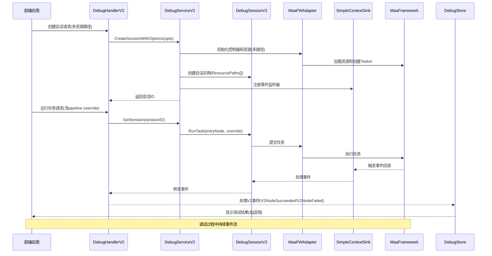
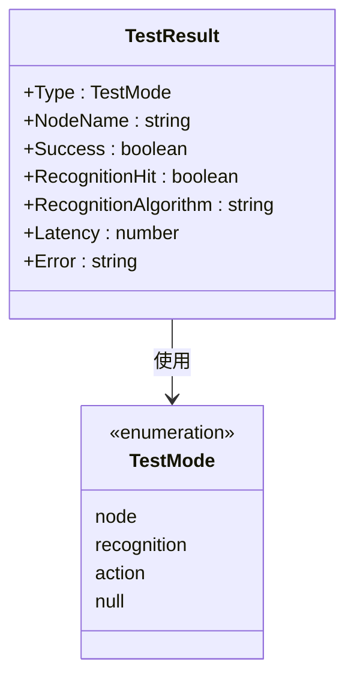
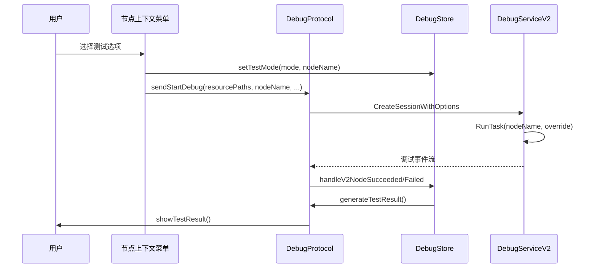
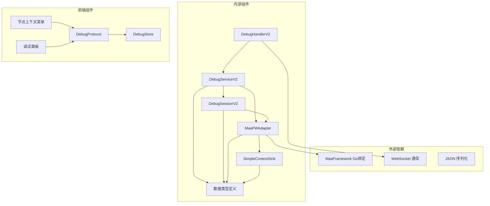

# 调试服务 V2

<cite>
**本文档引用的文件**
- [debug_service_v2.go](file://LocalBridge/internal/mfw/debug_service_v2.go)
- [handler_v2.go](file://LocalBridge/internal/protocol/debug/handler_v2.go)
- [types.go](file://LocalBridge/internal/mfw/types.go)
- [service.go](file://LocalBridge/internal/mfw/service.go)
- [controller_manager.go](file://LocalBridge/internal/mfw/controller_manager.go)
- [resource_manager.go](file://LocalBridge/internal/mfw/resource_manager.go)
- [event_sink.go](file://LocalBridge/internal/mfw/event_sink.go)
- [debugStore.ts](file://src/stores/debugStore.ts)
- [DebugProtocol.ts](file://src/services/protocols/DebugProtocol.ts)
- [nodeContextMenu.tsx](file://src/components/flow/nodes/nodeContextMenu.tsx)
- [DebugPanel.tsx](file://src/components/panels/tools/DebugPanel.tsx)
</cite>

## 更新摘要
**变更内容**
- 新增多资源路径支持，从单个资源路径扩展为资源路径数组
- 新增CreateSessionWithOptions方法，提供更灵活的会话创建选项
- 更新会话管理架构，支持资源路径优先级和覆盖机制
- 增强Agent标识符支持，提供更完整的调试环境配置
- **新增单节点测试功能**，包括测试模式状态管理和测试结果处理机制
- **增强事件处理系统**，支持测试模式下的专用事件处理和结果展示

## 目录
1. [简介](#简介)
2. [项目结构](#项目结构)
3. [核心组件](#核心组件)
4. [架构总览](#架构总览)
5. [详细组件分析](#详细组件分析)
6. [单节点测试功能](#单节点测试功能)
7. [依赖关系分析](#依赖关系分析)
8. [性能考虑](#性能考虑)
9. [故障排除指南](#故障排除指南)
10. [结论](#结论)

## 简介
调试服务 V2 是 MaaPipelineEditor 本地桥接层中的新一代调试系统，基于 MaaFramework Go 绑定实现。该服务提供了完整的流程级调试能力，支持实时事件监控、节点执行跟踪、识别过程可视化以及截图功能。相比传统调试服务，V2 版本引入了会话管理、事件回调机制和更精细的状态跟踪，为前端提供丰富的调试信息和交互体验。

**更新** 新版本引入了多资源路径支持和增强的会话管理功能，显著提升了调试系统的灵活性和实用性。**新增单节点测试功能**，为开发者提供了更精确的调试和测试能力，支持节点、识别和动作三个维度的独立测试。

## 项目结构
调试服务 V2 位于 LocalBridge 内部模块中，采用分层架构设计：

```mermaid
graph TB
subgraph "协议层"
DHV2[DebugHandlerV2<br/>调试协议处理器 V2]
DP[DebugProtocol<br/>调试协议处理器]
end
subgraph "服务层"
DSV2[DebugServiceV2<br/>调试服务 V2]
SVC[Service<br/>MFW 服务管理器]
end
subgraph "适配层"
ADP[MaaFWAdapter<br/>MaaFramework 适配器]
SCS[SimpleContextSink<br/>简化事件接收器]
END
subgraph "前端交互层"
DS[DebugStore<br/>调试状态管理]
NCM[节点上下文菜单]
DPN[调试面板]
end
subgraph "基础设施"
CM[ControllerManager<br/>控制器管理器]
RM[ResourceManager<br/>资源管理器]
DM[DeviceManager<br/>设备管理器]
end
DHV2 --> DSV2
DSV2 --> SVC
SVC --> CM
SVC --> RM
SVC --> DM
DSV2 --> ADP
ADP --> SCS
DP --> DS
NCM --> DP
DPN --> DP
```

**图表来源**
- [handler_v2.go](file://LocalBridge/internal/protocol/debug/handler_v2.go#L16-L28)
- [debug_service_v2.go](file://LocalBridge/internal/mfw/debug_service_v2.go#L60-L65)
- [service.go](file://LocalBridge/internal/mfw/service.go#L15-L23)
- [DebugProtocol.ts](file://src/services/protocols/DebugProtocol.ts#L16-L75)

**章节来源**
- [handler_v2.go](file://LocalBridge/internal/protocol/debug/handler_v2.go#L1-L520)
- [debug_service_v2.go](file://LocalBridge/internal/mfw/debug_service_v2.go#L1-L472)
- [service.go](file://LocalBridge/internal/mfw/service.go#L1-L193)

## 核心组件
调试服务 V2 由以下核心组件构成：

### 会话管理系统
- **DebugSessionV2**: 调试会话实体，管理单个调试任务的生命周期
- **DebugServiceV2**: 会话管理器，负责会话的创建、销毁和状态维护
- **CreateSessionOptions**: 会话创建选项，支持多资源路径和Agent配置
- **会话状态**: idle、preparing、running、paused、completed、error

### 事件处理系统
- **DebugEventData**: 事件数据结构，包含事件类型、时间戳、节点信息等
- **DebugEventCallback**: 事件回调函数接口
- **SimpleContextSink**: 简化版事件接收器，过滤和处理关键事件
- **V2事件处理器**: 新增的V2事件处理机制，支持测试模式事件

### 适配器层
- **MaaFWAdapter**: MaaFramework 适配器，封装底层框架调用
- **事件映射**: 将底层事件转换为统一的调试事件格式

### **新增** 单节点测试系统
- **TestMode**: 测试模式枚举，支持null、node、recognition、action四种模式
- **TestResult**: 测试结果数据结构，包含测试类型、节点名称、成功状态等
- **测试状态管理**: 前端状态管理，支持测试模式切换和结果展示
- **测试结果处理**: 自动生成和展示测试结果的机制

**更新** 新增CreateSessionOptions结构体，提供更灵活的会话创建配置。**新增单节点测试功能**，提供更精确的调试和测试能力。

**章节来源**
- [debug_service_v2.go](file://LocalBridge/internal/mfw/debug_service_v2.go#L29-L58)
- [debug_service_v2.go](file://LocalBridge/internal/mfw/debug_service_v2.go#L79-L85)
- [event_sink.go](file://LocalBridge/internal/mfw/event_sink.go#L41-L55)
- [debugStore.ts](file://src/stores/debugStore.ts#L31-L58)

## 架构总览
调试服务 V2 采用事件驱动架构，通过 WebSocket 与前端进行双向通信：



**更新** 新增多资源路径加载流程，支持资源路径优先级和覆盖机制。**新增测试模式事件处理**，支持单节点测试结果的自动生成和展示。

**图表来源**
- [handler_v2.go](file://LocalBridge/internal/protocol/debug/handler_v2.go#L85-L125)
- [debug_service_v2.go](file://LocalBridge/internal/mfw/debug_service_v2.go#L97-L171)
- [event_sink.go](file://LocalBridge/internal/mfw/event_sink.go#L108-L167)
- [DebugProtocol.ts](file://src/services/protocols/DebugProtocol.ts#L710-L795)

## 详细组件分析

### DebugServiceV2 - 调试服务 V2
DebugServiceV2 是调试服务 V2 的核心控制器，负责会话生命周期管理和任务调度。

#### 主要职责
- 会话创建和销毁管理
- 任务执行协调
- 状态跟踪和事件转发
- 资源清理和异常处理

#### 关键方法
- **CreateSession**: 创建新的调试会话（兼容旧版本）
- **CreateSessionWithOptions**: 创建新的调试会话（推荐使用）
- **GetSession**: 获取现有会话
- **DestroySession**: 销毁会话并清理资源
- **ListSessions**: 列出所有活动会话


**更新** 新增CreateSessionWithOptions方法和CreateSessionOptions结构体，支持多资源路径和Agent配置。

**图表来源**
- [debug_service_v2.go](file://LocalBridge/internal/mfw/debug_service_v2.go#L60-L65)
- [debug_service_v2.go](file://LocalBridge/internal/mfw/debug_service_v2.go#L29-L58)
- [debug_service_v2.go](file://LocalBridge/internal/mfw/debug_service_v2.go#L79-L85)

**章节来源**
- [debug_service_v2.go](file://LocalBridge/internal/mfw/debug_service_v2.go#L60-L214)

### DebugHandlerV2 - 调试协议处理器 V2
DebugHandlerV2 是调试服务 V2 的协议层实现，负责处理 WebSocket 消息和路由分发。

#### 支持的路由
- `/mpe/debug/create_session`: 创建调试会话（支持多资源路径）
- `/mpe/debug/destroy_session`: 销毁调试会话
- `/mpe/debug/list_sessions`: 列出所有会话
- `/mpe/debug/get_session`: 获取会话信息
- `/mpe/debug/start`: 启动调试（自动创建会话）
- `/mpe/debug/run`: 运行任务
- `/mpe/debug/stop`: 停止调试
- `/mpe/debug/get_node_data`: 获取节点数据
- `/mpe/debug/screencap`: 截图功能

#### 事件处理机制
- 会话级别的事件回调
- 自动 session_id 管理
- 错误处理和响应格式化
- 多资源路径解析支持

```mermaid
flowchart TD
Start([收到调试消息]) --> CheckInit{检查服务初始化}
CheckInit --> |未初始化| SendError[发送错误响应]
CheckInit --> |已初始化| Route{路由分发}
Route --> CreateSession[创建会话(多资源路径)]
Route --> DestroySession[销毁会话]
Route --> ListSessions[列出会话]
Route --> GetSession[获取会话]
Route --> StartDebug[启动调试]
Route --> RunTask[运行任务]
Route --> StopDebug[停止调试]
Route --> GetNodeData[获取节点数据]
Route --> Screencap[截图]
CreateSession --> ParsePaths[解析资源路径数组]
ParsePaths --> CreateCallback[创建事件回调]
CreateCallback --> SessionCreated[返回会话创建成功]
StartDebug --> AutoCreate[自动创建会话]
AutoCreate --> RunTask
RunTask --> TaskRunning[返回任务运行成功]
SendError --> End([结束])
SessionCreated --> End
TaskRunning --> End
```

**更新** 新增多资源路径解析功能，支持资源路径数组和兼容单个资源路径。

**图表来源**
- [handler_v2.go](file://LocalBridge/internal/protocol/debug/handler_v2.go#L35-L79)
- [handler_v2.go](file://LocalBridge/internal/protocol/debug/handler_v2.go#L85-L125)

**章节来源**
- [handler_v2.go](file://LocalBridge/internal/protocol/debug/handler_v2.go#L16-L520)

### 事件系统架构
调试服务 V2 实现了完整的事件驱动架构，支持多种事件类型的捕获和处理。

#### 事件类型定义
- **节点级事件**: node_starting、node_succeeded、node_failed
- **识别级事件**: reco_starting、reco_succeeded、reco_failed  
- **动作级事件**: action_starting、action_succeeded、action_failed
- **任务级事件**: task_starting、task_succeeded、task_failed
- **资源级事件**: resource_loading、resource_loaded、resource_loadfail
- **V2新增事件**: debug_completed、debug_error、debug_paused

#### 事件数据结构
```mermaid
classDiagram
class DebugEventData {
+Type : DebugEventType
+Timestamp : int64
+NodeName : string
+NodeID : uint64
+TaskID : uint64
+RecoID : uint64
+ActionID : uint64
+Detail : map[string]interface{}
+Latency : int64
}
class DebugEventType {
<<enumeration>>
node_starting
node_succeeded
node_failed
reco_starting
reco_succeeded
reco_failed
action_starting
action_succeeded
action_failed
task_starting
task_succeeded
task_failed
resource_loading
resource_loaded
resource_loadfail
debug_completed
debug_error
debug_paused
}
DebugEventData --> DebugEventType : 使用
```

**图表来源**
- [event_sink.go](file://LocalBridge/internal/mfw/event_sink.go#L41-L52)
- [event_sink.go](file://LocalBridge/internal/mfw/event_sink.go#L15-L39)

**章节来源**
- [event_sink.go](file://LocalBridge/internal/mfw/event_sink.go#L1-L519)

### 适配器层设计
MaaFWAdapter 作为适配器层，封装了对 MaaFramework 的调用，提供了统一的接口给调试服务使用。

#### 核心功能
- 控制器管理：设置和管理 MaaFramework 控制器
- 资源加载：加载和管理调试资源（支持多路径）
- 任务执行：提交和管理调试任务
- 截图功能：获取设备屏幕截图
- 事件适配：将底层事件转换为调试事件

#### 适配器生命周期


**更新** 新增多资源路径加载机制，支持资源路径优先级和覆盖策略。

**图表来源**
- [debug_service_v2.go](file://LocalBridge/internal/mfw/debug_service_v2.go#L97-L171)
- [debug_service_v2.go](file://LocalBridge/internal/mfw/debug_service_v2.go#L192-L232)

**章节来源**
- [debug_service_v2.go](file://LocalBridge/internal/mfw/debug_service_v2.go#L38-L171)

## 单节点测试功能

### 测试模式系统
调试服务 V2 新增了完整的单节点测试功能，为开发者提供精确的调试和测试能力。

#### 测试模式类型
- **null**: 普通调试模式，不进行特殊测试
- **node**: 测试整个节点，包括识别和动作执行
- **recognition**: 仅测试识别功能，跳过动作执行
- **action**: 仅测试动作功能，使用DirectHit识别

#### 测试结果数据结构


**图表来源**
- [debugStore.ts](file://src/stores/debugStore.ts#L41-L58)

#### 测试执行流程


**图表来源**
- [nodeContextMenu.tsx](file://src/components/flow/nodes/nodeContextMenu.tsx#L254-L296)
- [DebugProtocol.ts](file://src/services/protocols/DebugProtocol.ts#L773-L787)

### 测试结果处理机制
调试服务 V2 实现了智能的测试结果处理机制，能够根据不同的测试模式生成相应的结果报告。

#### 结果生成逻辑
- **节点测试**: 检查节点执行状态，包含识别命中信息和算法信息
- **识别测试**: 仅检查识别成功率和命中状态
- **动作测试**: 仅检查动作执行成功与否
- **通用处理**: 包含执行耗时信息

#### 结果展示策略
- **成功**: 显示绿色成功消息，包含节点名称和耗时
- **警告**: 显示黄色警告消息，表示识别完成但未命中
- **错误**: 显示红色错误消息，包含详细的错误信息

**章节来源**
- [debugStore.ts](file://src/stores/debugStore.ts#L31-L58)
- [nodeContextMenu.tsx](file://src/components/flow/nodes/nodeContextMenu.tsx#L254-L296)
- [DebugProtocol.ts](file://src/services/protocols/DebugProtocol.ts#L797-L938)

## 依赖关系分析

### 组件耦合度
调试服务 V2 采用了良好的分层设计，各组件之间的耦合度较低：



**更新** 新增前端组件依赖，包括DebugStore、DebugProtocol、节点上下文菜单和调试面板。**新增测试模式相关组件**，支持单节点测试功能。

**图表来源**
- [handler_v2.go](file://LocalBridge/internal/protocol/debug/handler_v2.go#L1-L10)
- [debug_service_v2.go](file://LocalBridge/internal/mfw/debug_service_v2.go#L1-L11)
- [DebugProtocol.ts](file://src/services/protocols/DebugProtocol.ts#L1-L11)

### 关键依赖链
- **协议层依赖**: DebugHandlerV2 依赖 Service 层提供的会话管理能力
- **服务层依赖**: DebugServiceV2 依赖 MFW 服务管理器进行资源和控制器管理
- **适配层依赖**: MaaFWAdapter 依赖 MaaFramework Go 绑定进行底层操作
- **事件层依赖**: SimpleContextSink 依赖适配器提供的事件回调机制
- **前端依赖**: DebugProtocol 依赖 DebugStore 进行状态管理和测试结果处理

**章节来源**
- [service.go](file://LocalBridge/internal/mfw/service.go#L15-L34)
- [controller_manager.go](file://LocalBridge/internal/mfw/controller_manager.go#L20-L31)
- [resource_manager.go](file://LocalBridge/internal/mfw/resource_manager.go#L13-L24)

## 性能考虑
调试服务 V2 在设计时充分考虑了性能优化：

### 内存管理
- 使用 RWMutex 进行并发安全访问
- 会话状态数据结构优化
- 事件回调的延迟处理机制
- **更新** 测试结果缓存机制，避免重复计算

### 资源管理
- 自动资源清理机制
- 会话超时自动销毁
- 控制器和资源的智能管理
- **更新** 多资源路径的高效加载和管理

### 事件处理优化
- 简化事件接收器，过滤无关事件
- 异步事件处理
- 事件数据的最小化传输
- **更新** 测试模式下的事件过滤和处理优化

### **新增** 测试性能优化
- 测试结果的智能缓存和复用
- 测试模式下的轻量级事件处理
- 测试结果的批量处理和展示
- 减少测试过程中的资源消耗

## 故障排除指南

### 常见问题及解决方案

#### 服务未初始化
**症状**: 调试请求被拒绝，返回"MaaFramework 未初始化"错误
**解决方案**: 
1. 确保调用 `Initialize()` 方法
2. 检查 MaaFramework 库路径配置
3. 验证日志目录权限

#### 会话创建失败
**症状**: 创建会话返回控制器不存在或资源加载失败
**解决方案**:
1. 检查控制器 ID 是否有效
2. 验证资源路径是否存在
3. 确认控制器已正确连接
4. **更新** 检查多资源路径的有效性，确保路径顺序正确

#### 任务执行异常
**症状**: 任务执行过程中出现错误或卡死
**解决方案**:
1. 检查节点配置是否正确
2. 验证控制器连接状态
3. 查看事件日志获取详细错误信息
4. **更新** 检查多资源路径的加载顺序和优先级

#### 事件丢失问题
**症状**: 部分调试事件没有到达前端
**解决方案**:
1. 检查事件回调注册是否成功
2. 验证 WebSocket 连接状态
3. 确认事件过滤器配置正确

#### 多资源路径问题
**症状**: 资源加载失败或资源覆盖异常
**解决方案**:
1. 检查资源路径数组的有效性
2. 验证资源路径的加载顺序
3. 确认资源覆盖策略符合预期
4. 查看资源加载日志获取详细信息

#### **新增** 单节点测试问题
**症状**: 测试结果不准确或测试无法启动
**解决方案**:
1. 检查测试模式设置是否正确
2. 验证节点名称和路径的有效性
3. 确认测试override配置正确
4. 检查测试结果缓存是否正常工作
5. 查看测试事件日志获取详细信息

**章节来源**
- [handler_v2.go](file://LocalBridge/internal/protocol/debug/handler_v2.go#L40-L45)
- [debug_service_v2.go](file://LocalBridge/internal/mfw/debug_service_v2.go#L97-L171)

## 结论
调试服务 V2 是一个设计精良的调试系统，具有以下特点：

### 技术优势
- **模块化设计**: 清晰的分层架构，便于维护和扩展
- **事件驱动**: 基于事件的异步处理机制，响应性强
- **会话管理**: 完善的会话生命周期管理
- **性能优化**: 合理的资源管理和事件过滤
- **更新** **多资源路径支持**: 灵活的资源管理机制，支持资源优先级和覆盖
- **更新** **单节点测试功能**: 精确的调试和测试能力，支持三种测试模式

### 功能特性
- 支持完整的流程级调试
- 实时事件监控和可视化
- 丰富的调试信息收集
- 灵活的会话控制机制
- **更新** 支持多资源路径配置和Agent标识符
- **更新** 提供节点、识别、动作的独立测试能力

### 应用价值
调试服务 V2 为 MaaPipelineEditor 提供了强大的调试能力，帮助开发者更好地理解和优化自动化流程，提高开发效率和质量。

**更新** 新版本通过多资源路径支持和增强的会话管理，显著提升了调试系统的灵活性和实用性。**新增单节点测试功能**进一步增强了调试精度，为复杂的调试场景提供了更好的支持，使开发者能够更精确地定位和解决问题。