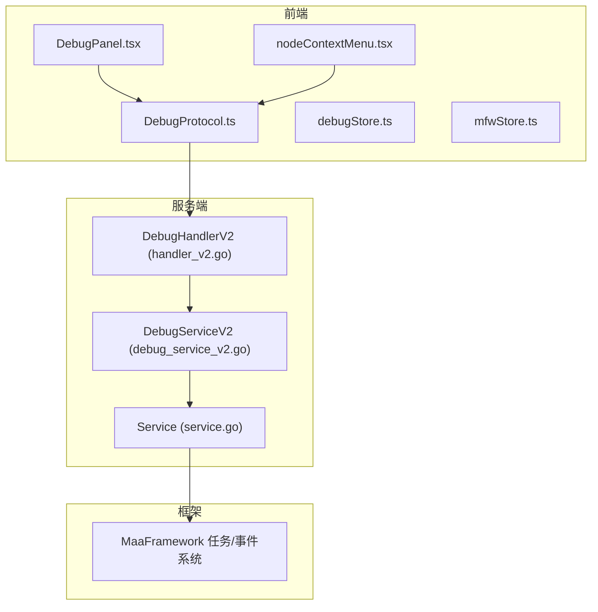
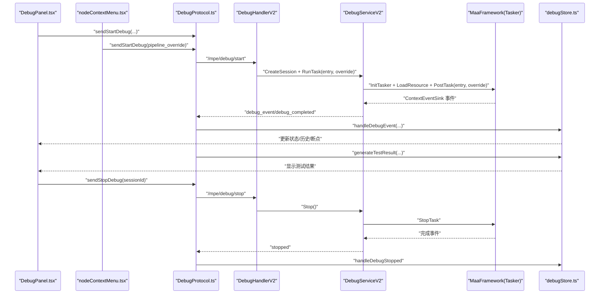
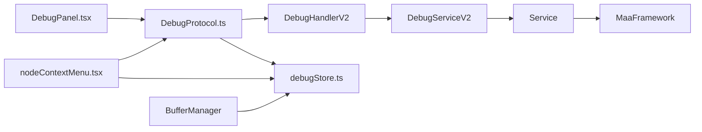

# 调试框架

<cite>
**本文引用的文件列表**
- [debug_service_v2.go](file://LocalBridge/internal/mfw/debug_service_v2.go)
- [handler_v2.go](file://LocalBridge/internal/protocol/debug/handler_v2.go)
- [DebugProtocol.ts](file://src/services/protocols/DebugProtocol.ts)
- [debugStore.ts](file://src/stores/debugStore.ts)
- [DebugPanel.tsx](file://src/components/panels/tools/DebugPanel.tsx)
- [nodeContextMenu.tsx](file://src/components/flow/nodes/nodeContextMenu.tsx)
- [mfwStore.ts](file://src/stores/mfwStore.ts)
- [DebugPanel.module.less](file://src/styles/DebugPanel.module.less)
- [bufferHelper.ts](file://src/utils/bufferHelper.ts)
- [API参考/任务管理器.md](file://instructions/maafw-golang/API参考/任务管理器.md)
- [API参考/事件系统.md](file://instructions/maafw-golang/API参考/事件系统.md)
- [高级功能/动态流水线构建.md](file://instructions/maafw-golang/高级功能/动态流水线构建.md)
- [Agent客户端.md](file://instructions/maafw-golang-binding/高级功能/Agent架构/Agent客户端.md)
</cite>

## 更新摘要
**变更内容**
- 新增单节点调试能力，支持测试模式状态管理、测试结果分析和智能结果解释功能
- 增强节点上下文菜单，新增"测试此节点"、"测试识别"、"测试动作"功能
- 优化调试协议，支持 pipeline override 参数传递
- 完善测试结果显示机制，提供详细的测试结果解释
- 增强调试状态管理，支持更精细的调试粒度控制
- **新增**：实现内存管理优化，包括识别记录、执行历史和详情缓存的自动清理功能，防止内存泄漏并改善系统稳定性

## 目录
1. [简介](#简介)
2. [项目结构](#项目结构)
3. [核心组件](#核心组件)
4. [架构总览](#架构总览)
5. [详细组件分析](#详细组件分析)
6. [单节点调试功能](#单节点调试功能)
7. [测试模式与结果分析](#测试模式与结果分析)
8. [内存管理优化](#内存管理优化)
9. [依赖关系分析](#依赖关系分析)
10. [性能考虑](#性能考虑)
11. [故障排查指南](#故障排查指南)
12. [结论](#结论)
13. [附录](#附录)

## 简介
本文件系统性阐述 MaaPipelineEditor 项目中的"调试框架"，覆盖从前端 UI 到后端服务、从 WebSocket 协议到 MaaFramework 事件回调的全链路实现。调试框架支持：
- 会话化调试：创建/销毁/查询会话，基于会话 ID 的事件路由与状态管理
- 启动/停止/暂停/继续/单步调试：通过动态覆盖 pipeline 的 next/on_error
- 节点级事件上报：识别开始/成功/失败、动作开始/成功/失败、节点执行周期完成/失败
- 识别记录系统：独立的识别记录卡片与详情缓存，支持按 reco_id 懒加载详情
- 执行历史与日志导出：节点级执行历史与识别记录分离，支持文本/JSON 导出
- 前后端协同的调试状态机与 UI 响应
- **新增**：单节点调试能力，包括测试模式状态管理、测试结果分析和智能结果解释功能
- **新增**：内存管理优化，实现识别记录、执行历史和详情缓存的自动轮转清理机制

## 项目结构
调试框架由三层构成：
- 前端层：DebugPanel（工具栏）、DebugProtocol（WebSocket 协议）、debugStore（调试状态与历史）
- 服务层：LocalBridge 内部的 DebugHandlerV2（路由与业务）、DebugServiceV2（会话与任务生命周期）
- 框架层：MaaFramework 任务/事件系统



**图表来源**
- [DebugPanel.tsx](file://src/components/panels/tools/DebugPanel.tsx#L1-L493)
- [DebugProtocol.ts](file://src/services/protocols/DebugProtocol.ts#L1-L1004)
- [debugStore.ts](file://src/stores/debugStore.ts#L1-L896)
- [mfwStore.ts](file://src/stores/mfwStore.ts#L1-L158)
- [nodeContextMenu.tsx](file://src/components/flow/nodes/nodeContextMenu.tsx#L1-L452)
- [handler_v2.go](file://LocalBridge/internal/protocol/debug/handler_v2.go#L1-L520)
- [debug_service_v2.go](file://LocalBridge/internal/mfw/debug_service_v2.go#L1-L472)

## 核心组件
- 调试处理器 V2（DebugHandlerV2）：负责路由 /mpe/debug/* 请求，支持会话管理、调试控制、数据查询
- 调试服务 V2（DebugServiceV2）：封装会话生命周期、任务提交与等待、事件回调与状态维护
- 前端协议（DebugProtocol）：WebSocket 路由注册、事件分发、UI 状态同步
- 前端状态（debugStore）：调试状态机、执行历史、识别记录与详情缓存、日志导出
- 前端面板（DebugPanel）：调试配置、断点管理、调试控制、日志导出与截图
- **新增**：节点上下文菜单（nodeContextMenu）：提供单节点测试功能
- **新增**：内存管理工具（BufferManager）：提供通用的缓冲存储和清理机制

**章节来源**
- [handler_v2.go](file://LocalBridge/internal/protocol/debug/handler_v2.go#L1-L520)
- [debug_service_v2.go](file://LocalBridge/internal/mfw/debug_service_v2.go#L1-L472)
- [DebugProtocol.ts](file://src/services/protocols/DebugProtocol.ts#L1-L1004)
- [debugStore.ts](file://src/stores/debugStore.ts#L1-L896)
- [DebugPanel.tsx](file://src/components/panels/tools/DebugPanel.tsx#L1-L493)
- [nodeContextMenu.tsx](file://src/components/flow/nodes/nodeContextMenu.tsx#L1-L452)
- [bufferHelper.ts](file://src/utils/bufferHelper.ts#L1-L19)

## 架构总览
调试流程从前端发起，经由 DebugProtocol 与 DebugHandlerV2，调用 DebugServiceV2 创建/运行/停止任务，并通过 MaaFramework 的事件系统将节点级事件回推到前端，前端更新 UI 与执行历史。



**图表来源**
- [DebugPanel.tsx](file://src/components/panels/tools/DebugPanel.tsx#L1-L493)
- [nodeContextMenu.tsx](file://src/components/flow/nodes/nodeContextMenu.tsx#L182-L296)
- [DebugProtocol.ts](file://src/services/protocols/DebugProtocol.ts#L956-L987)
- [handler_v2.go](file://LocalBridge/internal/protocol/debug/handler_v2.go#L229-L294)
- [debug_service_v2.go](file://LocalBridge/internal/mfw/debug_service_v2.go#L221-L277)

## 详细组件分析

### 调试处理器 V2（DebugHandlerV2）
- 路由前缀：/mpe/debug/*
- 支持操作：
  - 会话管理：创建会话、销毁会话、列出会话、获取会话信息
  - 调试控制：启动调试（自动创建会话并运行任务）、运行任务（指定会话）、停止调试
  - 数据查询：获取节点数据、截图
- **新增**：支持 pipeline_override 参数，用于单节点调试的 pipeline 覆盖
- 错误处理：统一发送 /lte/debug/error

**章节来源**
- [handler_v2.go](file://LocalBridge/internal/protocol/debug/handler_v2.go#L1-L520)

### 调试服务 V2（DebugServiceV2）
- 会话管理：
  - 创建会话：获取控制器、加载资源、初始化 Tasker、注册事件监听器、保存会话
  - 获取/销毁/列举会话：线程安全的会话表管理
- 调试控制：
  - 运行任务：校验入口节点、提交任务、异步等待完成、发送完成/错误事件
  - **新增**：支持 pipeline_override 参数，实现单节点调试
  - 停止调试：调用 StopTask，重置状态
- 状态查询：
  - 获取状态、当前节点、上一个节点、暂停原因、最后一个错误、已执行节点统计
- 事件处理：
  - 记录节点开始/完成时间、计算耗时、转发事件给前端

**章节来源**
- [debug_service_v2.go](file://LocalBridge/internal/mfw/debug_service_v2.go#L1-L472)

### 前端协议（DebugProtocol）
- 注册 /lte/debug/* 路由，处理事件、错误、完成、启动/停止/运行响应
- 将后端事件转换为前端可消费的数据结构，驱动 debugStore 更新
- 提供 sendStartDebug/sendStopDebug 等方法
- **新增**：支持 pipeline_override 参数传递，实现单节点调试
- **新增**：generateTestResult 方法，用于生成测试结果
- **新增**：showTestResult 方法，用于显示测试结果并提供智能解释

**章节来源**
- [DebugProtocol.ts](file://src/services/protocols/DebugProtocol.ts#L1-L1004)

### 前端状态（debugStore）
- 调试状态机：idle/preparing/running/paused/completed
- 执行历史：每条记录对应一次完整的节点执行周期，包含节点名/ID、开始/结束时间、耗时、状态、runIndex
- 识别记录系统：独立的识别记录卡片，支持按 reco_id 懒加载详情并缓存
- 日志导出：支持文本/JSON 导出
- **新增**：测试模式状态管理，包括 testMode、testNodeName、testResult 字段
- **新增**：setTestMode 和 clearTestResult 方法，用于测试模式控制
- **新增**：内存管理优化，包括识别记录、执行历史和详情缓存的自动轮转清理机制

**章节来源**
- [debugStore.ts](file://src/stores/debugStore.ts#L1-L896)

### 前端面板（DebugPanel）
- 调试配置：资源路径、入口节点、控制器、日志级别
- 断点管理：设置/移除/清空断点
- 调试控制：开始/停止（V2 使用会话 ID）
- 日志导出：文本/JSON 下载
- 与 mfwStore 协作，确保控制器连接状态与调试按钮可用性

**章节来源**
- [DebugPanel.tsx](file://src/components/panels/tools/DebugPanel.tsx#L1-L493)
- [mfwStore.ts](file://src/stores/mfwStore.ts#L1-L158)
- [DebugPanel.module.less](file://src/styles/DebugPanel.module.less#L1-L798)

### 节点上下文菜单（nodeContextMenu）
- **新增**：提供单节点调试功能，包括"测试此节点"、"测试识别"、"测试动作"三个选项
- **新增**：每个测试选项都会生成相应的 pipeline_override 配置
- **新增**：测试模式下直接设置调试状态，不调用传统的 startDebug 流程
- **新增**：支持 Agent 标识符配置，确保测试环境一致性

**章节来源**
- [nodeContextMenu.tsx](file://src/components/flow/nodes/nodeContextMenu.tsx#L1-L452)

## 单节点调试功能

### 测试模式类型
调试框架支持三种测试模式：
- **node 模式**：测试整个节点的执行，包括识别和动作
- **recognition 模式**：仅测试识别功能，动作设置为 DoNothing
- **action 模式**：仅测试动作执行，识别设置为 DirectHit

### pipeline_override 实现
每个测试模式都会生成特定的 pipeline 覆盖配置：

```typescript
// 测试此节点
const override = {
  [fullNodeName]: {
    next: [],      // 清空下一个节点
    on_error: [],  // 清空错误处理
  },
};

// 测试识别
const override = {
  [fullNodeName]: {
    action: "DoNothing",  // 禁用动作执行
    timeout: 0,           // 禁用超时
    next: [],             // 清空下一个节点
    on_error: [],        // 清空错误处理
  },
};

// 测试动作
const override = {
  [fullNodeName]: {
    recognition: "DirectHit",  // 直接命中
    next: [],                 // 清空下一个节点
    on_error: [],            // 清空错误处理
  },
};
```

### 测试流程
1. 用户在节点右键菜单选择测试选项
2. 系统验证连接状态和控制器状态
3. 生成对应的 pipeline_override 配置
4. 直接设置调试状态（不调用 startDebug）
5. 发送调试启动请求，包含 pipeline_override
6. 执行完成后生成测试结果并显示

**章节来源**
- [nodeContextMenu.tsx](file://src/components/flow/nodes/nodeContextMenu.tsx#L254-L296)
- [DebugProtocol.ts](file://src/services/protocols/DebugProtocol.ts#L956-L987)

## 测试模式与结果分析

### 测试结果生成
调试协议根据测试模式和执行结果生成详细的测试报告：

```typescript
private generateTestResult(
  testMode: string,
  nodeName: string,
  executionHistory: any[],
  recognitionRecords: any[],
  detailCache: Map<number, any>
): TestResult {
  // 查找节点执行记录
  const nodeRecord = executionHistory.find((r) => r.nodeName === nodeName);
  const nodeSuccess = nodeRecord?.status === "completed";
  const latency = nodeRecord?.latency;

  // 查找识别记录（入口节点的自我识别，parentNode 为 $entry）
  const recoRecord = recognitionRecords.find(
    (r) => r.name === nodeName && r.parentNode === "$entry"
  );
  const recognitionHit = recoRecord?.hit;
  const recognitionSuccess = recoRecord?.status === "succeeded";
  
  // 获取识别算法
  let recognitionAlgorithm: string | undefined;
  if (recoRecord?.recoId) {
    const detail = detailCache.get(recoRecord.recoId);
    recognitionAlgorithm = detail?.algorithm;
  }

  switch (testMode) {
    case "recognition":
      return {
        success: recognitionSuccess,
        type: "recognition",
        nodeName,
        recognitionHit,
        recognitionAlgorithm,
        latency,
      };

    case "action":
      return {
        success: nodeSuccess,
        type: "action",
        nodeName,
        latency,
      };

    case "node":
    default:
      return {
        success: nodeSuccess,
        type: "node",
        nodeName,
        recognitionHit,
        recognitionAlgorithm,
        latency,
      };
  }
}
```

### 智能结果解释
调试协议提供智能的结果解释功能，根据不同测试类型生成友好的用户反馈：

- **识别测试**：
  - 成功且命中：显示识别成功和算法信息
  - 成功但未命中：显示识别完成但未命中
  - 失败：显示识别失败

- **动作测试**：
  - 成功：显示动作执行成功
  - 失败：显示动作执行失败

- **节点测试**：
  - 成功：显示节点执行成功，包含识别命中状态和算法信息
  - 失败：显示节点执行失败

**章节来源**
- [DebugProtocol.ts](file://src/services/protocols/DebugProtocol.ts#L800-L938)

## 内存管理优化

### 内存限制配置
调试框架实现了全面的内存管理优化，通过以下常量控制不同数据结构的最大容量：

- **识别记录最大条数**：`MAX_RECOGNITION_RECORDS = 300`
- **执行历史最大条数**：`MAX_EXECUTION_HISTORY = 300`
- **详情缓存最大条数**：`MAX_DETAIL_CACHE_SIZE = 50`
- **清理比例**：`CLEANUP_RATIO = 0.2`（每次清理 20% 的最旧记录）

### 自动轮转清理机制
当数据量超过设定上限时，系统会自动执行清理操作：

#### 识别记录轮转
```typescript
// 检查是否超出限制，超出则清理最旧的记录
if (records.length >= MAX_RECOGNITION_RECORDS) {
  const removeCount = Math.ceil(MAX_RECOGNITION_RECORDS * CLEANUP_RATIO);
  // 同时清理对应的 detailCache
  const removedRecords = records.slice(0, removeCount);
  const cache = get().detailCache;
  let cacheCleared = 0;
  removedRecords.forEach((r) => {
    if (r.recoId && cache.has(r.recoId)) {
      cache.delete(r.recoId);
      cacheCleared++;
    }
  });
  records = records.slice(removeCount);
  if (cacheCleared > 0) {
    set({ detailCache: new Map(cache) });
  }
  console.log(
    `[debugStore] recognitionRecords exceeded limit, removed ${removeCount} oldest records (${cacheCleared} cached details)`
  );
}
```

#### 执行历史轮转
```typescript
// 检查是否超出限制，超出则清理最旧的记录
if (history.length >= MAX_EXECUTION_HISTORY) {
  const removeCount = Math.ceil(MAX_EXECUTION_HISTORY * CLEANUP_RATIO);
  history = history.slice(removeCount);
  console.log(
    `[debugStore] executionHistory exceeded limit, removed ${removeCount} oldest records`
  );
}
```

#### 详情缓存轮转
```typescript
// 缓存识别详情
cacheRecognitionDetail: (recoId: number, detail: RecognitionDetail) => {
  const cache = new Map(get().detailCache);

  // 检查缓存大小，超出限制时清理最旧的
  if (cache.size >= MAX_DETAIL_CACHE_SIZE) {
    const removeCount = Math.ceil(MAX_DETAIL_CACHE_SIZE * CLEANUP_RATIO);
    const keysToRemove = Array.from(cache.keys()).slice(0, removeCount);
    keysToRemove.forEach((key) => cache.delete(key));
    console.log(
      `[debugStore] detailCache exceeded limit (${MAX_DETAIL_CACHE_SIZE}), removed ${removeCount} oldest entries`
    );
  }

  cache.set(recoId, detail);
  set({ detailCache: cache });
},
```

### 内存管理工具
系统还提供了通用的缓冲存储工具类：

```typescript
/**缓冲存储 */
export class BufferManager<BufType> {
  buffer: Record<string, BufType>;
  constructor() {
    this.buffer = {};
  }
  // 缓冲
  buf(key: string, cache: BufType) {
    this.buffer[key] = cache;
  }
  // 获取
  read(key: string): BufType | undefined {
    return this.buffer[key];
  }
  // 清空
  clear() {
    this.buffer = {};
  }
}
```

### 性能优化效果
- **防止内存泄漏**：通过定期清理最旧记录，确保内存使用量保持在可控范围内
- **提升系统稳定性**：避免长时间运行导致的内存溢出问题
- **保持响应性能**：通过限制数据量，确保 UI 更新和事件处理的流畅性
- **智能清理策略**：采用比例清理方式，既保证数据完整性，又有效控制内存占用

**章节来源**
- [debugStore.ts](file://src/stores/debugStore.ts#L10-L21)
- [debugStore.ts](file://src/stores/debugStore.ts#L457-L591)
- [debugStore.ts](file://src/stores/debugStore.ts#L457-L591)
- [debugStore.ts](file://src/stores/debugStore.ts#L878-L890)
- [bufferHelper.ts](file://src/utils/bufferHelper.ts#L1-L19)

## 依赖关系分析
- 前端依赖后端协议与状态管理，后端依赖服务层与框架层
- DebugHandlerV2 依赖 DebugServiceV2；DebugServiceV2 依赖 Service（初始化/释放 MaaFramework）
- 事件系统通过 ContextEventSink 将节点级事件回推到前端，前端通过 DebugProtocol 路由分发
- **新增**：节点上下文菜单与调试协议的双向交互
- **新增**：测试模式状态管理与前端 UI 的实时同步
- **新增**：内存管理工具与调试状态的集成



**图表来源**
- [DebugPanel.tsx](file://src/components/panels/tools/DebugPanel.tsx#L1-L493)
- [nodeContextMenu.tsx](file://src/components/flow/nodes/nodeContextMenu.tsx#L1-L452)
- [DebugProtocol.ts](file://src/services/protocols/DebugProtocol.ts#L1-L1004)
- [handler_v2.go](file://LocalBridge/internal/protocol/debug/handler_v2.go#L1-L520)
- [debug_service_v2.go](file://LocalBridge/internal/mfw/debug_service_v2.go#L1-L472)
- [bufferHelper.ts](file://src/utils/bufferHelper.ts#L1-L19)

**章节来源**
- [DebugProtocol.ts](file://src/services/protocols/DebugProtocol.ts#L1-L1004)
- [handler_v2.go](file://LocalBridge/internal/protocol/debug/handler_v2.go#L1-L520)
- [debug_service_v2.go](file://LocalBridge/internal/mfw/debug_service_v2.go#L1-L472)

## 性能考虑
- 事件回调：MaaFramework 事件系统采用统一回调注册与分发，回调 ID 生成与全局表使用读写锁，读多写少场景下具备较好并发性能
- 任务等待：PostTask 返回 TaskJob，Wait 阻塞等待任务完成；调试场景中 DebugServiceV2 异步等待并发送完成事件，避免 UI 阻塞
- 截图与 Base64 编码：控制器截图后编码为 Base64，前端直接渲染，注意大图传输带来的带宽与内存压力
- 识别详情懒加载：通过 reco_id 按需获取并缓存，减少一次性数据传输
- **新增**：单节点测试的 pipeline_override 机制，避免完整流水线执行的性能开销
- **新增**：测试结果缓存机制，避免重复计算
- **新增**：内存管理优化，通过轮转清理机制防止内存泄漏，提升系统长期运行稳定性

**章节来源**
- [API参考/事件系统.md](file://instructions/maafw-golang/API参考/事件系统.md#L1-L550)
- [API参考/任务管理器.md](file://instructions/maafw-golang/API参考/任务管理器.md#L1-L353)

## 故障排查指南
- 启动失败
  - 检查 MFW 是否初始化成功、资源路径与入口节点是否有效、控制器是否连接
  - 查看 /lte/debug/error 响应与前端错误提示
  - **新增**：检查测试模式下的 pipeline_override 配置是否正确
- 事件未到达
  - 确认已注册 ContextEventSink，检查 Tasker 是否绑定资源/控制器
  - 核对事件名称与 detail 字段是否匹配前端处理逻辑
- 暂停/继续无效
  - 确认 task_id 与当前会话一致，检查 StopTask 是否成功
- 单步执行未断点
  - 确认 next_nodes 与断点列表已正确转换为 pipeline 名称，且 PipelineEngine 校验通过
- 日志导出
  - 使用 debugStore 的导出方法，检查 executionHistory 与 recognitionRecords 是否为空
- **新增**：单节点测试问题
  - 检查节点名称是否正确，确保包含正确的前缀
  - 验证 pipeline_override 配置的语法正确性
  - 确认测试节点在资源文件中存在
- **新增**：测试结果显示异常
  - 检查 recognitionRecords 中是否存在对应的识别记录
  - 验证 detailCache 中是否包含识别详情
  - 确认算法信息是否正确提取
- **新增**：内存相关问题
  - 检查内存使用情况，确认轮转机制是否正常工作
  - 验证清理日志输出，确认最旧记录是否被正确移除
  - 确认缓存大小是否超过 MAX_DETAIL_CACHE_SIZE 限制

**章节来源**
- [handler_v2.go](file://LocalBridge/internal/protocol/debug/handler_v2.go#L1-L520)
- [debug_service_v2.go](file://LocalBridge/internal/mfw/debug_service_v2.go#L1-L472)
- [DebugProtocol.ts](file://src/services/protocols/DebugProtocol.ts#L1-L1004)
- [debugStore.ts](file://src/stores/debugStore.ts#L1-L896)

## 结论
调试框架通过前后端协同与 MaaFramework 事件系统，实现了从会话管理、断点/单步到节点级事件回推的完整闭环。前端提供直观的工具栏与状态机，后端负责会话生命周期与动态覆盖，形成可扩展、可观测、可导出的日志体系。

**主要增强功能**：
- 单节点调试能力：支持测试模式状态管理、测试结果分析和智能结果解释功能
- 精细化调试粒度：通过 pipeline_override 实现精确的节点级调试
- 智能测试结果解释：提供详细的测试结果分析和用户友好的反馈
- 增强的节点上下文菜单：提供便捷的单节点测试入口
- 优化的性能表现：避免完整流水线执行的性能开销
- **新增**：内存管理优化：通过轮转清理机制防止内存泄漏，提升系统长期运行稳定性

**新增**：内存管理优化显著提升了系统的稳定性和可靠性，特别是在长时间调试场景下，能够有效防止内存泄漏和性能退化。

建议在生产环境中：
- 严格校验断点与入口节点
- 合理使用截图模式，避免不必要的带宽与内存消耗
- 在回调中避免阻塞操作，必要时异步处理
- 使用日志导出辅助问题定位与回归分析
- **新增**：充分利用单节点调试功能进行精细化问题排查
- **新增**：合理使用测试模式，提高调试效率和准确性
- **新增**：关注内存使用情况，确保轮转机制正常工作

## 附录
- 事件系统参考：[API参考/事件系统.md](file://instructions/maafw-golang/API参考/事件系统.md#L1-L550)
- 任务管理器参考：[API参考/任务管理器.md](file://instructions/maafw-golang/API参考/任务管理器.md#L1-L353)
- 动态流水线构建参考：[高级功能/动态流水线构建.md](file://instructions/maafw-golang/高级功能/动态流水线构建.md#L1-L360)
- Agent 客户端参考：[Agent客户端.md](file://instructions/maafw-golang-binding/高级功能/Agent架构/Agent客户端.md#L1-L296)