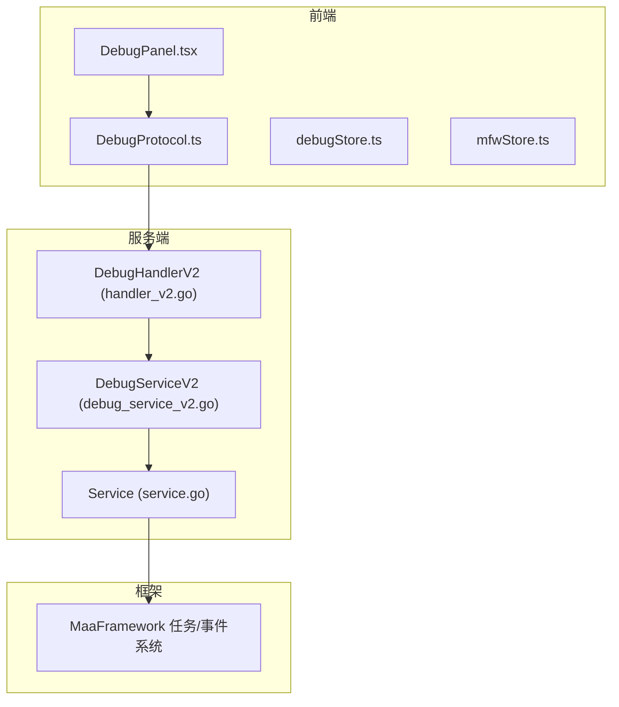
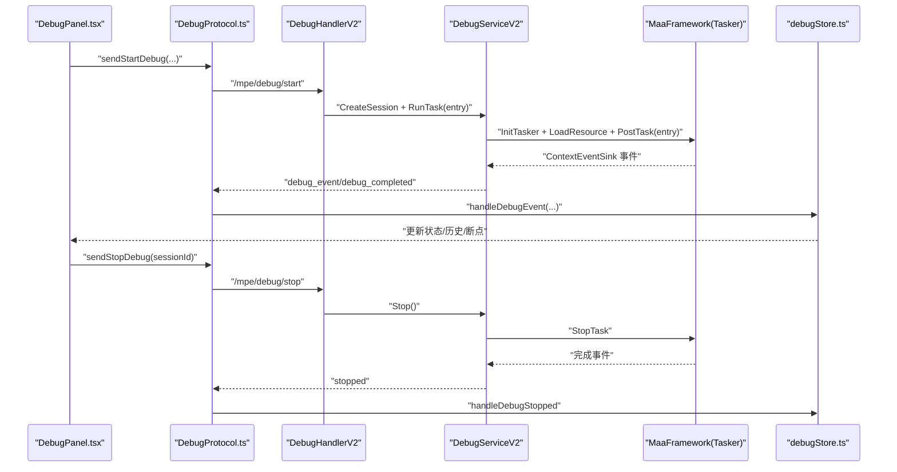
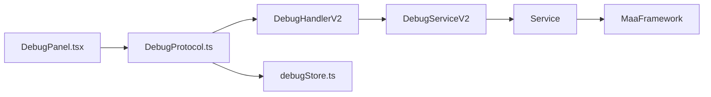

# 调试框架

<cite>
**本文引用的文件列表**
- [debug_service_v2.go](file://LocalBridge/internal/mfw/debug_service_v2.go)
- [handler_v2.go](file://LocalBridge/internal/protocol/debug/handler_v2.go)
- [DebugProtocol.ts](file://src/services/protocols/DebugProtocol.ts)
- [debugStore.ts](file://src/stores/debugStore.ts)
- [DebugPanel.tsx](file://src/components/panels/toolPanels/DebugPanel.tsx)
- [mfwStore.ts](file://src/stores/mfwStore.ts)
- [API参考/任务管理器.md](file://instructions/maafw-golang/API参考/任务管理器.md)
- [API参考/事件系统.md](file://instructions/maafw-golang/API参考/事件系统.md)
- [高级功能/动态流水线构建.md](file://instructions/maafw-golang/高级功能/动态流水线构建.md)
</cite>

## 目录
1. [简介](#简介)
2. [项目结构](#项目结构)
3. [核心组件](#核心组件)
4. [架构总览](#架构总览)
5. [详细组件分析](#详细组件分析)
6. [依赖关系分析](#依赖关系分析)
7. [性能考虑](#性能考虑)
8. [故障排查指南](#故障排查指南)
9. [结论](#结论)
10. [附录](#附录)

## 简介
本文件系统性阐述 MaaPipelineEditor 项目中的“调试框架”，覆盖从前端 UI 到后端服务、从 WebSocket 协议到 MaaFramework 事件回调的全链路实现。调试框架支持：
- 会话化调试：创建/销毁/查询会话，基于会话 ID 的事件路由与状态管理
- 启动/停止/暂停/继续/单步调试：通过动态覆盖 pipeline 的 next/on_error
- 节点级事件上报：识别开始/成功/失败、动作开始/成功/失败、节点执行周期完成/失败
- 识别记录系统：独立的识别记录卡片与详情缓存，支持按 reco_id 懒加载详情
- 执行历史与日志导出：节点级执行历史与识别记录分离，支持文本/JSON 导出
- 前后端协同的调试状态机与 UI 响应

## 项目结构
调试框架由三层构成：
- 前端层：DebugPanel（工具栏）、DebugProtocol（WebSocket 协议）、debugStore（调试状态与历史）
- 服务层：LocalBridge 内部的 DebugHandlerV2（路由与业务）、DebugServiceV2（会话与任务生命周期）
- 框架层：MaaFramework 任务/事件系统

图表来源
- [DebugPanel.tsx](file://src/components/panels/toolPanels/DebugPanel.tsx#L1-L606)
- [DebugProtocol.ts](file://src/services/protocols/DebugProtocol.ts#L1-L696)
- [debugStore.ts](file://src/stores/debugStore.ts#L1-L724)
- [mfwStore.ts](file://src/stores/mfwStore.ts#L1-L134)
- [handler_v2.go](file://LocalBridge/internal/protocol/debug/handler_v2.go#L1-L491)
- [debug_service_v2.go](file://LocalBridge/internal/mfw/debug_service_v2.go#L1-L409)

章节来源
- [DebugPanel.tsx](file://src/components/panels/toolPanels/DebugPanel.tsx#L1-L606)
- [DebugProtocol.ts](file://src/services/protocols/DebugProtocol.ts#L1-L696)
- [debugStore.ts](file://src/stores/debugStore.ts#L1-L724)
- [mfwStore.ts](file://src/stores/mfwStore.ts#L1-L134)
- [handler_v2.go](file://LocalBridge/internal/protocol/debug/handler_v2.go#L1-L491)
- [debug_service_v2.go](file://LocalBridge/internal/mfw/debug_service_v2.go#L1-L409)

## 核心组件
- 调试处理器 V2（DebugHandlerV2）：负责路由 /mpe/debug/* 请求，支持会话管理、调试控制、数据查询
- 调试服务 V2（DebugServiceV2）：封装会话生命周期、任务提交与等待、事件回调与状态维护
- 前端协议（DebugProtocol）：WebSocket 路由注册、事件分发、UI 状态同步
- 前端状态（debugStore）：调试状态机、执行历史、识别记录与详情缓存、日志导出
- 前端面板（DebugPanel）：调试配置、断点管理、调试控制、日志导出与截图

章节来源
- [handler_v2.go](file://LocalBridge/internal/protocol/debug/handler_v2.go#L1-L491)
- [debug_service_v2.go](file://LocalBridge/internal/mfw/debug_service_v2.go#L1-L409)
- [DebugProtocol.ts](file://src/services/protocols/DebugProtocol.ts#L1-L696)
- [debugStore.ts](file://src/stores/debugStore.ts#L1-L724)
- [DebugPanel.tsx](file://src/components/panels/toolPanels/DebugPanel.tsx#L1-L606)

## 架构总览
调试流程从前端发起，经由 DebugProtocol 与 DebugHandlerV2，调用 DebugServiceV2 创建/运行/停止任务，并通过 MaaFramework 的事件系统将节点级事件回推到前端，前端更新 UI 与执行历史。

图表来源
- [DebugPanel.tsx](file://src/components/panels/toolPanels/DebugPanel.tsx#L1-L606)
- [DebugProtocol.ts](file://src/services/protocols/DebugProtocol.ts#L1-L696)
- [handler_v2.go](file://LocalBridge/internal/protocol/debug/handler_v2.go#L1-L491)
- [debug_service_v2.go](file://LocalBridge/internal/mfw/debug_service_v2.go#L1-L409)

## 详细组件分析

### 调试处理器 V2（DebugHandlerV2）
- 路由前缀：/mpe/debug/*
- 支持操作：
  - 会话管理：创建会话、销毁会话、列出会话、获取会话信息
  - 调试控制：启动调试（自动创建会话并运行任务）、运行任务（指定会话）、停止调试
  - 数据查询：获取节点数据、截图
- 错误处理：统一发送 /lte/debug/error

章节来源
- [handler_v2.go](file://LocalBridge/internal/protocol/debug/handler_v2.go#L1-L491)

### 调试服务 V2（DebugServiceV2）
- 会话管理：
  - 创建会话：获取控制器、加载资源、初始化 Tasker、注册事件监听器、保存会话
  - 获取/销毁/列举会话：线程安全的会话表管理
- 调试控制：
  - 运行任务：校验入口节点、提交任务、异步等待完成、发送完成/错误事件
  - 停止调试：调用 StopTask，重置状态
- 状态查询：
  - 获取状态、当前节点、上一个节点、暂停原因、最后一个错误、已执行节点统计
- 事件处理：
  - 记录节点开始/完成时间、计算耗时、转发事件给前端

章节来源
- [debug_service_v2.go](file://LocalBridge/internal/mfw/debug_service_v2.go#L1-L409)

### 前端协议（DebugProtocol）
- 注册 /lte/debug/* 路由，处理事件、错误、完成、启动/停止/运行响应
- 将后端事件转换为前端可消费的数据结构，驱动 debugStore 更新
- 提供 sendStartDebug/sendStopDebug 等方法

章节来源
- [DebugProtocol.ts](file://src/services/protocols/DebugProtocol.ts#L1-L696)

### 前端状态（debugStore）
- 调试状态机：idle/preparing/running/paused/completed
- 执行历史：每条记录对应一次完整的节点执行周期，包含节点名/ID、开始/结束时间、耗时、状态、runIndex
- 识别记录系统：独立的识别记录卡片，支持按 reco_id 懒加载详情并缓存
- 日志导出：支持文本/JSON 导出

章节来源
- [debugStore.ts](file://src/stores/debugStore.ts#L1-L724)

### 前端面板（DebugPanel）
- 调试配置：资源路径、入口节点、控制器、日志级别
- 断点管理：设置/移除/清空断点
- 调试控制：开始/停止（V2 使用会话 ID）
- 日志导出：文本/JSON 下载
- 与 mfwStore 协作，确保控制器连接状态与调试按钮可用性

章节来源
- [DebugPanel.tsx](file://src/components/panels/toolPanels/DebugPanel.tsx#L1-L606)
- [mfwStore.ts](file://src/stores/mfwStore.ts#L1-L134)

## 依赖关系分析
- 前端依赖后端协议与状态管理，后端依赖服务层与框架层
- DebugHandlerV2 依赖 DebugServiceV2；DebugServiceV2 依赖 Service（初始化/释放 MaaFramework）
- 事件系统通过 ContextEventSink 将节点级事件回推到前端，前端通过 DebugProtocol 路由分发

图表来源
- [DebugPanel.tsx](file://src/components/panels/toolPanels/DebugPanel.tsx#L1-L606)
- [DebugProtocol.ts](file://src/services/protocols/DebugProtocol.ts#L1-L696)
- [handler_v2.go](file://LocalBridge/internal/protocol/debug/handler_v2.go#L1-L491)
- [debug_service_v2.go](file://LocalBridge/internal/mfw/debug_service_v2.go#L1-L409)

章节来源
- [DebugProtocol.ts](file://src/services/protocols/DebugProtocol.ts#L1-L696)
- [handler_v2.go](file://LocalBridge/internal/protocol/debug/handler_v2.go#L1-L491)
- [debug_service_v2.go](file://LocalBridge/internal/mfw/debug_service_v2.go#L1-L409)

## 性能考虑
- 事件回调：MaaFramework 事件系统采用统一回调注册与分发，回调 ID 生成与全局表使用读写锁，读多写少场景下具备较好并发性能
- 任务等待：PostTask 返回 TaskJob，Wait 阻塞等待任务完成；调试场景中 DebugServiceV2 异步等待并发送完成事件，避免 UI 阻塞
- 截图与 Base64 编码：控制器截图后编码为 Base64，前端直接渲染，注意大图传输带来的带宽与内存压力
- 识别详情懒加载：通过 reco_id 按需获取并缓存，减少一次性数据传输

章节来源
- [API参考/事件系统.md](file://instructions/maafw-golang/API参考/事件系统.md#L1-L550)
- [API参考/任务管理器.md](file://instructions/maafw-golang/API参考/任务管理器.md#L1-L353)

## 故障排查指南
- 启动失败
  - 检查 MFW 是否初始化成功、资源路径与入口节点是否有效、控制器是否连接
  - 查看 /lte/debug/error 响应与前端错误提示
- 事件未到达
  - 确认已注册 ContextEventSink，检查 Tasker 是否绑定资源/控制器
  - 核对事件名称与 detail 字段是否匹配前端处理逻辑
- 暂停/继续无效
  - 确认 task_id 与当前会话一致，检查 StopTask 是否成功
- 单步执行未断点
  - 确认 next_nodes 与断点列表已正确转换为 pipeline 名称，且 PipelineEngine 校验通过
- 日志导出
  - 使用 debugStore 的导出方法，检查 executionHistory 与 recognitionRecords 是否为空

章节来源
- [handler_v2.go](file://LocalBridge/internal/protocol/debug/handler_v2.go#L1-L491)
- [debug_service_v2.go](file://LocalBridge/internal/mfw/debug_service_v2.go#L1-L409)
- [DebugProtocol.ts](file://src/services/protocols/DebugProtocol.ts#L1-L696)
- [debugStore.ts](file://src/stores/debugStore.ts#L1-L724)

## 结论
调试框架通过前后端协同与 MaaFramework 事件系统，实现了从会话管理、断点/单步到节点级事件回推的完整闭环。前端提供直观的工具栏与状态机，后端负责会话生命周期与动态覆盖，形成可扩展、可观测、可导出的日志体系。建议在生产环境中：
- 严格校验断点与入口节点
- 合理使用截图模式，避免不必要的带宽与内存消耗
- 在回调中避免阻塞操作，必要时异步处理
- 使用日志导出辅助问题定位与回归分析

## 附录
- 事件系统参考：[API参考/事件系统.md](file://instructions/maafw-golang/API参考/事件系统.md#L1-L550)
- 任务管理器参考：[API参考/任务管理器.md](file://instructions/maafw-golang/API参考/任务管理器.md#L1-L353)
- 动态流水线构建参考：[高级功能/动态流水线构建.md](file://instructions/maafw-golang/高级功能/动态流水线构建.md#L1-L360)